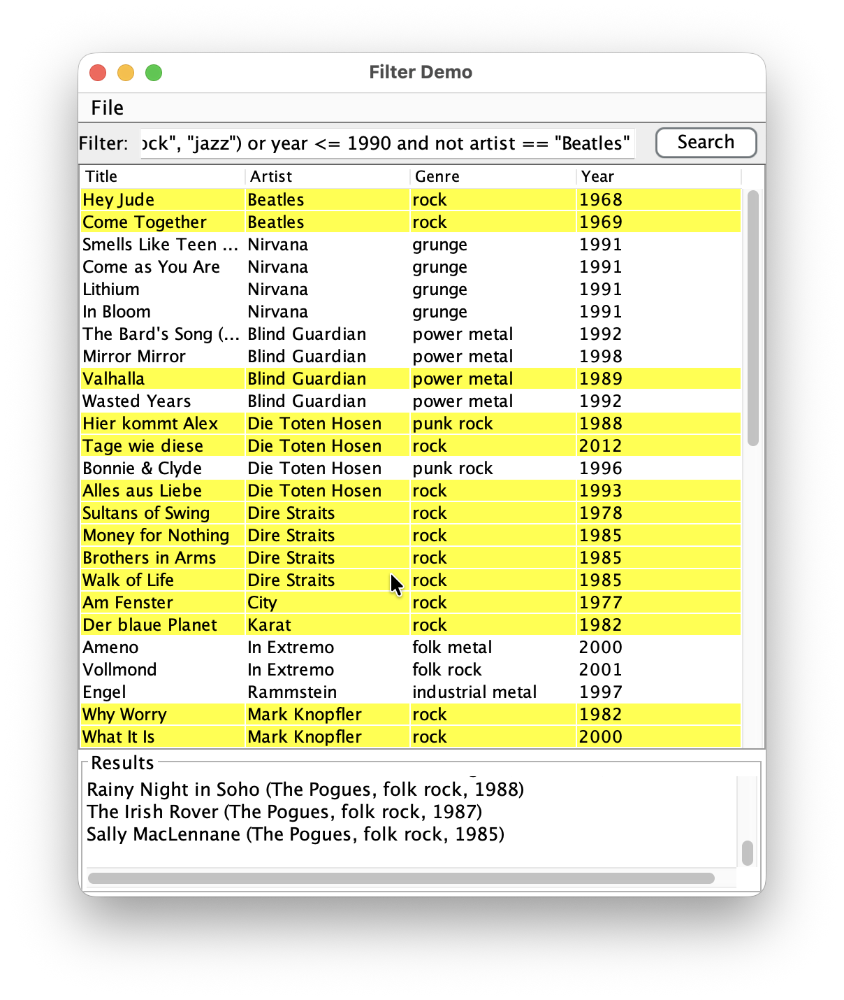
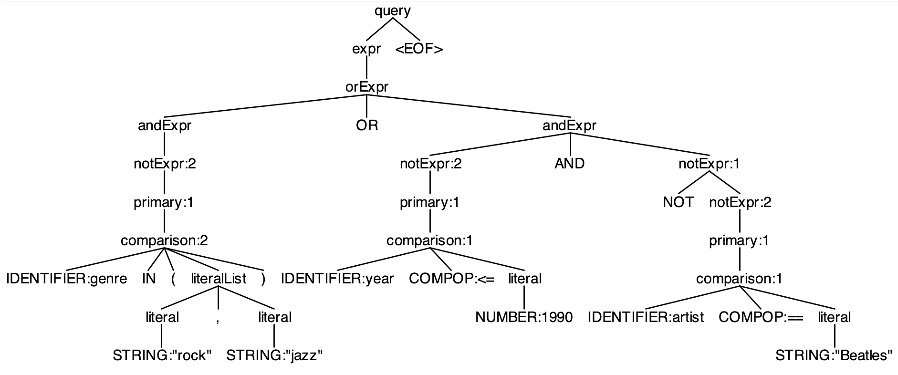

# Zusammenfassung


Wir wollen eine kleine Songliste erstellen und nach unseren Lieblingssongs filtern.

Betrachten Sie dazu das Repo
["Filter-DSL"](https://github.com/Programmiermethoden-CampusMinden/prog2_ybel_filterdsl).


## Basismodellierung

Die Songs werden über ein Record `filter.model.MediaItem` repräsentiert, welches auch gleich noch Methoden zum Einlesen bereitstellt:

```java
public record MediaItem(String title, String artist, Genre genre, int year) {

    /** file system (e.g. JFileChooser) */
    public static List<MediaItem> loadFromPath(Path path);

    /** classpath resource (src/main/resources) */
    public static List<MediaItem> loadFromResource(String resourcePath);
}
```

Im Ressourcen-Verzeichnis `src/main/resources/` liegt die Datei `songlist.txt`, welche bereits einige Songs enthält.

Zum Anzeigen der Liste gibt es eine kleine GUI: `filter.app.FilterApp`:



## Filter-DSL

Die Suche erfolgt über eine **kleine Filtersprache**. Die Grammatik dazu finden Sie in `Filters.g4`. Darüber lassen sich verschiedene, unterschiedlich komplexe Suchausdrücke ("Queries") formulieren, etwa:

- `artist == "Beatles"`
- `year == 1965`
- `artist == "Beatles" and year == 1965`
- `genre in ("rock", "jazz") or year <= 1990 and not artist == "Beatles"`

``` antlr
primary  : comparison | '(' expr ')' ;
comparison
         : IDENTIFIER op=COMPOP value=literal
         | IDENTIFIER IN '(' literal (',' literal)* ')'
         ;
literal  : STRING | NUMBER ;
COMPOP   : '==' | '!=' | '<' | '<=' | '>' | '>=' ;
```

Zum Bilden von Ausdrücken wird eine Variable mit einem Wert verglichen:  `artist == "Beatles"`, `year < 1965`, ... Hierzu stehen die üblichen Vergleichsoperatoren zur Verfügung. Alternativ kann mit einem `in`-Ausdruck eine Variable mit den Werten in einer geklammerten Liste verglichen werden: `genre in ("rock", "jazz", "metal", "grunge")`. Der Ausdruck wird wahr, wenn die Variable `genre` einen der in der Liste aufgezählten Werte hat.

Ausdrücke können auch geklammert werden, d.h. `(artist == "Beatles")` ist ein gültiger Ausdruck.

```antlr
expr    : orExpr ;

orExpr  : andExpr (OR andExpr)* ;
andExpr : notExpr (AND notExpr)* ;
notExpr : NOT notExpr | primary ;
```

Zum Bilden komplexerer Ausdrücke stehen zusätzlich noch die Operatoren `and`, `or` und `not` zur Verfügung:

-   `and`: `year <= 1990 and artist == "Beatles"`. Mit `and` lassen sich zwei Ausdrucke `UND`-verknüpfen, d.h. beide Teilausdrücke links und rechts müssen wahr sein, damit der gesamte Ausdruck wahr wird.
-   `or`: `artist == "Beatles" or year <= 1965`. Mit `or` lassen sich zwei Ausdrucke `ODER`-verknüpfen, d.h. mindestens einer der Teilausdrücke links und rechts muss wahr sein, damit der gesamte Ausdruck wahr wird.
-   `not`: `not artist == "Beatles"`. Mit `not` wird der Ausdruck negiert, d.h. der Ausdruck unter dem `not` muss falsch sein, damit der gesamte Ausdruck wahr wird.

Über die Grammatik `Filter.g4` sind Vorrangregeln für die Ausdrücke definiert. Am stärksten binden die Vergleichsoperatoren und die Klammern um Ausdrücke, gefolgt von `not`, `and` und `or` (in dieser Reihenfolge). Die Query `genre in ("rock", "jazz") or year <= 1990 and not artist == "Beatles"` entspricht also dieser vollständig geklammerten Variante `(genre in ("rock", "jazz")) or ((year <= 1990) and (not (artist == "Beatles")))`.

Für diese Grammatik erzeugt ANTLR wieder einen Lexer und Parser und die Basisklassen für das Visitorpattern. Das Zusammenstecken der ANTLR-Klassen brauchen Sie nicht mehr erledigen. Es gibt in der Klasse `filter.ast.builder.Ast` bereits die Methoden  `FilterParser.QueryContext parse(String query)`, um eine Query wie `artist == "Beatles"` zu parsen und in einen Parse-Tree zu verwandeln, sowie `Expr from(String query, Supplier<? extends FilterAstBuilder> supplier)`, um in einem Schritt das Parsing zu erledigen und über den injizierten `FilterAstBuilder` einen deutlich reduzierten Baum (den sogenannten *Abstract Syntax Tree*, AST) zu erzeugen. Die Modellierung für den AST ist ebenfalls bereits vorgegeben (Klassen im Package `filter.ast.nodes`).

## AST

Der von ANTLR erzeugte Parse-Tree ist oft sehr groß und enthält in den einzelnen Zweigen jeweils alle dort durchlaufenen Regeln der Grammatik. Bei der späteren Verarbeitung stört das oft, so dass man aus dem Parse-Tree eine deutlich komprimierte Version erzeugt, den Abstract Syntax Tree (*AST*).

Beispielsweise würde für den Filterausdruck `genre in ("rock", "jazz") or year <= 1990 and not artist == "Beatles"` und der Grammatik `Filter.g4` der folgende Parse-Tree
aufgebaut werden:



Genauer Betrachtung stellt man fest, dass nach erfolgreichem Abschluss der Parsing-Phase viele der Zwischenknoten redundant oder überflüssig sind und man den Baum in eine deutlich kompaktere Form transformieren kann:

```
Or
  InList genre
    - "rock"
    - "jazz"
  And
    Comparison year <= 1990
    Not
      Comparison artist == "Beatles"
```


Die Modellierung des AST ist nicht trivial und hängt stark vom Verwendungszweck ab. Für Prog2 sind die Klassen für den AST bereits vorgeben im Package `filter.ast.nodes`:

```java
package filter.ast.nodes;

public sealed interface AstNode permits Expr, Value {}

public sealed interface Expr extends AstNode {
  record And(Expr left, Expr right) implements Expr {}
  record Or(Expr left, Expr right) implements Expr {}
  record Not(Expr inner) implements Expr {}
  record Comparison(String field, CompOp op, Value value) implements Expr {}
  record InList(String field, List<Value> values) implements Expr {}
}

public sealed interface Value extends AstNode {
  record String(java.lang.String text) implements Value {}
  record Number(int value) implements Value {}
}

public enum CompOp {
  EQ { public String toString() { return "=="; } },
  NE { public String toString() { return "!="; } },
  LT { public String toString() { return "<"; } },
  LE { public String toString() { return "<="; } },
  GT { public String toString() { return ">"; } },
  GE { public String toString() { return ">="; } };
}
```

Der gemeinsame Obertyp für alle Knoten im Baum ist `AstNode`. Ein `AstNode` kann entweder ein `Value` (Wert) oder eine `Expr` (Ausdruck) sein. Es gibt zwei Arten von Werten in `Value`: `String` und `Number`^[Achtung: Nicht mit den Klassen aus dem JDK verwechseln!]. Es gibt außerdem die Klassen zur Repräsentation der verschiedenen Ausdrücke in `Expr`.

Damit lassen sich die Parse-Trees zu `Filter.g4` in deutlich kompaktere Strukturen übersetzen mit gleichwertiger Bedeutung. Zwei Punkte verdienen besondere Beachtung:

1. In der Grammatik können die `and`- und `or`-Ausdrücke mit beliebig vielen Vergleichen gebildet werden, d.h. `year <= 1990`, `year <= 1990 and artist == "Beatles"` und `year <= 1990 and artist == "Beatles" and year > 1990` etc. wären gültige Ausdrücke. In der AST-Struktur haben die `And`- und `Or`-Knoten jeweils genau zwei Kinder. Dies muss passend übertragen werden:
    - Ein Kind im `and`- oder `or`-Ausdruck: `Comparison`
    - Zwei Kinder im `and`- oder `or`-Ausdruck: `And` oder `Or`
    - Mehr Kinder im `and`- oder `or`-Ausdruck: Geeignet klammern und dann in die `And`- bzw. `Or`-Knoten übersetzen, d.h. aus `year <= 1990 and artist == "Beatles" and year > 1990` wird im AST `(year <= 1990 and artist == "Beatles") and year > 1990`
2.  Klammern werden nicht explizit im AST repräsentiert. Die Klammerung wird über die Tiefe im Baum ausgedrückt: Je weiter innen die Klammerung, um so tiefer im Baum taucht der Knoten auf. Beispiel:

    `(year <= 1990 or artist == "Beatles") and year > 1990`

    ```
    And
        Or
            Comparison year <= 1990
            Comparison artist == "Beatles"
        Comparison year > 1990"
    ```


Den AST erhält man, indem man den **Parse-Tree traversiert** (Visitor-Pattern oder manuell über Pattern Matching) und dabei die kompaktere Baum-Version erzeugt. Dazu sind die Klassen `filter.ast.builder.AstBuilderVisitor` und `filter.ast.builder.AstBuilderPattern` angelegt. Diese fertig zu programmieren ist Ihre Aufgabe.

## Ausgabe und Evaluierung

Im Package `filter.ast.printer` finden Sie einen vordefinierten Pretty-Printer `AstPrinter`, der einen AST mit der Methode `String toString(Expr expr)` in einen geklammerten String konvertiert.

Zusätzlich gibt es in `filter.ast.eval` einen `Evaluator`. Mit der Methode `boolean matches(MediaItem item, Expr expr)` wird geprüft, ob ein konkreter Song (`MediaItem item`) zu einer Query gegeben als AST (`Expr expr`) passt.

Im Package `filter.app` gibt es eine fertige `FilterApp`. Dies ist eine Swing-GUI mit einem Menü zum Laden einer Textdatei mit Medien-Einträgen im CSV-Format und der Anzeige der Songs in einer editier- und sortierbaren Tabelle. Es gibt ein Eingabefeld für die Filter-Query. Die Treffer werden im Ergebnisbereich ausgegeben sowie in der Tabelle farblich hervorgehoben. (**Wichtig**: Die Filterung funktioniert natürlich erst, wenn Sie die AST-Builder implementiert haben.)


# Aufgaben

### Aufgabe 1: JUnit-Testfälle

Bevor wir an die AST-Builder gehen, definieren Sie sich eine Reihe von relevanten Testfällen (JUnit). Nutzen Sie dazu die leere Klasse `filter.ast.AstTest`.

### Aufgabe 2: AST-Builder mit dem Visitor-Pattern

Sie finden im Package `filter.ast.builder` die vorbereitete Klasse `AstBuilderVisitor`, die von dem durch ANTLR generierten Basisvisitor `FilterBaseVisitor<Void>` ableitet und den AST durch den Einsatz des Visitor-Patterns erzeugt. Die relevanten Methoden sind bereits vorgegeben - Füllen Sie diese nun noch mit Leben.

TODO: Hinweis auf zustandsbehafteten Visitor (wie in Vorlesung): Visitor ist MiniJavaBaseVisitor<Void> und arbeitet nur mit Seiteneffekten (Felder, Listen, Stacks)
TODO: Hinweis auf Abarbeitung: Kinder traversieren, Werte von den entsprechenden Stacks holen, verarbeiten, Ergebnis auf den passenden Stack pushen

### Aufgabe 3: AST-Builder mit manueller Traversierung und Pattern Matching

Sie finden im Package `filter.ast.builder` die vorbereitete Klasse `AstBuilderPattern`, die eine manuelle Traversierung des Parse-Trees durchführen soll und dabei Pattern Matching auf Typen einsetzen soll und so den AST aufbaut. Die relevanten Methoden sind auch hier bereits vorgegeben - implementieren Sie diese und nutzen Sie `switch/case` auf Klassen/Records/Enums.

### Aufgabe 4: Vergleich

Vergleichen Sie die beiden AST-Builder miteinander. Was sind aus Ihrer Sicht jeweils die Vor- und Nachteile der beiden Varianten?


### Aufgabe 5: Approval Testing

Für das Überprüfen der durch die Builder generierten AST mit der Zielvorstellung ("Orakel") muss man das Orakel mühsam von Hand durch das verschachtelte Erzeugen von Objekten aufbauen. Beispielsweise wäre für die einfache Query `artist == "Beatles" and year == 1965` der erwartete AST bereits recht umständlich formuliert:

```java
var expr =
    new Expr.And(
        new Expr.Comparison("artist", CompOp.EQ, new Value.String("Beatles")),
        new Expr.Comparison("year", CompOp.GE, new Value.Number(1965)));
```


Hier bietet sich Approval Testing an - übersetzen Sie die von Ihren Buildern erzeugten Bäume mit Hilfe des vorimplementierten Printers `filter.ast.printer.AstPrinter` in einen String (Methode `String toString(Expr expr)`) und nutzen Sie Approval Testing für die Definition des Orakels. Setzen Sie dazu die Bibliothek [ApprovalTests.Java](https://github.com/approvals/ApprovalTests.Java) ein.

Schreiben Sie sich verschiedene Approval Tests mit unterschiedlich komplexen Query-Ausdrücken (unterschiedlich resultierenden komplexen AST), und vergleichen Sie auch die beiden Builder-Varianten miteinander. Nutzen Sie die leere Klasse `filter.ast.ApprovalTest`.


### Aufgabe 6: Property-based Testing

Formulieren Sie verschiedene Eigenschaften für die AST-Builder.

Beispielsweise sollte ein "Roundtrip" für jeweils beide Builder (individuell, aber auch verschränkt) möglich sein: `AST -> Pretty-Print -> Parsing -> AST`. Sie könnten mit einer festen, selbstdefinierten Query starten oder als Parameter für einen Property-Test mit `jqwik` die in der Klasse `filter.ast.RoundtripPropertiesTest` vordefinierten Arbitraries nutzen: `@Property boolean foo(@ForAll("simpleQueries") String query) {...}`.

Treffen Sie zusätzlich Annahmen über Expressions und Values.

Implementieren Sie diese Property Tests in der Klasse `filter.ast.RoundtripPropertiesTest`.

TODO
- Mini-AST-Generatoren für jqwick vorgeben


# Bearbeitung und Abgabe

-   Bearbeitung: Einzelbearbeitung
-   Abgabe Post Mortem [im
    ILIAS](https://www.hsbi.de/elearning/goto.php/exc/1664006): bis **22. Juni,
    08:00 Uhr**
-   Vorstellung im Praktikum: 22./24. Juni
