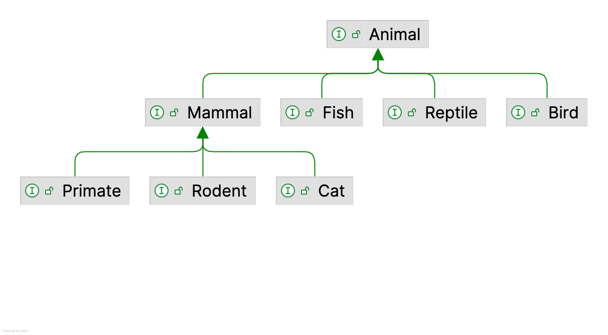

# Zusammenfassung

Sie modellieren auf diesem Blatt einen kleinen Zoo in Java.

Zunächst steht das Erstellen einer **Typhierarchie** mit *sealed types* / *records*
und der Einsatz von **Generics** im Vordergrund. Anschließend erweitern Sie dieses
Modell um:

-   sinnvolle **Zustandsänderungen** (Tiere aufnehmen, umsetzen, abgeben),
-   **Logging** der ausgeführten Aktionen,
-   sowie den Einsatz der **Stream-API**.

Ziel ist es, dass Sie die im Kurs behandelten Konzepte **eigenständig auf ein
kleines, aber zusammenhängendes Beispiel anwenden**.

# Aufgaben

## Aufgabe 1: Zoo

### Aufgabe 1.1: Tier-Hierarchie modellieren mit nicht-generischen Klassen

Modellieren Sie die im Diagramm gezeigte stark vereinfachte Hierarchie von
Tierarten:

{width="60%"}

Nutzen Sie dabei *sealed interfaces*.

Erstellen Sie für jedes dieser Interfaces jeweils zwei Record-Klassen, die konkrete
Mitglieder der jeweiligen Tier-Klasse bzw. -Familie[^1] repräsentieren und die
jeweils das Interface implementieren. Beispielsweise könnte eine Forelle eine Art in
der Klasse der Fische sein, d.h. die Java-Klasse `Trout` könnte das Interface `Fish`
implementieren.

Geben Sie den Tieren jeweils mindestens einen Namen (z.B. `String name`) als
Attribut.

::: important
Nutzen Sie `permits` in Ihren `sealed`-Deklarationen so, dass nur die von Ihnen
gewünschten Implementierungen erlaubt sind.
:::

::: tip
Da wir hier keine Java-Module verwenden, müssen alle Klassen und Interfaces, die in
einer `sealed`-Hierarchie über `permits` verbunden sind, im gleichen Package liegen,
z.B. `zoo.animal`. Unterpakete wie `zoo.animal.birds` sind deshalb für `sealed` hier
nicht möglich.
:::

### Aufgabe 1.2: Generische Gehege definieren als generische Klassen

Definieren Sie zur Repräsentation eines Geheges eine generische Klasse `Enclosure`
mit einer Typ-Variablen. Stellen Sie durch geeignete Beschränkung der Typ-Variablen
sicher, dass nur Gehege mit von `Animal` abgeleiteten Typen gebildet werden können.

Anforderungen:

-   Jedes Gehege hat:

    -   einen eindeutigen Namen (`String name`), sowie
    -   eine geeignete Sammlung seiner Bewohner.

-   Kein Tier kann in einem Gehege mehrfach vorkommen. Lösen Sie dies durch die
    Auswahl einer geeigneten inneren Datenstruktur und begründen Sie Ihre Wahl kurz.

-   Implementieren Sie Methoden wie:

    -   `boolean add(T animal)`
    -   `boolean remove(T animal)`
    -   `List<T> getInhabitants()`

### Aufgabe 1.3: Spezialisierte Gehege

Definieren Sie spezialisierte Gehege, die die Typhierarchie widerspiegeln:

-   ein `Aquarium`, welches von `Fish` abgeleitete Tiere beherbergen kann,
-   ein `Terrarium` für von `Reptile` abgeleitete Tiere,
-   ein `MammalHouse` für Säugetiere (`Mammal`), sowie
-   ein `CatHouse`, welches nur Objekte einer konkreten vom Interface `Cat`
    abgeleiteten Klasse zulässt.

### Aufgabe 1.4: Zoo-Verwaltung

Implementieren Sie eine Klasse `Zoo`, welche eine Liste mit Tier-Gehegen verwaltet.

Implementieren Sie folgende Methoden:

1.  `addEnclosure` zum Hinzufügen eines neuen Tier-Geheges

2.  `getEnclosures` liefert eine Liste aller Gehege im Zoo zurück

3.  `findEnclosureByName` gibt das erste gefundene Gehege mit diesem Namen aus dem
    Zoo zurück (oder `null`, wenn nicht gefunden)

4.  `getAllAnimals` gibt eine Liste aller Tiere in allen Gehegen zurück

5.  `getAllMammals` gibt eine Liste aller Tiere in allen Gehegen zurück, deren Typ
    eine Subclass-Beziehung zu `Mammal` hat

6.  `getAnimalsByPredicate` zum Zurückgeben aller Tiere in den Gehegen, die dem
    übergebenen Prädikat `Predicate<Animal>` genügen

7.  `countAnimalsByType`, die für jeden Tiertyp zählt, wieviele Objekte dieser Art
    im Zoo sind

8.  `getOvercrowdedEnclosures` gibt eine Liste aller Gehege zurück, die mehr Tiere
    enthalten, als der Parameter angibt

9.  `String summary()` erstellt eine kurze textuelle Zusammenfassung des aktuellen
    Zoo-Zustands erzeugt, z.B.:

    > Zoo mit 3 Gehegen und 12 Tieren: 5 Mammals, 4 Birds, 3 Fish

Nutzen Sie dabei die **Stream-API**, z.B. zum Durchlaufen aller Gehege und Tiere.
Nutzen Sie hier geeignet `filter`, `map`, `flatMap`, `toList` und/oder `collect` mit
`Collectors.groupingBy`, `Collectors.toList`, `Collectors.joining`,
`Collectors.counting` o.ä.

::: important
Wählen Sie die Parameter und Rückgabetypen geeignet und begründen Sie Ihre Wahl
kurz.
:::

::: tip
Wenn Sie bereits `Optional<T>` kennen, können Sie bei `findEnclosureByName` gern
damit arbeiten. Ansonsten geben Sie beim Nichtfinden des gesuchten Geheges zunächst
klassisch `null` zurück.
:::

::: tip
Zu jeder Klasse können Sie sich das passende `Class<T>`-Objekt geben lassen:
`MyClass.class`. Darauf stehen Ihnen dann Operationen wie
`boolean isInstance(Object obj)` oder `T cast(Object obj)` zur Verfügung.
:::

## Aufgabe 2: Logging

Fügen Sie nun **Logging** mit `java.util.logging`hinzu, um alle Zoo-Aktionen von
außen nachvollziehbar zu machen.

Legen Sie dazu in `Zoo` einen Logger an und loggen Sie in jeder `public`
`Zoo`-Methode:

-   auf Level `INFO` den Start/Aufruf der Methode mit den relevanten Parametern,
-   auf Level `FINE` eine kurze Zustandszusammenfassung nach erfolgreicher
    Ausführung einer Methoden (z.B. Anzahl Tiere im Zoo),
-   auf Level `WARNING`, wenn ein angefordertes Tier oder Gehege nicht gefunden
    wird, und
-   auf Level `SEVERE` bei schwerwiegenden Inkonsistenzen.

Demonstrieren Sie in einer Demo-Main, wie Sie das Log-Level für Ihren Logger gezielt
umschalten können.

## Aufgabe 3: Reflektion

Beantworten Sie die folgenden Fragen kurz und prägnant (Stichpunkte sind
ausreichend). Geben Sie Ihre Antworten zusammen mit Ihrem Code in Ihrem Repo ab
(z.B. im `README.md`).

1.  Generics
    -   Wo helfen Ihnen die Generics im Zoo-Szenario, Fehler bereits zur
        Compile-Zeit zu vermeiden?
    -   Nennen Sie ein Beispiel aus Ihrer Implementierung, bei dem falsche
        Tier-Gehege-Kombinationen durch den Typchecker verhindert werden.
2.  Logging
    -   Warum ist systematisches Logging mit einem Logger und Log-Leveln für ein
        Zoo-Management-System sinnvoller als Ausgaben mit `IO.println`?
    -   In welchen Situationen würden Sie in Ihrem System die Log-Level `INFO`,
        `WARNING` und ggf. `SEVERE` verwenden?
3.  Streams
    -   Wo haben Ihnen Streams im Vergleich zu klassischen Schleifen beim
        Formulieren Ihrer Abfragen geholfen? Wo wurde es eher unübersichtlich?

# Bearbeitung und Abgabe

-   Bearbeitung: Einzelbearbeitung
-   Abgabe Post Mortem [im
    ILIAS](https://www.hsbi.de/elearning/goto.php/exc/1664006): bis **29. Juni,
    08:00 Uhr**
-   Vorstellung im Praktikum: 29. Juni / 01. Juli

[^1]: Ok, wir machen hier Informatik. Vermutlich ist die Biologie nicht ganz korrekt
    ;-)
