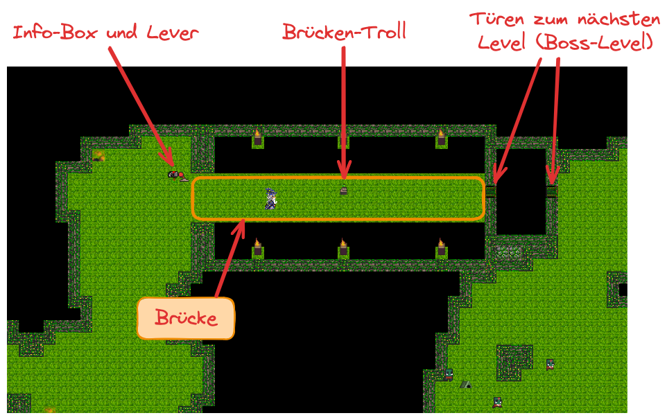

# Zusammenfassung

Auf diesem Blatt üben Sie den Umgang mit regulären Ausdrücken in Java. Wir nutzen
diese zusammen mit dem Template-Method-Pattern für die Implementierung eines
einfachen Syntax-Highlightings, und im DevDungeon müssen Sie mit einem Brücken-Troll
kämpfen und das Command-Pattern implementieren.

::: important
**Hinweis**: Bitte denken Sie daran, dass Sie spätestens seit Blatt 04 die
Bearbeitung der Aufgaben in Ihren öffentlich sichtbaren Git-Repos durchführen
sollen.

Erstellen Sie für **alle** Ihre Lösungen passende Pull-Requests gegen **Ihre eigenen
Repos** (auch wenn dies nicht explizit in den Aufgaben gefordert wird).

Die Links zu Ihren Pull-Requests mit den Lösungen geben Sie bitte immer in Ihrem
*Post Mortem* mit an.
:::

# Aufgaben

## DevDungeon: Brücken-Troll

Klonen Sie das Projekt
[DevDungeon](https://github.com/Dungeon-CampusMinden/dev-dungeon) und laden Sie es
in Ihrer IDE als Gradle-Projekt. Betrachten Sie das Sub-Projekt "devDungeon". Dies
ist ein von einem Studierenden ([\@Flamtky](https://github.com/Flamtky)) erstelltes
Spiel mit mehreren Leveln, in denen Sie spielerisch verschiedene Aufgaben *in-game*
und *ex-game* lösen müssen.

Starten Sie den DevDungeon mit `./gradlew devDungeon:runDevDungeon`. Spielen Sie
sich für diese Aufgabe durch das **vierte Level** ("Bridge Guard Riddle")[^1].

In diesem Level gibt es im oberen Teil eine Art Brücke, die von einem Brücken-Troll
bewacht wird.

{width="80%"}

Diesen müssen Sie besiegen, um die Brücke passieren und die Belohnung (einen
magischen Schild) zu bekommen. Den Schild können Sie im nächsten Level gut
gebrauchen: Der Schild schützt Ihren Hero vor Schäden, auch wenn er nur einen
Treffer verträgt und sich dann über eine gewisse Zeit regenerieren muss, bevor er
wieder funktionstüchtig ist.

*Hinweis*: Sie können natürlich wie immer auch "außen herum" gehen und die Brücke
vermeiden, um ins nächste Level zu kommen. Das ist aber ziemlich gefährlich, und Sie
bekommen den magischen Schild nicht, den Sie für das letzte Level ziemlich dringend
brauchen.

**Hinweis**: Aktuell ist das Projekt DevDungeon an einigen Stellen noch
*Work-in-Progress*, beispielsweise fehlt häufig noch die Javadoc. Alle Gradle-Tasks,
die von Checkstyle-Tasks abhängen (`checkstyleMain`, `check`, `build`, ...) werden
deshalb fehlschlagen. Sie können den DevDungeon aber wie oben beschrieben mit
`./gradlew devDungeon:runDevDungeon` (bzw. über den Task `devDungeon:runDevDungeon`
aus der IDE heraus) starten.

**WICHTIG**: Achten Sie bitte darauf, dass im Projektpfad **keine Leerzeichen** und
keine Sonderzeichen (Umlaute o.ä.) vorkommen! Dies kann zu seltsamen Fehler führen.
Bitte auch darauf achten, dass Sie als JDK ein **Java SE 21 (LTS)** verwenden. Unter
Windows ist der Einsatz von
[WSL](https://learn.microsoft.com/en-us/windows/wsl/install) empfehlenswert.

### RegExp mit dem Brücken-Troll

Suchen Sie den Brücken-Troll auf und sprechen Sie ihn an. Er wird Ihnen eine Reihe
von Fragen zum Thema reguläre Ausdrücke stellen, die Sie korrekt beantworten müssen.

Machen Sie Screenshots von den Fragen und Ihren Antworten, die Sie im Praktikum
vorstellen und diskutieren.

### Command-Pattern mit der Klasse *BridgeControlCommand*

Leider lässt sich der Brücken-Troll offenbar weder durch Diskussion noch durch Kampf
besiegen. Aber vielleicht können Sie die Brücke "aufmachen", so dass er in die Tiefe
stürzt? Die *Tiles* der Brücke bestehen aus sogenannten `PitTile`s: Wenn diese offen
sind, fällt man hindurch; wenn sie geschlossen sind, kann man gefahrlos darauf
treten (außer, es ist eine Verzögerung aktiviert :-) ... Allerdings müssten Sie
danach die Brücke auch wieder schließen, um selbst darüber hinweg laufen zu können
...

Schauen Sie sich die Info-Box am Eingang zur Brücke an. Der Hebel bedient mit Hilfe
des Command-Patterns die Brücke. Für die *Commands* gibt es die Klasse
`BridgeControlCommand` im Package `entities.levercommands`, wobei die Methode
`BridgeControlCommand#execute` das *Command* ausführt und die Methode
`BridgeControlCommand#undo` das *Command* wieder rückgängig macht.

Implementieren Sie die beiden Methoden und starten Sie das Spiel erneut.

**Hinweis**: Mit der Methode `Game.currentLevel().tileAt()` können Sie auf ein
`Tile` an einer bestimmte Koordinate zugreifen.

## Syntaxhighlighting mit RegExp

Klonen Sie die [Vorgaben "Syntax
Highlighting"](https://github.com/Programmiermethoden-CampusMinden/prog2_ybel_highlighting)
und laden Sie das Projekt als Gradle-Projekt in Ihre IDE.

Im Package `highlighting` finden Sie einige Klassen, mit denen man ein einfaches
Syntax Highlighting durchführen kann. Dazu arbeitet der Lexer mit sogenannten
"Token" (Instanzen der Klasse `Token`). Diese haben einen regulären Ausdruck, um
bestimmte Teile im Code zu erkennen, beispielsweise Keywords oder Kommentare und
anderes. Der Lexer wendet alle Token auf den aktuellen Eingabezeichenstrom an
(Methode `Token#test()`), und die Token prüfen mit "ihrem" regulären Ausdruck, ob
die jeweils passende Eingabesequenz vorliegt. Die regulären Ausdrücke übergeben Sie
dem `Token`-Konstruktor als entsprechendes `Pattern`-Objekt.

-   Die Klasse `Token` speichert dazu ein `Pattern` (einen vorkompilierten regulären
    Ausdruck) sowie eine Farbe, die später beim Syntax Highlighting für dieses Token
    genutzt werden soll. Bei der Anwendung eines Tokens auf einen String (Methode
    `Token#test`) wird das gespeicherte Pattern auf den String angewendet und eine
    Liste aller passenden Stellen im String zurückgegeben (`List<Lexem>`).

    Neben dem jeweiligen Pattern kennt jedes Token noch eine `matchingGroup`: Dies
    ist ein Integer, der die relevante Matching-Group im regulären Ausdruck
    bezeichnet. Wenn Sie keine eigenen Gruppen in einem regulären Ausdruck eingebaut
    haben, nutzen Sie hier einfach den Wert 0.

    Zusätzlich kennt jedes Token noch die Farbe für das Syntax-Highlighting in der
    von uns als Vorgabe realisierten Swing-GUI (Instanz von `Color`).

-   Der `Lexer` sammelt eine Liste von `Token` und wendet sie in der übergebenen
    Reihenfolge auf den Eingabestring an (Methode `Lexer#tokenize`).

-   Die Klasse `LexerUI` dient zum Anzeigen des ursprünglichen Textes und des
    Ergebnisses. Hier sieht man recht schnell, ob die Pattern bereits passen ... Man
    kann auf der linken Seite auch den Text editieren, und auf der rechten Seite des
    Fensters wird dann automatisch das Syntax Highlighting erneut durchgeführt.

-   Die Klasse `Main` dient zum Definieren der konkreten Token (=\> Aufgabe) und
    auch zum Starten der Demo.

**Aufgabe**: Definieren Sie alle in `Main#setupTokens` genannten Token, indem Sie
jeweils einen passenden regulären Ausdruck formulieren und als Pattern in den
Konstruktor geben zusammen mit einer Farbe, mit der dieses Token hervorgehoben
werden soll:

-   Strings: alles zwischen `"` und dem nächsten `"`
-   Character: genau ein Zeichen zwischen `'` und `'`
-   Keywords: `package`, `import`, `class`, `public`, `private`, `final`, `return`,
    `null`, `new` (jeweils freistehend, also nicht "newx" o.ä.)
-   Annotation: beginnt mit `@`, enthält Buchstaben oder Minuszeichen
-   Einzeiliger Kommentar: beginnend mit `//` bis zum Zeilenende
-   Mehrzeiliger Kommentar: alles zwischen `/*` und dem nächsten `*/`
-   Javadoc-Kommentar: alles zwischen `/**` und dem nächsten `*/`

Sie können auch mit *Matching Groups* arbeiten und im Token eine bestimmte Gruppe
hervorheben lassen. Dazu geben Sie einfach die Nummer der Matching-Group mit in den
Token-Konstruktor. (Wenn Sie nichts übergeben, wird der gesamte Match genommen - das
entspricht dem Wert 0).

Sollten Token ineinander geschachtelt sein, erkennt der Lexer dies automatisch. Sie
brauchen sich keine Gedanken dazu machen, in welcher Reihenfolge die Token eingefügt
und abgearbeitet werden. Beispiel: Im regulären Ausdruck für den einzeiligen
Kommentar brauchen Sie keine Keywords, Annotationen, Strings usw. erkennen.

# Bearbeitung und Abgabe

-   Bearbeitung: Einzelbearbeitung oder bis zu 3er Teams
-   Abgabe:
    -   Post Mortem [im
        ILIAS](https://www.hsbi.de/elearning/goto.php?target=exc_1514856&client_id=FH-Bielefeld)
        eintragen:

        Verfassen Sie im ILIAS pro Blatt und pro Team-Mitglied ein aussagekräftiges
        und nachvollziehbares "*Post Mortem*". Gehen Sie dabei auf folgende Punkte
        ein:

        1.  Zusammenfassung: Was wurde gemacht?
        2.  Implementierungsdetails: Kurze Beschreibung besonders interessanter
            Aspekte der Umsetzung.
        3.  Was war der schwierigste Teil bei der Bearbeitung? Wie haben Sie dieses
            Problem gelöst?
        4.  Was haben Sie gelernt oder (besser) verstanden?
        5.  Team: Mit wem haben Sie zusammengearbeitet?
        6.  Links zu Ihren Pull-Requests mit der Lösung.

        Das Post Mortem muss von **jeder Person** im Team **individuell** verfasst
        und abgegeben werden. Der Umfang des Textes soll zwischen 200 und 400
        Wörtern liegen.

        Laden Sie hier bitte **nicht** Ihre Lösungen hoch!

    -   Deadline: 27. Juni, 08:00 Uhr
-   Vorstellung im Praktikum: 27. Juni

[^1]: Das vierte richtige Level, also das vierte Level *nach* dem Demo-Level. Oder
    eben das fünfte Level, wenn man das Demo-Level mitzählt :-)
