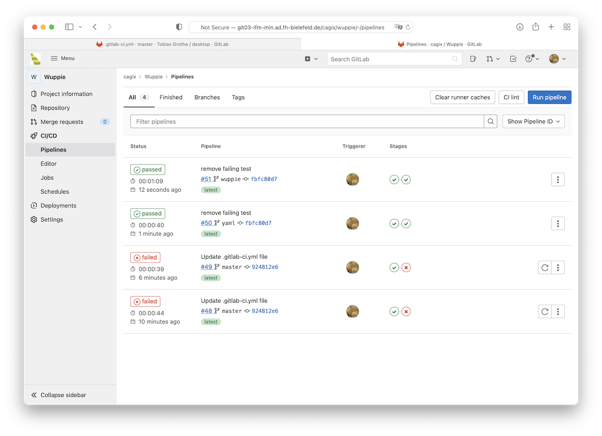
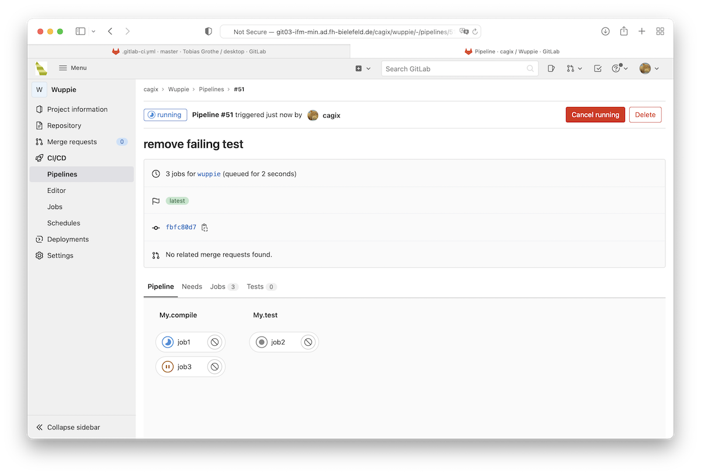
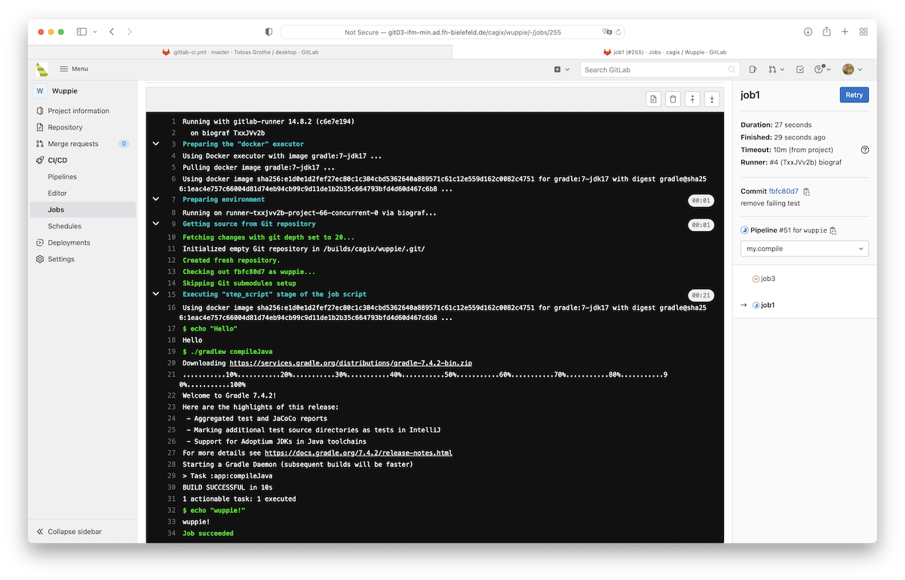
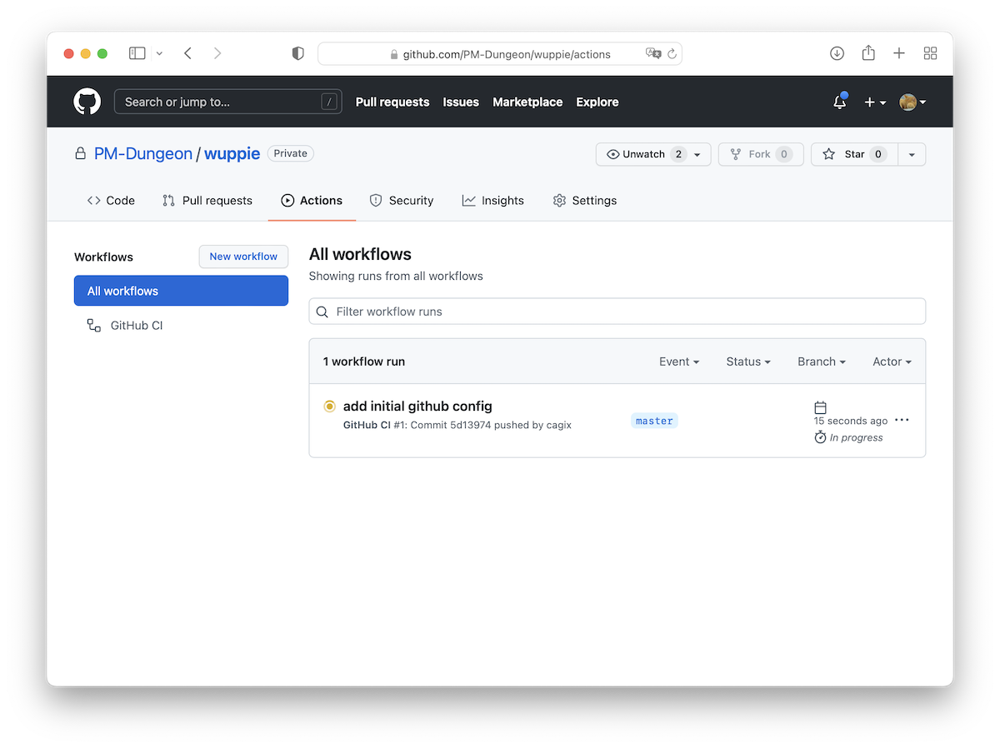
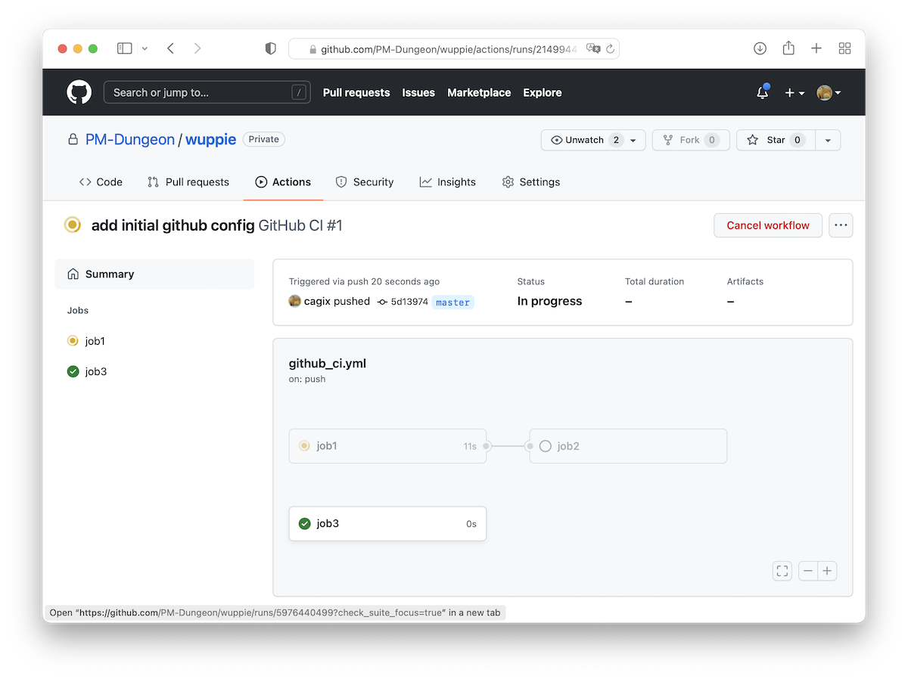
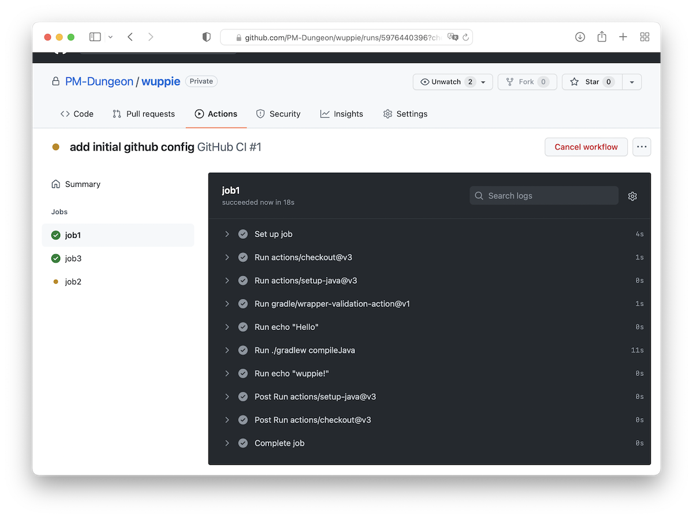
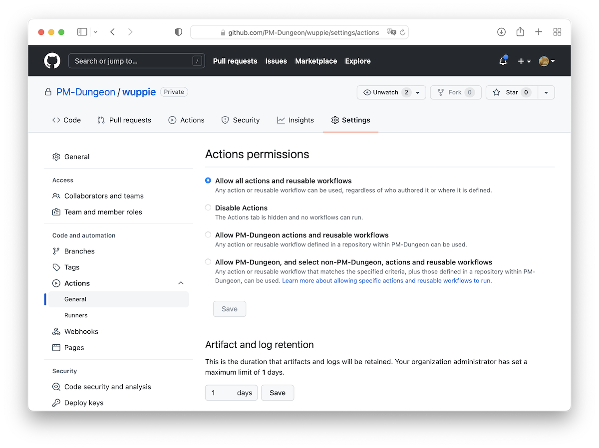
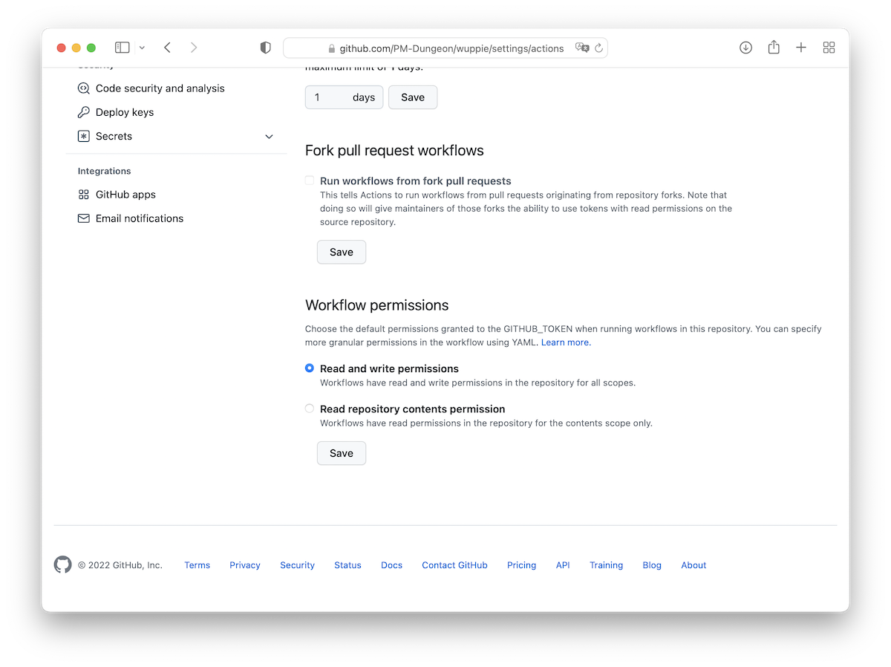
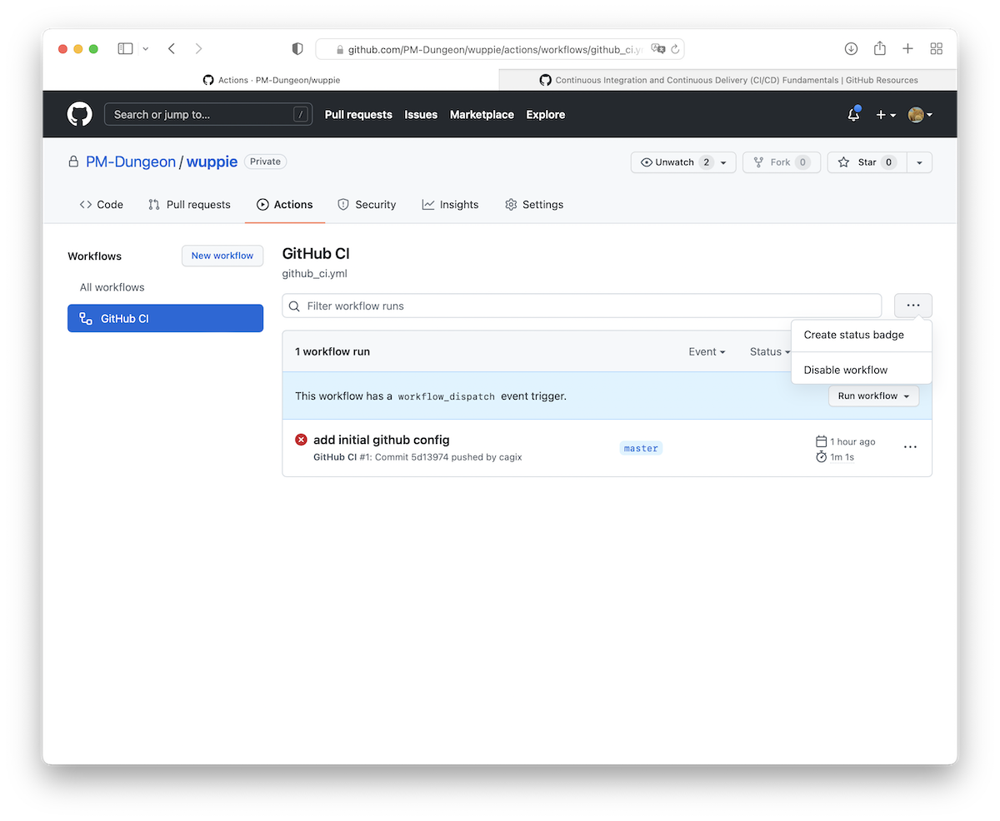

# Continuous Integration (CI)

> [!IMPORTANT]
>
> <details open>
>
> <summary><strong>🎯 TL;DR</strong></summary>
>
> In größeren Projekten mit mehreren Teams werden die Beteiligten i.d.R.
> nur noch “ihre” Codestellen compilieren und testen. Dennoch ist es
> wichtig, das gesamte Projekt regelmäßig zu “bauen” und auch
> umfangreichere Testsuiten regelmäßig laufen zu lassen. Außerdem ist es
> wichtig, das in einer definierten Umgebung zu tun und nicht auf einem
> oder mehreren Entwicklerrechnern, die i.d.R. (leicht) unterschiedlich
> konfiguriert sind, um zuverlässige und nachvollziehbare Ergebnisse zu
> bekommen. Weiterhin möchte man auf bestimmte Ereignisse reagieren, wie
> etwa neue Commits im Git-Server, oder bei Pull-Requests möchte man vor
> dem Merge automatisiert sicherstellen, dass damit die vorhandenen
> Tests alle “grün” sind und auch die Formatierung etc. stimmt.
>
> Dafür hat sich “Continuous Integration” etabliert. Hier werden die
> angesprochenen Prozesse regelmäßig auf einem dafür eingerichteten
> System durchgeführt. Aktivitäten wie Übersetzen, Testen, Style-Checks
> etc. werden in sogenannten “Pipelines” oder “Workflows”
> zusammengefasst und automatisiert durch Commits, Pull-Requests oder
> Merges auf dem Git-Server ausgelöst. Die Aktionen können dabei je nach
> Trigger und Branch unterschiedlich sein, d.h. man könnte etwa bei PR
> gegen den Master umfangreichere Tests laufen lassen als bei einem PR
> gegen einen Develop-Branch. In einem Workflow oder einer Pipeline
> können einzelne Aktionen wiederum von anderen Aktionen abhängen. Das
> Ergebnis kann man dann auf dem Server einsehen oder bekommt man
> komfortabel als Report per Mail zugeschickt.
>
> Wir schauen uns hier exemplarisch GitHub Actions und GitLab CI/CD an.
> Um CI sinnvoll einsetzen zu können, benötigt man Kenntnisse über
> Build-Tools. “CI” tritt üblicherweise zusammen mit “CD” (Continuous
> Delivery) auf, also als “CI/CD”. Der “CD”-Teil ist nicht Gegenstand
> der Betrachtung in dieser Lehrveranstaltung.
> </details>

> [!TIP]
>
> <details open>
>
> <summary><strong>🎦 Videos</strong></summary>
>
> - [VL Continuous Integration](https://youtu.be/NCWxo-PN4gs)
> - [Demo GitHub Actions](https://youtu.be/rpkZvuiyvTU)
> - [Demo Demo GitLab CI/CD](https://youtu.be/2ydDA4WY1wA)
>
> </details>

## Motivation: Zusammenarbeit in Teams

### Szenario

- Projekt besteht aus diversen Teilprojekten
- Verschiedene Entwicklungs-Teams arbeiten (getrennt) an verschiedenen
  Projekten
- Tester entwickeln Testsuiten für die Teilprojekte
- Tester entwickeln Testsuiten für das Gesamtprojekt

### Manuelle Ausführung der Testsuiten reicht nicht

- Belastet den Entwicklungsprozess
- Keine (einheitliche) Veröffentlichung der Ergebnisse
- Keine (einheitliche) Eskalation bei Fehlern
- Keine regelmäßige Integration in Gesamtprojekt

### Continuous Integration

- Regelmäßige, automatische Ausführung: Build und Tests
- Reporting
- Weiterführung der Idee: Regelmäßiges Deployment (*Continuous
  Deployment*)

## Continuous Integration (CI)

<picture><source media="(prefers-color-scheme: light)" srcset="images/ci_light.png"><source media="(prefers-color-scheme: dark)" srcset="images/ci_dark.png"></picture>

### Vorgehen

- Entwickler und Tester committen ihre Änderungen regelmäßig (Git, SVN,
  …)
- CI-Server arbeitet Build-Skripte ab, getriggert durch Events:
  Push-Events, Zeit/Datum, …
  - Typischerweise wird dabei:
    - Das Gesamtprojekt übersetzt (“gebaut”)
    - Die Unit- und die Integrationstests abgearbeitet
    - Zu festen Zeiten werden zusätzlich Systemtests gefahren
  - Typische weitere Builds: “Nightly Build”, Release-Build, …
  - Ergebnisse jeweils auf der Weboberfläche einsehbar (und per E-Mail)

### Einige Vorteile

- Tests werden regelmäßig durchgeführt (auch wenn sie lange dauern oder
  die Maschine stark belasten)
- Es wird regelmäßig ein Gesamt-Build durchgeführt
- Alle Teilnehmer sind über aktuellen Projekt(-zu-)stand informiert

### Beispiele für verbreitete CI-Umgebungen

- [Jenkins](https://www.jenkins.io/)
- [GitLab CI/CD](https://docs.gitlab.com/ee/ci/)
- [GitHub Actions](https://github.com/features/actions) und [GitHub
  CI/CD](https://resources.github.com/ci-cd/)
- [Bamboo](https://www.atlassian.com/software/bamboo)
- [Travis CI](https://www.travis-ci.com/)

## GitLab CI/CD

Siehe auch [“Get started with Gitlab
CI/CD”](http://git03-ifm-min.ad.hsbi.de/help/ci/quick_start/index.md).
(Für den Zugriff wird VPN benötigt!)

### Übersicht über Pipelines

<picture><source media="(prefers-color-scheme: light)" srcset="images/screenshot-gitlabci-pipelines_light.png"><source media="(prefers-color-scheme: dark)" srcset="images/screenshot-gitlabci-pipelines_dark.png"></picture>

- In Spalte “Status” sieht man das Ergebnis der einzelnen Pipelines:
  “pending” (die Pipeline läuft gerade), “cancelled” (Pipeline wurde
  manuell abgebrochen), “passed” (alle Jobs der Pipeline sind sauber
  durchgelaufen), “failed” (ein Job ist fehlgeschlagen, Pipeline wurde
  deshalb abgebrochen)
- In Spalte “Pipeline” sind die Pipelines eindeutig benannt aufgeführt,
  inkl. Trigger (Commit und Branch)
- In Spalte “Stages” sieht man den Zustand der einzelnen Stages

Wenn man mit der Maus auf den Status oder die Stages geht, erfährt man
mehr bzw. kann auf eine Seite mit mehr Informationen kommen.

### Detailansicht einer Pipeline

<picture><source media="(prefers-color-scheme: light)" srcset="images/screenshot-gitlabci-triggeredpipeline_light.png"><source media="(prefers-color-scheme: dark)" srcset="images/screenshot-gitlabci-triggeredpipeline_dark.png"></picture>

Wenn man in eine Pipeline in der Übersicht klickt, werden die einzelnen
Stages dieser Pipeline genauer dargestellt.

### Detailansicht eines Jobs

<picture><source media="(prefers-color-scheme: light)" srcset="images/screenshot-gitlabci-job_light.png"><source media="(prefers-color-scheme: dark)" srcset="images/screenshot-gitlabci-job_dark.png"></picture>

Wenn man in einen Job einer Stage klickt, bekommt man quasi die
Konsolenausgabe dieses Jobs. Hier kann man ggf. Fehler beim Ausführen
der einzelnen Skripte oder die Ergebnisse beispielsweise der JUnit-Läufe
anschauen.

### GitLab CI/CD: Konfiguration mit YAML-Datei

Datei `.gitlab-ci.yml` im Projekt-Ordner:

``` yaml
stages:
    - my.compile
    - my.test

job1:
    script:
        - echo "Hello"
        - ./gradlew compileJava
        - echo "wuppie!"
    stage: my.compile
    only:
        - wuppie

job2:
    script: "./gradlew test"
    stage: my.test

job3:
    script:
        - echo "Job 3"
    stage: my.compile
```

#### Stages

Unter `stages` werden die einzelnen Stages einer Pipeline definiert.
Diese werden in der hier spezifizierten Reihenfolge durchgeführt, d.h.
zuerst würde `my.compile` ausgeführt, und erst wenn alle Jobs in
`my.compile` erfolgreich ausgeführt wurden, würde anschließend `my.test`
ausgeführt.

Dabei gilt: Die Jobs einer Stage werden (potentiell) parallel zueinander
ausgeführt, und die Jobs der nächsten Stage werden erst dann gestartet,
wenn alle Jobs der aktuellen Stage erfolgreich beendet wurden.

Wenn keine eigenen `stages` definiert werden, kann man ([lt.
Doku](http://git03-ifm-min.ad.hsbi.de/help/ci/yaml/index.md#stages)) auf
die Default-Stages `build`, `test` und `deploy` zurückgreifen.
**Achtung**: Sobald man eigene Stages definiert, stehen diese
Default-Stages *nicht* mehr zur Verfügung!

#### Jobs

`job1`, `job2` und `job3` definieren jeweils einen Job.

- `job1` besteht aus mehreren Befehlen (unter `script`). Alternativ kann
  man die bei `job2` gezeigte Syntax nutzen, wenn nur ein Befehl zu
  bearbeiten ist.

  Die Befehle werden von GitLab CI/CD in einer Shell ausgeführt.

- Die Jobs `job1` und `job2` sind der Stage `my.compile` zugeordnet
  (Abschnitt `stage`). Einer Stage können mehrere Jobs zugeordnet sein,
  die dann parallel ausgeführt werden.

  Wenn ein Job nicht explizit einer Stage zugeordnet ist, wird er ([lt.
  Doku](http://git03-ifm-min.ad.hsbi.de/help/ci/yaml/index.md#stages))
  zur Default-Stage `test` zugewiesen. (Das geht nur, wenn es diese
  Stage auch gibt!)

- Mit `only` und `except` kann man u.a. Branches oder Tags angeben, für
  die dieser Job ausgeführt (bzw. nicht ausgeführt) werden soll.

Durch die Kombination von Jobs mit der Zuordnung zu Stages und Events
lassen sich unterschiedliche Pipelines für verschiedene Zwecke
definieren.

### Hinweise zur Konfiguration von GitLab CI/CD

Im Browser in den Repo-Einstellungen arbeiten:

1.  Unter
    `Settings > General > Visibility, project features, permissions` das
    `CI/CD` aktivieren
2.  Prüfen unter `Settings > CI/CD > Runners`, dass unter
    `Available shared Runners` mind. ein shared Runner verfügbar ist
    (mit grün markiert ist)
3.  Unter `Settings > CI/CD > General pipelines` einstellen:
    - `Git strategy`: `git clone`
    - `Timeout`: `10m`
    - `Public pipelines`: `false` (nicht angehakt)
4.  YAML-File (`.gitlab-ci.yml`) in Projektwurzel anlegen, Aufbau siehe
    oben
5.  Build-Skript erstellen, **lokal** lauffähig bekommen, dann in Jobs
    nutzen
6.  Im `.gitlab-ci.yml` die relevanten Branches einstellen (s.o.)
7.  Pushen, und unter `CI/CD > Pipelines` das Builden beobachten
    - in Status reinklicken und schauen, ob und wo es hakt
8.  `README.md` anlegen in Projektwurzel (neben `.gitlab-ci.yml`),
    Markdown-Schnipsel aus
    `Settings > CI/CD > General pipelines > Pipeline status` auswählen
    und einfügen ….

*Optional*:

1.  Ggf. Schedules unter `CI/CD > Schedules` anlegen
2.  Ggf. extra Mails einrichten:
    `Settings > Integrations > Pipeline status emails`

## GitHub Actions

Siehe [“GitHub Actions: Automate your workflow from idea to
production”](https://github.com/features/actions) und auch [“GitHub:
CI/CD explained”](https://resources.github.com/ci-cd/).

### Übersicht über Workflows

<picture><source media="(prefers-color-scheme: light)" srcset="images/screenshot-githubci-workflows_light.png"><source media="(prefers-color-scheme: dark)" srcset="images/screenshot-githubci-workflows_dark.png"></picture>

Hier sieht man das Ergebnis der letzten Workflows. Dazu sieht man den
Commit und den Branch, auf dem der Workflow gelaufen ist sowie wann er
gelaufen ist. Über die Spalten kann man beispielsweise nach Status oder
Event filtern.

In der Abbildung ist ein Workflow mit dem Namen “GitHub CI” zu sehen,
der aktuell noch läuft.

### Detailansicht eines Workflows

<picture><source media="(prefers-color-scheme: light)" srcset="images/screenshot-githubci-triggeredworkflow_light.png"><source media="(prefers-color-scheme: dark)" srcset="images/screenshot-githubci-triggeredworkflow_dark.png"></picture>

Wenn man in einen Workflow in der Übersicht anklickt, werden die
einzelnen Jobs dieses Workflows genauer dargestellt. “job3” ist
erfolgreich gelaufen, “job1” läuft gerade, und “job2” hängt von “job1”
ab, d.h. kann erst nach dem erfolgreichen Lauf von “job2” starten.

### Detailansicht eines Jobs

<picture><source media="(prefers-color-scheme: light)" srcset="images/screenshot-githubci-job_light.png"><source media="(prefers-color-scheme: dark)" srcset="images/screenshot-githubci-job_dark.png"></picture>

Wenn man in einen Job anklickt, bekommt man quasi die Konsolenausgabe
dieses Jobs. Hier kann man ggf. Fehler beim Ausführen der einzelnen
Skripte oder die Ergebnisse beispielsweise der JUnit-Läufe anschauen.

### GitHub Actions: Konfiguration mit YAML-Datei

Workflows werden als YAML-Dateien im Ordner `.github/workflows/`
angelegt.

``` yaml
name: GitHub CI

on:
  # push on master branch
  push:
    branches: [master]
  # manually triggered
  workflow_dispatch:

jobs:

  job1:
    runs-on: ubuntu-latest
    steps:
      - uses: actions/checkout@v6
      - uses: actions/setup-java@v3
        with:
          java-version: '17'
          distribution: 'temurin'
      - uses: gradle/wrapper-validation-action@v1
      - run: echo "Hello"
      - run: ./gradlew compileJava
      - run: echo "wuppie!"

  job2:
    needs: job1
    runs-on: ubuntu-latest
    steps:
      - uses: actions/checkout@v6
      - uses: actions/setup-java@v3
        with:
          java-version: '17'
          distribution: 'temurin'
      - uses: gradle/wrapper-validation-action@v1
      - run: ./gradlew test

  job3:
    runs-on: ubuntu-latest
    steps:
      - run: echo "Job 3"
```

#### Workflowname und Trigger-Events

Der Name des Workflows wird mit dem Eintrag `name` spezifiziert und
sollte sich im Dateinamen widerspiegeln, also im Beispiel
`.github/workflows/github_ci.yml`.

Im Eintrag `on` können die Events definiert werden, die den Workflow
triggern. Im Beispiel ist ein Push-Event auf dem `master`-Branch
definiert sowie mit `workflow_dispatch:` das manuelle Triggern (auf
einem beliebigen Branch) freigeschaltet.

#### Jobs

Die Jobs werden unter dem Eintrag `jobs` definiert: `job1`, `job2` und
`job3` definieren jeweils einen Job.

- `job1` besteht aus mehreren Befehlen (unter `steps`), die auf einem
  aktuellen virtualisierten Ubuntu-Runner ausgeführt werden.

  Es wird zunächst das Repo mit Hilfe der Checkout-Action ausgecheckt
  (`uses: actions/checkout@v6`), das JDK eingerichtet/installiert
  (`uses: actions/setup-java@v3`) und der im Repo enthaltene
  Gradle-Wrapper auf Unversehrtheit geprüft
  (`uses: gradle/wrapper-validation-action@v1`).

  Die Actions sind vordefinierte Actions und im Github unter
  `github.com/` + Action zu finden, d.h.
  [`actions/checkout`](https://github.com/actions/checkout) oder
  [`actions/setup-java`](https://github.com/actions/setup-java). Actions
  können von jedermann definiert und bereitgestellt werden, in diesem
  Fall handelt es sich um von GitHub selbst im Namespace “actions”
  bereit gestellte direkt nutzbare Actions. Man kann Actions auch selbst
  im Ordner `.github/actions/` für das Repo definieren (Beispiel:
  [plfa.github.io](https://github.com/plfa/plfa.github.io/blob/dev/.github/actions/setup-haskell/action.yml)).

  Mit `run` werden Befehle in der Shell auf dem genutzten Runner (hier
  Ubuntu) ausgeführt.

- Die Jobs `job2` ist von `job1` abhängig und wird erst gestartet, wenn
  `job1` erfolgreich abgearbeitet ist.

  Ansonsten können die Jobs prinzipiell parallel ausgeführt werden.

Durch die Kombination von Workflows mit verschiedenen Jobs und
Abhängigkeiten zwischen Jobs lassen sich unterschiedliche Pipelines
(“Workflows”) für verschiedene Zwecke definieren.

Es lassen sich auch andere Runner benutzen, etwa ein virtualisiertes
Windows oder macOS. Man kann auch über einen “Matrix-Build” den Workflow
auf mehreren Betriebssystemen gleichzeitig laufen lassen.

Man kann auch einen Docker-Container benutzen. Dabei muss man beachten,
dass dieser am besten aus einer Registry (etwa von Docker-Hub oder aus
der GitHub-Registry) “gezogen” wird, weil das Bauen des
Docker-Containers aus einem Docker-File in der Action u.U. relativ lange
dauert.

### Hinweise zur Konfiguration von GitHub Actions

Im Browser in den Repo-Einstellungen arbeiten:

1.  Unter `Settings > Actions > General > Actions permissions` die
    Actions aktivieren (Auswahl, welche Actions erlaubt sind)

    <picture><source media="(prefers-color-scheme: light)" srcset="images/screenshot_github_settings_actions_light.png"><source media="(prefers-color-scheme: dark)" srcset="images/screenshot_github_settings_actions_dark.png"></picture>

2.  Unter `Settings > Actions > General > Workflow permissions` ggf.
    bestimmen, ob die Actions das Repo nur lesen dürfen oder auch
    zusätzlich schreiben dürfen

    <picture><source media="(prefers-color-scheme: light)" srcset="images/screenshot_github_settings_permissions_light.png"><source media="(prefers-color-scheme: dark)" srcset="images/screenshot_github_settings_permissions_dark.png"></picture>

3.  Unter `Actions > <WORKFLOW>` den Workflow ggf. deaktivieren:

    <picture><source media="(prefers-color-scheme: light)" srcset="images/screenshot_github_actions_light.png"><source media="(prefers-color-scheme: dark)" srcset="images/screenshot_github_actions_dark.png"></picture>

## Wrap-Up

Überblick über Continuous Integration:

- Konfigurierbare Aktionen, die auf dem Gitlab-/GitHub-Server ausgeführt
  werden
- Unterschiedliche Trigger: Commit, Merge, …
- Aktionen können Branch-spezifisch sein
- Aktionen können von anderen Aktionen abhängen

## 📖 Zum Nachlesen

- „Documentation Gitlab CI“ ([o. J.](#ref-GitlabCI))
- GitHub Inc. ([2022](#ref-GitHubCI))

> [!NOTE]
>
> <details>
>
> <summary><strong>✅ Lernziele</strong></summary>
>
> - k2: Ich kann Arbeitsweise von/mit CI (GitHub, GitLab) erklären
>
> </details>

> [!TIP]
>
> <details>
>
> <summary><strong>🏅 Challenges</strong></summary>
>
> Betrachten Sie erneut das Projekt [Theatrical Players Refactoring
> Kata](https://github.com/emilybache/Theatrical-Players-Refactoring-Kata).
> Erstellen Sie für dieses Projekt einen GitHub-Workflow, der das
> Projekt kompiliert und die Testsuite ausführt (nur für den Java-Teil,
> den restlichen Code können Sie ignorieren).
>
> Dabei soll das Ausführen der JUnit-Tests nur dann erfolgen, wenn das
> Kompilieren erfolgreich durchgeführt wurde.
>
> Der Workflow soll automatisch für Commits in den Hauptbranch sowie für
> Pull-Requests loslaufen. Es soll zusätzlich auch manuell aktivierbar
> sein.
>
> </details>

------------------------------------------------------------------------

> [!NOTE]
>
> <details>
>
> <summary><strong>👀 Quellen</strong></summary>
>
> <div id="refs" class="references csl-bib-body hanging-indent">
>
> <div id="ref-GitlabCI" class="csl-entry">
>
> „Documentation Gitlab CI“. o. J. Zugegriffen 10. März 2022.
> <http://git03-ifm-min.ad.hsbi.de/help/ci/>.
>
> </div>
>
> <div id="ref-GitHubCI" class="csl-entry">
>
> GitHub Inc. 2022. „Documentation GitHub CI“.
> <https://resources.github.com/ci-cd/>.
>
> </div>
>
> </div>
>
> </details>

------------------------------------------------------------------------


Unless otherwise noted, this work is licensed under CC BY-SA 4.0.

<blockquote><p><sup><sub><strong>Last modified:</strong> d448137 (lecture: update checkout examples, 2025-11-21)<br></sub></sup></p></blockquote>
