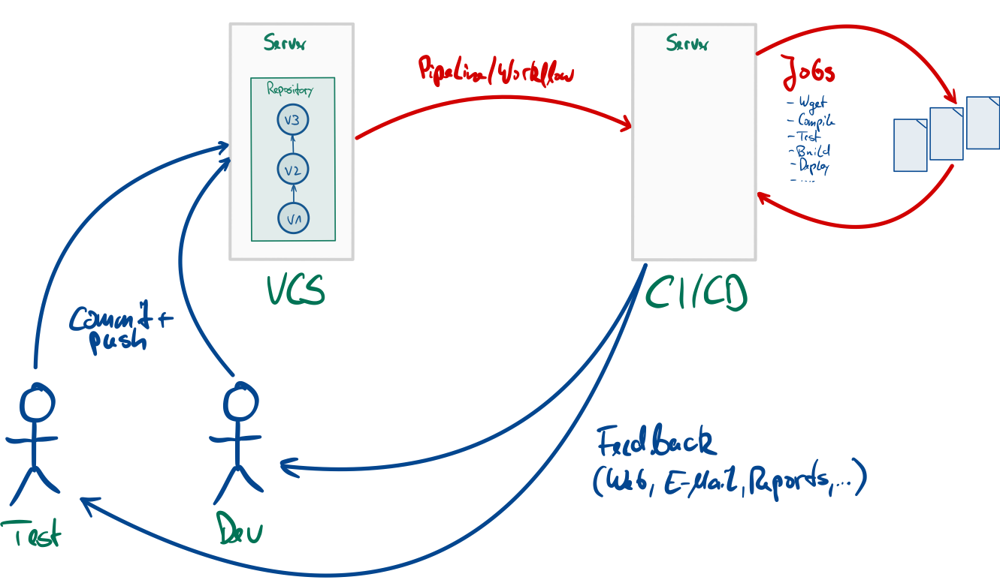
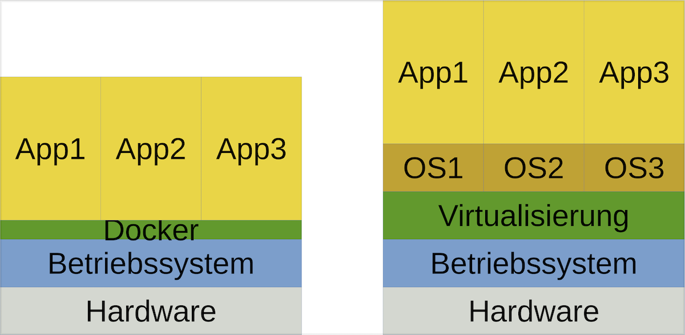
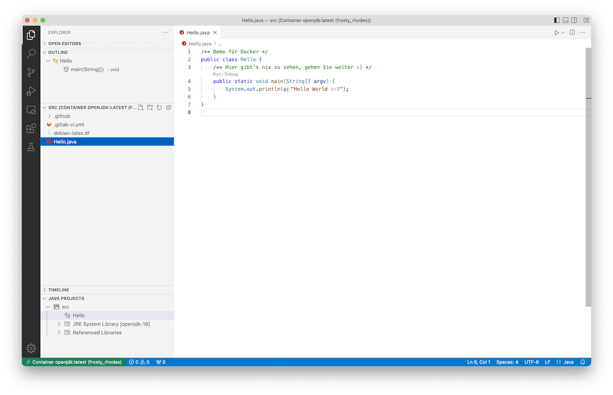

# Einführung in Docker

> [!IMPORTANT]
>
> <details open>
>
> <summary><strong>🎯 TL;DR</strong></summary>
>
> Container sind im Gegensatz zu herkömmlichen VMs eine schlanke
> Virtualisierungslösung. Dabei laufen die Prozesse direkt im Kernel des
> Host-Betriebssystems, aber abgeschottet von den anderen Prozessen
> durch Linux-Techniken wie `cgroups` und `namespaces` (unter Windows
> kommt dafür der WSL2 zum Einsatz, unter macOS wird eine kleine
> Virtualisierung genutzt).
>
> Container sind sehr nützlich, wenn man an mehreren Stellen eine
> identische Arbeitsumgebung benötigt. Man kann dabei entweder die
> Images (fertige Dateien) oder die Dockerfiles (Anweisungen zum
> Erzeugen eines Images) im Projekt verteilen. Tatsächlich ist es nicht
> unüblich, ein Dockerfile in das Projekt-Repo mit einzuchecken.
>
> Durch Container hat man allerdings im Gegensatz zu herkömmlichen VMs
> keinen Sicherheitsgewinn, da die im Container laufende Software ja
> direkt auf dem Host-Betriebssystem ausgeführt wird.
>
> Es gibt auf DockerHub fertige Images, die man sich ziehen und starten
> kann. Ein solches gestartetes Image nennt sich dann Container und
> enthält beispielsweise Dateien, die in den Container gemountet oder
> kopiert werden. Man kann auch eigene Images bauen, indem man eine
> entsprechende Konfiguration (Dockerfile) schreibt. Jeder Befehl bei
> der Erstellung eines Images erzeugt einen neuen Layer, die sich
> dadurch mehrere Images teilen können.
>
> In der Konfiguration einer Gitlab-CI-Pipeline kann man mit `image` ein
> Docker-Image angeben, welches dann in der Pipeline genutzt wird.
>
> VSCode kann über das Remote-Plugin sich (u.a.) mit Containern
> verbinden und dann im Container arbeiten (editieren, compilieren,
> debuggen, testen, …).
>
> In dieser kurzen Einheit kann ich Ihnen nur einen ersten Einstieg in
> das Thema geben. Wir haben uns beispielsweise nicht Docker Compose
> oder Kubernetes angeschaut, und auch die Themen Netzwerk (zwischen
> Containern oder zwischen Containern und anderen Rechnern) und Volumes
> habe ich außen vor gelassen. Dennoch kommt man in der Praxis bereits
> mit den hier vermittelten Basiskenntnissen erstaunlich weit …
> </details>

> [!TIP]
>
> <details open>
>
> <summary><strong>🎦 Videos</strong></summary>
>
> - [VL Einführung in Docker](https://youtu.be/yERVMfUAano)
> - [Demo Container in der Konsole](https://youtu.be/LE_QcHqUg9Y)
> - [Demo GitLab CI/CD und Docker](https://youtu.be/3Tj3lhcoKro)
> - [Demo GitHub Actions und Docker](https://youtu.be/jrxoax2fPRI)
> - [Demo VSCode und Docker](https://youtu.be/Rs1W_rXkoNM)
>
> </details>

## Motivation CI/CD: WFM (*Works For Me*)

<picture><source media="(prefers-color-scheme: light)" srcset="images/ci_light.png"><source media="(prefers-color-scheme: dark)" srcset="images/ci_dark.png"></picture>

Auf dem CI-Server muss man eine Arbeitsumgebung konfigurieren und
bereitstellen, für Java-basierte Projekte muss beispielsweise ein JDK
existieren und man benötigt Tools wie Maven oder Gradle, um die
Buildskripte auszuführen. Je nach Projekt braucht man dann noch weitere
Tools und Bibliotheken. Diese Konfigurationen sind unabhängig vom
CI-Server und werden üblicherweise nicht direkt installiert, sondern
über eine Virtualisierung bereitgestellt.

Selbst wenn man keine CI-Pipelines einsetzt, hat man in Projekten mit
mehreren beteiligten Personen häufig das Problem “*WFM*” (“works for
me”). Jeder Entwickler hat sich auf ihrem Rechner eine
Entwicklungsumgebung aufgesetzt und nutzt in der Regel seine bevorzugte
IDE oder sogar unterschiedliche JDK-Versionen … Dadurch kann es schnell
passieren, dass Probleme oder Fehler auftreten, die sich nicht von allen
Beteiligten immer nachvollziehen lassen. Hier wäre eine einheitliche
Entwicklungsumgebung sinnvoll, die in einer “schlanken” Virtualisierung
bereitgestellt wird.

Als Entwickler kann man zeitgleich in verschiedenen Projekten beteiligt
sein, die unterschiedliche Anforderungen an die Entwicklungstools mit
sich bringen. Es könnte beispielsweise passieren, dass man zeitgleich
drei bestimmte Python-Versionen benötigt. In den meisten Fällen schafft
man es (mit ein wenig Aufwand), diese Tools nebeneinander zu
installieren. Oft ist das in der Praxis aber schwierig und
fehleranfällig.

In diesen Fällen kann eine Virtualisierung helfen.

## Virtualisierung: Container vs. VM

<picture><source media="(prefers-color-scheme: light)" srcset="images/virtualisierung_light.png"><source media="(prefers-color-scheme: dark)" srcset="images/virtualisierung_dark.png"></picture>

Wenn man über Virtualisierung auf dem Desktop spricht, kann man grob
zwei Varianten unterscheiden. In beiden Fällen ist die Basis die
Hardware (Laptop, Desktop-Rechner) und das darauf laufende (Host-)
Betriebssystem (Linux, FreeBSD, macOS, Windows, …). Darauf läuft dann
wiederum die Virtualisierung.

Im rechten Bild wird eine herkömmliche Virtualisierung mit virtuellen
Maschinen (*VM*) dargestellt. Dabei wird in der VM ein komplettes
Betriebssystem (das “Gast-Betriebssystem”) installiert und darin läuft
dann die gewünschte Anwendung. Die Virtualisierung (VirtualBox, VMware,
…) läuft dabei als Anwendung auf dem Host-Betriebssystem und stellt dem
Gast-Betriebssystem in der VM einen Rechner mit CPU, RAM, … zur
Verfügung und übersetzt die Systemaufrufe in der VM in die
entsprechenden Aufrufe im Host-Betriebssystem. Dies benötigt in der
Regel entsprechende Ressourcen: Durch das komplette Betriebssystem in
der VM ist eine VM (die als Datei im Filesystem des Host-Betriebssystems
liegt) oft mehrere 10GB groß. Für die Übersetzung werden zusätzlich
Hardwareressourcen benötigt, d.h. hier gehen CPU-Zyklen und RAM
“verloren” … Das Starten einer VM dauert entsprechend lange, da hier ein
komplettes Betriebssystem hochgefahren werden muss. Dafür sind die
Prozesse in einer VM relativ stark vom Host-Betriebssystem abgekapselt,
so dass man hier von einer “Sandbox” sprechen kann: Viren o.ä. können
nicht so leicht aus einer VM “ausbrechen” und auf das
Host-Betriebssystem zugreifen (quasi nur über Lücken im
Gast-Betriebssystem kombiniert mit Lücken in der
Virtualisierungssoftware).

Im linken Bild ist eine schlanke Virtualisierung auf Containerbasis
dargestellt. Die Anwendungen laufen direkt als Prozesse im
Host-Betriebssystem, ein Gast-Betriebssystem ist nicht notwendig. Durch
den geschickten Einsatz von `namespaces` und `cgroups` und anderen in
Linux und FreeBSD verfügbaren Techniken werden die Prozesse
abgeschottet, d.h. der im Container laufende Prozess “sieht” die anderen
Prozesse des Hosts nicht. Die Erstellung und Steuerung der Container
übernimmt hier beispielsweise Docker. Die Container sind dabei auch
wieder Dateien im Host-Filesystem. Dadurch benötigen Container
wesentlich weniger Platz als herkömmliche VMs, der Start einer Anwendung
geht deutlich schneller und die Hardwareressourcen (CPU, RAM, …) werden
effizient genutzt. Nachteilig ist, dass hier in der Regel ein Linux-Host
benötigt wird (für Windows wird mittlerweile der Linux-Layer (*WSL*)
genutzt; für macOS wurde bisher eine Linux-VM im Hintergrund
hochgefahren, mittlerweile wird aber eine eigene schlanke
Virtualisierung eingesetzt). Außerdem steht im Container üblicherweise
kein graphisches Benutzerinterface zur Verfügung. Da die Prozesse direkt
im Host-Betriebssystem laufen, stellen Container keine
Sicherheitsschicht (“Sandboxen”) dar!

In allen Fällen muss die Hardwarearchitektur beachtet werden: Auf einer
Intel-Maschine können normalerweise keine VMs/Container basierend auf
ARM-Architektur ausgeführt werden und umgekehrt.

## Getting started

- DockerHub: fertige Images =\>
  [hub.docker.com/search](https://hub.docker.com/search?q=&type=image)

<!-- -->

- Image downloaden: `docker pull <IMAGE>`
- Image starten: `docker run <IMAGE>`

### Begriffe

- **Docker-File**: Beschreibungsdatei, wie Docker ein Image erzeugen
  soll.
- **Image**: Enthält die Dinge, die lt. dem Docker-File in das Image
  gepackt werden sollen. Kann gestartet werden und erzeugt damit einen
  Container.
- **Container**: Ein laufendes Images (genauer: eine laufende Instanz
  eines Images). Kann dann auch zusätzliche Daten enthalten.

### Beispiele

    docker pull debian:stable-slim
    docker run  --rm -it  debian:stable-slim  /bin/sh

`debian` ist ein fertiges Images, welches über DockerHub bereit gestellt
wird. Mit dem Postfix `stable-slim` wird eine bestimmte Version
angesprochen.

Mit `docker run debian:stable-slim` startet man das Image, es wird ein
Container erzeugt. Dieser enthält den aktuellen Datenstand, d.h. wenn
man im Image eine Datei anlegt, wäre diese dann im Container enthalten.

Mit der Option `--rm` wird der Container nach Beendigung automatisch
wieder gelöscht. Da jeder Aufruf von `docker run <IMAGE>` einen neuen
Container erzeugt, würden sich sonst recht schnell viele Container auf
dem Dateisystem des Hosts ansammeln, die man dann manuell aufräumen
müsste. Man kann aber einen beendeten Container auch erneut laufen
lassen … (vgl. Dokumentation von `docker`). Mit der Option `--rm` sind
aber auch im Container angelegte Daten wieder weg! Mit der Option `-it`
wird der Container interaktiv gestartet und man landet in einer Shell.

Bei der Definition eines Images kann ein “*Entry Point*” definiert
werden, d.h. ein Programm, welches automatisch beim Start des Container
ausgeführt wird. Häufig erlauben Images aber auch, beim Start ein
bestimmtes auszuführendes Programm anzugeben. Im obigen Beispiel ist das
`/bin/sh`, also eine Shell …

    docker pull openjdk:latest
    docker run  --rm  -v "$PWD":/data -w /data  openjdk:latest  javac Hello.java
    docker run  --rm  -v "$PWD":/data -w /data  openjdk:latest  java Hello

Auch für Java gibt es vordefinierte Images mit einem JDK. Das Tag
“`latest`” zeigt dabei auf die letzte stabile Version des
`openjdk`-Images. Üblicherweise wird “`latest`” von den Entwicklern
immer wieder weiter geschoben, d.h. auch bei anderen Images gibt es ein
“`latest`”-Tag. Gleichzeitig ist es die Default-Einstellung für die
Docker-Befehle, d.h. es kann auch weggelassen werden:
`docker run openjdk:latest` und `docker run openjdk` sind gleichwertig.
Alternativ kann man hier auch hier wieder eine konkrete Version angeben.

Über die Option `-v` wird ein Ordner auf dem Host (hier durch `"$PWD"`
dynamisch ermittelt) in den Container eingebunden (“gemountet”), hier
auf den Ordner `/data`. Dort sind dann die Dateien sichtbar, die im
Ordner `"$PWD"` enthalten sind. Über die Option `-w` kann ein
Arbeitsverzeichnis definiert werden.

Mit `javac Hello.java` wird `javac` im Container aufgerufen auf der
Datei `/data/Hello.java` im Container, d.h. die Datei `Hello.java`, die
im aktuellen Ordner des Hosts liegt (und in den Container gemountet
wurde). Das Ergebnis (`Hello.class`) wird ebenfalls in den Ordner
`/data/` im Container geschrieben und erscheint dann im
Arbeitsverzeichnis auf dem Host … Analog kann dann mit `java Hello` die
Klasse ausgeführt werden.

<p align="right"><a href="https://youtu.be/LE_QcHqUg9Y">Demo: Container in der Konsole</a></p>

## Images selbst definieren

``` docker
FROM debian:stable-slim

ARG USERNAME=pandoc
ARG USER_UID=1000
ARG USER_GID=1000

RUN apt-get update && apt-get install -y --no-install-recommends            \
        apt-utils bash wget make graphviz biber                             \
        texlive-base texlive-plain-generic texlive-latex-base               \
    #
    && groupadd --gid $USER_GID $USERNAME                                   \
    && useradd -s /bin/bash --uid $USER_UID --gid $USER_GID -m $USERNAME    \
    #
    && apt-get autoremove -y && apt-get clean -y && rm -rf /var/lib/apt/lists/*

WORKDIR /pandoc
USER $USERNAME
```

`docker build -t <NAME> -f <DOCKERFILE> .`

`FROM` gibt die Basis an, d.h. hier ein Image von Debian in der Variante
`stable-slim`, d.h. das ist der Basis-Layer für das zu bauende
Docker-Image.

Über `ARG` werden hier Variablen gesetzt.

`RUN` ist der Befehl, der im Image (hier Debian) ausgeführt wird und
einen neuen Layer hinzufügt. In diesen Layer werden alle Dateien
eingefügt, die bei der Ausführung des Befehls erzeugt oder angelegt
werden. Hier im Beispiel wird das Debian-Tool `apt-get` gestartet und
weitere Debian-Pakete installiert.

Da jeder `RUN`-Befehl einen neuen Layer anlegt, werden die restlichen
Konfigurationen ebenfalls in diesem Lauf durchgeführt. Insbesondere wird
ein nicht-Root-User angelegt, der von der UID und GID dem Default-User
in Linux entspricht. Die gemounteten Dateien haben die selben Rechte wie
auf dem Host, und durch die Übereinstimmung von UID/GID sind die Dateien
problemlos zugreifbar und man muss nicht mit dem Root-User arbeiten
(dies wird aus offensichtlichen Gründen als Anti-Pattern angesehen).
Bevor der `RUN`-Lauf abgeschlossen wird, werden alle temporären und
später nicht benötigten Dateien von `apt-get` entfernt, damit diese
nicht Bestandteil des Layers werden.

Mit `WORKDIR` und `USER` wird das Arbeitsverzeichnis gesetzt und auf den
angegebenen User umgeschaltet. Damit muss der User nicht mehr beim
Aufruf von außen gesetzt werden.

Über `docker build -t <NAME> -f <DOCKERFILE> .` wird aus dem angegebenen
Dockerfile und dem Inhalt des aktuellen Ordners (“`.`”) ein neues Image
erzeugt und mit dem angegebenen Namen benannt.

**Hinweis zum Umgang mit Containern und Updates**: Bei der Erstellung
eines Images sind bestimmte Softwareversionen Teil des Images geworden.
Man kann prinzipiell in einem Container die Software aktualisieren, aber
dies geht in dem Moment wieder verloren, wo der Container beendet und
gelöscht wird. Außerdem widerspricht dies dem Gedanken, dass mehrere
Personen mit dem selben Image/Container arbeiten und damit auch die
selben Versionsstände haben. In der Praxis löscht man deshalb das alte
Image einfach und erstellt ein neues, welches dann die aktualisierte
Software enthält.

<p align="right"><a href="https://github.com/Programmiermethoden-CampusMinden/Prog2-Lecture/blob/master/lecture/building/src/docker/debian-latex.df">Beispiel: debian-latex.df</a></p>

## CI-Pipeline (GitLab)

``` yaml
default:
    image: openjdk:17

job1:
    stage: build
    script:
        - java -version
        - javac Hello.java
        - java Hello
        - ls -lags
```

In den Gitlab-CI-Pipelines (analog wie in den GitHub-Actions) kann man
Docker-Container für die Ausführung der Pipeline nutzen.

Mit `image: openjdk:17` wird das Docker-Image `openjdk:17` vom DockerHub
geladen und durch den Runner für die Stages als Container ausgeführt.
Die Aktionen im `script`-Teil, wie beispielsweise `javac Hello.java`
werden vom Runner an die Standard-Eingabe der Shell des Containers
gesendet. Im Prinzip entspricht das dem Aufruf auf dem lokalen Rechner:
`docker run openjdk:17 javac Hello.java`.

<p align="right"><a href="https://youtu.be/3Tj3lhcoKro">Demo: GitLab CI/CD und Docker</a></p>

## CI-Pipeline (GitHub)

``` yaml
name: demo
on:
    push:
        branches: [master]
    workflow_dispatch:

jobs:
    job1:
        runs-on: ubuntu-latest
        container: docker://openjdk:17
        steps:
            - uses: actions/checkout@v6
            - run: java -version
            - run: javac Hello.java
            - run: java Hello
            - run: ls -lags
```

https://stackoverflow.com/questions/71283311/run-github-workflow-on-docker-image-with-a-dockerfile
https://docs.github.com/en/actions/using-jobs/running-jobs-in-a-container

In den GitHub-Actions kann man Docker-Container für die Ausführung der
Pipeline nutzen.

Mit `docker://openjdk:17` wird das Docker-Image `openjdk:17` vom
DockerHub geladen und auf dem Ubuntu-Runner als Container ausgeführt.
Die Aktionen im `steps`-Teil, wie beispielsweise `javac Hello.java`
werden vom Runner an die Standard-Eingabe der Shell des Containers
gesendet. Im Prinzip entspricht das dem Aufruf auf dem lokalen Rechner:
`docker run openjdk:17 javac Hello.java`.

<p align="right"><a href="https://youtu.be/jrxoax2fPRI">Demo: GitHub Actions und Docker</a></p>

## VSCode und das Plugin “Remote - Containers”

<picture><source media="(prefers-color-scheme: light)" srcset="images/vscode-remote_light.png"><source media="(prefers-color-scheme: dark)" srcset="images/vscode-remote_dark.png"></picture>

1.  VSCode (Host): Plugin “Remote - Containers” installieren
2.  Docker (Host): Container starten mit Workspace gemountet
3.  VSCode (Host): Attach to Container =\> neues Fenster (Container)
4.  VSCode (Container): Plugin “Java Extension Pack” installieren
5.  VSCode (Container): Dateien editieren, kompilieren, debuggen, …

Mit Visual Studio Code (VSC) kann man über SSH oder in einem Container
arbeiten. Dazu installiert man sich VSC lokal auf dem Host und
installiert dort das Plugin “Remote - Containers”. VSC kann darüber
vordefinierte Docker-Images herunterladen und darin arbeiten oder man
kann alternativ einen Container selbst starten und diesen mit VSC
verbinden (“attachen”).

Beim Verbinden öffnet VSC ein neues Fenster, welches mit dem Container
verbunden ist. Nun kann man in diesem neuen Fenster ganz normal
arbeiten, allerdings werden alle Dinge in dem Container erledigt. Man
öffnet also Dateien in diesem Container, editiert sie im Container,
übersetzt und testet im Container und nutzt dabei die im Container
installierten Tools. Sogar die entsprechenden VSC-Plugins kann man im
Container installieren.

Damit benötigt man auf einem Host eigentlich nur noch VSC und Docker,
aber keine Java-Tools o.ä. und kann diese über einen im Projekt
definierten Container (über ein mit versioniertes Dockerfile) nutzen.

*Anmerkung*: IntelliJ kann remote nur debuggen, d.h. das Editieren,
Übersetzen, Testen läuft lokal auf dem Host (und benötigt dort den
entsprechenden Tool-Stack). Für das Debuggen kann Idea das übersetzte
Projekt auf ein Remote (SSH, Docker) schieben und dort debuggen.

Noch einen Schritt weiter geht das Projekt
[code-server](https://github.com/coder/code-server): Dieses stellt u.a.
ein Docker-Image
[codercom/code-server](https://hub.docker.com/r/codercom/code-server)
bereit, welches einen Webserver startet und über diesen kann man ein im
Container laufendes (angepasstes) VSC erreichen. Man braucht also nur
noch Docker und das Image und kann dann über den Webbrowser
programmieren. Der Projektordner wird dabei in den Container gemountet,
so dass die Dateien entsprechend zur Verfügung stehen:

``` sh
docker run -it --name code-server -p 127.0.0.1:8080:8080 -v "$HOME/.config:/home/coder/.config" -v "$PWD:/home/coder/project" codercom/code-server:latest
```

Auf diesem Konzept setzt auch der kommerzielle Service [GitHub
Codespaces](https://github.com/features/codespaces) von GitHub auf.

<p align="right"><a href="https://youtu.be/Rs1W_rXkoNM">Demo: VSCode und Docker</a></p>

## Link-Sammlung

- [Wikipedia: Docker](https://en.wikipedia.org/wiki/Docker_(software))
- [Wikipedia: Virtuelle
  Maschinen](https://en.wikipedia.org/wiki/Virtual_machine)
- [Docker: Überblick,
  Container](https://www.docker.com/resources/what-container)
- [Docker: HowTo](https://docs.docker.com/get-started/)
- [DockerHub: Suche nach fertigen
  Images](https://hub.docker.com/search?q=&type=image)
- [Docker und Java](https://docs.docker.com/language/java/)
- [Dockerfiles: Best
  Practices](https://docs.docker.com/develop/develop-images/dockerfile_best-practices/)
- [Gitlab,
  Docker](http://git03-ifm-min.ad.hsbi.de/help/ci/docker/using_docker_images.md#overriding-the-entrypoint-of-an-image)
- [VSCode: Entwickeln in
  Docker-Containern](https://code.visualstudio.com/docs/remote/containers)
- Nickoloff ([2019](#ref-DockerInAction)) und Miell und Sayers
  ([2019](#ref-DockerInPractice))

## Wrap-Up

- Schlanke Virtualisierung mit Containern (kein eigenes OS)
- *Kein* Sandbox-Effekt

<!-- -->

- Begriffe: Docker-File vs. Image vs. Container
- Ziehen von vordefinierten Images
- Definition eines eigenen Images
- Arbeiten mit Containern: lokal, CI/CD, VSCode …

## 📖 Zum Nachlesen

- Ullenboom ([2021](#ref-Ullenboom2021))
- Inden ([2013](#ref-Inden2013))

> [!NOTE]
>
> <details>
>
> <summary><strong>✅ Lernziele</strong></summary>
>
> - k2: Ich kann zwischen Containern und VMs unterscheiden
> - k1: Ich kenne typische Einsatzgebiete für Container
> - k2: Ich verstehe, dass Container als abgeschottete Prozesse auf dem
>   Host laufen - kein Sandbox-Effekt
> - k3: Ich kann Container von DockerHub ziehen
> - k3: Ich kann Container starten
> - k3: Ich kann eigene Container definieren und bauen
> - k3: Ich kann Container in GitLab CI/CD und/oder GitHub Actions
>   einsetzen
> - k3: Ich kann VSCode mit Containern einsetzen
>
> </details>

------------------------------------------------------------------------

> [!NOTE]
>
> <details>
>
> <summary><strong>👀 Quellen</strong></summary>
>
> <div id="refs" class="references csl-bib-body hanging-indent">
>
> <div id="ref-Inden2013" class="csl-entry">
>
> Inden, M. 2013. *Der Weg zum Java-Profi*. 2. Aufl. Dpunkt.verlag.
>
> </div>
>
> <div id="ref-DockerInPractice" class="csl-entry">
>
> Miell, I., und A. H. Sayers. 2019. *Docker in Practice*. Manning
> Publications.
>
> </div>
>
> <div id="ref-DockerInAction" class="csl-entry">
>
> Nickoloff, D. 2019. *Docker in Action*. Manning Publications.
>
> </div>
>
> <div id="ref-Ullenboom2021" class="csl-entry">
>
> Ullenboom, C. 2021. *Java ist auch eine Insel*. 16. Aufl.
> Rheinwerk-Verlag.
> <https://openbook.rheinwerk-verlag.de/javainsel/index.html>.
>
> </div>
>
> </div>
>
> </details>

------------------------------------------------------------------------


Unless otherwise noted, this work is licensed under CC BY-SA 4.0.

<blockquote><p><sup><sub><strong>Last modified:</strong> d448137 (lecture: update checkout examples, 2025-11-21)<br></sub></sup></p></blockquote>
