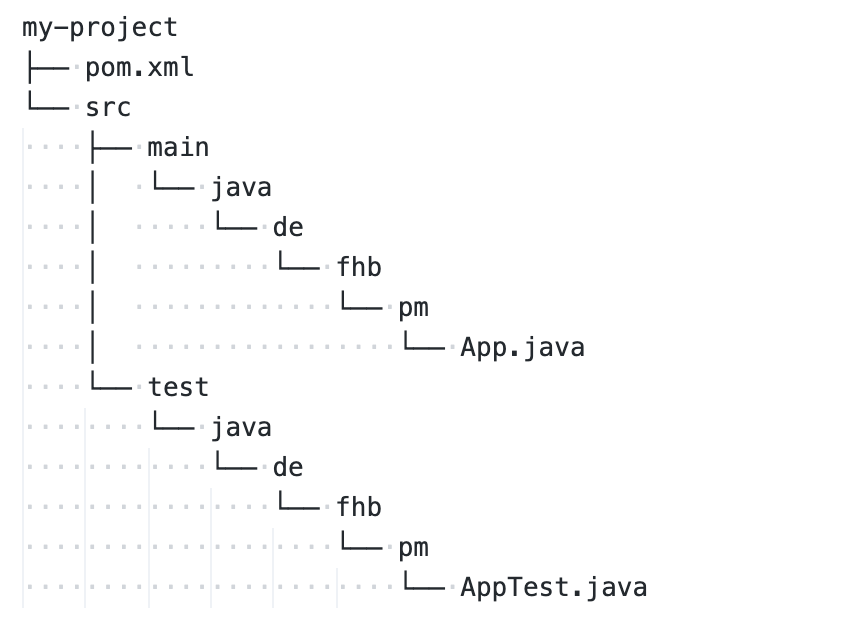
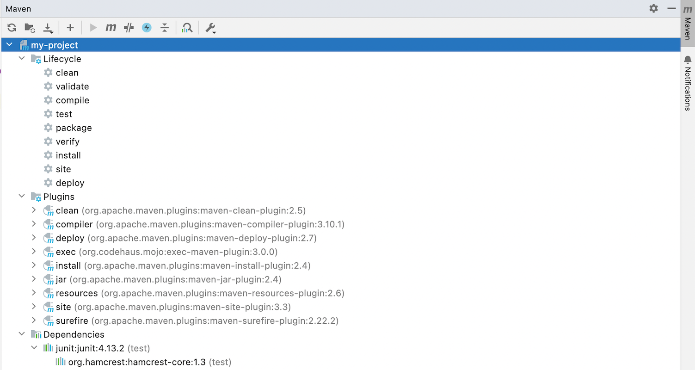

## Build-Tool Maven: Alternative zu Ant oder Gradle

```maven
mvn archetype:generate -DgroupId=de.hsbi.pm -DartifactId=my-project
                       -DarchetypeArtifactId=maven-archetype-quickstart
```

\bigskip
\smallskip

{width="40%"}

::: notes
Von der zeitlichen Entstehung her kommt Maven nach Ant, aber vor Gradle. Wie in Ant sind
auch die Maven-Buildskripte XML-basierte Textdateien (Gradle nutzt eine Groovy-basierte DSL).

Allerdings hat Maven im Gegensatz zu Ant bereits ein Modell des Java-Entwicklungsprozess
"eingebaut": Im Ant-Skript muss alles, was man tun möchte, explizit als Target formuliert
werden, d.h. auch ein Kompilieren der Sourcen oder Ausführen der Tests muss extra als Target
ins Ant-Skript geschrieben werden, um benutzbar zu sein. In Maven ist dieses Modell bereits
implementiert, d.h. hier muss man lediglich zusätzliche oder abweichende Dinge im XML-File
konfigurieren. Das nennt man auch ["*convention over configuration*"](https://en.wikipedia.org/wiki/Convention_over_configuration).

Der Maven-Aufruf
`mvn archetype:generate -DgroupId=de.hsbi.pm -DartifactId=my-project -DarchetypeArtifactId=maven-archetype-quickstart`
erzeugt mit Hilfe des Plugins `archetype`, welches das Ziel (engl.: "*Maven goal*") `generate`
bereitstellt, ein neues Projekt mit dem Namen `my-project` und der initialen Package-Struktur
`de.hsbi.pm`. Das von Maven für die Projekterstellung genutzte Plugin ist unter der ID
`maven-archetype-quickstart` in den Maven-Repositories (etwa [Maven-Central](https://mvnrepository.com/repos/central))
verfügbar, hier kann man mit der zusätzlichen Option `-DarchetypeVersion=1.4` auf die letzte
Version schalten.

Die erzeugte Ordnerstruktur entspricht der Standardstruktur von Gradle (Gradle hat diese
quasi von Maven übernommen). Die Konfigurationsdatei für Maven hat den Namen `pom.xml`.

*Hinweis*: Die `groupId` und `artifactId` werden auch für eine Veröffentlichung des Jar-Files
des Projekts auf dem zentralen Maven-Repository [Maven-Central](https://mvnrepository.com/repos/central)
genutzt. Von hier würde Maven auch als Abhängigkeit konfigurierte Bibliotheken herunterladen.
:::


## Lebenszyklus (eingebaut in Maven)

{width="80%"}

::: notes
In Maven ist das typische Java-Entwicklungsmodell als "Lebenszyklus" implementiert.

Entsprechende Plugins stellen die jeweiligen "*Goals*" (Ziele) bereit. Dabei sind
auch die Abhängigkeiten berücksichtigt, d.h. das Ziel `test` erfordert ein `compile` ...
:::


## Project Object Model: *pom.xml*

```{.xml size="scriptsize"}
<project>
    <!-- aktuelle Version für Maven 2.x-->
    <modelVersion>4.0.0</modelVersion>

    <!-- Basisinformationen -->
    <groupId>de.hsbi.pm</groupId>
    <artifactId>my-project</artifactId>
    <version>1.0-SNAPSHOT</version>

    <!-- Eigenschaften, vergleichbar zu den Properties in Ant -->
    <properties>
        <project.build.sourceEncoding>UTF-8</project.build.sourceEncoding>
        <maven.compiler.release>17</maven.compiler.release>
    </properties>

    <!-- Abhängigkeiten zu externen Bibliotheken -->
    <dependencies>
        <dependency>
            <groupId>junit</groupId>
            <artifactId>junit</artifactId>
            <version>4.13.2</version>
            <scope>test</scope>
        </dependency>
    </dependencies>
</project>
```

::: notes
Die Konfigurationsdatei `pom.xml` stellt die Konfiguration für das Maven-Projekt bereit
("Project Object Model").

Es werden mindestens der Name des Projekts sowie die Abhängigkeiten definiert.

Die `groupId` ist ein eindeutiger Bezeichner für die Organisation oder den Autor des Projekts. Oft
wird hier einfach wie im obigen Beispiel eine Package-Struktur genutzt, aber wie im Fall von JUnit
kann dies auch ein einfacher String (dort "`junit`") sein.

Die `artifactId` ist der eindeutige Name für das Projekt, d.h. unter diesem Namen wird das generierte
Jar-File im Maven-Repository zu finden sein (sofern es denn veröffentlicht wird).

Über `dependencies` kann man benötigte Abhängigkeiten definieren, hier als Beispiel JUnit in der
4.x Variante ... Diese werden bei Bedarf von Maven vom Maven-Repository heruntergeladen. Die Einträge
für die Dependencies findet man ebenfalls auf [MavenCentral](https://mvnrepository.com/repos/central).
:::

[[Demo für MavenCentral (Suche, Einträge)]{.ex}]{.slides}


## Project Object Model: Plugins

```{.xml size="scriptsize"}
<project>
    ...

    <!-- Plugins: Stellen eigene "Goals" zur Verfügung -->
    <build>
        <plugins>
            <plugin>
                <!-- https://mvnrepository.com/artifact/org.apache.maven.plugins/maven-compiler-plugin -->
                <groupId>org.apache.maven.plugins</groupId>
                <artifactId>maven-compiler-plugin</artifactId>
                <version>3.10.1</version>
            </plugin>

            <plugin>
                <!-- https://mvnrepository.com/artifact/org.apache.maven.plugins/maven-surefire-plugin -->
                <groupId>org.apache.maven.plugins</groupId>
                <artifactId>maven-surefire-plugin</artifactId>
                <version>2.22.2</version>
            </plugin>
        </plugins>
    </build>
</project>
```

::: notes
Zusätzlich können die Phasen des Build-Prozesses konfiguriert werden, d.h. für die
entsprechenden Plugins finden sich Abschnitte unter `<build><plugins>` in der `pom.xml`.

Auf [maven.apache.org/plugins/index.html](https://maven.apache.org/plugins/index.html)
finden Sie eine Übersicht über häufig benutzte Plugins sowie die von den Plugins
bereitgestellten Goals sowie Konfigurationsmöglichkeiten.

Die entsprechenden POM-Einträge finden Sie analog zu den Dependencies ebenfalls auf
[MavenCentral](https://mvnrepository.com/repos/central) (Tag "plugin" statt "dependency").

Plugins können aber auch selbst erstellt werden und in das Projekt eingebunden werden,
ein erster Einstieg ist die [Plugin-API](https://maven.apache.org/ref/3.8.1/maven-plugin-api/).
:::


::: notes
## Und wie lasse ich jetzt eine Anwendung mal laufen?

*   `mvn clean`: Lösche alle generierten Artefakte, beispielsweise `.class`-Dateien.
*   `mvn compile` => `mvn compiler:compile`: Übersetze die Sourcen und schiebe die
    generierten `.class`-Dateien in den Ordner `target/classes/` (Default). Dazu werden alle
    Abhängigkeiten aufgelöst und bei Bedarf (neu) heruntergeladen (Default: Userverzeichnis,
    Ordner `.m2/`).
*   `mvn test` => `mvn surefire:test`: Lasse die Tests laufen. Hängt von `compile`
    ab. Namenskonvention: Alle Klassen mit `*Test.java` und `Test*.java` im Standard-Testordner
    `src/test/java/` werden betrachtet (und weitere, vgl.
    [maven.apache.org/surefire/maven-surefire-plugin/examples/junit-platform.html](https://maven.apache.org/surefire/maven-surefire-plugin/examples/junit-platform.html)).
*   `mvn package`: Hängt von `compile` ab und erzeugt ein Jar-File mit dem Namen
    "artifactId-version.jar" im Ordner `target/`. Mit `mvn install` kann man dieses
    Jar-File dann auch dem lokalen Repository im Home-Verzeichnis des Users (`.m2/`)
    hinzufügen.
*   `mvn exec:java -Dexec.mainClass="de.hsbi.pm.Main"`: Hängt von `compile` ab und
    führt die Klasse `de.hsbi.pm.Main` aus.
:::

[Demo: pom.xml]{.ex href="https://github.com/Programmiermethoden-CampusMinden/Prog2-Lecture/blob/master/lecture/building/src/maven/pom.xml"}


## Wrap-Up

Apache Maven: [maven.apache.org](https://maven.apache.org), [Maven Getting Started Guide](https://maven.apache.org/guides/getting-started/index.html)

\bigskip

*   Automatisieren von Arbeitabläufen
*   Apache Maven: Goals, Properties, Dependencies => "_Convention over Configuration_",
    Java-Standard-Lebenszyklus eingebaut
    *   Goals sind auswählbare Ziele, bereitgestellt durch Plugins
    *   Abhängigkeiten zwischen Goals möglich
    *   Properties agieren wie Variablen, etwa für Versionsnummern
    *   Abhängigkeiten zu externen Bibliotheken werden als Dependencies
        formuliert: [Abschnitt von Maven-Central kopieren]{.notes}
