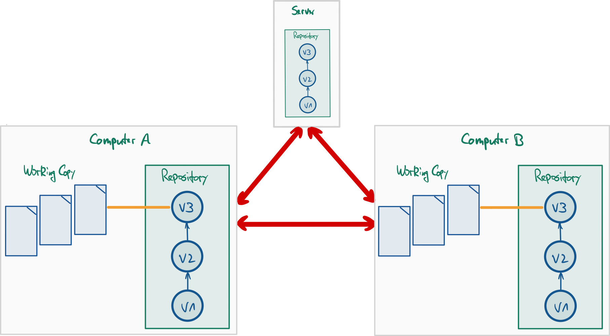

## Nutzung von Git in Projekten: Verteiltes Git (und Workflows)

{width="80%"}

::: notes
Git ermöglicht ein einfaches und schnelles Branchen. Dies kann man mit
entsprechenden Branching-Strategien sinnvoll für die SW-Entwicklung einsetzen.

Im Folgenden sollen also die Frage betrachtet werden: **Wie setze ich Branches sinnvoll ein?**
:::

## Umgang mit Branches: Themen-Branches

                    I---J---K  wuppieV1
                   /
              D---F  wuppie
             /
    A---B---C---E  master
                 \
                  G---H  test

::: notes
Branchen ist in Git sehr einfach und schnell. Deshalb wird (gerade auch im Vergleich mit
SVN) gern und viel gebrancht.

Ein häufiges anzutreffendes Modell ist dabei die Nutzung von
**Themen-Branches**: Man hat einen Hauptzweig (`master`). Wann immer eine neue
Idee oder ein Baustein unabhängig entwickelt werden soll/kann, wird ein
entsprechender Themen-Branch aufgemacht. Dabei handelt es sich normalerweise
um **kleine Einheiten**!

Themenbranches haben in der Regel eine **kurze Lebensdauer**: Wenn die Entwicklung
abgeschlossen ist, wird die Idee bzw. der Baustein in den Hauptzweig integriert
und der Themenbranch gelöscht.

*   Vorteil: Die Entwicklung im Themenbranch ist in sich gekapselt und stört
    nicht die Entwicklung in anderen Branches (und diese stören umgekehrt nicht
    die Entwicklung im Themenbranch).

*   Nachteil:
    *   Mangelnder Überblick durch viele Branches
    *   Ursprung der Themenbranches muss überlegt gewählt werden, d.h. alle
        dort benötigten Features müssen zu dem Zeitpunkt im Hauptzweig
        vorhanden sein
:::

## Umgang mit Branches: Langlaufende Branches

    A---B---D  master
         \
          C---E---I  develop
               \
                F---G---H  topic

::: notes
Häufig findet man in (größeren) Projekten Branches, die über die gesamte
Lebensdauer des Projekts existieren, sogenannte "langlaufende Branches".

Normalerweise gibt es einen Branch, in dem stets der stabile Stand des Projekts
enthalten ist. Dies ist häufig der `master`. In diesem Branch gibt es nur
sehr wenige Commits: normalerweise nur Merges aus dem `develop`-Branch (etwa
bei Fertigstellung einer Release-Version) und ggf. Fehlerbehebungen.

Die aktive Entwicklung findet in einem separaten Branch statt: `develop`. Hier
nutzt man zusätzlich Themen-Branches für die Entwicklung einzelner Features,
die nach Fertigstellung in den `develop` gemergt werden.

Kleinere Projekte kommen meist mit den zwei langlaufenden Branches in der
obigen Darstellung aus. Bei größeren Projekten finden sich häufig noch etliche
weitere langlaufende Branches, beispielsweise "Proposed Updates" etc. beim
Linux-Kernel.

*   Vorteile:
    *   Mehr Struktur im Projekt durch in ihrer Semantik wohldefinierte
        Branches
    *   Durch weniger Commits pro Branch lässt sich die Historie leichter
        verfolgen (u.a. auch aus bestimmter Rollen-Perspektive: Entwickler,
        Manager, ...)

*   Nachteile: Bestimmte "ausgezeichnete" Branches; zusätzliche Regeln zum
    Umgang mit diesen beachten
:::

## Komplexe Branching-Strategie: Git-Flow

    A---B---------------------G---J1  master
         \                   / \ /
          \                 /   X  fix
           \               /     \
            C-------------F----I--J2  develop
             \           / \  /
              \         /   H1  featureB
               \       /
                D1----D2  featureA
                 \
                  E1---E2---E3---E4---E5  featureC

::: notes
Das Git-Flow-Modell von Vincent Driessen
([nvie.com/posts/a-successful-git-branching-model](http://nvie.com/posts/a-successful-git-branching-model/))
zeigt einen in der Praxis überaus bewährten Umgang mit Branches. Lesen Sie an
der angegebenen Stelle nach, besser kann man die Nutzung dieses eleganten
Modells eigentlich nicht erklären :-)
:::

## Git-Flow: Hauptzweige _master_ und _develop_

    A---B-------E---------------J  master
         \     /               /
          C---D---F---G---H---I---K  develop

::: notes
Bei Git-Flow gibt es zwei langlaufende Branches: Den `master`, der immer den stabilen
Stand enthält und in den *nie* ein direkter Commit gemacht wird, sowie den `develop`,
wo letztlich (ggf. über Themenbranches) die eigentliche Entwicklung stattfindet.

Änderungen werden zunächst im `develop` erstellt und getestet. Wenn die Features
stabil sind, erfolgt ein Merge von `develop` in den `master`. Hier kann noch der
Umweg über einen `release`-Branch genommen werden: Als "Feature-Freeze" wird vom
`develop` ein `release`-Branch abgezweigt. Darin wird das Release dann aufpoliert,
d.h. es erfolgen nur noch kleinere Korrekturen und Änderungen, aber keine echte
Entwicklungsarbeit mehr. Nach Fertigstellung wird der `release` dann sowohl in den
`master` als auch `develop` gemergt.
:::

## Git-Flow: Weitere Branches als Themen-Branches

    A---B---------------------I-------------K  master
         \                   /             /
          C------------F----H-------------J---L  develop
           \          / \  /             /
            \        /   G1  featureB   /
             \      /                  /
              D1---D2  featureA       /
               \                     /
                E1---E2---E3---E4---E5  featureC

::: notes
Für die Entwicklung eigenständiger Features bietet es sich auch im
Git-Flow an, vom `develop` entsprechende Themenbranches abzuzweigen
und darin jeweils isoliert die Features zu entwickeln. Wenn diese
Arbeiten eine gewisse Reife haben, werden die Featurebranches in den
`develop` integriert.
:::

::::::::: notes
## Git-Flow: Merging-Detail

    ---C--------E  develop
        \      /                 git merge --no-ff
         D1---D2  featureA

vs.

    ---C---D1---D2  develop      git merge

Wenn beim Mergen ein "*fast forward*" möglich ist, würde Git beim Mergen
eines (Feature-) Branches in den `develop` (oder allgemein in einen anderen
Branch) *keinen* separaten Commit erzeugen (Situation rechts in der Abbildung).

Damit erscheint der `develop`-Branch wie eine lineare Folge von Commits. In
manchen Projekten wird dies bevorzugt, weil die Historie sehr übersichtlich
aussieht.

Allerdings verliert man die Information, dass hier ein Feature entwickelt wurde
und wann es in den `develop` integriert wurde (linke Seite in obiger Abbildung).
Häufig wird deshalb ein extra Merge-Commit mit `git merge --no-ff <branch>`
(extra Schalter "`--no-ff`") erzwungen, obwohl ein "*fast forward*" möglich wäre.

Anmerkung: Man kann natürlich auch über Konventionen in den Commit-Kommentaren
eine gewisse Übersichtlichkeit erzwingen. Beispielsweise könnte man vereinbaren,
dass alle Commit-Kommentare zu einem Feature "A" mit "`feature a: `" starten müssen.
:::::::::

## Git-Flow: Umgang mit Fehlerbehebung

    A---B---D--------F1  master
         \   \      /
          \   E1---E2  fix
           \        \
            C1-------F2  develop

::: notes
Wenn im stabilen Branch (also dem `master`) ein Problem bekannt wird,
darf man es nicht einfach im `master` fixen. Stattdessen wird ein extra
Branch vom `master` abgezweigt, in dem der Fix entwickelt wird. Nach
Fertigstellung wird dieser Branch sowohl in den `master` als auch den
`develop` gemergt, damit auch im Entwicklungszweig der Fehler behoben ist.

Dadurch entspricht jeder Commit im `master` einem Release.
:::

## Vereinfachte Braching-Strategie: GitHub Flow

    A---B---C----D-----------E  master
         \   \  /           /
          \   ta1  topicA  /
           \              /
            tb1---tb2---tb3  topicB

::: notes
Github verfolgt eine deutlich vereinfachte Strategie: "GitHub Flow"
(vgl. ["GitHub Flow" (S. Chacon)](https://githubflow.github.io/)
bzw. ["GitHub flow" (GitHub, Inc.)](https://docs.github.com/en/get-started/quickstart/github-flow)).

Hier ist der stabile Stand ebenfalls immer im `master`. Features werden ebenso
wie im Git-Flow-Modell in eigenen Feature-Branches entwickelt.

Allerdings zweigen Feature-Branches *immer direkt* vom `master` ab und werden nach
dem Test auch immer dort wieder direkt integriert (es gibt also keine weiteren
langlaufenden Branches wie `develop` oder `release`).

In der obigen Abbildung ist zu sehen, dass für die Entwicklung eines Features ein
entsprechender Themenbranch vom `master` abgezweigt wird. Darin erfolgt dann die
Entwicklung des Features, d.h. mehrere Commits. Das Mergen des Features in den
`master` erfolgt dann aber nicht lokal, sondern mit einem "Pull-Request" auf dem
Server: Sobald man im Feature-Branch einen "diskussionswürdigen" Stand hat, wird ein
**Pull-Request** (*PR*) über die Weboberfläche aufgemacht (streng genommen gehört
dies in die Kategorie ["Zusammenarbeit" bzw. "Workflows"](workflows.md);
außerdem gehört ein PR nicht zu Git selbst, sondern zum Tooling von Github). In
einem PR können andere Entwickler den Code kommentieren und ergänzen. Jeder weitere
Commit auf dem Themenbranch wird ebenfalls Bestandteil des Pull-Requests. Parallel
laufen ggf. automatisierte Tests etc. und durch das Akzeptieren des PR in der
Weboberfläche erfolgt schließlich der Merge des Feature-Branches in den `master`.
:::

::: notes
## Diskussion: Git-Flow vs. GitHub Flow

In der Praxis zeigt sich, dass das Git-Flow-Modell besonders gut geeignet ist,
wenn man tatsächlich so etwas wie "Releases" hat, die zudem nicht zu häufig
auftreten.

Das GitHub-Flow-Vorgehen bietet sich an, wenn man entweder keine Releases hat
oder diese sehr häufig erfolgen (typisch bei agiler Vorgehensweise). Zudem
vermeidet man so, dass die Feature-Branches zu lange laufen, womit normalerweise
die Wahrscheinlichkeit von Merge-Konflikten stark steigt.
**Achtung**: Da die Feature-Branches direkt in den `master`, also den stabilen
Produktionscode gemergt werden, ist es hier besonders wichtig, *vor* dem Merge
entsprechende Tests durchzuführen und den Merge erst zu machen, wenn alle Tests
"grün" sind.

Hier ein paar Einstiegsseiten für die Diskussion, die teilweise sehr erbittert
(und mit ideologischen Zügen) geführt wird (erinnert an die Diskussionen, welche
Linux-Distribution die bessere sei):

*   [Git-Flow-Modell von Vincent Driessen](https://nvie.com/posts/a-successful-git-branching-model/)
*   [Kurzer Überblick über das GitHub-Flow-Modell](https://guides.github.com/introduction/flow/)
*   [Diskussion des GitHub-Flow-Modells (Github)](https://githubflow.github.io/)
*   [Luca Mezzalira: "Git-Flow vs Github Flow"](https://lucamezzalira.com/2014/03/10/git-flow-vs-github-flow/)
*   [Scott Schacon, Autor des Pro-Git-Buchs](https://scottchacon.com/2011/08/31/github-flow.html)
*   [Noch eine (längere) Betrachtung (Robin Daugherty)](https://hackernoon.com/a-branching-and-releasing-strategy-that-fits-github-flow-be1b6c48eca2)
:::

## Wrap-Up

*   Einsatz von Themenbranches für die Entwicklung
*   Unterschiedliche Modelle:
    -   Git-Flow: umfangreiches Konzept, gut für Entwicklung mit festen Releases
    -   GitHub Flow: deutlich schlankeres Konzept, passend für kontinuierliche Entwicklung ohne echte Releases

<!-- DO NOT REMOVE - THIS IS A LAST SLIDE TO INDICATE THE LICENSE AND POSSIBLE EXCEPTIONS (IMAGES, ...). -->
::: slides
## LICENSE

Unless otherwise noted, this work is licensed under CC BY-SA 4.0.
:::
