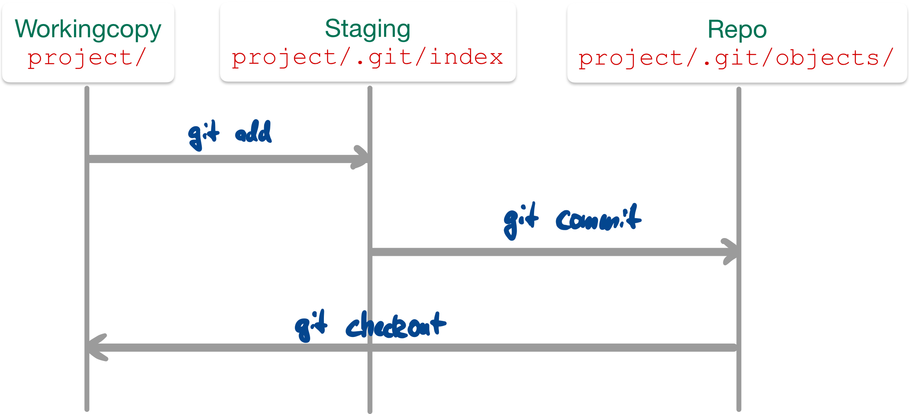
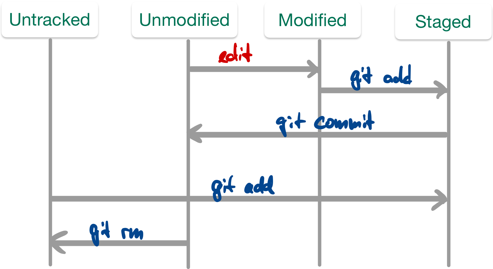
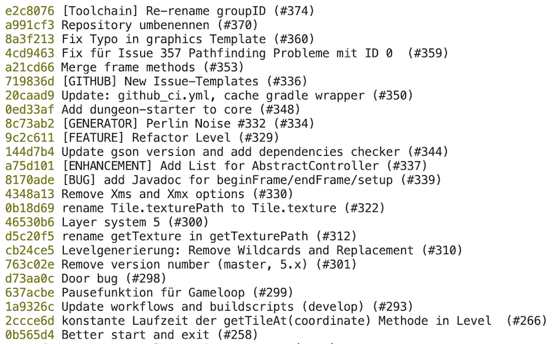
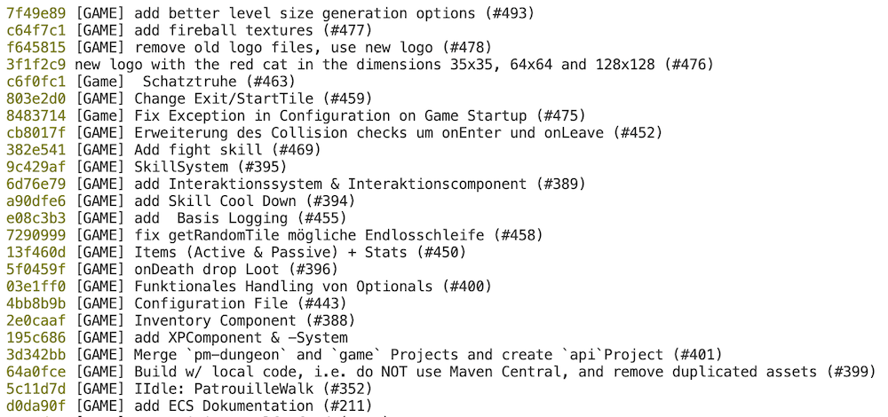

## Versionsverwaltung mit Git: Typische Arbeitsschritte

1.  Repository anlegen (oder clonen)

\bigskip

2.  Dateien neu erstellen (und löschen, umbenennen, verschieben)
3.  Änderungen einpflegen ("committen")
4.  Änderungen und Logs betrachten
5.  Änderungen rückgängig machen
6.  Projektstand markieren ("taggen")

\bigskip

7.  Entwicklungszweige anlegen ("branchen")
8.  Entwicklungszweige zusammenführen ("mergen")

\bigskip

9.  Änderungen verteilen (verteiltes Arbeiten, Workflows)


## Dateien unter Versionskontrolle stellen

\bigskip

{width="80%"}

::: notes
1.  `git add .` (oder `git add <file>`)

    => Stellt [alle]{.alert} Dateien (bzw. die Datei `<file>`)
    im aktuellen Verzeichnis unter Versionskontrolle

2.  `git commit`

    => Fügt die Dateien dem Repository hinzu
:::

\bigskip
\bigskip

**Abfrage mit `git status`**

[[Konsole]{.bsp}]{.slides}


## Änderungen einpflegen

\bigskip

{width="70%"}

\bigskip

*   Abfrage mit: `git status`
*   "Staging" von modifizierten Dateien: `git add <file>`
*   Committen der Änderungen im Stage: `git commit`

::: notes
*Anmerkung*: Alternativ auch mit `git commit -m "Kommentar"`, um das Öffnen
des Editors zu vermeiden ... geht einfach schneller ;)
:::

::: notes
Das "staging area" stellt eine Art Zwischenebene zwischen Working Copy und
Repository dar: Die Änderungen sind temporär "gesichert", aber noch nicht
endgültig im Repository eingepflegt ("committed").

Man kann den Stage dazu nutzen, um Änderungen an einzelnen Dateien zu sammeln
und diese dann (in einem Commit) gemeinsam einzuchecken.

Man kann den Stage in der Wirkung umgehen, indem man alle in der Working Copy
vorliegenden Änderungen per `git commit -a -m "Kommentar"` eincheckt. Der
Schalter "`-a`" nimmt alle vorliegenden Änderungen an **bereits versionierten**
Dateien, fügt diese dem Stage hinzu und führt dann den Commit durch. Das ist
das von SVN bekannte Verhalten. Achtung: Nicht versionierte Dateien bleiben
dabei außen vor!
:::

[[Konsole]{.bsp}]{.slides}


## Letzten Commit ergänzen

*   `git commit --amend -m "Eigentlich wollte ich das so sagen"`

    ::: notes
    Wenn keine Änderungen im Stage sind, wird so die letzte Commit-Message geändert.
    :::

\bigskip

*   `git add <file>; git commit --amend`

    ::: notes
    Damit können vergessene Änderungen an der Datei `<file>`
    zusätzlich im letzten Commit aufgezeichnet werden.

    [In beiden Fällen ändert sich die Commit-ID!]{.alert}
    :::

[[Konsole]{.bsp}]{.slides}


::: notes
## Weitere Datei-Operationen: hinzufügen, umbenennen, löschen

*   Neue (unversionierte) Dateien und Änderungen an versionierten Dateien zum Staging hinzufügen: `git add <file>`
*   Löschen von Dateien (Repo+Workingcopy): `git rm <file>`
*   Löschen von Dateien (nur Repo): `git rm --cached <file>`
*   Verschieben/Umbenennen: `git mv <fileAlt> <fileNeu>`


Aus Sicht von Git sind zunächst alle Dateien "untracked", d.h. stehen nicht
unter Versionskontrolle.

Mit `git add <file>` (und `git commit`) werden Dateien in den Index (den
Staging-Bereich, d.h. nach dem Commit letztlich in das Repository) aufgenommen.
Danach stehen sie unter "Beobachtung" (Versionskontrolle). So lange, wie eine
Datei identisch zur Version im Repository ist, gilt sie als unverändert
("unmodified"). Eine Änderung führt entsprechend zum Zustand "modified", und
ein `git add <file>` speichert die Änderungen im Stage. Ein Commit überführt
die im Stage vorgemerkte Änderung in das Repo, d.h. die Datei gilt wieder
als "unmodified".

Wenn eine Datei nicht weiter versioniert werden soll, kann sie aus dem Repo
entfernt werden. Dies kann mit `git rm <file>` geschehen, wobei die Datei auch
aus der Workingcopy gelöscht wird. Wenn die Datei erhalten bleiben soll, aber
nicht versioniert werden soll (also als "untracked" markiert werden soll), dann
muss sie mit `git rm --cached <file>` aus der Versionskontrolle gelöscht werden.
Achtung: Die Datei ist dann nur ab dem aktuellen Commit gelöscht, d.h. frühere
Revisionen enthalten die Datei noch!

Wenn eine Datei umbenannt werden soll, geht das mit `git mv <fileAlt> <fileNeu>`.
Letztlich ist dies nur eine Abkürzung für die Folge `git rm --cached <fileAlt>`,
manuelles Umbenennen der Datei in der Workingcopy und `git add <fileNeu>`.
:::


## Commits betrachten

*   Liste aller Commits: `git log`
    *   `git log -<n>` oder `git log --since="3 days ago"`
        [Meldungen eingrenzen ...]{.notes}
    *   `git log --stat` [Statistik ...]{.notes}
    *   `git log --author="pattern"` [Commits eines Autors]{.notes}
    *   `git log <file>` [Änderungen einer Datei]{.notes}

\bigskip

*   Inhalt eines Commits: `git show`

[[Konsole]{.bsp}]{.slides}


## Änderungen und Logs betrachten

*   `git diff [<file>]`

    Änderungen zwischen Workingcopy und letztem Commit (ohne Stage)

    ::: notes
    Das "staging area" wird beim Diff von Git behandelt, als wären die dort
    hinzugefügten Änderungen bereits eingecheckt (genauer: als letzter Commit
    im aktuellen Branch im Repo vorhanden).
    D.h. wenn Änderungen in einer Datei mittels `git add <datei>` dem Stage
    hinzugefügt wurden, zeigt `git diff <datei>` keine Änderungen an!
    :::

\bigskip

*   `git diff commitA commitB`

    Änderungen zwischen Commits

\bigskip

*   Blame: `git blame <file>`

    Wer hat was wann gemacht?

[[Konsole]{.bsp}]{.slides}


## Dateien ignorieren: _.gitignore_

::: notes
*   Nicht alle Dateien gehören ins Repo:
    *   generierte Dateien: `.class`
    *   temporäre Dateien
*   Datei `.gitignore` anlegen und committen
    *   Wirkt auch für Unterordner
    *   Inhalt: Reguläre Ausdrücke für zu ignorierende Dateien und Ordner
:::


```{.gitignore}
    # Compiled source #
    *.class
    *.o
    *.so

    # Packages #
    *.zip

    # All directories and files in a directory #
    bin/**/*
```

[man 5 gitignore]{.bsp href="https://linux.die.net/man/5/gitignore"}


## Zeitmaschine

*   Änderungen in Workingcopy rückgängig machen
    *   Änderungen nicht in Stage: `git checkout <file>` oder `git restore <file>`
    *   Änderungen in Stage: `git reset HEAD <file>` oder `git restore --staged <file>`

    ::: notes
    => Hinweise von `git status` beachten!
    :::

\bigskip

*   Datei aus altem Stand holen:
    *   `git checkout <commit> <file>`, oder
    *   `git restore --source <commit> <file>`
*   Commit verwerfen, Geschichte neu: `git revert <commit>`

::: notes
*Hinweis*: In den neueren Versionen von Git ist der Befehl `git restore` hinzugekommen, mit
dem Änderungen rückgängig gemacht werden können. Der bisherige Befehl `git checkout` steht
immer noch zur Verfügung und bietet über `git restore` hinaus weitere Anwendungsmöglichkeiten.
:::

\bigskip

*   Stempel (Tag) vergeben:
    `git tag <tagname> <commit>`
*   Tags anzeigen: `git tag` und `git show <tagname>`

[[Konsole]{.bsp}]{.slides}


## Wann und wie committen?

\Large
::: center
[**Jeder Commit stellt einen Rücksetzpunkt dar!**]{.alert}
:::
\normalsize

\bigskip
\bigskip
\bigskip

[Typische Regeln:]{.notes}

*   Kleinere "Häppchen" einchecken: ein Feature oder Task
    [(das nennt man auch _atomic commit_: das kleinste Set an Änderungen, die
    gemeinsam Sinn machen und die ggf. gemeinsam zurückgesetzt werden können)]{.notes}
*   Logisch zusammenhängende Änderungen gemeinsam einchecken
*   Projekt muss nach Commit compilierbar sein
*   Projekt sollte nach Commit lauffähig sein

::: notes
Ein Commit sollte in sich geschlossen sein, d.h. die kleinste Menge an Änderungen
enthalten, die gemeinsam einen Sinn ergeben und die (bei Bedarf) gemeinsam
zurückgesetzt oder verschoben werden können. Das nennt man auch **atomic commit**.

Wenn Sie versuchen, die Änderungen in Ihrem Commit zu beschreiben (siehe nächste Folie
"Commit-Messages"), dann werden Sie einen _atomic commit_ mit einem kurzen Satz (natürlich
im Imperativ!) beschreiben können. Wenn Sie mehr Text brauchen, haben Sie wahrscheinlich
keinen _atomic commit_ mehr vor sich.

**Lesen Sie dazu auch [How atomic Git commits dramatically increased my productivity - and will increase yours too](https://dev.to/samuelfaure/how-atomic-git-commits-dramatically-increased-my-productivity-and-will-increase-yours-too-4a84).**
:::


## Schreiben von Commit-Messages: WARUM?!

:::::: notes
Schauen Sie sich einmal einen Screenshot eines `git log --oneline 61e48f0..e2c8076`
im [Dungeon-CampusMinden/Dungeon](https://github.com/Dungeon-CampusMinden/Dungeon) an:



Nun stellen Sie sich vor, Sie sind auf der Suche nach Informationen, suchen einen
bestimmten Commit oder wollen eine bestimmte Änderung finden ...

Wenn man das genauer analysiert, dann stören bestimmte Dinge:

*   Mischung aus Deutsch und Englisch
*   "Vor-sich-hin-Murmeln": "Layer system 5"
*   Teileweise werden Tags genutzt wie `[BUG]`, aber nicht durchgängig
*   Mischung zwischen verschiedenen Formen: "Repo umbenennen", "Benenne Repo um", "Repo umbenannt"
*   Unterschiedliche Groß- und Kleinschreibung
*   Sehr unterschiedlich lange Zeilen/Kommentare

**Das Beachten einheitlicher Regeln ist enorm wichtig!**

Leider sagt sich das so leicht - in der Praxis macht man es dann
doch schnell wieder unsauber. Dennoch, auch im Dungeon-Repo gibt
es einen positiven Trend (`git log --oneline 8039d6c..7f49e89`):



Typische Regeln und Konventionen tauchen überall auf, beispielsweise
in @Chacon2014 oder bei Tim Pope (siehe nächstes Beispiel) oder bei
["How to Write a Git Commit Message"](https://cbea.ms/git-commit/).
::::::

```markdown
Short (50 chars or less) summary of changes

More detailed explanatory text, if necessary.  Wrap it to about
72 characters or so.  In some contexts, the first line is treated
as the subject of an email and the rest of the text as the body.
The blank line separating the summary from the body is critical
(unless you omit the body entirely); tools like rebase can get
confused if you run the two together.

Further paragraphs come after blank lines.

 - Bullet points are okay, too
 - Typically a hyphen or asterisk is used for the bullet, preceded
   by a single space, with blank lines in between, but conventions
   vary here
```

[Quelle: ["A Note About Git Commit Messages"](https://tbaggery.com/2008/04/19/a-note-about-git-commit-messages.html) by [Tim Pope](https://tpo.pe/) on tbaggery.com]{.origin}

:::::: notes
Denken Sie sich die Commit-Message als E-Mail an einen zukünftigen Entwickler,
der das in fünf Jahren liest!

Vom Aufbau her hat eine E-Mail auch eine Summary und dann den eigentlichen Inhalt ...
Erklären Sie das **"WARUM"** der Änderung! (Das "WER", "WAS", "WANN" wird bereits
automatisch von Git aufgezeichnet ...)

::: center
[**Lesen (und beachten) Sie unbedingt auch ["How to Write a Git Commit Message"](https://cbea.ms/git-commit/)!**]{.alert}
:::
::::::

[[Analogie E-Mail an zukünftigen Entwickler]{.bsp}]{.slides}


::: notes
## Ausflug "Conventional Commits"

Die Commit-Messages dienen vor allem der Dokumentation und werden von Entwicklern gelesen.

Wenn man die Messages ein wenig stärker formalisieren würde, dann könnte man diese aber auch
mit Tools verarbeiten und beispielsweise automatisiert Changelogs oder Release-Texte verfassen!

Betrachten Sie einmal das Projekt [ConventionalCommits.org](https://github.com/conventional-commits/conventionalcommits.org).
Dies ist ein solcher Versuch, die Commit-Messages (a) einheitlicher und lesbarer zu gestalten
und (b) auch eine Tool-gestützte Auswertung zu erlauben.

Das Projekt schlägt als Erweitung der üblichen Regeln zum Formatieren von Commit-Messages vor,
dass in der ersten Zeile der _Summary_ noch eine Abkürzung für die in diesem Commit erfolgte
Änderung (Bug-Fix, neues Feature, ...) vorangestellt wird. Dieser Abkürzung kann in Klammern
noch der Scope der Änderung hinzugefügt werden, beispielsweise den Bereich im Projekt, der von
diesem Commit berührt wird. Wenn es eine _breaking change_ ist, also alter Code nach dieser Änderung
sich anders verhält oder vielleicht sogar nicht mehr kompiliert, wird noch ein "!" hinter dem
Typ der Änderung ergänzt.

**Beispiel**: Stellen Sie sich vor, im Dungeon-Projekt wurde ein neues Verhalten hinzugefügt.

1.  Normalerweise hätten Sie vielleicht diese Message geschrieben (angepasste Version aus [Dungeon-CampusMinden/Dungeon/pull/469](https://github.com/Dungeon-CampusMinden/Dungeon/pull/469)):

    ```
    add fight skill

    -   `DamageProjectileSkill` creates a new entity which causes `HealthDamage` when hitting another entity
    -   `FireballSkill` is a more concrete implementation of this
    -   Melee skills can be created with `DamageProjectileSkill` using a customised range
        -   Example: the `FireballSkill` has a range of 10, a melee would have a considerably smaller range

    fixes #24
    fixes #126
    fixes #224
    ```

2.  Mit [ConventionalCommits.org](https://www.conventionalcommits.org/en/v1.0.0/#examples) könnte
    das dann so aussehen:

    ```
    feat: add fight skill

    -   `DamageProjectileSkill` creates a new entity which causes `HealthDamage` when hitting another entity
    -   `FireballSkill` is a more concrete implementation of this
    -   Melee skills can be created with `DamageProjectileSkill` using a customised range
        -   Example: the `FireballSkill` has a range of 10, a melee would have a considerably smaller range

    fixes #24
    fixes #126
    fixes #224
    ```

    Da es sich um ein neues Feature handelt, wurde der Summary in der ersten Zeile ein `feat: ` vorangestellt.

    Die zu verwendenden Typen/Abkürzungen sind im Prinzip frei definierbar. Das Projekt
    [ConventionalCommits.org](https://github.com/conventional-commits/conventionalcommits.org)
    schlägt eine Reihe von Abkürzungen vor. Auf diese Weise sollen in möglichst allen Projekten, die Conventional
    Commits nutzen, die selben Abkürzungen/Typen eingesetzt werden und so eine Tool-gestützte Auswertung möglich
    werden.

3.  Oder zusätzlich mit dem Scope der Änderung:

    ```
    feat(game): add fight skill

    -   `DamageProjectileSkill` creates a new entity which causes `HealthDamage` when hitting another entity
    -   `FireballSkill` is a more concrete implementation of this
    -   Melee skills can be created with `DamageProjectileSkill` using a customised range
        -   Example: the `FireballSkill` has a range of 10, a melee would have a considerably smaller range

    fixes #24
    fixes #126
    fixes #224
    ```

    Der Typ `feat` wurde hier noch ergänzt um einen frei definierbaren Identifier für den Projektbereich. Dieser
    wird in Klammern direkt hinter den Typ notiert (hier `feat(game): `).

    Im Beispiel habe ich als Bereich "game" genommen, weil die Änderung sich auf den Game-Aspekt des Projekts
    bezieht. Im konkreten Projekt wären andere Bereiche eventuell "dsl" (für die im Projekt entwickelte
    Programmiersprache plus Interpreter) und "blockly" (für die Integration von Google Blockly zur Programmierung
    des Dungeons mit LowCode-Ansätzen). Das ist aber letztlich vom Projekt abhängig und weitestgehend
    Geschmackssache.

4.  Oder zusätzlich noch als Auszeichnung "breaking change" (hier mit _scope_, geht aber auch ohne _scope_):

    ```
    feat(game)!: add fight skill

    -   `DamageProjectileSkill` creates a new entity which causes `HealthDamage` when hitting another entity
    -   `FireballSkill` is a more concrete implementation of this
    -   Melee skills can be created with `DamageProjectileSkill` using a customised range
        -   Example: the `FireballSkill` has a range of 10, a melee would have a considerably smaller range

    fixes #24
    fixes #126
    fixes #224
    ```

    Angenommen, das neue Feature muss in der API etwas ändern, so dass existierender Code nun nicht mehr
    funktionieren würde. Dies wird mit dem extra Ausrufezeichen hinter dem Typ/Scope kenntlich gemacht
    (hier `feat(game)!: `).

    Zusätzlich kann man einen "Footer" in die Message einbauen, also eine extra Zeile am Ende, die mit dem String
    "BREAKING CHANGE:" eingeleitet wird. (vgl. [Conventional Commits > Examples](https://www.conventionalcommits.org/en/v1.0.0/#examples))


Es gibt noch viele weitere Initiativen, Commit-Messages lesbarer zu gestalten und zu vereinheitlichen.
Schauen Sie sich beispielsweise einmal [gitmoji.dev](https://github.com/carloscuesta/gitmoji) an.
(_Mit einem Einsatz in einem professionellen Umfeld wäre ich hier aber sehr ... vorsichtig._)
:::


## Wrap-Up

*   Änderungen einpflegen zweistufig (`add`, `commit`)
*   Status der Workingcopy mit `status` ansehen
*   Logmeldungen mit `log` ansehen
*   Änderungen auf einem File mit `diff` bzw. `blame` ansehen
*   Projektstand markieren mit `tag`
*   Ignorieren von Dateien/Ordnern: Datei `.gitignore`


<!-- DO NOT REMOVE - THIS IS A LAST SLIDE TO INDICATE THE LICENSE AND POSSIBLE EXCEPTIONS (IMAGES, ...). -->
::: slides
## LICENSE


Unless otherwise noted, this work is licensed under CC BY-SA 4.0.

\bigskip

### Exceptions
*   Citation ["_A Note About Git Commit Messages_"](https://tbaggery.com/2008/04/19/a-note-about-git-commit-messages.html) by [Tim Pope](https://tpo.pe/) on tbaggery.com
:::
