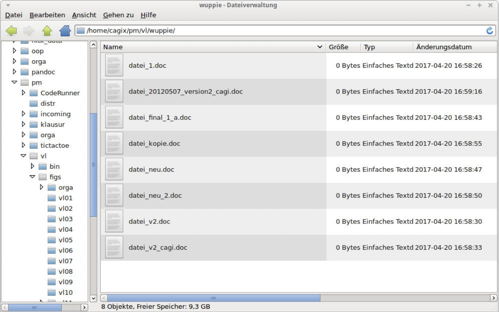

# Intro: Versionskontrolle in der Softwareentwicklung

> [!NOTE]
>
> 

>
> 
<strong>🎯 TL;DR</strong>

>
> In der Softwareentwicklung wird häufig ein Versionsmanagementsystem
> (VCS) eingesetzt, welches die Verwaltung von Versionsständen und
> Änderungen ermöglicht. Ein Repository sammelt dabei die verschiedenen
> Änderungen (quasi wie eine Datenbank der Software-Versionsstände). Die
> Software *Git* ist verbreiteter Vertreter und arbeitet mit dezentralen
> Repositories.
>
> Ein neues lokales Repository kann man mit `git init` anlegen. Der
> Befehl legt den Unterordner `.git/` im aktuellen Ordner an, darin
> befindet sich das lokale Repository und weitere von Git benötigte
> Dateien (FINGER WEG!). Die Dateien und anderen Unterordner im
> aktuellen Ordner können nun der Versionskontrolle hinzugefügt werden.
>
> Den lokal vorliegenden (Versions-) Stand der Dateien im aktuellen
> Ordner nennt man auch “Workingcopy”.
>
> Ein bereits existierendes Repo kann mit `git clone <url>` geklont
> werden.
>
> [GitHub](https://github.com) ist nicht Git, sondern ein kommerzieller
> Anbieter, der das Hosten von Git-Repositories und weitere Features
> anbietet.
>
> 

>
> 

>
> 
<strong>🎦 Videos</strong>

>
> - [VL Git Intro](https://youtu.be/Ac3-pZhVf_c)
> - [Demo Config](https://youtu.be/0noYvZvQhic)
> - [Demo Repo](https://youtu.be/ZaWEwIpER-U)
>
> 

## Typische Probleme bei SW-Entwicklung

- Was hat wer wann (und wo) geändert? Und warum?
- Ich brauche den Stand von gestern/letzter Woche/…
- Ich will schnell mal eine neue Idee ausprobieren …
- Ich arbeite an mehreren Rechnern (Synchronisation)
- Wir müssen gemeinsam an der gleichen Codebasis arbeiten.
- Wir arbeiten am Release v42, aber Kunde braucht schnell einen Fix für
  v40

## Folgen SW-Entwicklung ohne Versionsverwaltung

- Filesystem müllt voll mit manuell versionierten Dateien/Sicherungen
  ala `file_20120507_version2_cagi.txt`
- Ordner/Projekte müssen dupliziert werden für neue Ideen
- Code müllt voll mit auskommentierten Zeilen (“Könnte ja noch gebraucht
  werden”)
- Unklar, wann welche Änderung von wem warum eingeführt wurde
- Unbeabsichtigtes Überschreiben mit älteren Versionen beim Upload in
  gemeinsamen Filesharing-Bereich

## Prinzip Versionsverwaltung

- **Repository:** **Datenbank** mit verschiedenen Versionsständen,
  Kommentaren, Tags etc.

<!-- -->

- **Workingcopy:** **Arbeitskopie** eines bestimmten Versionsstandes

## Varianten: Zentrale Versionsverwaltung (Beispiel SVN)

Es gibt ein zentrales Repository (typischerweise auf einem Server), von
dem die Developer einen bestimmten Versionsstand “auschecken” (sich
lokal kopieren) und in welches sie Änderungen wieder zurück “pushen”.

Zur Abfrage der Historie und zum Veröffentlichen von Änderungen benötigt
man entsprechend immer eine Verbindung zum Server.

## Varianten: Verteilte Versionsverwaltung (Beispiel Git)

In diesem Szenario hat jeder Developer nicht nur die Workingcopy,
sondern auch noch eine Kopie des Repositories. Zusätzlich kann es einen
oder mehrere Server geben, auf denen dann nur das Repository vorgehalten
wird, d.h. dort gibt es normalerweise keine Workingcopy. Damit kann
unabhängig voneinander gearbeitet werden.

Allerdings besteht nun die Herausforderung, die geänderten Repositories
miteinander abzugleichen. Das kann zwischen dem lokalen Rechner und dem
Server passieren, aber auch zwischen zwei “normalen” Rechnern (also
zwischen den Developern).

**Hinweis**: *GitHub ain’t no Git!* Git ist eine Technologie zur
Versionsverwaltung. Es gibt verschiedene Implementierungen und Plugins
für IDEs und Editoren. [GitHub](https://github.com) ist dagegen *ein*
Dienstleister, wo man Git-Repositories ablegen kann und auf diese mit
Git (von der Konsole oder aus der IDE) zugreifen kann. Darüber hinaus
bietet der Service aber zusätzliche Features an, beispielsweise ein
Issue-Management oder sogenannte *Pull-Requests*. Dies hat aber zunächst
mit Git nichts zu tun. Weitere populäre Anbieter sind beispielsweise
[Bitbucket](https://bitbucket.org/) oder [Gitlab](https://gitlab.com)
oder [Gitea](https://gitea.io/en-us/), wobei einige auch selbst gehostet
werden können.

## Versionsverwaltung mit Git: Typische Arbeitsschritte

1.  Repository anlegen (oder clonen)

<!-- -->

1.  Dateien neu erstellen (und löschen, umbenennen, verschieben)
2.  Änderungen einpflegen (“committen”)
3.  Änderungen und Logs betrachten
4.  Änderungen rückgängig machen
5.  Projektstand markieren (“taggen”)

<!-- -->

1.  Entwicklungszweige anlegen (“branchen”)
2.  Entwicklungszweige zusammenführen (“mergen”)

<!-- -->

1.  Änderungen verteilen (verteiltes Arbeiten, Workflows)

## (Globale) Konfiguration

**Minimum**:

- `git config --global user.name <name>`
- `git config --global user.email <email>`

Diese Konfiguration muss man nur einmal machen.

Wenn man den Schalter `--global` weglässt, gelten die Einstellungen nur
für das aktuelle Projekt/Repo.

Zumindest Namen und EMail-Adresse **muss** man setzen, da Git diese
Information beim Anlegen der Commits speichert (== benötigt!).

**Aliase**:

- `git config --global alias.ci commit`
- `git config --global alias.co checkout`
- `git config --global alias.br branch`
- `git config --global alias.st status`
- `git config --global alias.ll 'log --all --graph --decorate --oneline'`

Zusätzlich kann man weitere Einstellungen vornehmen, etwa auf bunte
Ausgabe umschalten: `git config --global color.ui auto` oder Abkürzungen
(Aliase) für Befehle definieren:
`git config --global alias.ll 'log --all --oneline --graph --decorate'`
…

Git (und auch GitHub) hat kürzlich den Namen des Default-Branches von
`master` auf `main` geändert. Dies kann man in Git ebenfalls selbst
einstellen: `git config --global init.defaultBranch <name>`.

Anschauen kann man sich die Einstellungen in der Textdatei
`~/.gitconfig` oder per Befehl `git config --global -l`.

## Neues Repo anlegen

- `git init`

  =\> Erzeugt neues Repository im akt. Verzeichnis

<!-- -->

- `git clone <url>`

  =\> Erzeugt (verlinkte) Kopie des Repos unter `<url>`

## Wrap-Up

- Git: Versionsmanagement mit dezentralen Repositories
- Anlegen eines lokalen Repos mit `git init`
- Clonen eines existierenden Repos mit `git clone <url>`

## 📖 Zum Nachlesen

- Chacon und Straub ([2014, Kap. 1](#ref-Chacon2014) und 2)
- Atlassian Pty Ltd ([2022](#ref-AtlassianGit))
- Github Inc. ([2022](#ref-GitCheatSheet))

------------------------------------------------------------------------

> [!TIP]
>
> 

>
> 
<strong>✅ Lernziele</strong>

>
> - k1: Ich kenne verschiedene Varianten der Versionierung
> - k1: Ich kann die Begriffe ‘Workingcopy’ und ‘Repository’ definieren
> - k2: Ich kann zwischen ‘Github’ und ‘Git’ unterscheiden
> - k2: Ich kann auf meinem Rechner lokale Git-Repositories anlegen
> - k3: Ich kann mit den Git-Befehlen zum Anlegen von lokalen Repos auf der Konsole umgehen
>
> 

------------------------------------------------------------------------

> [!NOTE]
>
> 

>
> 
<strong>👀 Quellen</strong>

>
> 
 entry-spacing="0">
>
> 

>
> Atlassian Pty Ltd. 2022. „Become a Git Guru.“ 2022.
> <https://www.atlassian.com/git/tutorials>.
>
> 

>
> 

>
> Chacon, S., und B. Straub. 2014. *Pro Git*. 2. Aufl. Apress.
> <https://git-scm.com/book/en/v2>.
>
> 

>
> 

>
> Github Inc. 2022. „Git Cheat Sheets“. 2022.
> <https://training.github.com/>.
>
> 

>
> 

>
> 

------------------------------------------------------------------------

Unless otherwise noted, this work is licensed under CC BY-SA 4.0.

<blockquote>
<strong>Last modified:</strong> df56b1c (lecture: remove explicit link to pdf version, 2025-07-23) 
</blockquote>
