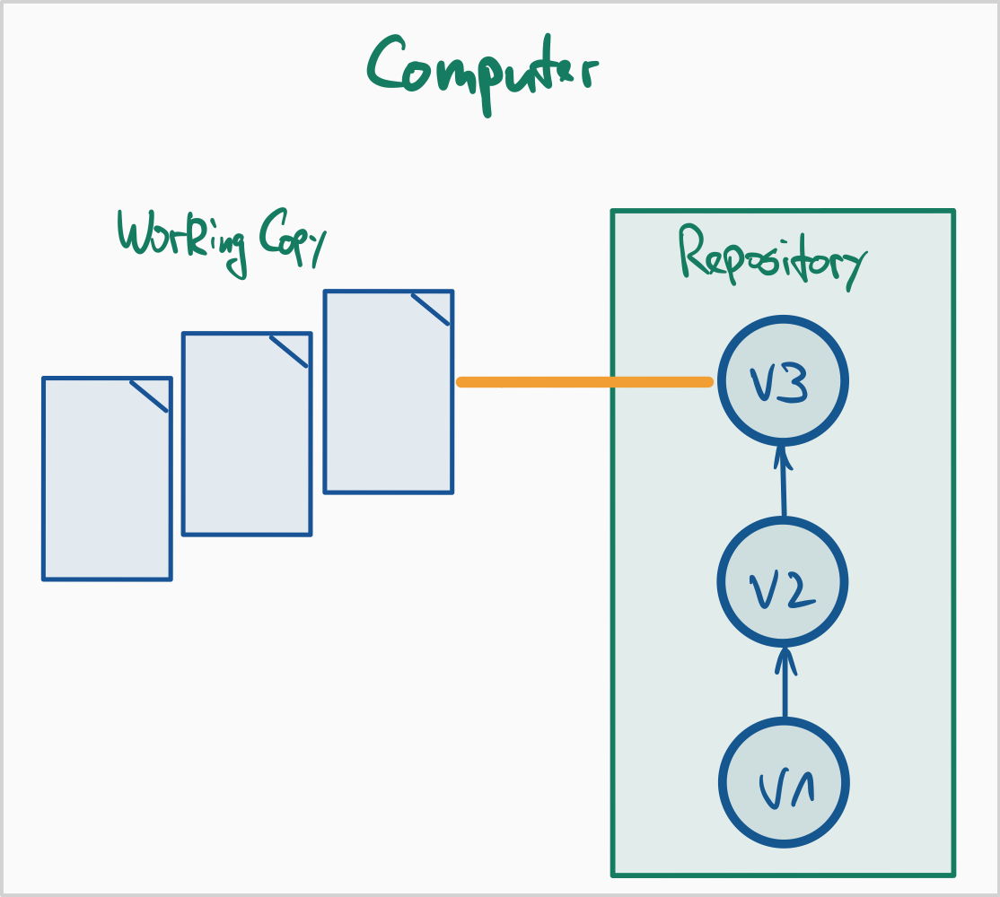
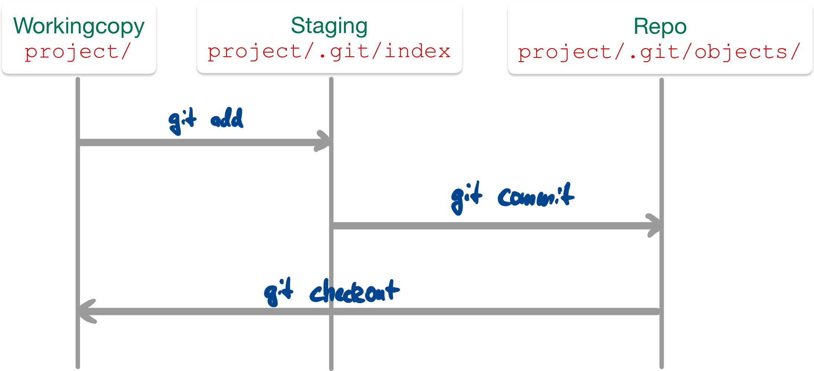
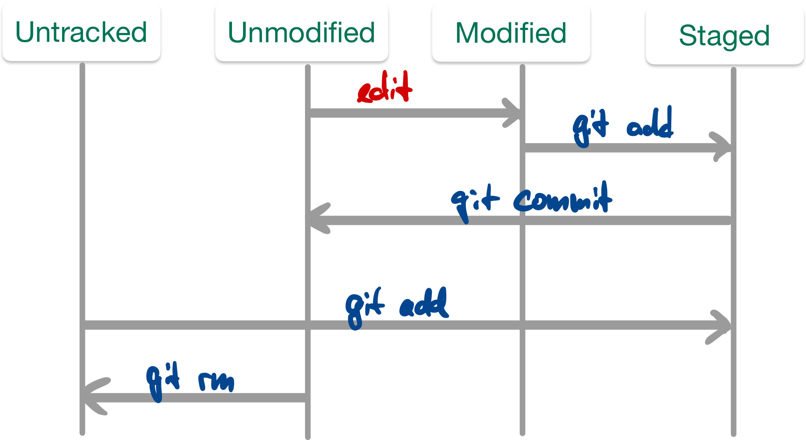

::: tldr
In der Softwareentwicklung wird häufig ein Versionsmanagementsystem (VCS)
eingesetzt, welches die Verwaltung von Versionsständen und Änderungen ermöglicht.
Ein Repository sammelt dabei die verschiedenen Änderungen (quasi wie eine Datenbank
der Software-Versionsstände). Die Software *Git* ist verbreiteter Vertreter und
arbeitet mit dezentralen Repositories.

Ein neues lokales Repository kann man mit `git init`anlegen.Der Befehl legt im
aktuellen Projektordner einen versteckten Unterordner `.git/` an (FINGER WEG!).
anderen Unterordner im aktuellen Ordner können nun der Versionskontrolle hinzugefügt
werden. Der Projektordner selbst (mit Ihren Quelltexten) ist die *Workingcopy*.

Ein bereits existierendes Repo kann mit `git clone <url>` geklont werden.

Änderungen an Dateien (in der Workingcopy) werden mit `git add` zum "Staging"
(Index) hinzugefügt. Dies ist eine Art Sammelbereich für Änderungen, die mit dem
nächsten Commit in das Repository überführt werden. Neue (bisher nicht versionierte
Dateien) müssen ebenfalls zunächst mit `git add` zum Staging hinzugefügt werden.

Änderungen kann man mit `git log` betrachten, dabei erhält man u.a. eine Liste der
Commits und der jeweiligen Commmit-Messages.

Mit `git diff` kann man gezielt Änderungen zwischen Commits oder Branches
betrachten.

Mit `git tag` kann man bestimmte Commits mit einem "Stempel" (zusätzlicher Name)
versehen, um diese leichter finden zu können.

Wichtig sind die Commit-Messages: Diese sollten eine kurze Zusammenfassung haben,
die **aktiv** formuliert wird (was ändert dieser Commit: "Formatiere den Java-Code
entsprechend Style"; nicht aber "Java-Code nach Style formatiert"). Falls der
Kommentar länger sein soll, folgt eine Leerzeile auf die erste Zeile
(Zusammenfassung) und danach ein Block mit der längeren Erklärung.
:::

::: youtube
-   [VL Git Intro](https://youtu.be/Ac3-pZhVf_c)
-   [VL Git Basics](https://youtu.be/GxJI8nmZVE8)
-   [Demo Config](https://youtu.be/0noYvZvQhic)
-   [Demo Repo](https://youtu.be/ZaWEwIpER-U)
-   [Demo New Files](https://youtu.be/ITF8wj8GluM)
-   [Demo Arbeitsablauf: Datei ändern - stagen -
    committen](https://youtu.be/SFIVudlVUhg)
-   [Demo Amend](https://youtu.be/0uczjI7wsrQ)
-   [Demo Log](https://youtu.be/vmb-PZ1Efkg)
-   [Demo Diff](https://youtu.be/XB8lfGuU6ZI)
-   [Demo Tag](https://youtu.be/F1W0RqrxCho)

[Introduction to Git with Scott Chacon of GitHub (erster Teil, bis ca. Minute 45)](https://youtu.be/ZDR433b0HJY)
:::

# Prinzip Versionsverwaltung

::::: columns
::: {.column width="48%"}
{width="60%" web_width="40%"}
:::

::: {.column width="50%"}
\vspace{10mm}

-   **Repository:** (interne) **Datenbank** mit verschiedenen Versionsständen,
    Kommentaren, Tags etc.

    ::: notes
    -   Technisch ist das das Verzeichnis `.git` im Projektordner
    -   Unterscheidung:
        -   Lokales Repository: Das `.git`-Verzeichnis auf dem lokalen Rechner
        -   Remote-Repository: Kopie der Historie auf einem Server (z.B. GitHub,
            GitLab, Codeberg), Zugriff über Web-GUI oder Netzwerk

    Enthält u.a. alle Commits (Schnappschüsse), alle Blobs (Dateiinhalte), Trees
    (Verzeichnisstrukturen), Referenzen wie Branches, Tags, HEAD, (lokale)
    Konfigurationen (z.B. `.git/config`).

    Das Repository selbst enthält keine "normalen" Dateien, die Sie mit einem Editor
    öffnen (sollten); es ist ein interner Speicher, den Git verwaltet.

    `git clone <url>` erstellt aus einem Remote‑Repository eine lokale Kopie
    (Workingcopy + lokales Repository).
    :::

-   **Workingcopy / Arbeitskopie**: Projektordner mit bestimmtem Versionsstand

    ::: notes
    Das ist der Projektordner, das Sie in der IDE oder im Editor öffnen, z.B.
    `~/projekte/shop-system/`.

    Der Projektordner, in dem Sie tatsächlich arbeiten (editieren, kompilieren,
    testen). Nach einem `git clone` oder `git checkout` entspricht der Inhalt einem
    bestimmten Commit. Danach können Sie beliebig neue Dateien anlegen und
    bestehende Dateien ändern -- diese Änderungen existieren zunächst nur in der
    Workingcopy, nicht im Repository.

    Die Dateien in der Working Copy können sein:
    -   unverändert (entsprechen genau dem letzten Commit),
    -   modifiziert (geändert seit dem letzten Commit),
    -   neu/untracked (Git kennt sie noch nicht).

    In der Workingcopy gibt es den `.git`-Ordner (Repository), welcher i.d.R. die
    gesamte Historie beinhaltet.
    :::

-   **Staging Area / Index**: Zwischenablage für Dateistände, Vormerkung für Commit

    ::: notes
    Dies ist eine Art Zwischenstufe zw. Arbeitsverzeichnis und Repository, in der
    Änderungen festgehalten werden, die beim nächsten Commit gemeinsam ins
    Repository geschrieben werden.

    Änderungen landen hier durch das Hinzufügen mit `git add`. Erst nach einem
    Commit (`git commit`) landen diese Änderungen tatsächlich im Repository.

    Eine Datei kann gleichzeitig in drei Ständen existieren:
    -   Im letzten Commit (Repository): "offiziell gespeicherter" Stand
    -   Im Index (Staging Area): Stand, der für den nächsten Commit vorgemerkt ist
    -   In der Workingcopy: aktueller Arbeitsstand im Editor (kann weiter verändert
        sein)
    :::

-   **Tracked / Untracked Files**: versionierte vs. nicht-versionierte Dateien im
    Arbeitsverzeichnis

    ::: notes
    -   "Tracked": Dateien, die Git (im Repository) bereits kennt und versioniert
    -   "Untracked": neue Dateien im Arbeitsverzeichnis, von Git (noch) ignoriert
    -   `git status` zeigt diese Unterscheidung sehr gut
    :::

-   **Commit**: "Schnappschuss" von Änderungen zu einem bestimmten Zeitpunkt

    ::: notes
    Enthält Änderungen (Delta) im Vergleich zum Vorgänger-Commit sowie Metadaten
    (Autor, Datum, Commit-Message, Hash-ID).

    Jeder Commit erhält eine eindeutige **Commit-ID** (SHA-1-Hash, z.B.
    `a1b2c3d...`). Mit dieser ID kann man sich gezielt bestimmte Commits anschauen.

    Bildet einen Knoten im Versionsgraphen - Folgen von Commits nennt man auch
    "Branch" (das schauen wir uns in der Sitzung [Git Branches](git2-branches.md)
    genauer an).
    :::
:::
:::::

::: notes
# Varianten: Zentrale Versionsverwaltung (Beispiel SVN)

{width="80%" web_width="40%"}

Es gibt ein zentrales Repository (typischerweise auf einem Server), von dem die
Developer einen bestimmten Versionsstand "auschecken" (sich lokal kopieren) und in
welches sie Änderungen wieder zurück "pushen".

Zur Abfrage der Historie und zum Veröffentlichen von Änderungen benötigt man
entsprechend immer eine Verbindung zum Server.

# Varianten: Verteilte Versionsverwaltung (Beispiel Git)

{width="80%" web_width="60%"}

In diesem Szenario hat jeder Developer nicht nur die Workingcopy, sondern auch noch
eine Kopie des Repositories. Zusätzlich kann es einen oder mehrere Server geben, auf
denen dann nur das Repository vorgehalten wird, d.h. dort gibt es normalerweise
keine Workingcopy. Damit kann unabhängig voneinander gearbeitet werden.

Allerdings besteht nun die Herausforderung, die geänderten Repositories miteinander
abzugleichen. Das kann zwischen dem lokalen Rechner und dem Server passieren, aber
auch zwischen zwei "normalen" Rechnern (also zwischen den Developern).

**Hinweis**: *GitHub ain't no Git!* Git ist eine Technologie zur Versionsverwaltung.
Es gibt verschiedene Implementierungen und Plugins für IDEs und Editoren.
[GitHub](https://github.com) ist dagegen *ein* Dienstleister, wo man
Git-Repositories ablegen kann und auf diese mit Git (von der Konsole oder aus der
IDE) zugreifen kann. Darüber hinaus bietet der Service aber zusätzliche Features an,
beispielsweise ein Issue-Management oder sogenannte *Pull-Requests*. Dies hat aber
zunächst mit Git nichts zu tun. Weitere populäre Anbieter sind beispielsweise
[Bitbucket](https://bitbucket.org/) oder [Gitlab](https://gitlab.com) oder
[Gitea](https://gitea.io/en-us/), wobei einige auch selbst gehostet werden können.
:::

# Versionsverwaltung mit Git: Typische Arbeitsschritte

1.  Repository anlegen (oder clonen)

\bigskip

2.  Dateien neu erstellen (und löschen, umbenennen, verschieben)
3.  Änderungen einpflegen ("committen")
4.  Änderungen und Logs betrachten
5.  Änderungen rückgängig machen
6.  Projektstand markieren ("taggen")

\bigskip

7.  Entwicklungszweige anlegen ("branchen")
8.  Entwicklungszweige zusammenführen ("mergen")

\bigskip

9.  Änderungen verteilen (verteiltes Arbeiten, Workflows)

::: notes
# (Globale) Konfiguration

**Minimum**:

-   `git config --global user.name <name>`
-   `git config --global user.email <email>`

Diese Konfiguration muss man nur einmal machen.

Wenn man den Schalter `--global` weglässt, gelten die Einstellungen nur für das
aktuelle Projekt/Repo.

Zumindest Namen und EMail-Adresse **muss** man setzen, da Git diese Information beim
Anlegen der Commits speichert (\== benötigt!).

\bigskip
\bigskip

**Aliase**:

-   `git config --global alias.ci commit`
-   `git config --global alias.co checkout`
-   `git config --global alias.br branch`
-   `git config --global alias.st status`
-   `git config --global alias.ll 'log --all --graph --decorate --oneline'`

Zusätzlich kann man weitere Einstellungen vornehmen, etwa auf bunte Ausgabe
umschalten: `git config --global color.ui auto` oder Abkürzungen (Aliase) für
Befehle definieren:
`git config --global alias.ll 'log --all --oneline --graph --decorate'` ...

Git (und auch GitHub) hat kürzlich den Namen des Default-Branches von `master` auf
`main` geändert. Dies kann man in Git ebenfalls selbst einstellen:
`git config --global init.defaultBranch <name>`.

Anschauen kann man sich die Einstellungen in der Textdatei `~/.gitconfig` oder per
Befehl `git config --global -l`.
:::

# Neues Repo anlegen

-   `git init`

    =\> Erzeugt neues Repository im akt. Verzeichnis

\bigskip

-   `git clone <url>`

    =\> Erzeugt (verlinkte) Kopie [des Repos unter `<url>`]{.notes}

[[Konsole]{.ex}]{.slides}

# Dateien unter Versionskontrolle stellen

\bigskip

{width="80%" web_width="60%"}

::: notes
1.  `git add .` (oder `git add <file>`)

    =\> Stellt alle Dateien (bzw. die Datei `<file>`) im aktuellen Verzeichnis unter
    Versionskontrolle

2.  `git commit`

    =\> Fügt die Dateien dem Repository hinzu
:::

\bigskip
\bigskip

**Abfrage mit `git status`**

[[Konsole]{.ex}]{.slides}

# Änderungen einpflegen

\bigskip

{width="70%" web_width="50%"}

\bigskip

-   Abfrage mit: `git status`
-   "Staging" von modifizierten Dateien: `git add <file>`
-   Committen der Änderungen im Stage: `git commit`

::: notes
*Anmerkung*: Alternativ auch mit `git commit -m "Kommentar"`, um das Öffnen des
Editors zu vermeiden ... geht einfach schneller ;)
:::

::: notes
Das "staging area" stellt eine Art Zwischenebene zwischen Working Copy und
Repository dar: Die Änderungen sind temporär "gesichert", aber noch nicht endgültig
im Repository eingepflegt ("committed").

Man kann den Stage dazu nutzen, um Änderungen an einzelnen Dateien zu sammeln und
diese dann (in einem Commit) gemeinsam einzuchecken.

Man kann den Stage in der Wirkung umgehen, indem man alle in der Working Copy
vorliegenden Änderungen per `git commit -a -m "Kommentar"` eincheckt. Der Schalter
"`-a`" nimmt alle vorliegenden Änderungen an **bereits versionierten** Dateien, fügt
diese dem Stage hinzu und führt dann den Commit durch. Das ist das von SVN bekannte
Verhalten. Achtung: Nicht versionierte Dateien bleiben dabei außen vor!
:::

[[Konsole]{.ex}]{.slides}

# Letzten Commit ergänzen

-   `git commit --amend -m "Eigentlich wollte ich das so sagen"`

    ::: notes
    Wenn keine Änderungen im Stage sind, wird so die letzte Commit-Message geändert.
    :::

\bigskip

-   `git add <file>; git commit --amend`

    ::: notes
    Damit können vergessene Änderungen an der Datei `<file>` zusätzlich im letzten
    Commit aufgezeichnet werden.

    **In beiden Fällen ändert sich die Commit-ID!**
    :::

[[Konsole]{.ex}]{.slides}

::: notes
# Weitere Datei-Operationen: hinzufügen, umbenennen, löschen

-   Neue (unversionierte) Dateien und Änderungen an versionierten Dateien zum
    Staging hinzufügen: `git add <file>`
-   Löschen von Dateien (Repo+Workingcopy): `git rm <file>`
-   Löschen von Dateien (nur Repo): `git rm --cached <file>`
-   Verschieben/Umbenennen: `git mv <fileAlt> <fileNeu>`

Aus Sicht von Git sind zunächst alle Dateien "untracked", d.h. stehen nicht unter
Versionskontrolle.

Mit `git add <file>` (und `git commit`) werden Dateien in den Index (den
Staging-Bereich, d.h. nach dem Commit letztlich in das Repository) aufgenommen.
Danach stehen sie unter "Beobachtung" (Versionskontrolle). So lange, wie eine Datei
identisch zur Version im Repository ist, gilt sie als unverändert ("unmodified").
Eine Änderung führt entsprechend zum Zustand "modified", und ein `git add <file>`
speichert die Änderungen im Stage. Ein Commit überführt die im Stage vorgemerkte
Änderung in das Repo, d.h. die Datei gilt wieder als "unmodified".

Wenn eine Datei nicht weiter versioniert werden soll, kann sie aus dem Repo entfernt
werden. Dies kann mit `git rm <file>` geschehen, wobei die Datei auch aus der
Workingcopy gelöscht wird. Wenn die Datei erhalten bleiben soll, aber nicht
versioniert werden soll (also als "untracked" markiert werden soll), dann muss sie
mit `git rm --cached <file>` aus der Versionskontrolle gelöscht werden. Achtung: Die
Datei ist dann nur ab dem aktuellen Commit gelöscht, d.h. frühere Revisionen
enthalten die Datei noch!

Wenn eine Datei umbenannt werden soll, geht das mit `git mv <fileAlt> <fileNeu>`.
Letztlich ist dies nur eine Abkürzung für die Folge `git rm --cached <fileAlt>`,
manuelles Umbenennen der Datei in der Workingcopy und `git add <fileNeu>`.
:::

# Commits betrachten

-   Liste aller Commits: `git log`
    -   `git log -<n>` oder `git log --since="3 days ago"` [Meldungen eingrenzen
        ...]{.notes}
    -   `git log --stat` [Statistik ...]{.notes}
    -   `git log --author="pattern"` [Commits eines Autors]{.notes}
    -   `git log <file>` [Änderungen einer Datei]{.notes}

\bigskip

-   Inhalt eines Commits: `git show`

[[Konsole]{.ex}]{.slides}

# Änderungen und Logs betrachten

-   `git diff [<file>]`

    Änderungen zwischen Workingcopy und letztem Commit (ohne Stage)

    ::: notes
    Das "staging area" wird beim Diff von Git behandelt, als wären die dort
    hinzugefügten Änderungen bereits eingecheckt (genauer: als letzter Commit im
    aktuellen Branch im Repo vorhanden). D.h. wenn Änderungen in einer Datei mittels
    `git add <datei>` dem Stage hinzugefügt wurden, zeigt `git diff <datei>` keine
    Änderungen an!
    :::

\bigskip

-   `git diff commitA commitB`

    Änderungen zwischen Commits

\bigskip

-   Blame: `git blame <file>`

    Wer hat was wann gemacht?

[[Konsole]{.ex}]{.slides}

# Dateien ignorieren: *.gitignore*

::: notes
-   Nicht alle Dateien gehören ins Repo:
    -   generierte Dateien: `.class`
    -   temporäre Dateien
-   Datei `.gitignore` anlegen und committen
    -   Wirkt auch für Unterordner
    -   Inhalt: Reguläre Ausdrücke für zu ignorierende Dateien und Ordner
:::

``` gitignore
    # Compiled source #
    *.class
    *.o
    *.so

    # Packages #
    *.zip

    # All directories and files in a directory #
    bin/**/*
```

[man 5 gitignore]{.ex href="https://linux.die.net/man/5/gitignore"}

# Zeitmaschine

-   Änderungen in Workingcopy rückgängig machen
    -   Änderungen nicht in Stage: `git checkout <file>` oder `git restore <file>`
    -   Änderungen in Stage: `git reset HEAD <file>` oder
        `git restore --staged <file>`

    ::: notes
    =\> Hinweise von `git status` beachten!
    :::

\bigskip

-   Datei aus altem Stand holen:
    -   `git checkout <commit> <file>`, oder
    -   `git restore --source <commit> <file>`
-   Commit verwerfen, Geschichte neu: `git revert <commit>`

::: notes
*Hinweis*: In den neueren Versionen von Git ist der Befehl `git restore`
hinzugekommen, mit dem Änderungen rückgängig gemacht werden können. Der bisherige
Befehl `git checkout` steht immer noch zur Verfügung und bietet über `git restore`
hinaus weitere Anwendungsmöglichkeiten.
:::

\bigskip

-   Stempel (Tag) vergeben: `git tag <tagname> <commit>`
-   Tags anzeigen: `git tag` und `git show <tagname>`

[[Konsole]{.ex}]{.slides}

# Wann und wie committen?

\Large

::: center
**Jeder Commit stellt einen Rücksetzpunkt dar!**
:::

\normalsize
\bigskip
\bigskip
\bigskip

[Typische Regeln:]{.notes}

-   Kleinere "Häppchen" einchecken: ein Feature oder Task [(das nennt man auch
    *atomic commit*: das kleinste Set an Änderungen, die gemeinsam Sinn machen und
    die ggf. gemeinsam zurückgesetzt werden können)]{.notes}
-   Logisch zusammenhängende Änderungen gemeinsam einchecken
-   Projekt muss nach Commit compilierbar sein
-   Projekt sollte nach Commit lauffähig sein

::: notes
Ein Commit sollte in sich geschlossen sein, d.h. die kleinste Menge an Änderungen
enthalten, die gemeinsam einen Sinn ergeben und die (bei Bedarf) gemeinsam
zurückgesetzt oder verschoben werden können. Das nennt man auch **atomic commit**.

Wenn Sie versuchen, die Änderungen in Ihrem Commit zu beschreiben (siehe nächste
Folie "Commit-Messages"), dann werden Sie einen *atomic commit* mit einem kurzen
Satz (natürlich im Imperativ!) beschreiben können. Wenn Sie mehr Text brauchen,
haben Sie wahrscheinlich keinen *atomic commit* mehr vor sich.

**Lesen Sie dazu auch [How atomic Git commits dramatically increased my
productivity - and will increase yours
too](https://dev.to/samuelfaure/how-atomic-git-commits-dramatically-increased-my-productivity-and-will-increase-yours-too-4a84).**
:::

# Schreiben von Commit-Messages: WARUM?!

::: notes
Schauen Sie sich einmal einen Screenshot eines `git log --oneline 61e48f0..e2c8076`
im [Dungeon-CampusMinden/Dungeon](https://github.com/Dungeon-CampusMinden/Dungeon)
an:

{web_width="60%"}

Nun stellen Sie sich vor, Sie sind auf der Suche nach Informationen, suchen einen
bestimmten Commit oder wollen eine bestimmte Änderung finden ...

Wenn man das genauer analysiert, dann stören bestimmte Dinge:

-   Mischung aus Deutsch und Englisch
-   "Vor-sich-hin-Murmeln": "Layer system 5"
-   Teileweise werden Tags genutzt wie `[BUG]`, aber nicht durchgängig
-   Mischung zwischen verschiedenen Formen: "Repo umbenennen", "Benenne Repo um",
    "Repo umbenannt"
-   Unterschiedliche Groß- und Kleinschreibung
-   Sehr unterschiedlich lange Zeilen/Kommentare

**Das Beachten einheitlicher Regeln ist enorm wichtig!**

Leider sagt sich das so leicht - in der Praxis macht man es dann doch schnell wieder
unsauber. Dennoch, auch im Dungeon-Repo gibt es einen positiven Trend
(`git log --oneline 8039d6c..7f49e89`):

{web_width="80%"}

Typische Regeln und Konventionen tauchen überall auf, beispielsweise in @Chacon2014
oder bei Tim Pope (siehe nächstes Beispiel) oder bei ["How to Write a Git Commit
Message"](https://cbea.ms/git-commit/).
:::

``` markdown
Short (50 chars or less) summary of changes

More detailed explanatory text, if necessary.  Wrap it to about
72 characters or so.  In some contexts, the first line is treated
as the subject of an email and the rest of the text as the body.
The blank line separating the summary from the body is critical
(unless you omit the body entirely); tools like rebase can get
confused if you run the two together.

Further paragraphs come after blank lines.

 - Bullet points are okay, too
 - Typically a hyphen or asterisk is used for the bullet, preceded
   by a single space, with blank lines in between, but conventions
   vary here
```

[["A Note About Git Commit
Messages"](https://tbaggery.com/2008/04/19/a-note-about-git-commit-messages.html) by
[Tim Pope](https://tpo.pe/) on tbaggery.com]{.credits}

:::: notes
Denken Sie sich die Commit-Message als E-Mail an einen zukünftigen Entwickler, der
das in fünf Jahren liest!

Vom Aufbau her hat eine E-Mail auch eine Summary und dann den eigentlichen Inhalt
... Erklären Sie das **"WARUM"** der Änderung! (Das "WER", "WAS", "WANN" wird
bereits automatisch von Git aufgezeichnet ...)

::: center
**Lesen (und beachten) Sie unbedingt auch ["How to Write a Git Commit
Message"](https://cbea.ms/git-commit/)!**
:::
::::

[[Analogie E-Mail an zukünftigen Entwickler]{.ex}]{.slides}

::: notes
# Ausflug "Conventional Commits"

Die Commit-Messages dienen vor allem der Dokumentation und werden von Entwicklern
gelesen.

Wenn man die Messages ein wenig stärker formalisieren würde, dann könnte man diese
aber auch mit Tools verarbeiten und beispielsweise automatisiert Changelogs oder
Release-Texte verfassen!

Betrachten Sie einmal das Projekt
[ConventionalCommits.org](https://github.com/conventional-commits/conventionalcommits.org).
Dies ist ein solcher Versuch, die Commit-Messages (a) einheitlicher und lesbarer zu
gestalten und (b) auch eine Tool-gestützte Auswertung zu erlauben.

Das Projekt schlägt als Erweitung der üblichen Regeln zum Formatieren von
Commit-Messages vor, dass in der ersten Zeile der *Summary* noch eine Abkürzung für
die in diesem Commit erfolgte Änderung (Bug-Fix, neues Feature, ...) vorangestellt
wird. Dieser Abkürzung kann in Klammern noch der Scope der Änderung hinzugefügt
werden, beispielsweise den Bereich im Projekt, der von diesem Commit berührt wird.
Wenn es eine *breaking change* ist, also alter Code nach dieser Änderung sich anders
verhält oder vielleicht sogar nicht mehr kompiliert, wird noch ein "!" hinter dem
Typ der Änderung ergänzt.

**Beispiel**: Stellen Sie sich vor, im Dungeon-Projekt wurde ein neues Verhalten
hinzugefügt.

1.  Normalerweise hätten Sie vielleicht diese Message geschrieben (angepasste
    Version aus
    [Dungeon-CampusMinden/Dungeon/pull/469](https://github.com/Dungeon-CampusMinden/Dungeon/pull/469)):

        add fight skill

        -   `DamageProjectileSkill` creates a new entity which causes `HealthDamage` when hitting another entity
        -   `FireballSkill` is a more concrete implementation of this
        -   Melee skills can be created with `DamageProjectileSkill` using a customised range
            -   Example: the `FireballSkill` has a range of 10, a melee would have a considerably smaller range

        fixes #24
        fixes #126
        fixes #224

2.  Mit
    [ConventionalCommits.org](https://www.conventionalcommits.org/en/v1.0.0/#examples)
    könnte das dann so aussehen:

        feat: add fight skill

        -   `DamageProjectileSkill` creates a new entity which causes `HealthDamage` when hitting another entity
        -   `FireballSkill` is a more concrete implementation of this
        -   Melee skills can be created with `DamageProjectileSkill` using a customised range
            -   Example: the `FireballSkill` has a range of 10, a melee would have a considerably smaller range

        fixes #24
        fixes #126
        fixes #224

    Da es sich um ein neues Feature handelt, wurde der Summary in der ersten Zeile
    ein `feat:` vorangestellt.

    Die zu verwendenden Typen/Abkürzungen sind im Prinzip frei definierbar. Das
    Projekt
    [ConventionalCommits.org](https://github.com/conventional-commits/conventionalcommits.org)
    schlägt eine Reihe von Abkürzungen vor. Auf diese Weise sollen in möglichst
    allen Projekten, die Conventional Commits nutzen, die selben Abkürzungen/Typen
    eingesetzt werden und so eine Tool-gestützte Auswertung möglich werden.

3.  Oder zusätzlich mit dem Scope der Änderung:

        feat(game): add fight skill

        -   `DamageProjectileSkill` creates a new entity which causes `HealthDamage` when hitting another entity
        -   `FireballSkill` is a more concrete implementation of this
        -   Melee skills can be created with `DamageProjectileSkill` using a customised range
            -   Example: the `FireballSkill` has a range of 10, a melee would have a considerably smaller range

        fixes #24
        fixes #126
        fixes #224

    Der Typ `feat` wurde hier noch ergänzt um einen frei definierbaren Identifier
    für den Projektbereich. Dieser wird in Klammern direkt hinter den Typ notiert
    (hier `feat(game):`).

    Im Beispiel habe ich als Bereich "game" genommen, weil die Änderung sich auf den
    Game-Aspekt des Projekts bezieht. Im konkreten Projekt wären andere Bereiche
    eventuell "dsl" (für die im Projekt entwickelte Programmiersprache plus
    Interpreter) und "blockly" (für die Integration von Google Blockly zur
    Programmierung des Dungeons mit LowCode-Ansätzen). Das ist aber letztlich vom
    Projekt abhängig und weitestgehend Geschmackssache.

4.  Oder zusätzlich noch als Auszeichnung "breaking change" (hier mit *scope*, geht
    aber auch ohne *scope*):

        feat(game)!: add fight skill

        -   `DamageProjectileSkill` creates a new entity which causes `HealthDamage` when hitting another entity
        -   `FireballSkill` is a more concrete implementation of this
        -   Melee skills can be created with `DamageProjectileSkill` using a customised range
            -   Example: the `FireballSkill` has a range of 10, a melee would have a considerably smaller range

        fixes #24
        fixes #126
        fixes #224

    Angenommen, das neue Feature muss in der API etwas ändern, so dass existierender
    Code nun nicht mehr funktionieren würde. Dies wird mit dem extra Ausrufezeichen
    hinter dem Typ/Scope kenntlich gemacht (hier `feat(game)!:`).

    Zusätzlich kann man einen "Footer" in die Message einbauen, also eine extra
    Zeile am Ende, die mit dem String "BREAKING CHANGE:" eingeleitet wird. (vgl.
    [Conventional Commits \>
    Examples](https://www.conventionalcommits.org/en/v1.0.0/#examples))

Es gibt noch viele weitere Initiativen, Commit-Messages lesbarer zu gestalten und zu
vereinheitlichen. Schauen Sie sich beispielsweise einmal
[gitmoji.dev](https://github.com/carloscuesta/gitmoji) an. (*Mit einem Einsatz in
einem professionellen Umfeld wäre ich hier aber sehr ... vorsichtig.*)
:::

# Wrap-Up

-   Anlegen eines lokalen Repos mit `git init`
-   Clonen eines existierenden Repos mit `git clone <url>`
-   Änderungen einpflegen zweistufig (`add`, `commit`)
-   Status der Workingcopy mit `status` ansehen
-   Logmeldungen mit `log` ansehen
-   Änderungen auf einem File mit `diff` bzw. `blame` ansehen
-   Projektstand markieren mit `tag`
-   Ignorieren von Dateien/Ordnern: Datei `.gitignore`

::: readings
-   Sie finden den Inhalt dieser Sitzung im @Chacon2014 [Kap. 1 und 2]. Zusätzlich
    finden Sie weitere hilfreiche Informationen rund um Git sowie Cheat-Sheets in
    @AtlassianGit und @GitCheatSheet.
:::

::: outcomes
-   k1: Ich kenne verschiedene Varianten der Versionierung
-   k1: Ich kann die Begriffe 'Workingcopy' und 'Repository' und 'Index' erklären
-   k2: Ich kann zwischen 'Github' und 'Git' unterscheiden
-   k2: Ich kann auf meinem Rechner lokale Git-Repositories anlegen
-   k3: Ich kann mit den Git-Befehlen zum Anlegen von lokalen Repos auf der Konsole
    umgehen
-   k3: Ich kann Dateien zur Versionskontrolle hinzufügen bzw. aus der Versionierung
    löschen
-   k3: Ich kann Änderungen (geänderte Dateien) zum Staging hinzufügen und committen
-   k3: Ich kann Unterschiede zwischen Commits herausfinden und mir die Historie des
    Repos anschauen
-   k3: Ich kann gezielt Dateien und Ordner von der Versionierung ausnehmen
    (ignorieren)
:::

::: challenges
**Versionierung 101**

1.  Legen Sie ein Repository an.
2.  Fügen Sie Dateien dem Verzeichnis hinzu und stellen Sie *einige* davon unter
    Versionskontrolle.
3.  Ändern Sie eine Datei und versionieren Sie die Änderung.
4.  Was ist der Unterschied zwischen "`git add .; git commit`" und
    "`git commit -a`"?
5.  Wie finden Sie heraus, welche Dateien geändert wurden?
6.  Entfernen Sie eine Datei aus der Versionskontrolle, aber nicht aus dem
    Verzeichnis!
7.  Entfernen Sie eine Datei komplett (Versionskontrolle und Verzeichnis).
8.  Ändern Sie eine Datei und betrachten die Unterschiede zum letzten Commit.
9.  Fügen Sie eine geänderte Datei zum Index hinzu. Was erhalten Sie bei
    `git diff <datei>`?
10. Wie können Sie einen früheren Stand einer Datei wiederherstellen? Wie finden Sie
    überhaupt den Stand?
11. Legen Sie sich ein Java-Projekt in Ihrer IDE an an. Stellen Sie dieses Projekt
    unter Git-Versionskontrolle. Führen Sie die vorigen Schritte mit Ihrer IDE
    durch.
:::
