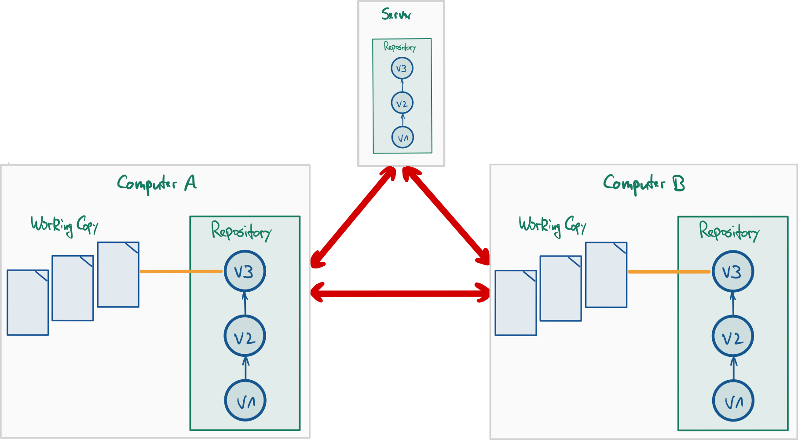
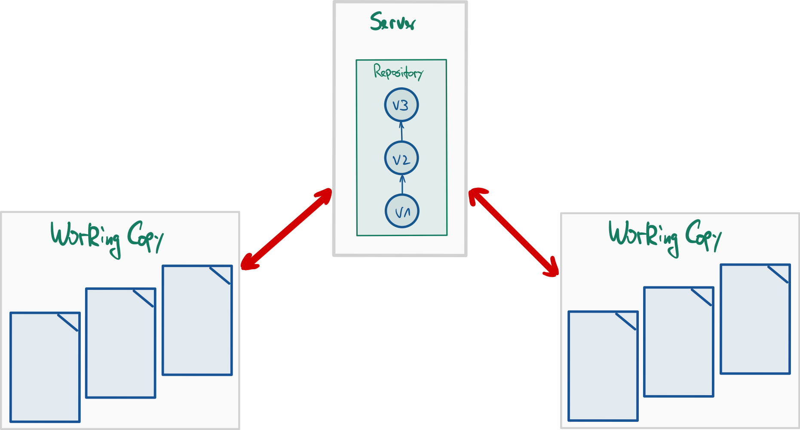
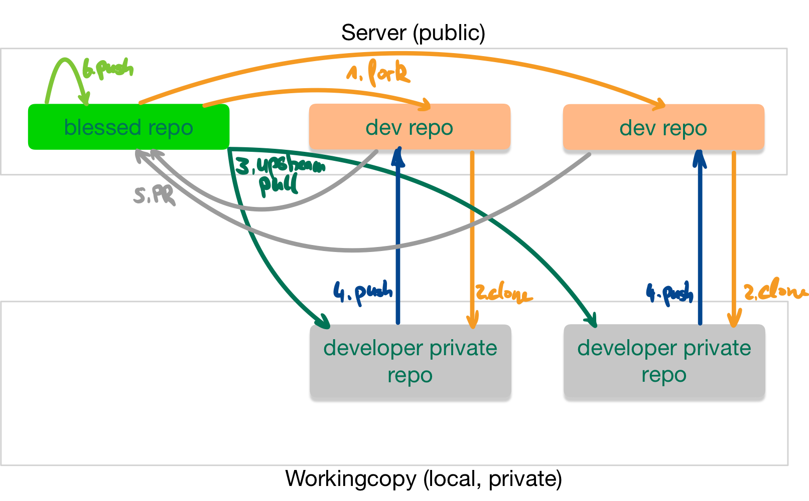
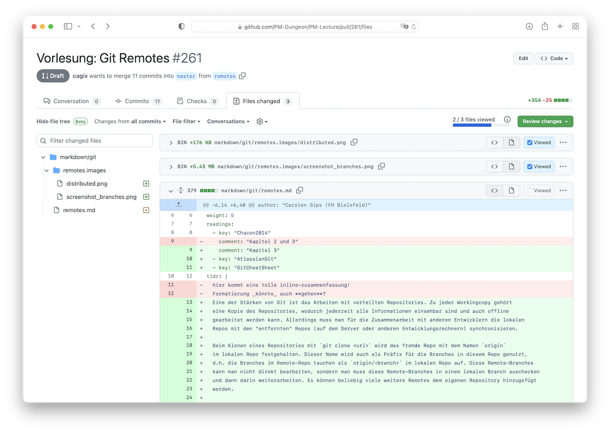
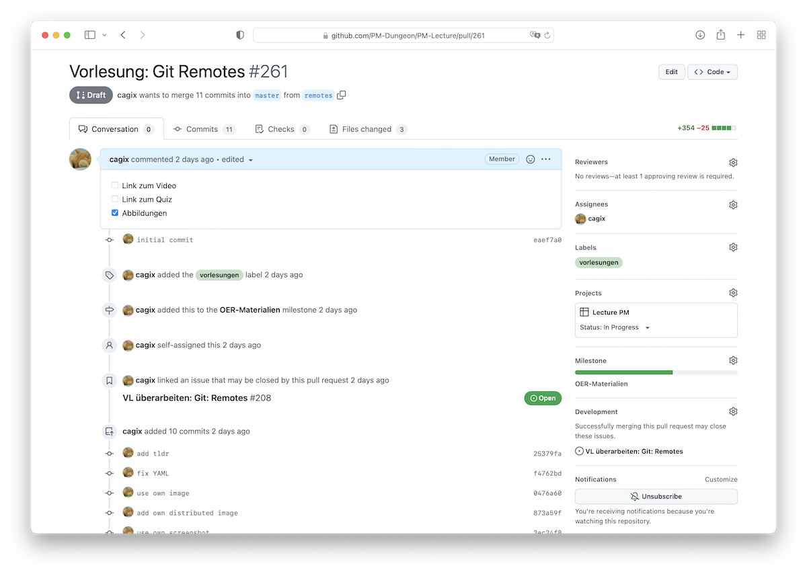

::: tldr
Das Erstellen und Mergen von Branches ist in Git besonders einfach. Dies kann man
sich in der Entwicklung zunutze machen und die einzelnen Features unabhängig
voneinander in eigenen Hilfs-Branches ausarbeiten.

Es haben sich zwei grundlegende Modelle etabliert: "Git-Flow" und "GitHub Flow".

1.  In **Git-Flow** gibt es ein umfangreiches Konzept mit verschiedenen Branches für
    feste Aufgaben, welches sich besonders gut für Entwicklungmodelle mit festen
    Releases eignet. Es gibt zwei langlaufende Branches: `master` enthält den
    stabilen veröffentlichten Stand, in `develop` werden die Ergebnisse der
    Entwicklung gesammelt. Features werden in kleinen Feature-Branches entwickelt,
    die von `develop` abzweigen und dort wieder hineinmünden. Für Releases wird von
    `develop` ein eigener Release-Branch angelegt und nach Finalisierung in den
    `master` und in `develop` gemergt. Fixes werden vom `master` abgezweigt, und
    wieder in den `master` und auch nach `develop` integriert. Dadurch stehen auf
    dem `master` immer die stabilen Release-Stände zur Verfügung, und im `develop`
    sammeln sich die Entwicklungsergebnisse.

2.  Der **GitHub Flow** basiert auf einem deutlich schlankeren Konzept und passt gut
    für die kontinuierliche Entwicklung ohne echte Releases. Hier hat man auch
    wieder einen `master` als langlaufenden Branch, der die stabilen Release-Stände
    enthält. Vom `master` zweigen direkt die kleinen Feature-Branches ab und werden
    auch wieder direkt in den `master` integriert.

Git erlaubt unterschiedliche Formen der Zusammenarbeit.

1.  Bei kleinen Teams kann man einen einfachen zentralen Ansatz einsetzen. Dabei
    gibt es ein zentrales Repo auf dem Server, und alle Team-Mitglieder dürfen
    direkt in dieses Repo pushen. Hier muss man sich gut absprechen und ein
    vernünftiges Branching-Schema ist besonders wichtig.

2.  In größeren Projekten gibt es oft ein zentrales öffentliches Repo, wo aber nur
    wenige Personen Schreibrechte haben. Hier forkt man sich dieses Repo, erstellt
    also eine öffentliche Kopie auf dem Server. Diese Kopie klont man lokal und
    arbeitet hier und pusht die Änderungen in den eigenen öffentlich sichtbaren
    Fork. Um die Änderungen ins Projekt-Repo integrieren zu lassen, wird auf dem
    Server ein sogenannter Merge-Request (Gitlab) bzw. Pull-Request (GitHub)
    erstellt. Dies erlaubt zusätzlich ein Review und eine Diskussion direkt am Code.
    Damit man die Änderungen im Hauptprojekt in den eigenen Fork bekommt, trägt man
    das Hauptprojekt als weiteres Remote in die Workingcopy ein und aktualisiert
    regelmäßig die Hauptbranches, von denen dann auch die eigenen Feature-Branches
    ausgehen sollten.
:::

::: youtube
Vorlesung \[[YT](https://youtu.be/S1GeoIIHt_E)\],
\[[HSBI](https://www.hsbi.de/medienportal/video/pr2-git3-branching-strategien-git-workflows/03751c7ceace4b4a5bfc81c489599558)\]

Demos:

-   Anlegen eines Forks, Erstellen eines Pull-Requests (PR)
    \[[YT](https://youtu.be/G0FKMH1Ad-0)\],
    \[[HSBI](https://www.hsbi.de/medienportal/video/pr2-demo-git-workflows-demo-fork-open-pr/abec52c9cb57af35caf46722735568a7)\]
-   Arbeiten mit einem PR, Review eines PR \[[YT](https://youtu.be/w35ZCQqcyLc)\],
    \[[HSBI](https://www.hsbi.de/medienportal/video/pr2-demo-git-workflows-demo-working-with-pr/8fb3fc4e47aab1f7290fb7813886a0a2)\]
-   `pull merge` vs. `pull rebase` \[[YT](https://youtu.be/LEppPX0Fl88)\],
    \[[HSBI](https://www.hsbi.de/medienportal/video/pr2-demo-git-unterschied-pull-merge-vs-pull-rebase/14893dbc7aae015c9736c66fd049b5ab)\]
:::

# Nutzung von Git in Projekten: Verteiltes Git (und Workflows)

{width="80%" web_width="65%"}

::: notes
Git ermöglicht ein einfaches und schnelles Branchen. Dies kann man mit
entsprechenden Branching-Strategien sinnvoll für die SW-Entwicklung einsetzen.

Auf der anderen Seite ermöglicht Git ein sehr einfaches verteiltes Arbeiten. Auch
hier ergeben sich verschiedene Workflows, wie man mit anderen Entwicklern an einem
Projekt arbeiten will/kann.

Im Folgenden sollen also die Fragen betrachtet werden:

1.  **Wie setze ich Branches sinnvoll ein?** Antwort: Branchingstrategien wie
    GitFlow oder GitHub Flow
2.  **Wie gestalte ich die Zusammenarbeit?** Antwort: Workflows mit Git ...
:::

# Umgang mit Branches: Themen-Branches

                    I---J---K  wuppieV1
                   /
              D---F  wuppie
             /
    A---B---C---E  master
                 \
                  G---H  test

::: notes
Branchen ist in Git sehr einfach und schnell. Deshalb wird (gerade auch im Vergleich
mit SVN) gern und viel gebrancht.

Ein häufiges anzutreffendes Modell ist dabei die Nutzung von **Themen-Branches**:
Man hat einen Hauptzweig (typischerweise `master` oder `main`). Wann immer eine neue
Idee oder ein Baustein unabhängig entwickelt werden soll/kann, wird ein
entsprechender Themen-Branch aufgemacht. Dabei handelt es sich normalerweise um
**kleine Einheiten**!

Themenbranches haben in der Regel eine **kurze Lebensdauer**: Wenn die Entwicklung
abgeschlossen ist, wird die Idee bzw. der Baustein in den Hauptzweig integriert und
der Themenbranch gelöscht.

-   Vorteil: Die Entwicklung im Themenbranch ist in sich gekapselt und stört nicht
    die Entwicklung in anderen Branches (und diese stören umgekehrt nicht die
    Entwicklung im Themenbranch).
-   Nachteil:
    -   Mangelnder Überblick durch viele Branches
    -   Ursprung der Themenbranches muss überlegt gewählt werden, d.h. alle dort
        benötigten Features müssen zu dem Zeitpunkt im Hauptzweig vorhanden sein
:::

# Umgang mit Branches: Langlaufende Branches

    A---B---D  master
         \
          C---E---I  develop
               \
                F---G---H  topic

::: notes
Häufig findet man in (größeren) Projekten Branches, die über die gesamte Lebensdauer
des Projekts existieren, sogenannte "langlaufende Branches".

Normalerweise gibt es einen Branch, in dem stets der stabile Stand des Projekts
enthalten ist. Dies ist häufig der `master` (oder `main`). In diesem Branch gibt es
nur sehr wenige Commits: normalerweise nur Merges aus dem `develop`-Branch (etwa bei
Fertigstellung einer Release-Version) und ggf. Fehlerbehebungen.

Die aktive Entwicklung findet in einem separaten Branch statt: `develop`. Hier nutzt
man zusätzlich Themen-Branches für die Entwicklung einzelner Features, die nach
Fertigstellung in den `develop` gemergt werden.

Kleinere Projekte kommen meist mit den zwei langlaufenden Branches in der obigen
Darstellung aus. Bei größeren Projekten finden sich häufig noch etliche weitere
langlaufende Branches, beispielsweise "Proposed Updates" etc. beim Linux-Kernel.

-   Vorteile:
    -   Mehr Struktur im Projekt durch in ihrer Semantik wohldefinierte Branches
    -   Durch weniger Commits pro Branch lässt sich die Historie leichter verfolgen
        (u.a. auch aus bestimmter Rollen-Perspektive: Entwickler, Manager, ...)
-   Nachteile: Bestimmte "ausgezeichnete" Branches; zusätzliche Regeln zum Umgang
    mit diesen beachten
:::

# Komplexe Branching-Strategie: Git-Flow

    A---B---------------------G---J1  master
         \                   / \ /
          \                 /   X  fix
           \               /     \
            C-------------F----I--J2  develop
             \           / \  /
              \         /   H1  featureB
               \       /
                D1----D2  featureA
                 \
                  E1---E2---E3---E4---E5  featureC

::: notes
Das Git-Flow-Modell von Vincent Driessen
([nvie.com/posts/a-successful-git-branching-model](http://nvie.com/posts/a-successful-git-branching-model/))
zeigt einen in der Praxis überaus bewährten Umgang mit Branches. Lesen Sie an der
angegebenen Stelle nach, besser kann man die Nutzung dieses eleganten Modells
eigentlich nicht erklären :-)

## Git-Flow: Hauptzweige *master* und *develop*

    A---B-------E---------------J  master
         \     /               /
          C---D---F---G---H---I---K  develop

Bei Git-Flow gibt es zwei langlaufende Branches: Den `master`, der immer den
stabilen Stand enthält und in den *nie* ein direkter Commit gemacht wird, sowie den
`develop`, wo letztlich (ggf. über Themenbranches) die eigentliche Entwicklung
stattfindet.

Änderungen werden zunächst im `develop` erstellt und getestet. Wenn die Features
stabil sind, erfolgt ein Merge von `develop` in den `master`. Hier kann noch der
Umweg über einen `release`-Branch genommen werden: Als "Feature-Freeze" wird vom
`develop` ein `release`-Branch abgezweigt. Darin wird das Release dann aufpoliert,
d.h. es erfolgen nur noch kleinere Korrekturen und Änderungen, aber keine echte
Entwicklungsarbeit mehr. Nach Fertigstellung wird der `release` dann sowohl in den
`master` als auch `develop` gemergt.

## Git-Flow: Weitere Branches als Themen-Branches

    A---B---------------------I-------------K  master
         \                   /             /
          C------------F----H-------------J---L  develop
           \          / \  /             /
            \        /   G1  featureB   /
             \      /                  /
              D1---D2  featureA       /
               \                     /
                E1---E2---E3---E4---E5  featureC

Für die Entwicklung eigenständiger Features bietet es sich auch im Git-Flow an, vom
`develop` entsprechende Themenbranches abzuzweigen und darin jeweils isoliert die
Features zu entwickeln. Wenn diese Arbeiten eine gewisse Reife haben, werden die
Featurebranches in den `develop` integriert.

## Git-Flow: Merging-Detail

    ---C--------E  develop
        \      /                 git merge --no-ff
         D1---D2  featureA

vs.

    ---C---D1---D2  develop      git merge

Wenn beim Mergen ein "*fast forward*" möglich ist, würde Git beim Mergen eines
(Feature-) Branches in den `develop` (oder allgemein in einen anderen Branch)
*keinen* separaten Commit erzeugen (Situation rechts in der Abbildung).

Damit erscheint der `develop`-Branch wie eine lineare Folge von Commits. In manchen
Projekten wird dies bevorzugt, weil die Historie sehr übersichtlich aussieht.

Allerdings verliert man die Information, dass hier ein Feature entwickelt wurde und
wann es in den `develop` integriert wurde (linke Seite in obiger Abbildung). Häufig
wird deshalb ein extra Merge-Commit mit `git merge --no-ff <branch>` (extra Schalter
"`--no-ff`") erzwungen, obwohl ein "*fast forward*" möglich wäre.

Anmerkung: Man kann natürlich auch über Konventionen in den Commit-Kommentaren eine
gewisse Übersichtlichkeit erzwingen. Beispielsweise könnte man vereinbaren, dass
alle Commit-Kommentare zu einem Feature "A" mit "`feature a:`" starten müssen.

## Git-Flow: Umgang mit Fehlerbehebung

    A---B---D--------F1  master
         \   \      /
          \   E1---E2  fix
           \        \
            C1-------F2  develop

Wenn im stabilen Branch (also dem `master`) ein Problem bekannt wird, darf man es
nicht einfach im `master` fixen. Stattdessen wird ein extra Branch vom `master`
abgezweigt, in dem der Fix entwickelt wird. Nach Fertigstellung wird dieser Branch
sowohl in den `master` als auch den `develop` gemergt, damit auch im
Entwicklungszweig der Fehler behoben ist.

Dadurch entspricht jeder Commit im `master` einem Release.
:::

# Vereinfachte Braching-Strategie: GitHub Flow

    A---B---C----D-----------E  master
         \   \  /           /
          \   ta1  topicA  /
           \              /
            tb1---tb2---tb3  topicB

::: notes
Github verfolgt eine deutlich vereinfachte Strategie: "GitHub Flow" (vgl. ["GitHub
Flow" (S. Chacon)](https://githubflow.github.io/) bzw. ["GitHub flow" (GitHub,
Inc.)](https://docs.github.com/en/get-started/quickstart/github-flow)).

Hier ist der stabile Stand ebenfalls immer im `master`. Features werden ebenso wie
im Git-Flow-Modell in eigenen Feature-Branches entwickelt.

Allerdings zweigen Feature-Branches *immer direkt* vom `master` ab und werden nach
dem Test auch immer dort wieder direkt integriert (es gibt also keine weiteren
langlaufenden Branches wie `develop` oder `release`).

In der obigen Abbildung ist zu sehen, dass für die Entwicklung eines Features ein
entsprechender Themenbranch vom `master` abgezweigt wird. Darin erfolgt dann die
Entwicklung des Features, d.h. mehrere Commits. Das Mergen des Features in den
`master` erfolgt dann aber nicht lokal, sondern mit einem "Pull-Request" auf dem
Server: Sobald man im Feature-Branch einen "diskussionswürdigen" Stand hat, wird ein
**Pull-Request** (*PR*) über die Weboberfläche aufgemacht (ein PR gehört nicht zu
Git selbst, sondern zum Tooling von Github oder anderen Anbietern). In einem PR
können andere Entwickler den Code kommentieren und ergänzen. Jeder weitere Commit
auf dem Themenbranch wird ebenfalls Bestandteil des Pull-Requests. Parallel laufen
ggf. automatisierte Tests etc. und durch das Akzeptieren des PR in der Weboberfläche
erfolgt schließlich der Merge des Feature-Branches in den `master`.
:::

::: notes
# Diskussion: Git-Flow vs. GitHub Flow

In der Praxis zeigt sich, dass das Git-Flow-Modell besonders gut geeignet ist, wenn
man tatsächlich so etwas wie "Releases" hat, die zudem nicht zu häufig auftreten.

Das GitHub-Flow-Vorgehen bietet sich an, wenn man entweder keine Releases hat oder
diese sehr häufig erfolgen (typisch bei agiler Vorgehensweise). Zudem vermeidet man
so, dass die Feature-Branches zu lange laufen, womit normalerweise die
Wahrscheinlichkeit von Merge-Konflikten stark steigt. **Achtung**: Da die
Feature-Branches direkt in den `master`, also den stabilen Produktionscode gemergt
werden, ist es hier besonders wichtig, *vor* dem Merge entsprechende Tests
durchzuführen und den Merge erst zu machen, wenn alle Tests "grün" sind.

Hier ein paar Einstiegsseiten für die Diskussion, die teilweise sehr erbittert (und
mit ideologischen Zügen) geführt wird (erinnert an die Diskussionen, welche
Linux-Distribution die bessere sei):

-   [Git-Flow-Modell von Vincent
    Driessen](https://nvie.com/posts/a-successful-git-branching-model/)
-   [Kurzer Überblick über das
    GitHub-Flow-Modell](https://guides.github.com/introduction/flow/)
-   [Diskussion des GitHub-Flow-Modells (Github)](https://githubflow.github.io/)
-   [Luca Mezzalira: "Git-Flow vs Github
    Flow"](https://lucamezzalira.com/2014/03/10/git-flow-vs-github-flow/)
-   [Scott Schacon, Autor des
    Pro-Git-Buchs](https://scottchacon.com/2011/08/31/github-flow.html)
-   [Noch eine (längere) Betrachtung (Robin
    Daugherty)](https://hackernoon.com/a-branching-and-releasing-strategy-that-fits-github-flow-be1b6c48eca2)
:::

# Zusammenarbeit: Zentraler Workflow mit Git (analog zu SVN)

{width="80%" web_width="55%"}

::: notes
In kleinen Projektgruppen wie beispielsweise Ihrer Arbeitsgruppe wird häufig ein
einfacher zentralisierter Workflow bei der Versionsverwaltung genutzt. Im
Mittelpunkt steht dabei ein zentrales Repository, auf dem alle Teammitglieder
gleichberechtigt und direkt pushen dürfen.

-   Vorteile:
    -   Einfachstes denkbares Modell
    -   Ein gemeinsames Repo (wie bei SVN)
    -   Alle haben Schreibzugriff auf ein gemeinsames Repo
-   Nachteile:
    -   Definition und Umsetzung von Rollen mit bestimmten Rechten ("Manager",
        "Entwickler", "Gast-Entwickler", ...) schwierig bis unmöglich (das ist kein
        Git-Thema, sondern hängt von der Unterstützung durch den Anbieter des
        Servers ab)
    -   Jeder darf überall pushen: Enge und direkte Abstimmung nötig
    -   Modell funktioniert meist nur in sehr kleinen Teams (2..3 Personen)
:::

# Zusammenarbeit: Einfacher verteilter Workflow mit Git

{width="80%" web_width="65%"}

::: notes
In großen und/oder öffentlichen Projekten wird üblicherweise ein Workflow
eingesetzt, der auf den Möglichkeiten von verteilten Git-Repositories basiert.

Dabei wird zwischen verschiedenen Rollen ("Integrationsmanager", "Entwickler")
unterschieden.

Sie finden dieses Vorgehen beispielsweise beim Linux-Kernel und auch häufig bei
Projekten auf Github.

-   Es existiert ein geschütztes ("blessed") Master-Repo
    -   Stellt die Referenz für das Projekt dar
    -   Push-Zugriff nur für ausgewählte Personen ("Integrationsmanager")

\smallskip

-   Entwickler
    -   Forken das Master-Repo auf dem Server und klonen ihren Fork lokal
    -   Arbeiten auf lokalem Klon: Unabhängige Entwicklung eines Features
    -   Pushen ihren Stand in ihren Fork (ihr eigenes öffentliches Repo):
        Veröffentlichung des Beitrags zum Projekt (sobald fertig bzw. diskutierbar)
    -   Lösen Pull- bzw. Merge-Request gegen das Master-Repo aus: Beitrag soll
        geprüft und ins Projekt aufgenommen werden (Merge ins Master-Repo durch den
        Integrationsmanager)

\smallskip

-   Integrationsmanager
    -   Prüft die Änderungen im Pull- bzw. Merge-Request und fordert ggf.
        Nacharbeiten an bzw. lehnt Integration ab (technische oder politische
        Gründe)
    -   Führt Merge der Entwickler-Zweige mit den Hauptzweigen durch Akzeptieren der
        Pull- bzw. Merge-Requests durch: Beitrag der Entwickler ist im Projekt
        angekommen und ist beim nächsten Pull in deren lokalen Repos vorhanden

Den hier gezeigten Zusammenhang kann man auf weitere Ebenen verteilen, vgl. den im
Linux-Kernel gelebten "Dictator and Lieutenants Workflow" (siehe Literatur).

*Hinweis*: Hier wird nur die Zusammenarbeit im verteilten Team dargestellt. Dazu
kommt noch das Arbeiten mit verschiedenen Branches!

*Anmerkung*: In der Workingcopy wird das eigene (öffentliche) Repo oft als `origin`
und das geschützte ("blessed") Master-Repo als `upstream` referenziert.

## Anmerkungen zum Forken

Sie könnten auch das Original-Repo direkt clonen. Allerdings würden dann die `push`
dort aufschlagen, was in der Regel nicht erwünscht ist (und auch nicht erlaubt ist).

Deshalb forkt man das Original-Repo auf dem Server, d.h. auf dem Server wird eine
Kopie des Original-Repos im eigenen Namespace angelegt. Auf diese Kopie hat man dann
uneingeschränkten Zugriff.

Zusätzliche kurze Video-Anleitungen von GitHub: [Working with
forks](https://docs.github.com/en/pull-requests/collaborating-with-pull-requests/working-with-forks)

## Anmerkungen zu den Namen für die Remotes: `origin` und `upstream`

Üblicherweise checkt man die *Kopie* lokal aus (d.h. erzeugt einen Clone). In der
Workingcopy verweist dann `origin` auf die Kopie. Um Änderungen am Original-Repo zu
erhalten, fügt man dieses unter dem Namen `upstream` als weiteres Remote-Repo hinzu.
Dies ist eine nützliche *Konvention*.

Um Änderungen aus dem Original-Repo in den eigenen Fork (und die Workingcopy) zu
bringen, führt man dann einfach folgendes aus (im Beispiel für den `master`):

    $ git checkout master         # Workingcopy auf master
    $ git pull upstream master    # Aktualisiere lokalen master mit master aus Original-Repo
    $ git push origin master      # Pushe lokalen master in den Fork
:::

[[Beispiel: Forken mit Gitlab, Namen für Remotes]{.ex}]{.slides}

# Feature-Branches aktualisieren: Mergen mit *master* vs. Rebase auf *master*

::: notes
Im Netz finden sich häufig Anleitungen, wonach man Änderungen im `master` mit einem
Merge in den Feature-Branch holt, also sinngemäß:
:::

    $ git checkout master         # Workingcopy auf master
    $ git pull upstream master    # Aktualisiere lokalen master mit master aus Vorgabe-Repo
    $ git checkout feature        # Workingcopy auf feature
    $ git merge master            # Aktualisiere feature: Merge master in feature
    $ git push origin feature     # Push aktuellen feature ins Team-Repo

::: notes
Das funktioniert rein technisch betrachtet.

Allerdings spielt in den meisten Git-Projekten der `master` (bzw. `main`)
üblicherweise eine besondere Rolle und ist üblicherweise stets das **Ziel** eines
Merge, aber nie die *Quelle*! D.h. per Konvention geht der Fluß von Änderungen stets
**in** den `master` (und nicht heraus).

Wenn man sich nicht an diese Konvention hält, hat man später möglicherweise
Probleme, die Merge-Historie zu verstehen (welche Änderung kam von woher)!

Um die Änderungen im `master` in einen Feature-Branch zu bekommen, sollte deshalb
ein **Rebase** des Feature-Branches auf den aktuellen `master` bevorzugt werden.

**Merk-Regel**: Merge niemals nie den `master` in Feature-Branches!

**Achtung**: Ein Rebase bei veröffentlichten Branches ist problematisch, sobald
Dritte auf diesem Branch arbeiten oder den Branch als Basis für ihre eigenen
Arbeiten nutzen und dadurch entsprechend auf die Commit-IDs angewiesen sind. Nach
einem Rebase stimmen diese Commit-IDs nicht mehr, was normalerweise mindestens zu
Verärgerung führt ... Die Dritten müssten ihre Arbeit dann auf den neuen
Feature-Branch (d.h. den Feature-Branch nach dessen Rebase) rebasen ... vgl. auch
"The Perils of Rebasing" in Abschnitt "3.6 Rebasing" in [@Chacon2014].

## Mögliches Szenario im Praktikum

Im Praktikum haben Sie das Vorgabe-Repo. Dieses könnten Sie als `upstream` in Ihre
lokale Workingcopy einbinden.

Mit Ihrem Team leben Sie vermutlich einen zentralen Workflow, d.h. Sie binden Ihr
gemeinsames Repo als `origin` in Ihre lokale Workingcopy ein.

Dann müssen Sie den lokalen `master` aus *beiden* Remotes aktualisieren. Zusätzlich
wollen Sie Ihren aktuellen Themenbranch auf den aktuellen `master` rebasen.

    $ git checkout master         # Workingcopy auf master
    $ git pull upstream master    # Aktualisiere lokalen master mit master aus Vorgabe-Repo
    $ git pull origin master      # Aktualisiere lokalen master mit master aus Team-Repo
    $ git push origin master      # Pushe lokalen master in das Team-Repo zurück
    $ git rebase master feature   # Rebase feature auf den aktuellen lokalen master
    $ git push -f origin feature  # Push aktuellen feature ins Team-Repo ("-f" wg. geänderter IDs durch rebase)

**Anmerkung**: Dabei können in Ihrem `master` die unschönen "Rauten" entstehen. Wenn
Sie das vermeiden wollen, tauschen Sie den zweiten und den dritten Schritt und
führen den Pull gegen den Upstream-`master` als `pull --rebase` durch. Dann müssen
Sie Ihren lokalen `master` allerdings auch force-pushen in Ihr Team-Repo und die
anderen Team-Mitglieder sollten darüber informiert werden, dass sich der `master`
auf inkompatible Weise geändert hat ...
:::

[[Besser einen Pull/Rebase für den Feature-Branch machen!]{.ex}]{.slides}

# Kommunikation: Merge- bzw. Pull-Requests

::: notes
Mergen kann man auf der Konsole (oder in der IDE) und anschließend die (neuen)
Branches auf den Server pushen.

Die verschiedenen Git-Server erlauben ebenfalls ein GUI-gestütztes Mergen von
Branches: "Merge-Requests" (*MR*, Gitlab) bzw. "Pull-Requests" (*PR*, Github). Das
hat gegenüber dem lokalen Mergen wichtige Vorteile: Andere Entwickler sehen den
beabsichtigten Merge (frühzeitig) und können direkt den Code kommentieren und die
vorgeschlagenen Änderungen diskutieren, aber auch allgemeine Kommentare abgeben.

Falls möglich, sollte man einen MR/PR immer dem Entwickler zuweisen, der sich weiter
um diesen MR/PR kümmern wird (also zunächst ist man das erstmal selbst). Zusätzlich
kann man einen Reviewer bestimmen, d.h. wer soll sich den Code ansehen.

Hier ein Screenshot der Änderungsansicht unseres Gitlab-Servers (SW-Labor):
:::

{width="80%"}

[[Diskussion Merge vs. MR, Live-Demo Gitlab]{.ex}]{.slides}

::: notes
Nachfolgend für den selben MR aus der letzten Abbildung noch die reine
Diskussionsansicht:

{width="80%"}
:::

::: notes
Zusätzliche kurze Video-Anleitungen von GitHub:

-   [How to create a pull request](https://www.youtube.com/watch?v=nCKdihvneS0)
-   [How to merge a pull request](https://www.youtube.com/watch?v=FDXSgyDGmho)
:::

::: notes
# Best Practices bei Merge-/Pull-Requests

1.  MR/PR so zeitig wie möglich aufmachen
    -   Am besten sofort, wenn ein neuer Branch auf den Server gepusht wird!
    -   Ggf. mit dem Präfix "WIP" im Titel gegen unbeabsichtigtes vorzeitiges Mergen
        sperren ... (bei GitHub als "Draft"-PR öffnen)
2.  Auswahl Start- und Ziel-Branch (und ggf. Ziel-Repo)
    -   Es gibt verschiedene Stellen, um einen MR/PR zu erstellen. Manchmal kann man
        nur noch den Ziel-Branch einstellen, manchmal beides.
    -   Bitte auch darauf achten, welches Ziel-Repo eingestellt ist! Bei Forks wird
        hier immer das Original-Repo voreingestellt!
    -   Den Ziel-Branch kann man ggf. auch nachträglich durch Editieren des MR/PR
        anpassen (Start-Branch und Ziel-Repo leider nicht, also beim Erstellen
        aufpassen!).
3.  Titel (*Summary*): Das ist das, was man in der Übersicht sieht!
    -   Per Default wird die letzte Commit-Message eingesetzt.
    -   Analog zur Commit-Message: Bitte hier unbedingt einen sinnvollen Titel
        einsetzen: Was macht der MR/PR (kurz)?
4.  Beschreibung: Was passiert, wenn man diesen MR/PR akzeptiert (ausführlicher)?
    -   Analog zur Commit-Message sollte hier kurz zusammengefasst werden, was der
        MR/PR ändert.
    -   Zusätzlich sollte zwingend erklärt werden,
        -   **warum** die Änderung notwendig erscheint, und
        -   **was** die Änderung bewirken soll.
5.  Assignee: Wer soll sich drum kümmern?
    -   Ein MR/PR sollte immer jemanden zugewiesen sein, d.h. nicht "unassigned"
        sein. Ansonsten ist nicht klar, wer den Request durchführen/akzeptieren
        soll.
    -   Außerdem taucht ein nicht zugewiesener MR/PR nicht in der Übersicht "meiner"
        MR/PR auf, d.h. diese MR/PR haben die Tendenz, vergessen zu werden!
6.  Diskussion am (und neben) dem Code
    -   Nur die vorgeschlagenen Code-Änderungen diskutieren!
    -   Weitergehende Diskussionen (etwa über Konzepte o.ä.) besser in separaten
        Issues erledigen, da sonst die Anzeige des MR/PR langsam wird (ist
        beispielsweise ein Problem bei Gitlab).
7.  Weitere Commits auf dem zu mergenden Branch gehen automatisch mit in den Request
8.  Weitere Entwickler kann man mit "`@username`" in einem Kommentar auf "CC" setzen
    und in die Diskussion einbinden

*Anmerkung*: Bei Gitlab (d.h. auch bei dem Gitlab-Server im SW-Labor) gibt es
"*Merge-Requests*" (MR). Bei Github gibt es "*Pull-Requests*" (PR) ...
:::

# Wrap-Up

-   Einsatz von Themenbranches für die Entwicklung
-   Unterschiedliche Modelle:
    -   Git-Flow: umfangreiches Konzept, gut für Entwicklung mit festen Releases
    -   GitHub Flow: deutlich schlankeres Konzept, passend für kontinuierliche
        Entwicklung ohne echte Releases

\smallskip

-   Git-Workflows für die Zusammenarbeit:
    -   einfacher zentraler Ansatz für kleine Arbeitsgruppen vs.
    -   einfacher verteilter Ansatz mit einem "blessed" Repo [(häufig in
        Open-Source-Projekten zu finden)]{.notes}

\smallskip

-   Aktualisieren Ihres Clones und Ihres Forks mit Änderungen aus dem "blessed" Repo
-   Erstellen von Beiträgen zu einem Projekt über Pull-/Merge-Requests

::: readings
Sie finden den Inhalt dieser Sitzung im @Chacon2014 in den Kapiteln 3 (Branching)
und 5 (Zusammenarbeit) sowie 4.8 und 6 (GitLab und GitHub).
:::

::: outcomes
-   k3: Branching: Ich kann mit Themenbranches in der Entwicklung arbeiten
-   k2: Branching: Ich kann das 'Git-Flow'-Modell erklären
-   k3: Branching: Ich kann das 'GitHub Flow'-Modell anwenden
-   k2: Branching: Ich kenne verschiedene Git-Workflows für die Zusammenarbeit und
    kann den Ablauf erklären
-   k3: Zusammenarbeit: Ich kann den zentralisierten Workflow einsetzen
-   k3: Zusammenarbeit: Ich kann den einfachen verteilten Workflow mit
    unterschiedlichen Repos einsetzen
-   k3: Zusammenarbeit: Ich kann meinen Clone und meinen Fork bei/mit Änderungen
    im/aus dem 'blessed Repo' aktualisieren
-   k3: Zusammenarbeit: Ich kann meine Beiträge zu einem Projekt als
    Merge-/Pull-Requests einreichen
-   k3: Zusammenarbeit: Ich kann meine Merge-/Pull-Requests aktualisieren
-   k3: Zusammenarbeit: Ich kann in Merge-/Pull-Requests Anmerkungen am Code
    hinterlegen und an den Feedback-Diskussionen teilnehmen
-   k2: PR: Ich kann den Unterschied zwischen einem Pull/Merge und einem Pull/Rebase
    erklären
-   k2: PR: Ich verstehe, welche Commits zu einem Bestandteil eines
    Merge-/Pull-Requests werden (und warum)
:::
