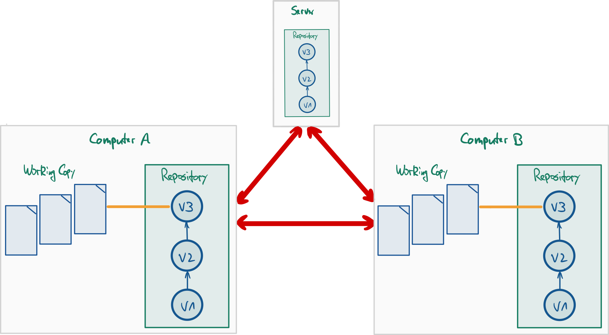
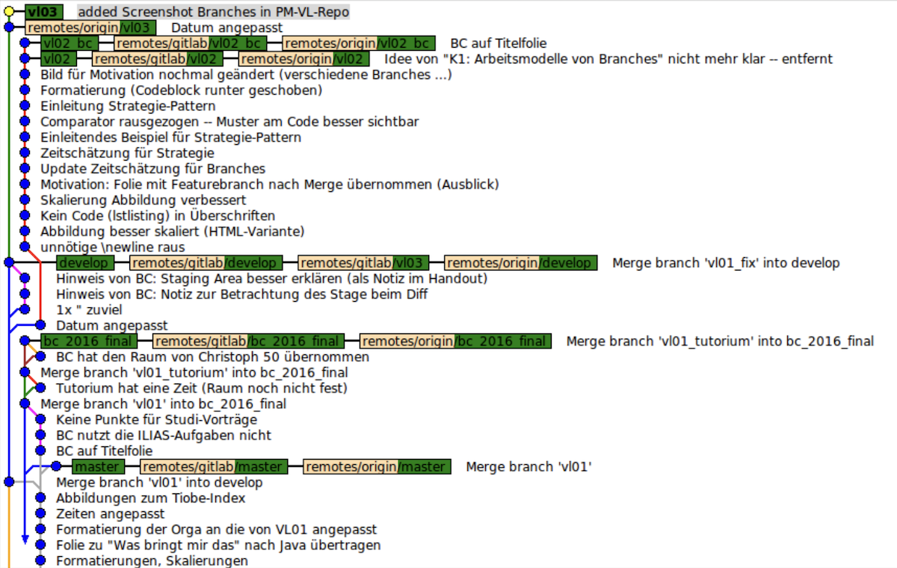

## Nutzung von Git in Projekten: Verteiltes Git (und Workflows)

{width="80%"}

::: notes
Git ermöglicht eine einfaches Zusammenarbeit in verteilten Teams. Nachdem wir die verschiedenen
Branching-Strategien betrachtet haben, soll im Folgenden die Frage betrachtet werden: **Wie arbeite
ich sinnvoll über Git mit anderen Kollegen und Teams zusammen? Welche Modelle haben sich etabliert?**
:::

## Clonen kann sich lohnen ...

    https://github.com/Programmiermethoden-CampusMinden/Prog2-Lecture

    ---C---D---E  master

\bigskip

=> `git clone https://github.com/Programmiermethoden-CampusMinden/Prog2-Lecture`

\bigskip

    ./PM-Lecture/  (lokaler Rechner)

    ---C---D---E  master
               ^origin/master

::: notes
Git-Repository mit der URL `<URL-Repo>` in lokalen Ordner `<directory>` auschecken:

*   `git clone <URL-Repo> [<directory>]`
*   Workingcopy ist automatisch über den Namen `origin` mit dem remote Repo auf
    dem Server verbunden
*   Lokaler Branch `master` ist mit dem remote Branch `origin/master` verbunden
    ("Tracking Branch", s.u.), der den Stand des `master`-Branches auf dem
    Server spiegelt

Für die URL sind verschiedene Protokolle möglich, beispielsweise:

*   "`file://`" für über das Dateisystem erreichbare Repositories (ohne Server)
*   "`https://`" für Repo auf einem Server: Authentifikation mit Username
    und Passwort (!)
*   "`git@`" für Repo auf einem Server: Authentifikation mit **SSH-Key** (diese
    Variante wird im Praktikum im Zusammenspiel mit dem Gitlab-Server im
    SW-Labor verwendet)
:::

[[Hinweis auf Protokolle, Beispiel]{.bsp}]{.slides}

## Eigener und entfernter _master_ entwickeln sich weiter ...

    https://github.com/Programmiermethoden-CampusMinden/Prog2-Lecture

    ---C---D---E---F---G  master

\bigskip

[`

`{=markdown}]{.notes}

    ./PM-Lecture/  (lokaler Rechner)

    ---C---D---E---H  master
               ^origin/master

::: notes
Nach dem Auschecken liegen (in diesem Beispiel) drei `master`-Branches vor:

1.  Der `master` auf dem Server,
2.  der lokale `master`, und
3.  die lokale Referenz auf den `master`-Branch auf dem Server: `origin/master`.

Der lokale `master` ist ein normaler Branch und kann durch Commits verändert
werden.

Der `master` auf dem Server kann sich ebenfalls ändern, beispielsweise weil
jemand anderes seine lokalen Änderungen mit dem Server abgeglichen hat
(`git push`, s.u.).

Der Branch `origin/master` lässt sich nicht direkt verändern! Das ist lediglich
eine lokale Referenz auf den `master`-Branch auf dem Server und zeigt an,
welchen Stand man bei der letzten Synchronisierung hatte. D.h. erst mit dem
nächsten Abgleich wird sich dieser Branch ändern (sofern sich der entsprechende
Branch auf dem Server verändert hat).

*Anmerkung*: Dies gilt analog für alle anderen Branches. Allerdings wird
nur der `origin/master` beim Clonen automatisch als lokaler Branch ausgecheckt.

Zur Abbildung:
Während man lokal arbeitet (Commit `H` auf dem lokalen `master`), kann es passieren,
dass sich auch das remote Repo ändert. Im Beispiel wurden dort die beiden Commits
`F` und `G` angelegt (durch `git push`, s.u.).

Wichtig: Da in der Zwischenzeit das lokale Repo nicht mit dem Server abgeglichen
wurde, zeigt der remote Branch `origin/master` immer noch auf den Commit
`E`!
:::

## Änderungen im Remote holen und Branches zusammenführen

    https://github.com/Programmiermethoden-CampusMinden/Prog2-Lecture

    ---C---D---E---F---G  master

\bigskip

=> `git fetch origin`

\bigskip

    ./PM-Lecture/  (lokaler Rechner)

    ---C---D---E---H  master
                \
                 F---G  origin/master

::::::::: notes
### Änderungen auf dem Server mit dem eigenen Repo abgleichen

Mit `git fetch origin` alle Änderungen holen

*   Alle remote Branches werden aktualisiert und entsprechen den jeweiligen
    Branches auf dem Server: Im Beispiel zeigt jetzt `origin/master` ebenso
    wie der `master` auf dem Server auf den Commit `G`.
*   Neue Branches auf dem Server werden ebenfalls "geholt", d.h. sie liegen
    nach dem Fetch als entsprechende remote Branches vor
*   Auf dem Server gelöschte Branches werden nicht automatisch lokal gelöscht;
    dies kann man mit `git fetch --prune origin` automatisch erreichen

*Wichtig*: Es werden nur die remote Branches aktualisiert, nicht die lokalen Branches!

### _master_-Branch nach "git fetch origin" zusammenführen

1.  Mit `git checkout master` Workingcopy auf eigenen `master` umstellen
2.  Mit `git merge origin/master` Änderungen am `origin/master` in eigenen `master` mergen
3.  Mit `git push origin master` eigene Änderungen ins remote Repo pushen

[`

`{=markdown}]{.notes}

    https://github.com/Programmiermethoden-CampusMinden/Prog2-Lecture

    ---C---D---E---H---I  master
                \     /
                 F---G

[`

`{=markdown}]{.notes}

    ./PM-Lecture/  (lokaler Rechner)

    ---C---D---E---H---I  master
                \     /^origin/master
                 F---G

*Anmerkung*: Schritt (2) kann man auch per `git pull origin master` erledigen ... Ein `pull`
fasst `fetch` und `merge` zusammen (s.u.).

*Anmerkung* Statt dem `merge` in Schritt (2) kann man auch den lokalen `master` auf den
aktualisierten `origin/master` rebasen und vermeidet damit die "Raute". Der `pull` kann
mit der Option "`--rebase`" auf "rebase" umgestellt werden (per Default wird bei `pull`
ein "merge" ausgeführt).

### Auf dem Server ist nur ein _fast forward merge_ möglich

Sie können Ihre Änderungen in Ihrem lokalen `master` auch direkt in das remote Repo
pushen, solange auf dem Server ein **fast forward merge** möglich ist.

Wenn aber (wie in der Abbildung) der lokale und der remote `master` divergieren,
müssen Sie den Merge wie beschrieben lokal durchführen (`fetch`/`merge` oder `pull`)
und das Ergebnis wieder in das remote Repo pushen (dann ist ja wieder ein
*fast forward merge* möglich, es sei denn, jemand hat den remote `master` in der
Zwischenzeit weiter geschoben - dann muss die Aktualisierung erneut durchgeführt
werden).
:::::::::

[Beispiel für Zusammenführen (merge und push), Anmerkung zu fast forward merge]{.bsp href="https://youtu.be/moqywsxtEy8"}

## Branches und Remotes

*   Eigenen (neuen) lokalen Branch ins remote Repo schicken
    *   `git push <remote> <branch>`

\bigskip

*   Neuer Branch im remote Repo
    *   `git fetch <remote>` holt (auch) alle neuen Branches
    *   Lokale Änderungen an remote Branches nicht möglich! \newline
        => **Remote Branch in lokalen Branch mergen** (oder auschecken)

[[Beispiel]{.bsp}]{.slides}

## Zusammenfassung: Arbeiten mit Remotes

1.  Änderungen vom Server holen: `git fetch <remote>` \newline
    => Holt alle Änderungen vom Repo `<remote>` ins eigene Repo
    ([Workingcopy bleibt unangetastet!]{.alert})

\smallskip

2.  Aktuellen lokalen Branch auffrischen: `git merge <remote>/<branch>` \newline
    (oder alternativ `git pull <remote> <branch>`)

\smallskip

3.  Eigene Änderungen hochladen: `git push <remote> <branch>`

::::::::: notes
### Anmerkung: _push_ geht nur, wenn

1. Ziel ein "bare"-Repository ist, **und**
2. keine Konflikte entstehen

=> im remote Repo [nur]{.alert} "fast forward"-Merge möglich

=> bei Konflikten erst `fetch` und `merge`, danach `push`

**Anmerkung**: Ein "bare"-Repository enthält keine Workingcopy, sondern nur
das Repo an sich. Die ist bei Repos, die Sie auf einem Server wie Gitlab oder
Github anlegen, automatisch der Fall. Sie können aber auch lokal ein solches
"bare"-Repo anlegen, indem Sie beim Initialisieren den Schalter `--bare`
mitgeben: `git init --bare` ...

### Beispiel

    git fetch origin           # alle Änderungen vom Server holen
    git checkout master        # auf lokalen Master umschalten
    git merge origin/master    # lokalen Master aktualisieren

    ... # Herumspielen am lokalen Master

    git push origin master     # lokalen Master auf Server schicken
:::::::::

## Vereinfachung: Tracking Branches

*   **Tracking Branch**: lokaler Branch, der remote Branch "verfolgt"
    *   Beispiel: lokaler `master`-Branch folgt `origin/master` per Default

\bigskip

*   **Vereinfachung im Workflow**:
    * ` git pull` entspricht
        1.  `git fetch <remote>` **plus**
        2.  `git merge <remote>/<branch>`
    *   `git push` entspricht `git push <remote> <branch>`

\bigskip

[Vorsicht]{.alert}: `pull` und `push` beziehen sich nur auf ausgecheckten Tracking Branch

## Einrichten von Tracking Branches

*   `git clone`: lokaler `master` trackt automatisch `origin/master`

\smallskip

*   Remote Branch als Tracking Branch einrichten:
    1.  [Änderungen aus remote Repo holen:]{.notes} `git fetch <remote>`
    2.  [Tracking Branch anlegen:]{.notes} `git checkout -t <remote>/<branch>`
        [(=> Option `-t` richtet den remote Branch als Tracking Branch ein)]{.notes}

\smallskip

*   Lokalen [neuen]{.notes} Branch [ins remote Repo schicken und]{.notes} als Tracking Branch einrichten:
    1.  [Lokalen Branch erzeugen:]{.notes} `git checkout -b <branch>`
    2.  [Lokalen Branch ins Repo schicken:]{.notes} `git push -u <remote> <branch>`
        [(=> Option `-u` richtet den lokalen Branch als Tracking Branch ein)]{.notes}

[[Beispiel]{.bsp}]{.slides}

## Hinzufügen eines (weiteren) Remote Repository

{width="75%"}

\vspace{2mm}

::: notes
Sie können einem Repo beliebig viele Remotes hinzufügen:
:::

`git remote add <name> <url>`

::: notes
**Beispiel**: `git remote add  andi  git@github.com:andi/repo.git`

*   Remote `origin` wird bei `clone` automatisch angelegt
*   Ansehen der Remotes mit `git remote -v`
*   `fetch`, `push` und `pull` jeweils über den vergebenen Namen

Beispiel: `git fetch andi` oder `git push origin master`
:::

[[Beispiel]{.bsp}]{.slides}

## Wrap-Up

*   Synchronisierung des lokalen Repos mit anderen Repos
    *   Repo kopieren: `git clone <url>`
    *   Interner Name fürs fremde Repo: `origin`
    *   Änderungen vom fremden Repo holen: `git fetch <remote>`
    *   Änderungen in lokalen Branch einpflegen: `git merge <remote>/<branch>`
    *   Eigene Änderungen ins fremde Repo schieben: `git push <remote> <branch>`

\bigskip

*   Tracking Branches (Konzept, Anwendung)
    *   Remote Branches können lokal nicht verändert werden:
        *   In lokale Branches mergen, oder
        *   Tracking Branches anlegen => einfaches `pull` und `push` nutzen
    *   Tracking Branches sind lokale Branches, die remote Branches verfolgen ("tracken")

<!-- DO NOT REMOVE - THIS IS A LAST SLIDE TO INDICATE THE LICENSE AND POSSIBLE EXCEPTIONS (IMAGES, ...). -->
::: slides
## LICENSE

Unless otherwise noted, this work is licensed under CC BY-SA 4.0.
:::
