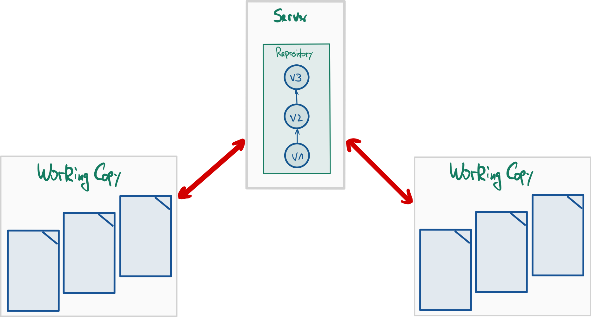
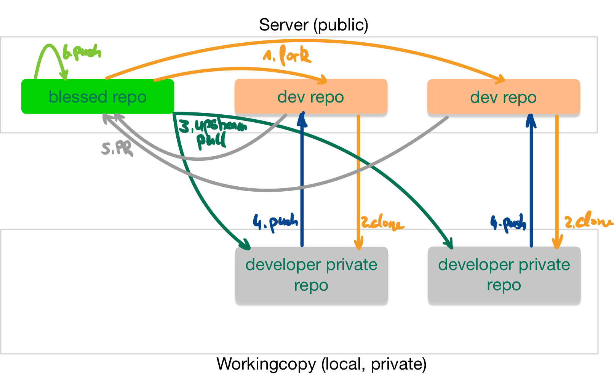
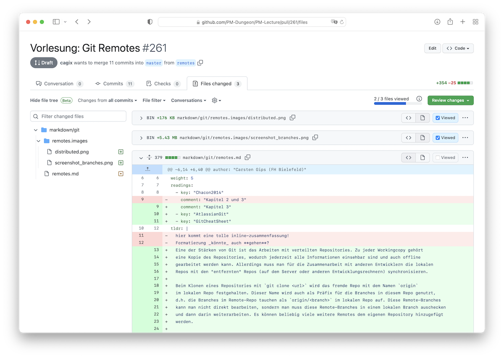
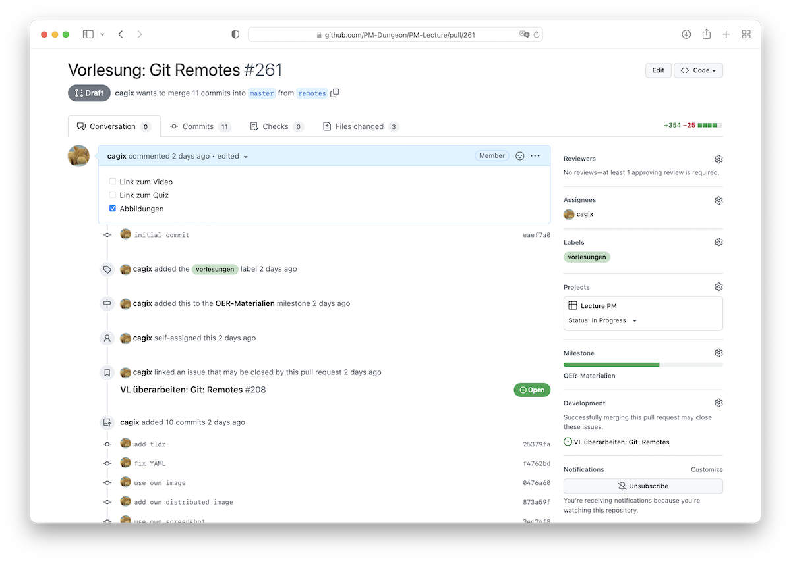

# Zusammenarbeit: Git-Workflows und Merge-/Pull-Requests

> [!IMPORTANT]
>
> 

>
> 
<strong>🎯 TL;DR</strong>

>
> Git erlaubt unterschiedliche Formen der Zusammenarbeit.
>
> Bei kleinen Teams kann man einen einfachen zentralen Ansatz einsetzen.
> Dabei gibt es ein zentrales Repo auf dem Server, und alle
> Team-Mitglieder dürfen direkt in dieses Repo pushen. Hier muss man
> sich gut absprechen und ein vernünftiges Branching-Schema ist
> besonders wichtig.
>
> In größeren Projekten gibt es oft ein zentrales öffentliches Repo, wo
> aber nur wenige Personen Schreibrechte haben. Hier forkt man sich
> dieses Repo, erstellt also eine öffentliche Kopie auf dem Server.
> Diese Kopie klont man lokal und arbeitet hier und pusht die Änderungen
> in den eigenen öffentlich sichtbaren Fork. Um die Änderungen ins
> Projekt-Repo integrieren zu lassen, wird auf dem Server ein
> sogenannter Merge-Request (Gitlab) bzw. Pull-Request (GitHub)
> erstellt. Dies erlaubt zusätzlich ein Review und eine Diskussion
> direkt am Code. Damit man die Änderungen im Hauptprojekt in den
> eigenen Fork bekommt, trägt man das Hauptprojekt als weiteres Remote
> in die Workingcopy ein und aktualisiert regelmäßig die Hauptbranches,
> von denen dann auch die eigenen Feature-Branches ausgehen sollten.
> 

> [!TIP]
>
> 

>
> 
<strong>🎦 Videos</strong>

>
> - [VL Git Workflows](https://youtu.be/3xqmNGN39wE)
> - [Demo Anlegen eines Forks, Erstellen eines Pull-Requests
>   (PR)](https://youtu.be/-8NOia7k0WI)
> - [Demo Arbeiten mit einem PR, Review eines
>   PR](https://youtu.be/4LaZc080Ajo)
>
> 

## Nutzung von Git in Projekten: Verteiltes Git (und Workflows)

<picture><source media="(prefers-color-scheme: light)" srcset="images/distributed_light.png"><source media="(prefers-color-scheme: dark)" srcset="images/distributed_dark.png"></picture>

Git ermöglicht ein einfaches und schnelles Branchen. Dies kann man mit
entsprechenden Branching-Strategien sinnvoll für die SW-Entwicklung
einsetzen.

Auf der anderen Seite ermöglicht Git ein sehr einfaches verteiltes
Arbeiten. Auch hier ergeben sich verschiedene Workflows, wie man mit
anderen Entwicklern an einem Projekt arbeiten will/kann.

Im Folgenden sollen also die Frage betrachtet werden: **Wie gestalte ich
die Zusammenarbeit?** Antwort: Workflows mit Git …

## Zusammenarbeit: Zentraler Workflow mit Git (analog zu SVN)

<picture><source media="(prefers-color-scheme: light)" srcset="images/centralised_light.png"><source media="(prefers-color-scheme: dark)" srcset="images/centralised_dark.png"></picture>

In kleinen Projektgruppen wie beispielsweise Ihrer Arbeitsgruppe wird
häufig ein einfacher zentralisierter Workflow bei der Versionsverwaltung
genutzt. Im Mittelpunkt steht dabei ein zentrales Repository, auf dem
alle Teammitglieder gleichberechtigt und direkt pushen dürfen.

- Vorteile:
  - Einfachstes denkbares Modell
  - Ein gemeinsames Repo (wie bei SVN)
  - Alle haben Schreibzugriff auf ein gemeinsames Repo

<!-- -->

- Nachteile:
  - Definition und Umsetzung von Rollen mit bestimmten Rechten
    (“Manager”, “Entwickler”, “Gast-Entwickler”, …) schwierig bis
    unmöglich (das ist kein Git-Thema, sondern hängt von der
    Unterstützung durch den Anbieter des Servers ab)
  - Jeder darf überall pushen: Enge und direkte Abstimmung nötig
  - Modell funktioniert meist nur in sehr kleinen Teams (2..3 Personen)

## Zusammenarbeit: Einfacher verteilter Workflow mit Git

<picture><source media="(prefers-color-scheme: light)" srcset="images/workflow_remote_light.png"><source media="(prefers-color-scheme: dark)" srcset="images/workflow_remote_dark.png"></picture>

In großen und/oder öffentlichen Projekten wird üblicherweise ein
Workflow eingesetzt, der auf den Möglichkeiten von verteilten
Git-Repositories basiert.

Dabei wird zwischen verschiedenen Rollen (“Integrationsmanager”,
“Entwickler”) unterschieden.

Sie finden dieses Vorgehen beispielsweise beim Linux-Kernel und auch
häufig bei Projekten auf Github.

- Es existiert ein geschütztes (“blessed”) Master-Repo
  - Stellt die Referenz für das Projekt dar
  - Push-Zugriff nur für ausgewählte Personen (“Integrationsmanager”)

<!-- -->

- Entwickler
  - Forken das Master-Repo auf dem Server und klonen ihren Fork lokal
  - Arbeiten auf lokalem Klon: Unabhängige Entwicklung eines Features
  - Pushen ihren Stand in ihren Fork (ihr eigenes öffentliches Repo):
    Veröffentlichung des Beitrags zum Projekt (sobald fertig bzw.
    diskutierbar)
  - Lösen Pull- bzw. Merge-Request gegen das Master-Repo aus: Beitrag
    soll geprüft und ins Projekt aufgenommen werden (Merge ins
    Master-Repo durch den Integrationsmanager)

<!-- -->

- Integrationsmanager
  - Prüft die Änderungen im Pull- bzw. Merge-Request und fordert ggf.
    Nacharbeiten an bzw. lehnt Integration ab (technische oder
    politische Gründe)
  - Führt Merge der Entwickler-Zweige mit den Hauptzweigen durch
    Akzeptieren der Pull- bzw. Merge-Requests durch: Beitrag der
    Entwickler ist im Projekt angekommen und ist beim nächsten Pull in
    deren lokalen Repos vorhanden

Den hier gezeigten Zusammenhang kann man auf weitere Ebenen verteilen,
vgl. den im Linux-Kernel gelebten “Dictator and Lieutenants Workflow”
(siehe Literatur).

*Hinweis*: Hier wird nur die Zusammenarbeit im verteilten Team
dargestellt. Dazu kommt noch das Arbeiten mit verschiedenen Branches!

*Anmerkung*: In der Workingcopy wird das eigene (öffentliche) Repo oft
als `origin` und das geschützte (“blessed”) Master-Repo als `upstream`
referenziert.

### Anmerkungen zum Forken

Sie könnten auch das Original-Repo direkt clonen. Allerdings würden dann
die `push` dort aufschlagen, was in der Regel nicht erwünscht ist (und
auch nicht erlaubt ist).

Deshalb forkt man das Original-Repo auf dem Server, d.h. auf dem Server
wird eine Kopie des Original-Repos im eigenen Namespace angelegt. Auf
diese Kopie hat man dann uneingeschränkten Zugriff.

Zusätzliche kurze Video-Anleitungen von GitHub: [Working with
forks](https://docs.github.com/en/pull-requests/collaborating-with-pull-requests/working-with-forks)

### Anmerkungen zu den Namen für die Remotes: `origin` und `upstream`

Üblicherweise checkt man die *Kopie* lokal aus (d.h. erzeugt einen
Clone). In der Workingcopy verweist dann `origin` auf die Kopie. Um
Änderungen am Original-Repo zu erhalten, fügt man dieses unter dem Namen
`upstream` als weiteres Remote-Repo hinzu. Dies ist eine nützliche
*Konvention*.

Um Änderungen aus dem Original-Repo in den eigenen Fork (und die
Workingcopy) zu bringen, führt man dann einfach folgendes aus (im
Beispiel für den `master`):

    $ git checkout master         # Workingcopy auf master
    $ git pull upstream master    # Aktualisiere lokalen master mit master aus Original-Repo
    $ git push origin master      # Pushe lokalen master in den Fork

## Feature-Branches aktualisieren: Mergen mit *master* vs. Rebase auf *master*

Im Netz finden sich häufig Anleitungen, wonach man Änderungen im
`master` mit einem Merge in den Feature-Branch holt, also sinngemäß:

    $ git checkout master         # Workingcopy auf master
    $ git pull upstream master    # Aktualisiere lokalen master mit master aus Vorgabe-Repo
    $ git checkout feature        # Workingcopy auf feature
    $ git merge master            # Aktualisiere feature: Merge master in feature
    $ git push origin feature     # Push aktuellen feature ins Team-Repo

Das funktioniert rein technisch betrachtet.

Allerdings spielt in den meisten Git-Projekten der `master` (bzw.
`main`) üblicherweise eine besondere Rolle (vgl.
[Branching-Strategien](branching-strategies.md)) und ist üblicherweise
stets das **Ziel** eines Merge, aber nie die *Quelle*! D.h. per
Konvention geht der Fluß von Änderungen stets **in** den `master` (und
nicht heraus).

Wenn man sich nicht an diese Konvention hält, hat man später
möglicherweise Probleme, die Merge-Historie zu verstehen (welche
Änderung kam von woher)!

Um die Änderungen im `master` in einen Feature-Branch zu bekommen,
sollte deshalb ein **Rebase** des Feature-Branches auf den aktuellen
`master` bevorzugt werden.

**Merk-Regel**: Merge niemals nie den `master` in Feature-Branches!

**Achtung**: Ein Rebase bei veröffentlichten Branches ist problematisch,
sobald Dritte auf diesem Branch arbeiten oder den Branch als Basis für
ihre eigenen Arbeiten nutzen und dadurch entsprechend auf die Commit-IDs
angewiesen sind. Nach einem Rebase stimmen diese Commit-IDs nicht mehr,
was normalerweise mindestens zu Verärgerung führt … Die Dritten müssten
ihre Arbeit dann auf den neuen Feature-Branch (d.h. den Feature-Branch
nach dessen Rebase) rebasen … vgl. auch “The Perils of Rebasing” in
Abschnitt “3.6 Rebasing” in ([Chacon und Straub 2014](#ref-Chacon2014)).

### Mögliches Szenario im Praktikum

Im Praktikum haben Sie das Vorgabe-Repo. Dieses könnten Sie als
`upstream` in Ihre lokale Workingcopy einbinden.

Mit Ihrem Team leben Sie vermutlich einen zentralen Workflow, d.h. Sie
binden Ihr gemeinsames Repo als `origin` in Ihre lokale Workingcopy ein.

Dann müssen Sie den lokalen `master` aus *beiden* Remotes aktualisieren.
Zusätzlich wollen Sie Ihren aktuellen Themenbranch auf den aktuellen
`master` rebasen.

    $ git checkout master         # Workingcopy auf master
    $ git pull upstream master    # Aktualisiere lokalen master mit master aus Vorgabe-Repo
    $ git pull origin master      # Aktualisiere lokalen master mit master aus Team-Repo
    $ git push origin master      # Pushe lokalen master in das Team-Repo zurück
    $ git rebase master feature   # Rebase feature auf den aktuellen lokalen master
    $ git push -f origin feature  # Push aktuellen feature ins Team-Repo ("-f" wg. geänderter IDs durch rebase)

**Anmerkung**: Dabei können in Ihrem `master` die unschönen “Rauten”
entstehen. Wenn Sie das vermeiden wollen, tauschen Sie den zweiten und
den dritten Schritt und führen den Pull gegen den Upstream-`master` als
`pull --rebase` durch. Dann müssen Sie Ihren lokalen `master` allerdings
auch force-pushen in Ihr Team-Repo und die anderen Team-Mitglieder
sollten darüber informiert werden, dass sich der `master` auf
inkompatible Weise geändert hat …

## Kommunikation: Merge- bzw. Pull-Requests

Mergen kann man auf der Konsole (oder in der IDE) und anschließend die
(neuen) Branches auf den Server pushen.

Die verschiedenen Git-Server erlauben ebenfalls ein GUI-gestütztes
Mergen von Branches: “Merge-Requests” (*MR*, Gitlab) bzw.
“Pull-Requests” (*PR*, Github). Das hat gegenüber dem lokalen Mergen
wichtige Vorteile: Andere Entwickler sehen den beabsichtigten Merge
(frühzeitig) und können direkt den Code kommentieren und die
vorgeschlagenen Änderungen diskutieren, aber auch allgemeine Kommentare
abgeben.

Falls möglich, sollte man einen MR/PR immer dem Entwickler zuweisen, der
sich weiter um diesen MR/PR kümmern wird (also zunächst ist man das
erstmal selbst). Zusätzlich kann man einen Reviewer bestimmen, d.h. wer
soll sich den Code ansehen.

Hier ein Screenshot der Änderungsansicht unseres Gitlab-Servers
(SW-Labor):

<picture><source media="(prefers-color-scheme: light)" srcset="images/screenshot_merge-request_code_light.png"><source media="(prefers-color-scheme: dark)" srcset="images/screenshot_merge-request_code_dark.png"></picture>

Nachfolgend für den selben MR aus der letzten Abbildung noch die reine
Diskussionsansicht:

<picture><source media="(prefers-color-scheme: light)" srcset="images/screenshot_merge-request_discussion_light.png"><source media="(prefers-color-scheme: dark)" srcset="images/screenshot_merge-request_discussion_dark.png"></picture>

Zusätzliche kurze Video-Anleitungen von GitHub:

- [How to create a pull
  request](https://www.youtube.com/watch?v=nCKdihvneS0)
- [How to merge a pull
  request](https://www.youtube.com/watch?v=FDXSgyDGmho)

## Best Practices bei Merge-/Pull-Requests

1.  MR/PR so zeitig wie möglich aufmachen
    - Am besten sofort, wenn ein neuer Branch auf den Server gepusht
      wird!
    - Ggf. mit dem Präfix “WIP” im Titel gegen unbeabsichtigtes
      vorzeitiges Mergen sperren … (bei GitHub als “Draft”-PR öffnen)
2.  Auswahl Start- und Ziel-Branch (und ggf. Ziel-Repo)
    - Es gibt verschiedene Stellen, um einen MR/PR zu erstellen.
      Manchmal kann man nur noch den Ziel-Branch einstellen, manchmal
      beides.
    - Bitte auch darauf achten, welches Ziel-Repo eingestellt ist! Bei
      Forks wird hier immer das Original-Repo voreingestellt!
    - Den Ziel-Branch kann man ggf. auch nachträglich durch Editieren
      des MR/PR anpassen (Start-Branch und Ziel-Repo leider nicht, also
      beim Erstellen aufpassen!).
3.  Titel (*Summary*): Das ist das, was man in der Übersicht sieht!
    - Per Default wird die letzte Commit-Message eingesetzt.
    - Analog zur Commit-Message: Bitte hier unbedingt einen sinnvollen
      Titel einsetzen: Was macht der MR/PR (kurz)?
4.  Beschreibung: Was passiert, wenn man diesen MR/PR akzeptiert
    (ausführlicher)?
    - Analog zur Commit-Message sollte hier bei Bedarf die Summary
      ausformuliert werden und beschreiben, was der MR/PR ändert.
5.  Assignee: Wer soll sich drum kümmern?
    - Ein MR/PR sollte immer jemanden zugewiesen sein, d.h. nicht
      “unassigned” sein. Ansonsten ist nicht klar, wer den Request
      durchführen/akzeptieren soll.
    - Außerdem taucht ein nicht zugewiesener MR/PR nicht in der
      Übersicht “meiner” MR/PR auf, d.h. diese MR/PR haben die Tendenz,
      vergessen zu werden!
6.  Diskussion am (und neben) dem Code
    - Nur die vorgeschlagenen Code-Änderungen diskutieren!
    - Weitergehende Diskussionen (etwa über Konzepte o.ä.) besser in
      separaten Issues erledigen, da sonst die Anzeige des MR/PR langsam
      wird (ist beispielsweise ein Problem bei Gitlab).
7.  Weitere Commits auf dem zu mergenden Branch gehen automatisch mit in
    den Request
8.  Weitere Entwickler kann man mit “`@username`” in einem Kommentar auf
    “CC” setzen und in die Diskussion einbinden

*Anmerkung*: Bei Gitlab (d.h. auch bei dem Gitlab-Server im SW-Labor)
gibt es “*Merge-Requests*” (MR). Bei Github gibt es “*Pull-Requests*”
(PR) …

## Wrap-Up

- Git-Workflows für die Zusammenarbeit:
  - einfacher zentraler Ansatz für kleine Arbeitsgruppen vs.
  - einfacher verteilter Ansatz mit einem “blessed” Repo (häufig in
    Open-Source-Projekten zu finden)

<!-- -->

- Aktualisieren Ihres Clones und Ihres Forks mit Änderungen aus dem
  “blessed” Repo
- Unterschied zwischen einem Pull/Merge und einem Pull/Rebase
- Erstellen von Beiträgen zu einem Projekt über Merge-Requests
  - Welche Commits werden Bestandteil eines Merge-Requests (und warum)
  - Diskussion über den Code in Merge-Requests

## 📖 Zum Nachlesen

- Chacon und Straub ([2014, 5, 4.8, 6](#ref-Chacon2014))
- Atlassian Pty Ltd ([2022](#ref-AtlassianGit))
- Github Inc. ([2022](#ref-GitCheatSheet))

> [!NOTE]
>
> 

>
> 
<strong>✅ Lernziele</strong>

>
> - k2: Ich kenne verschiedene Git-Workflows für die Zusammenarbeit und
>   kann den Ablauf erklären
> - k2: Ich kann den Unterschied zwischen einem Pull/Merge und einem
>   Pull/Rebase erklären
> - k2: Ich verstehe, welche Commits zu einem Bestandteil eines
>   Merge-/Pull-Requests werden (und warum)
> - k3: Ich kann den zentralisierten Workflow einsetzen
> - k3: Ich kann den einfachen verteilten Workflow mit unterschiedlichen
>   Repos einsetzen
> - k3: Ich kann meinen Clone und meinen Fork bei/mit Änderungen im/aus
>   dem ‘blessed Repo’ aktualisieren
> - k3: Ich kann meine Beiträge zu einem Projekt als
>   Merge-/Pull-Requests einreichen
> - k3: Ich kann meine Merge-/Pull-Requests aktualisieren
> - k3: Ich kann in Merge-/Pull-Requests Anmerkungen am Code hinterlegen
>   und an den Feedback-Diskussionen teilnehmen
>
> 

------------------------------------------------------------------------

> [!NOTE]
>
> 

>
> 
<strong>👀 Quellen</strong>

>
> 

>
> 

>
> Atlassian Pty Ltd. 2022. „Become a Git Guru.“
> <https://www.atlassian.com/git/tutorials>.
>
> 

>
> 

>
> Chacon, S., und B. Straub. 2014. *Pro Git*. 2. Aufl. Apress.
> <https://git-scm.com/book/en/v2>.
>
> 

>
> 

>
> Github Inc. 2022. „Git Cheat Sheets“. <https://training.github.com/>.
>
> 

>
> 

>
> 

------------------------------------------------------------------------

Unless otherwise noted, this work is licensed under CC BY-SA 4.0.

<blockquote>
<strong>Last modified:</strong> 95a02cf (markdown: switch to leaner yaml header (#1037), 2025-08-09) 
</blockquote>
