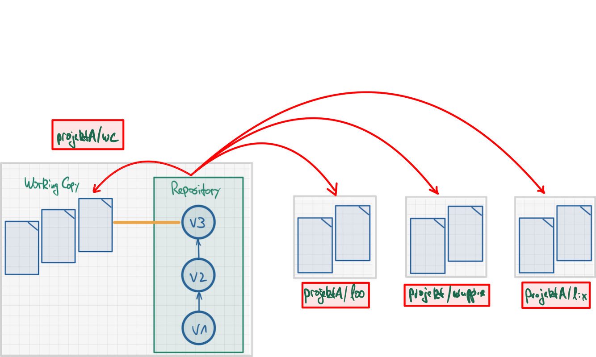

## Git Worktree - Mehrere Branches parallel auschecken

### Szenario

*   Sie arbeiten an einem Projekt
*   Großes Repo mit vielen Versionen und Branches
*   Ungesicherte Änderungen im Featurebranch
*   Wichtige Bugfixes an alter Version nötig

\bigskip

### Lösungsansätze

*   `git stash` nutzen und Branch wechseln
*   Repo erneut in anderem Ordner auschecken

\bigskip

::: notes
### Probleme

1.  `git stash` und `git switch`

    Funktioniert für die meisten Fälle relativ gut und ist daher die "Lösung to go".

    Aber Sie müssen später aufpassen, dass Sie auch wirklich wieder im richtigen
    Branch sind, wenn Sie die Änderungen im Stash anwenden (`git stash pop`)! Und
    wenn Sie mehrere Einträge in der Stash-Liste haben, kann es recht schnell recht
    unübersichtlich werden - zu welchem Branch gehören welche Einträge in der
    Stash-Liste?

    Außerdem kann es gerade in größeren Projekten passieren, dass sich die Konfiguration
    zwischenzeitlich ändert. Wenn Sie jetzt in der IDE einfach auf einen alten Stand
    mit einer anderen Konfiguration wechseln, kann es schnell passieren, dass sich die
    IDE "verschluckt" und Sie dadurch viel Arbeit haben.

2.  Nochmal woanders auschecken

    Im Prinzip ist das eine Möglichkeit. Sie können dann den anderen Ordner in Ihrer
    IDE als neues Projekt öffnen und sofort starten.

    Aber: Sie benötigen noch einmal den Platz auf der Festplatte/SSD/... wie für die
    ursprüngliche Workingcopy! Das kann bei alten/großen Projekten schnell recht
    groß werden und Probleme verursachen.

    Außerdem ist die Synchronisierung zwischen den beiden Workingcopies (der ursprünglichen
    und der neuen) nicht vorhanden bzw. das müssen Sie manuell per `git push` und `git pull`
    (in jeder Kopie des Repos!) erledigen!
:::

\bigskip

### Git Worktree kann helfen!

[**=> Mehrere Branches gleichzeitig auschecken (als neue Ordner im Dateisystem)**]{.alert}

## How to use Git Worktree

{width="80%"}

## Worktree anlegen

::: center
`git worktree add <path> <branch>`
:::

\bigskip

Legt neuen Ordner `<path>` an und checkt darin `<branch>` als "linked worktree" aus.

::: notes
Mit `git worktree add ../wuppie foo` würden Sie also parallel zum aktuellen Ordner
(wo Ihre Workingcopy enthalten ist) einen neuen Ordner `wuppie/` anlegen und darin
den Branch `foo` auschecken.

Wenn Sie in den Ordner `wuppie` wechseln, finden Sie auch eine _Datei_ `.git`. Darin
ist lediglich der Pfad zur Workingcopy vermerkt, damit Git Änderungen auch in die
eigentliche Workingcopy spiegeln kann. Dies ist der sogenannte "linked worktree".

Im Vergleich dazu finden Sie in der eigentlichen Workingcopy einen _Ordner_ `.git`,
der üblicherweise die gesamte Historie etc. enthält und entsprechend groß werden kann.

Den Befehl `git worktree add` gibt es in verschiedenen Versionen. In der Kurzform
`git worktree add <path>` würde ein neuer Branch angelegt und ausgecheckt, der der
letzten Komponente von `<path>` entspricht ...
:::

\bigskip
\vfill

[**Warnung: Nicht in selben Ordner oder in Unterordner auschecken!**]{.alert}

::: notes
Die neuen Worktrees sollten immer **außerhalb** der Workingcopy liegen! Sie können
Git sehr schnell sehr gründlich durcheinanderbringen, wenn Sie einen Worktree im
selben Ordner oder in einem Unterordner anlegen.

`git worktree` sollte nach Möglichkeit nicht zusammen mit Git Submodules eingesetzt
werden (unstabiles Verhalten)!
:::

## Worktree wechseln

*   Worktrees anzeigen: `git worktree list`
*   Worktree wechseln: Ordner wechseln (IDE: neues Projekt)

::: notes
Die Worktrees sind aus Sicht des Dateisystems einfach Ordner. Die `.git`-Datei verlinkt
für Git den Ordner mit der ursprünglichen Workingcopy.

Um also mit einem Worktree arbeiten zu können, wechseln Sie einfach das Verzeichnis. In
einer IDE würden Sie entsprechend ein neues Projekt anlegen. So können Sie gleichzeitig
in verschiedenen Branches arbeiten.

Änderungen in einem Worktree werden automatisch in die ursprüngliche Workingcopy gespiegelt.
Analog können Sie in einem Worktree auf die aktuelle Historie aus der ursprünglichen Workingcopy
zugreifen.

_Hinweis_: Sie können in den Ordnern zwar Branches wechseln, aber nicht auf einen Branch,
der bereits in einem anderen Ordner (Worktree) ausgecheckt ist. Es ist gute Praxis, dass
die Ordnernamen dem ausgecheckten Branch (linked Worktree) entsprechen, um Verwirrungen
zu vermeiden.
:::

## Worktree löschen

::: center
`git worktree remove <worktree>`
:::

::: notes
Sofern der Worktree "clean" ist, es also keine nicht comitteten Änderungen gibt, können
Sie mit `git worktree remove <worktree>` einen Worktree `<worktree>` wieder löschen.

Dabei bleibt der Ordner erhalten - Sie können ihn selbst löschen oder später wiederverwenden.
:::

## Wrap-Up

Git Worktree: Auschecken von Branches in separate Ordner

*   Anlegen: `git worktree add <path> <branch>`
*   Anschauen: `git worktree list`
*   Löschen: `git worktree remove <worktree>`

\bigskip

*   Dokumentation: https://git-scm.com/docs/git-worktree

<!-- DO NOT REMOVE - THIS IS A LAST SLIDE TO INDICATE THE LICENSE AND POSSIBLE EXCEPTIONS (IMAGES, ...). -->
::: slides
## LICENSE

Unless otherwise noted, this work is licensed under CC BY-SA 4.0.
:::
