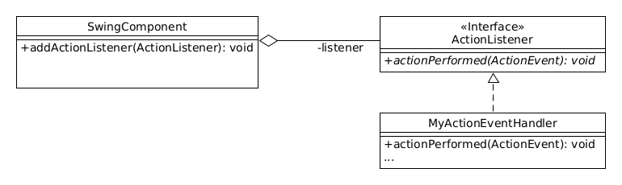
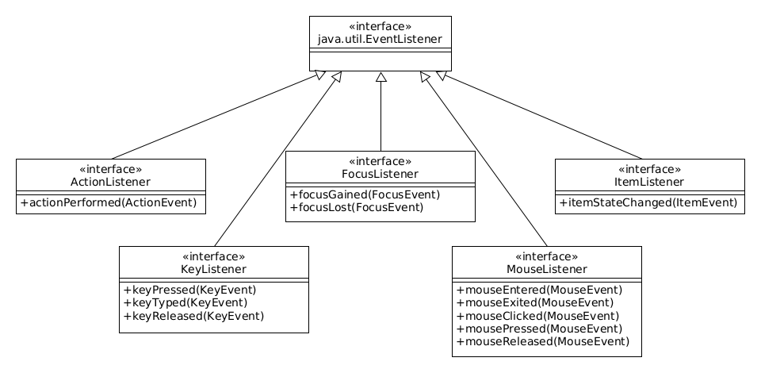
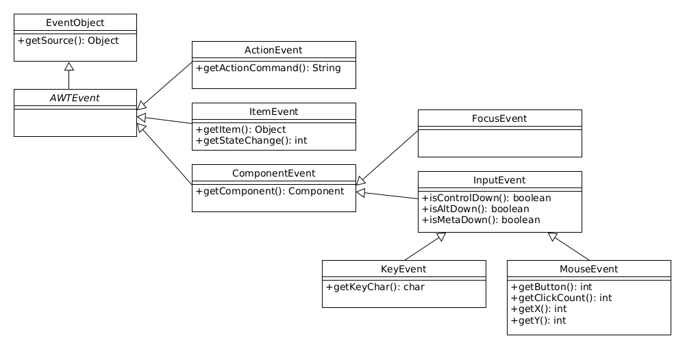

::: tldr
In Swing-Komponenten werden Events ausgelöst, wenn der User mit den Komponenten
interagiert.

Zur Bearbeitung der Events kann man Listener bei den Komponenten registrieren, die
bei Auftreten eines Events benachrichtigt werden (Observer-Pattern: Die Observer
werden in Swing "Listener" genannt).

Es gibt für alle möglichen Formen von Interaktion mit Komponenten vordefinierte
Interfaces für die Event-Listener. Da man hier wie üblich immer alle Methoden
implementieren muss, selbst wenn man nur auf wenige Events reagieren möchte, gibt es
zusätzlich sogenannte "Adapter": Dies sind Klassen, die das jeweilige
Event-Listener-Interface mit leeren Methodenrümpfen implementieren. Bei Nutzung der
Adapter-Klassen müssen dann nur noch die benötigten Methoden überschrieben werden.
:::

::: youtube
-   [VL Swing Events](https://youtu.be/Un-FS88__VU)
-   [Demo Swing Events und Listener](https://youtu.be/hjchoDaqcWY)
-   [Demo MouseListener vs. MouseAdapter](https://youtu.be/GaKMBAXY19w)
:::

# Reaktion auf Events: Anwendung Observer-Pattern

::: notes
-   Swing-GUI läuft in Dauerschleife
-   Komponenten registrieren Ereignisse (Events):
    -   Mausklick
    -   Tastatureingaben
    -   Mauszeiger über Komponente
    -   ...
-   Reaktion mit passendem Listener: Observer Pattern!
:::

{width="80%"}

=\> Observer aus dem Observer-Pattern!

::: notes
In Swing werden die "Observer" als "Listener" bezeichnet.
:::

\bigskip

``` java
component.addActionListener(ActionListener);
component.addMouseListener(MouseListener);
```

# Arten von Events

{width="80%"}

::: notes
Es gibt für alle möglichen Input-Arten eine Ableitung von `java.util.EventListener`,
beispielsweise für Maus- oder Tastaturereignisse oder wenn ein Element den Fokus
bekommt und viele weitere.
:::

# Details zu Listenern

-   Ein Listener kann bei mehreren Observables registriert sein:

    ``` java
    Handler single = new Handler();
    singleButton.addActionListener(single);
    multiButton.addActionListener(single);
    ```

-   Ein Observable kann mehrere Listener bedienen:

    ``` java
    multiButton.addActionListener(new Handler());
    multiButton.addActionListener(new Handler());
    ```

-   Sequentielles Abarbeiten der Events bzw. Benachrichtigung der Observer

[Demo: events.ListenerDemo]{.ex
href="https://github.com/Programmiermethoden-CampusMinden/PM-Lecture/blob/master/markdown/gui/src/events/ListenerDemo.java"}

# Wie komme ich an die Daten eines Events?

{width="80%"}

**Event-Objekte**: Quelle des Events plus aufgetretene Daten

[Demo: events.MouseListenerDemo]{.ex
href="https://github.com/Programmiermethoden-CampusMinden/PM-Lecture/blob/master/markdown/gui/src/events/MouseListenerDemo.java"}

# Listener vs. Adapter

::: notes
-   Vielzahl möglicher Events
-   Jeweils passendes Event-Objekt u. Event-Listener-Interface
-   Oft nur wenige Methoden, u.U. aber viele Methoden
:::

=\> Bei Nutzung eines Event-Listeners müssen immer **alle** Methoden implementiert
werden [(auch nicht benötigte)!]{.notes}

\bigskip

Abhilfe: **Adapter**-Klassen:

-   Für viele Event-Listener-Interfaces existieren Adapter-Klassen
-   Implementieren jeweils ein Interface
-   Alle Methoden mit **leerem** Body vorhanden

\smallskip

=\> Nur benötigte Listener-Methoden überschreiben.

[Demo: events.MouseAdapterDemo]{.ex
href="https://github.com/Programmiermethoden-CampusMinden/PM-Lecture/blob/master/markdown/gui/src/events/MouseAdapterDemo.java"}

# Wrap-Up

Observer-Pattern in Swing-Komponenten:

-   Events: Enthalten Source-Objekt und Informationen
-   Event-Listener: Interfaces mit Methoden zur Reaktion
-   Adapter: Listener mit leeren Methodenrümpfen

::: readings
-   @Java-SE-Tutorial
-   @Ullenboom2021 [Kap. 18]
:::

::: outcomes
-   k2: Unterschied zwischen den Listenern und den entsprechenden Adaptern
-   k3: Anwendung des Observer-Pattern, beispielsweise als Listener in Swing, aber
    auch in eigenen Programmen
-   k3: Nutzung von ActionListener, MouseListener, KeyListener, FocusListener
:::

::: quizzes
-   [Quiz Swing
    (ILIAS)](https://www.hsbi.de/elearning/goto.php?target=tst_1106248&client_id=FH-Bielefeld)
:::
