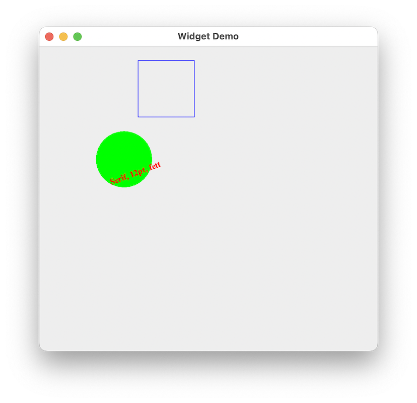

::: tldr
Swing-Komponenten zeichnen mit `paintComponent()` auf einem `Graphics`-Objekt. Die
Methode wird von Swing selbst aufgerufen; man kann sie durch den Aufruf von
`repaint()` auf einer Swing-Komponente aber manuell triggern.

Die Klasse `Graphics` bietet verschiedene einfache Methoden zum Zeichnen von Linien,
Rechtecken, Ovalen und Texten ... Die davon ableitende Klasse `Graphics2D` bietet
deutlich mehr Möglichkeiten, und das Argument beim Aufruf von `paintComponent()` ist
zwar formal vom Typ `Graphics`, in der Praxis aber oft vom Typ `Graphics2D`
(Typprüfung und anschließender Cast nötig).

Das Koordinatensystem in Java2D hat den Ursprung in der linken oberen Ecke.

Geometrische Primitive und Text werden in der aktuell ausgewählten Zeichenfarbe
gerendert. Die Rechtecke, Ovale und Polygone existieren auch als "gefüllte"
Variante.

Da bei einem Aufruf von `paintComponent()` stets das komplette Objekt neu gezeichnet
wird, kann man dies in einer Game-Loop nutzen: Pro Schritt berechnet man für alle
Objekte die neue Position, lässt ggf. weitere Interaktion o.ä. berechnen und
zeichnet anschließend die Objekte über den Aufruf von `repaint()` neu. In der
Game-Loop werden also keine Threads benötigt.
:::

::: youtube
-   [VL Java2D](https://youtu.be/LDE_Kbc9w7k)
-   [Demo geometrische Objekte](https://youtu.be/vzBH0MjJ0rM)
-   [Demo Fonts](https://youtu.be/F-6fIGeGAcY)
-   [Demo Polygone](https://youtu.be/BLTZ3XhbvkY)
-   [Demo Bewegung und 2D-Spiel](https://youtu.be/wfVwSyTgm-w)
:::

# GUIs mit Java

{width="40%"}

[Demo: java2d.simplegame.J2DTeaser]{.ex
href="https://github.com/Programmiermethoden-CampusMinden/Prog2-Lecture/blob/master/lecture/gui/src/java2d/simplegame/J2DTeaser.java"}

# Einführung in die Java 2D API

::: notes
-   Bisher: Anordnung von Widgets als GUI
-   Jetzt: Wie kann man mit Java zeichnen etc.?
:::

Swing-Komponenten erben von `javax.swing.JComponent`:

``` java
public void paintComponent(Graphics g)
```

-   Wird durch Events aufgerufen

-   Oder "von Hand" mit `void repaint()`

    ::: notes
    Methode `repaint()` der Swing-Komponente aufrufen =\> dadurch wird dann intern
    die Methode `paintComponent()` der Komponente aufgerufen zum Neuzeichnen auf dem
    Graphics-Objekt.
    :::

Objekt vom Typ `Graphics` stellt graphischen Kontext dar

::: notes
-   Geom. Primitive zeichnen mit `draw*` und `fill*`
-   Rendern mit `drawString` und `drawImage`
-   ...

`Graphics2D` beherrscht zusätzliche Methoden zum Beeinflussen des Renderings
:::

\bigskip

::: center
=\> **Methode überschreiben und auf der GUI malen**
:::

::: notes
-   Basis: `java.awt.Graphics`; davon abgeleitet `java.awt.Graphics2D`
-   Methode zum Zeichnen: `paintComponent()`
-   Umgang mit Farben: `java.awt.Color`
-   Umgang mit Zeichen und Fonts: `java.awt.Font`
-   Geom. Primitive: `java.awt.Polygon`,
    `java.awt.geom.{Line2D, Rectangle2D, Ellipse2D}`, ...
:::

# Java2D Koordinatensystem

{width="60%"}

\bigskip

-   Koordinatensystem lokal zum Graphics-Objekt
-   Einheiten in Pixel(!)

# Einfache Objekte zeichnen

Methoden von `java.awt.Graphics` (Auswahl):

``` java
public void drawLine(int x1, int y1, int x2, int y2)
public void drawRect(int x, int y, int width, int height)
public void fillRect(int x, int y, int width, int height)
public void drawOval(int x, int y, int width, int height)
public void fillOval(int x, int y, int width, int height)
```

\bigskip

Vorher Strichfarbe setzen: `Graphics.setColor(Color color)`:

-   Farb-Konstanten in `java.awt.Color`: `RED`, `GREEN`, `WHITE`, ...

-   Ansonsten über Konstruktor, beispielsweise als RGB:

    ``` java
    public Color(int r, int g, int b)  // Rot/Grün/Blau, Werte zw. 0 und 255
    ```

[Demo: java2d.SimpleDrawings]{.ex
href="https://github.com/Programmiermethoden-CampusMinden/Prog2-Lecture/blob/master/lecture/gui/src/java2d/SimpleDrawings.java"}

# Fonts und Strings

Fonts über Font-Klasse einstellen: `Graphics.setFont(Font font);`

``` java
public Font(String name, int style, int size)
```

\bigskip

`Graphics` kann Strings "zeichnen":

``` java
public void drawString(String str, int x, int y);
```

Vorher Font und Farbe setzen!

[Demo: java2d.SimpleFonts]{.ex
href="https://github.com/Programmiermethoden-CampusMinden/Prog2-Lecture/blob/master/lecture/gui/src/java2d/SimpleFonts.java"}

# Einfache Polygone definieren

Polygone zeichnen: `Graphics.drawPolygon(Polygon p)`:

``` java
public Polygon()
public Polygon(int[] xPoints, int[] yPoints, int points)
public void addPoint(int x, int y)
```

::: notes
=\> weitere Methoden von `Graphics` (Auswahl):

``` java
public void drawPolyline(int[] xp, int[] yp, int np)

public void drawPolygon(int[] xp, int[] yp, int np)
public void drawPolygon(Polygon p)
```
:::

\smallskip

Polygone mit Farbe füllen: `Graphics.fillPolygon(Polygon p)`

::: notes
``` java
public void fillPolygon(int[] xp, int[] yp, int np)
public void fillPolygon(Polygon p)
```

Statt `drawPolygon()` ....
:::

Vorher Farbe setzen!

[Demo: java2d.SimplePoly]{.ex
href="https://github.com/Programmiermethoden-CampusMinden/Prog2-Lecture/blob/master/lecture/gui/src/java2d/SimplePoly.java"}

# Ausblick I: Umgang mit Bildern

``` java
BufferedImage img = ImageIO.read(new File("DukeWave.gif"));

boolean Graphics.drawImage(Image img, int x, int y, ImageObserver observer);
```

# Ausblick II: *Graphics2D* kann noch mehr ...

``` java
Graphics g;
Graphics2D g2 = (Graphics2D) g;
```

\smallskip

=\> `Line2D`, `Rectangle2D`, ...

\smallskip

-   Strichstärken, Strichmuster
-   Clippings
-   Transformationen: rotieren, ...
-   Zeichnen in Bildern, Rendern von Ausschnitten
-   ...

# Spiele mit Bewegung

Beobachtung: `paintComponent()` schreibt `Graphics`-Objekt komplett neu!

::: notes
-   Kein Löschen von Objekten nötig
-   Es müssen alle im nächsten Schritt sichtbaren Objekte stets neu gezeichnet
    werden
:::

\bigskip

Idee: Je Zeitschritt:

1.  Position der Objekte neu berechnen
2.  Weitere Berechnungen: Kollision, Interaktion, Angriff, ...
3.  Objekte mit `paintComponent()` neu in GUI zeichnen

::: notes
-   Möglichkeit 1: Alle Objekte in zentraler Datenstruktur halten und die Bewegung
    im Hauptprogramm berechnen
    -   Unschön: Das Hauptprogramm muss Hintergrundwissen über die Objekte und deren
        Bewegung haben

\smallskip

-   Möglichkeit 2: Die Objekte wissen selbst, wie sie sich bewegen und haben eine
    Methode, deren Aufruf die Bewegung durchführt
    -   Objekte als Listener im Hauptprogramm registrieren
    -   Hauptprogramm gibt Zeittakt vor und ruft je Schritt für alle Listener die
        Bewege-Methode auf =\> Listener berechnen ihre neue Position
    -   Hauptprogramm kann weitere Prüfungen (Kollision etc) auslösen
    -   Hauptprogramm ruft für alle Listener eine Paint-Methode auf =\> Listener
        stellen sich auf GUI dar ...

    =\> Observer-Pattern nutzen
:::

[[Hinweis: Zentrale Struktur vs. Observer-Pattern]{.ex}]{.slides}

# Erinnerung: Observer Pattern

{width="80%"}

[[Hinweis auf Push- vs. Pull-Modell]{.ex}]{.slides}

::: notes
-   Anzahl der Observer muss nicht bekannt sein - zur Laufzeit erweiterbar!
-   Verschiedene Update-Methoden für unterschiedliche Observer denkbar
-   **Push-Modell**: Benötigte Daten werden der Update-Methode mitgegeben
-   **Pull-Modell**: Update-Methode nur als Trigger, Observer holen sich die Daten
    selbst
-   Referenz auf Observable mitgeben - Observer braucht dann keine Referenz auf das
    Observable halten und kann sich bei verschiedenen Observables registrieren
-   `Observer` werden (vor allem im Swing-Umfeld) manchmal auch `Listener` genannt
:::

# Spielobjekte als Observer (Listener)

::: notes
Objekte können sich auf `Graphics` darstellen:

-   Ursprung, Breite, Höhe
-   Schrittweite pro Bewegungsschritt
:::

``` java
abstract class GameObject {
    abstract void move();
    abstract void paintTo(Graphics g); // entspricht Observer#update()
}

class GameRect extends GameObject {
    int x, y, deltaX;
    void move() { x += deltaX; }
    void paintTo(Graphics g) {
        g.drawRect(x, y, 80, 80);
    }
}
```

Weitere evtl. nützliche Methoden:

-   Check auf Kollision
-   Methode zum Umdrehen der Bewegungsrichtung

# Oberfläche zusammenbauen

1.  Spielfeld von `JPanel` ableiten: Observable
2.  Observer registrieren: Liste mit Spiel-Objekten anlegen
3.  `paintComponent()` vom Spielfeld überschreiben
    -   für alle Observer (Spiel-Objekte) `paintTo()` aufrufen

\smallskip

4.  Hauptschleife für Spiel:
    -   Taktgeber (Zeit, Interaktion)
    -   Je Schritt `move()` für alle Observer aufrufen
    -   Weitere Berechnungen (Kollisionen, Interaktionen, ...)
    -   `Spielfeld.repaint()` aufrufen =\> Neuzeichnen mit `paintComponent()`

::: notes
**Pro Schritt**:

1.  `move()` für alle Objekte aufrufen: Objekte setzen ihren Ursprung weiter (**ohne
    Aktualisierung des Bildes!**)

2.  Prüfungen: Kollision/Berührung, aus dem Bild wandern ...

    -   Beispiele für Verhalten bei Berührung:
        -   beide kehren ihre Bewegungsrichtung um
        -   das kleinere Objekt verschwindet
    -   Beispiele für Umgang mit Objekten, die aus dem Bild wandern:
        -   auf der anderen Seite einblenden
        -   Bewegungsrichtung umkehren
        -   Objekt aus dem Spiel nehmen

3.  Interaktionen

    -   Greifen sich Monster und Held an?
    -   Öffnet der Held eine Truhe?
    -   Sammelt der Held etwas auf?
    -   ...

4.  `repaint()` im Spielfeld aufrufen =\> damit wird `paintComponent()` aufgerufen,
    in `paintComponent()` wird für alle Spielobjekte deren `paintTo()` aufgerufen
    und damit ein Neuzeichnen aller Objekte ausgelöst
:::

[Demo: java2d.simplegame.J2DTeaser]{.ex
href="https://github.com/Programmiermethoden-CampusMinden/Prog2-Lecture/blob/master/lecture/gui/src/java2d/simplegame/J2DTeaser.java"}

# Wrap-Up

-   Java2D: Swing-Komponenten zeichnen mit `paintComponent()` auf `Graphics`
-   `Graphics`: Methoden zum Zeichnen von Linien, Rechtecken, Ovalen, Text ...
    -   Koordinatensystem: Ursprung links oben!
    -   Geom. Primitive und Text werden in ausgewählter Zeichenfarbe gerendert
        -   Rechtecke, Ovale, Polygone auch als "gefüllte" Variante
    -   Mehr Möglichkeiten: `Graphics2D`

\bigskip

-   Spiel: Game-Loop
    -   Bewege Objekte: Rechne neue Position aus
    -   Interagiere: Angriffe, Sammeln, ...
    -   Zeichne Objekte neu

::: readings
-   @Java-SE-Tutorial
-   @Ullenboom2021 [Kap. 18]
:::

::: outcomes
-   k2: Unterschied und Zusammenhang zwischen Swing und AWT
-   k2: Swing-Komponenten erben paintComponent(Graphics)
-   k2: paintComponent(Graphics) wird durch Events oder durch repaint() aufgerufen
-   k3: Auf Graphics-Objekt zeichnen mit geometrischen Primitiven: Nutzung von
    draw(), fill(), drawString()
-   k3: Einstellung von Farbe und Font
-   k3: Erzeugen von Bewegung ohne Nutzung von Threads
:::
