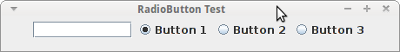
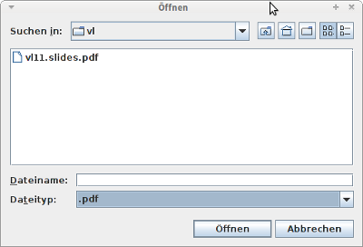
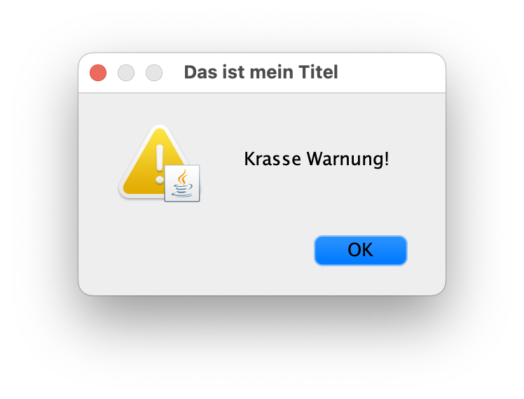

::: tldr
Neben den Standardkomponenenten `JFrame` für ein Fenster, `JPanel` für ein Panel
(auch zum Gruppieren anderer Komponenten), `JButton` (Button) und `JTextArea`
(Texteingabe) gibt es eine Reihe weiterer nützlicher Swing-Komponenten:

-   `JRadioButton` für Radio-Buttons und `JCheckBox` für Checkbox-Buttons sowie
    `ButtonGroup` für die logische Verbindung von diesen Buttons (es kann nur ein
    Button einer ButtonGroup aktiv sein - wenn ein anderer Button aktiviert wird,
    wird der zuletzt aktive Button automatisch deaktiviert)
-   Dateiauswahldialoge mit `JFileChooser` und `FileFilter` zum Vorfiltern der
    Anzeige
-   Einfache (modale) Dialoge mit `JOptionPane`
-   `JTabbedPane` als Panel mit Tabs
-   `JScrollPane`, um Eingabefelder bei Bedarf scrollbar zu machen
-   Anlegen einer Menüleiste mit `JMenuBar`, dabei sind die Menüs `JMenu` und die
    Einträge `JMenuItem`
-   Kontextmenüs mit `JPopupMenu`
:::

::: youtube
Vorlesung \[[YT](https://youtu.be/qjKAIAqsFtA)\],
\[[HSBI](https://www.hsbi.de/medienportal/video/pr2-swing-2-ntzliche-widgets/7064e0a8080c052676f88e096fcb5c26)\]

Demos:

-   JRadioButton \[[YT](https://youtu.be/IHEiinwRvcg)\],
    \[[HSBI](https://www.hsbi.de/medienportal/video/pr2-demo-swing-jradiobutton/448ff17582e4aa55c1c88d6e6e78b701)\]
-   JFileChooser \[[YT](https://youtu.be/9-ECtlFuRWY)\],
    \[[HSBI](https://www.hsbi.de/medienportal/video/pr2-demo-swing-jfilechooser/495b9bd49d942961ab3905ce766b2abc)\]
-   JOptionPane \[[YT](https://youtu.be/rYRuDbZmeMk)\],
    \[[HSBI](https://www.hsbi.de/medienportal/video/pr2-demo-swing-joptionpane/f2328dc05a9d30b14ed17deb677ae6b0)\]
-   JTabbedPane und JScrollPane \[[YT](https://youtu.be/LtT6fzVtYbU)\],
    \[[HSBI](https://www.hsbi.de/medienportal/video/pr2-demo-swing-jtabbedpane-und-jscrollpane/b39670f201f71ad0b4bae98cfd75bb1e)\]
-   JMenuBar \[[YT](https://youtu.be/f9fg27yAQRg)\],
    \[[HSBI](https://www.hsbi.de/medienportal/video/pr2-demo-swing-jmenubar/108f274f948752ed382eaa9b89b73d32)\]
-   JPopupMenu \[[YT](https://youtu.be/IzEgsP41y5U)\],
    \[[HSBI](https://www.hsbi.de/medienportal/video/pr2-demo-swing-jpopupmenu/5a403d718e5918db2f736c7f16afeef9)\]
:::

# Radiobuttons: *JRadioButton*

\bigskip

{width="50%"}

\bigskip

::: notes
-   Erzeugen einen neuen "Knopf" (rund)
    -   vergleiche `JCheckBox` =\> eckiger "Knopf"
-   Parameter: Beschriftung und Aktivierung
-   Reagieren mit `ItemListener`
:::

\bigskip

-   **Logische Gruppierung der Buttons**: `ButtonGroup`
    -   `JRadioButton` sind **unabhängige** Objekte
    -   Normalerweise nur ein Button aktiviert
    -   Aktivierung eines Buttons =\> vormals aktivierter Button deaktiviert

    \smallskip

    ``` java
    JRadioButton b1 = new JRadioButton("Button 1", true);
    JRadioButton b2 = new JRadioButton("Button 2", false);

    ButtonGroup radioGroup = new ButtonGroup();
    radioGroup.add(b1);    radioGroup.add(b2);
    ```

[Demo: widgets.RadioButtonDemo]{.ex
href="https://github.com/Programmiermethoden-CampusMinden/Prog2-Lecture/blob/master/lecture/gui/src/widgets/RadioButtonDemo.java"}

# Dateien oder Verzeichnisse auswählen: *JFileChooser*

{width="40%"}

\bigskip

``` java
JFileChooser fc = new JFileChooser("Startverzeichnis");
fc.setFileSelectionMode(JFileChooser.FILES_AND_DIRECTORIES);
if (fc.showOpenDialog() == JFileChooser.APPROVE_OPTION)
    fc.getSelectedFile()
```

::: notes
-   `fc.setFileSelectionMode()`: Dateien, Ordner oder beides auswählbar
-   Anzeigen mit `fc.showOpenDialog()`
-   Rückgabewert vergleichen mit `JFileChooser.APPROVE_OPTION`: Datei/Ordner wurde
    ausgewählt =\> Prüfen!
-   Selektierte Datei als `File` bekommen: `fc.getSelectedFile()`

**Filtern der Anzeige**: `FileFilter`

-   Setzen mit `JFileChooser.setFileFilter()`
-   Überschreiben von
    -   `boolean accept(File f)`
    -   `String getDescription()`
:::

[Demo: widgets.FileChooserDemo]{.ex
href="https://github.com/Programmiermethoden-CampusMinden/Prog2-Lecture/blob/master/lecture/gui/src/widgets/FileChooserDemo.java"}

# TabbedPane und Scroll-Bars

\bigskip

-   **TabbedPane**: `JTabbedPane`
    -   Container für weitere Komponenten

    -   Methode zum Hinzufügen anderer Swing-Komponenten:

        \smallskip

        ``` java
        public void addTab(String title, Icon icon, Component component, String tip)
        ```

\bigskip

-   **Scroll-Bars**: `JScrollPane`
    -   Container für weitere Komponenten

    -   Scroll-Bars werden bei Bedarf sichtbar

    -   Hinzufügen einer Komponente:

        \smallskip

        ``` java
        JPanel panel = new JPanel();
        JTextArea text = new JTextArea(5, 10);

        JScrollPane scrollText = new JScrollPane(text);
        panel.add(scrollText);
        ```

<!-- XXX
*   Zusammenbauen der Komponenten und Container am Beispiel zeigen/erklären
*   Wirkung der Optionen (als Tooltips) zeigen
*   Wirkung der Scrollpane zeigen (letzter Tab)
-->

[Demo: widgets.TabbedPaneDemo]{.ex
href="https://github.com/Programmiermethoden-CampusMinden/Prog2-Lecture/blob/master/lecture/gui/src/widgets/TabbedPaneDemo.java"}

# Dialoge mit *JOptionPane*

{width="40%"}

\bigskip

``` java
JOptionPane.showMessageDialog(
    this,
    "Krasse Warnung!",
    "Das ist mein Titel",
    JOptionPane.WARNING_MESSAGE)
```

::: notes
Ein Dialog ist ein eigenes Top-Level-Fenster, welches zumindest eine Message zeigt.
Zusätzlich kann man den Fenster-Titel einstellen und ein kleines Icon anzeigen
lassen, was verdeutlichen soll, ob es sich um eine Bestätigung oder Frage oder
Warnung etc. handelt.

Damit der Dialog auch wirklich bedient werden muss, ist er "modal", d.h. er liegt
"vor" der Elternkomponente. Diese wird als Referenz übergeben und bekommt erst
wieder den Fokus, wenn der Dialog geschlossen wurde.
:::

[Demo: widgets.DialogDemo]{.ex
href="https://github.com/Programmiermethoden-CampusMinden/Prog2-Lecture/blob/master/lecture/gui/src/widgets/DialogDemo.java"}

# Menüs mit *JMenuBar*, *JMenu* und *JMenuItem*

``` java
JMenuBar menuBar = new JMenuBar();
JMenu menu1 = new JMenu("(M)ein Menü");
JMenuItem m1 = new JMenuItem("Text: A");
JMenuItem m2 = new JMenuItem("Text: B");

menu1.add(m1);
menu1.add(m2);

menuBar.add(menu1);

frame.setJMenuBar(menuBar);
```

::: notes
Eine Menüleiste wird über das Objekt `JMenuBar` realisiert. Diese ist eine
Eigenschaft des Frames und kann nur dort hinzugefügt werden.

In der Menüleiste kann es mehrere Menüs geben, diese werden mit Objekten vom Typ
`JMenu` erstellt.

Wenn man mit der Maus ein Menü ausklappt, wird eine Liste der Menüeinträge
angezeigt. Diese sind vom Typ `JMenuItem` und verhalten sich wie Buttons.
:::

[Demo: widgets.MenuDemo]{.ex
href="https://github.com/Programmiermethoden-CampusMinden/Prog2-Lecture/blob/master/lecture/gui/src/widgets/MenuDemo.java"}

# Kontextmenü mit *JPopupMenu*

-   Menü kann über anderen Komponenten angezeigt werden

-   Einträge vom Typ `JMenuItem` hinzufügen (beispielsweise `JRadioButtonMenuItem`)

    ``` java
    public JMenuItem add(JMenuItem menuItem)
    ```

-   Menü über der aufrufenden Komponente "`invoker`" anzeigen

    ``` java
    public void show(Component invoker, int x, int y)
    ```

::: notes
## Details zu *JMenuItem*

-   Erweitert `AbstractButton`
-   Reagiert auf `ActionEvent` =\> `ActionListener` implementieren für Reaktion auf
    Menüauswahl

## Details zum Kontextmenü

**Triggern der Anzeige eines `JPopupMenu`**

-   Beispielsweise über `MouseListener` einer (anderen!) Komponente
-   Darin Reaktion auf `MouseEvent.isPopupTrigger()` =\> `JPopupMenu.show()`
    aufrufen

``` java
JFrame myFrame = new JFrame();
JPopupMenu kontextMenu = new JPopupMenu();

myFrame.addMouseListener(new MouseAdapter() {
    public void mousePressed(MouseEvent e) {
        if (e.isPopupTrigger()) {
            kontextMenu.show(e.getComponent(), e.getX(), e.getY());
        }
    }
});
```
:::

[Demo: widgets.PopupDemo]{.ex
href="https://github.com/Programmiermethoden-CampusMinden/Prog2-Lecture/blob/master/lecture/gui/src/widgets/PopupDemo.java"}

# Wrap-Up

Nützliche Swing-Komponenten:

-   Scroll-Bars
-   Panel mit Tabs
-   Dialogfenster und Dateiauswahl-Dialoge
-   Menüleisten und Kontextmenü
-   Radiobuttons und Checkboxen, logische Gruppierung

::: readings
-   @Java-SE-Tutorial
-   @Ullenboom2021 [Kap. 18]
:::

::: outcomes
-   k3: Umgang mit komplexeren Swing-Komponenten: JRadioButton, JFileChooser,
    JOptionPane, JTabbedPane, JScrollPane, JMenuBar, JPopupMenu
-   k3: Nutzung von ActionListener, MouseListener, KeyListener, FocusListener
:::
