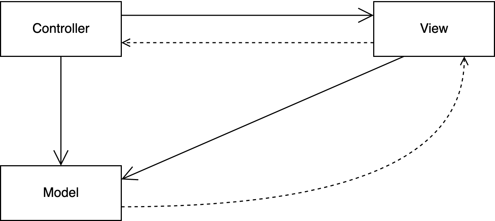

# Einfache Tabelle mit festen Daten

*   Einfache Tabelle erzeugen:

    ```java
    public JTable(final Object[][] rowData, final Object[] columnNames)
    ```

*   Daten gleich mit erzeugen/übergeben:

    ```java
    Object[][] rowData = {
        { "Hein", "Bloed", 5 },
        { "Susi", "Studi", 2 } };
    ```

*   Tabellenkopf als einfaches Array:

    ```java
    Object[] columnNames = { "Vorname", "Name", "ect" };
    ```

::: notes
Damit der Tabellenkopf angezeigt wird, muss die Tabelle lt. [Dokumentation](https://docs.oracle.com/javase/tutorial/uiswing/components/table.html)
entweder in eine `JScrollPane` verpackt werden oder der Tabellenkopf muss manuell geeignet
untergebracht werden, beispielsweise über ein `BorderLayout`:

```java
JTable table = new JTable(data, columns);

contentPane.setLayout(new BorderLayout());
contentPane.add(table.getTableHeader(), BorderLayout.NORTH);
contentPane.add(table, BorderLayout.CENTER);
```
:::

[Demo: tables.SimpleTable]{.ex href="https://github.com/Programmiermethoden-CampusMinden/Prog2-Lecture/blob/master/lecture/gui/src/tables/SimpleTable.java"}


# Selektierbare und sortierbare Tabelle

*   Tabelle sortierbar machen:

    ```java
    table.setAutoCreateRowSorter(true);
    ```

    ::: notes
    Damit kann man im Tabellenkopf auf eine Spalte klicken und die Tabelle wird entsprechend
    dieser Spalte sortiert.

    _Hinweis_: Dazu muss der Tabellenkopf sichtbar sein.

    _Hinweis_: Man kann auch eigene Sortierer implementieren. Diese leiten von `TableRowSorter`
    ab und werden über `table.setRowSorter()` gesetzt.
    :::

*   Selektion erkennen und reagieren mit MouseListener:

    ```java
    table.addMouseListener(new MouseAdapter() {
        public void mouseClicked(MouseEvent e) {
            TableModel model = table.getModel();
            int c = table.getSelectedColumn();  // selektierte Spalte
            int r = table.getSelectedRow();     // selektierte Zeile
            model.getValueAt(r, c);             // Wert in Zeile r, Spalte c
    }});
    ```

[Demo: tables.SelectTable]{.ex href="https://github.com/Programmiermethoden-CampusMinden/Prog2-Lecture/blob/master/lecture/gui/src/tables/SelectTable.java"}


# Einschub: MVC-Pattern

{width="60%"}

::: notes
Das [Model-View-Controller-Pattern (MVC)](https://en.wikipedia.org/wiki/Model%E2%80%93view%E2%80%93controller)
ist vor allem im Bereich User-Interfaces anzutreffen.

Das "Model" kennt und verwaltet die Daten. Es ist unabhängig von der konkreten Darstellung der Daten und kann
neben den Daten auch Teile der Geschäftslogik beinhalten. Änderungen im Model werden per Observer-Pattern an
den View weitergereicht.

Der "View" ist für die Darstellung der Daten zuständig und für die Benutzerinteraktion. Der View kennt das Model,
ist aber nicht für die Verwaltung der Daten zuständig. Benutzerinteraktion wird über das Observer-Pattern an den
Controller weitergeleitet.

Der "Controller" verwaltet das Model und den View und kümmert sich um die Verarbeitung der Nutzerinteraktion.
Bei User-Interaktion mit dem View wird der Controller über das Observer-Pattern vom View benachrichtigt,
verarbeitet die Interaktion und kann entsprechende Änderungen an das Model weitergeben.

Dieses Pattern findet sich mittlerweile in diversen (leichten) Variationen.
:::


# Daten in separatem Modell

*   Modell muss von `AbstractTableModel` ableiten
*   Methoden zur Interaktion mit Tabelle implementieren!
*   Tabelle wird über Instanz von diesem Modell erzeugt
*   Tabelle ist View und Controller zugleich, trägt sich bei Erzeugung
    als Listener beim Modell ein

\smallskip

*   Modell muss die Tabelle über Änderungen an den Daten informieren:

    ```java
    fireTableCellUpdated(row, col);
    ```

\bigskip

=> Kapselung der Daten! Müssen nicht als Array o.ä. vorliegen!


# Modelleigenschaften

*   Korrekte Spalten-Typen und damit bessere Anzeige:

    ```java
    public Class getColumnClass(int c) {
        return getValueAt(0, c).getClass();
    }
    ```

*   Spalten können gegen Editieren gesperrt werden:

    ```java
    public boolean isCellEditable(int row, int col) {
        return col >= 2;
    }
    ```

*   Kontrolle über Änderung der Daten in `setValueAt()`

*   Daten können in beliebigem Format vorliegen! Interface nach
    "außen" dennoch tabellenartig.


::: notes
# Eigene Listener beim Modell registrieren

```java
TableModel m = table.getModel();
m.addTableModelListener(new TableModelListener() {
    public void tableChanged(TableModelEvent e) {
        int row = e.getFirstRow();
        int column = e.getColumn();
        TableModel model = (TableModel) e.getSource();
        Object data = model.getValueAt(row, column);
        ...
    }
});
```

Wenn Daten geändert werden, wird automatisch die Methode `setValueAt()` des Modells
aufgerufen.

Zusätzlich kann man beim Modell eigene Listener registrieren, die auf Events durch
Änderungen der Tabelle reagieren können.
:::

[Demo: tables.ModelTable]{.ex href="https://github.com/Programmiermethoden-CampusMinden/Prog2-Lecture/blob/master/lecture/gui/src/tables/ModelTable.java"}


# Wrap-Up

*   Fortgeschrittene Swing-Komponenten
    *   Komplexe Daten mit `JTable` anzeigen
    *   Swing-Komponenten (nicht nur `JTable`!) haben Datenmodelle \newline
        (können separat erzeugt werden, haben eigene Listener, ...)
*   Trennung Daten und Anzeige: MVC-Pattern
