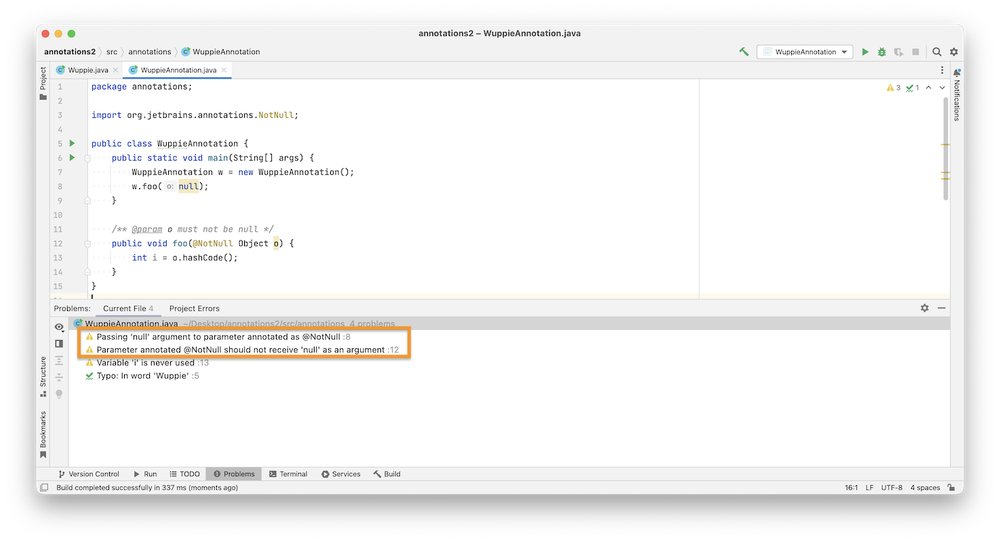
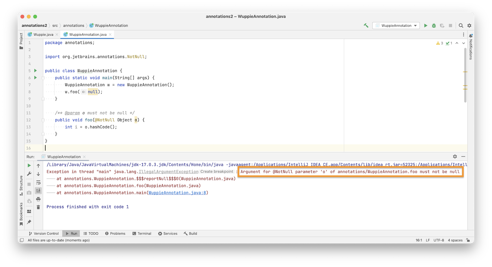

# Annotationen

> [!IMPORTANT]
>
> <details open>
>
> <summary><strong>🎯 TL;DR</strong></summary>
>
> Annotationen sind Metadaten zum Programm: Sie haben keinen (direkten)
> Einfluss auf die Ausführung des annotierten Codes, sondern enthalten
> Zusatzinformationen über ein Programm, die selbst nicht Teil des
> Programms sind. Verschiedene Tools werten Annotationen aus,
> beispielsweise der Compiler, Javadoc, JUnit, …
>
> Annotationen können auf Deklarationen (Klassen, Felder, Methoden)
> angewendet werden und werden meist auf eine eigene Zeile geschrieben
> (Konvention).
>
> Annotationen können relativ einfach selbst erstellt werden: Die
> Definition ist fast wie bei einem Interface. Zusätzlich kann man noch
> über Meta-Annotationen die Sichtbarkeit, Verwendbarkeit und
> Dokumentation einschränken. Annotationen können zur Übersetzungszeit
> mit einem Annotation-Processor verarbeitet werden oder zur Laufzeit
> über Reflection ausgewertet werden.
> </details>

> [!TIP]
>
> <details open>
>
> <summary><strong>🎦 Videos</strong></summary>
>
> - [VL Annotationen](https://youtu.be/7u4_I4W_1JY)
> - [Demo Annotationen: `@Override`,
>   `@Deprecated`](https://youtu.be/wt-Dq_Nv5UU)
> - [Demo `@NotNull`](https://youtu.be/ayWWf_ALObs)
> - [Demo Annotationen selbst gebastelt](https://youtu.be/8vTMgYCstLE)
> - [Demo Annotation-Prozessor](https://youtu.be/ypHMxunNZpg)
>
> </details>

## Was passiert hier?

``` java
public class A {
    public String getInfo() { return "Klasse A"; }
}

public class B extends A {
    public String getInfo(String s) { return s + "Klasse B"; }

    public static void main(String[] args) {
        B s = new B();
        System.out.println(s.getInfo("Info: "));
    }
}
```

<p align="right"><a href="https://github.com/Programmiermethoden-CampusMinden/Prog2-Lecture/blob/master/lecture/java-classic/src/annotations/B.java">Beispiel: annotations.B</a></p>

**Hilft `@Override`?**

Tja, da sollte wohl die Methode `B#getInfo` die geerbte Methode
`A#getInfo` **überschreiben**. Dummerweise wird hier die Methode aber
nur **überladen** (mit entsprechenden Folgen beim Aufruf)!

Ein leider relativ häufiges Versehen, welches u.U. schwer zu finden ist.
Annotationen (hier `@Override`) können dagegen helfen - der Compiler
“weiß” dann, dass wir überschreiben wollen und meckert, wenn wir das
nicht tun.

IDEs wie Eclipse können diese Annotation bereits beim Erstellen einer
Klasse generieren:
`Preferences > Java > Code Style > Add @Override annotation ...`.

## Annotationen: Metadaten für Dritte

- **Zusatzinformationen** für Tools, Bibliotheken, …
- Kein direkter Einfluss auf die Ausführung des annotierten Codes

<!-- -->

- Beispiele:
  - Compiler (JDK): `@Override`, `@Deprecated`, …
  - Javadoc: `@author`, `@version`, `@see`, `@param`, `@return`, …
  - JUnit: `@Test`, `@Before`, `@BeforeClass`, `@After`, `@AfterClass`
  - [IntelliJ](https://www.jetbrains.com/help/idea/annotating-source-code.html#jetbrains-annotations):
    `@NotNull`, `@Nullable`
  - [Checker Framework](https://github.com/typetools/checker-framework):
    `@NonNull`, `@Nullable`, …
  - [Project Lombok](https://github.com/projectlombok/lombok):
    `@Getter`, `@Setter`, `@NonNull`, …
  - Webservices: `@WebService`, `@WebMethod`
  - …

<p align="right"><a href="https://github.com/Programmiermethoden-CampusMinden/Prog2-Lecture/blob/master/lecture/java-classic/src/annotations/B.java">Demo: annotations.B: @Override, @Deprecated</a></p>

Jetzt schauen wir uns erst einmal die Auswirkungen von `@Override` und
`@Deprecated` auf den Compiler (via Eclipse) an. Anschließend lernen Sie
die Dokumentation mittels Javadoc-Annotationen kennen.

Das Thema JUnit ist in einer anderen VL dran. Webservices ereilen Sie
dann in späteren Semestern :-)

### @Override

Die mit `@Override` annotierte Methode überschreibt eine Methode aus der
Oberklasse oder implementiert eine Methode einer Schnittstelle. Dies
wird durch den Compiler geprüft und ggf. mit einer Fehlermeldung
quittiert.

`@Override` ist eine im JDK im Paket `java.lang` enthaltene Annotation.

### @Deprecated

Das mit `@Deprecated` markierte Element ist veraltet (“*deprecated*”)
und sollte nicht mehr benutzt werden. Typischerweise werden so markierte
Elemente in zukünftigen Releases aus der API entfernt …

Die Annotation `@Deprecated` wird direkt im Code verwendet und
entspricht der Annotation `@deprecated` im Javadoc. Allerdings kann
letzteres nur von Javadoc ausgewertet werden.

`@Deprecated` ist eine im JDK im Paket `java.lang` enthaltene
Annotation.

### Weitere Annotationen aus *java.lang*

Im Paket `java.lang` finden sich weitere Annotationen. Mit Hilfe von
`@SuppressWarnings` lassen sich bestimmte Compilerwarnungen unterdrücken
(**so etwas sollte man NIE tun!**), und mit `@FunctionalInterface`
lassen sich Schnittstellen auszeichnen, die genau eine (abstrakte)
Methode besitzen (Verweis auf spätere Vorlesung).

Weitere Annotationen aus dem JDK finden sich in den Paketen
`java.lang.annotation` und `javax.annotation`.

## Dokumentation mit Javadoc

``` java
/**
 * Beschreibung Beschreibung Beschreibung
 *
 * @param date Tag, Wert zw. 1 .. 31
 * @return true, falls Datum gesetzt wurde; false sonst
 * @see java.util.Calendar
 * @deprecated As of JDK version 1.1
 */
public boolean setDate(int date) {
    setField(Calendar.DATE, date);
}
```

Die Dokumentation mit Javadoc hatten wir uns bereits in der Einheit
[“Javadoc”](../quality/javadoc.md) angesehen.

Hier noch einmal exemplarisch die wichtigsten Elemente, die an
“`public`” sichtbaren Methoden verwendet werden.

<p align="right"><a href="https://github.com/Programmiermethoden-CampusMinden/Prog2-Lecture/blob/master/lecture/java-classic/src/annotations/B.java">Beispiel: annotations.B (Javadoc)</a></p>

## @NotNull mit IntelliJ

[IntelliJ](https://www.jetbrains.com/help/idea/annotating-source-code.html)
bietet im Paket `org.jetbrains.annotations` u.a. die Annotation
`@NotNull` an.

Damit lassen sich Rückgabewerte von Methoden sowie Variablen (Attribute,
lokale Variablen, Parameter) markieren: Diese dürfen nicht `null`
werden.

IntelliJ prüft beim Compilieren, dass diese Elemente nicht `null` werden
und warnt gegebenenfalls (zur Compilezeit). Zusätzlich baut IntelliJ
entsprechende Assertions in den Code ein, die zur Laufzeit einen
`null`-Wert abfangen und dann das Programm abbrechen.

Dadurch können entsprechende Dokumentationen im Javadoc und/oder
manuelle Überprüfungen im Code entfallen. Außerdem hat man durch die
Annotation gewissermaßen einen sichtbaren Vertrag (*Contract*) mit den
Nutzern der Methode. Bei einem Aufruf mit `null` würde dieser Contract
verletzt und eine entsprechende Exception geworfen (automatisch) statt
einfach das Programm und die JVM “abzuschießen”.

Nachteil: Die entsprechende Bibliothek muss bei allen Entwicklern
vorhanden und in das Projekt eingebunden sein.

``` java
/* o should not be null */
public void bar(Object o) {
    int i;
    if (o != null) {
        i = o.hashCode();
    }
}
```

``` java
/* o must not be null */
public void foo(@NotNull Object o) {
    // assert(o != null);  //  Wirkung (von IntelliJ eingefügt)
    int i = o.hashCode();
}
```

<p align="right"><a href="https://github.com/Programmiermethoden-CampusMinden/Prog2-Lecture/blob/master/lecture/java-classic/src/annotations/WuppieAnnotation.java">Demo: annotations.WuppieAnnotation: @NotNull</a></p>

### IntelliJ inferiert mit @NotNull mögliche *null*-Werte

<picture><source media="(prefers-color-scheme: light)" srcset="images/screenshot_infer-notnull_light.png"><source media="(prefers-color-scheme: dark)" srcset="images/screenshot_infer-notnull_dark.png"></picture>

### IntelliJ baut bei @NotNull passende Assertions ein

<picture><source media="(prefers-color-scheme: light)" srcset="images/screenshot_nullpointerexception-notnull_light.png"><source media="(prefers-color-scheme: dark)" srcset="images/screenshot_nullpointerexception-notnull_dark.png"></picture>

## Eigene Annotationen erstellen

In Java kann man sich selbst Annotationen definieren mit dem
Schlüsselwort `@interface`.

Annotationen können Parameter bekommen und im Javadoc dokumentiert sein.
Es gibt die Möglichkeit zu definieren, wo im Code die eigenen
Annotationen verwendet werden dürfen (Auszeichnung mit der Annotation
`@Target`). Ebenso kann über die Annotation `@Retention` festgelegt
werden, wann im Verarbeitungsprozess der Java-Sourcen bzw. des
-Bytecodes die eigenen Annotationen sichtbar sein sollen.

``` java
public @interface MyFirstAnnotation {}

public @interface MyThirdAnnotation {
    String author();

    int vl() default 1;
}

@MyFirstAnnotation
@MyThirdAnnotation(author = "Carsten Gips", vl = 3)
public class C {}
```

<p align="right"><a href="https://github.com/Programmiermethoden-CampusMinden/Prog2-Lecture/blob/master/lecture/java-classic/src/annotations/C.java">Demo: annotations.C</a></p>

### Definition einer Annotation

Definition einer Annotation wie Interface, aber mit “`@`”-Zeichen vor
dem `interface`-Schlüsselwort

### Parameter für Annotation

Parameter für Annotation werden über entsprechende Methoden-Deklaration
realisiert

- “Rückgabetyp” der deklarierten “Methode” ist der erlaubte Typ der
  später verwendeten Parameter

- Name der “Methoden” wird bei der Belegung der Parameter verwendet,
  beispielsweise `author = ...`

- Vereinfachung: “Methodenname” `value` erlaubt das Weglassen des
  Schlüsselworts bei der Verwendung:

  ``` java
  public @interface MySecondAnnotation {
      String value();
  }

  @MySecondAnnotation("wuppie")
  public class D {}

  @MySecondAnnotation(value = "wuppie")
  public class E {}
  ```

- Defaultwerte mit dem nachgestellten Schlüsselwort `default` sowie dem
  Defaultwert selbst

### Dokumentation der Annotation mit/im Javadoc

Soll die Annotation in der Javadoc-Doku dargestellt werden, muss sie mit
der Meta-Annotation `@Documented` ausgezeichnet werden (aus
`java.lang.annotation.Documented`)

*Hinweis*: Die Annotation wird lediglich in die Doku aufgenommen, d.h.
es erfolgt keine weitere Verarbeitung oder Hervorhebung o.ä.

### Wann ist eine Annotation sichtbar (Beschränkung der Sichtbarkeit mit `@Retention`)

Annotationen werden vom Compiler und/oder anderen Tools ausgewertet. Man
kann entsprechend die Sichtbarkeit einer Annotation beschränken: Sie
kann ausschließlich im Source-Code verfügbar sein, sie kann in der
generierten Class-Datei eingebettet sein oder sie kann sogar zur
Laufzeit (mittels *Reflection*, vgl. spätere Vorlesung) ausgelesen
werden.

Beschränkung der Sichtbarkeit: Meta-Annotation `@Retention` aus
`java.lang.annotation.Retention`

- `RetentionPolicy.SOURCE`: Nur Bestandteil der Source-Dateien, wird
  nicht in kompilierten Code eingebettet
- `RetentionPolicy.CLASS`: Wird vom Compiler in die Class-Datei
  eingebettet, steht aber zur Laufzeit *nicht* zur Verfügung
  (Standardwert, wenn nichts angegeben)
- `RetentionPolicy.RUNTIME`: Wird vom Compiler in die Class-Datei
  eingebettet und steht zur Laufzeit zur Verfügung und kann via
  *Reflection*[^1] ausgelesen werden

Ohne explizite Angabe gilt für die selbst definierte Annotation die
Einstellung `RetentionPolicy.CLASS`.

### Wo darf eine Annotation verwendet werden

#### Anwendungsmöglichkeiten von Annotationen im Code

``` java
@ClassAnnotation
public class Wuppie {
    @InstanceFieldAnnotation
    private String foo;

    @ConstructorAnnotation
    public Wuppie() {}

    @MethodAnnotation1
    @MethodAnnotation2
    @MethodAnnotation3
    public void fluppie(@ParameterAnnotation final Object arg1) {
        @VariableAnnotation
        final String bar = (@TypeAnnotation String) arg1;
    }
}
```

#### Einschränkung des Einsatzes eines Annotation mit `@Target`

Für jede Annotation kann eingeschränkt werden, wo (an welchen
Java-Elementen) sie verwendet werden darf.

Beschränkung der Verwendung: Meta-Annotation `@Target` aus
`java.lang.annotation.Target`

- `ElementType.TYPE`: alle Typdeklarationen: Klassen, Interfaces,
  Enumerations, …
- `ElementType.CONSTRUCTOR`: nur Konstruktoren
- `ElementType.METHOD`: nur Methoden
- `ElementType.FIELD`: nur statische Variablen und Objektvariablen
- `ElementType.PARAMETER`: nur Parametervariablen
- `ElementType.PACKAGE`: nur an Package-Deklarationen

Ohne explizite Angabe ist die selbst definierte Annotation für alle
Elemente verwendbar.

## Annotationen beim Compilieren bearbeiten: Java Annotation-Prozessoren

Der dem `javac`-Compiler vorgelegte Source-Code wird eingelesen und in
einen entsprechenden Syntax-Tree (*AST*) transformiert (dazu mehr im
Modul “Compilerbau” :)

Anschließend können sogenannte “Annotation Processors” über den AST
laufen und ihre Analysen machen und/oder den AST modifizieren. (Danach
kommen die üblichen weiteren Analysen und die Code-Generierung.)

(Vgl. [OpenJDK: Compilation
Overview](https://openjdk.java.net/groups/compiler/doc/compilation-overview/index.html).)

An dieser Stelle kann man sich einklinken und einen eigenen
Annotation-Prozessor ausführen lassen. Zur Abgrenzung: Diese Auswertung
der Annotationen findet zur **Compile-Zeit** statt! In einer späteren
Vorlesung werden wir noch über die Auswertung zur **Laufzeit** sprechen:
*Reflection*.

Im Prinzip muss man lediglich das Interface
`javax.annotation.processing.Processor` implementieren oder die
abstrakte Klasse `javax.annotation.processing.AbstractProcessor`
erweitern. Für die Registrierung im `javac` muss im Projekt (oder
Jar-File) die Datei
`META-INF/services/javax.annotation.processing.Processor` angelegt
werden, die den vollständigen Namen des Annotation-Prozessors enthält.
Dieser Annotation-Prozessor wird dann vom `javac` aufgerufen und läuft
in einer eigenen JVM. Er kann die Annotationen, für die er registriert
ist, auslesen und verarbeiten und neue Java-Dateien schreiben, die
wiederum eingelesen und compiliert werden.

Im nachfolgenden Beispiel beschränke ich mich auf das Definieren und
Registrieren eines einfachen Annotation-Prozessors, der lediglich die
Annotationen liest.

``` java
@SupportedAnnotationTypes("annotations.MySecondAnnotation")
@SupportedSourceVersion(SourceVersion.RELEASE_21)
public class Foo extends AbstractProcessor {
    @Override
    public boolean process(Set<? extends TypeElement> as, RoundEnvironment re) {
        for (TypeElement annot : as) {
            for (Element el : re.getElementsAnnotatedWith(annot)) {
                processingEnv.getMessager().printMessage(Diagnostic.Kind.NOTE,
                    "found @MySecondAnnotation at " + el);
            }
        }
        return true;
    }
}
```

<p align="right"><a href="https://github.com/Programmiermethoden-CampusMinden/Prog2-Lecture/tree/master/lecture/java-classic/src/META-INF/">Demo: annotations.C und annotations.Foo, META-INF</a></p>

1.  Der Annotation-Processor sollte von `AbstractProcessor` ableiten
2.  Über `@SupportedAnnotationTypes` teilt man mit, für welche
    Annotationen sich der Prozessor interessiert (d.h. für welche er
    aufgerufen wird); “`*`” oder eine Liste mit String ist auch möglich
3.  Mit `@SupportedSourceVersion` wird die (höchste) unterstützte
    Java-Version angegeben (neuere Versionen führen zu einer Warnung)
4.  Die Methode `process` erledigt die Arbeit:
    - Der erste Parameter enthält alle gefundenen Annotationen, für die
      der Processor registriert ist
    - Der zweite Parameter enthält die damit annotierten Elemente
    - Iteration: Die äußere Schleife läuft über alle gefundenen
      Annotationen, die innere über die mit der jeweiligen Annotation
      versehenen Elemente
    - Jetzt könnte man mit den Elementen etwas sinnvolles anfangen,
      beispielsweise alle Attribute sammeln, die mit `@Getter` markiert
      sind und für diese neuen Code generieren
    - Im Beispiel wird lediglich der eigene Logger
      (`processingEnv.getMessager()`) aufgerufen, um beim
      Compiliervorgang eine Konsolenmeldung zu erzeugen …
5.  Der Annotation-Processor darf keine Exception werfen, da sonst der
    Compiliervorgang abgebrochen würde. Zudem wäre der Stack-Trace der
    des Annotation-Processors und nicht der des compilierten Programms …
    Stattdessen wird ein Boolean zurückgeliefert, um anzudeuten, ob die
    Verarbeitung geklappt hat.

Für ein umfangreicheres Beispiel mit Code-Erzeugung vergleiche
beispielsweise die Artikelserie unter
[cloudogu.com/en/blog/Java-Annotation-Processors_1-Intro](https://cloudogu.com/en/blog/Java-Annotation-Processors_1-Intro).
Siehe auch [OpenJDK: Compilation
Overview](https://openjdk.java.net/groups/compiler/doc/compilation-overview/index.html).

Im Projekt muss jetzt noch der Ordner `META-INF/services/` angelegt
werden mit der Datei `javax.annotation.processing.Processor`. Deren
Inhalt ist für das obige Beispiel die Zeile `annotations.Foo`. Damit ist
der Annotation-Processor `annotations.Foo` für das Übersetzen im eigenen
Projekt registriert.

Zum Compilieren des Annotation-Processors selbst ruft man beispielsweise
folgenden Befehl auf:

    javac -cp . -proc:none annotations/Foo.java

Die Option `-proc:none` sorgt für das Beispiel dafür, dass beim
Compilieren des Annotation-Processors dieser nicht bereits aufgerufen
wird (was sonst wg. der Registrierung über
`META-INF/services/javax.annotation.processing.Processor` passieren
würde).

Zum Compilieren der Klasse `C` kann man wie sonst auch den Befehl
nutzen:

    javac -cp . annotations/C.java

Dabei läuft dann der Annotation-Processor `annotations.Foo` und erzeugt
beim Verarbeiten von `annotations.C` die folgende Ausgabe:

    Note: found @MySecondAnnotation at main(java.lang.String[])

## Wrap-Up

- Annotationen: Metadaten zum Programm

  - **Zusatzinformationen** über ein Programm, aber nicht selbst Teil
    des Programms
  - **Kein (direkter) Einfluss** auf die **Ausführung** des annotierten
    Codes

<!-- -->

- Typische Anwendungen: Compiler-Hinweise, Javadoc, Tests

  - Compiler: Erkennen von logischen Fehlern, Unterdrücken von Warnungen
    =\> `java.lang`: `@Override`, `@Deprecated`, `@SuppressWarnings`
  - Javadoc: Erkennen von Schlüsselwörtern (`@author`, `@return`,
    `@param`, …)
  - JUnit: Erkennen von Tests-Methoden (`@Test`)
  - …

<!-- -->

- Annotationen können auf Deklarationen (Klassen, Felder, Methoden)
  angewendet werden
- Annotationen können relativ einfach selbst erstellt werden
  - Definition fast wie ein Interface
  - Einstellung der Sichtbarkeit und Verwendbarkeit und Dokumentation
    über Meta-Annotationen
- Verarbeitung von Annotationen zur Compilier-Zeit mit
  Annotation-Processor
- Verarbeitung von Annotationen zur Laufzeit mit Reflection (siehe
  spätere VL)

## 📖 Zum Nachlesen

- Ullenboom ([2021, 10.8](#ref-Ullenboom2021) und 23.4)
- Oracle Corporation ([2024](#ref-Java-SE-Tutorial))
- Oracle Corporation ([2025](#ref-LernJava))

> [!NOTE]
>
> <details>
>
> <summary><strong>✅ Lernziele</strong></summary>
>
> - k2: Ich kann den Begriff der ‘Annotation’ erklären an einem Beispiel
> - k3: Ich kann `@Override` und auch die Javadoc-Annotationen praktisch
>   anwenden
> - k3: Ich kann eigene Annotationen erstellen und dabei die
>   Sichtbarkeit und Verwendbarkeit einstellen
> - k3: Ich kann einen eigenen einfachen Annotation-Processors erstellen
>
> </details>

> [!TIP]
>
> <details>
>
> <summary><strong>🏅 Challenges</strong></summary>
>
> Schreiben Sie drei eigene Annotationen:
>
> - `@MeineKlasse` darf nur an Klassendefinitionen stehen und speichert
>   den Namen des Autoren ab.
> - `@MeineMethode` darf nur an Methoden stehen.
> - `@TODO` darf an Methoden und Klassen stehen, ist aber nur in den
>   Source-Dateien sichtbar.
>
> Implementieren Sie einen Annotation-Prozessor, welcher Ihren Quellcode
> nach der `@MeineKlasse`-Annotation durchsucht und dann den Namen der
> Klasse und den Namen des Autors ausgibt.
>
> Zeigen Sie die Funktionen anhand einer Demo.
> </details>

------------------------------------------------------------------------

> [!NOTE]
>
> <details>
>
> <summary><strong>👀 Quellen</strong></summary>
>
> <div id="refs" class="references csl-bib-body hanging-indent">
>
> <div id="ref-Java-SE-Tutorial" class="csl-entry">
>
> Oracle Corporation. 2024. „The Java Tutorials“.
> <https://docs.oracle.com/javase/tutorial/>.
>
> </div>
>
> <div id="ref-LernJava" class="csl-entry">
>
> Oracle Corporation. 2025. „Learn Java“. <https://dev.java/learn/>.
>
> </div>
>
> <div id="ref-Ullenboom2021" class="csl-entry">
>
> Ullenboom, C. 2021. *Java ist auch eine Insel*. 16. Aufl.
> Rheinwerk-Verlag.
> <https://openbook.rheinwerk-verlag.de/javainsel/index.html>.
>
> </div>
>
> </div>
>
> </details>

------------------------------------------------------------------------


Unless otherwise noted, this work is licensed under CC BY-SA 4.0.

<blockquote><p><sup><sub><strong>Last modified:</strong> 95a02cf (markdown: switch to leaner yaml header (#1037), 2025-08-09)<br></sub></sup></p></blockquote>

[^1]: Reflection ist Thema einer späteren Vorlesung
