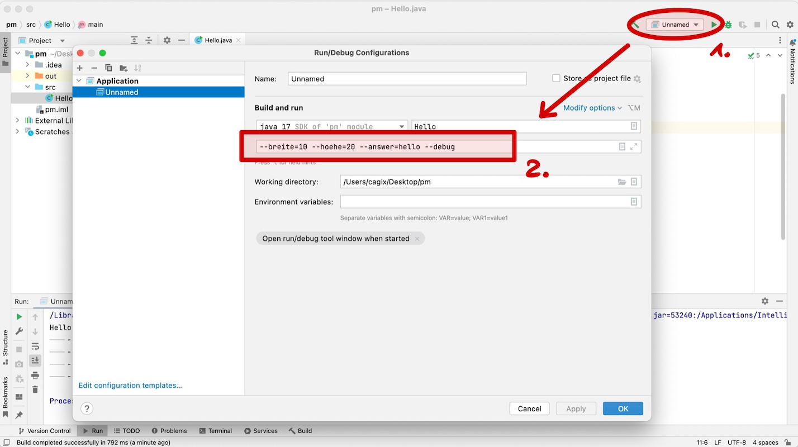

## Wie kann man Programme konfigurieren?

1.  Parameter beim Start mitgeben: Kommandozeilenparameter (CLI)

\smallskip

2.  Konfigurationsdatei einlesen und auswerten


## Varianten von Kommandozeilenparameter

*   Fixe Reihenfolge

    `java MyApp 10 20 hello debug`

\smallskip

*   Benannte Parameter I

    `java MyApp -x 10 -y 20 -answer hello -d`

\smallskip

*   Benannte Parameter II

    `java MyApp --breite=10 --hoehe=20 --answer=hello --debug`

\bigskip
Häufig Mischung von Kurz- und Langformen

::: notes
Häufig hat man eine Kurzform der Optionen, also etwa "-x". Dabei ist der Name der Option
in der Regel ein Zeichen lang. Es gibt aber auch Abweichungen von dieser Konvention, denken
Sie beispielsweise an `java -version`.

In der Langform nutzt man dann einen aussagekräftigen Namen und stellt zwei Bindestriche
voran, also beispielsweise "--breite" (als Alternative für "-x").

Wenn Optionen Parameter haben, schreibt man in der Kurzform üblicherweise "-x 10" (trennt
also den Parameter mit einem Leerzeichen von der Option) und in der Langform "--breite=10"
(also mit einem "=" zwischen Option und Parameter). Das sind ebenfalls Konventionen, d.h.
man kann prinzipiell auch in der Kurzform das "=" nutzen, also "-x=10", oder in der Langform
mit einem Leerzeichen trennen, also "--breite 10".
:::

[Demo IDE und CLI]{.ex href="https://youtu.be/a3XUfDbD9uo"}

::: notes
Hinweis IntelliJ: "`Edit Configurations`" => Kommandozeilenparameter unter "`Build and run`" im entsprechenden Feld eintragen


:::


## Auswertung Kommandozeilenparameter

*   Kommandozeilenparameter [werden]{.notes}  als String-Array  [an `main()`-Methode übergeben:]{.notes}

    ```java
    public static void main(String[] args) { }
    public static void main(String... argv) { }
    ```

    => Müssen "händisch" ausgewertet werden


\bigskip
\bigskip

_Anmerkung_: Nur Parameter! Nicht Programmname als erster Eintrag wie in C ...


## Beispiel Auswertung Kommandozeilenparameter

```java
public static void main(String[] args) {
    int x = 100;
    String answer = "";
    boolean debug = false;

    // Parameter: -x=10 -answer=hello -debug
    // => args = ["-x=10", "-answer=hello", "-debug"]
    for (String param : args) {
        if (param.startsWith("-x")) { x = Integer.parseInt(param.substring(3)); }
        if (param.startsWith("-a")) { answer = param.substring(8); }
        if (param.startsWith("-d")) { debug = true; }
    }
}
```

::: notes
### Kritik an manueller Auswertung Kommandozeilenparameter

*   Umständlich und unübersichtlich
*   Große `if-else`-Gebilde in `main()`
*   Kurz- und Langform müssen getrennt realisiert werden
*   Optionale Parameter müssen anders geprüft werden als Pflichtparameter
*   Überlappende Parameternamen schwer aufzufinden
*   Prüfung auf korrekten Typ nötig bei Parametern mit Werten
*   Hilfe bei Fehlern muss separat realisiert und gepflegt werden
:::


## Apache Commons: CLI

**Rad nicht neu erfinden!**

*   Apache Commons bietet die CLI-Bibliothek zum Umgang mit
    Kommandozeilenparametern an:
    [commons.apache.org/cli](https://commons.apache.org/proper/commons-cli/)

\pause
\bigskip
\bigskip

Annäherung an fremde API:

*   Lesen der verfügbaren Doku (PDF, HTML)
*   Lesen der verfügbaren Javadoc
*   Herunterladen der Bibliothek
*   Einbinden ins Projekt


## Exkurs: Einbinden fremder Bibliotheken/APIs

::: notes
### Eclipse

*   Lib von [commons.apache.org](https://commons.apache.org/proper/commons-cli/download_cli.cgi)
    herunterladen und auspacken
*   Neuen Unterordner im Projekt anlegen: `libs/`
*   Bibliothek (`.jar`-Files) hinein kopieren
*   Projektexplorer, Kontextmenü auf `.jar`-File: "`Add as Library`"
*   Alternativ Menü-Leiste: "`Project > Properties > Java Build Path > Libraries > Add JARs`"

### IntelliJ

*   Variante 1:
    *   Lib von [commons.apache.org](https://commons.apache.org/proper/commons-cli/download_cli.cgi)
        herunterladen und auspacken
    *   Neuen Unterordner im Projekt anlegen: `libs/`
    *   Bibliothek (`.jar`-Files) hinein kopieren
    *   Variante 1 (a):Projektexplorer, Kontextmenü auf `.jar`-File: "`Build Path > Add to Build Path`"
    *   Variante 1 (b): Projekteigenschaften, Eintrag "Libraries", "+", "New Project Library", "Java" und Jar-File auswählen
*   Variante 2:
    *   Projekteigenschaften, Eintrag "Libraries", "+", "New Project Library", "From Maven" und
        "commons-cli:commons-cli:1.5.0" als Suchstring eingeben und die Suche abschließen

### Gradle oder Ant oder Maven

*   Lib auf [Maven Central](https://search.maven.org/) suchen: "commons-cli:commons-cli" als Suchstring eingeben
*   Passenden Dependency-Eintrag in das Build-Skript kopieren
:::

### Kommandozeilenaufruf

*   Class-Path bei Aufruf setzen:
    *   Unix: `java -cp .:<jarfile>:<jarfile> <mainclass>`
    *   Windows: `java -cp .;<jarfile>;<jarfile> <mainclass>`

    ::: notes
    Achtung: Unter Unix (Linux, MacOS) wird ein Doppelpunkt zum Trennen
    der Jar-Files eingesetzt, unter Windows ein Semikolon!
    :::

Beispiel: `java -classpath .:/home/user/wuppy.jar MyApp`


::: notes
Vorgriff auf Build-Skripte (spätere VL): Im hier gezeigten Vorgehen werden die
Abhängigkeiten manuell aufgelöst, d.h. die Jar-Files werden manuell heruntergeladen
(oder selbst kompiliert) und dem Projekt hinzugefügt.

Alle später besprochenen Build-Skripte (Ant, Gradle) beherrschen die automatische
Auflösung von Abhängigkeiten. Dazu muss im Skript die Abhängigkeit auf geeignete
Weise beschrieben werden und wird dann beim Kompilieren des Programms automatisch
von spezialisierten Servern in der im Skript definierten Version heruntergeladen.
Dies funktioniert auch bei rekursiven Abhängigkeiten ...
:::


## Überblick Umgang mit Apache Commons CLI

**Paket**: `org.apache.commons.cli`

\bigskip

1.  Definition der Optionen
    *   Je Option eine Instanz der Klasse `Option`
    *   Alle Optionen in Container `Options` sammeln
2.  Parsen der Eingaben mit `DefaultParser`
3.  Abfragen der Ergebnisse: `CommandLine`
4.  Formatierte Hilfe ausgeben: `HelpFormatter`

::: notes
Die Funktionsweise der einzelnen Klassen wird in der Demo kurz angerissen. Schauen Sie bitte
zusätzlich in die Dokumentation.
:::

[Demo: Einbinden von Libs, cli.Args]{.ex href="https://github.com/Programmiermethoden-CampusMinden/Prog2-Lecture/blob/master/lecture/java-classic/src/cli/Args.java"}


## Laden und Speichern von Konfigurationsdaten

```
#ola - ein Kommentar
hoehe=2
breite=9
gewicht=12
```

\bigskip

*   Konfigurationsdaten sind i.d.R. Schlüssel-Wert-Paare (`String`/`String`)

    => `java.util.Properties`

    ::: notes
    Tatsächlich verbirgt sich ein `Hashtable` dahinter:

    ```java
    public class Properties extends Hashtable<Object,Object>;
    ```
    :::


## Laden und Speichern von Konfigurationsdaten (cnt.)

\bigskip

*   Properties anlegen und modifizieren

    ```java
    Properties props = new Properties();
    props.setProperty("breite", "9");
    props.setProperty("breite", "99");
    String value = props.getProperty("breite");
    ```

\bigskip

*   Properties speichern: `Properties#store` und `Properties#storeToXML`

    ::: notes
    ```java
    public void store(Writer writer, String comments)
    public void store(OutputStream out, String comments)
    public void storeToXML(OutputStream os, String comment, String encoding)
    ```
    :::

*   Properties laden: `Properties#load` und `Properties#loadFromXML`

    ::: notes
    ```java
    public void load(Reader reader)
    public void load(InputStream inStream)
    public void loadFromXML(InputStream in)
    ```
    :::

[Demo: cli.Props, Hinweis auf "Apache Commons Configuration"]{.ex href="https://github.com/Programmiermethoden-CampusMinden/Prog2-Lecture/blob/master/lecture/java-classic/src/cli/Props.java"}

::: notes
`java.util.Properties` sind eine einfache und im JDK bereits eingebaute Möglichkeit,
mit Konfigurationsdateien zu hantieren. Deutlich umfangreichere Möglichkeiten bieten
aber externe Bibliotheken, beispielsweise "Apache Commons Configuration"
([commons.apache.org/configuration](https://commons.apache.org/proper/commons-configuration/)).
:::


## Wrap-Up

*   Kommandozeilenparameter als `String[]` in `main()`-Methode
*   Manuelle Auswertung komplex => _Apache Commons CLI_
*   Schlüssel-Wert-Paare mit `java.util.Properties`  [aus/in Dateien laden/speichern]{.notes}
