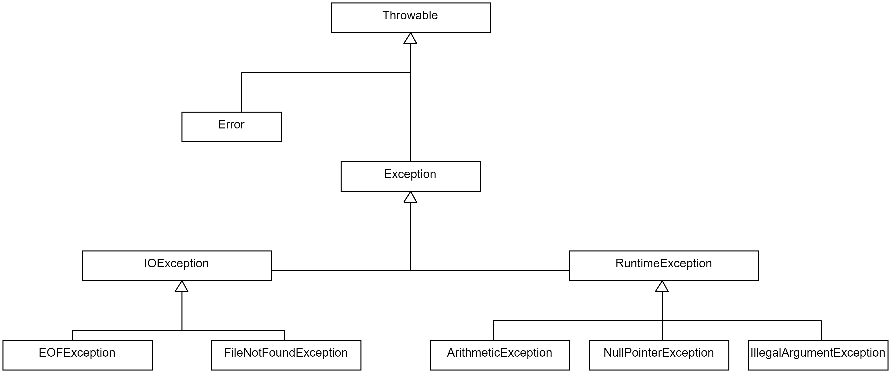

::: tldr
Man unterscheidet in Java zwischen **Exceptions** und **Errors**. Ein Error ist ein
Fehler im System (OS, JVM), von dem man sich nicht wieder erholen kann. Eine
Exception ist ein Fehlerfall innerhalb des Programmes, auf den man innerhalb des
Programms reagieren kann.

Mit Hilfe von Exceptions lassen sich Fehlerfälle im Programmablauf deklarieren und
behandeln. Methoden können/müssen mit dem Keyword `throws` gefolgt vom Namen der
Exception deklarieren, dass sie im Fehlerfall diese spezifische (checked) Exception
werfen (und nicht selbst behandeln).

Zum Exception-Handling werden die Keywords `try`, `catch` und `finally` verwendet.
Dabei wird im `try`-Block der Code geschrieben, der einen potenziellen Fehler wirft.
Im `catch`-Block wird das Verhalten implementiert, dass im Fehlerfall ausgeführt
werden soll, und im `finally`-Block kann optional Code geschrieben werden, der
sowohl im Erfolgs- als auch Fehlerfall ausgeführt wird.

Es wird zwischen **checked** Exceptions und **unchecked** Exceptions unterschieden.
Checked Exceptions sind für erwartbare Fehlerfälle gedacht, die nicht vom Programm
ausgeschlossen werden können, wie das Fehlen einer Datei, die eingelesen werden
soll. Checked Exceptions müssen deklariert oder behandelt werden. Dies wird vom
Compiler überprüft.

Unchecked Exceptions werden für Fehler in der Programmlogik verwendet, etwa das
Teilen durch 0 oder Index-Fehler. Sie deuten auf fehlerhafte Programmierung,
fehlerhafte Logik oder mangelhafte Eingabeprüfung hin. Unchecked Exceptions müssen
nicht deklariert oder behandelt werden. Unchecked Exceptions leiten von
`RuntimeException` ab.

Als Faustregel gilt: Wenn der Aufrufer sich von einer Exception-Situation erholen
kann, sollte man eine checked Exception nutzen. Wenn der Aufrufer vermutlich nichts
tun kann, um sich von dem Problem zu erholen, dann sollte man eine unchecked
Exception einsetzen.
:::

::: youtube
Vorlesung \[[YT](https://youtu.be/HcFAUI6s3LE)\],
\[[HSBI](https://www.hsbi.de/medienportal/video/pr2-exception-handling/25b98aa13064a150caf1a5898e458a32)\]
:::

# Was kann schiefgehen?

``` java
public class ReciprocalCalculator {
    public static double reciprocalFromFile(String fileName) throws IOException {
        String content = Files.readString(Path.of(fileName));
        int value = Integer.parseInt(content);
        return 1.0 / value;
    }
    public static void main(String[] args) throws IOException {
        double result = reciprocalFromFile("zahl.txt");
        IO.println("Kehrwert: " + result);
    }
}
```

:::: notes
Fragen Sie sich: Was passiert, wenn:

-   die Datei nicht vorhanden ist?
-   wenn die nötigen Leserechte auf der Datei nicht vorhanden sind?
-   wenn in der Datei ein Text statt einer Zahl steht?
-   wenn in der Datei die Zahl `0` steht?

::: details
-   `Files.readString(Path.of(fileName))` $\to$ `IOException`
-   `Integer.parseInt(content)` $\to$ `NumberFormatException`
-   `return 1.0 / value` $\to$ `ArithmeticException`

`IOException` ist eine **checked** Exception, die in `Files.readString` deklariert
wird. Folge: Diese Exception muss entweder gefangen werden oder in der
`throws`-Klausel der Methode deklariert werden (würde dann beim Auftreten an den
Aufrufer hochgereicht).

`NumberFormatException` und `ArithmeticException` sind **unchecked** Exceptions.
Diese können gefangen und behandelt werden, aber das Auftreten beruht i.d.R. auf
Logik- oder Programmierfehlern, d.h. man weiss nicht so genau, ob und wo diese
auftreten.
:::
::::

# Begriffe

-   **Checked Exceptions**
    -   Müssen deklariert (`throws`) oder gefangen (`try`/`catch`) werden
    -   Vom Compiler überprüft
    -   Beispiele: `IOException`, `FileNotFoundException`

\smallskip

-   **Unchecked Exceptions**
    -   Unterklassen von `RuntimeException`
    -   Keine Pflicht zur Deklaration oder zum Fangen
    -   Beispiele: `NullPointerException`, `IllegalArgumentException`,
        `ArithmeticException`

\bigskip
\smallskip

::: important
**Merksatz**:

-   Checked = *erwartbare* Fehlerquellen (z.B. I/O)
-   Unchecked = meist *Programmierfehler* / Logikfehler
:::

::: notes
## Throwable und Hierarchie von Exceptions und Errors (Ausschnitt)

{web_width="80%"}

## *Exception* vs. *Error*

-   `Error`:
    -   Wird für Systemfehler verwendet (Betriebssystem, JVM, ...)
        -   `StackOverflowError`
        -   `OutOfMemoryError`
    -   Von einem Error kann man sich nicht erholen
    -   Sollten nicht behandelt werden
-   `Exception`:
    -   Ausnahmesituationen bei der Abarbeitung eines Programms
    -   Können "checked" oder "unchecked" sein
    -   Von Exceptions kann man sich erholen

## Unchecked vs. Checked Exceptions

-   "Checked" Exceptions:
    -   Für erwartbare Fehlerfälle, deren Ursprung nicht im Programm selbst liegt
        -   `FileNotFoundException`
        -   `IOException`
    -   Alle nicht von `RuntimeException` ableitende Exceptions
    -   Müssen entweder behandelt (`try`/`catch`) oder deklariert (`throws`) werden:
        Dies wird vom Compiler überprüft!
-   "Unchecked" Exceptions:
    -   Logische Programmierfehler ("Versagen" des Programmcodes)
        -   `IndexOutOfBoundsException`
        -   `NullPointerException`
        -   `ArithmeticException`
        -   `IllegalArgumentException`
    -   Leiten von `RuntimeException` oder Unterklassen ab
    -   Müssen nicht deklariert oder behandelt werden

Beispiele checked Exception:

-   Es soll eine Abfrage an eine externe API geschickt werden. Diese ist aber
    aktuell nicht zu erreichen. "Erholung": Anfrage noch einmal schicken.
-   Es soll eine Datei geöffnet werden. Diese ist aber nicht unter dem angegebenen
    Pfad zu finden oder die Berechtigungen stimmen nicht. "Erholung": Aufrufer
    öffnet neuen File-Picker, um es noch einmal mit einer anderen Datei zu
    versuchen.

Beispiele unchecked Exception:

-   Eine `for`-Loop über ein Array ist falsch programmiert und will auf einen Index
    im Array zugreifen, der nicht existiert. Hier kann der Aufrufer nicht Sinnvolles
    tun, um sich von dieser Situation zu erholen.
-   Argumente oder Rückgabewerte einer Methode können `null` sein. Wenn man das
    nicht prüft, sondern einfach Methoden auf dem vermeintlichen Objekt aufruft,
    wird eine `NullPointerException` ausgelöst, die eine Unterklasse von
    `RuntimeException` ist und damit eine unchecked Exception. Auch hier handelt es
    sich um einen Fehler in der Programmlogik, von dem sich der Aufrufer nicht
    sinnvoll erholen kann.
:::

# Fangen und Behandeln von Exceptions mit *Try*-*Catch* oder *Throws*

## Variante A: Exception behandeln

``` java
public static void main(String[] args) {
    try {
        double result = reciprocalFromFile("zahl.txt");
        IO.println("Kehrwert: " + result);
    } catch (IOException e) {
        System.err.println("Fehler beim Lesen der Datei: " + e.getMessage());
    }
}
```

## Variante B: Exception weiterreichen

``` java
public static void main(String[] args) throws IOException {
    double result = reciprocalFromFile("zahl.txt");
    IO.println("Kehrwert: " + result);
}
```

:::: notes
-   Im `try` Block wird der Code ausgeführt, der einen Fehler werfen könnte.
-   Mit `catch` kann eine Exception gefangen und im `catch` Block behandelt werden.
-   Wenn man die *checked* `IOException`-Exception nicht fangen/behandlen möchte,
    muss die Methode entsprechend gekennzeichnet werden.

::: important
Das bloße Ausgeben des Stacktrace via `e.printStackTrace()` ist noch **kein
sinnvolles Exception-Handling**! Hier sollte auf die jeweilige Situation eingegangen
werden und versucht werden, den Fehler zu beheben oder dem Aufrufer geeignet zu
melden!
:::
::::

# *Try* und mehrstufiges *Catch*

``` java
public static void main(String[] args) {
    try {
        double result = reciprocalFromFile("zahl.txt");
        IO.println("Kehrwert: " + result);
    } catch (FileNotFoundException e) {
        System.err.println("Dateifehler: " + e.getMessage());
    } catch (NumberFormatException e) {
        System.err.println("Die Datei enthält keine gültige ganze Zahl.");
    } catch (ArithmeticException e) {
        System.err.println("Division durch 0 ist nicht erlaubt.");
    }
}
```

:::::: notes
Eine im `try`-Block auftretende Exception wird der Reihe nach mit den
`catch`-Blöcken gematcht (vergleichbar mit `switch case`).

::: important
Dabei muss die Vererbungshierarchie beachtet werden. Die spezialisierteste Klasse
muss ganz oben stehen, die allgemeinste Klasse als letztes. Sonst wird eine
Exception u.U. zu früh in einem nicht dafür gedachten `catch`-Zweig aufgefangen.
:::

::: important
Wenn eine Exception nicht durch die `catch`-Zweige aufgefangen wird, dann wird sie
an den Aufrufer weiter geleitet. Im Beispiel würde eine `IOException` nicht durch
die `catch`-Zweige gefangen (`NumberFormatException` und `ArithmeticException` sind
im falschen Vererbungszweig, und `FileNotFoundException` ist spezieller als
`IOException`) und entsprechend an den Aufrufer weiter gereicht. Da es sich
obendrein um eine checked Exception handelt, müsste man diese per
`throws IOException` an der Methode deklarieren.
:::

::: tip
Nur `IOException` ist *checked*. `NumberFormatException` und `ArithmeticException`
sind *unchecked* - Fangen ist optional, aber oft sinnvoll.
:::
::::::

[[Hinweis: catch und Vererbungshierarchie]{.ex}]{.slides}

# *Finally* und Aufräumen

``` java
BufferedReader reader = null;
try {
    reader = new BufferedReader(new FileReader(fileName));
    return reader.readLine();
} finally {
    if (reader != null)  reader.close();
}
```

:::: notes
Der `finally` Block wird sowohl im Fehlerfall als auch im Normalfall aufgerufen.
Dies wird beispielsweise für Aufräumarbeiten genutzt, etwa zum Schließen von
Verbindungen oder Input-Streams.

::: tip
`finally` wird auch dann ausgeführt, wenn im `try` ein `return` steht.
:::
::::

# Freigeben von Ressourcen: *Try*-with-Resources

## Problem bisher

::: notes
Mit `try`-`finally` müssen wir Ressourcen **manuell** schließen:
:::

``` java
BufferedReader reader = null;
try {
    reader = new BufferedReader(new FileReader(fileName));
    return reader.readLine();
} finally {
    if (reader != null)  reader.close();
}
```

\pause

## Lösung: `try-with-resources`

``` java
try (BufferedReader reader = new BufferedReader(new FileReader(fileName))) {
    return reader.readLine();
} // reader wird hier automatisch geschlossen
```

:::: notes
Im `try`-Statement können ein oder mehrere Ressourcen deklariert werden, die am Ende
sicher geschlossen werden. Diese Ressourcen müssen `java.io.Closeable` oder
`java.lang.AutoCloseable` implementieren.

Java schließt die Ressourcen **automatisch** am Ende des Blocks, egal ob eine
Exception geworfen wurde oder nicht. Vorteil: Weniger Boilerplate, weniger
Fehlerquellen (z.B. vergessenes `close()` o.ä.).

::: tip
Seit Java 9 kann man auch *bereits deklarierte* (und geöffnete) Ressourcen im
`try`-Kopf referenzieren und damit automatisch schließen lassen.
:::
::::

# Werfen von Exceptions mit *Throws*

::: notes
Man auch selbst aktiv Exceptions "werfen":
:::

``` java
int div(int a, int b) throws IllegalArgumentException {
    if (b == 0) throw new IllegalArgumentException("Can't divide by zero");
    return a / b;
}
```

::: notes
Wenn man aktiv eine neue Exception werfen will, erzeugt man mit `new` ein neues
Objekt der gewünschten Exception und "wirft" diese mit `throw`. Auch diese selbst
geworfene Exception kann man dann entweder selbst fangen und bearbeiten oder an den
Aufrufer weiterleiten und dies dann entsprechend über die `throws`-Klausel
deklarieren: nicht gefangene checked Exceptions *müssen* deklariert werden, nicht
gefangene unchecked Exceptions *können* deklariert werden.

Wenn mehrere Exceptions an den Aufrufer weitergeleitet werden, werden sie in der
`throws`-Klausel mit Komma getrennt: `throws Exception1, Exception2, Exception3`.
:::

[[Hinweis: throws und checked vs. unchecked]{.ex}]{.slides}

# Anti-Beispiele und Best Practices

## Anti-Beispiel 1: Leerer catch-Block

``` java
try {
    double result = reciprocalFromFile("zahl.txt");
} catch (IOException e) {
    // nichts... oder e.printStackTrace()
}
```

::: notes
Problem: Fehler wird "verschluckt" $\to$ Debugging-Hölle. Der Stacktrace (wird gern
von IDEs automatisch eingefügt) ist auch nur bedingt hilfreich.
:::

\pause

## Anti-Beispiel 2: Zu allgemein fangen

``` java
try {
    double result = reciprocalFromFile("zahl.txt");
} catch (Exception e) {
    System.err.println("Irgendetwas ist schiefgegangen.");
}
```

::: notes
Problem: Fängt auch Programmierfehler (z.B. `NullPointerException`), die Sie gar
nicht "heilen" sollten. Besser: So spezifisch wie möglich fangen.
:::

::: notes
## Best Practices: Fehlerbilder bewusst aufgreifen

Wenn Sie im Code `catch (Exception e)` sehen, sollte bei Ihnen ein Alarm losgehen.
Damit fangen Sie zwar "alles", aber Sie können nicht mehr gezielt und spezifisch auf
einen bestimmten Fehler reagieren. Außerdem verdecken Sie Fehler, an die Sie
vielleicht gar nicht gedacht haben.

1.  Fangen Sie immer möglichst präzise die Fehler, die Sie erwarten.
2.  Behandeln Sie die Fehler möglichst früh (sofern das möglich ist). Wenn eine
    Behandlung nicht möglich/sinnvoll ist, reichen Sie die Exception "hoch" an den
    Aufrufer.
3.  Wenn Sie Exceptions nicht fangen oder selbst welche werfen, deklarieren Sie das
    möglichst (auch für unchecked Exceptions) an Ihrer Methode.
:::

::: notes
# Stilfrage A: Wann checked, wann unchecked

## "Checked" Exceptions

-   Für erwartbare Fehlerfälle, deren Ursprung nicht im Programm selbst liegt
-   Aufrufer kann sich von der Exception erholen

## "Unchecked" Exceptions

-   Logische Programmierfehler ("Versagen" des Programmcodes)
-   Aufrufer kann sich von der Exception vermutlich nicht erholen

Vergleiche ["Unchecked Exceptions --- The
Controversy"](https://dev.java/learn/exceptions/unchecked-exception-controversy/).
:::

::: notes
# Vertiefung: Stilfrage B: Wie viel Code im *Try*?

``` java
int getFirstLineAsInt(String pathToFile) {
    FileReader fileReader = new FileReader(pathToFile);
    BufferedReader bufferedReader = new BufferedReader(fileReader);
    String firstLine = bufferedReader.readLine();

    return Integer.parseInt(firstLine);
}
```

[Demo: exceptions.HowMuchTry]{.ex
href="https://github.com/Programmiermethoden-CampusMinden/Prog2-Lecture/blob/master/lecture/java-classic/src/exceptions/HowMuchTry.java"}

Hier lassen sich verschiedene "Ausbaustufen" unterscheiden.

## 1. Handling an den Aufrufer übergeben

``` java
int getFirstLineAsIntV1(String pathToFile) throws FileNotFoundException, IOException {
    FileReader fileReader = new FileReader(pathToFile);
    BufferedReader bufferedReader = new BufferedReader(fileReader);
    String firstLine = bufferedReader.readLine();

    return Integer.parseInt(firstLine);
}
```

Der Aufrufer hat den Pfad als String übergeben und ist vermutlich in der Lage, auf
Probleme mit dem Pfad sinnvoll zu reagieren. Also könnte man in der Methode selbst
auf ein `try`/`catch` verzichten und stattdessen die `FileNotFoundException` (vom
`FileReader`) und die `IOException` (vom `bufferedReader.readLine()`) per `throws`
deklarieren.

*Anmerkung*: Da `FileNotFoundException` eine Spezialisierung von `IOException` ist,
reicht es aus, lediglich die `IOException` zu deklarieren.

## 2. Jede Exception einzeln fangen und bearbeiten

``` java
int getFirstLineAsIntV2(String pathToFile) {
    FileReader fileReader = null;
    try {
        fileReader = new FileReader(pathToFile);
    } catch (FileNotFoundException fnfe) {
        fnfe.printStackTrace(); // Datei nicht gefunden
    }

    BufferedReader bufferedReader = new BufferedReader(fileReader);

    String firstLine = null;
    try {
        firstLine = bufferedReader.readLine();
    } catch (IOException ioe) {
        ioe.printStackTrace(); // Datei kann nicht gelesen werden
    }

    try {
        return Integer.parseInt(firstLine);
    } catch (NumberFormatException nfe) {
        nfe.printStackTrace(); // Das war wohl kein Integer
    }

    return 0;
}
```

In dieser Variante wird jede Operation, die eine Exception werfen kann, separat in
ein `try`/`catch` verpackt und jeweils separat auf den möglichen Fehler reagiert.

Dadurch kann man die Fehler sehr einfach dem jeweiligen Statement zuordnen.

Allerdings muss man nun mit Behelfsinitialisierungen arbeiten und der Code wird sehr
in die Länge gezogen und man erkennt die eigentlichen funktionalen Zusammenhänge nur
noch schwer.

*Anmerkung*: Das "Behandeln" der Exceptions ist im obigen Beispiel kein gutes
Beispiel für das Behandeln von Exceptions. Einfach nur einen Stacktrace zu printen
und weiter zu machen, als ob nichts passiert wäre, ist **kein sinnvolles
Exception-Handling**. Wenn Sie solchen Code schreiben oder sehen, ist das ein
Anzeichen, dass auf dieser Ebene nicht sinnvoll mit dem Fehler umgegangen werden
kann und dass man ihn besser an den Aufrufer weiter reichen sollte (siehe nächste
Folie).

## 3. Funktionaler Teil in gemeinsames *Try* und mehrstufiges *Catch*

``` java
int getFirstLineAsIntV3(String pathToFile) {
    try {
        FileReader fileReader = new FileReader(pathToFile);
        BufferedReader bufferedReader = new BufferedReader(fileReader);
        String firstLine = bufferedReader.readLine();
        return Integer.parseInt(firstLine);
    } catch (FileNotFoundException fnfe) {
        fnfe.printStackTrace(); // Datei nicht gefunden
    } catch (IOException ioe) {
        ioe.printStackTrace(); // Datei kann nicht gelesen werden
    } catch (NumberFormatException nfe) {
        nfe.printStackTrace(); // Das war wohl kein Integer
    }

    return 0;
}
```

Hier wurde der eigentliche funktionale Kern der Methode in ein gemeinsames
`try`/`catch` verpackt und mit einem mehrstufigen `catch` auf die einzelnen Fehler
reagiert. Durch die Art der Exceptions sieht man immer noch, wo der Fehler herkommt.
Zusätzlich wird die eigentliche Funktionalität so leichter erkennbar.

*Anmerkung*: Auch hier ist das gezeigte Exception-Handling kein gutes Beispiel.
Entweder man macht hier sinnvollere Dinge, oder man überlässt dem Aufrufer die
Reaktion auf den Fehler.
:::

::: notes
# Vertiefung: Stilfrage C: Wo fange ich die Exception?

``` java
private static void methode1(int x) throws IOException {
    JFileChooser fc = new JFileChooser();
    fc.showDialog(null, "ok");
    methode2(fc.getSelectedFile().toString(), x, x * 2);
}

private static void methode2(String path, int x, int y) throws IOException {
    FileWriter fw = new FileWriter(path);
    BufferedWriter bw = new BufferedWriter(fw);
    bw.write("X:" + x + " Y: " + y);
}

public static void main(String... args) {
    try {
        methode1(42);
    } catch (IOException ioe) {
        ioe.printStackTrace();
    }
}
```

Prinzipiell steht es einem frei, wo man eine Exception fängt und behandelt. Wenn im
`main()` eine nicht behandelte Exception auftritt (weiter nach oben geleitet wird),
wird das Programm mit einem Fehler beendet.

Letztlich scheint es eine gute Idee zu sein, eine Exception so nah wie möglich am
Ursprung der Fehlerursache zu behandeln. Man sollte sich dabei die Frage stellen: Wo
kann ich sinnvoll auf den Fehler reagieren?
:::

::: notes
# Vertiefung: Eigene Exceptions definieren

``` java
// Checked Exception
public class MyCheckedException extends Exception {
    public MyCheckedException(String errorMessage) {
        super(errorMessage);
    }
}
```

``` java
// Unchecked Exception
public class MyUncheckedException extends RuntimeException {
    public MyUncheckedException(String errorMessage) {
        super(errorMessage);
    }
}
```

Eigene Exceptions können durch Spezialisierung anderer Exception-Klassen realisiert
werden. Dabei kann man direkt von `Exception` oder `RuntimeException` ableiten oder
bei Bedarf von spezialisierteren Exception-Klassen.

Wenn die eigene Exception in der Vererbungshierarchie unter `RuntimeException`
steht, handelt es sich um eine *unchecked Exception*, sonst um eine *checked
Exception*.

In der Benutzung (werfen, fangen, deklarieren) verhalten sich eigene
Exception-Klassen wie die Exceptions aus dem JDK.
:::

# Wrap-Up

-   Exceptions trennen **Normalfall** und **Fehlerfall** im *Kontrollfluss*

\smallskip

-   Checked vs. Unchecked:
    -   Checked = behandeln oder deklarieren
    -   Unchecked = keine Pflicht, aber bewusst einsetzen

\smallskip

-   `try`-`catch`-`finally`:
    -   `try`: "gefährlicher" Code
    -   `catch`: definierte Reaktion
    -   `finally`: Aufräumarbeiten

:::: notes
::: important
Exceptions führen einen zweiten Kontrollfluss ein. Das kann schnell zu
unübersichtlichen Strukturen und Abläufen führen.

Exceptions passen nicht zu moderner Verarbeitung mit der Stream-API und
Lambda-Ausdrücken oder Methodenreferenzen.
:::
::::

::: readings
Lesen Sie zu diesem Thema auch in den dev.java-Tutorials von Oracle
["Exceptions"](https://dev.java/learn/exceptions/) nach.
:::

::: outcomes
-   k2: Ich kann erklären, warum wir in Java Exceptions brauchen
-   k2: Ich kann typische Fehler beim Exception-Handling erkennen
-   k2: Ich kann zwischen checked und unchecked Exceptions unterscheiden
-   k3: Ich kann mit `try`/`catch`/`finally` und `throws` gezielt einsetzen
-   k3: Ich kann eigene Exceptions definieren
:::

::: challenges
**Diskussion**

1.  Wo im System (UI, Service, Datenzugriff) sollten Sie typischerweise Exceptions
    fangen?
2.  Wo lassen Sie sie bewusst "nach oben durchlaufen"?

**Mini-Aufgabe**

Implementieren Sie

``` java
public static double safeReciprocalFromFile(String fileName) {
    // ...
}
```

Anforderungen:

-   Bei Dateifehlern: Rückgabewert `Double.NaN`
-   Bei ungültiger Zahl: Rückgabewert `0.0`
-   Bei Division durch 0: Rückgabewert `Double.POSITIVE_INFINITY`

Frage: Welche Exceptions fangen Sie? Welche lassen Sie durchlaufen?

**Mini-Quizz**:

1.  Erläutern Sie in 1-2 Sätzen den Unterschied zwischen **checked** und
    **unchecked** Exceptions in Java.

2.  Nennen Sie je **zwei Beispiele** für checked bzw. unchecked Exceptions.

3.  Was macht der Compiler?

    ``` java
    public static String readFileContent(String fileName) {
        return Files.readString(Path.of(fileName));
    }
    ```

    -   kompiliert ohne Warnungen/Fehler
    -   Compilerfehler (falls ja, welche?)
    -   Laufzeitfehler (aber kein Compilerfehler)
    -   Compiler fügt automatisch `try`-`catch` hinzu

4.  catch-Struktur beurteilen

    ``` java
    try {
        double result = reciprocalFromFile("zahl.txt");
        System.out.println(result);
    } catch (IOException e) {
        System.err.println("I/O-Fehler");
    } catch (Exception e) {
        System.err.println("Allgemeiner Fehler");
    }
    ```

    -   Welche Exceptions werden vom zweiten `catch`-Block noch erfasst?
    -   Diskutieren Sie kurz: Ist das aus Ihrer Sicht eine gute Idee? Warum / warum
        nicht?

5.  Designentscheidung

    Sie haben eine Methode in einer Bibliothek:

    ``` java
    public static double divide(int a, int b) {
        return a / b;
    }
    ```

    Diskutieren Sie:

    -   Würden Sie hier eine eigene checked Exception (z.B.
        `DivisionByZeroException`) einführen?
    -   Oder vertrauen Sie auf die bestehende `ArithmeticException` (unchecked)?

<!--
1: checked = Compiler erzwingt Behandlung/Deklaration; unchecked = RuntimeExceptions, keine Pflicht.
2: checked: IOException, SQLException; unchecked: NullPointerException, ArithmeticException.
3: B ist korrekt; Files.readString kann IOException werfen.
4a: Alle Exceptions, die keine IOException sind (inkl. RuntimeException, NullPointerException etc.).
4b: Meist ungünstig, da Programmierfehler "maskiert" werden.
5: Diskussionsfrage; wichtiger Punkt: Division durch 0 eher Programmierfehler -> ArithmeticException ausreichend; checked Exception würde den API‑Gebrauch schwerer machen.
-->
:::
