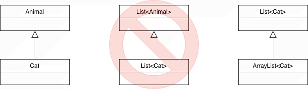
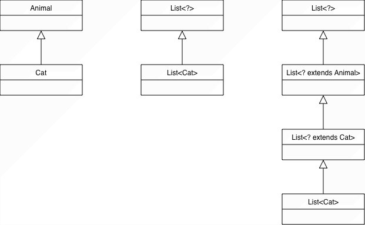
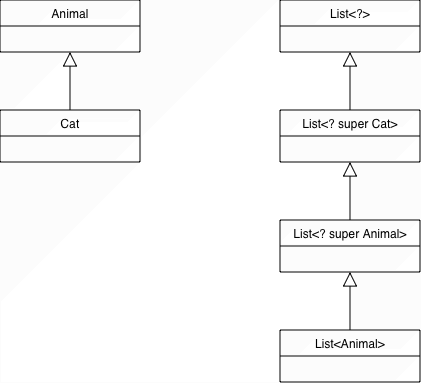

::: tldr
Auch mit generischen Klassen stehen die Mechanismen Vererbung und Überladen zur
Verfügung. Dabei muss aber beachtet werden, dass generische Klassen sich
**"invariant"** verhalten: Der Typ selbst folgt der Vererbungsbeziehung, eine
Vererbung des Typ-Parameters begründet *keine* Vererbungsbeziehung! D.h. aus
`U <: O` folgt **nicht** `A<U> <: A<O>`.

Bei Arrays ist es genau anders herum: Wenn `U <: O` dann gilt auch `U[] <: O[]` ...
(Dies nennt man "*kovariantes*" Verhalten.)

Generics existieren eigentlich nur auf Quellcode-Ebene. Nach der Typ-Prüfung etc.
entfernt der Compiler alle generischen Typ-Parameter und alle `<...>` (=\>
"Type-Erasure"), d.h. im Byte-Code stehen nur noch Raw-Typen bzw. die oberen
Typ-Schranken der Typ-Parameter, in der Regel `Object`. Zusätzlich baut der Compiler
die nötigen Casts ein. Als Anwender merkt man davon nichts, muss das "Type-Erasure"
wegen der Auswirkungen aber auf dem Radar haben!
:::

::: youtube
-   [VL Generics und Polymorphie](https://youtu.be/RiTA43wTixQ)
:::

# Motivation: Wie verhalten sich generische Typen zueinander

::: notes
Wir haben uns schon angeschaut:

-   Definition generischer Klassen/Methoden: `class Box<T> { ... }`,
    `static <T> void m(T x) {...}`
-   Bounds: `T extends Number`
-   Wildcards: `List<? extends Number>`

Die Frage für heute: **Wie verhalten sich generische Typen zueinander**?
:::

``` java
interface Animal {
    default void eat() {}
}
record Dog() implements Animal {}
record Cat() implements Animal {}
```

\bigskip

Da `Cat <: Animal` gilt: Ist dann auch `List<Cat> <: List<Animal>`?

:::: notes
::: tip
Den `<:`-Operator lesen Sie bitte als "Subtyp-Relation", d.h. `A <: B` heißt: "`A`
ist ein Untertyp von `B`" bzw. "`A` ist Subtyp von `B`".
:::
::::

``` java
List<Animal> animals = new ArrayList<Cat>();  // ???
```

# Invarianz generischer Klassen in Java

::: notes
Gedankenexperiment: Angenommen, `List<Animal> animals = new ArrayList<Cat>();` wäre
erlaubt. Dann würde das Folgende auch erlaubt sein:
:::

``` java
List<Cat> cats = new ArrayList<>();
List<Animal> animals = cats;  // hypothetisch erlaubt

animals.add(new Dog());       // erlaubt, weil animals: List<Animal>
Cat c = cats.getFirst();      // aber jetzt steckt ein Dog in cats!
```

\pause
\bigskip

**Widerspruch zur Typ­sicherheit**

\bigskip
\smallskip

::: important
Java‑Generics sind **invariant**

Wenn `A <: B` (`A` Untertyp von `B`), dann folgt **nicht** `List<A> <: List<B>`.
:::

::: notes
=\> Polymorphie bei Generics bezieht sich auf den **Klassen‑/Interface-Typ** selbst,
nicht auf den Typ‑Parameter. Bei der Vererbung von generischen Typen muss der
Typ-Parameter identisch sein.

{width="60%"}

-   Ungültige Beispiele:

    -   Es gilt zwar: `Cat  <:  Animal`, aber **nicht**
        `List<Cat>  <:  List<Animal>` (und auch **nicht**
        `List<Animal>  <:  List<Cat>`).

-   Gültige Beispiele:

    -   `ArrayList<Cat>  <:  List<Cat>`

    -   `HashSet<String>  <:  Set<String>`

    -   `B<Double>  <:  A<Double>` und `B<String>  <:  A<String>`

        ``` java
        class A<E> { ... }
        class B<E> extends A<E> { ... }

        A<Double> ad = new B<Double>();
        A<String> as = new B<String>();
        ```

    -   `Stack<Double>  <:  Vector<Double>` und `Stack<String>  <:  Vector<String>`

        ``` java
        class Vector<E> { ... }
        class Stack<E> extends Vector<E> { ... }

        Vector<Double> vd = new Stack<Double>();
        Vector<String> vs = new Stack<String>();
        ```
:::

# Kovarianz mit `? extends` (Producer: nur lesen)

::: notes
Problem:

Wir wollen aus einer (übergebenen) generischen Datenstruktur lesen können: Eine
Methode soll alle "Listen von Tieren" akzeptieren, egal ob `List<Dog>`, `List<Cat>`
oder `List<Animal>`.

Lösung: `? extends Animal`:
:::

``` java
static void feedAll(List<? extends Animal> animals) {
    for (Animal a : animals) {  a.eat();  }

    // animals.add(new Cat()); // Compiler-Fehler
}

List<Cat> cats = ... ;  feedAll(cats);
```

::: notes
Erklärung:

-   `animals` ist eine Liste von **irgendetwas**, das **mindestens** ein `Animal`
    ist: Oberklasse der Listenelemente ist `Animal`
-   Wir wissen deshalb: Jedes Element der Liste hat die Schnittstelle von `Animal`
    $\to$ `a.eat()` ist also sicher

=\> Diese Liste ist ein **"Producer"** von `Animal`‑Objekten, d.h. sie gibt uns
`Animal`‑Objekte (wir holen nur raus, wir lesen nur).

Darf man auch Elemente der Liste `animals` hinzufügen? NEIN!

-   Zur Laufzeit könnte es z.B. eine `List<Dog>` sein
-   Dann wäre `animals.add(new Cat())` nicht typ­sicher

=\> Konsequenz: Bei `List<? extends Animal>` ist **lesen sicher**, **schreiben
(`add`) verboten**.
:::

\pause
\bigskip
\smallskip

::: important
**Kovarianz** durch `? extends T`:

-   "Ich akzeptiere Listen von Untertypen von `T`"
-   Nur sicher als **Producer** von `T` (lesen erlaubt)

\smallskip

-   `List<Cat>` ist **kein** Untertyp von `List<Animal>`
-   Aber: `List<Cat>  <:  List<? extends Animal>`
:::

::: notes
Damit bildet sich die sogenannte "Kovarianz-Leiter":

-   Unser Tiere-Beispiel:
    `List<Cat>  <:  List<? extends Cat>  <:  List<? extends Animal>  <:  List<?>`
-   `Integer` und `Number` aus dem JDK:
    `List<Integer>  <:  List<? extends Integer>  <:  List<? extends Number>  <:  List<?>`

{width="60%"}
:::

# Kontravarianz mit `? super` (Consumer: nur schreiben)

::: notes
Jetzt die andere Richtung:

Wir wollen eine Methode, die in eine (übergebene) generische Datenstruktur
hinzufügen kann: z.B. alle `Cat` in irgendeine Liste stecken, die "`Cat` oder
allgemeiner" ist.
:::

``` java
static void addCats(List<? super Cat> cats) {
    cats.add(new Cat());         // erlaubt
    // Cat c = cats.getFirst();  // Compiler-Fehler: Rückgabetyp ist Object
}

List<Cat> cats = ... ;  addCats(cats);
```

::: notes
Erklärung:

-   `cats` ist eine Liste von `Cat` oder einem Supertyp (`Cat`, `Animal`, `Object`)
-   Es ist immer sicher, eine `Cat` hinzuzufügen, denn:
    -   Eine Liste von `Cat` darf Cats enthalten
    -   Eine Liste von `Animal` darf Cats (als Untertyp) enthalten
    -   Eine Liste von `Object` sowieso

Aber:

-   Beim Lesen weiß der Compiler nicht, ob wirklich eine `List<Cat>` übergeben
    wurde - er kennt nur `? super Cat`
-   Sicherer gemeinsamer Nenner: `Object`
:::

\pause
\bigskip
\smallskip

::: important
**Kontravarianz** durch `? super T`:

-   "Ich akzeptiere Listen von Supertypen von `T`"
-   Nur sicher als **Consumer** von `T` (schreiben/hinzufügen erlaubt)

\smallskip

-   `? super Cat` bedeutet: Typ‑Argument ist `Cat`, `Animal` oder `Object`
-   `List<Animal>  <:  List<? super Cat>`
:::

::: notes
Damit bildet sich die sogenannte "Kontravarianz-Leiter":

-   Unser Tiere-Beispiel:
    `List<Animal>  <:  List<? super Animal>  <:  List<? super Cat>  <:  List<?>`
-   `Integer` und `Number` aus dem JDK:
    `List<Number>  <:  List<? super Number>  <:  List<? super Integer>  <:  List<?>`

{width="45%"}
:::

# PECS: Producer Extends, Consumer Super

::: notes
Beide Aspekte zusammen betrachtet:

-   Wenn ein Parameter nur gelesen werden soll $\to$ `? extends T`
-   Wenn ein Parameter nur geschrieben (konsumiert) werden soll $\to$ `? super T`
-   Wenn beides passieren soll $\to$ konkrete Typvariable, etwa `List<T>`
:::

::: center
**PECS: Producer Extends, Consumer Super**
:::

\bigskip
\bigskip

-   **Producer** (liefert Elemente, **kovariant**): `List<? extends Animal>`
-   **Consumer** (nimmt Elemente auf, **kontravariant**): `List<? super Cat>`

\smallskip

-   Ohne Wildcard `List<Cat>`: Typ ist **invariant**; Lesen und Schreiben für genau
    diesen Typ

:::: notes
::: tip
Die Begriffe können verwirrend sein - wenn man die Begriffe Producer/Consumer als
Ergebnis der Methode begreift.

**PECS benennt die Rolle des Parameters (der Collection) und nicht die Aktion, die
Ihre Methode ausführt.**

Hier eine bildliche Eselsbrücke:

``` java
void foo(List<? extends T> xs) { ... }  // "extends"-Fall
void bar(List<? super T> ys) { ... }    // "super"-Fall
```

Die PECS‑Merksätze sagen: "Was kann ich mit diesem *Parameter* **sicher** machen?"

-   `List<? extends T> xs`: **Producer** von `T`
    -   Die Liste `xs` "produziert" Objekte vom Typ `T`
    -   "Ich kann aus `xs` Dinge vom Typ `T` herausbekommen"
    -   "Die Liste `xs` gibt Objekte vom Typ `T` heraus"
-   `List<? super T> ys`: **Consumer** von `T`
    -   Die Liste `ys` "konsumiert" Objekte vom Typ `T`
    -   "Ich kann in `ys` Dinge vom Typ `T` hineinstecken"
    -   "Die Liste `ys` nimmt Objekte vom Typ `T` an"

"Producer/Consumer" meint hier die Liste (bzw. den Parametertyp), nicht die Methode!
:::
::::

# Bezug zu funktionalen Interfaces

::: notes
Beispiele aus der Java-Standard‑Bibliothek: (JDK):
:::

-   `Function<? super T, ? extends R>`
    -   Abbildung von `T` nach `R`: `R apply(T)`
    -   Input (konsumiert `T`): `? super T`
    -   Output (produziert `R`): `? extends R`

\bigskip
\smallskip

-   `Comparator<? super T>`
    -   `int compare(T, T)`
    -   Ein `Comparator` vergleicht `T`‑Objekte, "konsumiert" also `T`: `? super T`

# Typ-Löschung (*Type Erasure*)

:::: notes
Generics sind ein **Compile‑Time‑Feature**. Vor der Laufzeit werden sämtliche
Typ‑Parameter **gelöscht** ("*erased*"). **Zur Laufzeit gibt es keine Generics
mehr.**

Der Compiler ersetzt nach Prüfung der Typen und ihrer Verwendung alle Typ-Parameter
durch

1.  deren obere (Typ-)Schranke und
2.  passende explizite Cast-Operationen (im Byte-Code).

Die obere Typ-Schranke ist in der Regel der Typ der ersten Bounds-Klausel oder
`Object`, wenn keine Einschränkungen formuliert sind.

Bei parametrisierten Typen wie `List<T>` wird der Typ-Parameter entfernt, es
entsteht ein sogenannter *Raw*-Typ (`List`, quasi implizit mit `Object`
parametrisiert).

=\> Ergebnis: Nur **eine** (untypisierte) Klasse! **Zur Laufzeit gibt es keine
Generics mehr!**

::: tip
**Hinweis**: In C++ ist man den anderen möglichen Weg gegangen und erzeugt für jede
Instantiierung die passende Klasse.
:::

**Beispiel**: Aus dem folgenden harmlosen Code-Fragment:
::::

``` java
class Studi<T> {
    T myst(T m, T n) { return n; }

    public static void main(String[] args) {
        Studi<Integer> a = new Studi<>();
        int i = a.myst(1, 3);
    }
}
```

\pause
\bigskip
\hrule
\smallskip

::: notes
wird nach der Typ-Löschung durch Compiler (das steht dann quasi im Byte-Code):
:::

``` java
class Studi {
    Object myst(Object m, Object n) { return n; }

    public static void main(String[] args) {
        Studi a = new Studi();
        int i = (Integer) a.myst(1, 3);
    }
}
```

::: notes
Die obere Schranke meist `Object` $\to$ `new T()` verboten/sinnfrei (s.u.)!
:::

::: notes
# Type-Erasure bei Nutzung von Bounds

vor der Typ-Löschung durch Compiler:

``` java
class Cps<T extends Number> {
    T myst(T m, T n) {
        return n;
    }

    public static void main(String[] args) {
        Cps<Integer> a = new Cps<>();
        int i = a.myst(1, 3);
    }
}
```

nach der Typ-Löschung durch Compiler:

``` java
class Cps {
    Number myst(Number m, Number n) {
        return n;
    }

    public static void main(String[] args) {
        Cps a = new Cps();
        int i = (Integer) a.myst(1, 3);
    }
}
```
:::

# Folgen der Typ-Löschung: *new*

::: center
`new` mit parametrisierten Klassen ist nicht erlaubt!
:::

\bigskip
\bigskip

``` java
class Fach<T> {
    public T foo() {
        return new T();  // nicht erlaubt!!!
    }
}
```

\bigskip

Grund: Zur Laufzeit keine Klasseninformationen über `T` mehr

::: notes
Im Code steht `return (CAST) new Object();`. Das neue Object kann man anlegen, aber
ein Cast nach irgendeinem anderen Typ ist sinnfrei: Jede Klasse ist ein Untertyp von
`Object`, aber eben nicht andersherum. Außerdem fehlt dem Objekt vom Typ `Object`
auch sämtliche Information und Verhalten, die der Cast-Typ eigentlich mitbringt ...
:::

# Folgen der Typ-Löschung: *static*

::: center
`static` mit generischen Typen ist nicht erlaubt!
:::

\bigskip
\bigskip

``` java
class Fach<T> {
    static T t;                    // nicht erlaubt!!!
    static Fach<T> c;              // nicht erlaubt!!!
    static void foo(T t) { ... };  // nicht erlaubt!!!
}

Fach<String>  a;
Fach<Integer> b;
```

\bigskip

Grund: Compiler generiert nur eine Klasse! Beide Objekte würden sich die statischen
Attribute teilen `\newline`{=tex} (Typ zur Laufzeit unklar!).

\smallskip

**Hinweis**: Generische (statische) Methoden sind erlaubt. (Warum?)

::: notes
``` java
class Fach<T> {
    static <U> Fach<U> createEmpty() { ... } // generische statische Methode ist ok
}
```
:::

:::: notes
# Folgen der Typ-Löschung: *instanceof*

::: center
`instanceof` mit parametrisierten Klassen ist nicht erlaubt!
:::

\bigskip
\bigskip

vor der Typ-Löschung durch Compiler:

``` java
class Fach<T> {
    void printType(Fach<?> p) {
        if (p instanceof Fach<Number>)
            ...
        else if (p instanceof Fach<String>)
            ...
    }
}
```

unsinniger Code nach Typ-Löschung:

``` java
class Fach {
void printType(Fach p) {
    if (p instanceof Fach)
        ...
    else if (p instanceof Fach)
        ...
    }
}
```
::::

:::: notes
# Folgen der Typ-Löschung: *.class*

::: center
`.class` mit parametrisierten Klassen ist nicht erlaubt!
:::

\bigskip
\bigskip

``` java
boolean x;
List<String>  a = new ArrayList<String>();
List<Integer> b = new ArrayList<Integer>();

x = (List<String>.class == List<Integer>.class);  // Compiler-Fehler
x = (a.getClass() == b.getClass());               // true
```

\bigskip

Grund: Es gibt nur `List.class` (und kein `List<String>.class` bzw.
`List<Integer>.class`)!
::::

:::: notes
# Raw-Types: Ich mag meine Generics "well done" :-)

Raw-Types: Instanziierung ohne Typ-Parameter =\> `Object`

``` java
Stack s = new Stack(); // Stack von Object-Objekten
```

-   Wegen Abwärtskompatibilität zu früheren Java-Versionen noch erlaubt.
-   Nutzung wird nicht empfohlen! (Warum?)

::: tip
Raw-Types darf man zwar selbst im Quellcode verwenden (so wie im Beispiel hier),
**sollte** die Verwendung aber vermeiden wegen der Typ-Unsicherheit: Der Compiler
sieht im Beispiel nur noch einen Stack für `Object`, d.h. dort dürfen Objekte aller
Typen abgelegt werden - es kann keine Typprüfung durch den Compiler stattfinden. Auf
einem `Stack<String>` kann der Compiler prüfen, ob dort wirklich nur
`String`-Objekte abgelegt werden und ggf. entsprechend Fehler melden.

Etwas anderes ist es, dass der Compiler im Zuge von Type-Erasure selbst Raw-Types in
den Byte-Code schreibt. Da hat er vorher bereits die Typsicherheit geprüft und er
baut auch die passenden Casts ein.

Das Thema ist eigentlich nur noch aus Kompatibilität zu Java5 oder früher da, weil
es dort noch keine Generics gab (wurden erst mit Java5 eingeführt).
:::
::::

# Abgrenzung: Arrays vs. Generics: Reifizierung

::: important
Arrays sind **reifiziert** (engl. *reified*): Sie "kennen" ihren Elementtyp **zur
Laufzeit**.
:::

\bigskip

``` java
String[] sa = new String[10];
Object[] oa = sa;         // erlaubt: Array-Kovarianz

oa[0] = "Hallo";          // ok
oa[0] = new Double(2.0);  // Laufzeitfehler
```

\bigskip

-   Arrays besitzen Typinformationen über gespeicherte Elemente
-   Prüfung auf Typ-Kompatibilität zur **Laufzeit** (nicht Kompilierzeit!)
-   Arrays sind **kovariant**: `String[]  <:  Object[]` wg. \`String \<: Object\`\`

:::: notes
Im Vergleich sind generische Typen **nicht reifiziert** (engl. *not reified*) - die
Typ-Parameter existieren nur zur **Compile-Time** und werden nach der Prüfung durch
den Compiler entfernt. Zur Laufzeit wird aus `List<String>` und `List<Integer>`
einfach nur `List` (plus notwendige Casts, vom Compiler nach dem Type-Check
automatisch eingefügt).

::: tip
Hintergrund:

Arrays gab es bereits sehr früh, Generics wurden erst viel später nachträglich
hinzugefügt (in Java 5). Bei Arrays fand man das Verhalten damals natürlich und
pragmatisch (trotz der Laufzeit-Überprüfung).

Bei der Einführung von Generics musste man Kompatibilität sicherstellen (alter Code
soll auch mit neuen Compilern übersetzt werden können - obwohl im alten Code
Raw-Types verwendet werden). Außerdem wollte man von Laufzeit-Prüfung hin zu
Compiler-Prüfung. Da würde das von Arrays bekannte Verhalten Probleme machen ...
:::

[Beispiel arrays.X]{.ex
href="https://github.com/Programmiermethoden-CampusMinden/Prog2-Lecture/blob/master/lecture/java-classic/src/arrays/X.java"}
::::

# Generics + Arrays: Warum passt das nicht gut?

::: important
=\> Keine Arrays mit parametrisierten Klassen!
:::

::: notes
**Arrays sind reifiziert & kovariant**

-   Arrays kennen ihren Elementtyp zur **Laufzeit**
-   Sie sind außerdem kovariant: `Object[] oa = new String[10];` ist erlaubt

**Generics sind gelöscht & invariant**

-   `List<T>` ist zur Laufzeit nur `List` - ohne `<T>`, die Information über `T` ist
    weg
-   Generische Typen sind **invariant** (kein automatischer Upcast)

**Kombination führt zu Problemen und ist nicht erlaubt**:
:::

\bigskip
\smallskip

``` java
class Box<T> {
    // T[] arr = new T[10];             // Compiler-Fehler
}

Foo<String>[] x = new Foo<String>[2];   // Compilerfehler


Foo<String[]> y = new Foo<String[]>();  // OK :-)
```

::: notes
Arrays mit parametrisierten Klassen sind nicht erlaubt! Arrays brauchen zur Laufzeit
Typinformationen über den Elementtyp, die aber durch die Typ-Löschung bei
generischen Typen entfernt werden.
:::

::: notes
# Diskussion Vererbung vs. Generics

**Vererbung:**

-   *IS-A*-Beziehung: Die abgeleitete Klasse ist wie die Basisklasse und kann
    überall dort verwendet werden
-   Anwendung: Vererbungsbeziehung vorliegend, Eigenschaften weitergeben und
    verfeinern
-   Beispiel: Ein Student *ist eine* Person

\bigskip

**Generics:**

-   Schablone (Template) für viele (unterschiedliche, aber passende) Datentypen
-   Anwendung: Identischer Code für unterschiedliche Typen
-   Beispiel: Datenstrukturen, Algorithmen generisch realisieren
:::

# Wrap-Up

::: center
**Generics gibt es nur im Compiler, Arrays gibt es auch in der JVM mit vollem
Typwissen.**
:::

\bigskip

-   **Invarianz**: Generische Typen wie `List<T>` sind **invariant**
    -   `List<Cat>` ist **kein** Untertyp von `List<Animal>`
    -   `List<Animal>` ist **kein** Untertyp von `List<Cat>`

\smallskip

-   **Kovarianz** mit `? extends T` $\to$ Producer (lesen)
    -   Mit `S <: T`: `List<S> <: List<? extends S> <: List<? extends T> <: List<?>`
-   **Kontravarianz** mit `? super T` $\to$ Consumer (schreiben)
    -   Mit `S <: T`: `List<T> <: List<? super T> <: List<? super S> <: List<?>`
-   **PECS**: *Producer Extends, Consumer Super*

\smallskip

-   **Type Erasure**:
    -   Generics gelten nur zur Compile‑Time; Typ‑Parameter werden zur Laufzeit
        gelöscht
    -   Folgen: keine generischen Arrays, eingeschränktes instanceof, Bounds als
        Laufzeit‑Ersatz

\smallskip

-   Arrays sind **reifiziert** und **kovariant** $\to$ Laufzeit‑Checks +
    `ArrayStoreException`

::: readings
Lesen Sie zu diesem Thema im dev.java-Tutorial ["Wildcards and
Subtyping"](https://dev.java/learn/generics/wildcards/#subtyping) nach.
:::

::: outcomes
-   k2: Ich verstehe, warum `List<Dog>` kein Untertyp von `List<Animal>` ist
    (Invarianz)
-   k2: Ich verstehe, was Type Erasure bedeutet und kann erklären, welche
    praktischen Folgen das hat
-   k3: Ich kann Vererbungsbeziehungen mit generischen Klassen bilden
-   k3: Ich kann erklären, wann `? extends` und wann `? super` passt (PECS)
-   k3: Ich kann mit Arrays und generischen Typen umgehen
:::

::: challenges
**Aufgabe: Tierlisten "füttern" und "einsammeln"**

Basis wie oben:

``` java
interface Animal {
    default void eat() {}
}
record Dog() implements Animal {
    @Override public void eat() { IO.println("Dog eats"); }
}
record Cat() implements Animal {
    @Override public void eat() { IO.println("Cat eats"); }
}
```

Betrachten Sie nun dazu:

``` java
// (1) Füttert alle Tiere in der übergebenen Liste
static void feedAll(List<Animal> animals) { /* ... */ }

// (2) Fügt einen Dog in die übergebene Liste ein
static void addDog(List<Animal> animals) { /* ... */ }

// (3) Kopiert alle Elemente von source in dest
static void copy(List<Animal> source, List<Animal> dest) { /* ... */ }
```

**Arbeitsauftrag**

1.  Für welche konkreten Listentypen sollten diese Methoden aufrufbar sein?
    `List<Animal>`, `List<Dog>`, `List<Cat>`, `List<Object>`, ...?

    Welche der drei Methoden funktionieren wie gewünscht, welche sind zu
    einschränkend?

2.  Passen Sie die Signaturen mit `? extends` / `? super` so an, dass sie zu Ihrer
    Intuition passen: Wo brauchen Sie `? extends`, wo `? super`, wo eine konkrete
    Typvariable?

3.  Versuchen Sie jeweils **kurz zu begründen**, warum Ihre Variante typ­sicher ist.

<!--
``` java
// Nur lesen → ? extends Animal
// Wir wollen z.B. auch List<Dog> und List<Cat> füttern können
static void feedAll(List<? extends Animal> animals) {
    for (Animal a : animals) {
        a.eat();
    }
    // animals.add(new Dog()); // nicht erlaubt – und das ist gut so
}

List<Dog> dogs = ...;
List<Cat> cats = ...;
feedAll(dogs);
feedAll(cats);
```

``` java
// Nur schreiben → ? super Dog
// Wir wollen einen Dog in verschiedene Listen einfügen können:
static void addDog(List<? super Dog> dogs) {
    dogs.add(new Dog());       // sicher
    // Dog d = dogs.get(0);    // nur Object sicher, also verboten
}

List<Dog>    ld = new ArrayList<>();
List<Animal> la = new ArrayList<>();
List<Object> lo = new ArrayList<>();

addDog(ld);  // erlaubt?
addDog(la);  // erlaubt?
addDog(lo);  // erlaubt?
```

``` java
// Kopieren → Producer & Consumer
// Kopiert alle Elemente aus source nach dest
static <T> void copy(List<? extends T> source,
                     List<? super T> dest) {
    for (T x : source) {
        dest.add(x);
    }
}

List<Dog>    dogs    = ...;
List<Animal> animals = ...;
List<Object> objects = ...;

copy(dogs, animals);  // sinnvoll?
copy(dogs, objects);  // sinnvoll?
copy(animals, dogs);  // erlaubt? (Sollte es sein?)
```
-->
:::
