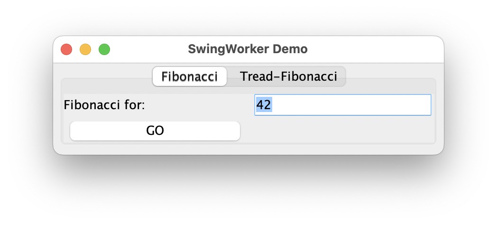
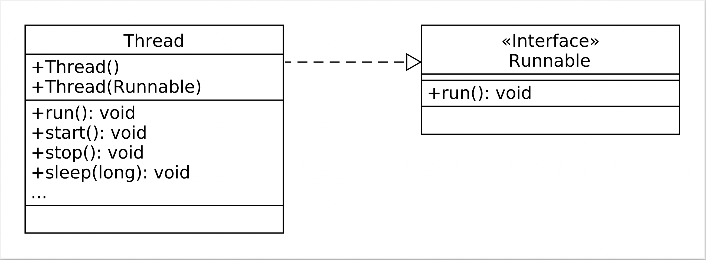

# Threads: Einführung in die nebenläufige Programmierung mit Threads

> [!IMPORTANT]
>
> <details open>
>
> <summary><strong>🎯 TL;DR</strong></summary>
>
> Threads sind weitere Kontrollflussfäden, die von der Java-VM (oder
> (selten) vom OS) verwaltet werden. Damit ist sind sie
> leichtgewichtiger als der Start neuer Prozesse direkt auf
> Betriebssystem-Ebene.
>
> Beim Start eines Java-Programms wird die `main()`-Methode automatisch
> in einem (Haupt-) Thread ausgeführt. Alle Anweisungen in einem Thread
> werden sequentiell ausgeführt.
>
> Um einen neuen Thread zu erzeugen, leitet man von `Thread` ab oder
> implementiert das Interface `Runnable`. Von diesen eigenen Klassen
> kann man wie üblich ein neues Objekt anlegen. Die Methode `run()`
> enthält dabei den im Thread auszuführenden Code. Um einen Thread als
> neuen parallelen Kontrollfluss zu starten, muss man die geerbte
> Methode `start()` auf dem Objekt aufrufen. Im Fall der Implementierung
> von `Runnable` muss man das Objekt zuvor noch in den Konstruktor von
> `Thread` stecken und so ein neues `Thread`-Objekt erzeugen, auf dem
> man dann `start()` aufrufen kann.
>
> Threads haben einen Lebenszyklus: Nach dem Erzeugen der Objekte mit
> `new` wird der Thread noch nicht ausgeführt. Durch den Aufruf der
> Methode `start()` gelangt der Thread in einen Zustand
> “ausführungsbereit”. Sobald er vom Scheduler eine Zeitscheibe
> zugeteilt bekommt, wechselt er in den Zustand “rechnend”. Von hier
> kann er nach Ablauf der Zeitscheibe durch den Scheduler wieder nach
> “ausführungsbereit” zurück überführt werden. Dieses Wechselspiel
> passiert automatisch und i.d.R. schnell, so dass selbst auf Maschinen
> mit nur einem Prozessor/Kern der Eindruck einer parallelen
> Verarbeitung entsteht. Nach Abarbeitung der `run()`-Methode wird der
> Thread beendet und kann nicht wieder neu gestartet werden. Bei Zugriff
> auf gesperrte Ressourcen oder durch `sleep()` oder `join()` kann ein
> Thread blockiert werden. Aus diesem Zustand gelangt er durch
> Interrupts oder nach Ablauf der Schlafzeit oder durch `notify` wieder
> zurück nach “ausführungsbereit”.
>
> Die Thread-Objekte sind normale Java-Objekte. Man kann hier Attribute
> und Methoden haben und diese entsprechend zugreifen/aufrufen. Das
> klappt auch, wenn der Thread noch nicht gestartet wurde oder bereits
> abgearbeitet wurde.
> </details>

> [!TIP]
>
> <details open>
>
> <summary><strong>🎦 Videos</strong></summary>
>
> - [VL Threads Intro](https://youtu.be/ClfXbNPRl_8)
> - [Demo Threads Intro: Erzeugen von
>   Threads](https://youtu.be/zcVqFAx5D0E)
> - [Demo Threads Intro: Arbeiten mit Threads
>   (`join()`)](https://youtu.be/lQ_JSHBGhdU)
>
> </details>

## 42

<picture><source media="(prefers-color-scheme: light)" srcset="images/screenshot_swingworker_light.png"><source media="(prefers-color-scheme: dark)" srcset="images/screenshot_swingworker_dark.png"></picture>

<p align="right"><a href="https://github.com/Programmiermethoden-CampusMinden/Prog2-Lecture/blob/master/lecture/java-classic/src/misc/SwingWorkerDemo.java">Demo: misc.SwingWorkerDemo (GUI ausprobieren)</a></p>

## Einführung in nebenläufige Programmierung

### Traditionelle Programmierung

- Aufruf einer Methode verlagert Kontrollfluss in diese Methode
- Code hinter Methodenaufruf wird erst **nach Beendigung** der Methode
  ausgeführt

``` java
public class Traditional {
    public static void main(String... args) {
        Traditional x = new Traditional();

        System.out.println("main(): vor run()");
        x.run();
        System.out.println("main(): nach run()");
    }

    public void run() {
        IntStream.range(0, 10).mapToObj(i -> "in run()").forEach(System.out::println);
    }
}
```

<p align="right"><a href="https://github.com/Programmiermethoden-CampusMinden/Prog2-Lecture/blob/master/lecture/java-classic/src/intro/Traditional.java">Demo: intro.Traditional</a></p>

### Nebenläufige Programmierung

- Erzeugung eines neuen Kontrollflussfadens (Thread)
  - **Läuft (quasi-) parallel zu bisherigem Kontrollfluss**
- Threads können unabhängig von einander arbeiten
- Zustandsverwaltung durch Java-VM (oder Unterstützung durch
  Betriebssystem)
  - Aufruf einer bestimmten Methode erzeugt neuen Kontrollflussfaden
  - Der neue Thread arbeitet “parallel” zum bisherigen Thread
  - Kontrolle kehrt sofort wieder zurück: Code hinter dem Methodenaufruf
    wird ausgeführt ohne auf die Beendigung der aufgerufenen Methode zu
    warten
  - Verteilung der Threads auf die vorhandenen Prozessorkerne abhängig
    von der Java-VM

``` java
public class Threaded extends Thread {
    public static void main(String... args) {
        Threaded x = new Threaded();

        System.out.println("main(): vor run()");
        x.start();
        System.out.println("main(): nach run()");
    }

    @Override
    public void run() {
        IntStream.range(0, 10).mapToObj(i -> "in run()").forEach(System.out::println);
    }
}
```

<p align="right"><a href="https://github.com/Programmiermethoden-CampusMinden/Prog2-Lecture/blob/master/lecture/java-classic/src/intro/Threaded.java">Demo: intro.Threaded</a></p>

## Erzeugen von Threads

- Ableiten von `Thread` oder Implementierung von `Runnable`

  <picture><source media="(prefers-color-scheme: light)" srcset="images/ThreadRunnable_light.png"><source media="(prefers-color-scheme: dark)" srcset="images/ThreadRunnable_dark.png"></picture>

- Methode `run()` implementieren, aber nicht aufrufen

- Methode `start()` aufrufen, aber (i.d.R.) nicht implementieren

<p align="right"><a href="https://github.com/Programmiermethoden-CampusMinden/Prog2-Lecture/blob/master/lecture/java-classic/src/creation/">Demo: creation.*</a></p>

### Ableiten von *Thread*

- `start()` startet den Thread und sorgt für Ausführung von `run()`
- `start()` nur einmal aufrufen

### Implementierung von *Runnable*

- Ebenfalls `run()` implementieren
- Neues `Thread`-Objekt erzeugen, Konstruktor das eigene Runnable
  übergeben
- Für Thread-Objekt die Methode `start()` aufrufen
  - Startet den Thread (das Runnable) und sorgt für Ausführung von
    `run()`

Vorteil von `Runnable`: Ist ein Interface, d.h. man kann noch von einer
anderen Klasse erben

## Zustandsmodell von Threads (vereinfacht)

Threads haben einen Lebenszyklus: Nach dem Erzeugen der Objekte mit
`new` wird der Thread noch nicht ausgeführt. Er ist sozusagen in einem
Zustand “erzeugt”. Man kann bereits mit dem Objekt interagieren, also
auf Attribute zugreifen und Methoden aufrufen.

Durch den Aufruf der Methode `start()` gelangt der Thread in einen
Zustand “ausführungsbereit”, er läuft also aus Nutzersicht. Allerdings
hat er noch keine Ressourcen zugeteilt (CPU, …), so dass er tatsächlich
noch nicht rechnet. Sobald er vom Scheduler eine Zeitscheibe zugeteilt
bekommt, wechselt er in den Zustand “rechnend” und führt den Inhalt der
`run()`-Methode aus. Von hier kann er nach Ablauf der Zeitscheibe durch
den Scheduler wieder nach “ausführungsbereit” zurück überführt werden.
Dieses Wechselspiel passiert automatisch und i.d.R. schnell, so dass
selbst auf Maschinen mit nur einem Prozessor/Kern der Eindruck einer
parallelen Verarbeitung entsteht.

Nach der Abarbeitung der `run()`-Methode oder bei einer nicht gefangenen
Exception wird der Thread beendet und kann nicht wieder neu gestartet
werden. Auch wenn der Thread abgelaufen ist, kann man mit dem Objekt wie
üblich interagieren (nur eben nicht mehr parallel).

Bei Zugriff auf gesperrte Ressourcen oder durch Aufrufe von Methoden wie
`sleep()` oder `join()` kann ein Thread blockiert werden. Hier führt der
Thread nichts aus, bekommt durch den Scheduler aber auch keine neue
Zeitscheibe zugewiesen. Aus diesem Zustand gelangt der Thread wieder
heraus, etwa durch Interrupts (Aufruf der Methode `interrupt()` auf dem
Thread-Objekt) oder nach Ablauf der Schlafzeit (in `sleep()`) oder durch
ein `notify`, und wird wieder zurück nach “ausführungsbereit” versetzt
und wartet auf die Zuteilung einer Zeitscheibe durch den Scheduler.

Sie finden in ([Boles 2008, 5.2](#ref-Boles2008) “Thread-Zustände”) eine
schöne ausführliche Darstellung.

### Threads können wie normale Objekte kommunizieren

- Zugriff auf (`public`) Attribute (oder eben über Methoden)
- Aufruf von Methoden

### Threads können noch mehr

- Eine Zeitlang schlafen: `Thread.sleep(<duration_ms>)`

  - Statische Methode der Klasse `Thread` (Klassenmethode)
  - Aufrufender Thread wird bis zum Ablauf der Zeit oder bis zum Aufruf
    der `interrupt()`-Methode des Threads blockiert
  - “Moderne” Alternative: `TimeUnit`, beispielsweise
    `TimeUnit.SECONDS.sleep( 2 );`

- Prozessor abgeben und hinten in Warteschlange einreihen: `yield()`

- Andere Threads stören: `otherThreadObj.interrupt()`

  - Die Methoden `sleep()`, `wait()` und `join()` im empfangenden Thread
    `otherThreadObj` lösen eine `InterruptedException` aus, wenn sie
    durch die Methode `interrupt()` unterbrochen werden. Das heißt,
    `interrupt()` beendet diese Methoden mit der Ausnahme.
  - Empfangender Thread verlässt ggf. den Zustand “blockiert” und
    wechselt in den Zustand “ausführungsbereit”

- Warten auf das Ende anderer Threads: `otherThreadObj.join()`

  - Ausführender Thread wird blockiert (also nicht `otherThreadObj`!)
  - Blockade des Aufrufers wird beendet, wenn der andere Thread
    (`otherThreadObj`) beendet wird.

*Hinweis:* Ein Thread wird beendet, wenn

- die `run()`-Methode normal endet, oder
- die `run()`-Methode durch eine nicht gefangene Exception beendet wird,
  oder
- von außen die Methode `stop()` aufgerufen wird (Achtung: Deprecated!
  Einen richtigen Ersatz gibt es aber auch nicht.).

*Hinweis:* Die Methoden `wait()`, `notify()`/`notifyAll()` und die
“`synchronized`-Sperre” werden in der Sitzung [“Threads:
Synchronisation”](threads-synchronisation.md) besprochen.

<p align="right"><a href="https://github.com/Programmiermethoden-CampusMinden/Prog2-Lecture/blob/master/lecture/java-classic/src/intro/Join.java">Demo: intro.Join</a></p>

## Wrap-Up

Threads sind weitere Kontrollflussfäden, von Java-VM (oder (selten) von
OS) verwaltet

- Ableiten von `Thread` oder implementieren von `Runnable`
- Methode `run` enthält den auszuführenden Code
- Starten des Threads mit `start` (nie mit `run`!)

## 📖 Zum Nachlesen

- Ullenboom ([2021, Kap. 16](#ref-Ullenboom2021))
- Oracle Corporation ([2024](#ref-Java-SE-Tutorial))
- Boles ([2008](#ref-Boles2008))

> [!NOTE]
>
> <details>
>
> <summary><strong>✅ Lernziele</strong></summary>
>
> - k2: Ich kenne den grundsätzlichen Unterschied zw. Threads und
>   Prozessen
> - k2: Ich kenne den Lebenszyklus von Threads
> - k3: Ich kann Threads erzeugen und starten
>
> </details>

------------------------------------------------------------------------

> [!NOTE]
>
> <details>
>
> <summary><strong>👀 Quellen</strong></summary>
>
> <div id="refs" class="references csl-bib-body hanging-indent">
>
> <div id="ref-Boles2008" class="csl-entry">
>
> Boles, D. 2008. *Parallele Programmierung spielend gelernt mit dem
> Java-Hamster-Modell*. Vieweg+Teubne.
> <http://www.boles.de/hamster/band3.html>.
>
> </div>
>
> <div id="ref-Java-SE-Tutorial" class="csl-entry">
>
> Oracle Corporation. 2024. „The Java Tutorials“.
> <https://docs.oracle.com/javase/tutorial/>.
>
> </div>
>
> <div id="ref-Ullenboom2021" class="csl-entry">
>
> Ullenboom, C. 2021. *Java ist auch eine Insel*. 16. Aufl.
> Rheinwerk-Verlag.
> <https://openbook.rheinwerk-verlag.de/javainsel/index.html>.
>
> </div>
>
> </div>
>
> </details>

------------------------------------------------------------------------


Unless otherwise noted, this work is licensed under CC BY-SA 4.0.

<blockquote><p><sup><sub><strong>Last modified:</strong> 95a02cf (markdown: switch to leaner yaml header (#1037), 2025-08-09)<br></sub></sup></p></blockquote>
