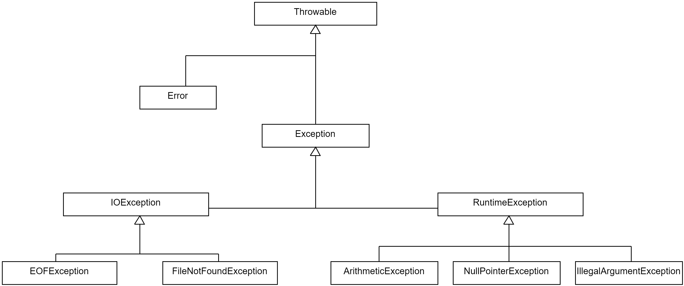

## Fehlerfälle in Java

```java
int div(int a, int b) {
    return a / b;
}


div(3, 0);
```

::: notes
**Problem**: Programm wird abstürzen, da durch '0' geteilt wird ...
:::


## Lösung?

```java
Optional<Integer> div(int a, int b) {
    if (b == 0) return Optional.empty();
    return Optional.of(a / b);
}


Optional<Integer> x = div(3, 0);
if (x.isPresent()) {
    // do something
} else {
    // do something else
}
```

::: notes
**Probleme**:

*   Da `int` nicht `null` sein kann, muss ein `Integer` Objekt erzeugt und zurückgegeben werden:
    Overhead wg. Auto-Boxing und -Unboxing!
*   Der Aufrufer muss auf `null` prüfen.
*   Es wird nicht kommuniziert, warum `null` zurückgegeben wird. Was ist das Problem?
*   Was ist, wenn `null` ein gültiger Rückgabewert sein soll?
:::


## Vererbungsstruktur _Throwable_

{web_width="80%"}

[[Hinweis: checked vs. unchecked]{.bsp}]{.slides}


::::::::: notes
### _Exception_ vs. _Error_

*   `Error`:
    *  Wird für Systemfehler verwendet (Betriebssystem, JVM, ...)
        *   `StackOverflowError`
        *   `OutOfMemoryError`
    *   Von einem Error kann man sich nicht erholen
    *   Sollten nicht behandelt werden

*   `Exception`:
    *   Ausnahmesituationen bei der Abarbeitung eines Programms
    *   Können "checked" oder "unchecked" sein
    *   Von Exceptions kann man sich erholen

### Unchecked vs. Checked Exceptions

*   "Checked" Exceptions:
    *   Für erwartbare Fehlerfälle, deren Ursprung nicht im Programm selbst liegt
        *   `FileNotFoundException`
        *   `IOException`
    *   Alle nicht von `RuntimeException` ableitende Exceptions
    *   Müssen entweder behandelt (`try`/`catch`) oder deklariert (`throws`) werden:
        Dies wird vom Compiler überprüft!

*   "Unchecked" Exceptions:
    *   Logische Programmierfehler ("Versagen" des Programmcodes)
        *   `IndexOutOfBoundException`
        *   `NullPointerException`
        *   `ArithmeticException`
        *   `IllegalArgumentException`
    *   Leiten von `RuntimeException` oder Unterklassen ab
    *   Müssen nicht deklariert oder behandelt werden

Beispiele checked Exception:
*   Es soll eine Abfrage an eine externe API geschickt werden. Diese ist aber aktuell
    nicht zu erreichen. "Erholung": Anfrage noch einmal schicken.
*   Es soll eine Datei geöffnet werden. Diese ist aber nicht unter dem angegebenen
    Pfad zu finden oder die Berechtigungen stimmen nicht. "Erholung": Aufrufer öffnet
    neuen File-Picker, um es noch einmal mit einer anderen Datei zu versuchen.

Beispiele unchecked Exception:
*   Eine `for`-Loop über ein Array ist falsch programmiert und will auf einen Index
    im Array zugreifen, der nicht existiert. Hier kann der Aufrufer nicht Sinnvolles
    tun, um sich von dieser Situation zu erholen.
*   Argumente oder Rückgabewerte einer Methode können `null` sein. Wenn man das nicht
    prüft, sondern einfach Methoden auf dem vermeintlichen Objekt aufruft, wird eine
    `NullPointerException` ausgelöst, die eine Unterklasse von `RuntimeException` ist
    und damit eine unchecked Exception. Auch hier handelt es sich um einen Fehler in
    der Programmlogik, von dem sich der Aufrufer nicht sinnvoll erholen kann.
:::::::::


## _Throws_

```java
int div(int a, int b) throws ArithmeticException {
    return a / b;
}
```

::: notes
Alternativ:
:::

\bigskip

```java
int div(int a, int b) throws IllegalArgumentException {
    if (b == 0) throw new IllegalArgumentException("Can't divide by zero");
    return a / b;
}
```

::: notes
Exception können an an den Aufrufer weitergeleitet werden oder selbst geworfen werden.

Wenn wie im ersten Beispiel bei einer Operation eine Exception entsteht und nicht
gefangen wird, dann wird sie automatisch an den Aufrufer weitergeleitet. Dies wird
über die `throws`-Klausel deutlich gemacht (Keyword `throws` plus den/die Namen der
Exception(s), angefügt an die Methodensignatur). Bei unchecked Exceptions _kann_ man
das tun, bei checked Exceptions _muss_ man dies tun.

Wenn man wie im zweiten Beispiel selbst eine neue Exception werfen will, erzeugt man
mit `new` ein neues Objekt der gewünschten Exception und "wirft" diese mit `throw`.
Auch diese Exception kann man dann entweder selbst fangen und bearbeiten (siehe nächste
Folie) oder an den Aufrufer weiterleiten und dies dann entsprechend über die
`throws`-Klausel deklarieren: nicht gefangene checked Exceptions _müssen_ deklariert
werden, nicht gefangene unchecked Exceptions _können_ deklariert werden.

Wenn mehrere Exceptions an den Aufrufer weitergeleitet werden, werden sie in der
`throws`-Klausel mit Komma getrennt: `throws Exception1, Exception2, Exception3`.

**Anmerkung**: In beiden obigen Beispielen wurde zur Verdeutlichung, dass die Methode
`div()` eine Exception wirft, diese per `throws`-Klausel deklariert. Da es sich bei
den beiden Beispielen aber jeweils um **unchecked Exceptions** handelt, ist dies im
obigen Beispiel _nicht notwendig_. Der Aufrufer _muss_ auch nicht ein passendes
Exception-Handling einsetzen!

Wenn wir stattdessen eine **checked Exception** werfen würden oder in `div()` eine
Methode aufrufen würden, die eine checked Exception deklariert hat, _muss_ diese
checked Exception entweder in `div()` gefangen und bearbeitet werden oder aber per
`throws`-Klausel deklariert werden. Im letzteren Fall _muss_ dann der Aufrufer analog
damit umgehen (fangen oder selbst auch deklarieren). **Dies wird vom Compiler geprüft!**
:::

[[Hinweis: throws und checked vs. unchecked]{.bsp}]{.slides}


## _Try_-_Catch_

```java
int a = getUserInput();
int b = getUserInput();

try {
    div(a, b);
} catch (IllegalArgumentException e) {
    e.printStackTrace(); // Wird im Fehlerfall aufgerufen
}

// hier geht es normal weiter
```

::: notes
*   Im `try` Block wird der Code ausgeführt, der einen Fehler werfen könnte.
*   Mit `catch` kann eine Exception gefangen und im `catch` Block behandelt werden.

**Anmerkung**: Das bloße Ausgeben des Stacktrace via `e.printStackTrace()` ist
noch **kein sinnvolles Exception-Handling**! Hier sollte auf die jeweilige Situation
eingegangen werden und versucht werden, den Fehler zu beheben oder dem Aufrufer
geeignet zu melden!
:::


## _Try_und mehrstufiges _Catch_

```java
try {
    someMethod(a, b, c);
} catch (IllegalArgumentException iae) {
    iae.printStackTrace();
} catch (FileNotFoundException | NullPointerException e) {
    e.printStackTrace();
}
```

::: notes
Eine im `try`-Block auftretende Exception wird der Reihe nach mit den `catch`-Blöcken
gematcht (vergleichbar mit `switch case`).

**Wichtig**: Dabei muss die Vererbungshierarchie beachtet werden. Die spezialisierteste
Klasse muss ganz oben stehen, die allgemeinste Klasse als letztes. Sonst wird eine
Exception u.U. zu früh in einem nicht dafür gedachten `catch`-Zweig aufgefangen.

**Wichtig**: Wenn eine Exception nicht durch die `catch`-Zweige aufgefangen wird, dann
wird sie an den Aufrufer weiter geleitet. Im Beispiel würde eine `IOException` nicht durch
die `catch`-Zweige gefangen (`IllegalArgumentException` und `NullPointerException` sind
im falschen Vererbungszweig, und `FileNotFoundException` ist spezieller als `IOException`)
und entsprechend an den Aufrufer weiter gereicht. Da es sich obendrein um eine checked
Exception handelt, müsste man diese per `throws IOException` an der Methode deklarieren.
:::

[[Hinweis: catch und Vererbungshierarchie]{.bsp}]{.slides}


## _Finally_

```java
Scanner myScanner = new Scanner(System.in);

try {
    return 5 / myScanner.nextInt();
} catch (InputMismatchException ime) {
    ime.printStackTrace();
} finally {
    // wird immer aufgerufen
    myScanner.close();
}
```

::: notes
Der `finally` Block wird sowohl im Fehlerfall als auch im Normalfall aufgerufen. Dies
wird beispielsweise für Aufräumarbeiten genutzt, etwa zum Schließen von Verbindungen
oder Input-Streams.
:::


## _Try_-with-Resources

```java
try (Scanner myScanner = new Scanner(System.in)) {
    return 5 / myScanner.nextInt();
} catch (InputMismatchException ime) {
    ime.printStackTrace();
}
```

::: notes
Im `try`-Statement können Ressourcen deklariert werden, die am Ende sicher geschlossen
werden. Diese Ressourcen müssen `java.io.Closeable` implementieren.
:::


## Eigene Exceptions

```java
// Checked Exception
public class MyCheckedException extends Exception {
    public MyCheckedException(String errorMessage) {
        super(errorMessage);
    }
}
```

\bigskip

```java
// Unchecked Exception
public class MyUncheckedException extends RuntimeException {
    public MyUncheckedException(String errorMessage) {
        super(errorMessage);
    }
}
```

::: notes
Eigene Exceptions können durch Spezialisierung anderer Exception-Klassen realisiert
werden. Dabei kann man direkt von `Exception` oder `RuntimeException` ableiten oder
bei Bedarf von spezialisierteren Exception-Klassen.

Wenn die eigene Exception in der Vererbungshierarchie unter `RuntimeException` steht,
handelt es sich um eine _unchecked Exception_, sonst um eine _checked Exception_.

In der Benutzung (werfen, fangen, deklarieren) verhalten sich eigene Exception-Klassen
wie die Exceptions aus dem JDK.
:::


## Stilfrage: Wie viel Code im _Try_?

```java
int getFirstLineAsInt(String pathToFile) {
    FileReader fileReader = new FileReader(pathToFile);
    BufferedReader bufferedReader = new BufferedReader(fileReader);
    String firstLine = bufferedReader.readLine();

    return Integer.parseInt(firstLine);
}
```

[Zeigen: exceptions.HowMuchTry]{.bsp href="https://github.com/Programmiermethoden-CampusMinden/PM-Lecture/blob/master/markdown/java-jvm/src/exceptions/HowMuchTry.java"}


::: notes
Hier lassen sich verschiedene "Ausbaustufen" unterscheiden.

### Handling an den Aufrufer übergeben

```java
int getFirstLineAsIntV1(String pathToFile) throws FileNotFoundException, IOException {
    FileReader fileReader = new FileReader(pathToFile);
    BufferedReader bufferedReader = new BufferedReader(fileReader);
    String firstLine = bufferedReader.readLine();

    return Integer.parseInt(firstLine);
}
```

Der Aufrufer hat den Pfad als String übergeben und ist vermutlich in der Lage, auf
Probleme mit dem Pfad sinnvoll zu reagieren. Also könnte man in der Methode selbst
auf ein `try`/`catch` verzichten und stattdessen die `FileNotFoundException` (vom
`FileReader`) und die `IOException` (vom `bufferedReader.readLine()`) per `throws`
deklarieren.

_Anmerkung_: Da `FileNotFoundException` eine Spezialisierung von `IOException` ist,
reicht es aus, lediglich die `IOException` zu deklarieren.

### Jede Exception einzeln fangen und bearbeiten

```java
int getFirstLineAsIntV2(String pathToFile) {
    FileReader fileReader = null;
    try {
        fileReader = new FileReader(pathToFile);
    } catch (FileNotFoundException fnfe) {
        fnfe.printStackTrace(); // Datei nicht gefunden
    }

    BufferedReader bufferedReader = new BufferedReader(fileReader);

    String firstLine = null;
    try {
        firstLine = bufferedReader.readLine();
    } catch (IOException ioe) {
        ioe.printStackTrace(); // Datei kann nicht gelesen werden
    }

    try {
        return Integer.parseInt(firstLine);
    } catch (NumberFormatException nfe) {
        nfe.printStackTrace(); // Das war wohl kein Integer
    }

    return 0;
}
```

In dieser Variante wird jede Operation, die eine Exception werfen kann, separat in
ein `try`/`catch` verpackt und jeweils separat auf den möglichen Fehler reagiert.

Dadurch kann man die Fehler sehr einfach dem jeweiligen Statement zuordnen.

Allerdings muss man nun mit Behelfsinitialisierungen arbeiten und der Code wird sehr
in die Länge gezogen und man erkennt die eigentlichen funktionalen Zusammenhänge nur
noch schwer.

_Anmerkung_: Das "Behandeln" der Exceptions ist im obigen Beispiel kein gutes Beispiel
für das Behandeln von Exceptions. Einfach nur einen Stacktrace zu printen und weiter
zu machen, als ob nichts passiert wäre, ist **kein sinnvolles Exception-Handling**.
Wenn Sie solchen Code schreiben oder sehen, ist das ein Anzeichen, dass auf dieser Ebene
nicht sinnvoll mit dem Fehler umgegangen werden kann und dass man ihn besser an den
Aufrufer weiter reichen sollte (siehe nächste Folie).

### Funktionaler Teil in gemeinsames _Try_ und mehrstufiges _Catch_

```java
int getFirstLineAsIntV3(String pathToFile) {
    try {
        FileReader fileReader = new FileReader(pathToFile);
        BufferedReader bufferedReader = new BufferedReader(fileReader);
        String firstLine = bufferedReader.readLine();
        return Integer.parseInt(firstLine);
    } catch (FileNotFoundException fnfe) {
        fnfe.printStackTrace(); // Datei nicht gefunden
    } catch (IOException ioe) {
        ioe.printStackTrace(); // Datei kann nicht gelesen werden
    } catch (NumberFormatException nfe) {
        nfe.printStackTrace(); // Das war wohl kein Integer
    }

    return 0;
}
```

Hier wurde der eigentliche funktionale Kern der Methode in ein gemeinsames `try`/`catch`
verpackt und mit einem mehrstufigen `catch` auf die einzelnen Fehler reagiert. Durch die
Art der Exceptions sieht man immer noch, wo der Fehler herkommt. Zusätzlich wird die
eigentliche Funktionalität so leichter erkennbar.

_Anmerkung_: Auch hier ist das gezeigte Exception-Handling kein gutes Beispiel. Entweder
man macht hier sinnvollere Dinge, oder man überlässt dem Aufrufer die Reaktion auf den
Fehler.
:::


## Stilfrage: Wo fange ich die Exception?

```java
private static void methode1(int x) throws IOException {
    JFileChooser fc = new JFileChooser();
    fc.showDialog(null, "ok");
    methode2(fc.getSelectedFile().toString(), x, x * 2);
}

private static void methode2(String path, int x, int y) throws IOException {
    FileWriter fw = new FileWriter(path);
    BufferedWriter bw = new BufferedWriter(fw);
    bw.write("X:" + x + " Y: " + y);
}

public static void main(String... args) {
    try {
        methode1(42);
    } catch (IOException ioe) {
        ioe.printStackTrace();
    }
}
```

::: notes
Prinzipiell steht es einem frei, wo man eine Exception fängt und behandelt. Wenn im
`main()` eine nicht behandelte Exception auftritt (weiter nach oben geleitet wird),
wird das Programm mit einem Fehler beendet.

Letztlich scheint es eine gute Idee zu sein, eine Exception so nah wie möglich am
Ursprung der Fehlerursache zu behandeln. Man sollte sich dabei die Frage stellen: Wo
kann ich sinnvoll auf den Fehler reagieren?
:::


## Stilfrage: Wann checked, wann unchecked

### "Checked" Exceptions

*   Für erwartbare Fehlerfälle, deren Ursprung nicht im Programm selbst liegt
*   Aufrufer kann sich von der Exception erholen

\bigskip

### "Unchecked" Exceptions

*   Logische Programmierfehler ("Versagen" des Programmcodes)
*   Aufrufer kann sich von der Exception vermutlich nicht erholen

::: notes
Vergleiche ["Unchecked Exceptions — The Controversy"](https://dev.java/learn/exceptions/unchecked-exception-controversy/).
:::


## Wrap-Up

*   `Error` und `Exception`: System vs. Programm
*   Checked und unchecked Exceptions: `Exception` vs. `RuntimeException`

\smallskip

*   `try`: Versuche Code auszuführen
*   `catch`: Verhalten im Fehlerfall
*   `finally`: Verhalten im Erfolgs- und Fehlerfall

\smallskip

*   `throw`: Wirft eine Exception
*   `throws`: Deklariert eine Exception an Methode

\smallskip

*   Eigene Exceptions durch Ableiten von anderen Exceptions
    [(werden je nach Vererbungshierarchie automatisch checked oder unchecked)]{.notes}
