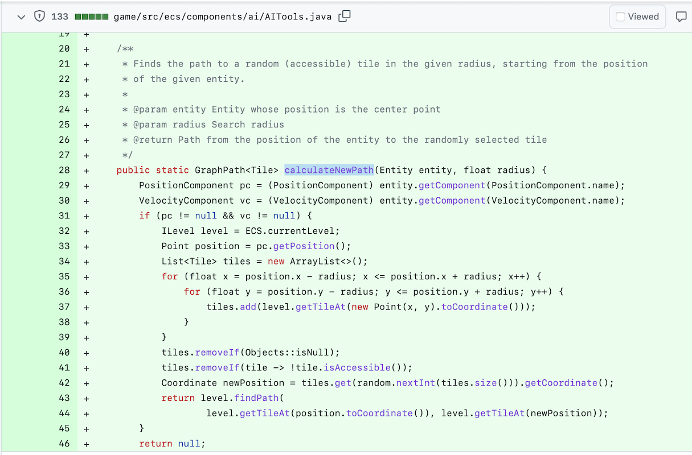

## Motivation

```java
public class LSF {
    private Set<Studi> sl;

    public Studi getBestStudi() {
        if (sl == null) return null;  // Fehler: Es gibt noch keine Sammlung

        Studi best = null;
        for (Studi s : sl) {
            if (best == null) best = s;
            if (best.credits() < s.credits()) best = s;
        }
        return best;
    }
}

public static void main(String... args) {
    LSF lsf = new LSF();

    Studi best = lsf.getBestStudi();
    if (best != null) {
        String name = best.name();
        if (name != null) {
            // mach was mit dem Namen ...
        }
    }
}
```

::: notes
### Problem: `null` wird an (zu) vielen Stellen genutzt

*   Es gibt keinen Wert ("not found")
*   Felder wurden (noch) nicht initialisiert
*   Es ist ein Problem oder etwas Unerwartetes aufgetreten

=> Parameter und Rückgabewerte müssen stets auf `null` geprüft werden
(oder Annotationen wie `@NotNull` eingesetzt werden ...)

### Lösung

*   `Optional<T>` für Rückgabewerte, die "kein Wert vorhanden" mit einschließen
    (statt `null` bei Abwesenheit von Werten)
*   `@NotNull`/`@Nullable` für Parameter einsetzen (oder separate Prüfung)
*   Exceptions werfen in Fällen, wo ein Problem aufgetreten ist

### Anmerkungen

*   Verwendung von `null` auf Attribut-Ebene (Klassen-interne Verwendung) ist okay!
*   `Optional<T>` ist **kein** Ersatz für `null`-Checks!
*   `null` ist **kein** Ersatz für vernünftiges Error-Handling!
    Das häufig zu beobachtende "Irgendwas Unerwartetes ist passiert, hier ist `null`"
    ist ein **Anti-Pattern**!

### Beispiel aus der Praxis im PM-Dungeon

Schauen Sie sich einmal das Review zu den `ecs.components.ai.AITools` in
https://github.com/Dungeon-CampusMinden/Dungeon/pull/128#pullrequestreview-1254025874
an.



Die Methode `AITools#calculateNewPath` soll in der Umgebung einer als Parameter
übergebenen Entität nach einem Feld (`Tile`) suchen, welches für die Entität
betretbar ist und einen Pfad von der Position der Entität zu diesem Feld an den
Aufrufer zurückliefern.

Zunächst wird in der Entität nach einer `PositionComponent` und einer `VelocityComponent`
gesucht. Wenn es (eine) diese(r) Components nicht in der Entität gibt, wird der Wert
`null` an den Aufrufer von `AITools#calculateNewPath` zurückgeliefert.
(_Anmerkung_: Interessanterweise wird in der Methode nicht mit der `VelocityComponent`
gearbeitet.)

Dann wird in der `PositionComponent` die Position der Entität im aktuellen Level
abgerufen. In einer Schleife werden alle Felder im gegebenen Radius in eine Liste
gespeichert.
(_Anmerkung_: Da dies über die `float`-Werte passiert und nicht über die Feld-Indizes
wird ein `Tile` u.U. recht oft in der Liste abgelegt. Können Sie sich hier einfache
Verbesserungen überlegen?)

Da `level.getTileAt()` offenbar als Antwort auch `null` zurückliefern kann, werden
nun zunächst per `tiles.removeIf(Objects::isNull);` all diese `null`-Werte wieder aus
der Liste entfernt. Danach erfolgt die Prüfung, ob die verbleibenden Felder betretbar
sind und nicht-betretbare Felder werden entfernt.

Aus den verbleibenden (betretbaren) Feldern in der Liste wird nun eines zufällig
ausgewählt und per `level.findPath()` ein Pfad von der Position der Entität zu diesem
Feld berechnet und zurückgeliefert.
(_Anmerkung_: Hier wird ein zufälliges Tile in der Liste der umgebenden Felder gewählt,
von diesem die Koordinaten bestimmt, und dann noch einmal aus dem Level das dazugehörige
Feld geholt - dabei hatte man die Referenz auf das Feld bereits in der Liste. Können
Sie sich hier eine einfache Verbesserung überlegen?)

Zusammengefasst:

*   Die als Parameter `entity` übergebene Referenz darf offenbar _nicht_ `null` sein.
    Die ersten beiden Statements in der Methode rufen auf dieser Referenz Methoden
    auf, was bei einer `null`-Referenz zu einer `NullPointer`-Exception führen
    würde. Hier wäre `null` ein Fehlerzustand.
*   `entity.getComponent()` kann offenbar `null` zurückliefern, wenn die gesuchte
    Component nicht vorhanden ist. Hier wird `null` als "kein Wert vorhanden"
    genutzt, was dann nachfolgende `null`-Checks notwendig macht.
*   Wenn es die gewünschten Components nicht gibt, wird dem Aufrufer der Methode
    `null` zurückgeliefert. Hier ist nicht ganz klar, ob das einfach nur "kein
    Wert vorhanden" ist oder eigentlich ein Fehlerzustand?
*   `level.getTileAt()` kann offenbar `null` zurückliefern, wenn kein Feld an der
    Position vorhanden ist. Hier wird `null` wieder als "kein Wert vorhanden"
    genutzt, was dann nachfolgende `null`-Checks notwendig macht (Entfernen aller
    `null`-Referenzen aus der Liste).
*   `level.findPath()` kann auch wieder `null` zurückliefern, wenn kein Pfad berechnet
    werden konnte. Hier ist wieder nicht ganz klar, ob das einfach nur "kein Wert
    vorhanden" ist oder eigentlich ein Fehlerzustand? Man könnte beispielsweise in
    diesem Fall ein anderes Feld probieren?

Der Aufrufer bekommt also eine `NullPointer`-Exception, wenn der übergebene Parameter
`entity` nicht vorhanden ist oder den Wert `null`, wenn in der Methode etwas schief
lief oder schlicht kein Pfad berechnet werden konnte oder tatsächlich einen Pfad.
Damit wird der Aufrufer gezwungen, den Rückgabewert vor der Verwendung zu untersuchen.

**Allein in dieser einen kurzen Methode macht `null` so viele extra Prüfungen notwendig
und den Code dadurch schwerer lesbar und fehleranfälliger! `null` wird als (unvollständige)
Initialisierung und als Rückgabewert und für den Fehlerfall genutzt, zusätzlich ist
die Semantik von `null` nicht immer klar.**
(_Anmerkung_: Der Gebrauch von `null` hat nicht wirklich etwas mit "der Natur eines ECS"
zu tun. Die Methode wurde mittlerweile komplett überarbeitet und ist in der hier gezeigten
Form glücklicherweise nicht mehr zu finden.)

Entsprechend hat sich in diesem [Review](https://github.com/Dungeon-CampusMinden/Dungeon/pull/128#pullrequestreview-1254025874)
die nachfolgende Diskussion ergeben:


:::


## Erzeugen von _Optional_-Objekten

Konstruktor ist `private` ...

*   "Kein Wert": `Optional.empty()`
*   Verpacken eines non-`null` Elements: `Optional.of()` \newline
    (`NullPointerException` wenn Argument `null`!)

\bigskip

*   Verpacken eines "unsicheren"/beliebigen Elements: `Optional.ofNullable()`
    *   Liefert verpacktes Element, oder
    *   `Optional.empty()`, falls Element `null` war

::: notes
Es sollte in der Praxis eigentlich nur wenige Fälle geben, wo ein Aufruf von
`Optional.of()` sinnvoll ist. Ebenso ist `Optional.empty()` nur selten sinnvoll.

Stattdessen sollte stets `Optional.ofNullable()` verwendet werden.
:::

\vfill

**`null` kann nicht nicht in `Optional<T>` verpackt werden!**
[(Das wäre dann eben `Optional.empty()`.)]{.notes}


## LSF liefert jetzt _Optional_ zurück

```java
public class LSF {
    private Set<Studi> sl;

    public Optional<Studi> getBestStudi() throws NullPointerException {
        // Fehler: Es gibt noch keine Sammlung
        if (sl == null) throw new NullPointerException("There ain't any collection");

        Studi best = null;
        for (Studi s : sl) {
            if (best == null) best = s;
            if (best.credits() < s.credits()) best = s;
        }

        // Entweder Optional.empty() (wenn best==null) oder Optional.of(best) sonst
        return Optional.ofNullable(best);
    }
}
```

::: notes
Das Beispiel soll verdeutlichen, dass man im Fehlerfall nicht einfach `null` oder
`Optional.empty()` zurückliefern soll, sondern eine passende Exception werfen soll.

Wenn die Liste aber leer ist, stellt dies keinen Fehler dar! Es handelt sich um den
Fall "kein Wert vorhanden". In diesem Fall wird statt `null` nun ein `Optional.empty()`
zurückgeliefert, also ein Objekt, auf dem der Aufrufer die üblichen Methoden aufrufen
kann.
:::


## Zugriff auf _Optional_-Objekte

::: notes
In der funktionalen Programmierung gibt es schon lange das Konzept von `Optional`,
in Haskell ist dies beispielsweise die Monade `Maybe`. Allerdings ist die Einbettung
in die Sprache von vornherein mit berücksichtigt worden, insbesondere kann man hier
sehr gut mit _Pattern Matching_ in der Funktionsdefinition auf den verpackten Inhalt
reagieren.

In Java gibt es die Methode `Optional#isEmpty()`, die einen Boolean zurückliefert und
prüft, ob es sich um ein leeres `Optional` handelt oder ob hier ein Wert "verpackt" ist.

Für den direkten Zugriff auf die Werte gibt es die Methoden `Optional#orElseThrow()`
und `Optional#orElse()`. Damit kann man auf den verpackten Wert zugreifen, oder es
wird eine Exception geworfen bzw. ein Ersatzwert geliefert.

Zusätzlich gibt es `Optional#isPresent()`, die als Parameter ein `java.util.function.Consumer`
erwartet, also ein funktionales Interface mit einer Methode `void accept(T)`, die das
Objekt verarbeitet.
:::


```java
Studi best;

// Testen und dann verwenden
if (!lsf.getBestStudi().isEmpty()) {
    best = lsf.getBestStudi().get();
    // mach was mit dem Studi ...
}

// Arbeite mit Consumer
lsf.getBestStudi().ifPresent(studi -> {
    // mach was mit dem Studi ...
});

// Studi oder Alternative (wenn Optional.empty())
best = lsf.getBestStudi().orElse(anne);

// Studi oder NoSuchElementException (wenn Optional.empty())
best = lsf.getBestStudi().orElseThrow();
```

::: notes
Es gibt noch eine Methode `get()`, die so verhält wie `orElseThrow()`. Da man diese
Methode vom Namen her schnell mit einem Getter verwechselt, ist sie mittlerweile
_deprecated_.

_Anmerkung_: Da `getBestStudi()` eine `NullPointerException` werfen kann, sollte der
Aufruf möglicherweise in ein `try/catch` verpackt werden. Dito für `orElseThrow()`.

[Beispiel: optional.traditional.Demo]{.ex href="https://github.com/Programmiermethoden-CampusMinden/Prog2-Lecture/blob/master/lecture/java-modern/src/optional/traditional/Demo.java"}
:::


## Einsatz mit Stream-API

```java
public class LSF {
    ...
    public Optional<Studi> getBestStudi() throws NullPointerException {
        if (sl == null) throw new NullPointerException("There ain't any collection");
        return sl.stream()
                 .sorted((s1, s2) -> s2.credits() - s1.credits())
                 .findFirst();
    }
}


public static void main(String... args) {
    ...
    String name = lsf.getBestStudi()
                     .map(Studi::name)
                     .orElseThrow();
}
```

::: notes
[Beispiel: optional.streams.Demo]{.ex href="https://github.com/Programmiermethoden-CampusMinden/Prog2-Lecture/blob/master/lecture/java-modern/src/optional/streams/Demo.java"}

Im Beispiel wird in `getBestStudi()` die Sammlung als Stream betrachtet, über die
Methode `sorted()` und den Lamda-Ausdruck für den `Comparator` sortiert ("falsch"
herum: absteigend in den Credits der Studis in der Sammlung), und `findFirst()`
ist die terminale Operation auf dem Stream, die ein `Optional<Studi>` zurückliefert:
entweder den Studi mit den meisten Credits (verpackt in `Optional<Studi>`) oder
`Optional.empty()`, wenn es überhaupt keine Studis in der Sammlung gab.

In `main()` wird dieses `Optional<Studi>` mit den Stream-Methoden von `Optional<T>`
bearbeitet, zunächst mit `Optional#map()`. Man braucht nicht selbst prüfen, ob das
von `getBestStudi()` erhaltene Objekt leer ist oder nicht, da dies von `Optional#map()`
erledigt wird: Es wendet die Methodenreferenz auf den verpackten Wert an (sofern
dieser vorhanden ist) und liefert damit den Namen des Studis als `Optional<String>`
verpackt zurück. Wenn es keinen Wert, also nur `Optional.empty()` von `getBestStudi()`
gab, dann ist der Rückgabewert von `Optional#map()` ein `Optional.empty()`. Wenn
der Name, also der Rückgabewert von `Studi::name`, `null` war, dann wird ebenfalls
ein `Optional.empty()` zurückgeliefert. Dadurch wirft `orElseThrow()` dann eine
`NoSuchElementException`. Man kann also direkt mit  dem String `name` weiterarbeiten
ohne extra `null`-Prüfung - allerdings will man noch ein Exception-Handling einbauen
(dies fehlt im obigen Beispiel aus Gründen der Übersicht) ...
:::


::: notes
## Weitere _Optionals_

Für die drei primitiven Datentypen `int`, `long` und `double` gibt es passende
Wrapper-Klassen von `Optional<T>`: `OptionalInt`, `OptionalLong` und `OptionalDouble`.

Diese verhalten sich analog zu `Optional<T>`, haben aber keine Methode `ofNullable()`,
da dies hier keinen Sinn ergeben würde: Die drei primitiven Datentypen repräsentieren
Werte - diese können nicht `null` sein.
:::


## Regeln für _Optional_

1.  Nutze `Optional` nur als Rückgabe für "kein Wert vorhanden"

    ::: notes
    `Optional` ist nicht als Ersatz für eine `null`-Prüfung o.ä.
    gedacht, sondern als Repräsentation, um auch ein "kein Wert
    vorhanden" zurückliefern zu können.
    :::

\bigskip

2.  Nutze nie `null` für eine `Optional`-Variable oder einen `Optional`-Rückgabewert

    ::: notes
    Wenn man ein `Optional` als Rückgabe bekommt, sollte das
    niemals selbst eine `null`-Referenz sein. Das macht das
    gesamte Konzept kaputt!

    Nutzen Sie stattdessen `Optional.empty()`.
    :::

3.  Nutze `Optional.ofNullable()` zum Erzeugen eines `Optional`

    ::: notes
    Diese Methode verhält sich "freundlich" und erzeugt automatisch
    ein `Optional.empty()`, wenn das Argument `null` ist. Es gibt
    also keinen Grund, dies mit einer Fallunterscheidung selbst
    erledigen zu wollen.

    Bevorzugen Sie `Optional.ofNullable()` vor einer manuellen
    Fallunterscheidung und dem entsprechenden Einsatz von
    `Optional.of()` und `Optional.empty()`.
    :::

4.  Erzeuge keine `Optional` als Ersatz für die Prüfung auf `null`

    ::: notes
    Wenn Sie auf `null` prüfen müssen, müssen Sie auf `null` prüfen.
    Der ersatzweise Einsatz von `Optional` macht es nur komplexer -
    prüfen müssen Sie hinterher ja immer noch.
    :::

5.  Nutze `Optional` nicht in Attributen, Methoden-Parametern und Sammlungen

    ::: notes
    Nutzen Sie `Optional` vor allem für Rückgabewerte.

    Attribute sollten immer direkt einen Wert haben oder `null`,
    analog Parameter von Methoden o.ä. ... Hier hilft `Optional`
    nicht, Sie müssten ja trotzdem eine `null`-Prüfung machen,
    nur eben dann über den `Optional`, wodurch dies komplexer und
    schlechter lesbar wird.

    Aus einem ähnlichen Grund sollten Sie auch in Sammlungen
    keine `Optional` speichern!
    :::

6.  Vermeide den direkten Zugriff (`ifPresent()`, `orElseThrow()` ...)

    ::: notes
    Der direkte Zugriff auf ein `Optional` entspricht dem
    Prüfen auf `null` und dann dem Auspacken. Dies ist nicht
    nur Overhead, sondern auch schlechter lesbar.

    Vermeiden Sie den direkten Zugriff und nutzen Sie `Optional`
    mit den Stream-Methoden. So ist dies von den Designern
    gedacht.
    :::


::: notes
## Interessante Links

*   ["Using Optionals"](https://dev.java/learn/api/streams/optionals/)
*   ["What You Might Not Know About Optional"](https://medium.com/javarevisited/what-you-might-not-know-about-optional-7238e3c05f63)
*   ["Experienced Developers Use These 7 Java Optional Tips to Remove Code Clutter"](https://medium.com/javarevisited/experienced-developers-use-these-7-java-optional-tips-to-remove-code-clutter-6e8b1a639861)
*   ["Code Smells: Null"](https://blog.jetbrains.com/idea/2017/08/code-smells-null/)
*   ["Class Optional"](https://docs.oracle.com/en/java/javase/17/docs/api/java.base/java/util/Optional.html)
:::


## Wrap-Up

`Optional` als Rückgabe für "kein Wert vorhanden"

\bigskip

*   `Optional.ofNullable()`: Erzeugen eines `Optional`
    *   Entweder Objekt "verpackt" (Argument != `null`)
    *   Oder `Optional.empty()` (Argument == `null`)
*   Prüfen mit `isEmpty()` und `ifPresent()`
*   Direkter Zugriff mit `ifPresent()`, `orElse()` und `orElseThrow()`
*   Stream-API: `map()`, `filter()`, `flatMap()`, ...

\bigskip

*   Attribute, Parameter und Sammlungen: nicht `Optional` nutzen
*   Kein Ersatz für `null`-Prüfung!

::: notes
Schöne Doku: ["Using Optionals"](https://dev.java/learn/api/streams/optionals/).
:::
