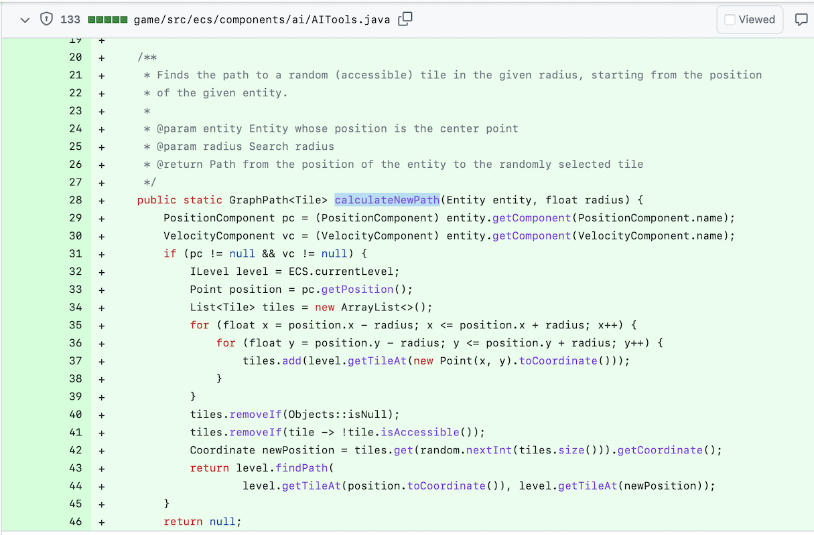

::: tldr
Häufig hat man in Methoden den Fall, dass es keinen Wert gibt, und man liefert dann
`null` als "kein Wert vorhanden" zurück. Dies führt dazu, dass die Aufrufer eine
entsprechende `null`-Prüfung für die Rückgabewerte durchführen müssen, bevor sie das
Ergebnis nutzen können.

`Optional` schließt elegant den Fall "kein Wert vorhanden" ein: Es kann mit der
Methode `Optional.ofNullable()` das Argument in ein Optional verpacken (Argument !=
`null`) oder ein `Optional.empty()` zurückliefern ("leeres" Optional, wenn Argument
\== `null`).

Man kann Optionals prüfen mit `isEmpty()` und `ifPresent()` und dann direkt mit
`ifPresent()`, `orElse()` und `orElseThrow()` auf den verpackten Wert zugreifen.
Besser ist aber der Zugriff über die stream-ähnlichen Methoden von `Optional`:
`map()`, `filter`, `flatMap()`, ... Dabei gibt es keine terminalen Operationen - es
handelt sich ja auch nicht um einen Stream, nur die Optik erinnert daran.

`Optional` ist vor allem für Rückgabewerte gedacht, die den Fall "kein Wert
vorhanden" einschließen sollen. Attribute, Parameter und Sammlungen sollten nicht
`Optional`-Referenzen speichern, sondern "richtige" (unverpackte) Werte (und eben
zur Not `null`). `Optional` ist kein Ersatz für `null`-Prüfung von
Methoden-Parametern (nutzen Sie hier beispielsweise passende Annotationen).
`Optional` ist auch kein Ersatz für vernünftiges Exception-Handling im Fall, dass
etwas Unerwartetes passiert ist. Liefern Sie **niemals** `null` zurück, wenn der
Rückgabetyp der Methode ein `Optional` ist!

`Result<E,R>` kapselt entweder ein erfolgreiches Ergebnis `R` oder einen Fehler `E`
und macht damit im Typ explizit sichtbar, dass und welche Fehler auftreten können.
Im Unterschied zu `Optional<T>`, das nur zwischen "Wert da" und "kein Wert"
unterscheidet, erlaubt `Result<E,R>` die genaue Modellierung und Weitergabe von
Fehlersituationen und lässt sich mit `map`/`flatMap` sehr elegant ähnlich wie ein
Stream verketten.
:::

::: youtube
Vorlesung \[[YT](https://youtu.be/HMbWJ_cvR8I)\],
\[[HSBI](https://www.hsbi.de/medienportal/video/pr2-fehlerbehandlung-mit-optional-und-result/b386ba6b8006b8415e668be4d0825480)\]

Demo:

-   Demo Optional \[[YT](https://youtu.be/3IdPRSQrPW4)\],
    \[[HSBI](https://www.hsbi.de/medienportal/video/pr2-demo-optional/cffe41b5b0fa0e7c51024d79eda0803f)\]
-   Diskussion `null` vs. `Optional` am Beispiel PM-Dungeon
    \[[YT](https://youtu.be/RbAEejDjjyI)\],
    \[[HSBI](https://www.hsbi.de/medienportal/video/pr2-diskussion-null-vs-optional-am-beispiel-pm-dungeon/e2af1b2b37efd4074248066d142448e2)\]
:::

# `Optional<T>` - "Vielleicht gibt es einen Wert"

``` java
public class LSF {
    private Set<Studi> sl;

    public Studi getBestStudi() {
        if (sl == null) return null;  // Fehler: Es gibt noch keine Sammlung
        Studi best = null;
        for (Studi s : sl) {
            if (best == null) best = s;
            if (best.credits() < s.credits()) best = s;
        }
        return best;
    }
}
public static void main(String... args) {
    LSF lsf = new LSF();  Studi best = lsf.getBestStudi();
    if (best != null) {
        String name = best.name();
        if (name != null) { /* mach was mit dem Namen ... */ }
    }
}
```

::: notes
## Problem: `null` wird an (zu) vielen Stellen genutzt

`null` wird sehr gern für diese Situationen genutzt (Aufzählung nicht vollständig):

-   Es gibt keinen Wert ("not found")
-   Felder wurden (noch) nicht initialisiert
-   Es ist ein Problem oder etwas Unerwartetes aufgetreten

Problem: `null` ist "unsichtbar" im Typ (Rückgabetyp, Parametertyp, ...)!

=\> Parameter und Rückgabewerte müssen **stets** auf `null` geprüft werden (oder
Annotationen wie `@NotNull` eingesetzt werden ...)

## Lösung

`Optional<T>` bedeutet: Entweder ein Wert vom Typ `T` oder kein Wert (`empty`).
Damit wird im Typ signalisiert, dass es möglicherweise keine Werte gibt und dass die
Nutzenden sich mit diesem Fall aktiv auseinander setzen müssen.

-   `Optional<T>` für Rückgabewerte, die "kein Wert vorhanden" mit einschließen
    (statt `null` bei Abwesenheit von Werten)
-   `@NotNull`/`@Nullable` für Parameter einsetzen (oder separate Prüfung mit
    `Objects.requireNonNull()`)
-   Exceptions werfen in Fällen, wo ein Problem aufgetreten ist

## Anmerkungen

-   Verwendung von `null` auf Attribut-Ebene (Klassen-interne Verwendung) ist okay!
-   `Optional<T>` ist **kein** Ersatz für `null`-Checks!
-   `null` ist **kein** Ersatz für vernünftiges Error-Handling! Das häufig zu
    beobachtende "Irgendwas Unerwartetes ist passiert, hier ist `null`" ist ein
    **Anti-Pattern**!

## Beispiel aus der Praxis im PM-Dungeon

Schauen Sie sich einmal das Review zu den `ecs.components.ai.AITools` in
https://github.com/Dungeon-CampusMinden/Dungeon/pull/128#pullrequestreview-1254025874
an.

{width="80%"}

Die Methode `AITools#calculateNewPath` soll in der Umgebung einer als Parameter
übergebenen Entität nach einem Feld (`Tile`) suchen, welches für die Entität
betretbar ist und einen Pfad von der Position der Entität zu diesem Feld an den
Aufrufer zurückliefern.

Zunächst wird in der Entität nach einer `PositionComponent` und einer
`VelocityComponent` gesucht. Wenn es (eine) diese(r) Components nicht in der Entität
gibt, wird der Wert `null` an den Aufrufer von `AITools#calculateNewPath`
zurückgeliefert. (*Anmerkung*: Interessanterweise wird in der Methode nicht mit der
`VelocityComponent` gearbeitet.)

Dann wird in der `PositionComponent` die Position der Entität im aktuellen Level
abgerufen. In einer Schleife werden alle Felder im gegebenen Radius in eine Liste
gespeichert. (*Anmerkung*: Da dies über die `float`-Werte passiert und nicht über
die Feld-Indizes wird ein `Tile` u.U. recht oft in der Liste abgelegt. Können Sie
sich hier einfache Verbesserungen überlegen?)

Da `level.getTileAt()` offenbar als Antwort auch `null` zurückliefern kann, werden
nun zunächst per `tiles.removeIf(Objects::isNull);` all diese `null`-Werte wieder
aus der Liste entfernt. Danach erfolgt die Prüfung, ob die verbleibenden Felder
betretbar sind und nicht-betretbare Felder werden entfernt.

Aus den verbleibenden (betretbaren) Feldern in der Liste wird nun eines zufällig
ausgewählt und per `level.findPath()` ein Pfad von der Position der Entität zu
diesem Feld berechnet und zurückgeliefert. (*Anmerkung*: Hier wird ein zufälliges
Tile in der Liste der umgebenden Felder gewählt, von diesem die Koordinaten
bestimmt, und dann noch einmal aus dem Level das dazugehörige Feld geholt - dabei
hatte man die Referenz auf das Feld bereits in der Liste. Können Sie sich hier eine
einfache Verbesserung überlegen?)

Zusammengefasst:

-   Die als Parameter `entity` übergebene Referenz darf offenbar *nicht* `null`
    sein. Die ersten beiden Statements in der Methode rufen auf dieser Referenz
    Methoden auf, was bei einer `null`-Referenz zu einer `NullPointer`-Exception
    führen würde. Hier wäre `null` ein Fehlerzustand.
-   `entity.getComponent()` kann offenbar `null` zurückliefern, wenn die gesuchte
    Component nicht vorhanden ist. Hier wird `null` als "kein Wert vorhanden"
    genutzt, was dann nachfolgende `null`-Checks notwendig macht.
-   Wenn es die gewünschten Components nicht gibt, wird dem Aufrufer der Methode
    `null` zurückgeliefert. Hier ist nicht ganz klar, ob das einfach nur "kein Wert
    vorhanden" ist oder eigentlich ein Fehlerzustand?
-   `level.getTileAt()` kann offenbar `null` zurückliefern, wenn kein Feld an der
    Position vorhanden ist. Hier wird `null` wieder als "kein Wert vorhanden"
    genutzt, was dann nachfolgende `null`-Checks notwendig macht (Entfernen aller
    `null`-Referenzen aus der Liste).
-   `level.findPath()` kann auch wieder `null` zurückliefern, wenn kein Pfad
    berechnet werden konnte. Hier ist wieder nicht ganz klar, ob das einfach nur
    "kein Wert vorhanden" ist oder eigentlich ein Fehlerzustand? Man könnte
    beispielsweise in diesem Fall ein anderes Feld probieren?

Der Aufrufer bekommt also eine `NullPointer`-Exception, wenn der übergebene
Parameter `entity` nicht vorhanden ist oder den Wert `null`, wenn in der Methode
etwas schief lief oder schlicht kein Pfad berechnet werden konnte oder tatsächlich
einen Pfad. Damit wird der Aufrufer gezwungen, den Rückgabewert vor der Verwendung
zu untersuchen.

**Allein in dieser einen kurzen Methode macht `null` so viele extra Prüfungen
notwendig und den Code dadurch schwerer lesbar und fehleranfälliger! `null` wird als
(unvollständige) Initialisierung und als Rückgabewert und für den Fehlerfall
genutzt, zusätzlich ist die Semantik von `null` nicht immer klar.**

(*Anmerkung*: Der Gebrauch von `null` hat nicht wirklich etwas mit "der Natur eines
ECS" zu tun. Die Methode wurde mittlerweile komplett überarbeitet und ist in der
hier gezeigten Form glücklicherweise nicht mehr zu finden.)

Entsprechend hat sich in diesem
[Review](https://github.com/Dungeon-CampusMinden/Dungeon/pull/128#pullrequestreview-1254025874)
die nachfolgende Diskussion ergeben:

{width="80%"}

{width="80%"}
:::

# Erzeugen von *Optional*-Objekten

Konstruktor ist `private` ...

-   "Kein Wert": `Optional.empty()`
-   Verpacken eines non-`null` Elements: `Optional.of()` `\newline`{=tex}
    (`NullPointerException` wenn Argument `null`!)

\bigskip

-   Verpacken eines "unsicheren"/beliebigen Elements: `Optional.ofNullable()`
    -   Liefert verpacktes Element, oder
    -   `Optional.empty()`, falls Element `null` war

::: notes
Es sollte in der Praxis eigentlich nur wenige Fälle geben, wo ein Aufruf von
`Optional.of()` sinnvoll ist. Ebenso ist `Optional.empty()` nur selten sinnvoll.

Stattdessen sollte stets `Optional.ofNullable()` verwendet werden.
:::

\bigskip
\bigskip

::: important
**`null` kann nicht in `Optional<T>` verpackt werden!** [(Das wäre dann eben
`Optional.empty()`.)]{.notes}
:::

# LSF liefert jetzt *Optional* zurück

``` java
public class LSF {
    private Set<Studi> sl;

    public Optional<Studi> getBestStudi() throws IllegalStateException {
        // Fehler: Es gibt noch keine Sammlung
        if (sl == null) throw new IllegalStateException("There ain't any collection");

        Studi best = null;
        for (Studi s : sl) {
            if (best == null) best = s;
            if (best.credits() < s.credits()) best = s;
        }

        // Entweder Optional.empty() (wenn best==null) oder Optional.of(best) sonst
        return Optional.ofNullable(best);
    }
}
```

::: notes
Das Beispiel soll verdeutlichen, dass man im Fehlerfall nicht einfach `null` oder
`Optional.empty()` zurückliefern soll, sondern eine passende Exception werfen soll.

Wenn die Liste aber leer ist, stellt dies keinen Fehler dar! Es handelt sich um den
Fall "kein Wert vorhanden". In diesem Fall wird statt `null` nun ein
`Optional.empty()` zurückgeliefert, also ein Objekt, auf dem der Aufrufer die
üblichen Methoden aufrufen kann.
:::

# Zugriff auf *Optional*-Objekte

::: notes
In der funktionalen Programmierung gibt es schon lange das Konzept von `Optional`,
in Haskell ist dies beispielsweise die Monade `Maybe`. Allerdings ist die Einbettung
in die Sprache von vornherein mit berücksichtigt worden, insbesondere kann man hier
sehr gut mit *Pattern Matching* in der Funktionsdefinition auf den verpackten Inhalt
reagieren.

In Java gibt es die Methode `Optional#isEmpty()`, die einen Boolean zurückliefert
und prüft, ob es sich um ein leeres `Optional` handelt oder ob hier ein Wert
"verpackt" ist. Die Methode `Optional#isPresent()` hat die invertierte Semantik.

Für den direkten Zugriff auf die Werte gibt es die Methoden `Optional#orElseThrow()`
und `Optional#orElse()`. Damit kann man auf den verpackten Wert zugreifen, oder es
wird eine Exception geworfen bzw. ein Ersatzwert geliefert.

Zusätzlich gibt es `Optional#ifPresent()`, die als Parameter ein
`java.util.function.Consumer` erwartet, also ein funktionales Interface mit einer
Methode `void accept(T)`, die das Objekt verarbeitet (sofern vorhanden).
:::

``` java
Studi best, anne;

// Testen und dann verwenden
if (!lsf.getBestStudi().isEmpty()) {
    best = lsf.getBestStudi().get();
    // mach was mit dem Studi ...
}

// Arbeite mit Consumer
lsf.getBestStudi().ifPresent(studi -> {
    // mach was mit dem Studi ...
});

// Studi oder Alternative (wenn Optional.empty())
best = lsf.getBestStudi().orElse(anne);

// Studi oder NoSuchElementException (wenn Optional.empty())
best = lsf.getBestStudi().orElseThrow();
```

:::: notes
Es gibt noch eine Methode `get()`, die so verhält wie `orElseThrow()`. Vom Namen her
wirkt sie wie ein "normaler Getter", deshalb ist sie leicht zu missbrauchen (Aufruf
ohne vorherige Prüfung). Verwenden Sie besser explizit `orElseThrow()` bzw.
`orElse(...)`.

::: tip
Da `getBestStudi()` eine `NullPointerException` werfen kann (vgl. Implementierung am
Anfang), sollte der Aufruf möglicherweise in ein `try/catch` verpackt werden.
:::

[Beispiel: optional.traditional.Demo]{.ex
href="https://github.com/Programmiermethoden-CampusMinden/Prog2-Lecture/blob/master/lecture/java-modern/src/optional/traditional/Demo.java"}
::::

# Einsatz mit Stream-API

``` java
public class LSF {
    ...
    public Optional<Studi> getBestStudi() throws IllegalStateException {
        if (sl == null) throw new IllegalStateException("There ain't any collection");
        return sl.stream()
                 .sorted((s1, s2) -> s2.credits() - s1.credits())
                 .findFirst();  // Optional<Studi>
    }
}


public static void main(String... args) {
    ...
    String name = lsf.getBestStudi()    // Optional<Studi>
                     .map(Studi::name)  // Optional<String>
                     .orElseThrow();
}
```

::: notes
[Beispiel: optional.streams.Demo]{.ex
href="https://github.com/Programmiermethoden-CampusMinden/Prog2-Lecture/blob/master/lecture/java-modern/src/optional/streams/Demo.java"}

Im Beispiel wird in `getBestStudi()` die Sammlung als Stream betrachtet, über die
Methode `sorted()` und den Lamda-Ausdruck für den `Comparator` sortiert ("falsch"
herum: absteigend in den Credits der Studis in der Sammlung), und `findFirst()` ist
die terminale Operation auf dem Stream, die ein `Optional<Studi>` zurückliefert:
entweder den Studi mit den meisten Credits (verpackt in `Optional<Studi>`) oder
`Optional.empty()`, wenn es überhaupt keine Studis in der Sammlung gab.

In `main()` wird dieses `Optional<Studi>` mit den Stream-Methoden von `Optional<T>`
bearbeitet, zunächst mit `Optional#map()`. Man braucht nicht selbst prüfen, ob das
von `getBestStudi()` erhaltene Objekt leer ist oder nicht, da dies von
`Optional#map()` erledigt wird: Es wendet die Methodenreferenz auf den verpackten
Wert an (sofern dieser vorhanden ist) und liefert damit den Namen des Studis als
`Optional<String>` verpackt zurück. Wenn es keinen Wert, also nur `Optional.empty()`
von `getBestStudi()` gab, dann ist der Rückgabewert von `Optional#map()` ein
`Optional.empty()`. Wenn der Name, also der Rückgabewert von `Studi::name`, `null`
war, dann wird ebenfalls ein `Optional.empty()` zurückgeliefert. Dadurch wirft
`orElseThrow()` dann eine `NoSuchElementException`. Man kann also direkt mit dem
String `name` weiterarbeiten ohne extra `null`-Prüfung - allerdings will man noch
ein Exception-Handling einbauen (dies fehlt im obigen Beispiel aus Gründen der
Übersicht) ...
:::

::: notes
# Weitere *Optionals*

Für die drei primitiven Datentypen `int`, `long` und `double` gibt es passende
Wrapper-Klassen von `Optional<T>`: `OptionalInt`, `OptionalLong` und
`OptionalDouble`.

Diese verhalten sich analog zu `Optional<T>`, haben aber keine Methode
`ofNullable()`, da dies hier keinen Sinn ergeben würde: Die drei primitiven
Datentypen repräsentieren Werte - diese können nicht `null` sein.
:::

# Regeln für *Optional*

1.  Nutze `Optional` nur als Rückgabe für "kein Wert vorhanden"

    ::: notes
    `Optional` ist nicht als Ersatz für eine `null`-Prüfung o.ä. gedacht, sondern
    als Repräsentation, um auch ein legitimes "kein Wert vorhanden" zurückliefern zu
    können.

    **Wichtig**: Nicht als Ersatz für eine Exception o.ä. missbrauchen!
    :::

\bigskip

2.  Nutze nie `null` für eine `Optional`-Variable oder einen `Optional`-Rückgabewert

    ::: notes
    Wenn man ein `Optional` als Rückgabe bekommt, sollte das niemals selbst eine
    `null`-Referenz sein. Das macht das gesamte Konzept kaputt!

    Nutzen Sie stattdessen `Optional.empty()`.
    :::

3.  Nutze `Optional.ofNullable()` zum Erzeugen eines `Optional`

    ::: notes
    Diese Methode verhält sich "freundlich" und erzeugt automatisch ein
    `Optional.empty()`, wenn das Argument `null` ist. Es gibt also keinen Grund,
    dies mit einer Fallunterscheidung selbst erledigen zu wollen.

    Beim Erzeugen von Optionals aus vorhandenen Werten verwenden Sie in der Regel
    `Optional.ofNullable(...)` statt selbst
    `if (x == null) ... Optional.empty() ... Optional.of(x)` zu formulieren. Für
    Rückgabewerte, bei denen klar ist "hier gibt es gerade keinen Wert", ist
    `return Optional.empty();` natürlich sinnvoll.
    :::

4.  Erzeuge keine `Optional` als Ersatz für die Prüfung auf `null`

    ::: notes
    Wenn Sie auf `null` prüfen müssen, müssen Sie auf `null` prüfen. Der ersatzweise
    Einsatz von `Optional` macht es nur komplexer - prüfen müssen Sie hinterher ja
    immer noch.
    :::

5.  Nutze `Optional` nicht in Attributen, Methoden-Parametern und Sammlungen

    ::: notes
    Nutzen Sie `Optional` vor allem für Rückgabewerte.

    Attribute sollten immer direkt einen Wert haben oder `null`, analog Parameter
    von Methoden o.ä. ... Hier hilft `Optional` nicht, Sie müssten ja trotzdem eine
    `null`-Prüfung machen, nur eben dann über den `Optional`, wodurch dies komplexer
    und schlechter lesbar wird.

    Aus einem ähnlichen Grund sollten Sie auch in Sammlungen keine `Optional`
    speichern!
    :::

6.  Vermeiden Sie Muster wie `if (opt.isPresent()) { T v = opt.get(); ... }`.

    ::: notes
    Häufig sieht man (leider) das folgende Muster:

    ``` java
    if (opt.isPresent()) {
        T v = opt.get();
        // ...
    }
    ```

    Der direkte Zugriff auf ein `Optional` entspricht dem Prüfen auf `null` und dann
    dem Auspacken. Dies ist nicht nur Overhead, sondern auch schlechter lesbar.

    Vermeiden Sie den direkten Zugriff und nutzen Sie `Optional` mit den
    Stream-Methoden `map`/`flatMap`/`filter` und am Ende der Verarbeitungskette
    `orElse(...)` oder `orElseThrow(...)`. So ist dies von den Designern gedacht.
    :::

\bigskip
\bigskip

::: important
**`Optional<T>` für (normale) Abwesenheit eines Wertes, nicht für Fehler mit
Erklärung!**
:::

# Was ist das Problem mit Exceptions?

``` java
public static int parsePort(String input) {
    int port = Integer.parseInt(input);
    if (port < 1024 || port > 65535) {
        throw new IllegalArgumentException("Port out of range");
    }
    return port;
}
```

::: notes
**Problempunkte des traditionellen Exception Handlings in Java**

1.  Fehler sind "unsichtbar" im Typ

    Aus der Signatur `int parsePort(String)` sehen Sie nicht, dass hier ein
    Fehlerfall möglich ist - etwa wenn der String kein gültiger Port ist. Ob und
    welche Fehler auftreten können, erfahren Sie nur über Javadoc, externe
    Dokumentation oder durch Blick in die Implementierung.

    Selbst bei checked Exceptions hat sich leider oft die Praxis etabliert, diese
    sehr früh zu fangen und als `RuntimeException` (oder eine andere unchecked
    Exception) neu zu werfen. Damit spart man sich das "lästige" `throws` an der
    Methode und die Aufrufer müssen keinen `try`/`catch`-Block schreiben.

    Auswirkungen dieser Praxis:

    -   Der Typsignatur ist nicht mehr anzusehen, dass hier ein Fehlerfall existiert
    -   Die Compiler-Unterstützung beim Erinnern an Fehlerfälle geht verloren
    -   Fehlerpfade werden "versteckt" und auftretende Laufzeitfehler wirken
        plötzlich überraschend

    Der scheinbare Vorteil ist, dass der Code "aufgeräumter" wirkt (weniger
    `throws`, weniger `try`/`catch`), aber erkauft wird das mit geringerer
    Transparenz und schlechterer Wartbarkeit. Das ist in der Regel **keine gute
    Praxis**.

2.  Verstreute Fehlerbehandlung

    `try`/`catch`-Blöcke befinden sich oft weit entfernt von dem Ort, an dem der
    Fehler tatsächlich entstehen kann. Eine Methode wirft z.B. eine Exception, diese
    wird nach "oben" durchgereicht und irgendwo weiter oben in der Aufrufkette
    gefangen.

    Probleme dabei:

    -   Wer eine Methode aufruft, sieht an der Stelle oft nicht, **wie** der Fehler
        später behandelt wird
    -   Es besteht die Gefahr, Exceptions zu "verschlucken"
        (`catch (Exception e) {}`) oder sie zu vergessen (ein `catch`-Block, der
        zwar da ist, aber nur ein kommentarloses Logging macht)
    -   Verantwortlichkeiten verschwimmen: Wo gehört die Behandlung des Fehlers
        wirklich hin? Zur aufrufenden Methode? Zur Geschäftslogik? Zur GUI?

    Ergebnis: Die Fehlerszenarien sind schwer nachzuvollziehen und häufig erst nach
    mehreren Ebenen im Call-Stack erkennbar.

3.  Zusätzlicher (nicht offensichtlicher) Kontrollfluss

    `try`/`catch` stellt neben `if`, `while`, `for`, `switch` einen weiteren
    Kontrollflussmechanismus dar. Gerade bei verschachtelten Strukturen kann das zu
    komplexem und fehleranfälligem Code führen:

    -   Der "normale" Kontrollfluss (z.B. per `if`/`else`) und der Kontrollfluss im
        Fehlerfall (`throw` $\to$ Sprung in einen `catch`-Block) sind vermischt
    -   Eine Exception kann den Kontrollfluss an ganz andere Stellen springen
        lassen, ohne dass dies in der Signatur sichtbar ist
    -   `finally`-Blöcke kommen als **weiterer Spezialfall** hinzu und machen eine
        "mentale Simulation" des Programmablaufs noch anspruchsvoller

    Gerade für Einsteiger (aber auch in großen Projekten) erschwert das Verstehen,
    Testen und formale Argumentieren über den Programmablauf.

4.  Zusammenspiel mit Stream-API und Lambdas/Methodenreferenzen

    In der Stream-API werden Operationen auf einer Folge von Daten durchgeführt
    (z.B. `map`, `filter`, `flatMap`). Meist kommen dabei Lambda-Ausdrücke oder
    Methodenreferenzen zum Einsatz.

    Probleme mit Exceptions:

    -   Funktionsschnittstellen wie `Function<T, R>` oder `Predicate<T>` deklarieren
        keine checked Exceptions. Lambdas, die checked Exceptions werfen, "passen"
        nicht ohne Weiteres hinein.

    -   Das Einbauen von `try`/`catch` in Lambdas führt schnell zu unübersichtlichem
        und schwer lesbarem Code:

        ``` java
        list.stream()
            .map(s -> {
                try {
                    return parsePort(s);
                } catch (NumberFormatException e) {
                    // Fehlerbehandlung mitten im Lambda
                    return DEFAULT_PORT;
                }
            })
            .forEach(IO::println);
        ```

    -   Alternativen wie "wrappe jede Exception in eine `RuntimeException`"
        verschieben das Problem nur: Die eigentlichen Fehlerfälle sind weiterhin
        nicht Typ-sichtbar und schwer gezielt behandelbar.

    Moderne Alternativen wie `Optional<T>` oder Result-Typen (z.B. `Result<T, E>`)
    lassen sich dagegen sehr gut mit Streams kombinieren, weil sie Fehler als
    **normale Werte im Typ** ausdrücken und mit den üblichen Funktionsoperationen
    (`map`, `flatMap`, `filter`, ...) bearbeitet werden können.

5.  Erschwerte Komposition und Wiederverwendung

    Methoden, die Exceptions werfen, lassen sich schlechter zu größeren
    Funktionalitäten zusammensetzen als Methoden, die ihren Fehlerzustand explizit
    im Typ ausdrücken:

    -   Wenn jede Methode "irgendetwas" wirft, wird `throws` schnell sehr allgemein
        (`throws Exception`), was die Information für Aufrufer entwertet
    -   Wiederverwendbare Hilfsfunktionen müssen sich an den kleinsten gemeinsamen
        Nenner anpassen (z.B. alles in `RuntimeException` verpacken), damit sie
        überall einsetzbar sind
    -   Eine explizite Modellierung von Fehlern als Teil des Rückgabetyps (z.B.
        `Optional<T>`, `Result<T, E>`) zwingt zur bewussten Entscheidung:
        -   Was ist ein "normaler" Fehlerrückgabewert?
        -   Was ist wirklich ein außergewöhnlicher Zustand, der eine Exception
            rechtfertigt?

6.  Vermischung von "erwartbaren" Fehlern und echten Ausnahmen

    In vielen Codebasen werden Exceptions sowohl für erwartbare Situationen (z.B.
    "Datei nicht gefunden", "Eingabe nicht parsbar") als auch für wirklich
    außergewöhnliche Fälle (z.B. Programmierfehler, Invarianten verletzt) genutzt.
    Das führt zu:

    -   Unklarheit: Muss ich als Aufrufer diesen Fehlerfall aktiv behandeln, oder
        ist das ein Programmierfehler?
    -   Überbenutzung von Exceptions als "normaler" Kontrollfluss: Exceptions werden
        geworfen, obwohl das Verhalten eigentlich Teil der üblichen Logik ist (z.B.
        "Nutzer existiert nicht").

    Besser:

    -   Erwartbare Alternativen im Typ ausdrücken (`Optional`, `Result`,
        Domänen-Typen)
    -   Exceptions für wirklich unerwartete / in der aktuellen Schicht nicht
        sinnvoll behandelbare Situationen reservieren
:::

**Gibt es eine Möglichkeit, Fehler so zu modellieren, dass sie im Typ sichtbar
sind?**

:::: notes
Wir könnten überlegen, ein `Optional<Integer>` als Ergebnis zu liefern: Wenn es
einen Fehler gab, dann haben wir nur ein `Optional.empty()`:

``` java
public static Optional<Integer> parsePort(String input) {
    int port = Integer.parseInt(input);
    if (port < 1024 || port > 65535) {
        return Optional.empty();
    }
    return Optional.of(port);
}
```

Damit hätten wir hier aber nicht wirklich etwas gewonnen:

1.  `Integer.parseInt(input)` kann immer noch eine `NumberFormatException` liefern,
    die der Aufrufer fangen müsste
2.  Im Fehlerfall (Ports außerhalb des Bereichs) bekommen wir zwar nun ein
    `Optional.empty()`, wissen aber nicht *warum*
3.  Das Handling auf der Aufrufer-Seite wird zu einem etwas umständlichen
    `ifPresentOrElse` (Port vorhanden oder Reaktion auf falsche Portnummer)

=\> Wir haben hier **nicht** den Fall, dass wir "kein Ergebnis" (keinen Port) als
normales Ergebnis haben können. Stattdessen missbrauchen wir `Optional<T>`, was uns
tatsächlich nicht wirklich weiter hilft. `Optional<T>` trägt keinerlei Information
mit sich, warum es zu `Optional.empty()` gekommen ist.

::: tip
**Merke:** `Optional<T>` eignet sich schlecht für Fälle, in denen Sie die Art des
Fehlers unterscheiden wollen. Dafür brauchen Sie einen **Fehlertyp** $\to$
`Result<E,R>`.
:::
::::

# `Result<E,R>`: Fehler als Datentyp modellieren

::: notes
Wir wollen das Ergebnis und den Fehler in einem gemeinsamen Typ kapseln. Dazu können
wir uns einen generischen Typ `Result<E,R>` definieren, der entweder ein Ergebnis
vom Typ `R` mit sich führt oder einen Fehler vom Typ `E` (samt Informationen über
den Fehler).
:::

``` java
public sealed interface Result<E, R> permits Result.Ok, Result.Err {

    record Ok<E, R>(R value) implements Result<E, R> {}
    record Err<E, R>(E error) implements Result<E, R> {}

    static <E, R> Result<E, R> ok(R value)  {  return new Ok<>(value);  }
    static <E, R> Result<E, R> err(E error) {  return new Err<>(error);  }
}
```

::: notes
Der Typ `Result<E,R>` wird als sealed Typ definiert mit exakt zwei Ausprägungen:

-   `Ok<E, R>`: kapselt das normale Ergebnis, welches über `value()` abrufbar ist
-   `Err<E, R>`: kapselt den Fehlerfall, welcher über `error()` abrufbar ist

Die statischen Hilfsmethoden `ok(R value)` und `err(E error)` sind lediglich
Convenience-Methoden, um die Ergebnisse leichter erzeugen zu können.
:::

# Umbau unseres Beispiels auf `Result<E,R>`

::: notes
Jetzt können wir uns einen Typ für unsere Fehler definieren und unser Beispiel
umbauen:
:::

``` java
public enum PortError {
    NOT_A_NUMBER,
    OUT_OF_RANGE
}
```

``` java
public static Result<PortError, Integer> parsePort(String input) {
    try {
        int port = Integer.parseInt(input);
        if (port < 1024 || port > 65535) {
            return Result.err(PortError.OUT_OF_RANGE);
        }
        return Result.ok(port);
    } catch (NumberFormatException e) {
        return Result.err(PortError.NOT_A_NUMBER);
    }
}
```

::: notes
In der Methode haben wir zwei Stellen, wo ein Fehler auftreten kann: das
`Integer.parseInt(input)` kann eine `NumberFormatException` werfen, und der Port
könnte außerhalb des zulässigen Bereichs liegen. Zur Modellierung unseres Fehler
bauen wir uns ein Enum, welches genau diese beiden Fälle über Konstanten
repräsentiert. Im Fehlerfall geben wir dann ein `Err(ENUMKONSTANTE)` zurück (über
die Convenience-Methode `Result.err()`), und im Erfolgsfall müssen wir unseren Port
in ein `Ok` kapseln und nutzen hier die Convenience-Methode `Result.ok()`.
:::

# Handling auf Aufrufer-Seite

``` java
public static void foo(String input) {
    Result<PortError, Integer> result = PortParser.parsePort(input);

    switch (result) {
        case Result.Ok<PortError, Integer> ok -> {
            int port = ok.value();
            IO.println("Starte Server auf Port " + port);
        }
        case Result.Err<PortError, Integer> err -> handleError(err.error());
    }
}

private static void handleError(PortError err) {
    switch (err) {
        case NOT_A_NUMBER -> System.err.println("Eingabe ist keine Zahl.");
        case OUT_OF_RANGE -> System.err.println("Port muss zwischen 1024 und 65535 liegen.");
    }
}
```

:::: notes
Der Fehlertyp ist jetzt Teil des Methodentyps: `Result<PortError, Integer>` $\to$
klar sichtbar, welche Art Fehler vorkommen kann. Auf der Aufruferseite kann man
elegant Pattern Matching einsetzen, und durch die sealed Hierarchie wird auch ein
`default`-Zweig unnötig. Kein `throws` mehr nötig, kein versehentliches
"Durchrutschen" von Exceptions, und die aufrufenden Methoden müssen entscheiden, was
mit `Err` passiert.

::: tip
**Exkurs für Fortgeschrittene**: Das kann man noch ein wenig ausbauen und in die
Stream-Verarbeitung einbinden ...

## Schritt 1: Szenario erweitern

Erweitern wir unser Szenario von oben um einige Verarbeitungsstufen:

``` java
public int parsePort(String input) throws NumberFormatException, IllegalArgumentException {
    int port = Integer.parseInt(input);
    if (port < 1024 || port > 65535) {
        throw new IllegalArgumentException("Port out of range");
    }
    return port;
}

public Socket openSocket(int port) throws IOException {
    return new Socket("localhost", port);
}

public String sendHello(Socket socket) throws IOException {
    socket.getOutputStream().write("HELLO".getBytes());
    byte[] buffer = new byte[1024];
    int n = socket.getInputStream().read(buffer);
    return new String(buffer, 0, n);
}
```

Das würde zusammengebaut mit traditionellem Exception-Handling irgendwie so
aussehen:

``` java
public void connectToServerAndPrintAnswer(String userInput) {
    try {
        int port = parsePort(userInput);
        Socket socket = openSocket(port);
        String response = sendHello(socket);
        IO.println("Antwort: " + response);
    } catch (NumberFormatException e) {
        System.err.println("Port ist keine Zahl.");
    } catch (IllegalArgumentException e) {
        System.err.println("Ungültiger Portbereich.");
    } catch (IOException e) {
        System.err.println("Netzwerkfehler: " + e.getMessage());
    }
}
```

## Schritt 2: Umbauen auf `Result<E,R>`

Wir haben drei verschiedene Fehlersituationen im erweiterten Szenario. Diese können
wir über ein Enum modellieren:

``` java
public enum ConnectionError {
    INVALID_PORT_FORMAT,
    PORT_OUT_OF_RANGE,
    NETWORK_ERROR
}
```

Nun können wir hingehen und die drei Hilfsfunktionen `parsePort`, `openSocket` und
`sendHello` auf passende `Result<E,R>` umbauen:

``` java
public Result<ConnectionError, Integer> parsePort(String input) {
    try {
        int port = Integer.parseInt(input);
        if (port < 1024 || port > 65535) {
            return Result.err(ConnectionError.PORT_OUT_OF_RANGE);
        }
        return Result.ok(port);
    } catch (NumberFormatException e) {
        return Result.err(ConnectionError.INVALID_PORT_FORMAT);
    }
}

public Result<ConnectionError, Socket> openSocket(int port) {
    try {
        Socket socket = new Socket("localhost", port);
        return Result.ok(socket);
    } catch (IOException e) {
        return Result.err(ConnectionError.NETWORK_ERROR);
    }
}

public Result<ConnectionError, String> sendHello(Socket socket) {
    try {
        socket.getOutputStream().write("HELLO".getBytes());
        byte[] buffer = new byte[1024];
        int n = socket.getInputStream().read(buffer);
        return Result.ok(new String(buffer, 0, n));
    } catch (IOException e) {
        return Result.err(ConnectionError.NETWORK_ERROR);
    }
}
```

Bitte beachten Sie die unterschiedlichen Rückgabe-Typen: Wir haben immer unseren
`ConnectionError` als Fehlertyp dabei, aber der Ergebnistyp unterscheidet sich von
Funktion zu Funktion: `Integer`, `Socket`, `String`. Das wird jetzt "interessant"
beim Zusammenbauen und Aufrufen:

``` java
public void connectToServerAndPrintAnswer(String userInput) {
    Result<ConnectionError, Integer> port = parsePort(userInput);
    switch (port) {
        case Result.Ok<ConnectionError, Integer> okp -> {
            Result<ConnectionError, Socket> socket = openSocket(okp.value());
            switch (socket) {
                case Result.Ok<ConnectionError, Socket> oks -> {
                    Result<ConnectionError, String> response = sendHello(oks.value());
                    switch (response) {
                        case Result.Ok<ConnectionError, String> okr -> IO.println("Antwort: " + okr.value());
                        case Result.Err<ConnectionError, String> errr -> handleError(errr.error());
                    }
                }
                case Result.Err<ConnectionError, Socket> errs -> handleError(errs.error());
            }
        }
        case Result.Err<ConnectionError, Integer> errp -> handleError(errp.error());
    }
}

private static void handleError(ConnectionError err) {
    switch (err) {
        case INVALID_PORT_FORMAT -> System.err.println("Port ist keine Zahl.");
        case PORT_OUT_OF_RANGE -> System.err.println("Port muss zwischen 1024 und 65535 liegen.");
        case NETWORK_ERROR -> System.err.println("Netzwerkfehler (keine Message)");
    }
}
```

Wir bekommen bei jedem Aufruf ein anderes `Result<ConnectionError, T>`. Mit Pattern
Matching und `switch`/`case` kann das halbwegs elegant auseinander nehmen, und da
der Error-Typ überall gleich ist, reicht uns eine gemeinsame Funktion für den
Fehlerfall.

Huh. Das funktioniert. Lesbar ist aber anders ...

## Schritt 3: Blick in die Java Stream-API

Unser Problem ist, dass jede der drei Funktionen ein anderes
`Result<ConnectionError, T>` zurückliefert. Bevor wir jeweils die nächste Funktion
aufrufen können (im Erfolgsfall), müssen wir das `Ok<ConnectionError, T>` auspacken
und den Wert vom Typ `T` in die nächste Funktion übergeben. Im Fehlerfall haben wir
ein `Err<ConnectionError, T>`, packen den Fehlerwert vom Typ `ConnectionError` aus,
erzeugen die Reaktion (hier nur eine simple Ausgabe) und brechen die weitere
Verarbeitung ab.

Unsere drei Hilfsfunktionen `parsePort`, `openSocket` und `sendHello` haben in der
ersten Version (mit traditionellen Exceptions) eine Abbildung `T` $\to$ `R`
implementiert (mit passenden Typen). In der zweiten Version wurden daraus
Abbildungen `T` $\to$ `Result<ConnectionError, R>`.

Aus der Java Stream-API kennen wir die beiden Funktionen `map` und `flatMap`, die
auf einem `Stream<T>` arbeiten:

1.  `<R> Stream<R> map(Function<? super T, ? extends R> mapper)` ist eine Funktion,
    mit einer übergebenen Funktion `mapper`: `T` $\to$ `R` über die Elemente des
    `Stream<T>` iteriert und für jedes Element die `mapper`-Funktion aufruft, d.h.
    aus Elementen vom Typ `T` werden neue Elemente vom Typ `R` erzeugt. Diese werden
    in den Stream gelegt, so dass wir im Ergebnis einen `Stream<R>` zurück erhalten.

2.  `<R> Stream<R> flatMap(Function<? super T, ? extends Stream<? extends R>> mapper)`
    ist analog zu `map` eine Funktion, die über alle Elemente des `Stream<T>` läuft
    und auf jedes Element vom Typ `T` die `mapper`-Funktion anwendet. Diesmal
    erzeugt `mapper` aber nicht einfach ein "normales" Ergebnis vom Typ `R`, sondern
    gibt selbst ein `Stream<? extends R>` zurück, d.h. `mapper`: `T` $\to$
    `Stream<? extends R>`. Die `flatMap`-Funktion muss entsprechend das Ergebnis der
    `mapper`-Funktion "auspacken" und in das eigene Ergebnis "umverpacken", um wir
    im Ergebnis einen `Stream<R>` bekommen.

Wenn wir jetzt `Stream` mit `Result` ersetzen und `T` mit den jeweiligen
Eingabetypen unserer Hilfsfunktionen, haben wir

-   `Function<? super String, ? extends Result<ConnectionError, Integer>> parsePort`
-   `Function<? super Integer, ? extends Result<ConnectionError, Socket>> openSocket`
-   `Function<? super Socket, ? extends Result<ConnectionError, String>> sendHello`

=\> Was wir brauchen, ist eine Art `flatMap` für unser `Result<E,R>`!

(Ja, wir bauen uns hier eine Art Monade in Java nach ...)

## Schritt 4: Ergänzen von `map` und `flatMap` in `Result<E,R>`

``` java
public sealed interface Result<E, R> permits Result.Ok, Result.Err {

    record Ok<E, R>(R value) implements Result<E, R> {}
    record Err<E, R>(E error) implements Result<E, R> {}

    static <E, R> Result<E, R> ok(R value)  {  return new Ok<>(value);  }
    static <E, R> Result<E, R> err(E error) {  return new Err<>(error);  }

    // ---------- Functor: apply function R -> B ----------
    default <B> Result<E, B> map(Function<? super R, ? extends B> f) {
        // return flatMap(a -> Result.ok(f.apply(a)));  // für Fortgeschrittene: das würde reichen ...
        return switch (this) {
            case Ok<E, R> ok -> Result.ok(f.apply(ok.value));
            case Err<E, R> e -> Result.err(e.error);
        };
    }

    // ---------- Monad: apply function R -> Result<E,B> ----------
    default <B> Result<E, B> flatMap(Function<? super R, ? extends Result<E, B>> f) {
        return switch (this) {
            case Ok<E, R> ok -> f.apply(ok.value);
            case Err<E, R> e -> Result.err(e.error);
        };
    }

    // ---------- unwrap like in Optional<T> ----------
    default R orElseThrow(Function<? super E, ? extends RuntimeException> f) {
        return switch (this) {
            case Ok<E, R> ok -> ok.value;
            case Err<E, R> e -> throw f.apply(e.error);
        };
    }

    default R orElse(R fallback) {
        return switch (this) {
            case Ok<E, R> ok -> ok.value;
            case Err<E, R> _ -> fallback;
        };
    }
}
```

Die `map`-Funktion nimmt eine Funktion `f`: `R` $\to$ `B` entgegen. Im Erfolgsfall
(d.h. `map` arbeitet auf einem `Ok`), packen wir den Wert mit `value()` aus, wenden
die Funktion darauf an und verpacken das Ergebnis in ein `Ok` und liefern das
zurück. Im Fehlerfall (`Err`) geben wir einfach unseren Fehlerwert neu verpackt
zurück - d.h. es wird nichts weiter berechnet. (*Anmerkung*: Man könnte diese
Implementierung der `map`-Funktion auf ein einfaches
`return flatMap(a -> Result.ok(f.apply(a)));` zurückführen. Warum?)

`flatMap` übernimmt die ganze Arbeit. Im Fehlerfall geben wir einfach unseren
Fehlerwert neu verpackt zurück - d.h. es wird nichts weiter berechnet. Das
Umverpacken ist ausschließlich notwendig, um den Typ-Signaturen zu genügen. Im
Erfolgsfall holen wir mit `value()` den Wert vom Typ `R` heraus, wenden die
übergebene Funktion `Function<? super R, ? extends Result<E, B>>` an und bekommen
ein `Result<E, B>` zurück, welches wir direkt zurückgeben können.

Zusätzlich habe ich zwei Funktionen definiert, die sich analog zu den
`orElse`-Methoden von `Optional<T>` verhalten.

## Schritt 5: Vereinfachen der Aufrufkette

Was wir gesucht haben, war `flatMap`: Jede der drei Hilfsfunktionen `parsePort`,
`openSocket` und `sendHello` ist eine Abbildung `T` $\to$
`Result<ConnectionError, R>`. D.h. wir müssen nach dem Aufruf einer solchen Funktion
die weitere Berechnung "kurzschließen", wenn es ein `Err` ist. Im `Ok`-Fall packen
wir den Wert aus und übergeben ihn an die nächste Funktion.

``` java
public void runWithResult(String userInput) {
    Result<ConnectionError, String> result =
            parsePort(userInput)        // Result<ConnectionError, Integer>
            .flatMap(this::openSocket)  // Result<ConnectionError, Socket>
            .flatMap(this::sendHello);  // Result<ConnectionError, String>

    switch (result) {
        case Result.Ok<ConnectionError, String> ok -> IO.println("Antwort: " + ok.value());
        case Result.Err<ConnectionError, String> err -> handleError(err.error());
    }
}
```

In einem weiteren Schritt könnte man auch den verwendeten Fehler-Typ ergänzen, so
dass man die Message aus dem `try`/`catch` mit hochreichen kann ...

Das Konzept nennt sich "Monade" und ist in der funktionalen Programmierung seit
langer Zeit bekannt und wird erfolgreich angewendet. Man sieht an den Typen, dass es
hier entweder einen Wert oder einen Fehler geben kann. Die Fehlerbehandlung mit
`try`/`catch` erfolgt an der Stelle, wo der Fehler auftritt. Die Aufrufer können ein
`try`/`catch` nicht "vergessen", sondern müssen dank der Signatur reagieren. Man
braucht als Aufrufer kein umständliches `try`/`catch` mehr, welches den
Kontrollfluss ändert; das Bearbeiten von "guten Werten" und "Fehlern" ist
vereinheitlicht. Dank `map` und `flatMap` und `orElse` lassen sich die Aufrufe
elegant verketten, mit identischer Funktionalität wie in der ersten Variante.
:::
::::

# Diskussion: Exceptions vs. Result/Optional

## Wann sind Exceptions sinnvoll?

-   Unerwartete, außergewöhnliche oder technische Fehler:
    -   I/O‑Fehler (Dateisystem, Netzwerk, Datenbank nicht erreichbar)
    -   Ressourcenprobleme (`OutOfMemoryError`, zu wenig Speicher, kaputte Umgebung)
    -   Programmierfehler / Invarianten verletzt (z.B. `IllegalStateException`)
-   Fehler, die in der aktuellen Schicht **nicht sinnvoll behandelbar** sind:
    -   Konfigurationsfehler beim Start
    -   interne Konsistenzverletzungen

::: notes
*"Ich habe nicht erwartet, dass das passiert - und kann hier auch nicht sinnvoll
darauf reagieren."*

**Richtlinie:**

-   Exceptions nur für **Ausnahmesituationen** nutzen, die *nicht* zum normalen
    Verhalten gehören
-   Exceptions dürfen das Programm abbrechen oder in eine übergeordnete
    Fehlerbehandlung führen (z.B. globale Fehlerseite, Log + Exit)
:::

## Wann `Result` / `Optional`?

-   `Optional`:
    -   "Wert fehlt, aber das ist ein normaler Fall (kein Fehler)":
        -   Suche liefert eventuell nichts (`findUserByEmail` $\to$ `Optional`)
        -   Konfigurationseintrag ist optional
-   `Result`:
    -   Erwartbare, domänenspezifische Fehlerfälle **mit Bedeutung**:
        -   Validierungsfehler (Passwort zu kurz, E‑Mail ungültig)
        -   Suchergebnis nicht eindeutig (`UserNichtEindeutig`, `UserNichtGefunden`)
        -   Domänenregeln verletzt (z.B. "Kontostand reicht nicht aus")
    -   Aufrufer *sollen* diese Fälle explizit behandeln (z.B. Fehlermeldung
        anzeigen, Eingabe erneut abfragen)

::: notes
*"Das gehört zum normalen Verhalten meiner Funktion - ich möchte explizit damit
umgehen."*

**Richtlinie:**

-   Domänenlogik bevorzugt mit `Result`/`Optional` modellieren
-   Exceptions eher an den "Rändern" des Systems (I/O, Frameworks, technische
    Schicht)
:::

:::: notes
## Anmerkungen

In funktionalen Sprachen wie Haskell, Scala oder auch Rust sind solche Typen
(`Maybe`, `Option`, `Result`) Standard. In Java müssen wir sie uns bewusst bauen
bzw. einsetzen.

Typische **Schichtenaufteilung**:

-   **Ganz außen (I/O, Framework)**: Exceptions (z.B. Spring Controller,
    Datenbanktreiber)
-   **In der Domänenlogik**: `Result` / `Optional` für erwartbare Fälle
-   **Bei schwerwiegenden Invariantenbrüchen**: gezielte Runtime-Exceptions

Dadurch:

-   bleibt der Kontrollfluss in der Domänenlogik "normal" (keine versteckten
    Sprünge),
-   sind Fehlerfälle im Typ sichtbar,
-   lassen sich Streams, Lambdas und Methodenreferenzen gut nutzen.

::: important
Exceptions führen einen **zweiten Kontrollfluss** ein. Das kann schnell zu
unübersichtlichen Strukturen und Abläufen führen.

Exceptions passen zudem schlecht zur modernen Verarbeitung mit der Stream‑API,
Lambda‑Ausdrücken und Methodenreferenzen.

Nutzen Sie - **wo immer es fachlich passt** - `Optional` und `Result`. Reservieren
Sie Exceptions für wirklich außergewöhnliche oder unvorhersehbare Fälle.
:::
::::

# Wrap-Up

1.  `Optional<T>`:
    -   Vermeidet `null` und `NullPointerException`
    -   Macht normale "kein Wert"-Fälle im Typ sichtbar
    -   Nicht als universeller Ersatz für jedes `null`, sondern vor allem als
        Rückgabewert
    -   Bietet mit `map`, `flatMap`, `orElse*`, `ifPresent` bequeme Werkzeuge, in
        die Stream-API integriert

\smallskip

2.  `Result<E, R>` (oder ähnliche Typen):
    -   Modelliert Erfolg **oder** Fehler explizit
    -   Typ zeigt: Funktion kann ein Ergebnis oder einen Fehler liefern
    -   Vereinfacht Testing: Kein `try`/`catch` nötig, Fehler sind nur Daten
    -   Mit `map` und `flatMap` lassen sich Pipelines elegant schreiben

\smallskip

3.  Designentscheidungen: Fragen Sie sich: Ist dies ein normaler Fehlerfall?
    -   Ja $\to$ `Optional`/`Result`
    -   Nein $\to$ Exception

::: readings
Lesen Sie zu diesem Thema im Dev.java-Tutorial von Oracle ["Using
Optionals"](https://dev.java/learn/api/streams/optionals/) nach.

Weitere interessante Links:

-   ["What You Might Not Know About
    Optional"](https://medium.com/javarevisited/what-you-might-not-know-about-optional-7238e3c05f63)
-   ["Experienced Developers Use These 7 Java Optional Tips to Remove Code
    Clutter"](https://medium.com/javarevisited/experienced-developers-use-these-7-java-optional-tips-to-remove-code-clutter-6e8b1a639861)
-   ["Code Smells: Null"](https://blog.jetbrains.com/idea/2017/08/code-smells-null/)
-   ["Class
    Optional"](https://docs.oracle.com/en/java/javase/17/docs/api/java.base/java/util/Optional.html)
:::

::: outcomes
-   k2: Ich kann erklären, warum Optionals vor allem für Rückgabewerte gedacht sind
-   k2: Ich kann erklären, warum kein `null` zurückgeliefert werden darf, wenn der
    Rückgabetyp ein `Optional<T>` ist
-   k3: Ich kann (ggf. leere) Optionals mit `Optional.ofNullable()` erzeugen
-   k3: Ich kann auf Optionals klassisch über die direkten Hilfsmethoden der Klasse
    zugreifen
-   k3: Ich kann auf Optionals elegant per Stream-API zugreifen
-   k3: Ich kann Fehlerzustände über das Typsystem mit `Result<E,R>` modellieren
:::

::: challenges
**Optional und Stream-API**

1.  Erklären Sie den folgenden Code-Schnipsel aus dem
    [Dungeon](https://github.com/Dungeon-CampusMinden/Dungeon/pull/1831):

    ``` java
    Skill fireball =
        new Skill(
            new FireballSkill(
                () ->
                    hero.fetch(CollideComponent.class)
                        .map(cc -> cc
                                    .center(hero)
                                    .add(viewDirection.toPoint()))
                        .orElseThrow(
                            () -> MissingComponentException.build(
                                    hero,
                                    CollideComponent.class)),
                FIREBALL_RANGE,
                FIREBALL_SPEED,
                FIREBALL_DMG),
            1);
    ```

    Hinweise:

    -   `Entity#fetch`:
        `<T extends Component> Optional<T> fetch(final Class<T> klass)`
    -   `CollideComponent#center`: `Point center(final Entity entity)`
    -   `Point#add`: `Point add(final Point other)`

    <!--
    `fetch` liefert ein `Optional` zurück. `map` packt das aus und wendet die Funktion an und verpackt das
    Ergebnis erneut in ein `Optional` - wenn das ursprüngliche Optional leer war oder das Ergebnis des
    Funktionsaufrufs `null` ist, dann bleibt/ergibt sich ein leeres Optional. Das `orElseThrow` packt das
    `Optional` aus und liefert das verpackte Objekt zurück oder wirft eine Exception, wenn nichts verpackt
    war.
    -->

2.  Was würde sich ändern, wenn statt `map` ein `flatMap` verwendet würde? Wie ist
    das bei richtigen Streams?

    <!--
    `Optional#map`: `<U> Optional<U> map(Function<? super T, ? extends U> mapper)`. Wendet eine Funktion
    mit `T -> U` und verpackt das Funktionsergebnis in ein `Optional`, Ergebnis `Optional<U>`.

    `Optional#flatMap`: `<U> Optional<U> flatMap(Function<? super T, ? extends Optional<? extends U>> mapper)`.
    Wendet eine Funktion mit `T -> Optional<U>` an, welches das Ergebnis der Operation ist.

    `flatMap` würde das Funktionsergebnis nicht selbst noch einmal in ein `Optional` verpacken - das muss
    die Funktion diesmal selbst tun.

    Bei Streams würde `flatMap` die durch die Funktionsaufrufe pro Element erhaltenen Streams auspacken und
    diese Elemente in den Ergebnis-Stream packen.
    -->

3.  Was passiert im folgenden Beispiel? Warum funktioniert das auch ohne terminale
    Stream-Operation?

    ``` java
    Game.hero()
        .flatMap(e -> e.fetch(AmmunitionComponent.class))
        .map(AmmunitionComponent::resetCurrentAmmunition);
    ```

    Hinweis: `Game.hero()`: `static Optional<Entity> hero()`.

    <!--
    Wir haben hier keine Streams, sondern ein `Optional`. Da gibt es keine terminale Stream-Operation, das
    `flatMap` und `map` sind wie verschachtelte Abfragen auf `null` mit folgender Operation.
    -->

4.  Können Sie die beiden obigen Beispiele in "klassischer" Schreibweise
    umformulieren?

    <!--
    ```java
    // "modern"
    () ->
        hero.fetch(CollideComponent.class)
            .map(cc -> cc.center(hero).add(viewDirection.toPoint()))
            .orElseThrow(
                () -> MissingComponentException.build(hero, CollideComponent.class))

    // "classic"
    Optional<CollideComponent> cc = hero.fetch(CollideComponent.class);
    if (cc.isPresent()) {
        cc.get().center(hero).add(viewDirection.toPoint());
    } else {
        throw MissingComponentException.build(hero, CollideComponent.class);
    }
    ```

    ```java
    // "modern"
    Game.hero()
        .flatMap(e -> e.fetch(AmmunitionComponent.class))
        .map(AmmunitionComponent::resetCurrentAmmunition);

    // "classic"
    Optional<Entity> hero = Game.hero();
    if (hero.isPresent()) {
        Optional<AmmunitionComponent> ac = hero.get().fetch(AmmunitionComponent.class);
        if (ac.isPresent()) {
            ac.get().resetCurrentAmmunition();
        }
    }

    // "classic" (original code, cf. https://github.com/Dungeon-CampusMinden/Dungeon/pull/1828)
    if (Game.hero().isPresent()) {
                AmmunitionComponent ac =
                    Game.hero()
                        .get()
                        .fetch(AmmunitionComponent.class)
                        .orElseThrow(
                            () ->
                                MissingComponentException.build(
                                    Game.hero().get(), AmmunitionComponent.class));
                ac.setCurrentAmmunition(0);
            }
    ```
    -->

**String-Handling**

Können Sie den folgenden Code so umschreiben, dass Sie statt der `if`-Abfragen und
der einzelnen direkten Methodenaufrufe die Stream-API und `Optional<T>` nutzen?

``` java
String format(final String text, String replacement) {
    if (text.isEmpty()) {
        return "";
    }

    final String trimmed = text.trim();
    final String withSpacesReplaced = trimmed.replaceAll(" +", replacement);

    return replacement + withSpacesReplaced + replacement;
}
```

Ein Aufruf `format(" Hello World ... ", "_");` liefert den String
"`_Hello_World_..._`".

<!-- Notes
```java
String formatFP(final String text, String replacement) {
    final Predicate<String> isNotEmpty = s -> !s.isEmpty();
    final Function<String, String> replaceSpaces = s -> s.replaceAll(" +", replacement);
    final Function<String, String> appendReplacement = s -> String.format("%s%s%s", replacement, s, replacement);

    return Optional.ofNullable(text)
            .filter(isNotEmpty)
            .map(String::trim)
            .map(replaceSpaces)
            .map(appendReplacement)
            .orElse("");
}
```
-->
:::
