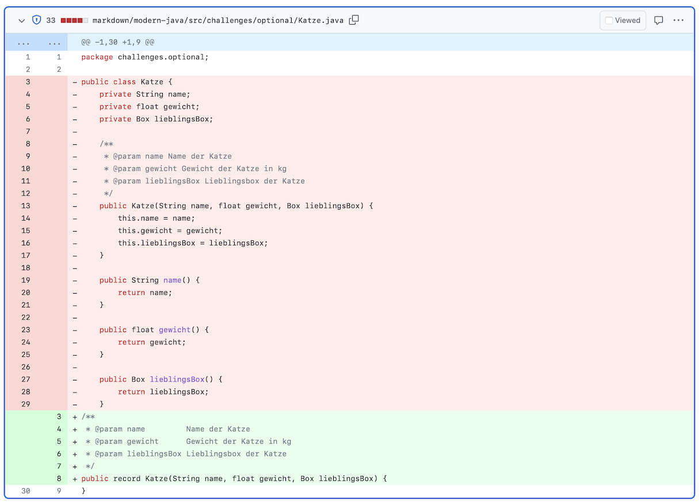

# Record-Klassen

> [!NOTE]
>
> <details open>
>
> <summary><strong>🎯 TL;DR</strong></summary>
>
> Häufig schreibt man relativ viel *Boiler Plate Code*, um einfach ein
> paar Daten plus den Konstruktor und die Zugriffsmethoden zu kapseln.
> Und selbst wenn die IDE dies zum Teil abnehmen kann - lesen muss man
> diesen Overhead trotzdem noch.
>
> Für den Fall von Klassen mit `final` Attributen wurden in Java14 die
> **Record-Klassen** eingeführt. Statt dem Schlüsselwort `class` wird
> das neue Schlüsselwort `record` verwendet. Nach dem Klassennamen
> kommen in runden Klammern die “Komponenten” - eine Auflistung der
> Parameter für den Standardkonstruktor (Typ, Name). Daraus wird
> automatisch ein “kanonischer Konstruktor” mit exakt diesen Parametern
> generiert. Es werden zusätzlich `private final` Attribute generiert
> für jede Komponente, und diese werden durch den kanonischen
> Konstruktor gesetzt. Außerdem wird für jedes Attribut automatisch ein
> Getter mit dem Namen des Attributs generiert (also ohne den Präfix
> “get”).
>
> Beispiel:
>
> ``` java
> public record StudiR(String name, int credits) {}
> ```
>
> Der Konstruktor und die Getter können überschrieben werden, es können
> auch eigene Methoden definiert werden (eigene Konstruktoren *müssen*
> den kanonischen Konstruktor aufrufen). Es gibt außer den über die
> Komponenten definierten Attribute keine weiteren Attribute. Da eine
> Record-Klasse intern von `java.lang.Record` ableitet, kann eine
> Record-Klasse nicht von weiteren Klassen ableiten (erben). Man kann
> aber beliebig viele Interfaces implementieren. Record-Klassen sind
> implizit final, d.h. man nicht von Record-Klassen erben.
>
> </details>
>
> <details>
>
> <summary><strong>🎦 Videos</strong></summary>
>
> - [VL Record-Klassen](https://youtu.be/5RMhdCsZL6Y)
> - [Demo Record-Klassen](https://youtu.be/jWBAXWH0MUc)
>
> </details>

## Motivation; Klasse Studi

``` java
public class Studi {
    private final String name;
    private final int credits;

    public Studi(String name, int credits) {
        this.name = name;
        this.credits = credits;
    }

    public String getName() {
        return name;
    }

    public int getCredits() {
        return credits;
    }
}
```

## Klasse Studi als Record

``` java
public record StudiR(String name, int credits) {}
```

- Immutable Klasse mit Feldern `String name` und `int credits` =\>
  “`(String name, int credits)`” werden “Komponenten” des Records
  genannt

- Standardkonstruktor setzt diese Felder (“Kanonischer Konstruktor”)

- Getter für beide Felder:

  ``` java
  public String name() { return this.name; }
  public int credits() { return this.credits; }
  ```

Record-Klassen wurden in Java14 eingeführt und werden immer wieder in
neuen Releases erweitert/ergänzt.

Der kanonische Konstruktor hat das Aussehen wie die Record-Deklaration,
im Beispiel also `public StudiR(String name, int credits)`. Dabei werden
die Komponenten über eine Kopie der Werte initialisiert.

Für die Komponenten werden automatisch private Attribute mit dem selben
Namen angelegt.

Für die Komponenten werden automatisch Getter angelegt. Achtung: Die
Namen entsprechen denen der Komponenten, es fehlt also der übliche
“get”-Präfix!

## Eigenschaften und Einschränkungen von Record-Klassen

- Records erweitern implizit die Klasse `java.lang.Record`: Keine andere
  Klassen mehr erweiterbar! (Interfaces kein Problem)

- Record-Klassen sind implizit final

- Keine weiteren (Instanz-) Attribute definierbar (nur die Komponenten)

- Keine Setter definierbar für die Komponenten: Attribute sind final

- Statische Attribute mit Initialisierung erlaubt

## Records: Prüfungen im Konstruktor

Der Konstruktor ist erweiterbar:

``` java
public record StudiS(String name, int credits) {
    public StudiS(String name, int credits) {
        if (name == null) { throw new IllegalArgumentException("Name cannot be null!"); }
        else { this.name = name; }

        if (credits < 0) { this.credits = 0; }
        else { this.credits = credits; }
    }
}
```

In dieser Form muss man die Attribute selbst setzen.

Alternativ kann man die “kompakte” Form nutzen:

``` java
public record StudiT(String name, int credits) {
    public StudiT {
        if (name == null) { throw new IllegalArgumentException("Name cannot be null!"); }

        if (credits < 0) { credits = 0; }
    }
}
```

In der kompakten Form kann man nur die Werte der Parameter des
Konstruktors ändern. Das Setzen der Attribute ergänzt der Compiler nach
dem eigenen Code.

Es sind weitere Konstruktoren definierbar, diese *müssen* den
kanonischen Konstruktor aufrufen:

``` java
public StudiT() {
    this("", 42);
}
```

## Getter und Methoden

Getter werden vom Compiler automatisch generiert. Dabei entsprechen die
Methoden-Namen den Namen der Attribute:

``` java
public record StudiR(String name, int credits) {}

public static void main(String... args) {
    StudiR r = new StudiR("Sabine", 75);

    int x = r.credits();
    String y = r.name();
}
```

Getter überschreibbar und man kann weitere Methoden definieren:

``` java
public record StudiT(String name, int credits) {
    public int credits() { return credits + 42; }
    public void wuppie() { System.out.println("WUPPIE"); }
}
```

Die Komponenten/Attribute sind aber `final` und können nicht über
Methoden geändert werden!

## Beispiel aus den Challenges

In den Challenges zum Thema Optional gibt es die Klasse `Katze` in den
[Vorgaben](https://github.com/Programmiermethoden-CampusMinden/Prog2-Lecture/blob/master/lecture/java-modern/src/challenges/optional/Katze.java).

Die Katze wurde zunächst “klassisch” modelliert: Es gibt drei
Eigenschaften `name`, `gewicht`und `lieblingsBox`. Ein Konstruktor setzt
diese Felder und es gibt drei Getter für die einzelnen Eigenschaften.
Das braucht 18 Zeilen Code (ohne Kommentare Leerzeilen). Zudem erzeugt
der Boilerplate-Code relativ viel “visual noise”, so dass der
eigentliche Kern der Klasse schwerer zu erkennen ist.

In einem Refactoring wurde diese Klasse durch eine äquivalente
Record-Klasse ersetzt, die nur noch 2 Zeilen Code (je nach Code-Style
auch nur 1 Zeile) benötigt. Gleichzeitig wurde die Les- und Wartbarkeit
deutlich verbessert.



## Wrap-Up

- Records sind immutable Klassen:
  - `final` Attribute (entsprechend den Komponenten)
  - Kanonischer Konstruktor
  - Automatische Getter (Namen wie Komponenten)
- Konstruktoren und Methoden können ergänzt/überschrieben werden
- Keine Vererbung von Klassen möglich (kein `extends`)

Schöne Doku: [“Using Record to Model Immutable
Data”](https://dev.java/learn/using-record-to-model-immutable-data/).

## 📖 Zum Nachlesen

- Oracle Corporation ([2025](#ref-LernJava))

------------------------------------------------------------------------

> [!TIP]
>
> <details>
>
> <summary><strong>✅ Lernziele</strong></summary>
>
> - k2: Ich verstehe, dass Record-Klassen implizit final sind
> - k2: Ich weiss, dass Record-Klassen einen kanonischen Konstruktor haben
> - k2: Ich verstehe, dass die Attribute in Record-Klassen implizit final sind und automatisch angelegt und über den Konstruktor gesetzt werden
> - k2: Ich weiss, dass die Getter in Record-Klassen so benannt sind wie die Namen der Komponenten, also keinen Präfix ‘get’ haben
> - k2: Ich weiss, dass der kanonische Konstruktor ergänzt werden kann
> - k2: Ich weiss, dass weitere Methoden definiert werden können
> - k2: Ich verstehe, dass Record-Klassen nicht von anderen Klassen erben können, aber Interfaces implementieren können
> - k3: Ich kann Record-Klassen praktisch einsetzen
>
> </details>
>
> <details>
>
> <summary><strong>🏅 Challenges</strong></summary>
>
> Betrachen Sie den folgenden Code:
>
> ``` java
> public interface Person {
>     String getName();
>     Date getBirthday();
> }
>
> public class Student implements Person {
>     private static final SimpleDateFormat DATE_FORMAT = new SimpleDateFormat("dd.MM.yyyy");
>
>     private final String name;
>     private final Date birthday;
>
>     public Student(String name, String birthday) throws ParseException {
>         this.name = name;
>         this.birthday = DATE_FORMAT.parse(birthday);
>     }
>
>     public String getName() { return name; }
>     public Date getBirthday() { return birthday; }
> }
> ```
>
> Schreiben Sie die Klasse `Student` in eine Record-Klasse um. Was
> müssen Sie zusätzlich noch tun, damit die aktuelle API erhalten
> bleibt?
>
> </details>

------------------------------------------------------------------------

> [!NOTE]
>
> <details>
>
> <summary><strong>👀 Quellen</strong></summary>
>
> <div id="refs" class="references csl-bib-body hanging-indent"
> entry-spacing="0">
>
> <div id="ref-LernJava" class="csl-entry">
>
> Oracle Corporation. 2025. „Learn Java“. 2025.
> <https://dev.java/learn/>.
>
> </div>
>
> </div>
>
> </details>

------------------------------------------------------------------------


Unless otherwise noted, this work is licensed under CC BY-SA 4.0.

<blockquote><p><sup><sub><strong>Last modified:</strong> df56b1c (lecture: remove explicit link to pdf version, 2025-07-23)<br></sub></sup></p></blockquote>
