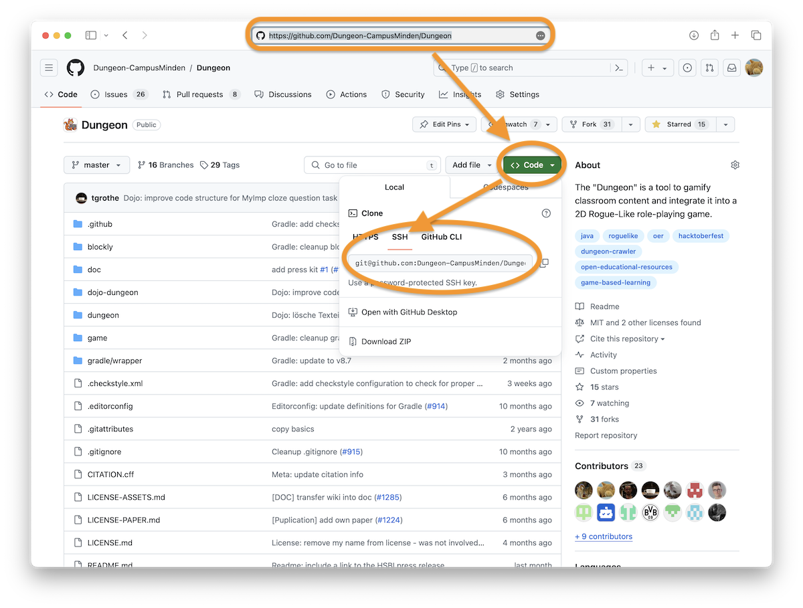
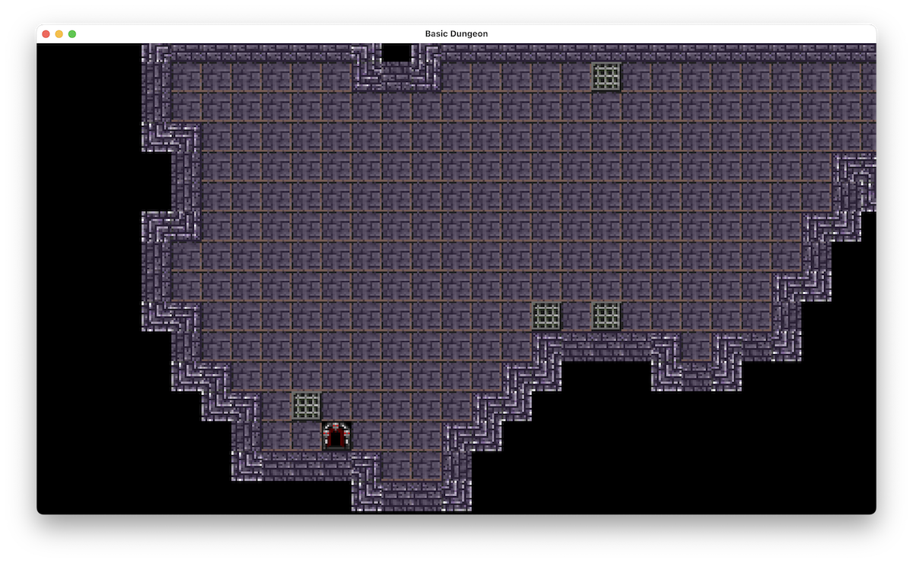
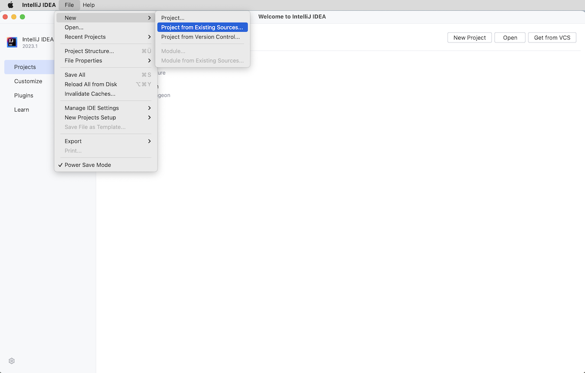
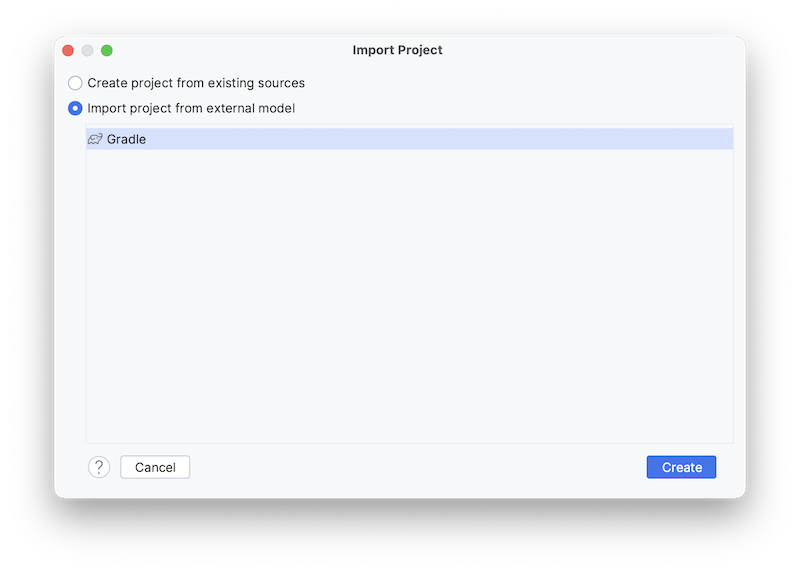
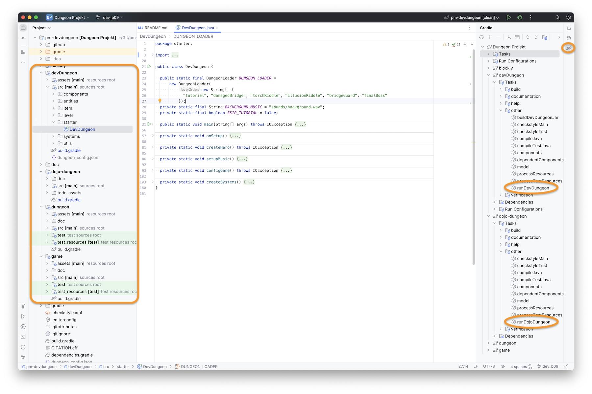

# Frameworks: How-To Dungeon

> [!NOTE]
>
> <details open>
>
> <summary><strong>🎯 TL;DR</strong></summary>
>
> Der PM-Dungeon ist ein Framework zum Entwickeln von Rogue-like
> Dungeon-Crawlern, also einfachen 2D-Spielen in Java. Das Framework
> bietet die wichtigsten benötigten Grundstrukturen für ein
> Computer-Spiel: Es hat eine Game-Loop, kann Level generieren und
> darstellen und hat eine Entity-Component-System-Struktur (ECS), über
> die die Spielinhalte erstellt werden können. Im Hintergrund arbeitet
> die Open-Source-Bibliothek libGDX.
>
> Sie können das Projekt direkt von GitHub clonen und über den im
> Projekt integrierten Gradle-Wrapper starten. Dazu brauchen Sie Java 21
> LTS (in einer 64-bit Version). Sie können das Projekt als
> Gradle-Projekt in Ihre IDE laden.
>
> Die Starter-Klassen (z.B. `starter.Starter` im “dungeon”-Subprojekt
> oder `starter.DevDungeon` im “devDungeon”-Subprojekt) sind die
> zentralen Einstiegspunkte. Hier finden Sie “unseren” Teil der
> Game-Loop (der in der eigentlichen Game-Loop von libGDX aufgerufen
> wird), hier finden Sie die Konfiguration und die `main()`-Methode.
>
> Im ECS werden die im Spiel befindlichen Elemente als *Entitäten*
> modelliert. Diese Entitäten sind lediglich Container für *Components*,
> die dann ihrerseits die entsprechenden Eigenschaften der Entitäten
> modellieren. Entitäten haben normalerweise über die Components hinaus
> keine weiteren Eigenschaften (Attribute, Methoden). Das Game kennt
> alle zum aktuellen Zeitpunkt “lebenden” Entitäten.
>
> Components gruppieren Eigenschaften, beispielsweise für Positionen
> oder Lebenspunkte. Components haben normalerweise keine Methoden
> (halten also nur Werte/Attribute). Jede Component-Instanz ist immer
> einer konkreten Entität zugeordnet und kann ohne diese nicht
> existieren.
>
> *Systeme* implementieren das Verhalten im ECS. Das Game kennt alle
> aktiven Systeme und ruft in jedem Durchlauf der Game-Loop die
> `execute()`-Methode der Systeme auf. Üblicherweise holt sich dann ein
> System alle Entitäten vom Game und iteriert darüber und fragt ab, ob
> die betrachtete Entität die notwendigen Components hat - falls ja,
> dann kann das System auf dieser Entität die entsprechenden Operationen
> ausführen (Animation, Bewegung, …); falls nein, wird diese Entität
> ignoriert und mit der Iteration fortgefahren.
>
> Wir programmieren in dieser Einheit einen einfachen Helden. Der Held
> ist eine `Entity` und braucht verschiedene Components, um im Spiel
> angezeigt zu werden und bewegt werden zu können.
>
> </details>
>
> <details>
>
> <summary><strong>🎦 Videos</strong></summary>
>
> - [VL How-To Dungeon: Teil 1
>   (Überblick)](https://youtu.be/kGKDcKIDHok)
> - [VL How-To Dungeon: Teil 2 (Hero)](https://youtu.be/uPNt7OWpMBs)
> - [VL How-To Dungeon: Teil 3 (Monster und
>   Feuerbälle)](https://youtu.be/_YVYoFgvU04)
>
> </details>

## How-To Dungeon

In diesem Semester werden Sie im Praktikum schrittweise Erweiterungen in
verschiedenen “fertigen” Rogue-like Computerspielen programmieren und
dabei (hoffentlich) die Methoden aus der Vorlesung einsetzen können.

Das Projekt “PM-Dungeon” stellt wichtige Bausteine für das Spiel bereit,
beispielsweise eine Game-Loop und eine API für das Generieren und
Benutzen von Leveln und vieles andere mehr. Im Hintergrund werkelt das
etablierte Open-Source-Spieleframework [libGDX](https://libgdx.com).

Wir werden uns in diesem How-To einen Überblick verschaffen und einen
ersten Einstieg versuchen: Wir programmieren einen einfachen Helden.

## Projekt PM-Dungeon

Das Projekt PM-Dungeon entstand in verschiedenen Forschungsprojekten und
wurde (und wird) aktiv von Studierenden und wissenschaftlichen
Mitarbeitern am Campus Minden entwickelt.

Zuletzt lief das Forschungsprojekt “Dungeon”, gefördert durch die
[Stiftung für Innovation in der
Hochschullehre](https://stiftung-hochschullehre.de) im [“Freiraum
2022”](https://stiftung-hochschullehre.de/foerderung/freiraum2022/).
Dabei sollten diesmal nicht die Studierenden selbst Code schreiben,
sondern die Lehrenden sollen Aufgaben in einer speziellen (von uns
entwickelten) Programmiersprache schreiben (können), woraus dann ein
fertiges Dungeon-Spiel generiert wird (mit der Aufgabe als Quest o.ä. im
Dungeon eingebettet) und die Studierenden können durch das Spielen die
Aufgaben lösen.

Sie werden merken, dass trotz klarer Richtlinien und Ideen die
Entwicklung in der Praxis doch nicht so einfach ist und dass viele Dinge
immer wieder geübt und erinnert werden müssen: Namen von Klassen und
Methoden, sinnvolles Javadoc, Dokumentation jenseits des Javadoc, aber
auch Commit-Messages und PR-Summaries.

## Installation des Frameworks

Sie finden das Projekt auf GitHub:
[github.com/Dungeon-CampusMinden/Dungeon](https://github.com/Dungeon-CampusMinden/Dungeon).



Laden Sie sich den Quellcode herunter, um damit in der IDE arbeiten zu
können. Prinzipiell gibt es viele verschiedene Wege, in diesem Tutorial
laden wir es per Git in der Konsole herunter:

``` sh
git clone git@github.com:Dungeon-CampusMinden/Dungeon.git pm-dungeon
```

Dabei entsteht der Ordner `pm-dungeon/` mit dem Dungeon-Projekt als
Inhalt.

**WICHTIG**: Achten Sie bitte darauf, dass im Projektpfad **keine
Leerzeichen** und keine Sonderzeichen (Umlaute o.ä.) vorkommen! Dies
kann zu seltsamen Fehler führen. Bitte auch darauf achten, dass Sie als
JDK ein **Java SE 21 (LTS)** verwenden.

## Java: Java SE 21 (LTS)

Wir benutzen im Dungeon-Projekt die aktuelle LTS-Version des JDK, d.h.
**Java SE 21 (LTS)**. Sie können sich das JDK bei
[Oracle](https://www.oracle.com/java/technologies/downloads/)
herunterladen oder
[Alternativen](https://code.visualstudio.com/docs/languages/java#_install-a-java-development-kit-jdk)
ausprobieren. Bitte unbedingt die jeweilige 64-bit Version nutzen!

In der Konsole sollte

``` sh
java -version
```

ungefähr diese Ausgabe erzeugen (ignorieren Sie die Minor-Version,
wichtig ist Major-Version: 21 bzw. “LTS”):

    java version "21.0.3" 2024-04-16 LTS
    Java(TM) SE Runtime Environment (build 21.0.3+7-LTS-152)
    Java HotSpot(TM) 64-Bit Server VM (build 21.0.3+7-LTS-152, mixed mode, sharing)

## Erster Test

Für einen ersten Test gehen Sie in der Konsole in den vorhin erzeugten
neuen Ordner `pm-dungeon/` und führen Sie dort den Befehl

``` sh
./gradlew game:runBasicStarter
```

aus. Dabei sollte das (mitgelieferte) Build-Tool
[Gradle](https://gradle.org/) starten und die benötigten
Java-Bibliotheken herunterladen und schließlich das Spiel in einer
Minimalversion starten - Sie sollten also ein Level sehen.



Dies dauert je nach Internetanbindung etwas - beim nächsten Start geht
es dann aber deutlich schneller, weil ja bereits alles da ist.

## Import in der IDE

Importieren Sie das Projekt als Gradle-basiertes Projekt, dann übernimmt
die IDE die Konfiguration für Sie.





Über das Gradle-Menü können Sie nun in der IDE den
“runBasicStarter”-Task (Menüpunkt “game”) starten, und es erscheint
wieder ein minimales Level.

## Überblick über die (Sub-) Projekte

Sie finden im Package-Explorer eine Reihe von Unterprojekten
(Gradle-Subprojekte). Für PR2 ist eigentlich nur das Subprojekt
[“devDungeon”](https://github.com/Dungeon-CampusMinden/dev-dungeon/tree/master/devDungeon)
relevant sowie die Dokumentation in den verschiedenen `doc/`-Ordnern
(die derzeit leider noch eine ziemliche Baustelle ist).



DevDungeon stellt ein (mehr oder weniger fertiges) Spiel dar, das von
Studierenden erstellt wurde ([@Flamtky](https://github.com/Flamtky)).
Dieses Spiel nutzen wir an einigen Stellen im Praktikum.

Die Basis für dieses Spiel stellt das Dungeon-Framework dar, welches in
den Gradle-Subprojekten
[“game”](https://github.com/Dungeon-CampusMinden/Dungeon/tree/master/game)
und
[“dungeon”](https://github.com/Dungeon-CampusMinden/Dungeon/tree/master/dungeon)
zu finden ist. Game stellt dabei eine Art minimale Basis zum
Programmieren eigener Spiele dar (alle Klassen im Package `core`), und
Dungeon erweitert diese Basis und fügt einige häufig benötigte Elemente
und weitere Texturen (Package `contrib`) hinzu. Zusätzlich gibt es hier
noch einige Klassen für die DSL, was für PR2 aber nicht relevant ist.

Das Subprojekt
[“blockly”](https://github.com/Dungeon-CampusMinden/Dungeon/tree/master/blockly)
ist die Einbindung einer blockbasierten Programmiersprache in das
Dungeon-Framework und spielt für PR2 ebenfalls keine Rolle.

Die Strukturen in allen Sub-Projekten ist ähnlich: Sie finden unter
`<subproject>/src/` die Java-Packages und in `<subproject>/assets/`
vordefinierte Texturen und Soundfiles sowie Crafting-Rezepte
(beispielsweise für Boden, Wände und den Hero). Alle Sourcen sind (mehr
oder weniger) mit Javadoc dokumentiert, zusätzlich gibt es jeweils in
`<subproject>/doc/` weitere Anleitungen und Hinweise.

Für die Aufgaben im Praktikum starten Sie am besten zunächst beim
relevanten Code im Sub-Projekt DevDungeon. Schauen Sie sich die für die
Aufgabe benutzten Klassen und deren Javadoc an. In der Regel nutzen
diese auch Klassen aus Dungeon und Game, deren Aufbau und Javadoc Sie
sich ebenfalls anschauen sollten. Zusätzlich gibt es für Game und
Dungeon noch weitere Dokumentation in den `doc/`-Ordnern.

## Überblick über die Java-Strukturen


Jedes Spiel besteht aus einer Game-Loop, die je nach Konfiguration 30
Mal oder 60 Mal pro Sekunde ausgeführt wird. Diese Game-Loop wird mit
Hilfe der `Game#run()`-Methode gestartet und die Kontrolle geht dabei
vollständig an libGDX über. Im Wesentlichen werden pro Durchlauf
(“Frame”) die Aktionen berechnet und das Spielfeld neu gezeichnet. Alle
Aktionen im Spiel, etwa das Bewegen von Spielelementen oder das
Berechnen von Angriffen o.ä., werden über sogenannte Systeme berechnet.
Diese werden einmal pro Frame aufgerufen und bestimmen den neuen Zustand
(Position, Animation, Stats, …) der Spielelemente, die dann beim
nächsten Rendern im Spiel angezeigt werden.


Die Klasse `core.Game` ist der zentrale Einstiegspunkt. Hier werden alle
wichtigen Dinge konfiguriert, und es gibt die `Game#run()`-Methode, die
das Spiel startet. Zusätzlich gibt es weitere Methoden, die für Sie
relevant sind:

- `Game#userOnSetup()`: Diese Methode wird einmal beim Start des Spiels
  aufgerufen und kann für die Konfiguration und Initialisierung der
  verschiedenen Systeme genutzt werden. Hier wird beispielsweise u.a.
  auch das erste Level geladen.
- `Game#userOnFrame()`: Diese Methode wird zu Beginn eines jeden Frame
  aufgerufen, noch bevor die `execute()`-Methode der verschiedenen
  Systeme aufgerufen wird.
- `Game#userOnLevelLoad()`: Diese Methode wird aufgerufen, wenn ein
  Level geladen wird. Hier können Sie später die Entitäten erstellen,
  die initial im Level verteilt werden sollen.

Es gibt noch eine ganze Reihe von Packages, beispielsweise
`core.Component` mit verschiedenen wichtigen Components oder
`core.level` mit Klassen zum Generieren zufälliger neuer Level und zum
Laden und zum Zugriff (wo bin ich und warum?) oder `core.systems` mit
den Systemen, die bestimmte Dinge im Spiel managen. Die Gliederung in
Entitäten (*entities*), Komponenten (*components*) und Systeme
(*systems*) nennt sich auch “ECS-Architektur” (zu ECS später mehr).

Sie finden im [“Quickstart: How to
Dungeon”](https://github.com/Dungeon-CampusMinden/Dungeon/blob/master/game/doc/quickstart.md)
eine gute Anleitung, die auf die Strukturen tiefer eingeht.

## Mein Held

Um einen besseren Blick in das System zu bekommen, erstellen wir
schrittweise einen eigenen einfachen Helden.

Legen Sie sich im `starter`-Package eine neue Klasse an, mit der Sie das
Spiel konfigurieren und starten können:

``` java
package starter;
import core.Game;

public class Main {
    public static void main(String... args) {
        // Start the game loop
        Game.run();
    }
}
```

In IntelliJ können Sie nun die `main()`-Funktion direkt ausführen, dazu
wird im Hintergrund die vorhandene Gradle-Konfiguration genutzt. Mit
anderen IDEs funktioniert das vielleicht nicht direkt, dann erweitern
Sie einfach die Gradle-Konfiguration um einen entsprechenden Task:

``` groovy
tasks.register('run', JavaExec) {
    mainClass = 'starter.Main'
    classpath = sourceSets.main.runtimeClasspath
}
```

## Einschub: ECS oder Entities, Components und Systems

Der Held ist ein Element im Spiel. Diese Struktur muss geeignet
modelliert werden.

Unser Dungeon implementiert dabei eine Variante eines [Entity Component
System (*ECS*)](https://en.wikipedia.org/wiki/Entity_component_system)
und folgt damit “großen Vorbildern” wie beispielsweise
[Unity](https://learn.unity.com/tutorial/entity-component-system).

Neben verschiedenen Hilfsstrukturen gibt es dabei nur **Entitäten**,
**Komponenten** und **Systeme**. Hier werden sämtliche Informationen und
Verhalten modelliert.

### Entity

Die Idee dahinter ist: Alle Elemente im Spiel werden als *Entität*
realisiert, d.h. der Held und die Monster und die Items, die man so
finden kann, sind alles Entitäten. Sogar Feuerbälle sind letztlich
Entitäten. (Im Prinzip könnten sogar die Boden- und Wandkacheln
Entitäten sein - sind es aus Effizienzgründen aktuell aber nicht.)

Eine Entität an sich kann erst einmal nichts und dient nur als Container
für *Components*.

Das Spiel kennt alle zu einem Zeitpunkt vorhandenen Entitäten, diese
müssen per `Game#add` registriert werden. Man kann die Entitäten über
die API abrufen (`Game#allEntities`, `Game#find` und `Game#hero`).

Unsere Basisklasse für Entitäten ist aktuell `core.Entity`.

### Component

Components bündeln bestimmte Werte einer Entität für bestimmte Zwecke,
d.h. statt der Attribute in einer Klasse (Entität) nutzen wir hier eine
weitere Kapselung.

Beispielsweise könnte man die Lebenspunkte u.ä. in einer
`HealthComponent` verpacken und dann in einer Entität speichern. Oder
man könnte in einer `VelocityComponent` hinterlegen, wie schnell eine
Entität in x- und in y-Richtung bewegt werden kann (Wände würden dabei
einfach den Wert 0 bekommen). Oder man könnte in einer
`PositionComponent` speichern, wo die Entität gerade ist. Schauen Sie
einfach mal in die Packages `core.components` und `contrib.components`.

Wichtig ist: Eine Instanz einer Component ist immer an eine Entität
gekoppelt, eine Component ohne (Bindung an eine) Entität ist sinnfrei.
Andersherum kann eine Entität immer nur eine einzige Instanz einer
bestimmten Component (eines Component-Typs) haben, also beispielsweise
nicht zwei Objekte vom Typ `PositionComponent`.

Components speichern vor allem Werte und haben nur in Ausnahmefällen
eigenes Verhalten.

Das Basisinterface für Components ist derzeit `core.Component`.

### System

Mit Entitäten und passenden Components, über die wir die Eigenschaften
ausdrücken, können wir bereits Spielelemente im Dungeon repräsentieren.

Für die Bewegung und Interaktion sorgen nun passende Systeme. Das Spiel
kennt alle Systeme (diese werden einmal beim Start im Spiel per
`Game#add` registriert) und ruft in der Game-Loop pro Frame deren
`execute()`-Methode auf. In der Regel iterieren die Systeme beim
Ausführen der `execute()`-Methode über die Entitäten des Spiels (via
`Game#allEntities`), suchen sich Entitäten mit bestimmten Components
heraus und bearbeiten den Zustand dieser Components.

Dabei könnte beispielsweise ein `HealthSystem` sich alle Entitäten
filtern, deren `HealthComponent` unterhalb einer kritischen Schwelle
liegen und diese rot anmalen lassen, d.h. in der `DrawComponent` wird
die Textur (“Animation”) ausgetauscht. Oder ein `PlayerSystem` könnte
dafür sorgen, dass die Eingaben auf der Tastatur geeignet an den Helden
weitergegeben werden und (über andere Systeme) in eine Bewegung oder
Kampf o.ä. umgewandelt werden.

Sie finden unsere Systeme in den Packages `core.systems` und
`contrib.systems`, und die Basisklasse ist derzeit `core.System` - falls
Sie einmal eigene Systeme implementieren wollen. ([vgl. auch
Doku](https://github.com/Dungeon-CampusMinden/Dungeon/blob/master/game/doc/create_own_content.md))

## Nun aber Helden!

### Ein Held ist eine Entität

Also legen wir nun endlich einen neuen Helden als Instanz von
`core.Entity` an und registrieren diese Entität im Spiel:

``` java
public class Main {
    public static void main(String... args) {

        // Add some one-time configuration
        Game.userOnSetup(
                () -> {
                    Entity hero = new Entity("Hero");
                    Game.add(hero);
                });

        // Start the game loop
        Game.run();
    }
}
```

Der in der Methode `Game#userOnSetup` übergebene Lamda-Ausdruck wird
(später) einmalig beim Start der Game-Loop von libGDX aufgerufen. Auf
diese Weise können wir unseren Helden ins Spiel bekommen. (Alle anderen
Entitäten sollten Sie besser über die Methode `Game#onLevelLoad`
anlegen, also beim Laden eines neuen Levels.)

Prinzipiell haben Sie damit alles, um das Spiel starten zu können. In
der Praxis sehen Sie aber keinen Helden: Der hat nämlich weder eine
Position noch eine Textur, kann also gar nicht angezeigt werden.

### Wo bin ich grad?

Der Held braucht eine Position. Dazu gibt es
`core.components.PositionComponent`. Fügen wir diese einfach dem Helden
hinzu:

``` java
public class Main {
    public static void main(String... args) {

        // Add some one-time configuration
        Game.userOnSetup(
                () -> {
                    Entity hero = new Entity("Hero");

                    hero.add(new PositionComponent());

                    Game.add(hero);
                });

        // Start the game loop
        Game.run();
    }
}
```

Wenn man keine Position mitgibt, wird einfach eine zufällige Position im
Level genutzt. Alternativ kann man eine eigene Position mitgeben.

Im Dungeon existieren aktuell zwei Koordinatensysteme:
`core.level.utils.Coordinate` (Integer-basiert) und `core.utils.Point`
(Float-basiert). Die Level werden als Matrix von `Tile` (Boden, Wand,
Loch, …) gespeichert. Die Position dieser `Tile` wird als `Coordinate`
gespeichert, was dem Index des Tiles in der Matrix entspricht. Entitäten
können aktuell aber auch zwischen zwei Tiles oder schräg-links-oben auf
einem Tile stehen, dafür gibt es die Positionen als `Point`.
Entsprechend könnte man den neuen Helden bei `(0,0)` in das Level
setzen: `new PositionComponent(new Point(0, 0))` bzw. kurz
`new PositionComponent(0f, 0f)` (wobei diese Position möglicherweise
nicht spielbar ist, da hier eine Wand oder sogar nichts ist).

Wenn Sie jetzt das Spiel starten, sehen Sie - immer noch nichts (außer
den Wänden). Hmmm.

### Animateure

Um den Held zeichnen zu können, brauchen wir eine Animation - also eine
`DrawComponent`.

``` java
public class Main {
    public static void main(String... args) {

        // Add some one-time configuration
        Game.userOnSetup(
                () -> {
                    Entity hero = new Entity("Hero");

                    hero.add(new PositionComponent());

                    try {
                        hero.add(new DrawComponent(new SimpleIPath("character/knight")));
                    } catch (IOException e) {
                        System.err.println("Could not load textures for hero.");
                        throw new RuntimeException(e);
                    }

                    hero.add(new CameraComponent());
                    hero.add(new PlayerComponent());

                    Game.add(hero);
                });

        // Start the game loop
        Game.run();
    }
}
```

In den Asset-Ordnern der Sub-Projekte Game und Dungeon gibt es bereits
vordefinierte Texturen. Im Beispiel wird (nur) im Sub-Projekt “game”
gesucht (weil unsere `Main`-Klasse dort liegt), und zwar in
`<game>/assets/character/knight/`. Dort finden sich Unterordner für
verschiedene Zustände des Ritters, und darin jeweils einige Texturen
(einfache kleine .png-Dateien), die als Animation in einem bestimmten
Zustand nacheinander abgespielt werden. Über den angegebenen (Teil-)
Pfad werden in `DrawComponent` automatisch die entsprechenden
Animationen erzeugt und geladen. Die Asset-Ordner sind in der
Gradle-Konfiguration definiert. (Wenn Sie Ihre `Main`-Klasse in Dungeon
ansiedeln, stehen Ihnen automatisch die Texturen aus Dungeon plus aus
Game zur Verfügung.)

Da es passieren kann, dass der übergebene Pfad nicht gefunden wird, muss
hier mit Exception-Handling gearbeitet werden. Wir geben hier erstmal
eine Fehlermeldung aus und propagieren eine neue `RuntimeException`, die
letztlich dafür sorgt, dass das Spiel abgebrochen würde.

Zusätzlich brauchen wir für den Helden noch eine `CameraComponent`. Das
`core.systems.CameraSystem` wird dafür sorgen, dass die Entität mit
dieser Component immer im Fokus der Kamera ist. Da wir den Held später
noch manuell steuern wollen, bekommt er auch gleich noch eine
`PlayerComponent`.

Jetzt wackelt der Held auf der Stelle herum …

### Bewege mich

Für die Bewegung ist das `VelocitySystem` zuständig. Dieses fragt in
allen Entitäten die `VelocityComponent` sowie die `PositionComponent`
ab, berechnet die nächste neue Position und speichert diese in der
`PositionComponent`, und setzt bei tatsächlicher Bewegung auch eine
passende Bewegungsanimation in der `DrawComponent`.

Das `PlayerSystem` und die `PlayerComponent` sorgen im Zusammenspiel für
eine Reaktion auf die Tastatureingaben.

``` java
public class Main {
    public static void main(String... args) {

        // Add some one-time configuration
        Game.userOnSetup(
                () -> {
                    Entity hero = new Entity("Hero");

                    hero.add(new PositionComponent());

                    try {
                        hero.add(new DrawComponent(new SimpleIPath("character/knight")));
                    } catch (IOException e) {
                        System.err.println("Could not load textures for hero.");
                        throw new RuntimeException(e);
                    }

                    hero.add(new CameraComponent());

                    hero.add(new VelocityComponent(5f, 5f));

                    PlayerComponent pc = new PlayerComponent();
                    pc.registerCallback(
                            KeyboardConfig.MOVEMENT_UP.value(),
                            entity -> {
                                VelocityComponent vc = entity.fetch(VelocityComponent.class).get();
                                vc.currentYVelocity(vc.yVelocity());
                            });
                    hero.add(pc);

                    Game.add(hero);
                });

        // Start the game loop
        Game.run();
    }
}
```

Die `VelocityComponent` wird im Konstruktor mit einer (maximalen)
Geschwindigkeit in x- und y-Richtung erzeugt. Nutzen Sie hier nicht zu
große Werte - unter Umständen reicht dann ein einziger Tastendruck, um
einmal über das Spielfeld geschleudert zu werden.

Über die Methoden `VelocityComponent#xVelocity` und
`VelocityComponent#yVelocity` können Sie die Maximalgeschwindigkeit
abfragen und auch setzen. Mit `VelocityComponent#currentXVelocity` bzw.
`VelocityComponent#currentYVelocity` holen und setzen Sie dagegen die
*aktuelle* Geschwindigkeit, die vom `VelocitySystem` zur Berechnung der
nächsten Position genutzt wird (wobei die Maximalgeschwindigkeit als
Obergrenze verwendet wird).

Im Beispiel wird in der `PlayerComponent` des Helden der Taste “W” ein
Lambda-Ausdruck zugeordnet, der die `VelocityComponent` der Entität
(also des Helden) holt, die maximale Geschwindigkeit in y-Richtung
ausliest und diese als aktuelle Geschwindigkeit in y-Richtung setzt.
Damit kann mit der Taste “W” der Held nach oben laufen.

*Anmerkung*: Das `entity.fetch(VelocityComponent.class)` liefert nicht
direkt ein `VelocityComponent`-Objekt zurück, sondern ein
`Optional<VelocityComponent>`. Darüber sprechen wir (später) noch in der
Lektion [“Optional”](../java-modern/optional.md). Für jetzt soll es
zunächst genügen, dass Sie das gewünschte “verpackte” Objekt mit der
Methode `get()` aus dem `Optional` wieder herausbekommen.

*Anmerkung*: Das gezeigte Schema ist insofern typisch, als dass
verschiedene Systeme aus der Maximalgeschwindigkeit und weiteren
Parametern die aktuelle Geschwindigkeit berechnen und in der
`VelocityComponent` einer Entität setzen. Das `VelocitySystem` nutzt
dann die aktuelle Geschwindigkeit für die tatsächliche Bewegung. Sie
sollten in der Praxis also die Methoden
`VelocityComponent#currentXVelocity` bzw.
`VelocityComponent#currentYVelocity` eher nicht selbst aufrufen, sondern
dies den Systemen überlassen. Wenn Sie einen Geschwindigkeitsboost haben
wollen, würde es bei der obigen Konfiguration ausreichen,
`VelocityComponent#xVelocity` und/oder `VelocityComponent#yVelocity` zu
setzen/zu erhöhen - den Rest übernehmen dann das `PlayerSystem` und vor
allem das `VelocitySystem` …

Nun sollten Sie Ihren Helden (nach oben) bewegen können. (Tipp:
Probieren Sie “W”.)

*Hinweis*: Üblicherweise bearbeiten die Systeme bei der Iteration über
alle Entitäten nur diejenigen Entitäten, die alle benötigten Components
aufweisen.

## Walking mit System

### Neue Monster

Wie kann ich ein Monster beim Laden des Levels erzeugen?

Beim Laden eines Levels wird der mit `Game#userOnLevelLoad` registrierte
Lambda-Ausdruck ausgeführt. Hier kann man beispielsweise ein neues
Monster erzeugen (lassen):

``` java
public class Main {
    public static void main(String... args) {

        // Add some one-time configuration
        Game.userOnSetup( ... );


        // Create a new monster in every new level
        Game.userOnLevelLoad(first -> {
            Entity fb = new Entity("HUGO");

            fb.add(new PositionComponent(Game.hero().get().fetch(PositionComponent.class).get().position()));

            try {
                fb.add(new DrawComponent(new SimpleIPath("character/knight")));
            } catch (IOException e) {
                System.err.println("Could not load textures for HUGO.");
                throw new RuntimeException(e);
            }

            VelocityComponent vc = new VelocityComponent(10f, 10f);
            vc.currentYVelocity(vc.yVelocity());
            fb.add(vc);

            Game.add(fb);
        });


        // Start the game loop
        Game.run();
    }
}
```

Im Lambda-Ausdruck erzeugen wir hier einfach eine neue Entität und fügen
dieser wie vorhin beim Hero eine `DrawComponent` für die Anzeige sowie
eine `PositionComponent` und eine `VelocityComponent` für die Position
und Bewegung hinzu, und am Ende registrieren wir die Entität beim Spiel.

Wenn man das Spiel jetzt startet, wird an der Position des Helden eine
neue Entität sichtbar (mit der selben Textur).

Aber warum bewegt die neue Figur sich nicht? Wir haben doch eine
`VelocityComponent` hinzugefügt und eine aktuelle Geschwindigkeit
gesetzt?!

Wenn man in `VelocitySystem#execute` (bzw. die dort aufgerufene Methode
`VelocitySystem#updatePosition`) schaut, wird klar, dass die aktuelle
Geschwindigkeit zwar neu berechnet und gesetzt wird, aber dass ein
“Reibungsfaktor” (abhängig vom Feld, auf dem die Figur steht)
eingerechnet wird und somit die aktuelle Geschwindigkeit schnell auf
Null geht. Der Hintergrund ist einfach: Normalerweise soll eine Entität
nicht einmal angeschubst werden und dann “ewig” laufen, insbesondere bei
Reaktion auf Tastatureingaben. Deshalb werden die Entitäten kurz bewegt
und bremsen dann wieder ab. Das Aufrechterhalten der Bewegung erfolgt
normalerweise über Systeme …

### Systems für das selbstständige Laufen

Wir brauchen ein System, welches die aktuelle Geschwindigkeit einer
Entität in jedem Frame wieder auf den alten Wert setzt. Dazu leiten wir
von `core.System` ab. (Achtung: Es gibt auch eine Klasse `System` im
JDK - hier müssen Sie genau hinschauen!)

``` java
import core.System;

public class WalkerSystem extends System {
    @Override
    public void execute() {
        entityStream().forEach(e -> {
                VelocityComponent vc = e.fetch(VelocityComponent.class).get();
                vc.currentXVelocity(vc.xVelocity());
                vc.currentYVelocity(vc.yVelocity());
        });
    }
}


public class Main {
    public static void main(String... args) {

        // Add some one-time configuration
        Game.userOnSetup( ... );

        // Create a new monster in every new level
        Game.userOnLevelLoad( ... );


        // Register our new system
        Game.add(new WalkerSystem());


        // Start the game loop
        Game.run();
    }
}
```

Wir leiten also von `core.System` ab und implementieren die
`execute`-Methode. Wir holen uns dabei von jeder Entität die
`VelocityComponent` und setzen die aktuelle Geschwindigkeit neu auf die
maximale Geschwindigkeit. Zusätzlich registrieren wir das neue System im
Spiel, damit es in jedem Frame einmal aufgerufen wird.

Nun läuft das neue Monster los (bis es gegen eine Wand läuft).

Aber der Held bewegt sich nun ebenfalls dauerhaft :(

### Components für das selbstständige Laufen

Das Problem ist, dass unser neues `WalkerSystem` **alle** Entitäten
automatisch bewegt. (Ein weiteres Problem ist, dass das `WalkerSystem`
davon ausgeht, dass es immer eine `VelocityComponent` gibt, was nicht
unbedingt erfüllt ist!)

Wir brauchen also noch eine Component, mit der wir die zu bewegenden
Entitäten markieren können.

``` java
import core.System;
import core.Component;

public class WalkerComponent implements Component {}


public class WalkerSystem extends System {
    public WalkerSystem() {
        super(WalkerComponent.class);
    }

    @Override
    public void execute() {
        entityStream().forEach(e -> {
            if (e.isPresent(WalkerComponent.class)) {
                VelocityComponent vc = e.fetch(VelocityComponent.class).get();
                vc.currentXVelocity(vc.xVelocity());
                vc.currentYVelocity(vc.yVelocity());
            }
        });
    }
}


public class Main {
    public static void main(String... args) {

        // Add some one-time configuration
        Game.userOnSetup( ... );


        // Create a new monster in every new level
        Game.userOnLevelLoad(first -> {
            Entity fb = new Entity("HUGO");

            ...

            fb.add(new WalkerComponent());

            Game.add(fb);
        });


        // Register our new system
        Game.add(new WalkerSystem());

        // Start the game loop
        Game.run();
    }
}
```

Die neue Component (`WalkerComponent`) ist einfach eine leere Klasse,
die von `core.Component` erbt. Wir brauchen keine Werte o.ä., die wir
hier ablegen wollen - eine leere Klasse reicht für das Beispiel. Dem
neuen Monster geben wir diese neue Component nun mit.

Das `WalkerSystem` wird auch etwas ergänzt: Im Konstruktor rufen wir den
Super-Konstruktor auf und übergeben die `WalkerComponent`-Klasse - dies
ist die Component, für die sich das System interessiert. Zusätzlich
legen wir noch eine `if`-Abfrage um das Aktualisieren der aktuellen
Geschwindigkeit: Der Block soll nur dann ausgeführt werden, wenn die im
aktuellen Schleifendurchlauf gerade betrachtete Entität eine
`WalkerComponent` hat.

Nun läuft nur das neue Monster automatisch, der Held bleibt stehen und
reagiert erst auf Tastendrücke. Prima!

Auf diese Weise können Sie beispielsweise den Monstern einen
Gesundheitszustand geben und diese bei zu schlechter Gesundheit
“sterben” lassen (aus dem Spiel entfernen). Sie könnten aber auch
komplexere Dinge wie die Kollision zwischen zwei Entitäten realisieren.

Tatsächlich gibt es im Sub-Projekt “dungeon” (Package `contrib`) bereits
eine Vielzahl an Components und passenden Systems, die solche typischen
Aufgaben bereits realisieren.

## Kämpfe wie ein NPC

Wir haben beim Hero über das `PlayerComponent` eine Reaktion auf
Tastatureingaben implementiert. Hier könnte man einer Taste auch den
Start einer neuen Entität zuordnen, die sich dann automatisch bewegt.
Man könnte also Feuerbälle schleudern …

``` java
public class Main {
    public static void main(String... args) {


        // Add some one-time configuration
        Game.userOnSetup( () -> {
            Entity hero = new Entity("Hero");

            ...

            PlayerComponent pc = new PlayerComponent();
            pc.registerCallback(KeyboardConfig.FIRST_SKILL.value(), entity -> {
                Entity fb = new Entity("Fireball");

                fb.add(new PositionComponent(entity.fetch(PositionComponent.class).get().position()));

                try {
                    fb.add(new DrawComponent(new SimpleIPath("character/knight")));
                } catch (IOException e) {
                    System.err.println("Could not load textures for fireball.");
                    throw new RuntimeException(e);
                }

                fb.add(new VelocityComponent(2f, 2f));

                fb.add(new WalkerComponent());

                Game.add(fb);
            }, false);

            Game.add(hero);
        });


        // Create a new monster in every new level
        Game.userOnLevelLoad( ... );

        // Register our new system
        Game.add(new WalkerSystem());

        // Start the game loop
        Game.run();
    }
}
```

Wir registrieren einfach die Taste `FIRST_SKILL` (das ist ein “Q”) in
der `PlayerComponent`. Im hinterlegten Lamda-Ausdruck wird eine neue
Entität erzeugt mit einer `WalkerComponent`, also ganz analog zu dem
neuen Monster vorhin beim Laden eines neuen Levels. Zusätzlich wird hier
noch ein dritter Parameter mit dem Wert `false` mitgegeben: Die
`PlayerComponent` wird in *jedem* Frame ausgewertet - wenn die Taste “Q”
also über mehrere Frames hinweg gedrückt ist (was sehr wahrscheinlich
ist), würde in jedem dieser Frames je eine neue Entität erzeugt und
losgeschickt. Über diesen dritten Parameter können wir steuern, dass
genau das nicht passiert. Man muss also die Taste “Q” zunächst wieder
loslassen und dann erneut drücken, um noch einen Feuerball zu erzeugen
und auf den Weg zu schicken. Als Textur habe ich einfach die im
Sub-Projekt “game” vorhandene Textur für die Heros genommen - im
Sub-Projekt “dungeon” gibt es dagegen auch Feuerbälle u.ä., aber dann
müsste die Klasse auch in dieses Sub-Projekt umgezogen werden.

Unser Feuerball kann leider nichts, außer sich automatisch zu bewegen.
Man könnte nun noch ein `CollisionSystem` entwickeln, welches Entitäten
immer paarweise auf ihre Positionen vergleicht und eine Kollision
feststellt, wenn sich die Entitäten zu nah kommen und diese Information
in einer `CollisionComponent` speichern (wer mit wem und wann). Dann
könnte man noch ein `HealthSystem` bauen, welches eine `HealthComponent`
aktualisiert. Zusätzlich könnte man ein `FightSystem` schreiben, welches
bei einer Kollision der getroffenen Entität (zufälligen?) Schaden
zufügt, also die Werte in ihrer `HealthComponent` reduziert. (Alternativ
könnte das `CollisionSystem` bei Kollision einen in der
`CollisionComponent` gespeicherten Lambda-Ausdruck ausführen.) … Die
einzelnen Klassen interagieren also nicht direkt miteinander, sondern
immer über den Umweg der Systems und Components.

All diese (und viele weitere) Components und Systems gibt es bereits im
Package `contrib` im Sub-Projekt
[“dungeon”](https://github.com/Dungeon-CampusMinden/Dungeon/tree/master/dungeon).

## Wrap-Up

Damit endet der kurze Ausflug in den Dungeon.

In einem ECS haben wir Entities, Components und Systems.

- Die Entitäten sind nur Hüllen und gruppieren verschiedene Components.
- In diesen Components werden die Werte für die jeweiligen Zustände
  gehalten.
- Die Systems werden in jedem Durchlauf der Game-Loop aufgerufen und
  führen dabei ihre `execute()`-Methode aus. Typischerweise iterieren
  die Systeme dabei über alle Entitäten und verändern die Components der
  Entitäten.

Denken Sie daran, dass alles in einer Game-Loop läuft, die 30x oder 60x
pro Sekunde aufgerufen wird. Sie können in der Regel keine direkte
Interaktion zwischen verschiedenen Objekten realisieren, sondern müssen
immer den Weg über die Systems gehen.

Schauen Sie gern in die vorhandenen Klassen und Packages und in die
Dokumentation hinein:

- Klassen in `game/src/` und `dungeon/src`
- Dokumentation unter `game/doc/` und `dungeon/doc/`

Die Javadoc-Kommentare sollten Ihnen erste Ideen zur Funktionsweise
geben (auch wenn für das angestrebte Ideal noch einiges an Arbeit
notwendig ist). Schauen Sie gern die Dokumentation unter `game/doc/` und
`dungeon/doc/` an, die im Laufe des Semesters schrittweise weiter
wachsen wird.

Anregungen für **Spielideen** können Sie beispielsweise in den folgenden
Videos finden:

- [Shattered Pixel Dungeon Rogue Beginners Guide
  Playthrough](https://youtu.be/qoc_tDN0QC4)
- [Shattered Pixel Dungeon Duelist
  Update!](https://youtu.be/LgSjUWjQg0s)

Viel Spass im PM-Dungeon!

------------------------------------------------------------------------

> [!TIP]
>
> <details>
>
> <summary><strong>✅ Lernziele</strong></summary>
>
> - k2: Überblick über die wichtigsten Strukturen im PM-Dungeon
> - k2: Aufbau eines ECS: Entitäten, Komponenten, Systeme
> - k3: Herunterladen und installieren des PM-Dungeon
> - k3: Laden in der IDE
> - k3: Erstellen eines Helden mit Animation und Bewegung
>
> </details>

------------------------------------------------------------------------


Unless otherwise noted, this work is licensed under CC BY-SA 4.0.

<blockquote><p><sup><sub><strong>Last modified:</strong> df56b1c (lecture: remove explicit link to pdf version, 2025-07-23)<br></sub></sup></p></blockquote>
