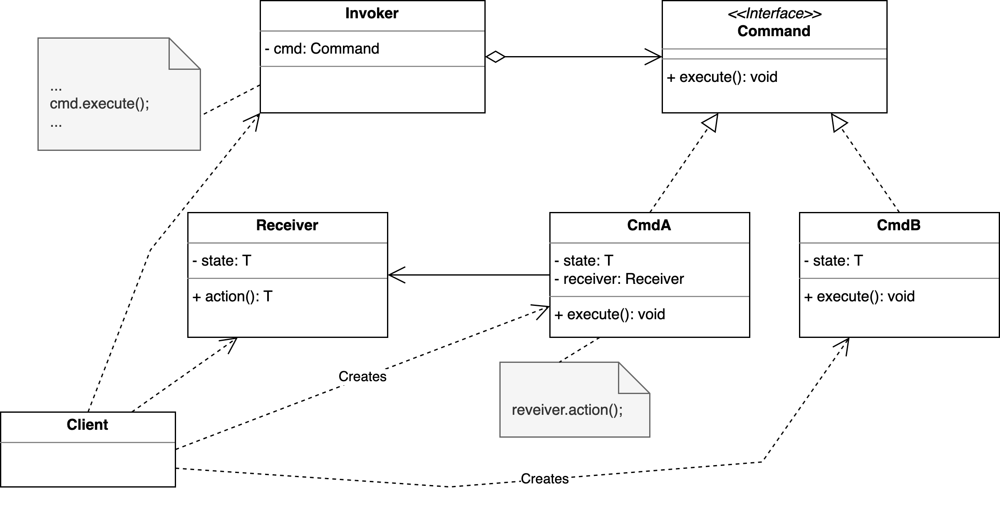

# Command-Pattern

> [!NOTE]
>
> <details open>
>
> <summary><strong>🎯 TL;DR</strong></summary>
>
> Das **Command-Pattern** ist die objektorientierte Antwort auf
> Callback-Funktionen: Man kapselt Befehle in einem Objekt.
>
> 1.  Die `Command`-Objekte haben eine Methode `execute()` und führen
>     dabei Aktion auf einem bzw. “ihrem” Receiver aus.
>
> 2.  `Receiver` sind Objekte, auf denen Aktionen ausgeführt werden, im
>     Dungeon könnten dies etwa Hero, Monster, … sein. Receiver müssen
>     keine der anderen Akteure in diesem Pattern kennen.
>
> 3.  Damit die `Command`-Objekte aufgerufen werden, gibt es einen
>     `Invoker`, der `Command`-Objekte hat und zu gegebener Zeit auf
>     diesen die Methode `execute()` aufruft. Der Invoker muss dabei die
>     konkreten Kommandos und die Receiver nicht kennen (nur die
>     `Command`-Schnittstelle).
>
> 4.  Zusätzlich gibt es einen `Client`, der die anderen Akteure kennt
>     und alles zusammen baut.
>
> </details>
>
> <details>
>
> <summary><strong>🎦 Videos</strong></summary>
>
> - [VL Command-Pattern](https://youtu.be/F7RJ7YCVMS4)
>
> </details>

## Motivation

Irgendwo im Dungeon wird es ein Objekt einer Klasse ähnlich wie
`InputHandler` geben mit einer Methode ähnlich zu `handleInput()`:

``` java
public class InputHandler {
    public void handleInput() {
        switch (keyPressed()) {
            case BUTTON_W -> hero.jump();
            case BUTTON_A -> hero.moveX();
            case ...
            default -> { ... }
        }
    }
}
```

Diese Methode wird je Frame einmal aufgerufen, um auf eventuelle
Benutzereingaben reagieren zu können. Je nach gedrücktem Button wird auf
dem Hero eine bestimmte Aktion ausgeführt …

Das funktioniert, ist aber recht unflexibel. Die Aktionen sind den
Buttons fest zugeordnet und erlauben keinerlei Konfiguration.

## Auflösen der starren Zuordnung über Zwischenobjekte

``` java
public interface Command { void execute(); }

public class Jump implements Command {
    private Entity e;
    public void execute() { e.jump(); }
}

public class InputHandler {
    private final Command wbutton = new Jump(hero);  // Über Ctor/Methoden setzen!
    private final Command abutton = new Move(hero);  // Über Ctor/Methoden setzen!

    public void handleInput() {
        switch (keyPressed()) {
            case BUTTON_W -> wbutton.execute();
            case BUTTON_A -> abutton.execute();
            case ...
            default -> { ... }
        }
    }
}
```

Die starre Zuordnung “Button : Aktion” wird aufgelöst und über
Zwischenobjekte konfigurierbar gemacht.

Für die Zwischenobjekte wird ein Typ `Command` eingeführt, der nur eine
`execute()`-Methode hat. Für jede gewünschte Aktion wird eine Klasse
davon abgeleitet, diese Klassen können auch einen Zustand pflegen.

Den Buttons wird nun an geeigneter Stelle (Konstruktor, Methoden, …) je
ein Objekt der jeweiligen Command-Unterklassen zugeordnet. Wenn ein
Button betätigt wird, wird auf dem Objekt die Methode `execute()`
aufgerufen.

Damit die Kommandos nicht nur auf den Helden wirken können, kann man den
Kommando-Objekten beispielsweise noch eine Entität mitgeben, auf der das
Kommando ausgeführt werden soll. Im Beispiel oben wurde dafür der `hero`
genutzt.

## Command: Objektorientierte Antwort auf Callback-Funktionen



Im Command-Pattern gibt es vier beteiligte Parteien: Client, Receiver,
Command und Invoker.

Ein Command ist die objektorientierte Abstraktion eines Befehls. Es hat
möglicherweise einen Zustand, und und kennt “seinen” Receiver und kann
beim Aufruf der `execute()`-Methode eine vorher verabredete Methode auf
diesem Receiver-Objekt ausführen.

Ein Receiver ist eine Klasse, die Aktionen durchführen kann. Sie kennt
die anderen Akteure nicht.

Der Invoker (manchmal auch “Caller” genannt) ist eine Klasse, die
Commands aggregiert und die die Commandos “ausführt”, indem hier die
`execute()`-Methode aufgerufen wird. Diese Klasse kennt nur das
`Command`-Interface und keine spezifischen Kommandos (also keine der
Sub-Klassen). Es kann zusätzlich eine gewisse Buchführung übernehmen,
etwa um eine Undo-Funktionalität zu realisieren.

Der Client ist ein Programmteil, der ein Command-Objekt aufbaut und
dabei einen passenden Receiver übergibt und der das Command-Objekt dann
zum Aufruf an den Invoker weiterreicht.

In unserem Beispiel lassen sich die einzelnen Teile so sortieren:

- Client: Klasse `InputHandler` (erzeugt neue `Command`-Objekte im
  obigen Code) bzw. `main()`, wenn man die `Command`-Objekte dort
  erstellt und an den Konstruktor von `InputHandler` weiterreicht
- Receiver: Objekt `hero` der Klasse `Hero` (auf diesem wird eine Aktion
  ausgeführt)
- Command: `Jump` und `Move`
- Invoker: `InputHandler` (in der Methode `handleInput()`)

## Undo

Wir könnten das `Command`-Interface um ein paar Methoden erweitern:

``` java
public interface Command {
    void execute();
    void undo();
    Command newCommand(Entity e);
}
```

Jetzt kann jedes Command-Objekt eine neue Instanz erzeugen mit der
Entity, die dann dieses Kommando empfangen soll:

``` java
public class Move implements Command {
    private Entity e;
    private int x, y, oldX, oldY;

    public void execute() { oldX = e.getX();  oldY = e.getY();  x = oldX + 42;  y = oldY;  e.moveTo(x, y); }
    public void undo() { e.moveTo(oldX, oldY); }
    public Command newCommand(Entity e) { return new Move(e); }
}

public class InputHandler {
    private final Command wbutton;
    private final Command abutton;
    private final Stack<Command> s = new Stack<>();

    public void handleInput() {
        Entity e = getSelectedEntity();
        switch (keyPressed()) {
            case BUTTON_W -> { s.push(wbutton.newCommand(e)); s.peek().execute(); }
            case BUTTON_A -> { s.push(abutton.newCommand(e)); s.peek().execute(); }
            case BUTTON_U -> s.pop().undo();
            case ...
            default -> { ... }
        }
    }
}
```

Über den Konstruktor von `InputHandler` (im Beispiel nicht gezeigt)
würde man wie vorher die `Command`-Objekte für die Buttons setzen. Es
würde aber in jedem Aufruf von `handleInput()` abgefragt, was gerade die
selektierte Entität ist und für diese eine neue Instanz des zur
Tastatureingabe passenden `Command`-Objekts erzeugt. Dieses wird nun in
einem Stack gespeichert und danach ausgeführt.

Wenn der Button “U” gedrückt wird, wird das letzte `Command`-Objekt aus
dem Stack genommen (Achtung: Im echten Leben müsste man erst einmal
schauen, ob hier noch was drin ist!) und auf diesem die Methode `undo()`
aufgerufen. Für das Kommando `Move` ist hier skizziert, wie ein Undo
aussehen könnte: Man muss einfach bei jedem `execute()` die alte
Position der Entität speichern, dann kann man sie bei einem `undo()`
wieder auf diese Position verschieben. Da für jeden Move ein neues
Objekt angelegt wird und dieses nur einmal benutzt wird, braucht man
keine weitere Buchhaltung …

## Wrap-Up

**Command-Pattern**: Kapsele Befehle in ein Objekt

- `Command`-Objekte haben eine Methode `execute()` und führen darin
  Aktion auf Receiver aus
- `Receiver` sind Objekte, auf denen Aktionen ausgeführt werden (Hero,
  Monster, …)
- `Invoker` hat `Command`-Objekte und ruft darauf `execute()` auf
- `Client` kennt alle und baut alles zusammen

**Objektorientierte Antwort auf Callback-Funktionen**

## 📖 Zum Nachlesen

- Gamma u. a. ([2011](#ref-Gamma2011))
- Nystrom ([2014, Kap. 2](#ref-Nystrom2014))

------------------------------------------------------------------------

> [!TIP]
>
> <details>
>
> <summary><strong>✅ Lernziele</strong></summary>
>
> - k2: Ich kann den Aufbau des Command-Patterns erklären
> - k3: Ich kann das Command-Pattern auf konkrete Beispiele, etwa den PM-Dungeon, anwenden
>
> </details>
>
> <details>
>
> <summary><strong>🏅 Challenges</strong></summary>
>
> Schreiben Sie für den `Dwarf` in den
> [Vorgaben](https://github.com/Programmiermethoden-CampusMinden/Prog2-Lecture/tree/master/lecture/pattern/src/challenges/command)
> einen Controller, welcher das Command-Pattern verwendet.
>
> - “W” führt Springen aus
> - “A” bewegt den Zwerg nach links
> - “D” bewegt den Zwerg nach rechts
> - “S” führt Ducken aus
>
> Schreiben Sie zusätzlich für den `Cursor` einen Controller, welcher
> das Command-Pattern mit Historie erfüllt (ebenfalls über die Tasten
> “W”, “A”, “S” und “D”).
>
> Schreiben Sie eine Demo, um die Funktionalität Ihres Programmes zu
> demonstrieren.
>
> </details>

------------------------------------------------------------------------

> [!NOTE]
>
> <details>
>
> <summary><strong>👀 Quellen</strong></summary>
>
> <div id="refs" class="references csl-bib-body hanging-indent"
> entry-spacing="0">
>
> <div id="ref-Gamma2011" class="csl-entry">
>
> Gamma, E., R. Helm, R. E. Johnson, und J. Vlissides. 2011. *Design
> Patterns*. Addison-Wesley.
>
> </div>
>
> <div id="ref-Nystrom2014" class="csl-entry">
>
> Nystrom, R. 2014. *Game Programming Patterns*. Genever Benning.
> <https://github.com/munificent/game-programming-patterns>.
>
> </div>
>
> </div>
>
> </details>

------------------------------------------------------------------------


Unless otherwise noted, this work is licensed under CC BY-SA 4.0.

<blockquote><p><sup><sub><strong>Last modified:</strong> df56b1c (lecture: remove explicit link to pdf version, 2025-07-23)<br></sub></sup></p></blockquote>
