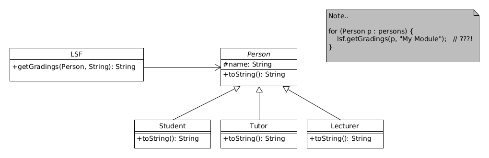
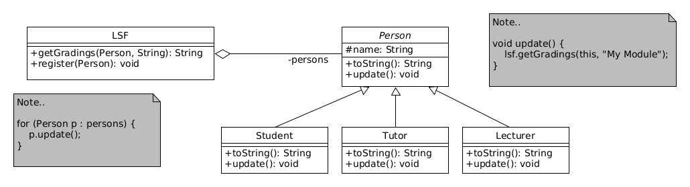
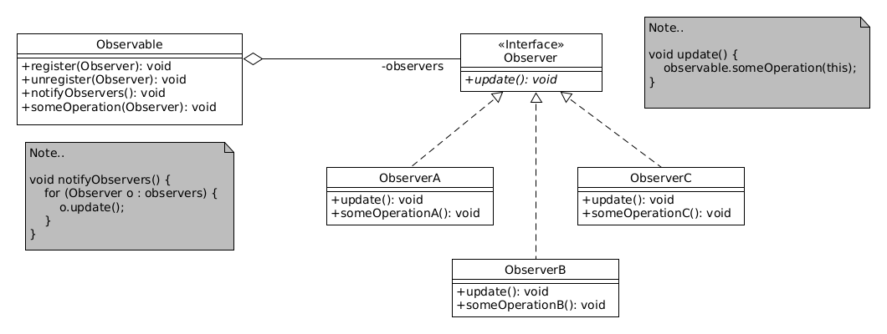

# Observer-Pattern

> [!NOTE]
>
> <details open>
>
> <summary><strong>🎯 TL;DR</strong></summary>
>
> Eine Reihe von Objekten möchte über eine Änderung in einem anderen
> (“zentralen”) Objekt informiert werden. Dazu könnte das “zentrale”
> Objekt eine Zugriffsmethode anbieten, die die anderen Objekte
> regelmäßig abrufen (“pollen”).
>
> Mit dem Observer-Pattern kann man das aktive Polling vermeiden. Die
> interessierten Objekte “registrieren” sich beim “zentralen” Objekt.
> Sobald dieses eine Änderung erfährt oder Informationen bereitstehen
> o.ä., wird das “zentrale” Objekt alle registrierten Objekte über den
> Aufruf einer Methode benachrichtigen. Dazu müssen diese eine
> gemeinsame Schnittstelle implementieren.
>
> Das “zentrale” Objekt, welches abgefragt wird, nennt man
> “*Observable*” oder “*Subject*”. Die Objekte, die die Information
> abfragen möchten, nennt man “*Observer*”.
>
> </details>
>
> <details>
>
> <summary><strong>🎦 Videos</strong></summary>
>
> - [VL Observer-Pattern](https://youtu.be/833lHcoxeog)
> - [Demo Observer-Pattern](https://youtu.be/0mgB8RfcNuM)
>
> </details>

## Verteilung der Prüfungsergebnisse



Die Studierenden möchten nach einer Prüfung wissen, ob für einen
bestimmten Kurs die/ihre Prüfungsergebnisse im LSF bereit stehen.

Dazu modelliert man eine Klasse `LSF` und implementiert eine
Abfragemethode, die dann alle Objekte regelmäßig aufrufen können. Dies
sieht dann praktisch etwa so aus:

``` java
final Person[] persons = { new Lecturer("Frau Holle"),
                           new Student("Heinz"),
                           new Student("Karla"),
                           new Tutor("Kolja"),
                           new Student("Wuppie") };
final LSF lsf = new LSF();

for (Person p : persons) {
    lsf.getGradings(p, "My Module");   // ???!
}
```

## Elegantere Lösung: Observer-Entwurfsmuster



Sie erstellen im `LSF` eine Methode `register()`, mit der sich
interessierte Objekte beim `LSF` registrieren können.

Zur Benachrichtigung der registrierten Objekte brauchen diese eine
geeignete Methode, die traditionell `update()` genannt wird.

<p align="right"><a href="https://github.com/Programmiermethoden-CampusMinden/Prog2-Lecture/tree/master/lecture/pattern/src/observer/">Demo: observer</a></p>

## Observer-Pattern verallgemeinert



Im vorigen Beispiel wurde die Methode `update()` einfach der gemeinsamen
Basisklasse `Person` hinzugefügt. Normalerweise möchte man die Aspekte
`Person` und `Observer` aber sauber trennen und definiert sich dazu ein
*separates* Interface `Observer` mit der Methode `update()`, die dann
alle “interessierten” Klassen (zusätzlich zur bestehenden
Vererbungshierarchie) implementieren.

Die Klasse für das zu beobachtende Objekt benötigt dann eine Methode
`register()`, mit der sich Observer registrieren können. Die
Objektreferenzen werden dabei einfach einer internen Sammlung
hinzugefügt.

Häufig findet sich dann noch eine Methode `unregister()`, mit der sich
bereits registrierte Beobachter wieder abmelden können. Weiterhin findet
man häufig eine Methode `notifyObservers()`, die man von außen auf dem
beobachteten Objekt aufrufen kann und die dann auf allen registrierten
Beobachtern deren Methoden `update()` aufruft. (Dieser Vorgang kann aber
auch durch eine sonstige Zustandsänderung im beobachteten Objekt
durchgeführt werden.)

In der Standarddefinition des Observer-Patterns nach ([Gamma u. a.
2011](#ref-Gamma2011)) werden beim Aufruf der Methode `update()` keine
Werte an die Beobachter mitgegeben. Der Beobachter muss sich
entsprechend eine eigene Referenz auf das beobachtete Objekt halten, um
dort dann weitere Informationen erhalten zu können. Dies kann
vereinfacht werden, indem das beobachtete Objekt beim Aufruf der
`update()`-Methode die Informationen als Parameter mitgibt,
beispielsweise eine Referenz auf sich selbst o.ä. … Dies muss dann
natürlich im `Observer`-Interface nachgezogen werden.

**Hinweis**: Es gibt in Swing bereits die Interfaces `Observer` und
`Observable`, die aber als “deprecated” gekennzeichnet sind.
Sinnvollerweise nutzen Sie nicht diese Interfaces aus Swing, sondern
implementieren Ihre eigenen Interfaces, wenn Sie das Observer-Pattern
einsetzen wollen!

## Wrap-Up

Observer-Pattern: Benachrichtige registrierte Objekte über
Statusänderungen

- Interface `Observer` mit Methode `update()`
- Interessierte Objekte
  1.  implementieren das Interface `Observer`
  2.  registrieren sich beim zu beobachtenden Objekt (`Observable`)
- Beobachtetes Objekt ruft auf allen registrierten Objekten `update()`
  auf
- `update()` kann auch Parameter haben

## 📖 Zum Nachlesen

- Nystrom ([2014, Kap. 4](#ref-Nystrom2014))
- Gamma u. a. ([2011](#ref-Gamma2011))

------------------------------------------------------------------------

> [!TIP]
>
> <details>
>
> <summary><strong>✅ Lernziele</strong></summary>
>
> - k2: Ich kenne den Aufbau des Observer-Patterns und kann dies an einem Beispiel erklären
> - k3: Ich kann das Observer-Pattern auf konkrete Beispiele (etwa den PM-Dungeon) anwenden
>
> </details>
>
> <details>
>
> <summary><strong>🏅 Challenges</strong></summary>
>
> **Observer: Restaurant**
>
> Stellen Sie sich ein Restaurant vor, in welchem man nicht eine
> komplette Mahlzeit bestellt, sondern aus einzelnen Komponenten
> auswählen kann. Die Kunden bestellen also die gewünschten Komponenten,
> suchen sich einen Tisch und warten auf die Fertigstellung ihrer
> Bestellung. Da die Küche leider nur sehr klein ist, werden immer alle
> Bestellungen einer bestimmten Komponente zusammen bearbeitet - also
> beispielsweise werden alle bestellten Salate angerichtet oder die alle
> bestellten Pommes-Portionen zubereitet. Sobald eine solche Komponente
> fertig ist, werden alle Kunden aufgerufen, die diese Komponente
> bestellt haben …
>
> Modellieren Sie dies in Java. Nutzen Sie dazu das Observer-Pattern,
> welches Sie ggf. leicht anpassen müssen.
>
> **Observer: Einzel- und Großhandel**
>
> In den
> [Vorgaben](https://github.com/Programmiermethoden-CampusMinden/Prog2-Lecture/tree/master/lecture/pattern/src/challenges/observer)
> finden Sie ein Modell für eine Lieferkette zwischen Großhandel und
> Einzelhandel.
>
> Wenn beim Einzelhändler eine Bestellung von einem Kunden eingeht
> (`Einzelhandel#bestellen`), speichert dieser den `Auftrag` zunächst in
> einer Liste ab. In regelmäßigen Abständen (`Einzelhandel#loop`) sendet
> der Einzelhändler die offenen Bestellungen an seinen Großhändler
> (`Grosshandel#bestellen`). Hat der Großhändler die benötigte Ware
> vorrätig, sendet er diese an den Einzelhändler
> (`Einzelhandel#empfangen`). Dieser kann dann den Auftrag gegenüber
> seinem Kunden erfüllen (keine Methode vorgesehen).
>
> Anders als der Einzelhandel speichert der Großhandel keine Aufträge
> ab. Ist die benötigte Ware bei einer Bestellung also nicht oder nicht
> in ausreichender Zahl auf Lager, wird diese nicht geliefert und der
> Einzelhandel muss (später) eine neue Bestellung aufgeben.
>
> Der Großhandel bekommt regelmäßig (`Grosshandel#loop`) neue Ware für
> die am wenigsten vorrätigen Positionen.
>
> Im aktuellen Modell wird der Einzelhandel nicht über den neuen
> Lagerbestand des Großhändlers informiert und kann daher nur “zufällig”
> neue Bestellanfragen an den Großhändler senden.
>
> Verbessern Sie das Modell, indem Sie das Observer-Pattern integrieren.
> Wer ist Observer? Wer ist Observable? Welche Informationen werden bei
> einem `update` mitgeliefert?
>
> Bauen Sie in alle Aktionen vom Einzelhändler und vom Großhändler
> passendes Logging ein.
>
> *Anmerkung*: Sie dürfen nur die Vorgaben-Klassen `Einzelhandel` und
> `Grosshandel` verändern, die anderen Vorgaben-Klassen dürfen Sie nicht
> bearbeiten. Sie können zusätzlich benötigte eigene Klassen/Interfaces
> implementieren.
>
> </details>

------------------------------------------------------------------------

> [!NOTE]
>
> <details>
>
> <summary><strong>👀 Quellen</strong></summary>
>
> <div id="refs" class="references csl-bib-body hanging-indent"
> entry-spacing="0">
>
> <div id="ref-Gamma2011" class="csl-entry">
>
> Gamma, E., R. Helm, R. E. Johnson, und J. Vlissides. 2011. *Design
> Patterns*. Addison-Wesley.
>
> </div>
>
> <div id="ref-Nystrom2014" class="csl-entry">
>
> Nystrom, R. 2014. *Game Programming Patterns*. Genever Benning.
> <https://github.com/munificent/game-programming-patterns>.
>
> </div>
>
> </div>
>
> </details>

------------------------------------------------------------------------


Unless otherwise noted, this work is licensed under CC BY-SA 4.0.

<blockquote><p><sup><sub><strong>Last modified:</strong> df56b1c (lecture: remove explicit link to pdf version, 2025-07-23)<br></sub></sup></p></blockquote>
