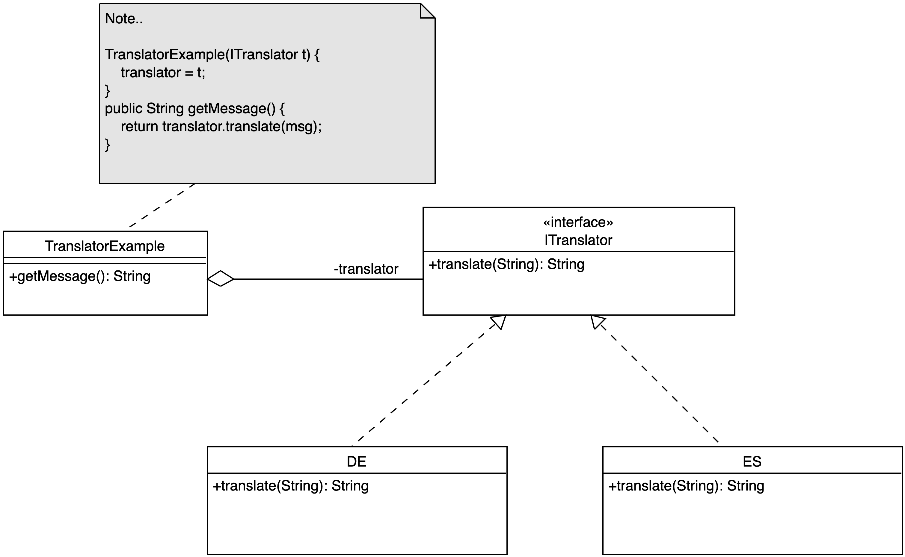

## Wie kann man das Verhalten einer Klasse dynamisch ändern?

{width="60%"}

::: notes
Modellierung unterschiedlicher Hunderassen: Jede Art bellt anders.

Es bietet sich an, die Hunderassen von einer gemeinsamen Basisklasse
`Hund` abzuleiten, um die Hundeartigkeit allgemein sicherzustellen.

Da jede Rasse anders bellen soll, muss jedes Mal die Methode `bellen`
überschrieben werden. Das ist relativ aufwändig und fehleranfällig.
Außerdem kann man damit nicht modellieren, dass es beispielsweise
auch konkrete Bulldoggen geben mag, die nur leise fiepen ...
:::


## Lösung: Delegation der Aufgabe an geeignetes Objekt

{width="80%"}

::: notes
Der `Hund` delegiert das Verhalten beim Bellen an ein Objekt,
welches beispielsweise bei der Instantiierung der Klasse übergeben
wurde (oder später über einen Setter). D.h. die Methode `Hund#bellen`
bellt nicht mehr selbst, sondern ruft auf einem passenden Objekt
eine vereinbarte Methode auf.

Dieses passende Objekt ist hier im Beispiel vom Typ `Bellen` und
hat eine Methode `bellen` (Interface). Die verschiedenen Bell-Arten
kann man über eigene Klassen implementieren, die das Interface
einhalten.

Damit braucht man in den Klassen für die Hunderassen die Methode
`bellen` nicht jeweils neu überschreiben, sondern muss nur bei
der Instantiierung eines Hundes ein passendes `Bellen`-Objekt
mitgeben.

Als netten Nebeneffekt kann man so auch leicht eine konkrete
Bulldogge realisieren, die eben nicht fies knurrt, sondern
leise fiept ...
:::

\bigskip

Entwurfsmuster: [**Strategy Pattern**]{.alert}


::: notes
## Exkurs UML: Assoziation vs. Aggregation vs. Komposition

Eine **Assoziation** beschreibt eine Beziehung zwischen zwei (oder mehr)
UML-Elementen (etwa Klassen oder Interfaces).

Eine **Aggregation** (leere Raute) ist eine Assoziation, die eine
_Teil-Ganzes-Beziehung_ hervorhebt. Teile können dabei ohne das Ganze
existieren (Beispiel: Personen als Partner in einer Ehe-Beziehung).
D.h. auf der einbindenden Seite (mit der leeren Raute) hat man implizit
`0..*` stehen.

Eine **Komposition** (volle Raute) ist eine Assoziation, die eine
Teil-Ganzes-Beziehung hervorhebt. Teile können aber nicht ohne das Ganze
existieren (Beispiel: Gebäude und Stockwerke: Ein Gebäude besteht aus
Stockwerken, die ohne das Gebäude aber nicht existieren.). D.h. auf der
einbindenden Seite (mit der vollen Raute) steht implizit eine `1` (ein
Stockwerk gehört genau zu einem Gebäude, ein Gebäude besteht aber aus
mehreren Stockwerken).

Siehe auch [Aggregation](https://de.wikipedia.org/wiki/Aggregation_(Informatik)),
[Assoziation](https://de.wikipedia.org/wiki/Assoziation_(UML)#Aggregation_und_Komposition)
und [Klassendiagramm](https://de.wikipedia.org/wiki/Klassendiagramm).
:::


::: notes
## Zweites Beispiel: Sortieren einer Liste von Studis

Sortieren einer Liste von Studis: `Collections.sort` kann eine Liste
nach einem Default-Kriterium sortieren oder aber über einen extra
`Comparator` nach benutzerdefinierten Kriterien ... Das Verhalten der
Sortiermethode wird also quasi an dieses Comparator-Objekt delegiert ...

```java
public class Studi {
    private String name;
    public Studi(String name) { this.name = name; }

    public static void main(String[] args) {
        List<Studi> list = new ArrayList<Studi>();
        list.add(new Studi("Klaas"));
        list.add(new Studi("Hein"));
        list.add(new Studi("Pit"));

        // Sortieren der Liste (Standard-Reihenfolge)?!
        // Sortieren der Liste (eigene Reihenfolge)?!
    }
}
```

[Konsole strategy.SortDefault, strategy.SortOwnCrit]{.bsp href="https://github.com/Programmiermethoden-CampusMinden/Prog2-Lecture/tree/master/lecture/pattern/src/strategy/"}

_Anmerkung_:
Die Interfaces `Comparable` und `Comparator` und deren Nutzung wurde(n) in
OOP besprochen. Anonyme Klassen wurden ebenfalls in OOP besprochen. Bitte
lesen Sie dies noch einmal in der Semesterliteratur nach, wenn Sie hier
unsicher sind!
:::


## Hands-On: Strategie-Muster

Implementieren Sie das Strategie-Muster für eine Übersetzungsfunktion:

\smallskip

*   Eine Klasse liefert eine Nachricht (`String`) mit `getMessage()` zurück.
*   Diese Nachricht ist in der Klasse in Englisch implementiert.
*   Ein passendes Übersetzerobjekt soll die Nachricht beim Aufruf der Methode
    `getMessage()` \newline in die Ziel-Sprache übersetzen.

\bigskip
\bigskip

[Fragen:]{.notes}

1.  Wie muss das Pattern angepasst werden?
2.  Wie sieht die Implementierung aus?


::: notes
## Auflösung

{width="80%"}
:::

[Konsole strategy.TranslatorExample]{.bsp href="https://github.com/Programmiermethoden-CampusMinden/Prog2-Lecture/blob/master/lecture/pattern/src/strategy/TranslatorExample.java"}


## Wrap-Up

Strategy-Pattern: Verhaltensänderung durch Delegation an passendes Objekt

\smallskip

*   Interface oder abstrakte Klasse als Schnittstelle
*   Konkrete Klassen implementieren Schnittstelle => konkrete Strategien
*   Zur Laufzeit Instanz dieser Klassen übergeben (Aggregation) ...
*   ... und nutzen (Delegation)
