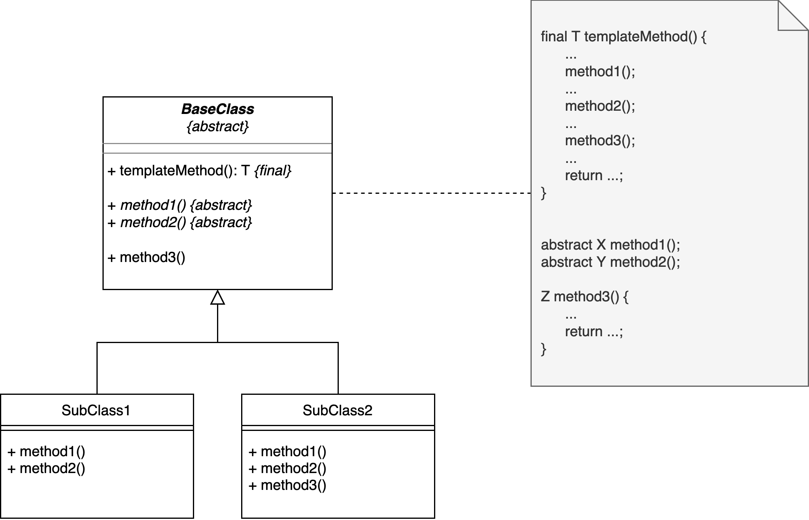

## Motivation: Syntax-Highlighting im Tokenizer

::: notes
In einem Compiler ist meist der erste Arbeitsschritt, den Eingabestrom in einzelne
Token aufzubrechen. Dies sind oft die verschiedenen Schlüsselwörter, Operationen,
Namen von Variablen, Methoden, Klassen etc. ... Aus der Folge von Zeichen (also dem
eingelesenen Programmcode) wird ein Strom von Token, mit dem die nächste Stufe im
Compiler dann weiter arbeiten kann.
:::

```{.java size="footnotesize"}
public class Lexer {
    private final List<Token> allToken;  // alle verfügbaren Token-Klassen

    public List<Token> tokenize(String string) {
        List<Token> result = new ArrayList<>();

        while (string.length() > 0) {
            for (Token t : allToken) {
                Token token = t.match(string);
                if (token != null) {
                    result.add(token);
                    string = string.substring(token.getContent().length(), string.length());
                }
            }
        }

        return result;
    }
}
```

::: notes
Dazu prüft man jedes Token, ob es auf den aktuellen Anfang des Eingabestroms passt.
Wenn ein Token passt, erzeugt man eine Instanz dieser Token-Klasse und speichert darin
den gematchten Eingabeteil, den man dann vom Eingabestrom entfernt. Danach geht man
in die Schleife und prüft wieder alle Token ... bis irgendwann der Eingabestrom leer
ist und man den gesamten eingelesenen Programmcode in eine dazu passende Folge von
Token umgewandelt hat.

_Anmerkung_: Abgesehen von fehlenden Javadoc etc. hat das obige Code-Beispiel mehrere
Probleme: Man würde im realen Leben nicht mit `String`, sondern mit einem Zeichenstrom
arbeiten. Außerdem fehlt noch eine Fehlerbehandlung, wenn nämlich keines der Token in
der Liste `allToken` auf den aktuellen Anfang des Eingabestroms passt.
:::


## Token-Klassen mit formatiertem Inhalt

::: notes
Um den eigenen Tokenizer besser testen zu können, wurde beschlossen, dass jedes Token
seinen Inhalt als formatiertes HTML-Schnipsel zurückliefern soll. Damit kann man dann
alle erkannten Token formatiert ausgeben und erhält eine Art Syntax-Highlighting für
den eingelesenen Programmcode.
:::

```{.java size="footnotesize"}
public abstract class Token {
    protected String content;

    abstract protected String getHtml();
}
public class KeyWord extends Token {
    @Override
    protected String getHtml() {
        return "<font color=\"red\"><b>" +  this.content + "</b></font>";
    }
}
public class StringContent extends Token {
    @Override
    protected String getHtml() {
        return "<font color=\"green\">" +  this.content + "</font>";
    }
}


Token t = new KeyWord();
LOG.info(t.getHtml());
```

::: notes
In der ersten Umsetzung erhält die Basisklasse `Token` eine weitere abstrakte
Methode, die jede Token-Klasse implementieren muss und in der die Token-Klassen
einen String mit dem Token-Inhalt und einer Formatierung für HTML zurückgeben.

Dabei fällt auf, dass der Aufbau immer gleich ist: Es werden ein oder mehrere
Tags zum Start der Format-Sequenz mit dem Token-Inhalt verbunden, gefolgt mit
einem zum verwendeten startenden HTML-Format-Tag passenden End-Tag.

Auch wenn die Inhalte unterschiedlich sind, sieht das stark nach einer Verletzung
von DRY aus ...
:::


## Don't call us, we'll call you

```{.java size="footnotesize"}
public abstract class Token {
    protected String content;

    public final String getHtml() {
        return htmlStart() + this.content + htmlEnd();
    }

    abstract protected String htmlStart();
    abstract protected String htmlEnd();
}
public class KeyWord extends Token {
    @Override protected String htmlStart() { return "<font color=\"red\"><b>"; }
    @Override protected String htmlEnd() { return "</b></font>"; }
}
public class StringContent extends Token {
    @Override protected String htmlStart() { return "<font color=\"green\">"; }
    @Override protected String htmlEnd() { return "</font>"; }
}


Token t = new KeyWord();
LOG.info(t.getHtml());
```

::: notes
Wir können den Spaß einfach umdrehen (["inversion of control"](https://en.wikipedia.org/wiki/Inversion_of_control))
und die Methode zum Zusammenbasteln des HTML-Strings bereits in der Basisklasse
implementieren. Dazu "rufen" wir dort drei Hilfsmethoden auf, die die jeweiligen
Bestandteile des Strings (Format-Start, Inhalt, Format-Ende) erzeugen und deren
konkrete Implementierung wir in der Basisklasse nicht kennen. Dies ist dann Sache
der ableitenden konkreten Token-Klassen.

Objekte vom Typ `KeyWord` sind dank der Vererbungsbeziehung auch `Token` (Vererbung:
_is-a-Beziehung_). Wenn man nun auf einem `Token t` die Methode `getHtml()` aufruft,
wird zur Laufzeit geprüft, welchen Typ `t` tatsächlich hat (im Beispiel `KeyWord`).
Methodenaufrufe werden dann mit den am tiefsten in der vorliegenden Vererbungshierarchie
implementierten Methoden durchgeführt: Hier wird also die von `Token` geerbte Methode
`getHtml()` in `KeyWord` aufgerufen, die ihrerseits die Methoden `htmlStart()` und
`htmlEnd()` aufruft. Diese sind in `KeyWord` implementiert und liefern nun die passenden
Ergebnisse.

Die Methode `getHtml()` wird auch als "_Template-Methode_" bezeichnet. Die beiden darin
aufgerufenen Methoden `htmlStart()` und `htmlEnd()` in `Token` werden auch als "Hilfsmethoden"
(oder "_Helper Methods_") bezeichnet.

Dies ist ein Beispiel für das **[Template-Method-Pattern](https://en.wikipedia.org/wiki/Template_method_pattern)**.
:::


## Template-Method-Pattern

{width="80%" web_width="50%"}

::: notes
### Aufbau Template-Method-Pattern

In der Basisklasse implementiert man eine Template-Methode (in der Skizze `templateMethod`),
die sich auf anderen in der Basisklasse deklarierten (Hilfs-) Methoden "abstützt" (diese also
aufruft; in der Skizze `method1`, `method2`, `method3`). Diese Hilfsmethoden können als
`abstract` markiert werden und müssen dann von den ableitenden Klassen implementiert werden
(in der Skizze `method1` und `method2`). Man kann aber auch einige/alle dieser aufgerufenen
Hilfsmethoden in der Basisklasse implementieren (beispielsweise mit einem leeren Body - sogenannte
"Hook"-Methoden) und die ableitenden Klassen _können_ dann diese Methoden überschreiben und das
Verhalten so neu formulieren (in der Skizze `method3`).

Damit werden Teile des Verhaltens an die ableitenden Klassen ausgelagert.

### Verwandtschaft zum Strategy-Pattern

Das Template-Method-Pattern hat eine starke Verwandtschaft zum Strategy-Pattern.

Im Strategy-Pattern haben wir Verhalten komplett an andere Objekte _delegiert_, indem wir in
einer Methode einfach die passende Methode auf dem übergebenen Strategie-Objekt aufgerufen haben.

Im Template-Method-Pattern nutzen wir statt Delegation die Mechanismen Vererbung und dynamische
Polymorphie und definieren in der Basis-Klasse abstrakte oder Hook-Methoden, die wir bereits in
der Template-Methode der Basis-Klasse aufrufen. Damit ist das grobe Verhalten in der Basis-Klasse
festgelegt, wird aber in den ableitenden Klassen durch das dortige Definieren oder Überschreiben
der Hilfsmethoden verfeinert. Zur Laufzeit werden dann durch die dynamische Polymorphie die
tatsächlich implementierten Hilfsmethoden in den ableitenden Klassen aufgerufen. Damit lagert man
im Template-Method-Pattern gewissermaßen nur Teile des Verhaltens an die ableitenden Klassen aus.
:::


## Wrap-Up

Template-Method-Pattern: Verhaltensänderung durch Vererbungsbeziehungen

\smallskip

*   Basis-Klasse:
    *   Template-Methode, die Verhalten definiert und Hilfsmethoden aufruft
    *   Hilfsmethoden: Abstrakte Methoden (oder "Hook": Basis-Implementierung)
*   Ableitende Klassen: Verfeinern Verhalten durch Implementieren der Hilfsmethoden
*   Zur Laufzeit: Dynamische Polymorphie: Aufruf der Template-Methode nutzt
    die im tatsächlichen Typ des Objekts implementierten Hilfsmethoden


<!-- DO NOT REMOVE - THIS IS A LAST SLIDE TO INDICATE THE LICENSE AND POSSIBLE EXCEPTIONS (IMAGES, ...). -->
::: slides
## LICENSE


Unless otherwise noted, this work is licensed under CC BY-SA 4.0.
:::
