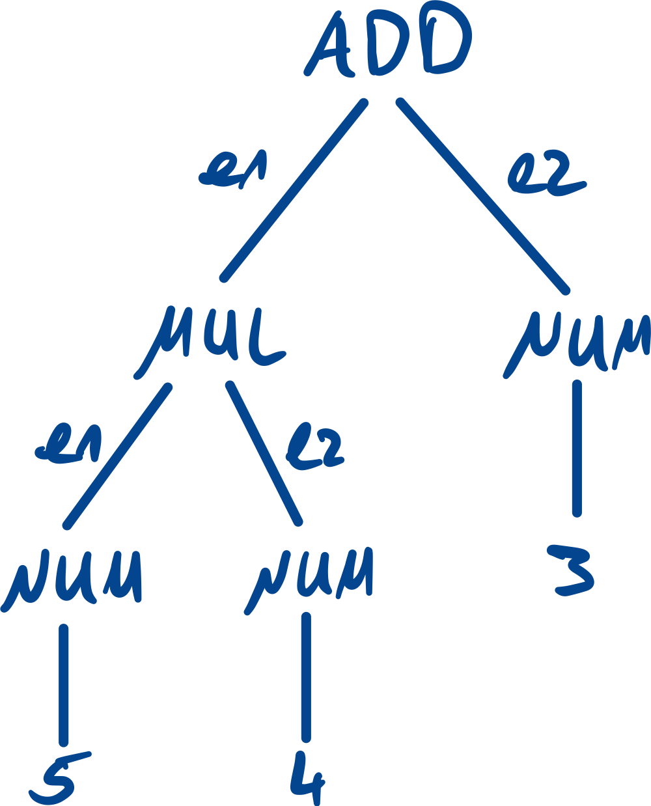
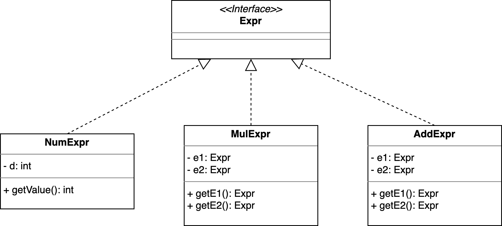
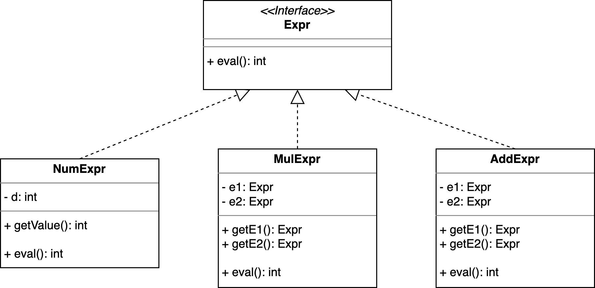
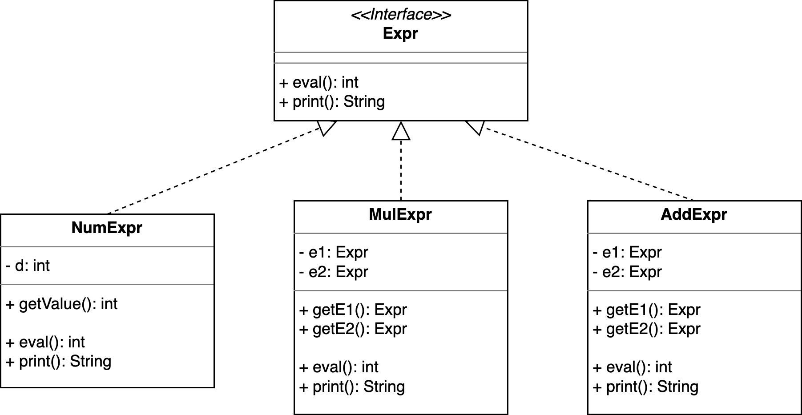
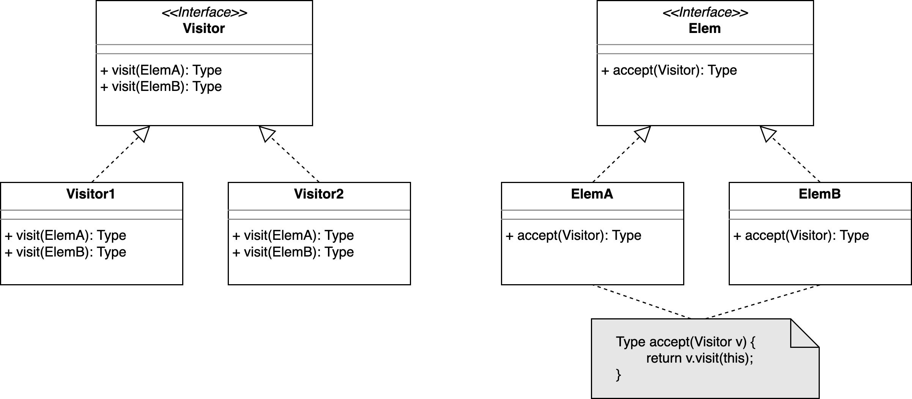
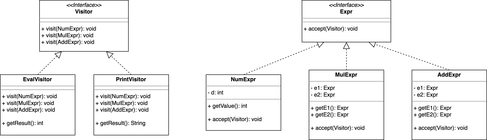

::: tldr
Häufig bietet es sich bei Datenstrukturen an, die Traversierung nicht direkt in den
Klassen der Datenstrukturen zu implementieren, sondern in Hilfsklassen zu verlagern.
Dies gilt vor allem dann, wenn die Datenstruktur aus mehreren Klassen besteht (etwa
ein Baum mit verschiedenen Knotentypen) und/oder wenn man nicht nur eine
Traversierungsart ermöglichen will oder/und wenn man immer wieder neue Arten der
Traversierung ergänzen will. Das würde nämlich bedeuten, dass man für jede weitere
Form der Traversierung in *allen* Klassen eine entsprechende neue Methode
implementieren müsste.

Das Visitor-Pattern lagert die Traversierung in eigene Klassenstruktur aus.

Die Klassen der Datenstruktur bekommen nur noch eine `accept()`-Methode, in der ein
Visitor übergeben wird und rufen auf diesem Visitor einfach dessen `visit()`-Methode
auf (mit einer Referenz auf sich selbst als Argument).

Der Visitor hat für jede Klasse der Datenstruktur eine Überladung der
`visit()`-Methode. In diesen kann er je nach Klasse die gewünschte Verarbeitung
vornehmen. Üblicherweise gibt es ein Interface oder eine abstrakte Klasse für die
Visitoren, von denen dann konkrete Visitoren ableiten.

Bei Elementen mit "Kindern" muss man sich entscheiden, wie die Traversierung
implementiert werden soll. Man könnte in der `accept()`-Methode den Visitor an die
Kinder weiter reichen (also auf den Kindern `accept()` mit dem Visitor aufrufen),
bevor man die `visit()`-Methode des Visitors mit sich selbst als Referenz aufruft.
Damit ist die Form der Traversierung in den Klassen der Datenstruktur fest verankert
und über den Visitor findet "nur" noch eine unterschiedliche Form der Verarbeitung
statt. Alternativ überlässt man es dem Visitor, die Traversierung durchzuführen: Hier
muss in den `visit()`-Methoden für die einzelnen Elemente entsprechend auf mögliche
Kinder reagiert werden.

In diesem Pattern findet ein sogenannter "Double-Dispatch" statt: Zur Laufzeit wird
ein konkreter Visitor instantiiert und über `accept()` an ein Element der
Datenstruktur übergeben. Dort ist zur Compile-Zeit aber nur der Obertyp der Visitoren
bekannt, d.h. zur Laufzeit wird hier der konkrete Typ bestimmt und entsprechend die
richtige `visit()`-Methode auf der "echten" Klasse des Visitors aufgerufen (erster
Dispatch). Da im Visitor die `visit()`-Methoden für jeden Typ der Datenstrukur
überladen sind, findet nun zur Laufzeit die Auflösung der korrekten Überladung statt
(zweiter Dispatch).

Das Pattern wird traditionell gern für die Traversierung von Datenstrukturen
eingesetzt. Es hilft aber auch, wenn man einer gewissen Anzahl von Klassen je eine
neue Hilfsmethode hinzufügen möchte - normalerweise müsste man jetzt jede Klasse
einzeln ergänzen. Mit dem Visitor-Pattern muss lediglich ein neuer Visitor mit den
Hilfsmethoden implementiert werden.
:::

::: youtube
-   [VL Visitor-Pattern](https://youtu.be/zW_2oQmjp8M)
-   [Demo Visitor-Pattern (Part I: Traversierung ohne
    Visitor)](https://youtu.be/9dvcufpyQdw)
-   [Demo Visitor-Pattern (Part II: Traversierung mit
    Visitor)](https://youtu.be/4rBRkXKhuN4)
:::

# Motivation: Parsen von "5\*4+3"

::::::: columns
:::: {.column width="50%"}
::: notes
Zum Parsen von Ausdrücken (*Expressions*) könnte man diese einfache Grammatik
einsetzen. Ein Ausdruck ist dabei entweder ein einfacher Integer oder eine Addition
oder Multiplikation zweier Ausdrücke.
:::

``` yacc
expr : e1=expr '*' e2=expr      # MUL
     | e1=expr '+' e2=expr      # ADD
     | INT                      # NUM
     ;
```
::::

:::: {.column width="40%"}
::: notes
Beim Parsen von "5\*4+3" würde dabei der folgende Parsetree entstehen:
:::

{width="50%" web_width="20%"}
::::
:::::::

# Strukturen für den Parsetree

{width="70%"}

::: notes
Der Parsetree für diese einfache Grammatik ist ein Binärbaum. Die Regeln werden auf
Knoten im Baum zurückgeführt. Es gibt Knoten mit zwei Kindknoten, und es gibt Knoten
ohne Kindknoten ("Blätter").

Entsprechend kann man sich einfache Klassen definieren, die die verschiedenen Knoten
in diesem Parsetree repräsentieren. Als Obertyp könnte es ein (noch leeres) Interface
`Expr` geben.

``` java
public interface Expr {}

public class NumExpr implements Expr {
    private final int d;

    public NumExpr(int d) { this.d = d; }
}

public class MulExpr implements Expr {
    private final Expr e1;
    private final Expr e2;

    public MulExpr(Expr e1, Expr e2) {
        this.e1 = e1;  this.e2 = e2;
    }
}

public class AddExpr implements Expr {
    private final Expr e1;
    private final Expr e2;

    public AddExpr(Expr e1, Expr e2) {
        this.e1 = e1;  this.e2 = e2;
    }
}


public class DemoExpr {
    public static void main(final String... args) {
        // 5*4+3
        Expr e = new AddExpr(new MulExpr(new NumExpr(5), new NumExpr(4)), new NumExpr(3));
    }
}
```
:::

# Ergänzung I: Ausrechnen des Ausdrucks

::: notes
Es wäre nun schön, wenn man mit dem Parsetree etwas anfangen könnte. Vielleicht
möchte man den Ausdruck ausrechnen?
:::

{width="70%"}

::: notes
Zum Ausrechnen des Ausdrucks könnte man dem Interface eine `eval()`-Methode
spendieren. Jeder Knoten kann für sich entscheiden, wie die entsprechende Operation
ausgewertet werden soll: Bei einer `NumExpr` ist dies einfach der gespeicherte Wert,
bei Addition oder Multiplikation entsprechend die Addition oder Multiplikation der
Auswertungsergebnisse der beiden Kindknoten.

``` java
public interface Expr {
    int eval();
}

public class NumExpr implements Expr {
    private final int d;

    public NumExpr(int d) { this.d = d; }
    public int eval() { return d; }
}

public class MulExpr implements Expr {
    private final Expr e1;
    private final Expr e2;

    public MulExpr(Expr e1, Expr e2) {
        this.e1 = e1;  this.e2 = e2;
    }
    public int eval() { return e1.eval() * e2.eval(); }
}

public class AddExpr implements Expr {
    private final Expr e1;
    private final Expr e2;

    public AddExpr(Expr e1, Expr e2) {
        this.e1 = e1;  this.e2 = e2;
    }
    public int eval() { return e1.eval() + e2.eval(); }
}


public class DemoExpr {
    public static void main(final String... args) {
        // 5*4+3
        Expr e = new AddExpr(new MulExpr(new NumExpr(5), new NumExpr(4)), new NumExpr(3));

        int erg = e.eval();
    }
}
```
:::

# Ergänzung II: Pretty-Print des Ausdrucks

::: notes
Nachdem das Ausrechnen so gut geklappt hat, will der Chef nun noch flink eine
Funktion, mit der man den Ausdruck hübsch ausgeben kann:
:::

{width="70%"}

::: notes
Das fängt an, sich zu wiederholen. Wir implementieren immer wieder ähnliche
Strukturen, mit denen wir diesen Parsetree traversieren ... Und wir müssen für *jede*
Erweiterung immer *alle* Expression-Klassen anpassen!

[Beispiel: direct.DemoExpr]{.ex
href="https://github.com/Programmiermethoden-CampusMinden/Prog2-Lecture/blob/master/lecture/pattern/src/visitor/direct/DemoExpr.java"}
:::

\vfill

**Das geht besser.**

# Visitor-Pattern (Besucher-Entwurfsmuster)

{web_width="80%"}

[[Hinweis: Implementierungsdetail Traversierung]{.ex}]{.slides}

:::: notes
Das Entwurfsmuster "Besucher" (*Visitor Pattern*) lagert die Aktion beim Besuchen
eines Knotens in eine separate Klasse aus.

Dazu bekommt jeder Knoten im Baum eine neue Methode, die einen Besucher akzeptiert.
Dieser Besucher kümmert sich dann um die entsprechende Verarbeitung des Knotens, also
um das Auswerten oder Ausgeben im obigen Beispiel.

Die Besucher haben eine Methode, die für jeden zu bearbeitenden Knoten überladen
wird. In dieser Methode findet dann die eigentliche Verarbeitung statt: Auswerten des
Knotens oder Ausgeben des Knotens ...

``` java
public interface Expr {
    void accept(ExprVisitor v);
}

public class NumExpr implements Expr {
    private final int d;

    public NumExpr(int d) { this.d = d; }
    public int getValue() { return d; }

    public void accept(ExprVisitor v) { v.visit(this); }
}

public class MulExpr implements Expr {
    private final Expr e1;
    private final Expr e2;

    public MulExpr(Expr e1, Expr e2) {
        this.e1 = e1;  this.e2 = e2;
    }
    public Expr getE1() { return e1; }
    public Expr getE2() { return e2; }

    public void accept(ExprVisitor v) { v.visit(this); }
}

public class AddExpr implements Expr {
    private final Expr e1;
    private final Expr e2;

    public AddExpr(Expr e1, Expr e2) {
        this.e1 = e1;  this.e2 = e2;
    }
    public Expr getE1() { return e1; }
    public Expr getE2() { return e2; }

    public void accept(ExprVisitor v) { v.visit(this); }
}


public interface ExprVisitor {
    void visit(NumExpr e);
    void visit(MulExpr e);
    void visit(AddExpr e);
}

public class EvalVisitor implements ExprVisitor {
    private final Stack<Integer> erg = new Stack<>();

    public void visit(NumExpr e) { erg.push(e.getValue()); }
    public void visit(MulExpr e) {
        e.getE1().accept(this);  e.getE2().accept(this);
        erg.push(erg.pop() * erg.pop());
    }
    public void visit(AddExpr e) {
        e.getE1().accept(this);  e.getE2().accept(this);
        erg.push(erg.pop() + erg.pop());
    }
    public int getResult() { return erg.peek(); }
}

public class PrintVisitor implements ExprVisitor {
    private final Stack<String> erg = new Stack<>();

    public void visit(NumExpr e) { erg.push("NumExpr(" + e.getValue() + ")"); }
    public void visit(MulExpr e) {
        e.getE1().accept(this);  e.getE2().accept(this);
        erg.push("MulExpr(" + erg.pop() + ", " + erg.pop() + ")");
    }
    public void visit(AddExpr e) {
        e.getE1().accept(this);  e.getE2().accept(this);
        erg.push("AddExpr(" + erg.pop() + ", " + erg.pop() + ")");
    }
    public String getResult() { return erg.peek(); }
}


public class DemoExpr {
    public static void main(final String... args) {
        // 5*4+3
        Expr e = new AddExpr(new MulExpr(new NumExpr(5), new NumExpr(4)), new NumExpr(3));

        EvalVisitor v1 = new EvalVisitor();
        e.accept(v1);
        int erg = v1.getResult();

        PrintVisitor v2 = new PrintVisitor();
        e.accept(v2);
        String s = v2.getResult();
    }
}
```

## Implementierungsdetail

In den beiden Klasse `AddExpr` und `MulExpr` müssen auch die beiden Kindknoten
besucht werden, d.h. hier muss der Baum weiter traversiert werden.

Man kann sich überlegen, diese Traversierung in den Klassen `AddExpr` und `MulExpr`
selbst anzustoßen.

Alternativ könnte auch der Visitor die Traversierung vornehmen. Gerade bei der
Traversierung von Datenstrukturen ist diese Variante oft von Vorteil, da man hier
unterschiedliche Traversierungsarten haben möchte (Breitensuche vs. Tiefensuche,
Pre-Order vs. Inorder vs. Post-Order, ...) und diese elegant in den Visitor verlagern
kann.

[Beispiel Traversierung intern (in den Knotenklassen):
visitor.visit.intrav.DemoExpr]{.ex
href="https://github.com/Programmiermethoden-CampusMinden/Prog2-Lecture/blob/master/lecture/pattern/src/visitor/visit/intrav/DemoExpr.java"}

[Beispiel Traversierung extern (im Visitor): visitor.visit.extrav.DemoExpr]{.ex
href="https://github.com/Programmiermethoden-CampusMinden/Prog2-Lecture/blob/master/lecture/pattern/src/visitor/visit/extrav/DemoExpr.java"}

## (Double-) Dispatch

::: tip
Zur Laufzeit wird in `accept()` mit dem Aufruf von `visit()` der konkrete Typ des
Visitors aufgelöst und dann für `visit(this)` durch den Typ der besuchten Klasse
(`this`) die korrekte Überladung ausgewählt. Dies nennt man auch
"**Double-Dispatch**".
:::

In den `accept()`-Methoden der besuchten Klassen ist nur der gemeinsame Obertyp der
Visitoren bekannt. Dies ist wichtig, weil man sonst ja für jeden neuen Visitor neue
passende `accept()`-Methoden in allen zu besuchenden Klassen implementieren müsste!

Zur Laufzeit wird hier ein konkreter Visitor (also ein Objekt von einem Untertyp der
Visitoren-Oberklasse) als Parameter übergeben.

Beim Aufruf von `visit(this)` in der `accept()`-Methode des besuchten Objekts wird
durch die Laufzeitumgebung der tatsächliche konkrete Typ des Visitors bestimmt und
die in der Typhierarchie in Bezug auf den Typ des Visitors "tiefste" Implementierung
der `visit`-Methode (also die Implementierung in der Visitorklasse selbst oder, falls
dort nicht vorhanden, in der jeweils nächsthöheren Elternklasse). Über das Argument
`this` wird die tatsächliche konkrete Klasse des besuchten Objekts ermittelt, so dass
die passende Überladung der `visit`-Methode im konkreten Visitor ausgewählt und
aufgerufen werden kann.

## Hinweis I

Man könnte nun versucht sein, eine dieser zwei Stufen zu überspringen - man könnte ja
die `visit`-Methode des `EvalVisitors` direkt aufrufen und dabei die Wurzel des Baums
(das Objekt `e`) übergeben.

``` java
// Beispiel von oben (Ausschnitt)
Expr e = new AddExpr(new MulExpr(new NumExpr(5), new NumExpr(4)), new NumExpr(3));
EvalVisitor v = new EvalVisitor();
e.accept(v);

// Direkter Aufruf - Autsch?!
v.visit(e);
```

Fragen Sie sich selbst: Kann das funktionieren? Was ist die Begründung?

## Hinweis II

Man könnte versucht sein, die `accept()`-Methode aus den Knotenklassen in die
gemeinsame Basisklasse zu verlagern: Statt

``` java
    public void accept(ExprVisitor v) {
        v.visit(this);
    }
```

in *jeder* Knotenklasse einzeln zu definieren, könnte man das doch *einmalig* in der
Basisklasse definieren:

``` java
public abstract class Expr {
    /** Akzeptiere einen Visitor für die Verarbeitung */
    public void accept(ExprVisitor v) {
        v.visit(this);
    }
}
```

Dies wäre tatsächlich schön, weil man so Code-Duplizierung vermeiden könnte. Aber es
funktioniert in Java leider nicht. (Warum?)

## Hinweis III

Während die `accept()`-Methode nicht in die Basisklasse der besuchten Typen (im Bild
oben die Klasse `Elem` bzw. im Beispiel oben die Klasse `Expr`) verlagert werden
kann, kann man die `visit()`-Methoden im Interface `Visitor` durchaus als
Default-Methoden im Interface implementieren.
::::

# Ausrechnen des Ausdrucks mit einem Visitor



[Demo: visitor.visit.extrav.DemoExpr]{.ex
href="https://github.com/Programmiermethoden-CampusMinden/Prog2-Lecture/blob/master/lecture/pattern/src/visitor/visit/extrav/DemoExpr.java"}

::: notes
# Diskussion

In der typischen OO-Denkweise geht man davon aus, dass man eher neue Klassen über
Vererbung hinzufügt als dass man in einer bestehenden Vererbungshierarchie in jeder
der beteiligten Klassen neue Methoden einbaut. Man leitet einfach von der gewünschten
Klasse ab und definiert mittels Überschreiben von Methoden o.ä. das geänderte
Verhalten und erbt den Rest - es wird also nur eine neue Klasse hinzugefügt samt den
überschriebenen Teilen.

Wenn man allerdings in einer solchen Hierarchie in allen Klassen eine neue Methode
einbauen muss, die dann auch noch in den einzelnen Klassen individuell implementiert
werden muss, dann kommt das Visitor-Pattern zur Hilfe und erspart Arbeit. Es muss
nämlich in der Klassenhierarchie nur einmal die Schnittstelle für den Visitor einbaut
werden (pro Klasse eine `accept`-Methode). Danach kann man von außen sehr einfach
neue Methoden (also neue Visitoren) erstellen und nutzen, ohne die Klassenhierarchie
noch einmal ändern zu müssen.

Siehe auch [When should I use the Visitor Design
Pattern?](https://stackoverflow.com/a/478672).

Ein anderer Blick ist auf die Rolle der jeweiligen Klassen: Es gibt Objekte für/in
Datenstrukturen, und es gibt Algorithmen, die auf diesen Objekten bzw.
Datenstrukturen arbeiten. Im Sinne des sauberen OO-Designs würde man diese Strukturen
trennen: "Trenne Algorithmen von den Objekten, auf denen die Algorithmen arbeiten."

Vergleiche auch die Darstellung des Visitor-Patterns in [Visitor (Refactoring
Guru)](https://refactoring.guru/design-patterns/visitor).
:::

# Wrap-Up

**Visitor-Pattern**: Auslagern der Traversierung in eigene Klassenstruktur

\bigskip
\smallskip

-   Klassen der Datenstruktur
    -   bekommen eine `accept()`-Methode für einen Visitor
    -   rufen den Visitor mit sich selbst als Argument auf

\smallskip

-   Visitor
    -   hat für jede Klasse eine Überladung der `visit()`-Methode
    -   Rückgabewerte schwierig: Intern halten oder per `return` [(dann aber
        unterschiedliche `visit()`-Methoden für die verschiedenen
        Rückgabetypen!)]{.notes}

\smallskip

-   (Double-) Dispatch: Zur Laufzeit wird in `accept()` der Typ des Visitors und in
    `visit()` der Typ der zu besuchenden Klasse aufgelöst

::: readings
-   @Eilebrecht2013
-   @Gamma2011
:::

::: outcomes
-   k2: Ich verstehe den Aufbau des Visitor-Patterns und kann den Double-Dispatch
    erklären
-   k3: Ich kann das Visitor-Pattern auf konkrete Beispiele anwenden
:::

::: challenges
**Visitor-Pattern praktisch (und einfach)**

Betrachten Sie den folgenden Code und erklären Sie das Ergebnis:

``` java
interface Fruit { }
class Apple implements Fruit { }
class Orange implements Fruit { }
class Banana implements Fruit { }
class Foo extends Apple { }

public class FruitBasketDirect {
    public static void main(String... args) {
        List<Fruit> basket = List.of(new Apple(), new Apple(), new Banana(), new Foo());

        int oranges = 0;  int apples = 0;  int bananas = 0;  int foo = 0;

        for (Fruit f : basket) {
            if (f instanceof Apple) apples++;
            if (f instanceof Orange) oranges++;
            if (f instanceof Banana) bananas++;
            if (f instanceof Foo) foo++;
        }
    }
}
```

<!--
3x Apple, 1x Banana, 0x Orange, 1x Foo
-->

Das Verwenden von `instanceof` ist unschön und fehleranfällig. Schreiben Sie den Code
unter Einsatz des Visitor-Patterns um.

<!--
```java
interface FruitCounter {
    void count(Apple a);
    void count(Orange o);
    void count(Banana b);
    void count(Foo f);
}


interface Fruit { void accept(FruitCounter fc); }
class Apple implements Fruit { public void accept(FruitCounter fc) { fc.count(this); } }
class Orange implements Fruit { public void accept(FruitCounter fc) { fc.count(this); } }
class Banana implements Fruit { public void accept(FruitCounter fc) { fc.count(this); } }
class Foo extends Apple { public void accept(FruitCounter fc) { fc.count(this); } }


public class FruitBasketVisitor {
    public static void main(String... args) {
        List<Fruit> basket = List.of(new Apple(), new Apple(), new Banana(), new Foo());

        FruitCounter cnt = new FruitCounter() {
            int oranges = 0;  int apples = 0;  int bananas = 0;  int foo = 0;

            public void count(Apple a) { apples++; }
            public void count(Orange o) { oranges++; }
            public void count(Banana b) { bananas++;  }
            public void count(Foo f) { foo++;  }
        };

        for (Fruit f : basket) {
            f.accept(cnt);
        }
    }
}
```
-->
<!--
2x Apple, 1x Banana, 0x Orange, 1x Foo
-->

Diskutieren Sie Vor- und Nachteile des Visitor-Patterns.
:::
