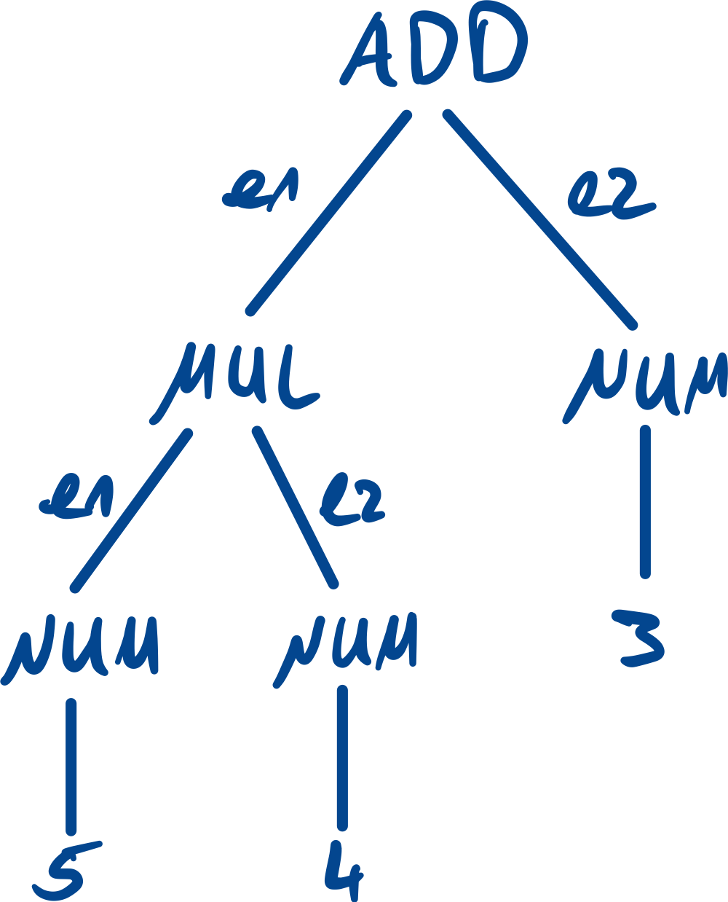
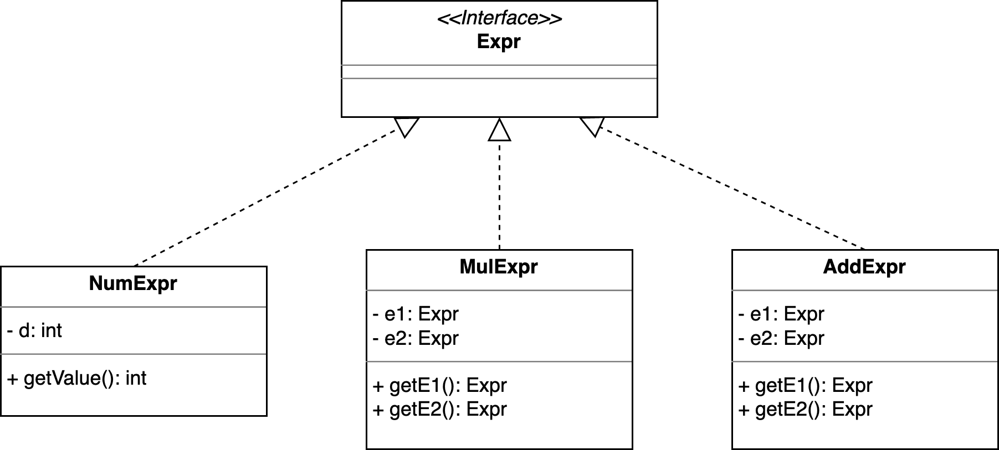
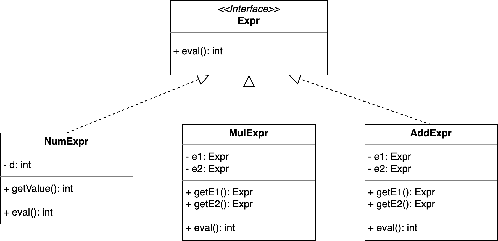
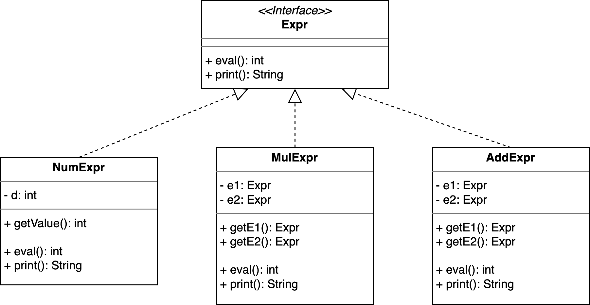
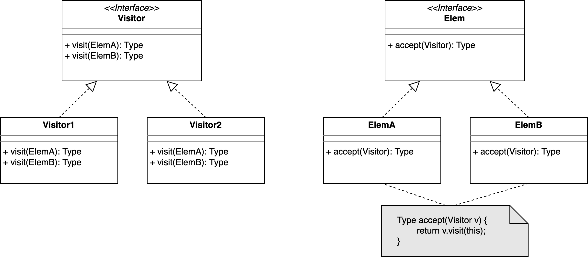
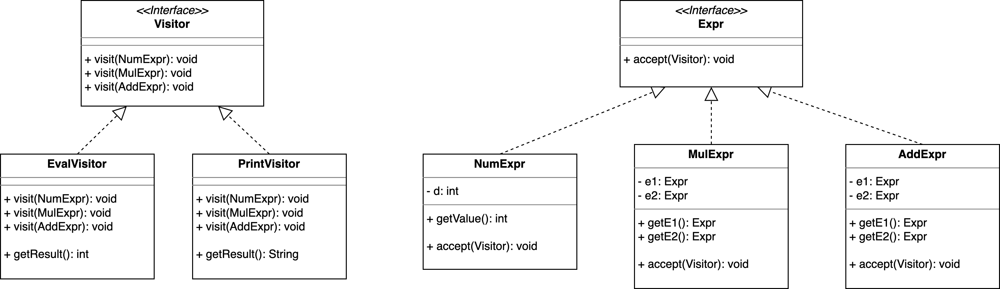

# Visitor-Pattern

> [!IMPORTANT]
>
> <details open>
>
> <summary><strong>🎯 TL;DR</strong></summary>
>
> Häufig bietet es sich bei Datenstrukturen an, die Traversierung nicht
> direkt in den Klassen der Datenstrukturen zu implementieren, sondern
> in Hilfsklassen zu verlagern. Dies gilt vor allem dann, wenn die
> Datenstruktur aus mehreren Klassen besteht (etwa ein Baum mit
> verschiedenen Knotentypen) und/oder wenn man nicht nur eine
> Traversierungsart ermöglichen will oder/und wenn man immer wieder neue
> Arten der Traversierung ergänzen will. Das würde nämlich bedeuten,
> dass man für jede weitere Form der Traversierung in *allen* Klassen
> eine entsprechende neue Methode implementieren müsste.
>
> Das Visitor-Pattern lagert die Traversierung in eigene Klassenstruktur
> aus.
>
> Die Klassen der Datenstruktur bekommen nur noch eine
> `accept()`-Methode, in der ein Visitor übergeben wird und rufen auf
> diesem Visitor einfach dessen `visit()`-Methode auf (mit einer
> Referenz auf sich selbst als Argument).
>
> Der Visitor hat für jede Klasse der Datenstruktur eine Überladung der
> `visit()`-Methode. In diesen kann er je nach Klasse die gewünschte
> Verarbeitung vornehmen. Üblicherweise gibt es ein Interface oder eine
> abstrakte Klasse für die Visitoren, von denen dann konkrete Visitoren
> ableiten.
>
> Bei Elementen mit “Kindern” muss man sich entscheiden, wie die
> Traversierung implementiert werden soll. Man könnte in der
> `accept()`-Methode den Visitor an die Kinder weiter reichen (also auf
> den Kindern `accept()` mit dem Visitor aufrufen), bevor man die
> `visit()`-Methode des Visitors mit sich selbst als Referenz aufruft.
> Damit ist die Form der Traversierung in den Klassen der Datenstruktur
> fest verankert und über den Visitor findet “nur” noch eine
> unterschiedliche Form der Verarbeitung statt. Alternativ überlässt man
> es dem Visitor, die Traversierung durchzuführen: Hier muss in den
> `visit()`-Methoden für die einzelnen Elemente entsprechend auf
> mögliche Kinder reagiert werden.
>
> In diesem Pattern findet ein sogenannter “Double-Dispatch” statt: Zur
> Laufzeit wird ein konkreter Visitor instantiiert und über `accept()`
> an ein Element der Datenstruktur übergeben. Dort ist zur Compile-Zeit
> aber nur der Obertyp der Visitoren bekannt, d.h. zur Laufzeit wird
> hier der konkrete Typ bestimmt und entsprechend die richtige
> `visit()`-Methode auf der “echten” Klasse des Visitors aufgerufen
> (erster Dispatch). Da im Visitor die `visit()`-Methoden für jeden Typ
> der Datenstrukur überladen sind, findet nun zur Laufzeit die Auflösung
> der korrekten Überladung statt (zweiter Dispatch).
>
> </details>
>
> <details>
>
> <summary><strong>🎦 Videos</strong></summary>
>
> - [VL Visitor-Pattern](https://youtu.be/zW_2oQmjp8M)
> - [Demo Visitor-Pattern (Part I: Traversierung ohne
>   Visitor)](https://youtu.be/9dvcufpyQdw)
> - [Demo Visitor-Pattern (Part II: Traversierung mit
>   Visitor)](https://youtu.be/4rBRkXKhuN4)
>
> </details>
>
> <details>
>
> <summary><strong>🖇 Unterlagen</strong></summary>
>
> - [PDF-Version](https://github.com/Programmiermethoden-CampusMinden/Prog2-Lecture/blob/_pdf/lecture_pattern_visitor.pdf)
>
> </details>

## Motivation: Parsen von “5\*4+3”

<div class="columns">

<div class="column" width="50%">

Zum Parsen von Ausdrücken (*Expressions*) könnte man diese einfache
Grammatik einsetzen. Ein Ausdruck ist dabei entweder ein einfacher
Integer oder eine Addition oder Multiplikation zweier Ausdrücke.

``` yacc
expr : e1=expr '*' e2=expr      # MUL
     | e1=expr '+' e2=expr      # ADD
     | INT                      # NUM
     ;
```

</div>

<div class="column" width="40%">

Beim Parsen von “5\*4+3” würde dabei der folgende Parsetree entstehen:



</div>

</div>

## Strukturen für den Parsetree



Der Parsetree für diese einfache Grammatik ist ein Binärbaum. Die Regeln
werden auf Knoten im Baum zurückgeführt. Es gibt Knoten mit zwei
Kindknoten, und es gibt Knoten ohne Kindknoten (“Blätter”).

Entsprechend kann man sich einfache Klassen definieren, die die
verschiedenen Knoten in diesem Parsetree repräsentieren. Als Obertyp
könnte es ein (noch leeres) Interface `Expr` geben.

``` java
public interface Expr {}

public class NumExpr implements Expr {
    private final int d;

    public NumExpr(int d) { this.d = d; }
}

public class MulExpr implements Expr {
    private final Expr e1;
    private final Expr e2;

    public MulExpr(Expr e1, Expr e2) {
        this.e1 = e1;  this.e2 = e2;
    }
}

public class AddExpr implements Expr {
    private final Expr e1;
    private final Expr e2;

    public AddExpr(Expr e1, Expr e2) {
        this.e1 = e1;  this.e2 = e2;
    }
}


public class DemoExpr {
    public static void main(final String... args) {
        // 5*4+3
        Expr e = new AddExpr(new MulExpr(new NumExpr(5), new NumExpr(4)), new NumExpr(3));
    }
}
```

## Ergänzung I: Ausrechnen des Ausdrucks

Es wäre nun schön, wenn man mit dem Parsetree etwas anfangen könnte.
Vielleicht möchte man den Ausdruck ausrechnen?



Zum Ausrechnen des Ausdrucks könnte man dem Interface eine
`eval()`-Methode spendieren. Jeder Knoten kann für sich entscheiden, wie
die entsprechende Operation ausgewertet werden soll: Bei einer `NumExpr`
ist dies einfach der gespeicherte Wert, bei Addition oder Multiplikation
entsprechend die Addition oder Multiplikation der Auswertungsergebnisse
der beiden Kindknoten.

``` java
public interface Expr {
    int eval();
}

public class NumExpr implements Expr {
    private final int d;

    public NumExpr(int d) { this.d = d; }
    public int eval() { return d; }
}

public class MulExpr implements Expr {
    private final Expr e1;
    private final Expr e2;

    public MulExpr(Expr e1, Expr e2) {
        this.e1 = e1;  this.e2 = e2;
    }
    public int eval() { return e1.eval() * e2.eval(); }
}

public class AddExpr implements Expr {
    private final Expr e1;
    private final Expr e2;

    public AddExpr(Expr e1, Expr e2) {
        this.e1 = e1;  this.e2 = e2;
    }
    public int eval() { return e1.eval() + e2.eval(); }
}


public class DemoExpr {
    public static void main(final String... args) {
        // 5*4+3
        Expr e = new AddExpr(new MulExpr(new NumExpr(5), new NumExpr(4)), new NumExpr(3));

        int erg = e.eval();
    }
}
```

## Ergänzung II: Pretty-Print des Ausdrucks

Nachdem das Ausrechnen so gut geklappt hat, will der Chef nun noch flink
eine Funktion, mit der man den Ausdruck hübsch ausgeben kann:



Das fängt an, sich zu wiederholen. Wir implementieren immer wieder
ähnliche Strukturen, mit denen wir diesen Parsetree traversieren … Und
wir müssen für *jede* Erweiterung immer *alle* Expression-Klassen
anpassen!

<p align="right">Beispiel:
direct.DemoExpr (https://github.com/Programmiermethoden-CampusMinden/Prog2-Lecture/blob/master/lecture/pattern/src/visitor/direct/DemoExpr.java)</p>

**Das geht besser.**

## Visitor-Pattern (Besucher-Entwurfsmuster)



Das Entwurfsmuster “Besucher” (*Visitor Pattern*) lagert die Aktion beim
Besuchen eines Knotens in eine separate Klasse aus.

Dazu bekommt jeder Knoten im Baum eine neue Methode, die einen Besucher
akzeptiert. Dieser Besucher kümmert sich dann um die entsprechende
Verarbeitung des Knotens, also um das Auswerten oder Ausgeben im obigen
Beispiel.

Die Besucher haben eine Methode, die für jeden zu bearbeitenden Knoten
überladen wird. In dieser Methode findet dann die eigentliche
Verarbeitung statt: Auswerten des Knotens oder Ausgeben des Knotens …

``` java
public interface Expr {
    void accept(ExprVisitor v);
}

public class NumExpr implements Expr {
    private final int d;

    public NumExpr(int d) { this.d = d; }
    public int getValue() { return d; }

    public void accept(ExprVisitor v) { v.visit(this); }
}

public class MulExpr implements Expr {
    private final Expr e1;
    private final Expr e2;

    public MulExpr(Expr e1, Expr e2) {
        this.e1 = e1;  this.e2 = e2;
    }
    public Expr getE1() { return e1; }
    public Expr getE2() { return e2; }

    public void accept(ExprVisitor v) { v.visit(this); }
}

public class AddExpr implements Expr {
    private final Expr e1;
    private final Expr e2;

    public AddExpr(Expr e1, Expr e2) {
        this.e1 = e1;  this.e2 = e2;
    }
    public Expr getE1() { return e1; }
    public Expr getE2() { return e2; }

    public void accept(ExprVisitor v) { v.visit(this); }
}


public interface ExprVisitor {
    void visit(NumExpr e);
    void visit(MulExpr e);
    void visit(AddExpr e);
}

public class EvalVisitor implements ExprVisitor {
    private final Stack<Integer> erg = new Stack<>();

    public void visit(NumExpr e) { erg.push(e.getValue()); }
    public void visit(MulExpr e) {
        e.getE1().accept(this);  e.getE1().accept(this);
        erg.push(erg.pop() * erg.pop());
    }
    public void visit(AddExpr e) {
        e.getE1().accept(this);  e.getE1().accept(this);
        erg.push(erg.pop() + erg.pop());
    }
    public int getResult() { return erg.peek(); }
}

public class PrintVisitor implements ExprVisitor {
    private final Stack<String> erg = new Stack<>();

    public void visit(NumExpr e) { erg.push("NumExpr(" + e.getValue() + ")"); }
    public void visit(MulExpr e) {
        e.getE1().accept(this);  e.getE1().accept(this);
        erg.push("MulExpr(" + erg.pop() + ", " + erg.pop() + ")");
    }
    public void visit(AddExpr e) {
        e.getE1().accept(this);  e.getE1().accept(this);
        erg.push("AddExpr(" + erg.pop() + ", " + erg.pop() + ")");
    }
    public String getResult() { return erg.peek(); }
}


public class DemoExpr {
    public static void main(final String... args) {
        // 5*4+3
        Expr e = new AddExpr(new MulExpr(new NumExpr(5), new NumExpr(4)), new NumExpr(3));

        EvalVisitor v1 = new EvalVisitor();
        e.accept(v1);
        int erg = v1.getResult();

        PrintVisitor v2 = new PrintVisitor();
        e.accept(v2);
        String s = v2.getResult();
    }
}
```

### Implementierungsdetail

In den beiden Klasse `AddExpr` und `MulExpr` müssen auch die beiden
Kindknoten besucht werden, d.h. hier muss der Baum weiter traversiert
werden.

Man kann sich überlegen, diese Traversierung in den Klassen `AddExpr`
und `MulExpr` selbst anzustoßen.

Alternativ könnte auch der Visitor die Traversierung vornehmen. Gerade
bei der Traversierung von Datenstrukturen ist diese Variante oft von
Vorteil, da man hier unterschiedliche Traversierungsarten haben möchte
(Breitensuche vs. Tiefensuche, Pre-Order vs. Inorder vs. Post-Order, …)
und diese elegant in den Visitor verlagern kann.

<p align="right">Beispiel Traversierung intern (in den Knotenklassen):
visitor.visit.intrav.DemoExpr (https://github.com/Programmiermethoden-CampusMinden/Prog2-Lecture/blob/master/lecture/pattern/src/visitor/visit/intrav/DemoExpr.java)</p>

<p align="right">Beispiel Traversierung extern (im Visitor):
visitor.visit.extrav.DemoExpr (https://github.com/Programmiermethoden-CampusMinden/Prog2-Lecture/blob/master/lecture/pattern/src/visitor/visit/extrav/DemoExpr.java)</p>

### (Double-) Dispatch

Zur Laufzeit wird in `accept()` der Typ des Visitors aufgelöst und dann
in `visit()` der Typ der zu besuchenden Klasse. Dies nennt man auch
“Double-Dispatch”.

### Hinweis I

Man könnte versucht sein, die `accept()`-Methode aus den Knotenklassen
in die gemeinsame Basisklasse zu verlagern: Statt

``` java
    public void accept(ExprVisitor v) {
        v.visit(this);
    }
```

in *jeder* Knotenklasse einzeln zu definieren, könnte man das doch
*einmalig* in der Basisklasse definieren:

``` java
public abstract class Expr {
    /** Akzeptiere einen Visitor für die Verarbeitung */
    public void accept(ExprVisitor v) {
        v.visit(this);
    }
}
```

Dies wäre tatsächlich schön, weil man so Code-Duplizierung vermeiden
könnte. Aber es funktioniert in Java leider nicht. (Warum?)

### Hinweis II

Während die `accept()`-Methode nicht in die Basisklasse der besuchten
Typen (im Bild oben die Klasse `Elem` bzw. im Beispiel oben die Klasse
`Expr`) verlagert werden kann, kann man aber die `visit()`-Methoden im
Interface `Visitor` durchaus als Default-Methoden im Interface
implementieren.

## Ausrechnen des Ausdrucks mit einem Visitor



<p align="right">Demo:
visitor.visit.extrav.DemoExpr (https://github.com/Programmiermethoden-CampusMinden/Prog2-Lecture/blob/master/lecture/pattern/src/visitor/visit/extrav/DemoExpr.java)</p>

## Wrap-Up

**Visitor-Pattern**: Auslagern der Traversierung in eigene
Klassenstruktur

- Klassen der Datenstruktur
  - bekommen eine `accept()`-Methode für einen Visitor
  - rufen den Visitor mit sich selbst als Argument auf

- Visitor
  - hat für jede Klasse eine Überladung der `visit()`-Methode
  - Rückgabewerte schwierig: Intern halten oder per `return` (dann aber
    unterschiedliche `visit()`-Methoden für die verschiedenen
    Rückgabetypen!)

- (Double-) Dispatch: Zur Laufzeit wird in `accept()` der Typ des
  Visitors und in `visit()` der Typ der zu besuchenden Klasse aufgelöst

## 📖 Zum Nachlesen

- Eilebrecht und Starke ([2013](#ref-Eilebrecht2013))
- Gamma u. a. ([2011](#ref-Gamma2011))

------------------------------------------------------------------------

> [!TIP]
>
> <details>
>
> <summary><strong>✅ Lernziele</strong></summary>
>
> - k2: Aufbau des Visitor-Patterns (Besucher-Entwurfsmusters)
> - k3: Anwendung des Visitor-Patterns auf konkrete Beispiele, etwa den PM-Dungeon
>
> </details>
>
> <details>
>
> <summary><strong>🏅 Challenges</strong></summary>
>
> **Visitor-Pattern praktisch (und einfach)**
>
> Betrachten Sie den folgenden Code und erklären Sie das Ergebnis:
>
> ``` java
> interface Fruit { }
> class Apple implements Fruit { }
> class Orange implements Fruit { }
> class Banana implements Fruit { }
> class Foo extends Apple { }
>
> public class FruitBasketDirect {
>     public static void main(String... args) {
>         List<Fruit> basket = List.of(new Apple(), new Apple(), new Banana(), new Foo());
>
>         int oranges = 0;  int apples = 0;  int bananas = 0;  int foo = 0;
>
>         for (Fruit f : basket) {
>             if (f instanceof Apple) apples++;
>             if (f instanceof Orange) oranges++;
>             if (f instanceof Banana) bananas++;
>             if (f instanceof Foo) foo++;
>         }
>     }
> }
> ```
>
> Das Verwenden von `instanceof` ist unschön und fehleranfällig.
> Schreiben Sie den Code unter Einsatz des Visitor-Patterns um.
>
> Diskutieren Sie Vor- und Nachteile des Visitor-Patterns.
>
> </details>

------------------------------------------------------------------------

> [!NOTE]
>
> <details>
>
> <summary><strong>👀 Quellen</strong></summary>
>
> <div id="refs" class="references csl-bib-body hanging-indent"
> entry-spacing="0">
>
> <div id="ref-Eilebrecht2013" class="csl-entry">
>
> Eilebrecht, K., und G. Starke. 2013. *Patterns kompakt*. Springer.
>
> </div>
>
> <div id="ref-Gamma2011" class="csl-entry">
>
> Gamma, E., R. Helm, R. E. Johnson, und J. Vlissides. 2011. *Design
> Patterns*. Addison-Wesley.
>
> </div>
>
> </div>
>
> </details>

------------------------------------------------------------------------


Unless otherwise noted, this work is licensed under CC BY-SA 4.0.

> **Last
> modified:** ba2c853 (Lecture: remove 'quizzes' from the metadata to avoid any confusion with the new lecture quizzes, 2025-04-09)
