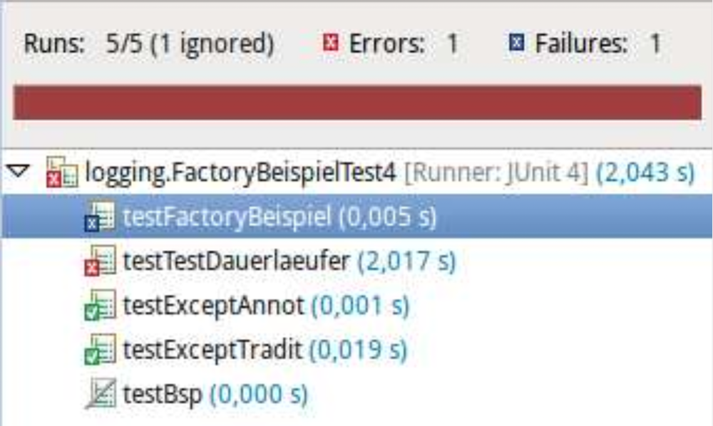

## JUnit: Ergebnis prüfen

Klasse **`org.junit.Assert`** enthält diverse **statische** Methoden zum Prüfen:

\bigskip

```java
// Argument muss true bzw. false sein
void assertTrue(boolean);
void assertFalse(boolean);

// Gleichheit im Sinne von equals()
void assertEquals(Object, Object);

// Test sofort fehlschlagen lassen
void fail();

...
```


## To "assert" or to "assume"?

*   Mit `assert*` werden Testergebnisse geprüft
    *   Test wird ausgeführt
    *   Ergebnis: OK, Failure, Error

\bigskip

*   Mit `assume*` werden Annahmen über den Zustand geprüft
    *   Test wird abgebrochen, wenn Annahme nicht erfüllt
    *   Prüfen von Vorbedingungen: Ist der Test hier ausführbar/anwendbar?

[Beispiel: junit4.TestAssume]{.ex href="https://github.com/Programmiermethoden-CampusMinden/Prog2-Lecture/blob/master/lecture/quality/src/junit4/TestAssume.java"}


## Setup und Teardown: Testübergreifende Konfiguration

```java
private Studi x;

@Before
public void setUp() { x = new Studi(); }

@Test
public void testToString() {
    // Studi x = new Studi();
    assertEquals(x.toString(), "Heinz (15cps)");
}
```

\bigskip

**`@Before`**
:   wird **vor jeder** Testmethode aufgerufen

**`@BeforeClass`**
:   wird **einmalig** vor allen Tests aufgerufen (`static`!)

**`@After`**
:   wird **nach jeder** Testmethode aufgerufen

**`@AfterClass`**
:   wird **einmalig** nach allen Tests aufgerufen (`static`!)


::: notes
In JUnit 5 wurden die Namen dieser Annotationen leicht geändert:

| JUnit 4        | JUnit 5       |
|:---------------|:--------------|
| `@Before`      | `@BeforeEach` |
| `@After`       | `@AfterEach`  |
| `@BeforeClass` | `@BeforeAll`  |
| `@AfterClass`  | `@AfterAll`   |
:::


::: notes
## Beispiel für den Einsatz von `@Before`

Annahme: **alle/viele** Testmethoden brauchen **neues** Objekt `x` vom Typ `Studi`

```java
private Studi x;

@Before
public void setUp() {
    x = new Studi("Heinz", 15);
}

@Test
public void testToString() {
    // Studi x = new Studi("Heinz", 15);
    assertEquals(x.toString(), "Name: Heinz, credits: 15");
}

@Test
public void testGetName() {
    // Studi x = new Studi("Heinz", 15);
    assertEquals(x.getName(), "Heinz");
}
```
:::


::: notes
## Ignorieren von Tests

*   Hinzufügen der Annotation `@Ignore`
*   Alternativ mit Kommentar: `@Ignore("Erst im nächsten Release")`

\bigskip

:::::: columns
::: {.column width="52%"}

```java
@Ignore("Warum ignoriert")
@Test
public void testBsp() {
    Bsp x = new Bsp();
    assertTrue(x.isTrue());
}
```

:::
::: {.column width="48%"}

{width=80% web_width=40%}

:::
::::::

In JUnit 5 wird statt der Annotation `@Ignore` die Annotation `@Disabled` mit
der selben Bedeutung verwendet. Auch hier lässt sich als Parameter ein String
mit dem Grund für das Ignorieren des Tests hinterlegen.
:::


## Vermeidung von Endlosschleifen: Timeout

::: notes
*   Testfälle werden nacheinander ausgeführt
*   Test mit Endlosschleife würde restliche Tests blockieren
*   Erweitern der `@Test`-Annotation mit Parameter "`timeout`": \newline
    => `@Test(timeout=2000)` (Zeitangabe in Millisekunden)
:::

:::::: columns
::: {.column width="52%"}

\vspace{6mm}

```java
@Test(timeout = 2000)
void testTestDauerlaeufer() {
    while (true) { ; }
}
```

:::
::: {.column width="44%"}

{width=80% web_width=40%}

:::
::::::

::: notes
In JUnit 5 hat die Annotation `@Test` keinen `timeout`-Parameter mehr.
Als Alternative bietet sich der Einsatz von `org.junit.jupiter.api.Assertions.assertTimeout`
an. Dabei benötigt man allerdings *Lambda-Ausdrücke* (Verweis auf spätere VL):

```java
@Test
void testTestDauerlaeufer() {
    assertTimeout(ofMillis(2000), () -> {
        while (true) { ; }
    });
}
```

(Beispiel von oben mit Hilfe von JUnit 5 formuliert)
:::


## Test von Exceptions: Expected

::: notes
Traditionelles Testen von Exceptions mit `try` und `catch`:
:::

```java
@Test
public void testExceptTradit() {
    try {
        int i = 0 / 0;
        fail("keine ArithmeticException ausgeloest");
    } catch (ArithmeticException aex) {
        assertNotNull(aex.getMessage());
    } catch (Exception e) {
        fail("falsche Exception geworfen");
    }
}
```

\pause
\bigskip

::: notes
Der `expected`-Parameter für die `@Test`-Annotation in JUnit 4 macht
dies deutlich einfacher: `@Test(expected = MyException.class)`
=> Test scheitert, wenn diese Exception **nicht** geworfen wird
:::

```java
@Test(expected = java.lang.ArithmeticException.class)
public void testExceptAnnot() {
    int i = 0 / 0;
}
```

::: notes
In JUnit 5 hat die Annotation `@Test` keinen `expected`-Parameter mehr.
Als Alternative bietet sich der Einsatz von `org.junit.jupiter.api.Assertions.assertThrows`
an. Dabei benötigt man allerdings *Lambda-Ausdrücke* (Verweis auf spätere VL):

```java
@Test
public void testExceptAnnot() {
    assertThrows(java.lang.ArithmeticException.class, () -> {
        int i = 0 / 0;
    });
}
```

(Beispiel von oben mit Hilfe von JUnit 5 formuliert)
:::


## Parametrisierte Tests

::: notes
Manchmal möchte man den selben Testfall mehrfach mit anderen Werten (Parametern)
durchführen.
:::

```java
class Sum {
    public static int sum(int i, int j) {
        return i + j;
    }
}

class SumTest {
    @Test
    public void testSum() {
        Sum s = new Sum();
        assertEquals(s.sum(1, 1), 2);
    }
    // und mit (2,2, 4), (2,2, 5), ...????
}
```

::: notes
Prinzipiell könnte man dafür entweder in einem Testfall eine Schleife schreiben,
die über die verschiedenen Parameter iteriert. In der Schleife würde dann
jeweils der Aufruf der zu testenden Methode und das gewünschte Assert passieren.
Alternativ könnte man den Testfall entsprechend oft duplizieren mit jeweils den
gewünschten Werten.

Beide Vorgehensweisen haben Probleme: Im ersten Fall würde die Schleife bei
einem Fehler oder unerwarteten Ergebnis abbrechen, ohne dass die restlichen
Tests (Werte) noch durchgeführt würden. Im zweiten Fall bekommt man eine
unnötig große Anzahl an Testmethoden, die bis auf die jeweiligen Werte identisch
sind (Code-Duplizierung).
:::


::: notes
### Parametrisierte Tests mit JUnit 4

JUnit 4 bietet für dieses Problem sogenannte "parametrisierte Tests" an. Dafür
muss eine Testklasse in JUnit 4 folgende Bedingungen erfüllen:

1.  Die Testklasse wird mit der Annotation `@RunWith(Parameterized.class)`
    ausgezeichnet.
2.  Es muss eine öffentliche statische Methode geben mit der Annotation
    `@Parameters`. Diese Methode liefert eine Collection zurück, wobei jedes
    Element dieser Collection ein Array mit den Parametern für einen
    Durchlauf der Testmethoden ist.
3.  Die Parameter müssen gesetzt werden. Dafür gibt es zwei Varianten:
    *   (A) Für jeden Parameter gibt es ein öffentliches Attribut. Diese Attribute
        müssen mit der Annotation `@Parameter` markiert sein und können in den
        Testmethoden normal genutzt werden. JUnit sorgt dafür, dass für jeden
        Eintrag in der Collection aus der statischen `@Parameters`-Methode
        diese Felder gesetzt werden und die Testmethoden aufgerufen werden.
    *   (B) Alternativ gibt es einen Konstruktor, der diese Werte setzt. Die Anzahl
        der Parameter im Konstruktor muss dabei exakt der Anzahl (und
        Reihenfolge) der Werte in jedem Array in der von der statischen
        `@Parameters`-Methode gelieferten Collection entsprechen. Der
        Konstruktor wird für jeden Parametersatz einmal aufgerufen und die
        Testmethoden einmal durchgeführt.

Letztlich wird damit das Kreuzprodukt aus Testmethoden und Testdaten durchgeführt.
:::

::: slides
## Parametrisierte Tests: Konstruktor (JUnit 4)
:::
::: notes
#### (A) Parametrisierte Tests: Konstruktor (JUnit 4)
:::

```java
@RunWith(Parameterized.class)
public class SumTestConstructor {
    private final int s1;
    private final int s2;
    private final int erg;

    public SumTestConstructor(int p1, int p2, int p3) { s1 = p1;  s2 = p2;  erg = p3; }

    @Parameters
    public static Collection<Object[]> values() {
        return Arrays.asList(new Object[][] { { 1, 1, 2 }, { 2, 2, 4 }, { 2, 2, 5 } });
    }

    @Test
    public void testSum() {
        assertEquals(Sum.sum(s1, s2), erg);
    }
}
```

::: slides
## Parametrisierte Tests: Parameter (JUnit 4)
:::
::: notes
#### (B) Parametrisierte Tests: Parameter (JUnit 4)
:::

```java
@RunWith(Parameterized.class)
public class SumTestParameters {

    @Parameter(0)  public int s1;
    @Parameter(1)  public int s2;
    @Parameter(2)  public int erg;

    @Parameters
    public static Collection<Object[]> values() {
        return Arrays.asList(new Object[][] { { 1, 1, 2 }, { 2, 2, 4 }, { 2, 2, 5 } });
    }

    @Test
    public void testSum() {
        assertEquals(Sum.sum(s1, s2), erg);
    }
}
```

[Beispiel: junit4.SumTestConstructor, junit4.SumTestParameters]{.ex href="https://github.com/Programmiermethoden-CampusMinden/Prog2-Lecture/tree/master/lecture/quality/src/junit4/"}


::: notes
### Parametrisierte Tests mit JUnit 5

In JUnit 5 werden [parametrisierte Tests] mit der Annotation [`@ParameterizedTest`]
gekennzeichnet (statt mit `@Test`).

Mit Hilfe von [`@ValueSource`] kann man ein einfaches Array von Werten (Strings oder primitive
Datentypen) angeben, mit denen der Test ausgeführt wird. Dazu bekommt die Testmethode einen
entsprechenden passenden Parameter:

``` java
@ParameterizedTest
@ValueSource(strings = {"wuppie", "fluppie", "foo"})
void testWuppie(String candidate) {
    assertTrue(candidate.equals("wuppie"));
}
```

Alternativ lassen sich als Parameterquelle u.a. Aufzählungen ([`@EnumSource`]) oder Methoden
([`@MethodSource`]) oder auch Komma-separierte Daten ([`@CsvSource`]) angeben.

Das obige Beispiel aus JUnit 4.x könnte mit Hilfe von `@CsvSource` so in JUnit 5.x umgesetzt
werden:

``` java
public class SumTest {
    @ParameterizedTest
    @CsvSource(textBlock = """
            # s1,  s2,  s1+s2
            0,     0,   0
            10,    0,   10
            0,     11,  11
            -2,    10,  8
            """)
    public void testSum(int s1, int s2, int erg) {
        assertEquals(Sum.sum(s1, s2), erg);
    }
}
```

[Beispiel: junit5.TestValueSource, junit5.TestMethodSource]{.ex href="https://github.com/Programmiermethoden-CampusMinden/Prog2-Lecture/tree/master/lecture/quality/src/junit5/"}

  [parametrisierte Tests]: https://junit.org/junit5/docs/current/user-guide/#writing-tests-parameterized-tests
  [`@ParameterizedTest`]: https://junit.org/junit5/docs/current/api/org.junit.jupiter.params/org/junit/jupiter/params/ParameterizedTest.html
  [`@ValueSource`]: https://junit.org/junit5/docs/current/api/org.junit.jupiter.params/org/junit/jupiter/params/provider/ValueSource.html
  [`@EnumSource`]: https://junit.org/junit5/docs/current/api/org.junit.jupiter.params/org/junit/jupiter/params/provider/EnumSource.html
  [`@MethodSource`]: https://junit.org/junit5/docs/current/api/org.junit.jupiter.params/org/junit/jupiter/params/provider/MethodSource.html
  [`@CsvSource`]: https://junit.org/junit5/docs/current/api/org.junit.jupiter.params/org/junit/jupiter/params/provider/CsvSource.html

:::


## Testsuiten: Tests gemeinsam ausführen (JUnit 4)

::: notes
Eclipse: `New > Other > Java > JUnit > JUnit Test Suite`
:::

```java
import org.junit.runner.RunWith;
import org.junit.runners.Suite;
import org.junit.runners.Suite.SuiteClasses;

@RunWith(Suite.class)
@SuiteClasses({
    // Hier kommen alle Testklassen rein
    PersonTest.class,
    StudiTest.class
})

public class MyTestSuite {
    // bleibt leer!!!
}
```

::: notes
## Testsuiten mit JUnit 5

In JUnit 5 gibt es zwei Möglichkeiten, Testsuiten zu erstellen:

*   `@SelectPackages`: Angabe der Packages, die für die Testsuite zusammengefasst werden sollen
*   `@SelectClasses`: Angabe der Klassen, die für die Testsuite zusammengefasst werden sollen

```java
@RunWith(JUnitPlatform.class)
@SelectClasses({StudiTest5.class, WuppieTest5.class})
public class MyTestSuite5 {
    // bleibt leer!!!
}
```

Zusätzlich kann man beispielsweise mit `@IncludeTags` oder `@ExcludeTags` Testmethoden mit bestimmten Tags
einbinden oder ausschließen. Beispiel: Schließe alle Tests mit Tag "develop" aus: `@ExcludeTags("develop")`.
Dabei wird an den Testmethoden zusätzlich das Tag `@Tag` verwendet, etwas `@Tag("develop")`.

**Achtung**: Laut der offiziellen Dokumentation
[(Abschnitt "4.4.4. Test Suite")](https://junit.org/junit5/docs/current/user-guide/#running-tests-junit-platform-runner-test-suite)
gilt zumindest bei der Selection über `@SelectPackages` der Zwang zu einer Namenskonvention:
Es werden dabei nur Klassen gefunden, deren Name mit `Test` beginnt oder endet!
Weiterhin werden Testsuites mit der Annotation `@RunWith(JUnitPlatform.class)` **nicht**
auf der "JUnit 5"-Plattform ausgeführt, sondern mit der JUnit 4-Infrastuktur!
:::


::: notes
## Best Practices

1.  Ein Testfall behandelt exakt eine Idee/ein Szenario. Das bedeutet auch, dass man in der
    Regel nur ein bis wenige `assert*` pro Testmethode benutzt.

    (Wenn man verschiedene Ideen in eine Testmethode kombiniert, wird der Testfall
    unübersichtlicher und auch auch schwerer zu warten.

    Außerdem können so leichter versteckte Fehler auftreten: Das erste oder zweite oder dritte
    `assert*` schlägt fehl - und alle dahinter kommenden `assert*` werden nicht mehr
    ausgewertet!)

2.  Wenn die selbe Testidee mehrfach wiederholt wird, sollte man diese Tests zu einem
    parametrisierten Test zusammenfassen.

    (Das erhöht die Lesbarkeit drastisch - und man läuft auch nicht in das Problem der
    Benennung der Testmethoden.)

3.  Es wird nur das Verhalten der öffentlichen Schnittstelle getestet, nicht die inneren
    Strukturen einer Klasse oder Methode.

    (Es ist verlockend, auch private Methoden zu testen und in den Tests auch die
    Datenstrukturen o.ä. im Blick zu behalten und zu testen. Das führt aber zu sehr
    "zerbrechlichen" (*brittle*) Tests: Sobald sich etwas an der inneren Struktur ändert, ohne
    dass sich das von außen beobachtbare Verhalten ändert und also die Klasse/Methode immer
    noch ordnungsgemäß funktioniert, gehen all diese "internen" Tests kaputt. Nicht ohne
    Grund wird in der objektorientierten Programmierung mit Kapselung (Klassen, Methoden, ...)
    gearbeitet.)

4.  Von Setup- und Teardown-Methoden sollte eher sparsam Gebrauch gemacht werden.

    (Normalerweise folgen wir in der objektorientierten Programmierung dem DRY-Prinzip ([Don't
    repeat yourself](https://en.wikipedia.org/wiki/Don%27t_repeat_yourself)). Entsprechend
    liegt es nahe, häufig benötigte Elemente in einer Setup-Methode zentral zu initialisieren
    und ggf. in einer Teardown-Methode wieder freizugeben.

    Das führt aber speziell bei Unit-Tests dazu, dass die einzelnen Testmethoden schwerer
    lesbar werden: Sie hängen von einer gemeinsamen, zentralen Konfiguration ab, die man
    üblicherweise nicht gleichzeitig mit dem Code der Testmethode sehen kann (begrenzter Platz
    auf der Bildschirmseite).

    Wenn nun in einem oder vielleicht mehreren Testfällen der Wunsch nach einer leicht anderen
    Konfiguration auftaucht, muss man die gemeinsame Konfiguration entsprechend anpassen bzw.
    erweitern. Dabei muss man dann aber *alle* anderen Testmethoden mit bedenken, die ja
    ebenfalls von dieser Konfiguration abhängen! Das führt in der Praxis dann häufig dazu,
    dass die gemeinsame Konfiguration sehr schnell sehr groß und verschachtelt und
    entsprechend unübersichtlich wird.

    Jede Änderung an dieser Konfiguration kann leicht einen oder mehrere Testfälle kaputt
    machen (man hat ja i.d.R. nie alle Testfälle gleichzeitig im Blick), weshalb man hier
    unbedingt mit passenden `assume*` arbeiten muss - aber dann kann man eigentlich auch
    stattdessen die Konfiguration direkt passend für den jeweiligen Testfall in der jeweiligen
    Testmethode erledigen!)

5.  Wie immer sollten auch die Namen der Testmethoden klar über ihren Zweck Auskunft geben.

    (Der Präfix "test" wird seit JUnit 4.x nicht mehr benötigt, aber dennoch ist es in vielen
    Projekten Praxis, diesen Präfix beizubehalten - damit kann man in der Package-Ansicht in
    der IDE leichter zwischen den "normalen" und den Testmethoden unterscheiden.)

Diese Erfahrungen werden ausführlich in [@SWEGoogle, pp. 231-256] diskutiert.
:::


## Wrap-Up

JUnit als Framework für (Unit-) Tests; hier JUnit 4 (mit Ausblick auf JUnit 5)

*   Testmethoden mit Annotation `@Test`
*   `assert` (Testergebnis) vs. `assume` (Testvorbedingung)
*   Aufbau der Testumgebung `@Before`
*   Abbau der Testumgebung `@After`
*   Steuern von Tests mit `@Ignore` oder `@Test(timout=XXX)`
*   Exceptions einfordern mit `@Test(expected=package.Exception.class)`
*   Tests zusammenfassen zu Testsuiten
