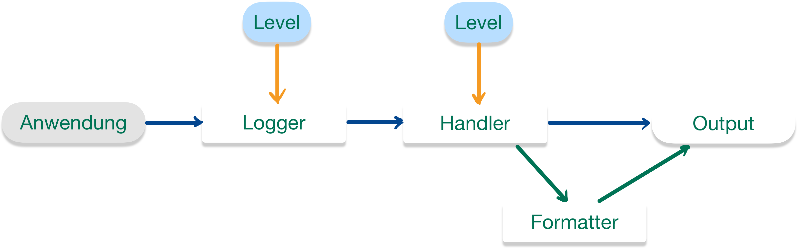

::: tldr
Im Paket `java.util.logging` findet sich eine einfache Logging-API.

Über die Methode `getLogger()` der Klasse `Logger` (*Factory-Method-Pattern*) kann ein (neuer) Logger erzeugt werden,
dabei wird über den String-Parameter eine Logger-Hierarchie aufgebaut analog zu den Java-Package-Strukturen. Der oberste
Logger (der "Root-Logger") hat den leeren Namen.

Jeder Logger kann mit einem Log-Level (Klasse `Level`) eingestellt werden; Log-Meldungen unterhalb des eingestellten
Levels werden verworfen.

Vom Logger nicht verworfene Log-Meldungen werden an den bzw. die Handler des Loggers und (per Default) an den
Eltern-Logger weiter gereicht. Die Handler haben ebenfalls ein einstellbares Log-Level und verwerfen alle Nachrichten
unterhalb der eingestellten Schwelle. Zur tatsächlichen Ausgabe gibt man einem Handler noch einen Formatter mit.
Defaultmäßig hat nur der Root-Logger einen Handler.

Der Root-Logger (leerer String als Name) hat als Default-Level (wie auch sein Console-Handler) "`Info`" eingestellt.

Nachrichten, die durch Weiterleitung nach oben empfangen wurden, werden nicht am Log-Level des empfangenden Loggers
gemessen, sondern akzeptiert und an die Handler des Loggers und (sofern nicht deaktiviert) an den Elternlogger
weitergereicht.
:::

::: youtube
-   [VL Logging](https://youtu.be/_jYWJzr1rkA)
-   [Demo Logging (Überblick)](https://youtu.be/fWSc5A_CPL8)
-   [Demo Log-Level](https://youtu.be/0UUVQCVYNHo)
-   [Demo Logging: Handler und Formatter](https://youtu.be/dYOYA99EfrY)
-   [Demo Weiterleitung an den Elternlogger](https://youtu.be/19Bki4IglWQ)
:::

# Wie prüfen Sie die Werte von Variablen/Objekten?

1.  Debugging
    -   Beeinflusst Code nicht
    -   Kann schnell komplex und umständlich werden
    -   Sitzung transient - nicht wiederholbar

\bigskip

2.  "Poor-man's-debugging" (Ausgaben mit `System.out.println`)
    -   Müssen irgendwann entfernt werden
    -   Ausgabe nur auf einem Kanal (Konsole)
    -   Keine Filterung nach Problemgrad - keine Unterscheidung zwischen Warnungen, einfachen Informationen, ...

\bigskip

3.  **Logging**
    -   Verschiedene (Java-) Frameworks: `\newline`{=tex} `java.util.logging` (JDK), *log4j* (Apache), *SLF4J*,
        *Logback*, ...

# Java Logging API - Überblick

Paket `java.util.logging`

\bigskip

{width="80%" web_width="65%"}

::: notes
Eine Applikation kann verschiedene Logger instanziieren. Die Logger bauen per Namenskonvention hierarchisch aufeinander
auf. Jeder Logger kann selbst mehrere Handler haben, die eine Log-Nachricht letztlich auf eine bestimmte Art und Weise
an die Außenwelt weitergeben.

Log-Meldungen werden einem Level zugeordnet. Jeder Logger und Handler hat ein Mindest-Level eingestellt, d.h.
Nachrichten mit einem kleineren Level werden verworfen.

Zusätzlich gibt es noch Filter, mit denen man Nachrichten (zusätzlich zum Log-Level) nach weiteren Kriterien filtern
kann.
:::

[Konsole: logging.LoggingDemo]{.ex
href="https://github.com/Programmiermethoden-CampusMinden/Prog2-Lecture/blob/master/lecture/quality/src/logging/LoggingDemo.java"}

# Erzeugen neuer Logger

``` java
import java.util.logging.Logger;
Logger l = Logger.getLogger(MyClass.class.getName());
```

-   **Factory-Methode** der Klasse `java.util.logging.Logger`

    ``` java
    public static Logger getLogger(String name);
    ```

    =\> Methode liefert bereits **vorhandenen Logger** mit diesem Namen [(sonst neuen Logger)]{.notes}

-   **Best Practice**: `\newline`{=tex} Nutzung des voll-qualifizierten Klassennamen: `MyClass.class.getName()`

    -   Leicht zu implementieren
    -   Leicht zu erklären
    -   Spiegelt modulares Design
    -   Ausgaben enthalten automatisch Hinweis auf Herkunft (Lokalität) der Meldung
    -   **Alternativen**: Funktionale Namen wie "XML", "DB", "Security"

# Ausgabe von Logmeldungen

``` java
public void log(Level level, String msg);
```

\bigskip
\bigskip

-   Diverse Convenience-Methoden (Auswahl):

    ``` java
    public void warning(String msg)
    public void info(String msg)
    public void entering(String srcClass, String srcMethod)
    public void exiting(String srcClass, String srcMethod)
    ```

\bigskip

-   Beispiel

    ``` java
    import java.util.logging.Logger;
    Logger l = Logger.getLogger(MyClass.class.getName());
    l.info("Hello World :-)");
    ```

# Wichtigkeit von Logmeldungen: Stufen

-   `java.util.logger.Level` definiert 7 Stufen:
    -   `SEVERE`, `WARNING`, `INFO`, `CONFIG`, `FINE`, `FINER`, `FINEST` `\newline`{=tex} (von höchster zu niedrigster
        Prio)
    -   Zusätzlich `ALL` und `OFF`

\bigskip

-   Nutzung der Log-Level:
    -   Logger hat Log-Level: Meldungen mit kleinerem Level werden verworfen
    -   Prüfung mit `public boolean isLoggable(Level)`
    -   Setzen mit `public void setLevel(Level)`

[Konsole: logging.LoggingLevel]{.ex
href="https://github.com/Programmiermethoden-CampusMinden/Prog2-Lecture/blob/master/lecture/quality/src/logging/LoggingLevel.java"}

::: notes
=\> Warum wird im Beispiel nach `log.setLevel(Level.ALL);` trotzdem nur ab `INFO` geloggt? Wer erzeugt eigentlich die
Ausgaben?!
:::

# Jemand muss die Arbeit machen ...

\bigskip

::: slides
{width="60%"}
:::

\bigskip

-   Pro Logger **mehrere** Handler möglich
    -   Logger übergibt nicht verworfene Nachrichten an Handler
    -   Handler haben selbst ein Log-Level (analog zum Logger)
    -   Handler verarbeiten die Nachrichten, wenn Level ausreichend

\smallskip

-   Standard-Handler: `StreamHandler`, `ConsoleHandler`, `FileHandler`

\smallskip

-   Handler nutzen zur Formatierung der Ausgabe einen `Formatter`
-   Standard-Formatter: `SimpleFormatter` und `XMLFormatter`

[Konsole: logging.LoggingHandler]{.ex
href="https://github.com/Programmiermethoden-CampusMinden/Prog2-Lecture/blob/master/lecture/quality/src/logging/LoggingHandler.java"}

::: notes
=\> Warum wird im Beispiel nach dem Auskommentieren von `log.setUseParentHandlers(false);` immer noch eine zusätzliche
Ausgabe angezeigt (ab `INFO` aufwärts)?!
:::

# Ich ... bin ... Dein ... Vater ...

-   Logger bilden **Hierarchie** über Namen
    -   Trenner für Namenshierarchie: "`.`" (analog zu Packages) [=\> mit jedem "`.`" wird eine weitere Ebene der
        Hierarchie aufgemacht ...]{.notes}
    -   Jeder Logger kennt seinen Eltern-Logger: `Logger#getParent()`
    -   Basis-Logger: leerer Name (`""`)
        -   Voreingestelltes Level des Basis-Loggers: `Level.INFO` (!)

\bigskip

-   Weiterleiten von Nachrichten
    -   Nicht verworfene Log-Aufrufe werden an Eltern-Logger weitergeleitet [(Default)]{.notes}
        -   Abschalten mit `Logger#setUseParentHandlers(false);`
    -   Diese leiten [an ihre Handler sowie]{.notes} an ihren Eltern-Logger weiter (unabhängig von Log-Level!)

[Konsole: logging.LoggingParent; Tafel: Skizze Logger-Baum]{.ex
href="https://github.com/Programmiermethoden-CampusMinden/Prog2-Lecture/blob/master/lecture/quality/src/logging/LoggingParent.java"}

# Wrap-Up

-   Java Logging API im Paket `java.util.logging`

\smallskip

-   Neuer Logger über **Factory-Methode** der Klasse `Logger`
    -   Einstellbares Log-Level (Klasse `Level`)
    -   Handler kümmern sich um die Ausgabe, nutzen dazu Formatter
    -   Mehrere Handler je Logger registrierbar
    -   Log-Level auch für Handler einstellbar (!)
    -   Logger (und Handler) "interessieren" sich nur für Meldungen ab bestimmter Wichtigkeit
    -   Logger reichen nicht verworfene Meldungen defaultmäßig an Eltern-Logger weiter (rekursiv)

::: readings
-   @JDK-Doc [Kap. 8]
:::

::: outcomes
-   k3: Ich kann die Java Logging API im Paket java.util.logging aktiv einsetzen
-   k3: Ich kann eigene Handler und Formatter schreiben
:::

::: challenges
**Logger-Konfiguration**

Betrachten Sie den folgenden Java-Code:

``` java
import java.util.logging.*;

public class Logging {
    public static void main(String... args) {
        Logger l = Logger.getLogger("Logging");
        l.setLevel(Level.FINE);

        ConsoleHandler myHandler = new ConsoleHandler();
        myHandler.setFormatter(new SimpleFormatter() {
            public String format(LogRecord record) {
                return "WUPPIE\n";
            }
        });
        l.addHandler(myHandler);

        l.info("A");
        l.fine("B");
        l.finer("C");
        l.finest("D");
        l.severe("E");
    }
}
```

Welche Ausgaben entstehen durch den obigen Code? Erklären Sie, welche der Logger-Aufrufe zu einer Ausgabe führen und
wieso und wie diese Ausgaben zustande kommen bzw. es keine Ausgabe bei einem Logger-Aufruf gibt. Gehen Sie dabei auf
jeden der fünf Aufrufe ein.

<!--
Die beiden Aufrufe `l.finer` und `l.finest` führen zu keiner Ausgabe, da das jeweilige Log-Level
unterhalb des eingestellten Levels des Loggers liegt -- beide Logmeldungen werden vom Logger verworfen.

Der Aufruf `l.fine` führt zu keiner Ausgabe. Der Logger nimmt die Logmeldung zwar an, aber der Handler
verwirft die Logmeldung, da sie unterhalb seines Default-Levels liegt. Die Meldung wird zusätzlich an den
Eltern-Logger (hier der Root-Logger) weiter gereicht, der diese akzeptiert (trotz zu kleinem Level, da
weitergeleitet!). Der Default-Handler des Eltern-Loggers nimmt aber keine Ausgabe vor, da sein Log-Level
auf `Info` steht.

Für die Aufrufe `l.info` und `l.severe` werden je zwei Ausgaben gemacht: Eine durch den eigenen Handler
("WUPPIE") und eine weitere durch die Weiterleitung an den Eltern-Logger ("A" bzw. "E" mit der
Default-Formatierung). Alle beteiligten Logger und Handler akzeptieren das Level `Info` bzw. `SEVERE`.
-->

**Analyse eines Live-Beispiels aus dem Dungeon**

Analysieren Sie die Konfiguration des Loggers im Dungeon-Projekt: [Dungeon-CampusMinden/Dungeon:
core/utils/logging/LoggerConfig.java](https://github.com/Dungeon-CampusMinden/Dungeon/blob/master/game/src/core/utils/logging/LoggerConfig.java).

<!--
- Code Qualität, Kommentar-Qualität?
- Umgang mit Dateien (alte vs. neue API, bunter Mix):
    Path.of() => Path-Objekt. Damit dann in Files.createDirectories() (schließt Files.createFile() bereits ein!)
    und FileHandler() gehen (*single source of truth*)

    Path path = FileSystems.getDefault().getPath("logs", "foo.log");
    BufferedReader reader = Files.newBufferedReader(path, StandardCharsets.UTF_8);

- Umgang mit Typen: keine Typsicherheit, immer wieder manuelle String, String, String, ...
- Mögliche Probleme, die hier entstehen können (Start der App, Ordner/Package: Auflösen relativ zum Start)
-->
:::
