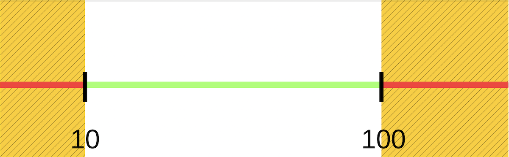
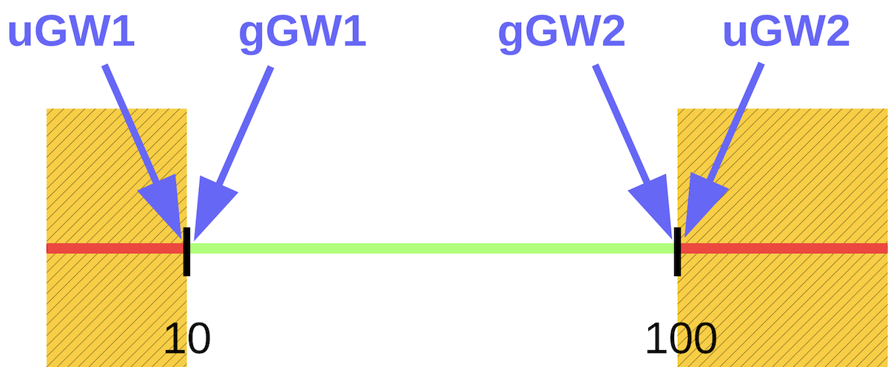

::: tldr
Mit Hilfe der Äquivalenzklassenbildung kann man Testfälle bestimmen. Dabei wird der
Eingabebereich für jeden Parameter einer Methode in Bereiche mit gleichem Verhalten
der Methode eingeteilt (die sogenannten "Äquivalenzklassen"). Dabei können einige
Äquivalenzklassen (ÄK) gültigen Eingabebereichen entsprechen ("gültige ÄK"), also
erlaubten/erwarteten Eingaben (die zum gewünschten Verhalten führen), und die
restlichen ÄK entsprechen dann ungültigen Eingabebereichen ("ungültige ÄK"), also
nicht erlaubten Eingaben, die von der Methode zurückgewiesen werden sollten. Jede
dieser ÄK muss in mindestens einem Testfall vorkommen, d.h. man bestimmt einen oder
mehrere zufällige Werte in den ÄK. Dabei können über mehrere Parameter hinweg
verschiedene gültige ÄK in einem Testfall kombiniert werden. Bei den ungültigen ÄK
kann dagegen immer nur ein Parameter eine ungültige ÄK haben, für die restlichen
Parameter müssen gültige ÄK genutzt werden, und diese werden dabei als durch diesen
Testfall "nicht getestet" betrachtet.

Zusätzlich entstehen häufig Fehler bei den Grenzen der Bereiche, etwa in Schleifen.
Deshalb führt man zusätzlich noch eine Grenzwertanalyse durch und bestimmt für jede
ÄK den unteren und den oberen Grenzwert und erzeugt aus diesen Werten zusätzliche
Testfälle.

Wenn in der getesteten Methode der Zustand des Objekts eine Rolle spielt, wird dieser
wie ein weiterer Eingabeparameter für die Methode betrachtet und entsprechend in die
ÄK-Bildung bzw. GW-Analyse einbezogen.

Wenn ein Testfall sich aus den gültigen ÄK/GW speist, spricht man auch von einem
"Positiv-Test"; wenn ungültige ÄK/GW genutzt werden, spricht man auch von einem
"Negativ-Test".
:::

::: youtube
-   [VL Testfallermittlung](https://youtu.be/AR1WWt4AFqI)
:::

# Hands-On (10 Minuten): Wieviel und was muss man testen?

``` java
public class Studi {
    private int credits = 0;

    public void addToCredits(int credits) {
        if (credits < 0) {
            throw new IllegalArgumentException("Negative Credits!");
        }
        if (this.credits + credits > 210) {
            throw new IllegalArgumentException("Mehr als 210 Credits!");
        }
        this.credits += credits;
    }
}
```

::: notes
## *JEDE* Methode mindestens testen mit/auf:

-   Positive Tests: Gutfall (Normalfall) =\> "gültige ÄK/GW"
-   Negativ-Tests (Fehlbedienung, ungültige Werte) =\> "ungültige ÄK/GW"
-   Rand- bzw. Extremwerte =\> GW
-   Exceptions

=\> Anforderungen abgedeckt (Black-Box)?

=\> Wichtige Pfade im Code abgedeckt (White-Box)?

## Praxis

-   Je kritischer eine Klasse/Methode/Artefakt ist, um so intensiver testen!
-   Suche nach Kompromissen: Testkosten vs. Kosten von Folgefehlern; beispielsweise
    kein Test generierter Methoden

=\> "Erzeugen" der Testfälle über die Äquivalenzklassenbildung und Grenzwertanalyse
(siehe nächste Folien). Mehr dann später im Wahlfach "Softwarequalität" ...
:::

# Äquivalenzklassenbildung

::: notes
Beispiel: Zu testende Methode mit Eingabewert *x*, der zw. 10 und 100 liegen soll
:::

{width="60%" web_width="30%"}

\bigskip

-   Zerlegung der Definitionsbereiche in Äquivalenzklassen (ÄK):

    -   Disjunkte Teilmengen, wobei
    -   Werte *einer* ÄK führen zu *gleichartigem* Verhalten

-   Annahme: Eingabeparameter sind untereinander unabhängig

-   Unterscheidung gültige und ungültige ÄK

[[Beispiel: Eingabeparameter x zw. 10 und 100]{.ex}]{.slides}

::: notes
## Bemerkungen

Hintergrund: Da die Werte einer ÄK zu gleichartigem Verhalten führen, ist es egal,
*welchen* Wert man aus einer ÄK für den Test nimmt.

Formal hat man *eine* ungültige ÄK (d.h. die Menge aller ungültigen Werte). In der
Programmierpraxis macht es aber einen Unterschied, ob es sich um Werte unterhalb oder
oberhalb des erlaubten Wertebereichs handelt (Fallunterscheidung). Beispiel: Eine
Funktion soll Werte zwischen 10 und 100 verarbeiten. Dann sind alle Werte kleiner 10
oder größer 100 mathematisch gesehen in der selben ÄK "ungültig". Praktisch macht es
aber Sinn, eine ungültige ÄK für "kleiner 10" und eine weitere ungültige ÄK für
"größer 100" zu betrachten ...

Traditionell betrachtet man nur die Eingabeparameter. Es kann aber Sinn machen, auch
die Ausgabeseite zu berücksichtigen (ist aber u.U. nur schwierig zu realisieren).

## Faustregeln bei der Bildung von ÄK

-   Falls eine Beschränkung einen Wertebereich spezifiziert: Aufteilung in eine
    gültige und zwei ungültige ÄK

    Beispiel: Eingabewert *x* soll zw. 10 und 100 liegen

    -   Gültige ÄK: $[10, 100]$
    -   Ungültige ÄKs: $x < 10$ und $100 < x$

-   Falls eine Beschränkung eine minimale und maximale Anzahl von Werten
    spezifiziert: Aufteilung in eine gültige und zwei ungültige ÄK

    Beispiel: Jeder Studi muss pro Semester an mindestens einer LV teilnehmen,
    maximal sind 5 LVs erlaubt.

    -   Gültige ÄK: $1 \le x \le 5$
    -   Ungültige ÄKs: $x = 0$ (keine Teilnahme) und $5 < x$ (mehr als 5 Kurse)

-   Falls eine Beschränkung eine Menge von Werten spezifiziert, die möglicherweise
    unterschiedlich behandelt werden: Für jeden Wert dieser Menge eine eigene gültige
    ÄK erstellen und zusätzlich insgesamt eine ungültige ÄK

    Beispiel: Das Hotel am Urlaubsort ermöglicht verschiedene Freizeitaktivitäten:
    Segway-fahren, Tauchen, Tennis, Golf

    -   Gültige ÄKs:
        -   Segway-fahren
        -   Tauchen
        -   Tennis
        -   Golf
    -   Ungültige ÄK: "alles andere"

-   Falls eine Beschränkung eine Situation spezifiziert, die zwingend erfüllt sein
    muss: Aufteilung in eine gültige und eine ungültige ÄK

*Hinweis*: Werden Werte einer ÄK vermutlich nicht gleichwertig behandelt, dann
erfolgt die Aufspaltung der ÄK in kleinere ÄKs. Das ist im Grunde die analoge
Überlegung zu mehreren ungültigen ÄKs.

ÄKs sollten für die weitere Arbeit einheitlich und eindeutig benannt werden.
Typisches Namensschema: "gÄKn" und "uÄKn" für gültige bzw. ungültige ÄKs mit der
laufenden Nummer $n$.
:::

# ÄK: Erstellung der Testfälle

-   Jede ÄK durch *mindestens* **einen TF** abdecken

\bigskip

-   Dabei pro Testfall
    -   *mehrere gültige ÄKs* kombinieren, oder
    -   genau *eine ungültige ÄK* untersuchen [(restl. Werte aus gültigen ÄK
        auffüllen; diese gelten dann aber nicht als getestet!)]{.notes}

::: notes
Im Prinzip muss man zur Erstellung der Testfälle (TF) eine paarweise vollständige
Kombination über die ÄK bilden, d.h. jede ÄK kommt mit jeder anderen ÄK in einem TF
zur Ausführung.

*Erinnerung*: Annahme: Eingabeparameter sind untereinander unabhängig! =\> Es reicht,
wenn *jede* gültige ÄK *einmal* in einem TF zur Ausführung kommt. =\> Kombination
verschiedener gültiger ÄK in *einem TF*.

**Achtung**: Dies gilt nur für die **gültigen** ÄK! Bei den ungültigen ÄKs dürfen
diese nicht miteinander in einem TF kombiniert werden! Bei gleichzeitiger Behandlung
verschiedener ungültiger ÄK bleiben u.U. Fehler unentdeckt, da sich die Wirkungen der
ungültigen ÄK überlagern!

**Für jeden Testfall (TF) wird aus den zu kombinierenden ÄK ein zufälliger
Repräsentant ausgewählt.**
:::

# ÄK: Beispiel: Eingabewert *x* soll zw. 10 und 100 liegen

## Äquivalenzklassen

| Eingabe | gültige ÄK        | ungültige ÄK    |
|:--------|:------------------|:----------------|
| *x*     | gÄK1: $[10, 100]$ | uÄK2: $x < 10$  |
|         |                   | uÄK3: $100 < x$ |

\bigskip
\pause

## Tests

| Testnummer          | 1    | 2         | 3         |
|:--------------------|:-----|:----------|:----------|
| geprüfte ÄK         | gÄK1 | uÄK2      | uÄK3      |
| *x*                 | 42   | 7         | 120       |
| Erwartetes Ergebnis | OK   | Exception | Exception |

# Grenzwertanalyse

{width="60%" web_width="30%"}

\bigskip

Beobachtung: Grenzen in Verzweigungen/Schleifen kritisch

-   Grenzen der ÄK (kleinste und größte Werte) **zusätzlich** testen
    -   "gültige Grenzwerte" (*gGW*): Grenzwerte von gültigen ÄK
    -   "ungültige Grenzwerte" (*uGW*): Grenzwerte von ungültigen ÄK

::: notes
Zusätzlich sinnvoll: Weitere grenznahe Werte, d.h. weitere Werte "rechts" und "links"
der Grenze nutzen.

Bildung der Testfälle:
:::

-   Jeder GW muss in mind. einem TF vorkommen

::: notes
**Pro TF darf ein GW (gültig oder ungültig) verwendet werden, die restlichen
Parameter werden (mit zufälligen Werten) aus gültigen ÄK aufgefüllt, um mögliche
Grenzwertprobleme nicht zu überlagern.**
:::

[[Beispiel: Eingabeparameter x zw. 10 und 100]{.ex}]{.slides}

# GW: Beispiel: Eingabewert *x* soll zw. 10 und 100 liegen

## Äquivalenzklassen

| Eingabe | gültige ÄK        | ungültige ÄK    |
|:--------|:------------------|:----------------|
| *x*     | gÄK1: $[10, 100]$ | uÄK2: $x < 10$  |
|         |                   | uÄK3: $100 < x$ |

## Grenzwertanalyse

[Zusätzliche Testdaten:]{.notes} 9 (uÄK2o) und 10 (gÄK1u) sowie 100 (gÄK1o) und 101
(uÄK3u)

\pause

## Tests

| Testnummer          | 4     | 5     | 6         | 7         |
|:--------------------|:------|:------|:----------|:----------|
| geprüfter GW        | gÄK1u | gÄK1o | uÄK2o     | uÄK3u     |
| *x*                 | 10    | 100   | 9         | 101       |
| Erwartetes Ergebnis | OK    | OK    | Exception | Exception |

::: notes
**Hinweis**: Die Ergebnisse der GW-Analyse werden **zusätzlich** zu den Werten aus
der ÄK-Analyse eingesetzt. Für das obige Beispiel würde man also folgende Tests aus
der kombinierten ÄK- und GW-Analyse erhalten:

| Testnummer          | 1    | 2         | 3         | 4     | 5     | 6         | 7         |
|:--------------------|:-----|:----------|:----------|:------|:------|:----------|:----------|
| geprüfte(r) ÄK/GW   | gÄK1 | uÄK2      | uÄK3      | gÄK1u | gÄK1o | uÄK2o     | uÄK3u     |
| *x*                 | 42   | 7         | 120       | 10    | 100   | 9         | 101       |
| Erwartetes Ergebnis | OK   | Exception | Exception | OK    | OK    | Exception | Exception |
:::

::: notes
# Anmerkung: Analyse abhängiger Parameter

Wenn das Ergebnis von der Kombination der Eingabewerte abhängt, dann sollte man dies
bei der Äquivalenzklassenbildung berücksichtigen: Die ÄK sind in diesem Fall in Bezug
auf die Kombinationen zu bilden!

Schauen Sie sich dazu das Beispiel im @Kleuker2019, Abschnitt "4.3 Analyse abhängiger
Parameter" an.

Die einfache ÄK-Bildung würde in diesem Fall versagen, da die Eingabewerte nicht
unabhängig sind. Leider ist die Betrachtung der möglichen Kombinationen u.U. eine
sehr komplexe Aufgabe ...

Analoge Überlegungen gelten auch für die ÄK-Bildung im Zusammenhang mit
objektorientierter Programmierung. Die Eingabewerte und der Objektzustand müssen dann
*gemeinsam* bei der ÄK-Bildung betrachtet werden!

Vergleiche @Kleuker2019, Abschnitt "4.4 Äquivalenzklassen und Objektorientierung".
:::

# Wrap-Up

-   Gründliches Testen ist ebenso viel Aufwand wie Coden
-   Äquivalenzklassenbildung und Grenzwertanalyse

::: readings
-   @vogellaJUnit
-   @junit4
-   @Kleuker2019
-   @Osherove2014
-   @Spillner2012
-   @fernunihagenJunit
:::

::: outcomes
-   k2: Ich kann Merkmale schlecht testbaren Codes erklären
-   k2: Ich kann Merkmale guter Unit-Tests erklären
-   k3: Ich kann Testfällen mittels Äquivalenzklassenbildung und Grenzwertanalyse
    erstellen
:::

::: challenges
**ÄK/GW: RSV Flotte Speiche**

Der RSV Flotte Speiche hat in seiner Mitgliederverwaltung (`MitgliederVerwaltung`)
die Methode `testBeitritt` implementiert. Mit dieser Methode wird geprüft, ob neue
Mitglieder in den Radsportverein aufgenommen werden können.

``` java
public class MitgliederVerwaltung {

    /**
     * Testet, ob ein Mitglied in den Verein aufgenommen werden kann.
     *
     * <p>Interessierte Personen müssen mindestens 16 Jahre alt sein, um aufgenommen
     * werden zu können. Die Motivation darf nicht zu niedrig und auch nicht zu hoch
     * sein und muss zwischen 4 und 7 (inklusive) liegen, sonst wird der Antrag
     * abgelehnt.
     *
     * <p>Der Wertebereich beim Alter umfasst die natürlichen Zahlen zwischen 0 und 99
     * (inklusive), bei der Motivation sind die natürlichen Zahlen zwischen 0 und 10
     * (inklusive) erlaubt.
     *
     * <p>Bei Verletzung der zulässigen Wertebereiche der Parameter wird eine
     * <code>IllegalArgumentException</code> geworfen.
     *
     * @param alter       Alter in Lebensjahren, Bereich [0, 99]
     * @param motivation  Motivation auf einer Scala von 0 bis 10
     * @return <code>true</code>, wenn das Mitglied aufgenommen werden kann,
     *         sonst <code>false</code>
     * @throws <code>IllegalArgumentException</code>, wenn Parameter außerhalb
     *                                                der zulässigen Wertebereiche
     */
    public boolean testBeitritt(int alter, int motivation) {
        // Implementierung versteckt
    }
}
```

1.  Führen Sie eine Äquivalenzklassenbildung durch und geben Sie die gefundenen
    Äquivalenzklassen (*ÄK*) an: laufende Nummer, Definition (Wertebereiche o.ä.),
    kurze Beschreibung (gültige/ungültige ÄK, Bedeutung).

2.  Führen Sie zusätzlich eine Grenzwertanalyse durch und geben Sie die jeweiligen
    Grenzwerte (*GW*) an.

3.  Erstellen Sie aus den ÄK und GW wie in der Vorlesung diskutiert Testfälle. Geben
    Sie pro Testfall (*TF*) an, welche ÄK und/oder GW abgedeckt sind, welche Eingaben
    Sie vorsehen und welche Ausgabe Sie erwarten.

    *Hinweis*: Erstellen Sie separate (zusätzliche) TF für die GW, d.h. integrieren
    Sie diese *nicht* in die ÄK-TF.

4.  Implementieren Sie die Testfälle in JUnit (JUnit 4 oder 5).

    -   Fassen Sie die Testfälle der gültigen ÄK in einem parametrisierten Test
        zusammen.
    -   Für die ungültigen ÄKs erstellen Sie jeweils eine eigene JUnit-Testmethode.
        Beachten Sie, dass Sie auch die Exceptions testen müssen.

<!--
ÄK/GW Alter:

| Nr. | ÄK | ÄK-Bereich | GW-Nr. | GW  | Gültig? | Beitritt? | Wert für TF |
|-----|----|------------|--------|-----|---------|-----------|-------------|
| 1   | 1  | [0, 15]    | --     | --  | j       | f         | 12          |
| 2   | 2  | [16, 99]   | --     | --  | j       | t         | 42          |
| 3   | 3  | <0         | --     | --  | n       | --        | -3          |
| 4   | 4  | >99        | --     | --  | n       | --        | 199         |
| 5   | 3  | --         | 1      | -1  | n       | --        | gw          |
| 6   | 1  | --         | 2      | 0   | j       | f         | gw          |
| 7   | 1  | --         | 3      | 15  | j       | f         | gw          |
| 8   | 2  | --         | 4      | 16  | j       | t         | gw          |
| 9   | 2  | --         | 5      | 99  | j       | t         | gw          |
| 10  | 4  | --         | 6      | 100 | n       | --        | gw          |

ÄK/GW  Motivation:

| Nr. | ÄK | ÄK-Bereich | GW-Nr. | GW | Gültig? | Beitritt? | Wert für TF |
|-----|----|------------|--------|----|---------|-----------|-------------|
| 1   | 1  | [0, 3]     | --     | -- | j       | f         | 2           |
| 2   | 2  | [4, 7]     | --     | -- | j       | t         | 5           |
| 3   | 3  | [8, 10]    | --     | -- | j       | f         | 10          |
| 4   | 4  | <0         | --     | -- | n       | --        | -32         |
| 5   | 5  | >10        | --     | -- | n       | --        | 13          |
| 6   | 4  | --         | 1      | -1 | n       | --        | gw          |
| 7   | 1  | --         | 2      | 0  | j       | f         | gw          |
| 8   | 1  | --         | 3      | 3  | j       | f         | gw          |
| 9   | 2  | --         | 4      | 4  | j       | t         | gw          |
| 10  | 2  | --         | 5      | 7  | j       | t         | gw          |
| 11  | 3  | --         | 6      | 8  | j       | f         | gw          |
| 12  | 3  | --         | 7      | 10 | j       | f         | gw          |
| 13  | 5  | --         | 8      | 11 | n       | --        | gw          |

Jede ÄK und jeder GW muss in mind. einem Testfall auftauchen. Dabei dürfen gültige
ÄK für Alter und Motivation in einem TF kombiniert werden.

Die in der Tabelle gezeigten Repräsentanten (Spalte "Wert für TF") für die ÄK sind
Beispiele. Es kann auch ein anderer Wert aus dem jeweiligen Intervall genommen werden.

Für den Test der ungültigen ÄK muss der jeweils andere Parameter mit einem Wert aus
seiner gültigen ÄK aufgefüllt werden. Analog für das Testen der gültigen und ungültigen
GW, hier muss der andere Parameter stets aus seiner gültigen ÄK bedient werden.
Wichtig: In diesen beiden Fällen gelten die genutzten gültigen ÄK noch nicht als getestet!
-->

**ÄK/GW: LSF**

Das LSF bestimmt mit der Methode `LSF#checkStudentCPS`, ob ein Studierender bereits
zur Bachelorarbeit oder Praxisphase zugelassen werden kann:

``` java
class LSF {
    public static Status checkStudentCPS(Student student) {
        if (student.credits() >= Status.BACHELOR.credits) return Status.BACHELOR;
        else if (student.credits() >= Status.PRAXIS.credits) return Status.PRAXIS;
        else return Status.NONE;
    }
}

record Student(String name, int credits, int semester) { }

enum Status {
    NONE(0), PRAXIS(110), BACHELOR(190);  // min: 0, max: 210

    public final int credits;
    Status(int credits) { this.credits = credits; }
}
```

1.  Führen Sie eine Äquivalenzklassenbildung für die Methode `LSF#checkStudentCPS`
    durch.
2.  Führen Sie zusätzlich eine Grenzwertanalyse für die Methode `LSF#checkStudentCPS`
    durch.
3.  Erstellen Sie aus den ÄK und GW wie in der Vorlesung diskutiert Testfälle.
4.  Implementieren Sie die Testfälle in JUnit (JUnit 4 oder 5).
    -   Fassen Sie die Testfälle der gültigen ÄK in einem parametrisierten Test
        zusammen.
    -   Für die ungültigen ÄKs erstellen Sie jeweils eine eigene JUnit-Testmethode.
        Beachten Sie, dass Sie auch die Exceptions testen müssen.

<!--
Die Methode hat nur einen Parameter vom Typ `Student`. Der innere Zustand muss in den ÄK/GW
berücksichtigt werden.

-   Student: `null` (ungültige ÄK)
    -   Name: `null`, `""`, `"..."` (gültige ÄK, da nicht weiter definiert)
    -   Semester: `[0, .., 20]` (gültige ÄK), `<0` und `>20` (ungültige oder gültige ÄK, da nicht weiter definiert)
    -   Credits: `[0, ..., 109]` (gültige ÄK), `[110, ..., 189]` (gültige ÄK), `[190, ..., 210]` (gültige ÄK), `<0` und `>210` (ungültige ÄK)

Jede ÄK und jeder GW muss in mind. einem Testfall auftauchen. Dabei dürfen gültige
ÄK für Alter und Motivation in einem TF kombiniert werden.

Für den Test der ungültigen ÄK muss der jeweils andere Parameter mit einem Wert aus
seiner gültigen ÄK aufgefüllt werden. Analog für das Testen der gültigen und ungültigen
GW, hier muss der andere Parameter stets aus seiner gültigen ÄK bedient werden.
Wichtig: In diesen beiden Fällen gelten die genutzten gültigen ÄK noch nicht als getestet!
-->
:::
