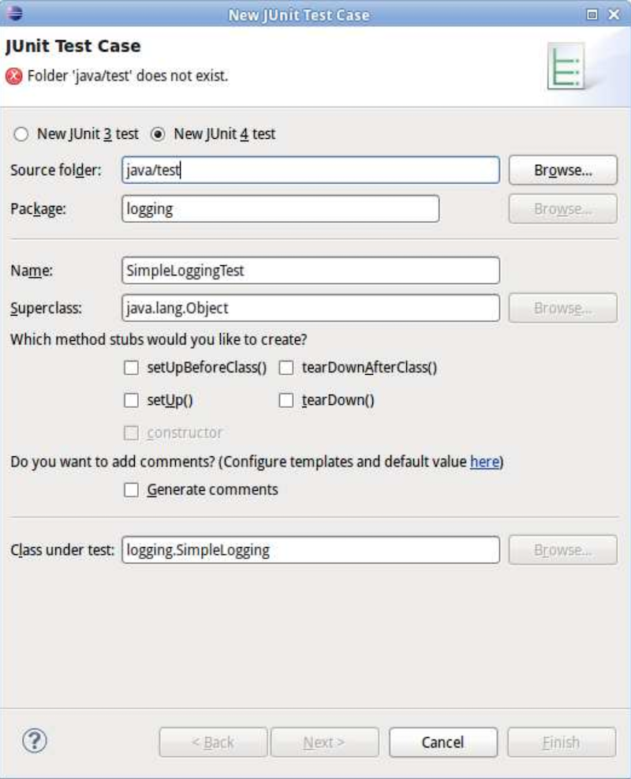
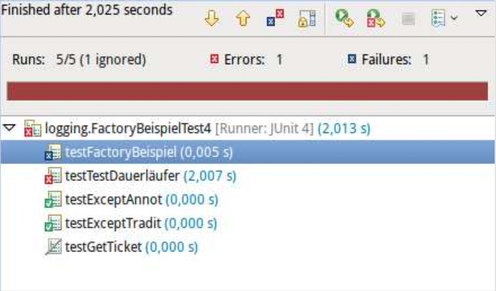

# Einführung Softwaretest

> [!NOTE]
>
> <details open>
>
> <summary><strong>🎯 TL;DR</strong></summary>
>
> Fehler schleichen sich durch Zeitdruck und hohe Komplexität schnell in
> ein Softwareprodukt ein. Die Folgen können von “ärgerlich” über
> “teuer” bis hin zu (potentiell) “tödlich” reichen. Richtiges Testen
> ist also ein wichtiger Aspekt bei der Softwareentwicklung!
>
> JUnit ist ein Java-Framework, mit dem Unit-Tests (aber auch andere
> Teststufen) implementiert werden können. In JUnit 4 und 5 zeichnet man
> eine Testmethode mit Hilfe der Annotation `@Test` an der
> entsprechenden Methode aus. Dadurch kann man Produktiv- und Test-Code
> prinzipiell mischen; Best Practice ist aber das Anlegen eines weiteren
> Ordners `test/` und das Spiegeln der Package-Strukturen. Für die zu
> testende Klasse wird eine korrespondierende Testklasse mit dem Suffix
> “Test” (Konvention) angelegt und dort die Testmethoden implementiert.
> Der IDE muss der neue `test/`-Ordner noch als Ordner für Sourcen bzw.
> Tests bekannt gemacht werden. In den Testmethoden baut man den Test
> auf, führt schließlich den Testschritt durch (beispielsweise konkreter
> Aufruf der zu testenden Methode) und prüft anschließend mit einem
> `assert*()`, ob das erzielte Ergebnis dem erwarteten Ergebnis
> entspricht. Ist alles OK, ist der Test “grün”, sonst “rot”.
>
> Da ein fehlschlagendes `assert*()` den Test abbricht, werden eventuell
> danach folgende Prüfungen **nicht** mehr durchgeführt und damit ggf.
> weitere Fehler maskiert. Deshalb ist es gute Praxis, in einer
> Testmethode nur einen Testfall zu implementieren und i.d.R. auch nur
> ein (oder wenige) Aufrufe von `assert*()` pro Testmethode zu haben.
>
> </details>
>
> <details>
>
> <summary><strong>🎦 Videos</strong></summary>
>
> - [VL Einführung Softwaretest](https://youtu.be/WGd83crqu4I)
> - [Demo Anlegen von Testfällen mit
>   JUnit](https://youtu.be/xcogVwHUo5o)
>
> </details>

## Software-Fehler und ihre Folgen


## (Einige) Ursachen für Fehler

- Zeit- und Kostendruck
- Mangelhafte Anforderungsanalyse
- Hohe Komplexität
- Mangelhafte Kommunikation
- Keine/schlechte Teststrategie
- Mangelhafte Beherrschung der Technologie
- …

## Irgendjemand muss mit Deinen Bugs leben!

Leider gibt es im Allgemeinen keinen Weg zu zeigen, dass eine Software
korrekt ist. Man kann (neben formalen Beweisansätzen) eine Software nur
unter möglichst vielen Bedingungen ausprobieren, um zu schauen, wie sie
sich verhält, und um die dabei zu Tage tretenden Bugs zu fixen.

Mal abgesehen von der verbesserten *User-Experience* führt weniger
fehlerbehaftete Software auch dazu, dass man seltener mitten in der
Nacht geweckt wird, weil irgendwo wieder ein Server gecrasht ist …
Weniger fehlerbehaftete Software ist auch leichter zu ändern und zu
pflegen! In realen Projekten macht Maintenance den größten Teil an der
Softwareentwicklung aus … Während Ihre Praktikumsprojekte vermutlich
nach der Abgabe nie wieder angeschaut werden, können echte Projekte
viele Jahre bis Jahrzehnte leben! D.h. irgendwer muss sich dann mit
Ihren Bugs herumärgern - vermutlich sogar Sie selbst ;)

> Always code as if the guy who ends up maintaining your code will be a
> violent psychopath who knows where you live. Code for readability.
>
> – [John F.
> Woods](https://groups.google.com/g/comp.lang.c++/c/rYCO5yn4lXw/m/oITtSkZOtoUJ)

Dieses Zitat taucht immer mal wieder auf, beispielsweise auf der [OSCON
2014](https://twitter.com/andypiper/status/490952891058757632) … Es
scheint aber tatsächlich, dass [John F.
Woods](https://groups.google.com/g/comp.lang.c++/c/rYCO5yn4lXw/m/oITtSkZOtoUJ)
die ursprüngliche Quelle war (vgl. [Stackoverflow:
876089](https://stackoverflow.com/questions/876089/who-wrote-this-programing-saying-always-code-as-if-the-guy-who-ends-up-maintai#878436)).

Da wir nur wenig Zeit haben und zudem vergesslich sind und obendrein die
Komplexität eines Projekts mit der Anzahl der Code-Zeilen i.d.R.
nicht-linear ansteigt, müssen wir das Testen automatisieren. Und hier
kommt JUnit ins Spiel :)

## Was wann testen? Wichtigste Teststufen

- **Modultest**
  - Testen einer Klasse und ihrer Methoden
  - Test auf gewünschtes Verhalten (Parameter, Schleifen, …)

<!-- -->

- **Integrationstest**
  - Test des korrekten Zusammenspiels mehrerer Komponenten
  - Konzentration auf Schnittstellentests

<!-- -->

- **Systemtest**
  - Test des kompletten Systems unter produktiven Bedingungen
  - Orientiert sich an den aufgestellten Use Cases
  - Funktionale und nichtfunktionale Anforderungen testen

=\> Verweis auf Wahlfach “Softwarequalität”

## JUnit: Test-Framework für Java

**JUnit** — Open Source Java Test-Framework zur Erstellung und
Durchführung wiederholbarer Tests

- JUnit 3
  - Tests müssen in eigenen Testklassen stehen
  - Testklassen müssen von Klasse `TestCase` erben
  - Testmethoden müssen mit dem Präfix “`test`” beginnen

<!-- -->

- **JUnit 4**
  - Annotation `@Test` für Testmethoden
  - Kein Zwang zu spezialisierten Testklassen (insbesondere kein Zwang
    mehr zur Ableitung von `TestCase`)
  - Freie Namenswahl für Testmethoden (benötigen nicht mehr Präfix
    “`test`”)

  Damit können prinzipiell auch direkt im Source-Code Methoden als
  JUnit-Testmethoden ausgezeichnet werden … (das empfiehlt sich in der
  Regel aber nicht)

<!-- -->

- *JUnit 5 = JUnit Platform + JUnit Jupiter + JUnit Vintage*
  - Erweiterung um mächtigere Annotationen
  - Aufteilung in spezialisierte Teilprojekte

  Das Teilprojekt “JUnit Platform” ist die Grundlage für das
  JUnit-Framework. Es bietet u.a. einen Console-Launcher, um Testsuiten
  manuell in der Konsole zu starten oder über Builder wie Ant oder
  Gradle.

  Das Teilprojekt “JUnit Jupiter” ist das neue Programmiermodell zum
  Schreiben von Tests in JUnit 5. Es beinhaltet eine TestEngine zum
  Ausführen der in Jupiter geschriebenen Tests.

  Das Teilprojekt “JUnit Vintage” beinhaltet eine TestEngine zum
  Ausführen von Tests, die in JUnit 3 oder JUnit 4 geschrieben sind.

*Anmerkung*: Wie der Name schon sagt, ist das Framework für Modultests
(“Unit-Tests”) gedacht. Man kann damit aber auch auf anderen Teststufen
arbeiten!

*Anmerkung*: Im Folgenden besprechen wir JUnit am Beispiel **JUnit 4**,
da diese Version des Frameworks besonders stark verbreitet ist und JUnit
5 (trotz offiziellem Release) immer noch stellenweise unfertig wirkt.
Auf Unterschiede zu JUnit 5 wird an geeigneter Stelle hingewiesen
(abgesehen von Import-Statements). Mit JUnit 3 sollte nicht mehr aktiv
gearbeitet werden, d.h. insbesondere keine neuen Tests mehr erstellt
werden, da diese Version nicht mehr weiterentwickelt wird.

## Anlegen und Organisation der Tests mit JUnit

- Anlegen neuer Tests: Klasse auswählen, Kontextmenü
  `New > JUnit Test Case` (IJ: Kontextmenü `Generate > Test`)

<!-- -->

- **Best Practice**:  Spiegeln der Paket-Hierarchie
  - Toplevel-Ordner `test` (statt `src`)
  - Package-Strukturen spiegeln
  - Testklassen mit Suffix “`Test`”



Vorteile dieses Vorgehens:

- Die Testklassen sind aus Java-Sicht im selben Package wie die
  Source-Klassen, d.h. Zugriff auf Package-sichtbare Methoden etc. ist
  gewährleistet
- Durch die Spiegelung der Packages in einem separaten Testordner erhält
  man eine gute getrennte Übersicht über jeweils die Tests und die
  Sourcen
- Die Wiederverwendung des Klassennamens mit dem Anhang “Test” erlaubt
  die schnelle Erkennung, welche Tests hier vorliegen

In der Paketansicht liegen dann die Source- und die Testklassen immer
direkt hintereinander (da sie im selben Paket sind und mit dem selben
Namen anfangen) =\> besserer Überblick!

## Anmerkung: Die (richtige) JUnit-Bibliothek muss im Classpath liegen!

Eclipse bringt für JUnit 4 und JUnit 5 die nötigen Jar-Dateien mit und
fragt beim erstmaligen Anlegen einer neuen Testklasse, ob die für die
ausgewählte Version **passenden JUnit-Jars zum Build-Path hinzugefügt**
werden sollen.

IntelliJ bringt ebenfalls eine JUnit 4 Bibliothek mit, die zum Projekt
als Abhängigkeit hinzugefügt werden muss. Für JUnit 5 bietet IntelliJ
an, die Jar-Dateien herunterzuladen und in einem passenden Ordner
abzulegen.

Alternativ lädt man die Bibliotheken entsprechend der Anleitung unter
[junit.org](https://junit.org/) herunter und bindet sie in das Projekt
ein.

## JUnit 4+5: Definition von Tests

Annotation `@Test` vor Testmethode schreiben

``` java
import org.junit.Test;
import static org.junit.Assert.*;

public class FactoryBeispielTest4 {
    @Test
    public void testGetTicket() {
        fail("not implemented");
    }
}
```

Für JUnit 5 muss statt `org.junit.Test` entsprechend
`org.junit.jupiter.api.Test` importiert werden.

Während in JUnit 4 die Testmethoden mit der Sichtbarkeit `public`
versehen sein müssen und keine Parameter haben (dürfen), spielt die
Sichtbarkeit in JUnit 5 keine Rolle (und die Testmethoden dürfen
Parameter aufweisen =\> vgl. Abschnitt “Dependency Injection for
Constructors and Methods” in der JUnit-Doku).

## JUnit 4: Ergebnis prüfen

Klasse **`org.junit.Assert`** enthält diverse **statische** Methoden zum
Prüfen:

``` java
// Argument muss true bzw. false sein
void assertTrue(boolean);
void assertFalse(boolean);

// Gleichheit im Sinne von equals()
void assertEquals(Object, Object);

// Test sofort fehlschlagen lassen
void fail();

...
```

Für JUnit 5 finden sich die Assert-Methoden im Package
`org.junit.jupiter.api.Assertions`.

## Anmerkung zum statischen Import

Bei normalem Import der Klasse `Assert` muss man jeweils den voll
qualifizierten Namen einer statischen Methode nutzen: `Assert.fail()`.

Alternative statischer Import: `import static org.junit.Assert.fail;`
=\> *Statische Member* der importierten Klasse (oder Interface) werden
über ihre *unqualifizierten Namen* zugreifbar. **Achtung**:
Namenskollisionen möglich!

``` java
// nur bestimmtes Member importieren
import static packageName.className.staticMemberName;
// alle statischen Member importieren
import static packageName.className.*;
```

- Beispiel normaler Import:

  ``` java
  import org.junit.Assert;
  Assert.fail("message");
  ```

<!-- -->

- Beispiel statischer Import:

  ``` java
  import static org.junit.Assert.fail;
  fail("message");
  ```

## Mögliche Testausgänge bei JUnit



1.  **Error**: Fehler im Programm (Test)
    - Unbehandelte Exception
    - Abbruch (Timeout)

<!-- -->

1.  **Failure**: Testausgang negativ
    - Assert fehlgeschlagen
    - `Assert.fail()` aufgerufen

<!-- -->

1.  **OK**

## Anmerkungen zu Assert

- Pro Testmethode möglichst nur **ein** Assert verwenden!
- Anderenfalls: Schlägt ein Assert fehl, wird der Rest nicht mehr
  überprüft …

## Wrap-Up

- Testen ist genauso wichtig wie Coden
- Richtiges Testen spart Geld, Zeit, …
- Tests auf verschiedenen Abstraktionsstufen

<!-- -->

- JUnit als Framework für (Unit-) Tests; hier JUnit 4 (mit Ausblick auf
  JUnit 5)
  - Testmethoden mit Annotation `@Test`
  - Testergebnis mit `assert*` prüfen

## 📖 Zum Nachlesen

- vogella GmbH ([2021](#ref-vogellaJUnit))
- The JUnit Team ([2022](#ref-junit4))
- Kleuker ([2019](#ref-Kleuker2019))
- Osherove ([2014](#ref-Osherove2014))
- Spillner und Linz ([2012](#ref-Spillner2012))
- Thies, Noelke, und Ungerc ([o. J.](#ref-fernunihagenJunit))

------------------------------------------------------------------------

> [!TIP]
>
> <details>
>
> <summary><strong>✅ Lernziele</strong></summary>
>
> - k2: Ich kenne verschiedene Ursachen von Softwarefehlern
> - k3: Ich kann Tests mit JUnit 4 und 5 unter Nutzung der Annotation @Test erstellen
>
> </details>
>
> <details>
>
> <summary><strong>🏅 Challenges</strong></summary>
>
> **Einfache JUnit-Tests I**
>
> Betrachten Sie die folgende einfache (und nicht besonders sinnvolle)
> Klasse `MyList<T>`:
>
> ``` java
> public class MyList<T> {
>     protected final List<T> list = new ArrayList<>();
>
>     public boolean add(T element) { return list.add(element); }
>     public int size() { return list.size(); }
> }
> ```
>
> Schreiben Sie mit Hilfe von JUnit (4.x oder 5.x) einige Unit-Tests für
> die beiden Methoden `MyList<T>#add` und `MyList<T>#size`.
>
> **Einfache JUnit-Tests II**
>
> Betrachten Sie die Methode `String concat(String str)` der Klasse
> `String` aus dem JDK.
>
> Implementieren Sie drei verschiedenartige Unit-Testfälle (inklusive
> der Eingabe- und Rückgabewerte) für diese Methode mit Hilfe von JUnit
> (Version 4.x oder 5.x).
>
> </details>

------------------------------------------------------------------------

> [!NOTE]
>
> <details>
>
> <summary><strong>👀 Quellen</strong></summary>
>
> <div id="refs" class="references csl-bib-body hanging-indent"
> entry-spacing="0">
>
> <div id="ref-Kleuker2019" class="csl-entry">
>
> Kleuker, S. 2019. *Qualitätssicherung durch Softwaretests*. Springer
> Vieweg. <https://doi.org/10.1007/978-3-658-24886-4>.
>
> </div>
>
> <div id="ref-Osherove2014" class="csl-entry">
>
> Osherove, R. 2014. *The Art of Unit Testing*. Manning.
>
> </div>
>
> <div id="ref-Spillner2012" class="csl-entry">
>
> Spillner, A., und T. Linz. 2012. *Basiswissen Softwaretest*. 5. Aufl.
> dpunkt.
>
> </div>
>
> <div id="ref-junit4" class="csl-entry">
>
> The JUnit Team. 2022. „JUnit 5“. 2022. <https://junit.org/>.
>
> </div>
>
> <div id="ref-fernunihagenJunit" class="csl-entry">
>
> Thies, A., C. Noelke, und Ungerc. o. J. „Einführung in JUnit“.
> Fernuniversität in Hagen. Zugegriffen 14. April 2020.
> <https://wiki.fernuni-hagen.de/eclipse/index.php/Einführung_in_JUnit>.
>
> </div>
>
> <div id="ref-vogellaJUnit" class="csl-entry">
>
> vogella GmbH. 2021. „JUnit 5 Tutorial - Learn How to Write Unit
> Tests“. 2021. <https://www.vogella.com/tutorials/JUnit/article.html>.
>
> </div>
>
> </div>
>
> </details>

------------------------------------------------------------------------


Unless otherwise noted, this work is licensed under CC BY-SA 4.0.

<blockquote><p><sup><sub><strong>Last modified:</strong> df56b1c (lecture: remove explicit link to pdf version, 2025-07-23)<br></sub></sup></p></blockquote>
