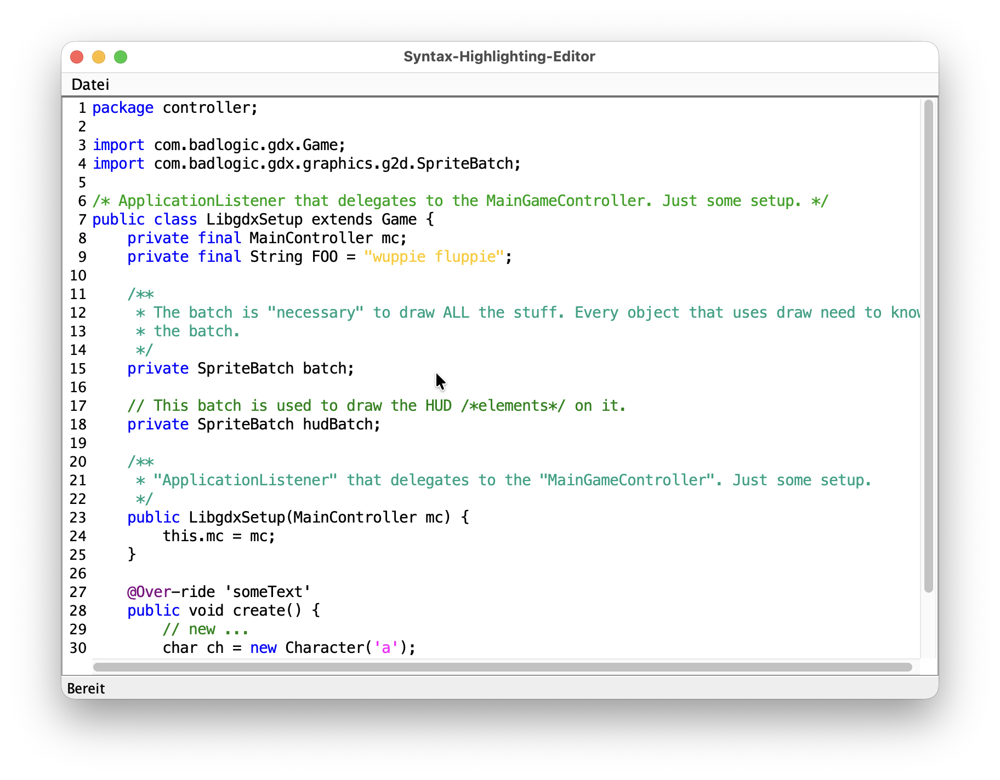
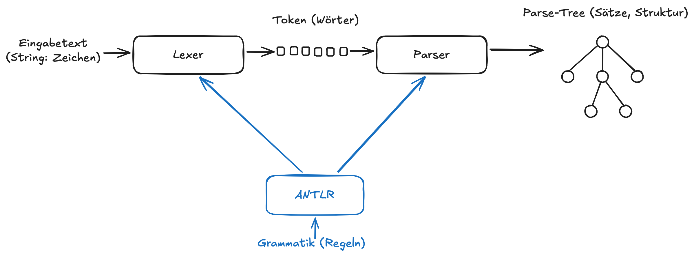
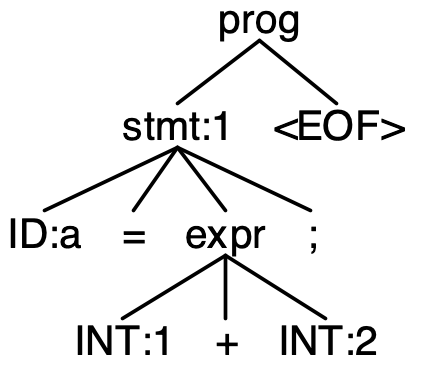
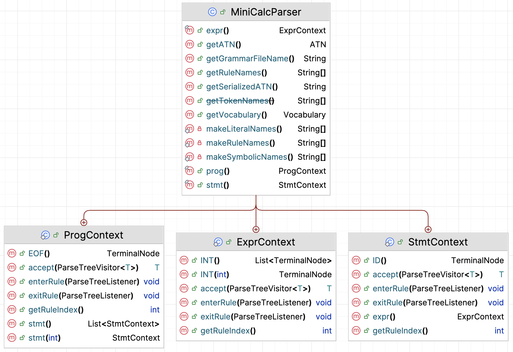
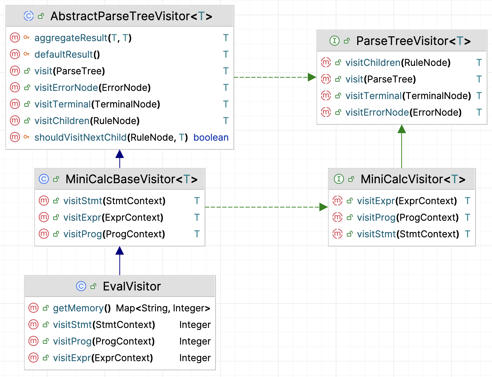

::: tldr
TODO
:::

::: youtube
TODO
:::


Ziel: ANTLR als "Blackbox-Tool" fürs Programmieren 2, ohne Grammatik‑/Compiler-Theorie zu betonen. Fokus: Baumstrukturen, Traversierung (Visitor), Integration in das bisherige Übungssetting (Regex -> ANTLR).

1.  Mentales Modell "Pipeline": Text -> Lexer -> Parser -> Baum
-   Nicht im Detail, nur: "Da entsteht ein Baum, den wir gleich besuchen."

2.  Wie komme ich in Java an den Wurzelknoten?
    -   4 Zeilen Code, die sie ggf. auch einfach abschreiben:

        sourceCode->lexer->tokens->parser->tree

3.  Was ist dieser Baum in Java?
    -   Generierte Kontext‑Klassen: `XxxContext`
    -   Kindknoten, Methoden wie `ctx.foo()` / `ctx.bar(i)` / `ctx.getText()`.


4.  Wie schreibe ich einen Visitor?
    -   Von `FooBaseVisitor<R>` erben.
    -   Relevante `visitXxx`‑Methoden überschreiben.
    -   In jeder Methode:
        -   den Kontext lesen (Kinder, Text),
        -   etwas tun (z.B. highlighten, AST-Knoten bauen),
        -   ggf. `visitChildren(ctx)` aufrufen.

5.  Ganz wichtig für Anfänger:innen:
    -   Sie müssen die **Grammatik nicht verstehen**.
    -   Sie müssen nur wissen:
        -   "Es gibt eine Regel program, also gibt es ProgramContext und eine Methode visitProgram."
    -   Übersetzung im Kopf: Regelname ↔ Knotentyp ↔ visit-Methode.

Alles andere (Lexer/Parser-Theorie, AST vs. Parse-Tree, Grammatikdesign, Pattern Matching) ist Kür und gehört ins 3. Semester.


# Motivation & Einordnung

{width="60%"}

Von regulären Ausdrücken zu "richtigen" Bäumen: ANTLR

::: notes
Kurzer Rückblick auf das Übungsblatt mit Syntax-Highlighting via Regex: Regex erkennt Muster im Text, aber kennt keine Struktur.

Problemstellung:
-   Wie komme ich von einzelnen Mustern zu einer Satzstruktur?
-   Wie kann ich gültigen Java-Code von ungültiger Syntax unterscheiden?

ANTLR4 als Lösung: [ANTLR](https://www.antlr.org) ist ein in Java geschriebenes Tool und Bibliothek, welche aus Text einen Strukturen (einen Parse-Baum) erzeugt.

Einordnung ins Curriculum: Wir betrachten jetzt im 2. Semester nur die rein praktische Nutzung als Bibliothek. Später im 3. Semester werden wir tiefer in die Grundlagen des Compilerbaus einsteigen und uns Grammatiken, Lexer und Parser, AST ... näher anschauen.
:::


# ANTLR als Blackbox-Pipeline

{width="80%"}

::: notes
Wir nutzen ANTLR als:
-   Java‑Bibliothek + Codegenerator, den wir über Gradle einbinden
-   Eingabe: eine vorgegebene Grammatikdatei + Ihr Quelltext
-   Ausgabe: automatisch erzeugte Java-Klassen, die einen zum eingegebenen Quelltext passenden Baum repräsentieren

Begriffe:
-   **Lexer**: zerteilt Zeichenstrom (Eingabe) in eine Folge von Wörtern (Tokens)
-   **Token**: Tupel `(Tokenname, optional: Wert)`
-   **Parser**: unterteilt Tokensequenz in gültige Sätze -> Parse Tree
-   **Parse Tree**: Repräsentiert die Struktur der Sätze, wobei jeder Knoten dem Namen einer
    Regel der Grammatik entspricht. Die Blätter bestehen aus den Token samt ihren Werten.
-   **Grammatik**: Regeln für den Aufbau der betrachteten Sprache (formale Beschreibung der Wörter und Sätze)
-   **ANTLR** generiert aus Grammatik einen Lexer und Parser plus diverse Hilfsklassen

Wie ein Lexer oder Parser funktioniert, was genau eine Grammatik ist ... das schauen wir uns in Compilerbau an. Für Prog2 brauchen Sie nur ein grundlegendes Bild und die Begriffe.
:::

# Technische Einbindung (Gradle, Projektstruktur)

::: notes
ANTLR im Java/Gradle‑Projekt nutzen: Einbindung als Tool (Gradle-Plugin) sowie als Bibliothek (Dependencies):
:::

```groovy
plugins {
    id 'java'
    id 'antlr'
}

repositories {
    mavenCentral()
}

dependencies {
    antlr 'org.antlr:antlr4:4.13.2'
    implementation 'org.antlr:antlr4-runtime:4.13.2'
}
```

::: notes
In der Gradle-Konfiguration `build.gradle` wird das ANTLR-Plugin für Gradle aktiviert und zusätzlich werden die Dependencies für die ANTLR-Bibliothek konfiguriert.
Die Grammatik-Dateien liegen dann im Sourcetree unterhalb von `src/main/antlr/`.


### Explizite Angabe der Pfade für die generierten Klassen

Das ANTLR-Plugin für Gradle hat eine eigene Vorstellung, wohin die generierten Klassen geschrieben werden. Die Defaults passen in der Regel, aber in der Praxis ist es tatsächlich oft hilfreich, zusätzlich den Ausgabeordner explizit anzugeben und auch für IntelliJ als Source-Ordner zu kennzeichnen. Dies erreicht man beispielsweise durch diese zusätzlichen Abschnitte im `build.gradle`:

```groovy
def antlrGenDir = layout.buildDirectory.dir('generated-src/antlr/main')

sourceSets {
    main {
        java.srcDir(antlrGenDir)
    }
}

tasks.named('generateGrammarSource') {
    maxHeapSize = '64m'
    arguments.addAll(['-visitor', '-long-messages'])
    outputDirectory = antlrGenDir.get().asFile
}
```

Mit diesem Snippet werden außerdem die Klassen für das Visitor-Pattern immer mit generiert.

### Build-Prozess

Mit der obigen Konfiguration wird ANTLR in den Gradle-Build-Prozess eingebunden. Bei jedem `./gradlew build` werden aus den Grammatiken in `src/main/antlr/` mit ANTLR die entsprechenden Java‑Klassen (Lexer, Parser, *Context‑Klassen, Visitor, ...) generiert und in einem Unterordner des Build-Ordner gespeichert. Das hat den Vorteil, dass die generierten Klassen von Git ignoriert werden, aber sie müssen explizit als "Sourcen" deklariert werden (dies passiert durch das ANTLR-Plugin in Gradle normalerweise automatisch, aber mit der obigen zusätzlichen Konfiguration ist man auf der sicheren Seite). Anschließend werden alle Java-Klassen im Projekt ganz normal kompiliert und (bei `./gradlew run`) ausgeführt.

Das bedeutet aber auch, dass nach einem `./gradlew clean` die generierten Klassen auch mit entfernt werden (liegen ja im Build-Ordner). Damit fehlen dann in Ihrem Source-Code die Importe für Lexer, Parser, Visitor etc. und die IDE zeigt eine Menge Fehler an. Führen Sie dann einmal einen `./gradlew build` oder `./gradlew generateGrammarSource` aus, um die generierten ANTLR-Dateien wieder neu zu generieren.

Sie arbeiten dann nur noch mit den Lexer-/Parser-Klassen wie etwa `FooParser`, den Kontext-Klasse wie `FooParser.StatementContext` und erweitern den generierten Basis-Visitor wie `FooBaseVisitor`. (Der Präfix "`Foo`" kommt von der betrachteten Grammatik, diese würde hier also `Foo.g4` heissen.)
:::


# Beispielgrammatik

```antlr
grammar MiniCalc;


// Programm besteht aus beliebig vielen Statements
prog  : stmt* EOF ;

// Statement: entweder Zuweisung oder nackter Ausdruck
stmt  : ID '=' expr ';'
      | expr ';'
      ;

// Ausdruck: eine oder mehrere Zahlen, addiert
expr  : INT ('+' INT)* ;


// LEXER-Regeln (Token)
ID    : [a-z][a-zA-Z0-9_]* ;
INT   : [0-9]+ ;

WS    : [ \t\r\n]+ -> skip ;
```

::: notes
Die gezeigte Grammatik besteht aus verschiedenen Teilen. Als erste Zeile findet man immer die Deklaration `grammar <NAME>;`, wobei der Name `NAME` auch der Dateiname ist (`NAME.g4`) und später den Präfix für die generierten Lexer-/Parser-/Visitoren-Klassen bildet.

Darunter finden sich verschiedene Regeln, die die betrachtete Sprache beschreiben. Es gibt zwei Arten von Regeln:

1. Lexer-Regeln: Diese beginnen mit einem Großbuchstaben und definieren einen regulären Ausdruck, der auf den Eingabetext angewendet wird.

    Jede Lexer-Regel entspricht einem Token. Im Beispiel gibt es die Regel `INT`, die den regulären Ausdruck `[0-9]+` anwendet. Damit matcht das Token `INT` alle Zeichenfolgen, die aus einer oder mehreren Ziffern bestehen. Zusätzlich gibt es noch nicht-benannte Token, das sind die in `'` eingeschlossenen Zeichenketten, beispielsweise `'"'` oder "';'". Die Whitespace-Token (`WS`) werden im Beispiel oben zwar gematcht, aber danach verworfen (`-> skip`) - wir brauchen diese nicht für die Prüfung der Strukturen.

2. Parser-Regeln: Diese beginnen mit einem Kleinbuchstaben und können andere Parser-Regeln "aufrufen" und auch Lexer-Regeln beinhalten.

    Die Parser-Regeln nutzen auch die aus regulären Ausdrücken bekannten Operatoren `+` (einmal oder öfter) und `*` (beliebig oft). Damit kann man die Regel `prog` so lesen: Ein Programm `prog` besteht aus beliebig vielen Statements (`stmt`), gefolgt von einem `EOF` (die Eingabe ist zuende, "End Of File").

    Die erste Parser-Regel ist die sogenannte "Start-Regel", die wir auf dem generierten Parser aufrufen können.
:::


# Minimaler Java-Code: Zerlegen der Eingabe in Token

```java
var input = CharStreams.fromString(text);
var lexer = new MiniCalcLexer(input);
var tokens = new CommonTokenStream(lexer);

tokens.fill(); // fill stream (fetch all tokens from lexer)

for (var t : tokens.getTokens()) {
    var tokenName = MiniCalcLexer.VOCABULARY.getSymbolicName(t.getType());
    System.out.printf(
        "%-10s line=%d col=%d text='%s'%n",
        tokenName, t.getLine(), t.getCharPositionInLine(), t.getText());
}
```

::: notes
Aus einer Grammatik `MiniCalc.g4` wurde ein Lexer generiert, der über `MiniCalcLexer` zur Verfügung steht. Der Lexer erwartet als Input einen `CharStream`, den wir aus dem Input (String) erzeugen und dem Konstruktor für `MiniCalcLexer` übergeben. Das Lexer-Objekt wird wiederum in den Konstruktor für `CommonTokenStream` übergeben und stellt den Tokenstream dar, den der aus der Grammatik `MiniCalc` generierte Lexer für den Eingabe-String erzeugt.

Normalerweise arbeiten wir nicht direkt mit dem Tokenstream, sondern übergeben diesen dem Parser. Im Beispiel wird demonstriert, wie man beispielsweise alle gefundenen Token der Reihe nach ausgeben kann. Dazu muss einmalig `tokens.fill()` aufgerufen werden (dies übernimmt sonst der Parser).

Die Eingabe `a = 1 + 2;` liefert bei der gezeigten Grammatik:

```
ID         line=1 col=0 text='a'
null       line=1 col=2 text='='
INT        line=1 col=4 text='1'
null       line=1 col=6 text='+'
INT        line=1 col=8 text='2'
null       line=1 col=9 text=';'
EOF        line=1 col=10 text='<EOF>'
```

Man erkennt, wie die Eingabe in einzelne Wörter (Token) zerlegt wurde. Leerzeichen wurden entfernt. Für benannte Token, d.h. Lexer-Regeln wie `ID` und `INT` wird der Tokenname mit ausgegeben. Für die impliziten Token, die in der Grammatik nur über `'='` angelegt sind, gibt es keinen Namen (`null`). Weiterhin sieht man für jedes Token, in welcher Zeile es gefunden wurde und an welcher Position es startet. `EOF` ist ein vordefiniertes Token, welches das Ende der Eingabe kennzeichnet.

Der gesamte Eingabetext muss in gültige Token überführt werden können, sonst gibt es eine Exception vom Lexer.
:::


# Minimaler Java-Code: Text -> Baum

```java
var input = CharStreams.fromString(text);
var lexer = new MiniCalcLexer(input);
var tokens = new CommonTokenStream(lexer);

var parser = new MiniCalcParser(tokens);
var tree = parser.prog(); // Wurzelknoten des Baums (Startregel der Grammatik)

IO.println(tree.toStringTree(parser));
```

::: notes
Hier wird das übliche Vorgehen gezeigt, wenn man mit dem Parse-Tree arbeiten möchte. Aus dem Eingabetext wird ein `CharStream` erzeugt und damit ein `MiniCalcLexer`. Mit diesem wird der `CommonTokenStream` angelegt und in einen neuen `MiniCalcParser` gesteckt. Damit haben wir einen Parser, der von ANTLR beim Kompilieren über Gradle aus der Grammatik generiert wurde und der für den übergebenen Eingabetext die vom Lexer gebildeten Token in einen Baum übersetzt. Da unsere Grammatik mit der Regel `prog` anfängt ("Start-Regel"), können wir uns den Baum mit Hilfe von `parser.prog()` zurückgeben lassen und damit weiter arbeiten. Die Baumwurzel `tree` ist ein Objekt vom Typ `MiniCalcParser.ProgContext`.

Wenn die Token nicht entsprechend den Regeln in der Grammatik auftauchen, wirft der Parser eine Exception.

Die Eingabe `a = 1 + 2;` liefert bei der gezeigten Grammatik:

```
(prog (stmt a = (expr 1 + 2) ;) <EOF>)
```

Dabei wird jeder Knoten in Klammern ausgegeben: Zuerst der Knotenname, danach die Kinder (die selbst Knoten sind). Die Token bilden die Blätter des Baumes, hier wird nur der Wert ausgegeben (nicht der Name).

Diesen Code können Sie als Schablone verwenden. Ab hier arbeiten wir normalerweise nur noch mit `tree`.
:::


# Der Parse-Baum: Klassenhierarchie & Struktur

:::::: columns
::: column
```antlr
grammar MiniCalc;

prog  : stmt* EOF ;
stmt  : ID '=' expr ';'
      | expr ';'
      ;
expr  : INT ('+' INT)* ;

ID    : [a-z][a-zA-Z0-9_]* ;
INT   : [0-9]+ ;
WS    : [ \t\r\n]+ -> skip ;
```
:::

::: column
Eingabe `a = 1 + 2;` liefert:

```
(prog (stmt a = (expr 1 + 2) ;) <EOF>)
```

{width="80%" web_width="40%"}
:::
::::::

---

:::::: columns
::: column
```antlr
grammar MiniCalc;

prog  : stmt* EOF ;
stmt  : ID '=' expr ';'
      | expr ';'
      ;
expr  : INT ('+' INT)* ;

ID    : [a-z][a-zA-Z0-9_]* ;
INT   : [0-9]+ ;
WS    : [ \t\r\n]+ -> skip ;
```
:::

::: column

{width="80%" web_width="40%"}
:::
::::::

::: notes
Wie sieht der erzeugte Baum in Java aus?

-   Grundprinzip:
    -   Jeder Knoten im Baum ist eine Instanz einer generierten **Kontext-Klasse**
    -   Jede **Kontext-Klasse** entspricht einer Grammatik-Regel (nur Parser-Regeln):
        -   z.B. `MiniCalcParser.ProgContext` (Regel "prog"), `MiniCalcParser.StmtContext` (Regel "stmt"), `MiniCalcParser.ExprContext` (Regel "expr"), ...
    -   Alle Baumknoten erben von einer gemeinsamen Basisklasse (`ParserRuleContext`)

-   Baumstruktur:
    -   Jeder Knoten hat Kinderknoten (andere Kontexte oder Tokens)
    -   Zugriff auf Elemente: Regel `stmt  : ID '=' expr ';' | expr ';' ;`:
        - Kontext-Klasse `MiniCalcParser.StmtContext``
        - Zugriff auf Token `ID`: `TerminalNode ID()`
        - Zugriff auf Kontext `expr`: `ExprContext expr()`
    -   Zusätzlich gibt es aus der Basisklasse für jede Kontext-Klasse noch
        -   `int getChildCount()`: wieviele Kinder hat dieser Knoten?
        -   `ParseTree getChild(int i)`: liefere das Kindknoten mit Index `i` zurück
        -   `String getText()`: liefere den gematchten Text aus dem Eingabetext zurück
:::


# Traversierung mit Visitor-Pattern

::: notes
Den Baum "besuchen" - Visitor-Pattern in ANTLR
:::

{width="80%"}

::: notes
-   ANTLR‑Visitor:
    -   ANTLR generiert ein `MiniCalcVisitor<T>`-Interface und eine `MiniCalcBaseVisitor<T>` Basisklasse mit leeren Standard-Implementierungen
    -   Jede Regel `xxx` in der Grammatik erzeugt:
        -   eine Kontext-Klasse `XxxContext`, und
        -   eine Methode `T visitXxx(XxxContext ctx)`
    -   Jede Knotentyp hat eine eigene `visitXxx`‑Methode, z.B.:
        -   `T visitProg(MiniCalcParser.ProgContext ctx)`
        -   `T visitStmt(MiniCalcParser.StmtContext ctx)`
        -   `T visitExpr(MiniCalcParser.ExprContext ctx)`

-   Vorgehen:
    -   Eigene Visitor‑Klasse schreiben, die von `MiniCalcBaseVisitor<T>` ableitet

        ```java
        public class EvalVisitor extends MiniCalcBaseVisitor<Integer> {}
        ```

    -   Nur die Methoden überschreiben, die relevant sind, z.B.

        ```java
        /** stmt : ID '=' expr ';' | expr ';' */
        @Override
        public Integer visitStmt(MiniCalcParser.StmtContext ctx) {
            if (ctx.ID() != null) { // ID '=' expr ';'
                String name = ctx.ID().getText();
                Integer value = visit(ctx.expr());
                memory.put(name, value);
                return value;
            } else
                return visit(ctx.expr()); // expr ';'
        }
        ```

    -   Visitor anwenden:

        ```java
        var tree = parser.prog();
        var eval = new EvalVisitor();
        var result = eval.visit(tree);

        IO.println("Umgebung: " + eval.getMemory());
        ```

-   Vorteile:
    -   Klare Trennung: Struktur (Baum) vs. Verarbeitung (Visitor).
    -   Erleichtert spätere Erweiterungen (weitere Visitor für andere Aufgaben).


**Beobachtungen**:

- `visitStmt` zeigt explizit, dass `ID` hier nur ein Token ist und dass hier direkt über `ctx.ID().getText()` zugegriffen wird. Für Token gibt es keine Kontext-Objekte, d.h. es gibt kein `IDContext`.
- `visitStmt` zeigt den Umgang mit einer Alternative: Entweder gilt `ID '=' expr ';'` *oder* `expr ';'`. D.h. man fragt in diesem Fall ab, ob es eine `ID` gibt und reagiert entsprechend: `if (ctx.ID() != null)` -> wenn es keine `ID` gibt, liefert `ctx.ID()` den Wert `null`.
- Wenn man die Kindknoten nicht direkt per Methode aufrufen will (oder kann, wenn es mehrere Kindknoten mit nicht vorher bekannter Anzahl wie in der Regel `expr  : INT ('+' INT)* ;`), kann man die tatsächliche Anzahl der Kindknoten per Aufruf `ctx.getChildCount()` abfragen und dann mit `ctx.getChild(i)` gezielt auf ein Kind zugreifen (Indexbereich `0` bis `i-1`).
:::


# Pattern Matching auf Bäumen (neuere Java-Versionen)

```java
Object node = ...;
switch (node) {
    case NumberNode n -> ...
    case BinaryOpNode b -> ...
    // ...
}
```


::: notes
# Syntaxhighlighting: Vergleich Regex-Ansatz vs. ANTLR-Ansatz

-   Regex-Ansatz:
    -   Arbeitet rein textbasiert (Zeile für Zeile, Zeichenketten)
    -   Schwer, verschachtelte Strukturen korrekt zu behandeln
    -   Kaum Information über Kontext (z.B. ob etwas eine Variable, ein Keyword oder Teil eines Strings ist)

-   ANTLR-Ansatz:
    -   Erstellt einen strukturierten Baum:
        -   Kennt Blöcke, Ausdrücke, Anweisungen, ...
    -   Kontextabhängige Verarbeitung wird möglich:
        -   Unterschiedliche Behandlung je nach Position im Baum

-   Für das Syntax-Highlighting-Beispiel:
    -   Nutzung des Tokenstreams vom Lexer für das reine Syntaxhighlighting
    -   Alternativ Traverierung des Parse-Tree mit einem Visitor:
        -   Highlighting abhängig von Knoten-Typ statt vagen Textmustern
        -   Achtung: Token mit `-> skip` tauchen nicht mehr im Baum auf, d.h. üblicherweise sind das Whitespaces und Kommentare
:::

::: notes
# Ausblick auf das 3. Semester (Compilerbau)

Wie es weitergeht: Vom Parse-Baum zum Compiler

-   Sie arbeiten in Prog2 nur mit `FooLexer`, `FooParser`, `XxxContext`-Klassen, `FooBaseVisitor`:
    -   den Standard-Code, um `tree = parser.program()` zu bekommen
    -   das Wissen: Knoten sind `XxxContext`‑Objekte
    -   einen eigenen Visitor, der von `FooBaseVisitor<...>` erbt
    -   Überschreiben der passenden `visitXxx`‑Methoden

-   Was Sie heute "unter der Haube" ignorieren durften:
    -   Wie die Grammatik aufgebaut ist und warum
    -   Wie Lexer und Parser intern funktionieren
    -   Unterschied Parse‑Baum vs. abstrakter Syntaxbaum (AST)

-   Im 3. Semester (Compilerbau) vertiefen wir:
    -   Definition eigener Grammatiken
    -   Schreiben und Erweitern eigener Sprachen
    -   Konstruktion von Lexer und Parser (inkl. ANTLR‑Details)
    -   Systematische AST‑Konstruktion, semantische Analyse, Interpreter, Compiler, Linter, Code-Formatter

Verbindung zu heute: Alles, was Sie jetzt zu Baumstrukturen, Visitor und Pattern Matching gelernt haben, wird im nächsten Semester direkt wiederverwendet!
:::


# Wrap-Up

TODO

::: readings
TODO
:::

::: outcomes
-   k2: Ich kann den Einsatz von Packages in Java erklären
:::

::: challenges
TODO
:::
