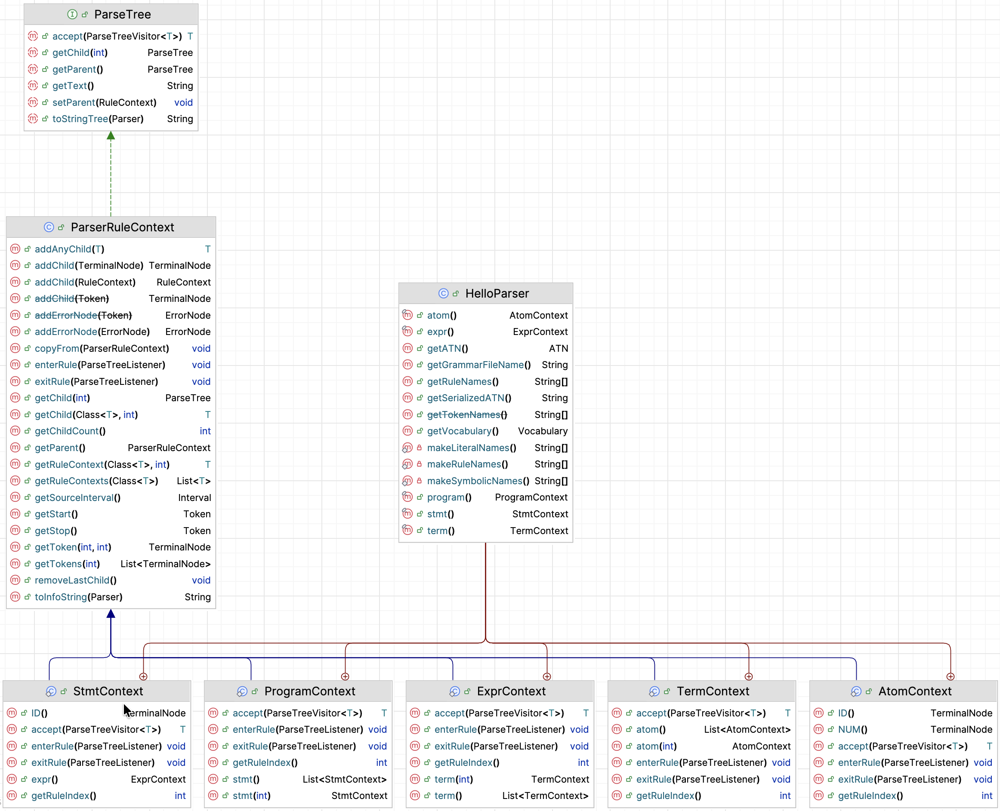
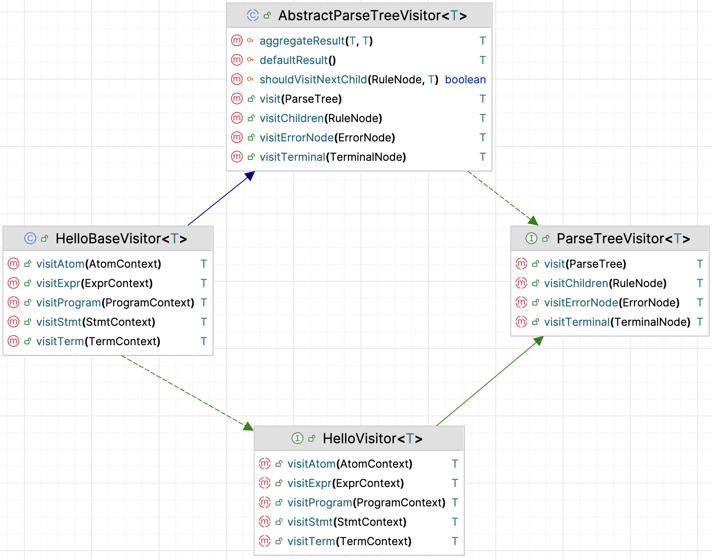

::: tldr
TODO
:::

::: youtube
TODO
:::


Ziel: ANTLR als "Blackbox-Tool" fürs Programmieren 2, ohne Grammatik‑/Compiler-Theorie zu betonen. Fokus: Baumstrukturen, Traversierung (Visitor), Integration in das bisherige Übungssetting (Regex -> ANTLR).

1.  Mentales Modell "Pipeline": Text -> Lexer -> Parser -> Baum
-   Nicht im Detail, nur: "Da entsteht ein Baum, den wir gleich besuchen."

2.  Wie komme ich in Java an den Wurzelknoten?
    -   4 Zeilen Code, die sie ggf. auch einfach abschreiben:

        sourceCode->lexer->tokens->parser->tree

3.  Was ist dieser Baum in Java?
    -   Generierte Kontext‑Klassen: `XxxContext`
    -   Kindknoten, Methoden wie `ctx.foo()` / `ctx.bar(i)` / `ctx.getText()`.


4.  Wie schreibe ich einen Visitor?
    -   Von `FooBaseVisitor<R>` erben.
    -   Relevante `visitXxx`‑Methoden überschreiben.
    -   In jeder Methode:
        -   den Kontext lesen (Kinder, Text),
        -   etwas tun (z.B. highlighten, AST-Knoten bauen),
        -   ggf. `visitChildren(ctx)` aufrufen.

5.  Ganz wichtig für Anfänger:innen:
    -   Sie müssen die **Grammatik nicht verstehen**.
    -   Sie müssen nur wissen:
        -   "Es gibt eine Regel program, also gibt es ProgramContext und eine Methode visitProgram."
    -   Übersetzung im Kopf: Regelname ↔ Knotentyp ↔ visit-Methode.

Alles andere (Lexer/Parser-Theorie, AST vs. Parse-Tree, Grammatikdesign, Pattern Matching) ist Kür und gehört ins 3. Semester.


# Motivation & Einordnung

Von regulären Ausdrücken zu "richtigen" Bäumen

-   Kurzer Rückblick auf das Übungsblatt mit Syntax-Highlighting via Regex:
    -   Regex erkennt Muster im Text, aber kennt keine Struktur.

-   Problemstellung:
    -   Wie komme ich von einem Text zu einer Baumstruktur, die ich in Java verarbeiten kann?

-   ANTLR4 als Lösung:
    -   Fertiges Tool / Library, die aus Text einen Parse-Baum erzeugt.
    -   Sie müssen zunächst nur wissen: "Ich gebe Text rein, ich bekomme einen Baum raus."


-   Einordnung ins Curriculum:
    -   Jetzt: rein praktische Nutzung von ANTLR im 2. Semester.
        -   Fertige Bibliothek, die für uns diesen Baum erzeugt.
        -   Wir nutzen sie wie jede andere Library (JUnit, etc.).
    -   Später im 3. Semester: Theoretische Grundlagen (Grammatik, Lexer/Parser, AST, ...).

# ANTLR als Blackbox-Pipeline

-   ANTLR als:
    -   Java‑Bibliothek + Codegenerator, den wir über Gradle einbinden.
    -   Eingabe: eine vorgegebene Grammatikdatei + Ihr Quelltext.
    -   Ausgabe: automatisch erzeugte Java-Klassen, die einen Baum repräsentieren.

-   Vereinfachtes Bild: `String -> Lexer -> TokenStream -> Parser -> Baum aus Java-Objekten`
    -   **Token**: Tupel `(Tokenname, optional: Wert)`
    -   **Lexer**: zerteilt Zeichenstrom (Eingabe) in eine Folge von Wörtern (Tokens)
    -   **Parser**: unterteilt Tokensequenz in gültige Sätze -> Parse Tree
    -   **Parse Tree**: Repräsentiert die Struktur der Sätze, wobei jeder Knoten dem Namen einer
        Regel der Grammatik entspricht. Die Blätter bestehen aus den Token samt ihren Werten.
    -   Steuerung: Regeln in einer **Grammatik** (formale Beschreibung der Wörter und Sätze)
    -   ANTLR generiert aus Grammatik einen Lexer und Parser und Hilfsklassen

-   Begriffe, die Sie kennen, aber nicht vertiefen müssen:
    -   Grammar, Lexer, Parser, Parse Tree - reine Arbeitsbegriffe.

-   Wichtig im 2. Semester:
    -   Welche Klassen entstehen?
    -   Wie sieht der Baum aus?
    -   Wie kann ich ihn traversieren / verarbeiten?


# Technische Einbindung (Gradle, Projektstruktur)

ANTLR im Java/Gradle‑Projekt nutzen

```groovy
plugins {
    id 'java'
    id 'antlr'
}

repositories {
    mavenCentral()
}

dependencies {
    antlr 'org.antlr:antlr4:4.13.2'
    implementation 'org.antlr:antlr4-runtime:4.13.2'
}
```

::: notes
In der Gradle-Konfiguration `build.gradle` wird das ANTLR-Plugin für Gradle aktiviert und zusätzlich werden die Dependencies für die ANTLR-Bibliothek konfiguriert.

Das ANTLR-Plugin für Gradle hat eine eigene Vorstellung, wohin die generierten Klassen geschrieben werden. Die Defaults passen in der Regel, aber in der Praxis ist es tatsächlich oft hilfreich, zusätzlich den Ausgabeordner explizit anzugeben und auch für IntelliJ als Source-Ordner zu kennzeichnen. Dies erreicht man beispielsweise durch diese zusätzlichen Abschnitte im `build.gradle`:

```groovy
def antlrGenDir = layout.buildDirectory.dir('generated-src/antlr/main')

sourceSets {
    main {
        java.srcDir(antlrGenDir)
    }
}

tasks.named('generateGrammarSource') {
    maxHeapSize = '64m'
    arguments.addAll(['-visitor', '-long-messages'])
    outputDirectory = antlrGenDir.get().asFile
}
```

Mit diesem Snippet werden außerdem die generierten Klassen für das Visitor-Pattern immer mit generiert.
:::

-   Kurzer Überblick über die Einbindung (ohne ins Detail zu gehen):
    -   Gradle‑Plugin (oder Dependency) für ANTLR.
    -   Grammatikdatei liegt z.B. unter `src/main/antlr/`.

-   Build‑Prozess (vereinfacht):
    -   Gradle führt ANTLR aus.
    -   ANTLR generiert Java‑Klassen (Lexer, Parser, *Context‑Klassen).
    -   Diese Klassen werden ganz normal mitkompiliert.

-   Für die Studierenden:
    -   Sie ändern im 2. Semester die Grammatik nicht.
    -   Sie arbeiten mit:
        -   der Parser‑Klasse (z.B. `FooParser`)
        -   den Context-Klassen (z.B. `FooParser.StatementContext`)
        -   ggf. einem generierten `FooBaseVisitor`.


# Minimaler Java-Code: Text -> Baum

```java
var input = CharStreams.fromString(text);
var lexer = new HelloLexer(input);
var tokens = new CommonTokenStream(lexer);

tokens.fill(); // fill stream (fetch all tokens from lexer)

for (var t : tokens.getTokens()) {
    var tokenName = HelloLexer.VOCABULARY.getSymbolicName(t.getType());
    System.out.printf(
        "%-10s line=%d col=%d text='%s'%n",
        tokenName, t.getLine(), t.getCharPositionInLine(), t.getText());
}
```

::: notes
Eingabe `a = 1 + 2;` liefert:

```
ID         line=1 col=0 text='a'
null       line=1 col=2 text='='
NUM        line=1 col=4 text='1'
null       line=1 col=6 text='+'
NUM        line=1 col=8 text='2'
null       line=1 col=9 text=';'
EOF        line=1 col=10 text='<EOF>'
```
:::


```java
var input = CharStreams.fromString(text);
var lexer = new HelloLexer(input);
var tokens = new CommonTokenStream(lexer);

var parser = new HelloParser(tokens);
var tree = parser.program(); // Wurzelknoten des Baums (Startregel der Grammatik)

IO.println(tree.toStringTree(parser));
```

::: notes
Eingabe `a = 1 + 2;` liefert:

```
(program (stmt a = (expr (term (atom 1)) + (term (atom 2))) ;))
```
:::

-   `HelloLexer` und `HelloParser` sind aus Grammatik `Hello.g4` generiert (durch ANTLR).
-   `parser.program()` entspricht der Startregel `program`.
-   `tree` ist ein Objekt vom Typ `HelloParser.ProgramContext`.

Hinweis: Name der Grammatik: `Foo.g4` -> Name des Lexers: `FooLexer`, Name des Parsers: `FooParser`

Diesen Code können Sie als Schablone verwenden. Ab da arbeiten wir nur noch mit `tree`.


# Der Parse-Baum: Klassenhierarchie & Struktur

Wie sieht der erzeugte Baum in Java aus?

-   Grundprinzip:
    -   Jeder Knoten im Baum ist eine Instanz einer **Context-Klasse**:
    -   Es gibt generierte **Kontext-Klassen** für Sprachkonstrukte (Grammatik-Regeln):
        -   z.B. `HelloParser.ProgramContext` (Regel "program"), `HelloParser.StmtContext` (Regel "stmt"), `HelloParser.ExprContext` (Regel "expr"), ...

-   Typische Vererbung:
    -   Alle Baumknoten erben von einer gemeinsamen Basisklasse (`ParserRuleContext`).
    -   Spezifische Kontexte bilden eine Klassenhierarchie.

-   Baumstruktur:
    -   Jeder Knoten hat Kinderknoten (andere Kontexte oder Tokens).
    -   Vergleich zu eigenen Baumklassen aus "Programmieren 1/2":
        -   Ähnlich wie selbst geschriebene `Node`-Klassen, nur automatisch generiert.

-   Beispiel, visuelle Darstellung:
    -   Grammatik: Regel für Expressions
    -   Eingabe z.B. für `x = 1 + 2;`
    -   Generierter Baum:
        -   grafisch, Screenshot
        -   generierte Klassen und Methoden: `ExprContext expr()`, `List<StmtContext> stmt()`, ...

```antlr
grammar Hello;

program : stmt* ;

stmt    : ID '=' expr ';' | expr ';' ;

expr    : term ('+' term)* ;
term    : atom ('*' atom)* ;
atom    : ID | NUM ;

ID      : [a-z][a-zA-Z]* ;
NUM     : [0-9]+ ;
WS      : [ \t\n]+ -> skip ;
```

Eingabe `a = 1 + 2;` liefert:

```
(program (stmt a = (expr (term (atom 1)) + (term (atom 2))) ;))
```

{width="60%" web_width="30%"}

```java
public static class ProgramContext extends ParserRuleContext {
    public List<StmtContext> stmt() {
        return getRuleContexts(StmtContext.class);
    }
    public StmtContext stmt(int i) {
        return getRuleContext(StmtContext.class,i);
    }
...
}

public static class StmtContext extends ParserRuleContext {
    public TerminalNode ID() { return getToken(HelloParser.ID, 0); }
    public ExprContext expr() {
        return getRuleContext(ExprContext.class,0);
    }
    ...
}

public static class ExprContext extends ParserRuleContext {
    public List<TermContext> term() {
        return getRuleContexts(TermContext.class);
    }
    public TermContext term(int i) {
        return getRuleContext(TermContext.class,i);
    }
    ...
}

public static class TermContext extends ParserRuleContext {
    public List<AtomContext> atom() {
        return getRuleContexts(AtomContext.class);
    }
    public AtomContext atom(int i) {
        return getRuleContext(AtomContext.class,i);
    }
    ...
}


public static class AtomContext extends ParserRuleContext {
    public TerminalNode ID() { return getToken(HelloParser.ID, 0); }
    public TerminalNode NUM() { return getToken(HelloParser.NUM, 0); }
    ...
}
```




# Traversierung mit Visitor-Pattern

Den Baum "besuchen" - Visitor in ANTLR



-   Aufgabe:
    -   Wir wollen den generierten Baum verarbeiten (z.B. für Syntax-Highlighting, Auswertung, Umwandlung in AST).

-   ANTLR‑Visitor:
    -   ANTLR generiert ein `FooVisitor<T>`-Interface und eine `FooBaseVisitor<T>` Basisklasse mit leeren Standard-Implementierungen.
    -   Jede Regel `xxx` in der Grammatik erzeugt:
        -   eine Kontext-Klasse `XxxContext`
        -   und eine Methode `T visitXxx(XxxContext ctx)`
    -   Jede Knotentyp hat eine eigene `visitXxx`‑Methode, z.B.:
        -   `visitProgram(ProgramContext ctx)`
        -   `visitExpr(ExprContext ctx)`

-   Vorgehen:
    -   Eigene Visitor‑Klasse schreiben, die von `HelloBaseVisitor<...>` erbt.
        ```java
        public class MyVisitor extends HelloBaseVisitor<Void> {}
        ```
    -   Nur die Methoden überschreiben, die relevant sind.
        ```java
        @Override
        public Void visitExpr(HelloParser.ExprContext ctx) {
            // hier: Farbe wählen, Tokenposition auslesen, etc.
            return null;
        }
        ```
    -   Visitor anwenden:
        ```java
        var visitor = new MyVisitor();
        visitor.visit(tree);
        ```
-   Vorteile:
    -   Klare Trennung: Struktur (Baum) vs. Verarbeitung (Visitor).
    -   Erleichtert spätere Erweiterungen (weitere Visitor für andere Aufgaben).


# Pattern Matching auf Bäumen (neuere Java-Versionen)

```java
Object node = ...;
switch (node) {
    case NumberNode n -> ...
    case BinaryOpNode b -> ...
    // ...
}
```


# Vergleich: Regex-Ansatz vs. ANTLR-Ansatz

-   Regex-Ansatz:
    -   Arbeitet rein textbasiert (Zeile für Zeile, Zeichenketten).
    -   Schwer, verschachtelte Strukturen korrekt zu behandeln.
    -   Kaum Information über Kontext (z.B. ob etwas eine Variable, ein Keyword oder Teil eines Strings ist).


-   ANTLR-Ansatz:
    -   Erstellt einen strukturierten Baum:
        -   Kennt Blöcke, Ausdrücke, Anweisungen, ...
    -   Kontextabhängige Verarbeitung wird möglich:
        -   Unterschiedliche Behandlung je nach Position im Baum.

-   Für das Syntax-Highlighting-Beispiel:
    -   Visitor über den Parse-Baum:
        -   Highlighting abhängig von Knoten-Typ statt vagen Textmustern.

-   Didaktischer Punkt:
    -   Vorbereitung auf sprachbasierte Werkzeuge:
        -   Interpreter, Compiler, Linter, Code-Formatter.


# Ausblick auf das 3. Semester (Compilerbau)

Wie es weitergeht: Vom Parse-Baum zum Compiler

-   Sie arbeiten in Prog2 nur mit `FooLexer`, `FooParser`, `XxxContext`-Klassen, `FooBaseVisitor`:
    -   den Standard-Code, um `tree = parser.program()` zu bekommen.
    -   das Wissen: Knoten sind `XxxContext`‑Objekte.
    -   einen eigenen Visitor, der von `FooBaseVisitor<...>` erbt.
    -   Überschreiben der passenden `visitXxx`‑Methoden.

-   Was Sie heute "unter der Haube" ignorieren durften:
    -   Wie die Grammatik aufgebaut ist.
    -   Wie Lexer und Parser intern funktionieren.
    -   Unterschied Parse‑Baum vs. abstrakter Syntaxbaum (AST).

-   Im 3. Semester (Compilerbau) vertiefen wir:
    -   Definition eigener Grammatiken.
    -   Schreiben und Erweitern eigener Sprachen.
    -   Konstruktion von Lexer und Parser (inkl. ANTLR‑Details).
    -   Systematische AST‑Konstruktion, semantische Analyse, Interpreter.


-   Verbindung zu heute: Alles, was Sie jetzt zu Baumstrukturen, Visitor und Pattern Matching lernen, ist direkt wiederverwendbar:


# Wrap-Up

TODO

::: readings
TODO
:::

::: outcomes
-   k2: Ich kann den Einsatz von Packages in Java erklären
:::

::: challenges
TODO
:::
