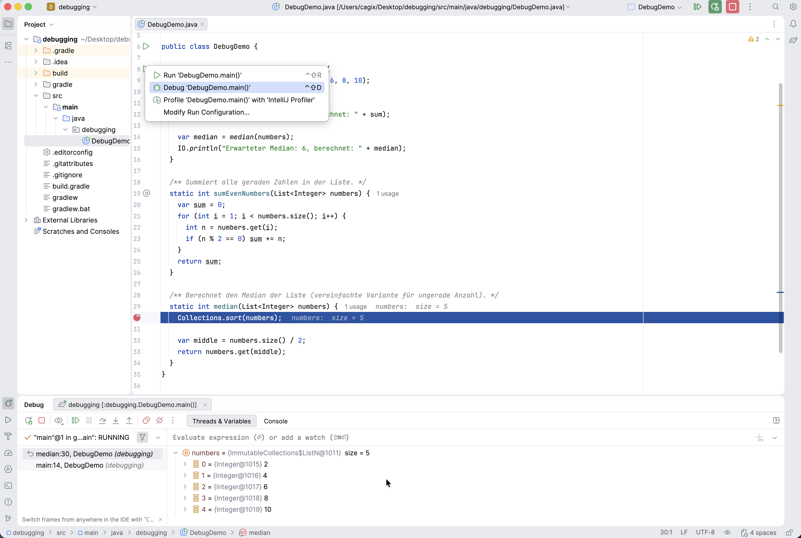
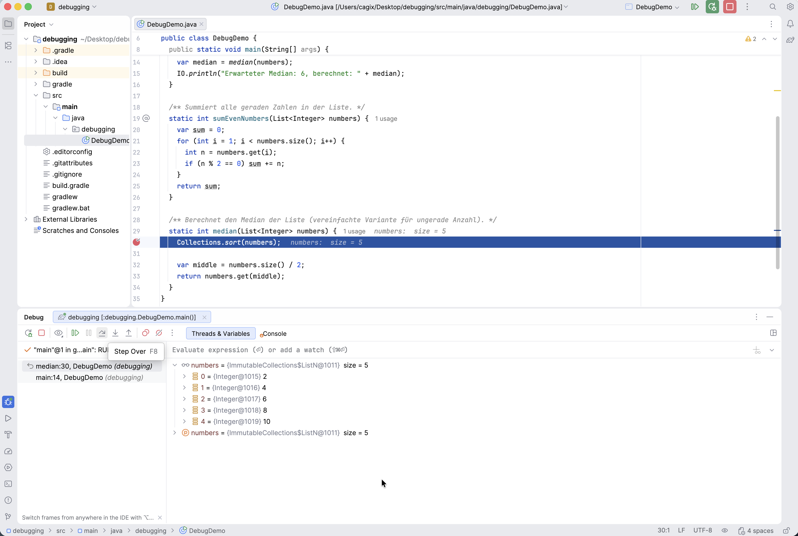
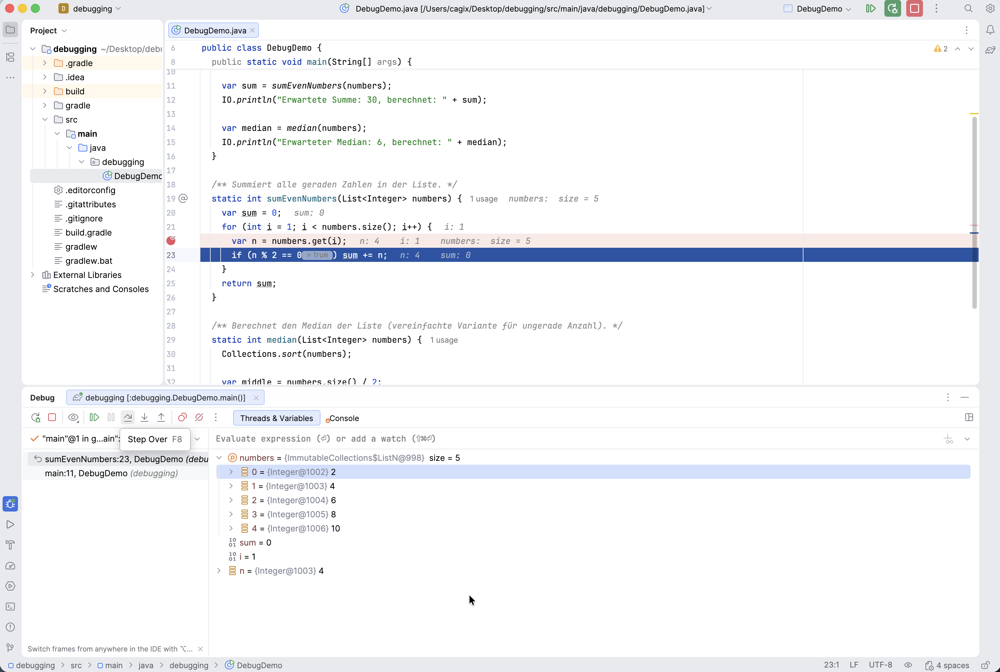

::: tldr
Der Debugger ist ein zentrales Werkzeug in der Softwareentwicklung. Man kann ihn
einsetzen, um sowohl Exceptions als auch Logikfehler systematisch zu finden, statt
mit im Code strategisch verstreuten `IO.println` den Zustand des ausgeführten
Programms zu erraten.

Man kann im Debugger an den zu untersuchenden Stellen **Breakpoints** setzen und die
Programmausführung dort stoppen lassen. Mit **Step Over** kann eine Anweisung
ausgeführt werden, mit **Step Into** kann in die Anweisung hineingesprungen werden
(etwa in einen Methodenaufruf), und mit **Step Out** führe ich die aktuelle Methode
aus und kehre zum Aufrufer zurück. Mit dem **Variablenfenster** und dem **Call
Stack** kann ich gezielt beobachten, was mein Programm wirklich tut und sogar
Variablenwerte verändern und Ausdrücke live evaluieren. Mit bedingten Breakpoints
kann man dynamisch auf Programmzustände reagieren.

Man versucht Fehler zu beobachten und zu reproduzieren, um sich eine Hypothese zu
bilden. Mit Breakpoints hält man den Debugger bei der Programmausführung an den
"interessanten" Stellen an und kann den Code dann schrittweise ausführen, um ihn
kontrolliert analysieren und verbessern zu können.
:::

::: youtube
Vorlesung \[[YT](https://youtu.be/iARD8mW0vrM)\],
\[[HSBI](https://www.hsbi.de/medienportal/video/pr2-debugging/943f962491c29fe171f465dffbb47f52)\]
:::

# Software hat (immer) Fehler

-   **Testen** = Aufdecken/Provozieren von Fehlern

\bigskip

-   **Debuggen** = Finden der Stelle im Code

# Warum Debuggen?

Typische Fehlerarten:

-   **Exceptions**: Programm bricht ab

    ::: notes
    -   z.B. `NullPointerException`, `IndexOutOfBoundsException`,
        `UnsupportedOperationException`
    :::

-   **Logikfehler**: Programm läuft durch, Ergebnis ist aber falsch

\bigskip

Warum Debugger statt `IO.println`:

-   **Alle Variablenwerte** in einem Zustand sichtbar
-   Programm **Schritt für Schritt** ausführbar
-   **Call Stack** (Wer hat wen aufgerufen?)
-   Komplexe Bedingungen (z.B. **bedingte Breakpoints**)

::: notes
... und man muss auch nicht daran denken, dass man die ganzen `IO.println`, die
überall im Code verstreut sind, auch alle wieder entfernen muss :)
:::

# Die wichtigsten Debugger-Werkzeuge

{web_width="80%"}

::: notes
-   **Breakpoint**
    -   Rotes Markierungssymbol an einer Codezeile
    -   Programm hält an dieser Stelle an
    -   Bedingte Breakpoints prüfen einen Ausdruck und halten nur an, wenn die
        Bedingung erfüllt ist
-   **Run / Debug**
    -   Programm im **Debug-Modus** starten (statt normalem Run)
-   **Step Over**
    -   Nächste Zeile ausführen, Methodenaufrufe werden "übersprungen" (ausgeführt)
-   **Step Into**
    -   In den aufgerufenen Methoden-Body hineinspringen
-   **Step Out**
    -   Aktuellen Stack-Frame (laufender Aufruf einer Methode/Funktion) bis zum Ende
        ausführen und zurück zum Aufrufer
-   **Resume**
    -   Setze das Programm fort (bis zum nächsten Breakpoint oder bis zum
        Programmende - was von beidem als erstes auftritt)
-   **Variables / Watches**
    -   Aktuelle Werte von Variablen und Ausdrücken ansehen und (bei Bedarf) ändern
    -   Watches: können Variablen und komplexere Ausdrücke halten, werden ganz oben
        in der Variablenliste angezeigt
-   **Evaluate Expressions**
    -   Ausdrücke im laufenden Programm auswerten, auch mit Nebeneffekten
    -   Ausdrücke können auch als "Watch" angelegt werden und bleiben dauerhaft im
        Blick
-   **Call Stack**
    -   Liste der aktuell verschachtelten Methodenaufrufe (Stack Frames)

Die Begriffe können je nach IDE (IntelliJ, Eclipse, VS Code, ...) leicht variieren.
:::

# Standard-Vorgehen beim Debuggen

1.  **Fehler beobachten**
    -   Was genau passiert? Exception? Falsches Ergebnis?
2.  **Fehler reproduzierbar machen**
    -   Konkrete Eingaben / Szenario festlegen
3.  **Hypothese bilden**
    -   Was könnte im Code falsch laufen?
4.  **Breakpoint setzen**
    -   In einer relevanten Methode / vor einer verdächtigen Stelle
5.  **Im Debug-Modus starten**
    -   Programm läuft bis zum Breakpoint
6.  **Schrittweise ausführen & Variablen beobachten**
    -   `Step Over` / `Step Into`, Variablenfenster, ggf. Ausdrucksauswertung
7.  **Fehler lokalisieren und fixen**
    -   Code korrigieren, dann wieder bei Schritt 1 beginnen

# Demo 1: Exception beim Median (Crash)

::: notes
## Beispielmethode:

[Beispiel: debugging.DebugDemo#median]{.ex
href="https://github.com/Programmiermethoden-CampusMinden/Prog2-Lecture/blob/master/lecture/tooling/src/debugging/DebugDemo.java#L29"}
:::

``` java
static int median(List<Integer> numbers) {
    Collections.sort(numbers);  // BUG: UnsupportedOperationException
    var middle = numbers.size() / 2;
    return numbers.get(middle);
}
```

::: notes
## Situation:

-   `numbers` kommt aus `List.of(2, 4, 6, 8, 10);`
-   `List.of` liefert eine **unveränderliche** Liste
-   `Collections.sort(numbers)` versucht, die Liste zu ändern
-   -\> `java.lang.UnsupportedOperationException`

## Schritte in der Demo:

1.  Programm normal ausführen -\> Absturz, Stacktrace ansehen
2.  Im Stacktrace die Zeile in `median` finden
3.  **Breakpoint** in `median` auf die Zeile mit `Collections.sort(...)` setzen
4.  Programm im **Debug-Modus** starten
5.  Im Debugger:
    -   Prüfen: Was ist der Typ von `numbers`?
    -   `Step Over` auf `Collections.sort(numbers);` -\> Exception tritt auf
    -   Call Stack ansehen (Wer hat `median` aufgerufen?)
:::

\smallskip

{width="70%" web_width="80%"}

::: notes
## Anschließender Fix (live in der Demo):

``` java
static int median(List<Integer> numbers) {
    // Kopie in eine veränderliche Liste
    List<Integer> copy = new ArrayList<>(numbers);
    Collections.sort(copy);

    var middle = copy.size() / 2;
    return copy.get(middle);
}
```

Dann Programm erneut im Debug-Modus starten und prüfen, ob der Crash behoben ist.
:::

# Demo 2: Logikfehler bei der Summe (falsches Ergebnis)

::: notes
## Beispielmethode:

[Beispiel: debugging.DebugDemo#sumEvenNumbers]{.ex
href="https://github.com/Programmiermethoden-CampusMinden/Prog2-Lecture/blob/master/lecture/tooling/src/debugging/DebugDemo.java#L19"}
:::

``` java
static int sumEvenNumbers(List<Integer> numbers) {
    var sum = 0;
    // BUG: Schleife startet bei 1, Element mit Index 0 (Wert 2) wird nie besucht
    for (int i = 1; i < numbers.size(); i++) {
        var n = numbers.get(i);  if (n % 2 == 0)  sum += n;
    }
    return sum;
}
```

::: notes
## Ausgabe in `main`:

``` java
var sum = sumEvenNumbers(numbers);
IO.println("Erwartete Summe: 30, berechnet: " + sum);
```

Ergebnis: `Erwartete Summe: 30, berechnet: 28`

## Schritte in der Demo:

1.  Breakpoint in der Zeile mit `var n = numbers.get(i);` (in der Schleife) setzen
2.  Programm im Debug-Modus starten
3.  Bei jedem Halt:
    -   `i`, `n` und `sum` im Variablenfenster beobachten
    -   Mit `Step Over` zur nächsten Zeile
4.  Fragen an die Studierenden:
    -   Welche Werte nimmt `i` an?
    -   Welche Elemente der Liste werden tatsächlich besucht?
    -   Warum wird die 2 (Index 0) nicht berücksichtigt?
:::

\smallskip

{width="50%" web_width="80%"}

::: notes
## Anschließender Fix (live in der Demo):

``` java
for (int i = 0; i < numbers.size(); i++) {  // i startet jetzt bei 0
    var n = numbers.get(i);
    if (n % 2 == 0)  sum += n;
}
```

Danach erneut im Debug-Modus ausführen und die Werte von `i`, `n` und `sum`
beobachten.
:::

# Tipps zum selbstständigen Üben

-   Probieren Sie in Ihrer IDE:
    -   Einen **Bedingten Breakpoint**: z.B. in der Schleife von `sumEvenNumbers`
        nur halten, wenn `i == 0` oder `n > 5`
    -   Das **Ändern von Variablenwerten** im Debugger
    -   Das **Auswerten von Ausdrücken** (Evaluate Expression)
-   Ersetzen Sie in `main` die Beispiel-Liste durch andere Daten:
    -   z.B. leere Liste, eine Liste mit nur einem Element, ungerade/gerade Anzahl
-   Ziel: Sie sollten das Gefühl haben, dass Sie den Debugger **aktiv steuern**
    können, statt nur "zuzuschauen".

# Wrap-Up

-   Debugger ist zentrales Werkzeug:
    -   Breakpoints, Step Over/Into/Out, Variablen, Call Stack

\smallskip

-   Vorgehen:
    -   Fehler beobachten -\> reproduzieren -\> Hypothese -\> Breakpoint -\>
        schrittweise ausführen -\> fixen

::: readings
Zum Weiterlesen für Interessierte kann ich das Online-Buch meines Kollegen Andreas
Zeller empfehlen: [The Debugging Book](https://www.debuggingbook.org/). Das Buch
geht aber deutlich über den hier besprochenen Inhalt hinaus ...
:::

::: outcomes
-   k3: Ich kann einen Fehler gezielt **reproduzieren**
-   k3: Ich kann eine **Exception** mit Hilfe des **Stacktraces** und des Debuggers
    analysieren
-   k3: Ich kann einen **Logikfehler** (falsches Ergebnis) mit Breakpoints und
    schrittweiser Ausführung finden
-   k2: Ich kann die wichtigsten Debugger-Funktionen in meiner IDE benennen
:::

::: challenges
Nehmen Sie Ihren eigenen Code aus Übungen/Projekten und debuggen Sie bewusst ein
paar Methoden, auch wenn (scheinbar) alles funktioniert.
:::
