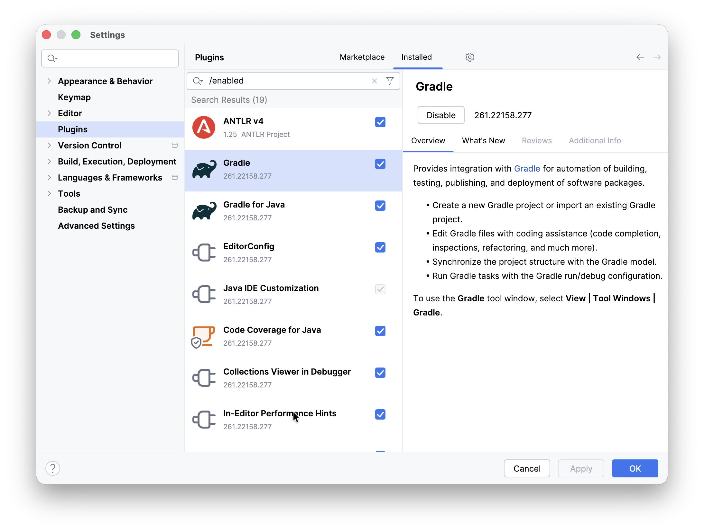
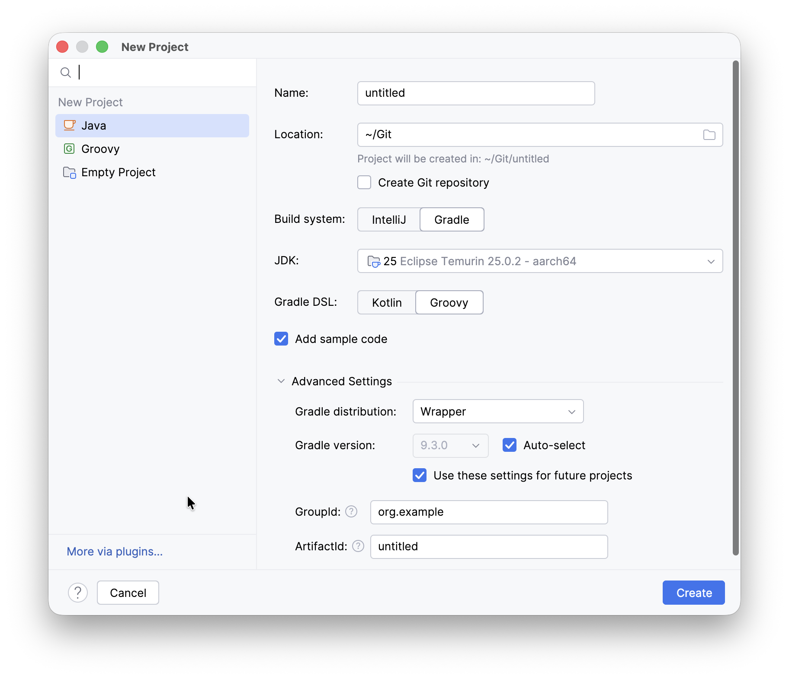
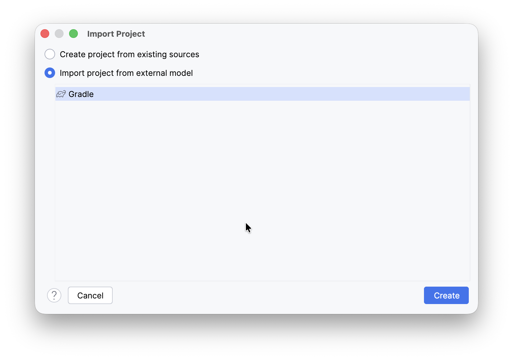
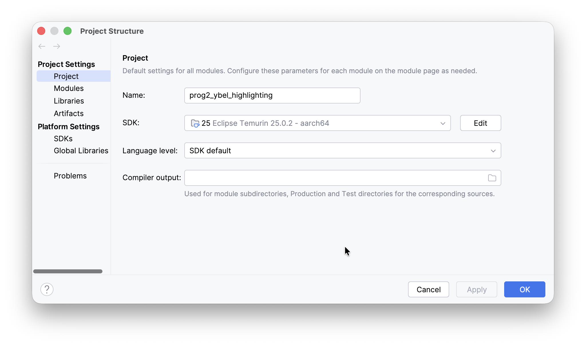
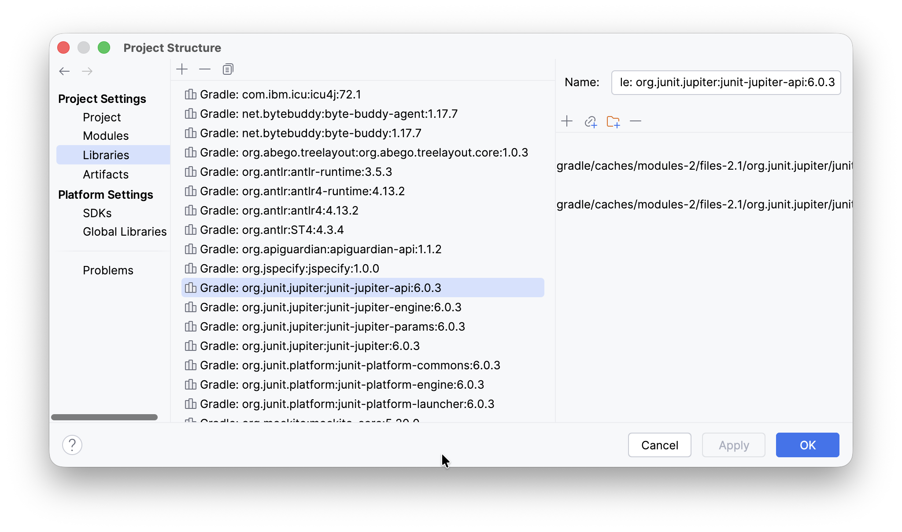
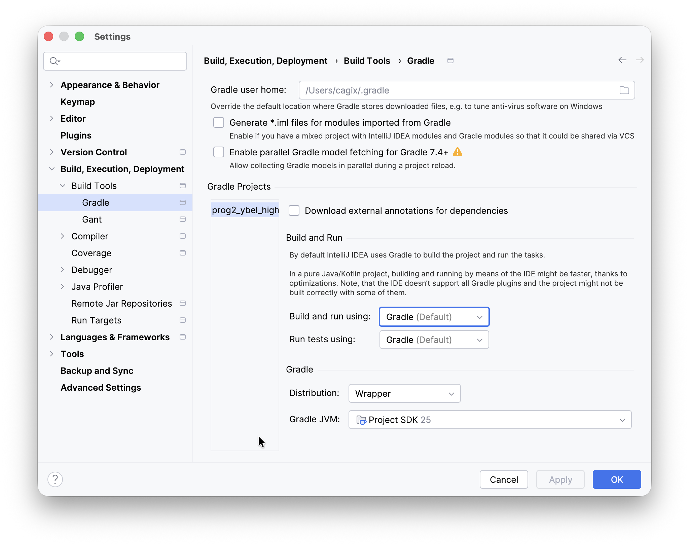

::: tldr
Um beim Übersetzen und Testen von Software von den spezifischen Gegebenheiten auf
einem Entwicklerrechner unabhängig zu werden, werden häufig sogenannte Build-Tools
eingesetzt. Mit diesen konfiguriert man sein Projekt abseits einer IDE und
übersetzt, testet und baut seine Applikation damit entsprechend unabhängig. In der
Java-Welt sind aktuell die Build-Tools Ant, Maven und Gradle weit verbreitet.

In Gradle ist ein Java-Entwicklungsmodell quasi eingebaut. Über die
Konfigurationsskripte müssen nur noch bestimmte Details wie benötigte externe
Bibliotheken oder die Hauptklasse und sonstige Projektbesonderheiten konfiguriert
werden. Über "Tasks" wie `build`, `test` oder `run` können Java-Projekte übersetzt,
getestet und ausgeführt werden. Dabei werden die externen Abhängigkeiten
(Bibliotheken) aufgelöst (soweit konfiguriert) und auch abhängige Tasks mit
erledigt, etwa muss zum Testen vorher der Source-Code übersetzt werden.

Gradle bietet eine Fülle an Plugins für bestimmte Aufgaben an, die jeweils mit neuen
Tasks einher kommen. Beispiele sind das Plugin `java`, welches weitere
Java-spezifische Tasks wie `classes` mitbringt, oder das Plugin `checkstyle` zum
Überprüfen von Coding-Style-Richtlinien.
:::

::: youtube
-   [VL Build-Systeme: Gradle](https://youtu.be/aVtDkFpwd_E)
-   [Demo Gradle](https://youtu.be/OhQRGaNO4iA)
:::

# Automatisieren von Arbeitsabläufen

::: center
Works on my machine ...
:::

::: notes
Einen häufigen Ausspruch, den man bei der Zusammenarbeit in Teams zu hören bekommt,
ist "Also, bei mir läuft der Code." ...

Das Problem dabei ist, dass jeder Entwickler eine andere Maschine hat, oft ein
anderes Betriebssystem oder eine andere OS-Version. Dazu kommen noch eine andere IDE
und/oder andere Einstellungen und so weiter.

Wie bekommt man es hin, dass Code zuverlässig auch auf anderen Rechnern baut? Ein
wichtiger Baustein dafür sind sogenannte "Build-Systeme", also Tools, die unabhängig
von der IDE (und den IDE-Einstellungen) für das Übersetzen der Software eingesetzt
werden und deren Konfiguration dann mit im Repo eingecheckt wird. Damit kann die
Software dann auf allen Rechnern und insbesondere dann auch auf dem Server
(Stichwort "Continuous Integration") unabhängig von der IDE o.ä. automatisiert
gebaut und getestet werden.
:::

\bigskip
\bigskip
\pause

-   Build-Tools:
    -   Apache Ant
    -   Apache Maven
    -   **Gradle**

::: notes
Das sind die drei am häufigsten anzutreffenden Build-Tools in der Java-Welt.

Ant ist von den drei genannten Tools das älteste und setzt wie Maven auf XML als
Beschreibungssprache. In Ant müssen dabei alle Regeln stets explizit formuliert
werden, die man benutzen möchte.

In Maven wird dagegen von einem bestimmten Entwicklungsmodell ausgegangen, hier
müssen nur noch die Abweichungen zu diesem Modell konfiguriert werden.

In Gradle wird eine DSL basierend auf der Skriptsprache Groovy (läuft auf der JVM)
eingesetzt, und es gibt hier wie in Maven ein bestimmtes eingebautes
Entwicklungsmodell. Gradle bringt zusätzlich noch einen Wrapper mit, d.h. es wird
eine Art Gradle-Starter im Repo konfiguriert, der sich quasi genauso verhält wie ein
fest installiertes Gradle (s.u.).

**Achtung**: Während Ant und Maven relativ stabil in der API sind, verändert sich
Gradle teilweise deutlich zwischen den Versionen. Zusätzlich sind bestimmte
Gradle-Versionen oft noch von bestimmten JDK-Versionen abhängig. In der Praxis
bedeutet dies, dass man Gradle-Skripte im Laufe der Zeit relativ oft überarbeiten
muss (einfach nur, damit das Skript wieder läuft - ohne dass man dabei irgendwelche
neuen Features oder sonstige Vorteile erzielen würde). Ein großer Vorteil ist aber
der Gradle-Wrapper (s.u.).
:::

# Gradle: Eine DSL in Groovy

[DSL: *Domain Specific Language*]{.notes}

\bigskip

``` groovy
// build.gradle
plugins {
    id 'java'
    id 'application'
}

repositories {
    mavenCentral()
}

dependencies {
    testImplementation 'junit:junit:4.13.2'
}

application {
    mainClass = 'fluppie.App'
}
```

::: notes
Dies ist mit die einfachste Build-Datei für Gradle.

Über Plugins wird die Unterstützung für Java und das Bauen von Applikationen
aktiviert, d.h. es stehen darüber entsprechende spezifische Tasks zur Verfügung.

Abhängigkeiten sollen hier aus dem Maven-Repository
[MavenCentral](https://mvnrepository.com/repos/central) geladen werden. Zusätzlich
wird hier als Abhängigkeit für den Test (`testImplementation`) die JUnit-Bibliothek
in einer Maven-artigen Notation angegeben (vgl.
[mvnrepository.com](https://mvnrepository.com/)). (Für nur zur Übersetzung der
Applikation benötigte Bibliotheken verwendet man stattdessen das Schlüsselwort
`implementation`.)

Bei der Initialisierung wurde als Package `fluppie` angegeben. Gradle legt darunter
per Default die Klasse `App` mit einer `main()`-Methode an. Entsprechend kann man
über den Eintrag `application` den Einsprungpunkt in die Applikation konfigurieren.
:::

:::: notes
# Gradle-DSL

<!-- Für die Demos:
docker pull gradle
docker run --rm -it  -v "$PWD":/data -w /data  --entrypoint "bash"  gradle
docker run --rm -it  -v "$PWD":/data -w /data  -u "$(id -u):$(id -g)"  --entrypoint "bash"  gradle
-->

Ein Gradle-Skript ist letztlich ein in Groovy geschriebenes Skript.
[Groovy](https://groovy-lang.org/) ist eine auf Java basierende und auf der JVM
ausgeführte Skriptsprache. Seit einigen Versionen kann man die Gradle-Build-Skripte
auch in der Sprache Kotlin schreiben.

# Konfigurationsdateien

Für das Bauen mit Gradle benötigt man drei Dateien im Projektordner:

-   `build.gradle`: Die auf der Gradle-DSL beruhende Definition des Builds mit den
    Tasks (und ggf. Abhängigkeiten) eines Projekts.

    Ein Multiprojekt hat pro Projekt eine solche Build-Datei. Dabei können die
    Unterprojekte Eigenschaften der Eltern-Buildskripte "erben" und so relativ kurz
    ausfallen.

-   `settings.gradle`: Eine optionale Datei, in der man beispielsweise den
    Projektnamen oder bei einem Multiprojekt die relevanten Unterprojekte festlegt.

-   `gradle.properties`: Eine weitere optionale Datei, in der projektspezifische
    Properties für den Gradle-Build spezifizieren kann.

# Neues Gradle-Projekt mit Gradle Init anlegen

Um eine neue Gradle-Konfiguration anlegen zu lassen, geht man in einen Ordner und
führt darin `gradle init` aus. Gradle fragt der Reihe nach einige Einstellungen ab:

    $ gradle init

    Select type of project to generate:
      1: basic
      2: application
      3: library
      4: Gradle plugin
    Enter selection (default: basic) [1..4] 2

    Select implementation language:
      1: C++
      2: Groovy
      3: Java
      4: Kotlin
      5: Scala
      6: Swift
    Enter selection (default: Java) [1..6] 3

    Split functionality across multiple subprojects?:
      1: no - only one application project
      2: yes - application and library projects
    Enter selection (default: no - only one application project) [1..2] 1

    Select build script DSL:
      1: Groovy
      2: Kotlin
    Enter selection (default: Groovy) [1..2] 1

    Select test framework:
      1: JUnit 4
      2: TestNG
      3: Spock
      4: JUnit Jupiter
    Enter selection (default: JUnit Jupiter) [1..4] 1

    Project name (default: tmp): wuppie
    Source package (default: tmp): fluppie

Typischerweise möchte man eine Applikation bauen (Auswahl 2 bei der ersten Frage).
Als nächstes wird nach der Sprache des Projekts gefragt sowie nach der Sprache für
das Gradle-Build-Skript (Default ist Groovy) sowie nach dem Testframework, welches
verwendet werden soll.

Damit wird die eingangs gezeigte Konfiguration angelegt.

*Anmerkung*: Die hier dargestellten Auswahloptionen und ggf. die Reihenfolge der
Schritte können sich mit neueren Gradle-Versionen durchaus ändern. Das prinzipielle
Vorgehen bleibt aber identisch.

::: notes
# Gradle und IntelliJ

Installieren bzw. Aktivieren Sie in den IntelliJ-Einstellungen die Plugins für
Gradle, derzeit "Gradle" und "Gradle for Java". Ggf. haben diese Plugins weitere
Abhängigkeiten, die auf Nachfrage der IDE aktiviert werden sollten.

{width="60%"}

## Neues Gradle-Projekt in IntelliJ anlegen

Legen Sie ein neues Projekt an (`File > New > Project`) und wählen Sie im
Einstellungsdialog als Projekttyp "Java" und bei "Build System" entsprechend
"Gradle" und als "Gradle DSL" die Variante "Groovy" aus. Unter "Advanced Settings"
können Sie dann noch direkt "Wrapper" auswählen, das erspart die spätere Korrektur.

{width="60%"}

Passen Sie anschließend die Einstellungen in der `build.gradle` an.

## Existierendes Gradle-Projekt in IntelliJ importieren

Importieren Sie ein existierendes Gradle-Projekt über den Dialog
`File > New > Project from Existing Sources` (wenn das Projekt lokal auf Ihrem
Rechner liegt) bzw. `File > New > Project from Version Control` (wenn das Projekt
beispielsweise auf GitHub liegt und noch keine lokale Kopie erzeugt wurde).

Wählen Sie im nächsten Dialog "Import project from external model" und "Gradle" aus:

{width="40%"}

Passen Sie anschließend die Einstellungen in der `build.gradle` an.

## Einstellungen für IntelliJ rund um Gradle

Prinzipiell lädt IntelliJ die Gradle-Einstellungen und übernimmt diese. Damit werden
dann externe Abhängigkeiten (Bibliotheken wie JUnit o.ä.) automatisch aufgelöst und
heruntergeladen, Sourcecode-Pfade und sonstige Projekteinstellungen werden
übernommen und der Build-Prozess wird von IntelliJ an Gradle delegiert. In der Regel
klappt das zuverlässig und sehr reibungsarm.

Manchmal hakt das leider aber ziemlich.

1.  Check, ob die **Projekteinstellungen** in IntelliJ passen:

    i.  Menü `File > Project Structure > Project Settings > Project` sollte für Ihr
        Projekt als SDK ein "Java 25" zeigen:

    {width="50%"}

    ii. Menü `File > Project Structure > Project Settings > Libraries` sollte für
        Ihr Projekt die Jar-Files für die konfigurierten Abhängigkeiten (etwa JUnit)
        zeigen:

    {width="50%"}

2.  Check, ob **IntelliJ mit Gradle baut**:

    Menü `IDEA > Settings > Build, Execution, Deployment > Build Tools > Gradle`
    sollte auf Gradle umgestellt sein:

    {width="60%"}

    Unter **"Build & Run" sollte "Gradle"** ausgewählt sein, die **"Distribution"
    sollte auf "Wrapper"** stehen, und als **"Gradle JVM"** sollte die für das
    Projekt verwendete JVM eingestellt sein, d.h. aktuell Java 25 (LTS).
:::

# Ordner in einem Gradle-Projekt

Durch `gradle init` wird ein neuer Ordner `wuppie/` mit folgender Ordnerstruktur
angelegt:

    drwxr-xr-x 4 cagix cagix 4096 Apr  8 11:43 ./
    drwxrwxrwt 1 cagix cagix 4096 Apr  8 11:43 ../
    -rw-r--r-- 1 cagix cagix  154 Apr  8 11:43 .gitattributes
    -rw-r--r-- 1 cagix cagix  103 Apr  8 11:43 .gitignore
    drwxr-xr-x 3 cagix cagix 4096 Apr  8 11:43 app/
    drwxr-xr-x 3 cagix cagix 4096 Apr  8 11:42 gradle/
    -rwxr-xr-x 1 cagix cagix 8070 Apr  8 11:42 gradlew*
    -rw-r--r-- 1 cagix cagix 2763 Apr  8 11:42 gradlew.bat
    -rw-r--r-- 1 cagix cagix  370 Apr  8 11:43 settings.gradle

Es werden Einstellungen für Git erzeugt (`.gitattributes` und `.gitignore`).

Im Ordner `gradle/` wird der Gradle-Wrapper abgelegt (s.u.). Dieser Ordner wird
normalerweise mit ins Repo eingecheckt. Die Skripte `gradlew` und `gradlew.bat` sind
die Startskripte für den Gradle-Wrapper (s.u.) und werden normalerweise ebenfalls
ins Repo mit eingecheckt.

Der Ordner `.gradle/` (erscheint ggf. nach dem ersten Lauf von Gradle auf dem neuen
Projekt) ist nur ein Hilfsordner ("Cache") von Gradle. Hier werden heruntergeladene
Dateien etc. abgelegt. Dieser Order sollte **nicht** ins Repo eingecheckt werden und
ist deshalb auch per Default im generierten `.gitignore` enthalten. (Zusätzlich gibt
es im User-Verzeichnis auch noch einen Ordner `.gradle/` mit einem globalen Cache.)

In `settings.gradle` finden sich weitere Einstellungen. Die eigentliche
Gradle-Konfiguration befindet sich zusammen mit dem eigentlichen Projekt im
Unterordner `app/`:

    drwxr-xr-x 4 root root 4096 Apr  8 11:50 ./
    drwxr-xr-x 5 root root 4096 Apr  8 11:49 ../
    drwxr-xr-x 5 root root 4096 Apr  8 11:50 build/
    -rw-r--r-- 1 root root  852 Apr  8 11:43 build.gradle
    drwxr-xr-x 4 root root 4096 Apr  8 11:43 src/

Die Datei `build.gradle` ist die durch `gradle init` erzeugte (und eingangs
gezeigte) Konfigurationsdatei, vergleichbar mit `build.xml` für Ant oder `pom.xml`
für Maven. Im Unterordner `build/` werden die generierten `.class`-Dateien etc. beim
Build-Prozess abgelegt.

Unter `src/` findet sich dann eine Maven-typische Ordnerstruktur für die Sourcen:

    $ tree src/
    src/
    |-- main
    |   |-- java
    |   |   `-- fluppie
    |   |       `-- App.java
    |   `-- resources
    `-- test
        |-- java
        |   `-- fluppie
        |       `-- AppTest.java
        `-- resources

Unterhalb von `src/` ist ein Ordner `main/` für die Quellen der Applikation (Sourcen
und Ressourcen). Für jede Sprache gibt es einen eigenen Unterordner, hier
entsprechend `java/`. Unterhalb diesem folgt dann die bei der Initialisierung
angelegte Package-Struktur (hier `fluppie` mit der Default-Main-Klasse `App` mit
einer `main()`-Methode). Diese Strukturen wiederholen sich für die Tests unterhalb
von `src/test/`.

Wer die herkömmlichen, deutlich flacheren Strukturen bevorzugt, also unterhalb von
`src/` direkt die Java-Package-Strukturen für die Sourcen der Applikation und
unterhalb von `test/` entsprechend die Strukturen für die JUnit-Test, der kann dies
im Build-Skript einstellen:

``` groovy
sourceSets {
    main {
        java {
            srcDirs = ['src']
        }
        resources {
            srcDirs = ['res']
        }
    }
    test {
        java {
            srcDirs = ['test']
        }
    }
}
```
::::

::: slides
# Wichtige Gradle-Tasks

-   Initialisieren des Projekts: `gradle init`

\smallskip

-   Überblick über die Tasks: `gradle tasks`

\bigskip

-   Übersetzen: `gradle compileJava` oder `gradle classes`
-   Testen: `gradle test`
-   Ausführen: `gradle run`
-   Aufräumen: `gradle clean`
:::

::: notes
# Ablauf eines Gradle-Builds

Ein Gradle-Build hat zwei Hauptphasen: Konfiguration und Ausführung.

Während der Konfiguration wird das gesamte Skript durchlaufen (vgl. Ausführung der
direkten Anweisungen eines Tasks). Dabei wird ein Graph erzeugt: welche Tasks hängen
von welchen anderen ab etc.

Anschließend wird der gewünschte Task ausgeführt. Dabei werden zuerst alle Tasks
ausgeführt, die im Graphen auf dem Weg zu dem gewünschten Task liegen.

Mit `gradle tasks` kann man sich die zur Verfügung stehenden Tasks ansehen. Diese
sind der Übersicht halber noch nach "Themen" sortiert.

Für eine Java-Applikation sind die typischen Tasks `gradle build` zum Bauen der
Applikation (inkl. Ausführen der Tests) sowie `gradle run` zum Starten der
Anwendung. Wer nur die Java-Sourcen compilieren will, würde den Task
`gradle compileJava` nutzen. Mit `gradle check` würde man compilieren und die Tests
ausführen sowie weitere Checks durchführen (`gradle test` würde nur compilieren und
die Tests ausführen), mit `gradle jar` die Anwendung in ein `.jar`-File packen und
mit `gradle javadoc` die Javadoc-Dokumentation erzeugen und mit `gradle clean` die
generierten Hilfsdateien aufräumen (löschen).

# Plugin-Architektur

Für bestimmte Projekttypen gibt es immer wieder die gleichen Aufgaben. Um hier
Schreibaufwand zu sparen, existieren verschiedene Plugins für verschiedene
Projekttypen. In diesen Plugins sind die entsprechenden Tasks bereits mit den
jeweiligen Abhängigkeiten formuliert. Diese Idee stammt aus Maven, wo dies für
Java-basierte Projekte umgesetzt ist.

Beispielsweise erhält man über das Plugin `java` den Task `clean` zum Löschen aller
generierten Build-Artefakte, den Task `classes`, der die Sourcen zu `.class`-Dateien
kompiliert oder den Task `test`, der die JUnit-Tests ausführt ...

Sie können sich Plugins und weitere Tasks relativ leicht auch selbst definieren.

# Auflösen von Abhängigkeiten

Analog zu Maven kann man Abhängigkeiten (etwa in einer bestimmten Version benötigte
Bibliotheken) im Gradle-Skript angeben. Diese werden (transparent für den User) von
einer ebenfalls angegeben Quelle, etwa einem Maven-Repository, heruntergeladen und
für den Build genutzt. Man muss also nicht mehr die benötigten `.jar`-Dateien der
Bibliotheken mit ins Projekt einchecken. Analog zu Maven können erzeugte Artefakte
automatisch publiziert werden, etwa in einem Maven-Repository.

Für das Projekt benötigte Abhängigkeiten kann man über den Eintrag `dependencies`
spezifizieren. Dabei unterscheidet man u.a. zwischen Applikation und Tests:
`implementation` und `testImplementation` für das Compilieren und Ausführen von
Applikation bzw. Tests. Diese Abhängigkeiten werden durch Gradle über die im
Abschnitt `repositories` konfigurierten Repositories aufgelöst und die
entsprechenden `.jar`-Files geladen (in den `.gradle/`-Ordner).

Typische Repos sind das Maven-Repo selbst (`mavenCentral()`) oder das
Google-Maven-Repo (`google()`).

Die Einträge in `dependencies` erfolgen dabei in einer Maven-Notation, die Sie auch
im Maven-Repo [mvnrepository.com](https://mvnrepository.com/) finden.

# Beispiel mit weiteren Konfigurationen (u.a. Checkstyle und Javadoc)

``` groovy
plugins {
    id 'java'
    id 'application'
    id 'checkstyle'
}

repositories {
    mavenCentral()
}

dependencies {
    implementation group: 'org.apache.poi', name: 'poi', version: '5.5.1'
}

application {
    mainClass = 'hangman.Main'
}

// use current LTS release: Java 25
java.toolchain.languageVersion = JavaLanguageVersion.of(25)
java.sourceCompatibility = JavaVersion.VERSION_25
java.targetCompatibility = JavaVersion.VERSION_25

tasks.withType(JavaCompile).configureEach {
    options.encoding = 'UTF-8'
    options.release = 25
}

tasks.named('run') {
    standardInput = System.in
}

sourceSets {
    main {
        java {
            srcDirs = ['src']
        }
        resources {
            srcDirs = ['res']
        }
    }
}

checkstyle {
    configFile = file("${rootDir}/google_checks.xml")
    toolVersion = '13.4.0'
}

javadoc {
    options.showAll()
}
```

Hier sehen Sie übrigens noch eine weitere mögliche Schreibweise für das Notieren von
Abhängigkeiten:
`implementation group: 'org.apache.poi', name: 'poi', version: '5.5.1'` und
`implementation 'org.apache.poi:poi:5.5.1'` sind gleichwertig, wobei die letztere
Schreibweise sowohl in den generierten Builds-Skripten und in der offiziellen
Dokumentation bevorzugt wird.

# Gradle und Ant (und Maven)

Vorhandene Ant-Buildskripte kann man nach Gradle importieren und ausführen lassen.
Über die DSL kann man auch direkt Ant-Tasks aufrufen. Siehe auch ["Using Ant from
Gradle"](https://docs.gradle.org/current/userguide/ant.html).
:::

# Gradle-Wrapper

    project
    |-- app/
    |-- build.gradle
    |-- gradlew
    |-- gradlew.bat
    `-- gradle/
        `-- wrapper/
            |-- gradle-wrapper.jar
            `-- gradle-wrapper.properties

::: notes
Zur Ausführung von Gradle-Skripten benötigt man eine lokale Gradle-Installation.
Diese sollte für i.d.R. alle User, die das Projekt bauen wollen, identisch sein.
Leider ist dies oft nicht gegeben bzw. nicht einfach lösbar.

Zur Vereinfachung gibt es den Gradle-Wrapper `gradlew` (bzw. `gradlew.bat` für
Windows). Dies ist ein kleines Shellskript, welches zusammen mit einer kleinen
`.jar`-Datei im Unterordner `gradle/` mit ins Repo eingecheckt wird und welches
direkt die Rolle des `gradle`-Befehls einer Gradle-Installation übernehmen kann. Man
kann also in Konfigurationskripten, beispielsweise für Gitlab CI, alle Aufrufe von
`gradle` durch Aufrufe von `gradlew` ersetzen.

Beim ersten Aufruf lädt `gradlew` dann die spezifizierte Gradle-Version herunter und
speichert diese in einem lokalen Ordner `.gradle/`. Ab dann greift `gradlew` auf
diese lokale (nicht "installierte") `gradle`-Version zurück.

`gradle init` erzeugt den Wrapper automatisch in der verwendeten Gradle-Version mit.
Alternativ kann man den Wrapper nachträglich über
`gradle wrapper --gradle-version 9.4.1` in einer bestimmten (gewünschten) Version
anlegen lassen.

Da der Gradle-Wrapper im Repository eingecheckt ist, benutzen alle Entwickler damit
automatisch die selbe Version, ohne diese auf ihrem System zuvor installieren zu
müssen. Deshalb ist der Einsatz des Wrappers einem fest installierten Gradle
vorzuziehen!
:::

[[Live-Demo Gradle/Gradlew]{.ex}]{.slides}

::: notes
# Ausblick: Maven

Wie oben erwähnt, gibt es neben Gradle in der Java-Welt zwei weitere verbreitete
Build-Tools: [Ant](https://ant.apache.org/) und [Maven](https://maven.apache.org)
(beide von Apache).

In Ant werden alle Dinge (Ziele, Regeln, ...) manuell definiert und konfiguriert
(und das in XML), Dependencies müssen manuell oder über ein extra Tool (Ivy)
aufgelöst werden. Dagegen ist in Maven ähnlich wie bei Gralde ein Lebenszyklus für
Java-Anwendungen eingebaut und es müssen nur noch Abweichungen davon sowie die
Festlegung von Versionen und Dependencies in XML formuliert werden ("*Convention
over Configuration*"). In Maven nennt man die Ziele "Goals", was den Gradle-Tasks
entspricht.

Im Gegensatz zu Gradle haben sich Maven-Konfigurationen als sehr stabil erwiesen.
Projektkonfigurationen funktionieren oft über einen sehr langen Zeitraum hinweg, und
auch bei den eher seltenen Versionssprüngen von Maven gibt es deutlich weniger
Pflegeaufwand im Vergleich zu Gradle, wo teilweise im Halbjahrestakt oft deutliche
Änderungen an der DSL vorgenommen werden und man früher oder später immer wieder
gezwungen ist, die Projektkonfiguration entsprechend nachzuziehen. Der Nachteil von
Maven ist, dass die Konfiguration in XML erfolgt und für moderne Lesegewohnheiten
eher sperrig aussieht. Die Formulierung von "Extra-Wünschen" geht in Gradle über die
Groovy-DSL meist relativ einfach, in Maven muss man dafür eigene Plugins schreiben.

Das obige `build.gradle` mit der Apache-POI-Abhängigkeit und der konfigurierten
Java-Version und dem Checkstyle-Plugin könnte man ungefähr in folgende `pom.xml` (so
nennt man die Maven-Konfigurationsdatei) übersetzen:

``` xml
<?xml version="1.0" encoding="UTF-8"?>
<project xmlns="http://maven.apache.org/POM/4.0.0"
         xmlns:xsi="http://www.w3.org/2001/XMLSchema-instance"
         xsi:schemaLocation="http://maven.apache.org/POM/4.0.0 http://maven.apache.org/xsd/maven-4.0.0.xsd">
    <modelVersion>4.0.0</modelVersion>

    <groupId>hangman</groupId>
    <artifactId>hangman</artifactId>
    <version>1.0-SNAPSHOT</version>

    <properties>
        <maven.compiler.release>25</maven.compiler.release>
        <project.build.sourceEncoding>UTF-8</project.build.sourceEncoding>
        <!-- nötig für das Exec-Plugin (Main-Klasse) -->
        <exec.mainClass>hangman.Main</exec.mainClass>
    </properties>

    <!-- Entspricht dependencies { implementation 'org.apache.poi:poi:5.5.1' } -->
    <dependencies>
        <dependency>
            <groupId>org.apache.poi</groupId>
            <artifactId>poi</artifactId>
            <version>5.5.1</version>
        </dependency>
    </dependencies>

    <build>
        <!-- Entspricht sourceSets: src = Java, res = Ressourcen -->
        <sourceDirectory>src</sourceDirectory>
        <resources>
            <resource>
                <directory>res</directory>
            </resource>
        </resources>

        <plugins>
            <!-- Compiler-Einstellungen: Java 25, UTF-8 -->
            <plugin>
                <groupId>org.apache.maven.plugins</groupId>
                <artifactId>maven-compiler-plugin</artifactId>
                <version>3.13.0</version>
                <configuration>
                    <release>${maven.compiler.release}</release>
                    <encoding>${project.build.sourceEncoding}</encoding>
                </configuration>
            </plugin>

            <!-- Entspricht application { mainClass = 'hangman.Main' } -->
            <plugin>
                <groupId>org.codehaus.mojo</groupId>
                <artifactId>exec-maven-plugin</artifactId>
                <version>3.5.0</version>
                <configuration>
                    <mainClass>${exec.mainClass}</mainClass>
                    <!-- StandardInput von der Konsole wird standardmäßig durchgereicht -->
                </configuration>

            </plugin>

            <!-- Entspricht checkstyle { ... } -->
            <plugin>
                <groupId>org.apache.maven.plugins</groupId>
                <artifactId>maven-checkstyle-plugin</artifactId>
                <version>3.6.0</version>
                <configuration>
                    <configLocation>google_checks.xml</configLocation>
                </configuration>
            </plugin>

            <!-- Grobe Entsprechung zu javadoc { options.showAll() } -->
            <plugin>
                <groupId>org.apache.maven.plugins</groupId>
                <artifactId>maven-javadoc-plugin</artifactId>
                <version>3.10.0</version>
                <configuration>
                    <show>public</show>
                </configuration>
            </plugin>
        </plugins>
    </build>
</project>
```

Gradle nutzt einen `plugins`-Block zur Spezifikation der Plugins, bei Maven werden
Plugins im `<build>`-Bereich eingetragen. Die Projekt-Identität (`groupId`,
`artifactId`, `version`) steht bei Maven oben im `project`-Block - das sind die
typischen Maven-Koordinaten `groupId:artifactId:version`.

Die Deklaration der Dependencies ist im Prinzip wie bei Gradle (nur eben in XML
statt in der Groovy-DSL). Die Einträge kann man sich direkt für die jeweilige
Bibliothek von [Maven Central](https://mvnrepository.com/repos/central) kopieren.
Das Repository Maven Central ist in Maven der Default und muss (im Gegensatz zu
Gradle) nicht extra angegeben werden.

Gradle bekommt mit dem `application`-Plugin einen `run`-Task. In Maven nutzten wir
dafür das Plugin `exec-maven-plugin`, welches beim Befehl `mvn exec:java` die
konfigurierte Main-Klasse startet. Vorsicht: Während ein `gradle run` das Projekt
bei Bedarf automatisch baut und dann die konfigurierte Klasse startet, wird in Maven
mit `mvn exec:java` tatsächlich nur die konfigurierte Klasse ausgeführt - für das
Bauen muss man selbst sorgen. Oft wird deshalb `mvn compile exec:java` (Kompilieren
und Ausführen) oder `mvn verify exec:java` (Kompilieren, Tests, Ausführen) genutzt
oder alternativ eine zusätzliche `<executions>`-Konfiguration für das Plugin
`exec-maven-plugin` angelegt. Die Konsoleneingabe wird in Maven automatisch ans
Programm weitergereicht, in Gradle war dafür eine extra Konfiguration notwendig.

Sowohl in Gradle als auch in Maven sind die Standardpfade im Projekt `src/main/java`
und `src/main/resources`, aber man kann diese Pfade bei Bedarf relativ frei
anpassen.

Inzwischen gibt es auch für Maven einen sogenannten Wrapper. Beim Maven-Wrapper wird
jedoch nur eine schlanke, rein textbasierte Konfiguration im Projekt mitversioniert
(`mvnw`, `mvnw.cmd` und das Verzeichnis `.mvn/` mit Konfigurations-/Textdateien).
Beim Gradle-Wrapper gehört hingegen immer auch eine Binärdatei
(`gradle-wrapper.jar`) ins Versionskontrollsystem. Da Git für Binärdateien keinen
inhaltlichen Diff berechnen kann, wird bei Änderungen an diesem JAR intern jedes Mal
die komplette Datei als Änderung gespeichert. Das kann sich im Laufe der Zeit
nachteilig auf die Größe des Git-Repositorys auswirken.

Der [Maven Getting Started
Guide](https://maven.apache.org/guides/getting-started/index.html) ist eine gute
Einstiegshilfe über den hier vorgestellten Ausblick hinaus.
:::

# Wrap-Up

-   Automatisieren von Arbeitsabläufen mit Build-Tools/-Skripten

\smallskip

-   Einstieg in **Gradle** (DSL zur Konfiguration)
    -   Typisches Java-Entwicklungsmodell eingebaut
    -   Konfiguration der Abweichungen (Abhängigkeiten, Namen, ...)
    -   Gradle-Wrapper: Ersetzt eine feste Installation

::: readings
-   ["Getting
    Started"](https://docs.gradle.org/current/userguide/getting_started.html)
-   ["Building Java Applications
    Sample"](https://docs.gradle.org/current/samples/sample_building_java_applications.html)
-   ["Building Java Applications with libraries
    Sample"](https://docs.gradle.org/current/samples/sample_building_java_applications_multi_project.html)
-   ["Building Java Libraries
    Sample"](https://docs.gradle.org/current/samples/sample_building_java_libraries.html)
-   ["Building Java & JVM
    projects"](https://docs.gradle.org/current/userguide/building_java_projects.html)
:::

::: outcomes
-   k3: Ich kann einfache Gradle-Skripte schreiben und verstehen
:::

::: challenges
**Analyse komplexeres Build-Skript**

Betrachten Sie das Buildskript `gradle.build` aus
[Dungeon-CampusMinden/Dungeon](https://github.com/Dungeon-CampusMinden/Dungeon/blob/master/build.gradle).

Erklären Sie, in welche Abschnitte das Buildskript unterteilt ist und welche
Aufgaben diese Abschnitte jeweils erfüllen. Gehen Sie dabei im *Detail* auf das
Plugin `java` und die dort bereitgestellten Tasks und deren Abhängigkeiten
untereinander ein.

**Praktische Übungen**

-   Bauen Sie ein Minimalprojekt mit Gradle-Wrapper.
-   Importieren Sie das Projekt in IntelliJ.
-   Fügen Sie Abhängigkeiten hinzu: JUnit 6 und lassen Sie die IDE einen einfachen
    Test schreiben.
:::
