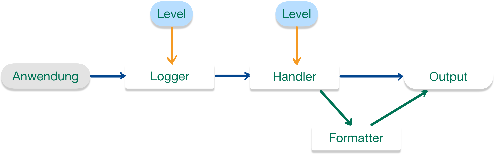

::: tldr
Im Paket `java.util.logging` findet sich eine einfache Logging-API.

Über die Methode `getLogger()` der Klasse `Logger` (*Factory-Method-Pattern*) kann
ein (neuer) Logger erzeugt werden, dabei wird über den String-Parameter eine
Logger-Hierarchie aufgebaut analog zu den Java-Package-Strukturen. Der oberste
Logger (der "Basis-Logger" bzw. "Root-Logger") hat den leeren Namen.

Jeder Logger kann mit einem Log-Level (Klasse `Level`) eingestellt werden;
Log-Meldungen unterhalb des eingestellten Levels werden verworfen.

Vom Logger nicht verworfene Log-Meldungen werden an den bzw. die Handler des Loggers
und (per Default) an den Eltern-Logger weiter gereicht. Die Handler haben ebenfalls
ein einstellbares Log-Level und verwerfen alle Nachrichten unterhalb der
eingestellten Schwelle. Zur tatsächlichen Ausgabe gibt man einem Handler noch einen
Formatter mit. Defaultmäßig hat nur der Root-Logger einen Handler.

Der Root-Logger (leerer String als Name) hat als Default-Level (wie auch sein
Console-Handler) "`Info`" eingestellt.

Nachrichten, die durch Weiterleitung nach oben empfangen wurden, werden nicht am
Log-Level des empfangenden Loggers gemessen, sondern akzeptiert und an die Handler
des Loggers und (sofern nicht deaktiviert) an den Eltern-Logger weitergereicht.
:::

::: youtube
Vorlesung \[[YT](https://youtu.be/aWayP0yztrs)\],
\[[HSBI](https://www.hsbi.de/medienportal/video/pr2-logging/d6a401118a171270cd72651853eaaaf0)\]

Demo:

-   Logging (Überblick) \[[YT](https://youtu.be/SZVjKv_Li-0)\],
    \[[HSBI](https://www.hsbi.de/medienportal/video/pr2-demo-logging-berblick/8df804d86f2d71adf5485520c01c9316)\]
-   Log-Level \[[YT](https://youtu.be/DqAgCsyzgAY)\],
    \[[HSBI](https://www.hsbi.de/medienportal/video/pr2-demo-logging-log-level/69645259c2bad49c6a21b9f6a452d92a)\]
-   Handler und Formatter \[[YT](https://youtu.be/l3vCNtBBARc)\],
    \[[HSBI](https://www.hsbi.de/medienportal/video/pr2-demo-logging-log-handler/4ee95e75c580e33d7987949a152922ee)\]
-   Weiterleitung an den Eltern-Logger \[[YT](https://youtu.be/3JsuOpdDIcg)\],
    \[[HSBI](https://www.hsbi.de/medienportal/video/pr2-demo-logging-weiterleitung-an-eltern-logger/36b8346d36b0a7e381d3d5b7b77e368d)\]
:::

# Wie prüfen Sie die Werte von Variablen/Objekten?

1.  Debugging
    -   Beeinflusst Code nicht
    -   Kann schnell komplex und umständlich werden
    -   Sitzung transient - nicht reproduzierbar/speicherbar

\bigskip

2.  "Poor-man's-debugging" (Ausgaben mit `IO.println`)
    -   Müssen irgendwann vor Release/Produktivbetrieb entfernt werden
    -   Ausgabe nur auf einem Kanal (Konsole)
    -   Keine Filterung nach Problemgrad - keine Unterscheidung zwischen Warnungen,
        einfachen Informationen, ...

\bigskip

3.  **Logging**
    -   Verschiedene (Java-) Frameworks: `\newline`{=tex} `java.util.logging` (JDK),
        *log4j* (Apache), *SLF4J*, *Logback*, ...

# Java Logging API - Überblick

Paket `java.util.logging`

\bigskip

{width="80%" web_width="65%"}

::: notes
Eine Applikation kann verschiedene Logger instanziieren. Die Logger bauen per
Namenskonvention hierarchisch aufeinander auf. Jeder Logger kann selbst mehrere
Handler haben, die eine Log-Nachricht letztlich auf eine bestimmte Art und Weise an
die Außenwelt weitergeben.

Log-Meldungen werden einem Level zugeordnet. Jeder Logger und Handler hat ein
Mindest-Level eingestellt, d.h. Nachrichten mit einem kleineren Level werden
verworfen.

Zusätzlich gibt es noch Filter, mit denen man Nachrichten (zusätzlich zum Log-Level)
nach weiteren Kriterien filtern kann.
:::

[Konsole: logging.LoggingDemo]{.ex
href="https://github.com/Programmiermethoden-CampusMinden/Prog2-Lecture/blob/master/lecture/tooling/src/logging/LoggingDemo.java"}

# Erzeugen neuer Logger

``` java
import java.util.logging.Logger;
Logger l = Logger.getLogger(MyClass.class.getName());
```

-   **Factory-Methode** der Klasse `java.util.logging.Logger`

    ``` java
    public static Logger getLogger(String name);
    ```

    =\> Methode liefert bereits **vorhandenen Logger** mit diesem Namen [(sonst
    neuen Logger)]{.notes}

-   **Best Practice**: `\newline`{=tex} Nutzung des vollqualifizierten Klassennamen:
    `MyClass.class.getName()`

    -   Leicht zu implementieren
    -   Leicht zu erklären
    -   Spiegelt modulares Design
    -   Ausgaben enthalten automatisch Hinweis auf Herkunft (Lokalität) der Meldung
    -   **Alternativen**: Funktionale Namen wie "XML", "DB", "Security"

# Ausgabe von Logmeldungen

``` java
public void log(Level level, String msg);
```

\bigskip
\bigskip

-   Diverse Convenience-Methoden (Auswahl):

    ``` java
    public void warning(String msg)
    public void info(String msg)
    public void entering(String srcClass, String srcMethod)
    public void exiting(String srcClass, String srcMethod)
    ```

\bigskip

-   Beispiel

    ``` java
    import java.util.logging.Logger;
    Logger l = Logger.getLogger(MyClass.class.getName());
    l.info("Hello World :-)");
    ```

# Wichtigkeit von Logmeldungen: Stufen

-   `java.util.logging.Level` definiert 7 Stufen:
    -   `SEVERE`, `WARNING`, `INFO`, `CONFIG`, `FINE`, `FINER`, `FINEST`
        `\newline`{=tex} (von höchster zu niedrigster Prio)
    -   Zusätzlich `ALL` und `OFF`

\bigskip

-   Nutzung der Log-Level:
    -   Logger hat Log-Level: Meldungen mit kleinerem Level werden verworfen
    -   Prüfung mit `public boolean isLoggable(Level)`
    -   Setzen mit `public void setLevel(Level)`

[Konsole: logging.LoggingLevel]{.ex
href="https://github.com/Programmiermethoden-CampusMinden/Prog2-Lecture/blob/master/lecture/tooling/src/logging/LoggingLevel.java"}

::: notes
=\> Warum wird im Beispiel nach `log.setLevel(Level.ALL);` trotzdem nur ab `INFO`
geloggt? Wer erzeugt eigentlich die Ausgaben?!
:::

# Jemand muss die Arbeit machen ...

\bigskip

::: slides
{width="60%"}
:::

\bigskip

-   Pro Logger **mehrere** Handler möglich
    -   Logger übergibt nicht verworfene Nachrichten an Handler
    -   Handler haben selbst ein Log-Level (analog zum Logger)
    -   Handler verarbeiten die Nachrichten, wenn Level ausreichend

\smallskip

-   Standard-Handler: `StreamHandler`, `ConsoleHandler`, `FileHandler`

\smallskip

-   Handler nutzen zur Formatierung der Ausgabe einen `Formatter`
-   Standard-Formatter: `SimpleFormatter` und `XMLFormatter`

[Konsole: logging.LoggingHandler]{.ex
href="https://github.com/Programmiermethoden-CampusMinden/Prog2-Lecture/blob/master/lecture/tooling/src/logging/LoggingHandler.java"}

::: notes
=\> Warum wird im Beispiel nach dem Auskommentieren von
`log.setUseParentHandlers(false);` immer noch eine zusätzliche Ausgabe angezeigt (ab
`INFO` aufwärts)?!
:::

# Ich ... bin ... Dein ... Vater ...

-   Logger bilden **Hierarchie** über Namen
    -   Trenner für Namenshierarchie: "`.`" (analog zu Packages) [=\> mit jedem
        "`.`" wird eine weitere Ebene der Hierarchie aufgemacht ...]{.notes}
    -   Jeder Logger kennt seinen Eltern-Logger: `Logger#getParent()`
    -   Basis-Logger: leerer Name (`""`)
        -   Voreingestelltes Level des Basis-Loggers: `Level.INFO` (!)

\bigskip

-   Weiterleiten von Nachrichten
    -   Nicht verworfene Log-Aufrufe werden an Eltern-Logger weitergeleitet
        [(Default)]{.notes}
        -   Abschalten mit `Logger#setUseParentHandlers(false);`
    -   Diese leiten [an ihre Handler sowie]{.notes} an ihren Eltern-Logger weiter
        (unabhängig von Log-Level!)

[Konsole: logging.LoggingParent; Tafel: Skizze Logger-Baum]{.ex
href="https://github.com/Programmiermethoden-CampusMinden/Prog2-Lecture/blob/master/lecture/tooling/src/logging/LoggingParent.java"}

::: notes
# Ausgabe von Logmeldungen - revisited

Bei genauerem Hinschauen auf die API von `java.util.logging` erkennt man, dass es
die `log`-Funktion in zwei Varianten gibt: Einmal mit einem String (der Message) als
Parameter, und einmal mit einem *Supplier* (funktionales Interface aus dem JDK):

``` java
public void log(Level level, String msg);
public void log(Level level, Supplier<String> msgSupplier);
```

Das gilt auch für die meisten Convenience-Log-Funktionen:

``` java
public void warning(String msg)
public void warning(Supplier<String> msgSupplier)

public void info(String msg)
public void info(Supplier<String> msgSupplier)
```

Damit kann man den Aufruf auch mit einem Lambda-Ausdruck gestalten:

``` java
import java.util.logging.Logger;
Logger l = Logger.getLogger(MyClass.class.getName());

l.info("Hello World");        // String
l.info(() -> "Hello World");  // Supplier
```

Das Logging mit `java.util.logging` ist an sich bereits sehr effizient: Wenn bei
einem Aufruf einer Log-Funktion die eingestellten Level beim Logger, den Handlern
und den Elternloggern nicht erreicht werden, wird nichts ausgegeben. Um noch
effizienter zu werden, kann man auch das Bauen der Message selbst davon abhängig
machen, ob man sie wirklich braucht: Während bei der ersten Aufruf-Variante mit dem
String-Parameter die Message bereits vor dem Aufruf der Log-Methode berechnet werden
muss, wird sie in der zweiten Variante erst dann wirklich berechnet, wenn sie
gebraucht wird. Wenn die Log-Methode tatsächlich loggen kann (die verschiedenen
Level werden erreicht), dann und nur dann wertet sie den übergebenen Lambda-Ausdruck
aus und erzeugt dabei die auszugebende Message. (Anmerkung: Im obigen Beispiel ist
das egal, da der String ohnehin fest ist und stets bekannt/berechnet ist. Aber
stellen Sie sich statt `"Hello World"` einen Funktionsaufruf vor, der mehr oder
weniger aufwändig einen String produziert ...)
:::

:::: notes
# Best Practices

-   Pro Klasse ein
    `private static final Logger LOG = Logger.getLogger(MyClass.class.getName());`
-   Keine Log-Ausgaben in Bibliotheken mit `System.out`/`System.err`, sondern immer
    ein Logging-Framework verwenden
-   Log-Meldungen:
    -   Klar, kurz, technisch brauchbar ("Was ist passiert? Wo? Welche Daten/IDs?")
    -   Keine sensiblen Daten (Passwörter, Tokens, personenbezogene Daten)
-   Log-Level-Richtlinien:
    -   `SEVERE`: Fehler, nach denen fachlich nicht sinnvoll weitergearbeitet werden
        kann
    -   `WARNING`: Unerwartete Situationen, aber das System läuft weiter
    -   `INFO`: Wichtige Statusmeldungen
    -   `CONFIG`: Konfigurationsdetails
    -   `FINE`, `FINER`, `FINEST`: eher für detaillierte Diagnose/Entwicklung

Wir haben in den Beispielen den Logger immer mit `setLevel(...)` und
`setUseParentHandlers(false)` etc. im Code konfiguriert. Es gibt aber - analog zu
größeren Frameworks wie SLF4J - auch bei `java.util.logging` die Möglichkeit, die
Konfiguration von außen über eine Properties-Datei vorzunehmen
(`logging.properties`).

::: tip
In vielen professionellen Projekten werden heute (für flexible Konfiguration und
bessere Integrationen) Logging-Frameworks wie SLF4J mit Logback genutzt. Die hier
vorgestellte Logik (Logger, Level, Handler/Appender, Formatter/Layouts, Hierarchie)
überträgt sich jedoch nahezu 1:1 darauf.
:::
::::

# Wrap-Up

-   Java Logging API im Paket `java.util.logging`

\smallskip

-   Neuer Logger über **Factory-Methode** der Klasse `Logger`
    -   Einstellbares Log-Level (Klasse `Level`)
    -   Handler kümmern sich um die Ausgabe, nutzen dazu Formatter
    -   Mehrere Handler je Logger registrierbar
    -   Log-Level auch für Handler einstellbar (!)
    -   Logger (und Handler) "interessieren" sich nur für Meldungen ab bestimmter
        Wichtigkeit
    -   Logger reichen nicht verworfene Meldungen defaultmäßig an Eltern-Logger
        weiter (rekursiv)

::: readings
Lesen Sie in der Dokumentation von Oracle zu den JDK Core Libraries nach: [Java
Logging
Overview](https://docs.oracle.com/en/java/javase/25/core/java-logging-overview.html).
:::

::: outcomes
-   k3: Ich kann die Java Logging API im Paket `java.util.logging` aktiv einsetzen
-   k3: Ich kann eigene Handler und Formatter schreiben
:::

::: challenges
**Logger-Konfiguration**

Betrachten Sie den folgenden Java-Code:

``` java
import java.util.logging.*;

public class Logging {
    public static void main(String... args) {
        Logger l = Logger.getLogger("Logging");
        l.setLevel(Level.FINE);

        ConsoleHandler myHandler = new ConsoleHandler();
        myHandler.setFormatter(new SimpleFormatter() {
            public String format(LogRecord record) {
                return "WUPPIE\n";
            }
        });
        l.addHandler(myHandler);

        l.info("A");
        l.fine("B");
        l.finer("C");
        l.finest("D");
        l.severe("E");
    }
}
```

Welche Ausgaben entstehen durch den obigen Code? Erklären Sie, welche der
Logger-Aufrufe zu einer Ausgabe führen und wieso und wie diese Ausgaben zustande
kommen bzw. es keine Ausgabe bei einem Logger-Aufruf gibt. Gehen Sie dabei auf jeden
der fünf Aufrufe ein.

<!--
Die beiden Aufrufe `l.finer` und `l.finest` führen zu keiner Ausgabe, da das jeweilige Log-Level
unterhalb des eingestellten Levels des Loggers liegt -- beide Logmeldungen werden vom Logger verworfen.

Der Aufruf `l.fine` führt zu keiner Ausgabe. Der Logger nimmt die Logmeldung zwar an, aber der Handler
verwirft die Logmeldung, da sie unterhalb seines Default-Levels liegt. Die Meldung wird zusätzlich an den
Eltern-Logger (hier der Root-Logger) weiter gereicht, der diese akzeptiert (trotz zu kleinem Level, da
weitergeleitet!). Der Default-Handler des Eltern-Loggers nimmt aber keine Ausgabe vor, da sein Log-Level
auf `Info` steht.

Für die Aufrufe `l.info` und `l.severe` werden je zwei Ausgaben gemacht: Eine durch den eigenen Handler
("WUPPIE") und eine weitere durch die Weiterleitung an den Eltern-Logger ("A" bzw. "E" mit der
Default-Formatierung). Alle beteiligten Logger und Handler akzeptieren das Level `Info` bzw. `SEVERE`.
-->

**Analyse eines Live-Beispiels aus dem Dungeon**

Analysieren Sie die Konfiguration des Loggings im Dungeon-Projekt:
[Dungeon-CampusMinden/Dungeon:
core.utils.logging.DungeonLoggerConfig](https://github.com/Dungeon-CampusMinden/Dungeon/blob/master/dungeon/src/core/utils/logging/DungeonLoggerConfig.java).

<!--
- Code Qualität, Kommentar-Qualität?
- Umgang mit Dateien (alte vs. neue API, bunter Mix):
    Path.of() => Path-Objekt. Damit dann in Files.createDirectories() (schließt Files.createFile() bereits ein!)
    und FileHandler() gehen (*single source of truth*)

    Path path = FileSystems.getDefault().getPath("logs", "foo.log");
    BufferedReader reader = Files.newBufferedReader(path, StandardCharsets.UTF_8);

- Umgang mit Typen: keine Typsicherheit, immer wieder manuelle String, String, String, ...
- Mögliche Probleme, die hier entstehen können (Start der App, Ordner/Package: Auflösen relativ zum Start)
-->
:::
