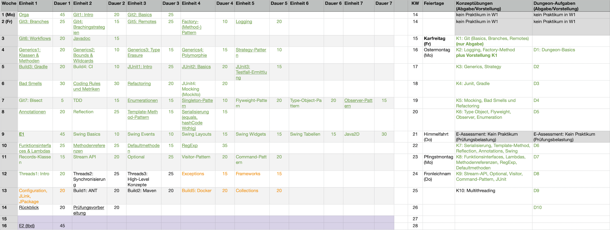

# IFM 2.2: Programmiermethoden (Sommer 2022)

## Kursbeschreibung

Sie haben letztes Semester in OOP die _wichtigsten_ Elemente und Konzepte der
Programmiersprache Java kennen gelernt.

In diesem Modul geht es darum, diese Kenntnisse sowohl auf der Java- als auch auf der
Methoden-Seite so zu erweitern, dass Sie gemeinsam größere Anwendungen erstellen und
pflegen können. Sie werden fortgeschrittene Konzepte in Java kennenlernen und sich mit
etablierten Methoden in der Softwareentwicklung wie Versionierung von Code, Einhaltung
von Coding Conventions, Grundlagen des Softwaretests, Anwendung von Refactoring, Einsatz
von Build-Tools und Logging auseinander setzen. Wenn uns dabei ein Entwurfsmuster "über
den Weg läuft", werden wir die Gelegenheit nutzen und uns dieses genauer anschauen.

Siehe `["Syllabus"]()`{=markdown} zu Details.

## Team

-   [Carsten Gips](https://www.fh-bielefeld.de/minden/ueber-uns/personenverzeichnis/carsten-gips)
-   Tutoren (siehe ILIAS-Mitgliederliste)

## Kursformat

{width="80%"}

### Vorlesung: 2 SWS

*   Fr, 16:00 - 17:30 Uhr (online/J104)

Durchführung als **Flipped Classroom**: Sitzungen per Zoom (**Zugangsdaten siehe [ILIAS]**)

### Praktikum: 2+1 SWS

*   Gruppe 1: Fr, 09:00 - 10:30 Uhr (online/D320)
*   Gruppe 2: Fr, 12:45 - 14:15 Uhr (online/D320)
*   Gruppe 3: Fr, 10:45 - 12:15 Uhr (online/D320)

**Zugangsdaten siehe [ILIAS]**

[ILIAS]: https://www.fh-bielefeld.de/elearning/goto.php?target=crs_1015325&client_id=FH-Bielefeld

### Prüfungsform, Note und Credits

**Performanzprüfung**, 7 ECTS

Hier finden Sie Informationen zum Ablauf des Praktikums sowie zur Prüfungsform:
`["Note und Credits"]()`{=markdown}.

Tipps zur Vorbereitung siehe`[Prüfungsvorbereitung]()`{=markdown}.

## Förderungen und Kooperationen

### Förderung durch DH.NRW (Digi Fellowships)

Die Überarbeitung dieser Lehrveranstaltung wurde vom Ministerium für Kultur und Wissenschaft
(MKW) in NRW im Einvernehmen mit der Digitalen Hochschule NRW (DH.NRW) gefördert
(["Fellowships für Innovationen in der digitalen Hochschulbildung (Digi Fellowships)"]).

["Fellowships für Innovationen in der digitalen Hochschulbildung (Digi Fellowships)"]: https://www.dh.nrw/kooperationen/Digi-Fellows-2

### Kooperation mit dem DigikoS-Projekt

Diese Vorlesung wird zudem vom Projekt ["Digitalbaukasten für kompetenzorientiertes Selbststudium"]
(_DigikoS_) unterstützt. Ein vom DigikoS-Projekt ausgebildeter Digital Learning Scout hat
insbesondere die Koordination der digitalen Gruppenarbeiten, des Peer-Feedbacks und der
Postersessions in ILIAS technisch und inhaltlich begleitet. DigikoS wird als Verbundprojekt
von der Stiftung Innovation in der Hochschullehre gefördert.

["Digitalbaukasten für kompetenzorientiertes Selbststudium"]: https://www.digikos.de

## Materialien

1.  ["**Java ist auch eine Insel**"](https://openbook.rheinwerk-verlag.de/javainsel/index.html).
    Ullenboom, C., Rheinwerk-Verlag, 2021.
    ISBN [978-3-8362-8745-6](https://www.digibib.net/openurl/Bi10?isbn=978-3-8362-8745-6).

2.  ["**Pro Git**"](https://git-scm.com/book/en/v2).
    Chacon, S. und Straub, B., Apress, 2014.
    ISBN [978-1-4842-0077-3](https://www.digibib.net/openurl/Bi10?isbn=978-1-4842-0077-3).

3.  ["Java Core Libraries Developer Guide"](https://docs.oracle.com/en/java/javase/17/core/index.html).
    Oracle Corporation, 2022.

4.  ["The Java Tutorials"](https://docs.oracle.com/javase/tutorial/).
    Oracle Corporation, 2022.

Weitere empfohlene Literatur siehe `["Ressourcen"]()`{=markdown}.

## Fahrplan

``{=markdown}

**Hinweis**: Abgabe der Hausaufgaben als Pull-Request bis jeweils 18:00 Uhr (Konzept-Aufgaben)
bzw. 09.00 Uhr (Dungeon-Aufgaben) im GitHub.
