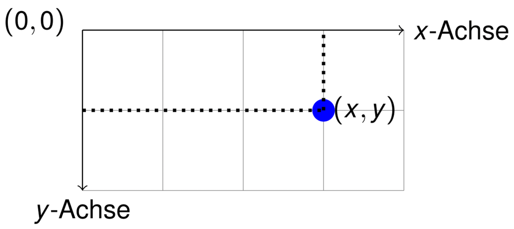

## GUIs mit Java

{width="80%"}

[Beispiel: java2d.j2d.J2DTeaser]{.bsp}


## Einführung in die Java 2D API

::: notes
*   Bisher: Anordnung von Widgets als GUI
*   Jetzt: Wie kann man mit Java zeichnen etc.?
:::

Swing-Komponenten erben von `javax.swing.JComponent`:

```java
public void paintComponent(Graphics g)
```

*   Wird durch Events aufgerufen
*   Oder "von Hand" mit `void repaint()`

    ::: notes
    Methode `repaint()` der Swing-Komponente aufrufen => dadurch wird
    dann intern die Methode `paintComponent()` der Komponente aufgerufen zum
    Neuzeichnen auf dem Graphics-Objekt.
    :::

Objekt vom Typ `Graphics` stellt graphischen Kontext dar

::: notes
*   Geom. Primitive zeichnen mit `draw*` und `fill*`
*   Rendern mit `drawString` und `drawImage`
*   ...

`Graphics2D` beherrscht zusätzliche Methoden zum Beeinflussen des Renderings
:::

\bigskip

[=> [**Methode überschreiben und auf der GUI malen**]{.alert}]{.cbox}

::: notes
*   Basis: `java.awt.Graphics`; davon abgeleitet `java.awt.Graphics2D`
*   Methode zum Zeichnen: `paintComponent()`
*   Umgang mit Farben: `java.awt.Color`
*   Umgang mit Zeichen und Fonts: `java.awt.Font`
*   Geom. Primitive: `java.awt.Polygon`, `java.awt.geom.{Line2D, Rectangle2D, Ellipse2D}`, ...
:::


## Java2D Koordinatensystem

{width="80%"}
<!-- XXX Screenshot aus VL12 SoSe2014 (dort als tikzpicture) -->


*   Koordinatensystem lokal zum Graphics-Objekt
*   Einheiten in Pixel(!)


## Einfache Objekte zeichnen

Methoden von `java.awt.Graphics` (Auswahl):

```java
public void drawLine(int x1, int y1, int x2, int y2)
public void drawRect(int x, int y, int width, int height)
public void fillRect(int x, int y, int width, int height)
public void drawOval(int x, int y, int width, int height)
public void fillOval(int x, int y, int width, int height)
```

\smallskip

Vorher Strichfarbe setzen: `Graphics.setColor(Color color)`:

*   Farb-Konstanten in `java.awt.Color`: `RED`, `GREEN`, `WHITE`, ...
*   Ansonsten über Konstruktor, beispielsweise als RGB:

    ```java
    public Color(int r, int g, int b)
    ```

    Rot/Grün/Blau, Werte zw. 0 und 255

[Beispiel: java2d.j2d.SimpleDrawings]{.bsp}


## Fonts und Strings

Fonts über Font-Klasse einstellen: `Graphics.setFont(Font font);`

```java
public Font(String name, int style, int size)
```

\smallskip

`Graphics` kann Strings "zeichnen":

```java
public void drawString(String str, int x, int y);
```

Vorher Font und Farbe setzen!

[Beispiel: java2d.j2d.SimpleFonts]{.bsp}


## Einfache Polygone definieren

Polygone zeichnen: `Graphics.drawPolygon(Polygon p)`:

```java
public Polygon()
public Polygon(int[] xPoints, int[] yPoints, int points)
public void addPoint(int x, int y)
```

::: notes
=> weitere Methoden von `Graphics` (Auswahl):

```java
public void drawPolyline(int[] xp, int[] yp, int np)

public void drawPolygon(int[] xp, int[] yp, int np)
public void drawPolygon(Polygon p)
```
:::

\smallskip

Polygone mit Farbe füllen: `Graphics.fillPolygon(Polygon p)`

::: notes
```java
public void fillPolygon(int[] xp, int[] yp, int np)
public void fillPolygon(Polygon p)
```

Statt `drawPolygon()` ....
:::

Vorher Farbe setzen!

[Beispiel: java2d.j2d.SimplePoly]{.bsp}


## Ausblick I: Umgang mit Bildern

```java
BufferedImage img = ImageIO.read(new File("DukeWave.gif"));

boolean Graphics.drawImage(Image img, int x, int y, ImageObserver observer);
```


## Ausblick II: _Graphics2D_ kann noch mehr ...

```java
Graphics g;
Graphics2D g2 = (Graphics2D) g;
```

\smallskip
=> `Line2D`, `Rectangle2D`, ...

\smallskip

*   Strichstärken, Strichmuster
*   Clippings
*   Transformationen: rotieren, ...
*   Zeichnen in Bildern, Rendern von Ausschnitten
*   ...


## Spiele mit Bewegung

Beobachtung: `paintComponent()` schreibt `Graphics`-Objekt komplett neu!

::: notes
*   Kein Löschen von Objekten nötig
*   Es müssen alle im nächsten Schritt sichtbaren Objekte stets neu gezeichnet werden
:::

\bigskip

Idee: Je Zeitschritt:

1.  Position der Objekte neu berechnen
2.  Objekte mit `paintComponent()` in GUI zeichnen

::: notes
*   Möglichkeit 1: Alle Objekte in zentraler Datenstruktur halten und die
    Bewegung im Hauptprogramm berechnen
    *   Unschön: Das Hauptprogramm muss Hintergrundwissen über die Objekte
        und deren Bewegung haben

\smallskip

*   Möglichkeit 2: Die Objekte wissen selbst, wie sie sich bewegen und haben
    eine Methode, deren Aufruf die Bewegung durchführt
    *   Objekte als Listener im Hauptprogramm registrieren
    *   Hauptprogramm gibt Zeittakt vor und ruft je Schritt für alle Listener
        die Bewege-Methode auf => Listener berechnen ihre neue Position
    *   Hauptprogramm kann weitere Prüfungen (Kollision etc) auslösen
    *   Hauptprogramm ruft für alle Listener eine Paint-Methode auf =>
        Listener stellen sich auf GUI dar ...

    => Observer-Pattern nutzen
:::

[Hinweis: Zentrale Struktur vs. Observer-Pattern]{.bsp}


::::::::: notes

## Einschub: Wiederholung Observer-Entwurfsmuster

Sie schreiben ein Programm für die Bahn, welches die Zeit bis zur Ankunft der
Züge verwaltet und auf einer Anzeigetafel darstellt.

{width="80%"}


## Weitere Anzeigemöglichkeiten nötig ...

*   Anzeigetafeln im Warteraum
*   Anzeigen auf dem Bahnsteig
*   Anzeige auf der Konsole (für Admin)

{width="80%"}


## Naives Vorgehen: Für jede neue Anzeige muss der Server verändert werden

::: center
\Huge[**Fazit: So gehts nicht!**]{.alert}
:::

:::::::::


## Erinnerung: Observer Pattern

{width="80%"}

[Hinweis auf Push- vs. Pull-Modell]{.bsp}


::: notes
## Observer-Pattern im Detail

*   Anzahl der Observer muss nicht bekannt sein -- zur Laufzeit erweiterbar!
*   Verschiedene Update-Methoden für unterschiedliche Observer denkbar
*   **Push-Modell**: Benötigte Daten werden der Update-Methode mitgegeben
*   **Pull-Modell**: Update-Methode nur als Trigger, Observer holen sich die Daten selbst
*   Referenz auf Observable mitgeben -- Observer braucht dann keine Referenz
    auf das Observable halten und kann sich bei verschiedenen Observables
    registrieren
*   `Observer` werden manchmal auch `Listener` genannt
:::


::::::::: notes

## Abhängigkeit auflösen -- Anzeigetafeln als Observer

{width="80%"}


## Anzeigetafeln beim Server registrieren

```java
// Server aufsetzen
Observable server = new Server();

// Anzeigetafeln
Observer wr1 = new AnzeigeTafelWarteraum();
Observer wr2 = new AnzeigeTafelWarteraum();
Observer bs1 = new AnzeigeBahnsteig();
Observer bs2 = new AnzeigeBahnsteig();
Observer bs3 = new AnzeigeBahnsteig();
Observer ko = new AnzeigeKonsole();

// Anzeigetafeln registrieren
server.add(wr1);   server.add(wr2);
server.add(bs1);   server.add(bs2);   server.add(bs3);
server.add(ko);
```


## Server als Observable (Ausschnitt)

```java
class Server implements Observable {
    Observer[] anzeigetafeln;
    ...
    void notify() {
        for (Observer o : anzeigetafeln) {
            o.update();
        }
    }
    ...
}
```


## Anzeigetafeln als Observer (Ausschnitt)

```java
class AnzeigeBahnsteig implements Observer {
    ...
    void update() {
        // es scheinen neue Daten vorhanden zu sein
        // also schauen wir mal nach, was wir brauchen
        Zug z = server.getAktZug();
        this.anzeigenAktZug(z);
        ...
    }
    ...
}
```

:::::::::


## Spielobjekte als Observer (Listener)

::: notes
Objekte können sich auf `Graphics` darstellen:

*   Ursprung, Breite, Höhe
*   Schrittweite pro Bewegungsschritt
:::

```java
interface GameObject {
    void move();
    void paintTo(Graphics g); // entspricht Observer#update()
}

class GameRect implements GameObject {
    int x, y, deltaX;
    void move() { x += deltaX; }
    void paintTo(Graphics g) {
        g.drawRect(x, y, 80, 80);
    }
}
```

Weitere evtl. nützliche Methoden:

*   Check auf Kollision
*   Methode zum Umdrehen der Bewegungsrichtung


## Oberfläche zusammenbauen

*   Spielfeld von `JPanel` ableiten: Observable
*   Liste von Spiel-Objekten anlegen (Listener "registrieren")
*   `paintComponent()` vom Spielfeld überschreiben
    *   entspricht `Observable#notify()`
    *   für alle Listener (Spiel-Objekte) `paintTo()` aufrufen

    \smallskip

*   Hauptschleife für Spiel:
    *   Taktgeber (Zeit, Interaktion)
    *   Je Schritt `move()` für alle Listener aufrufen
    *   Weitere Berechnungen (Kollisionen, ...)
    *   `Spielfeld.repaint()` aufrufen => Neuzeichnen mit `paintComponent()`

::: notes
**Pro Schritt**:

1.  `move()` für alle Objekte aufrufen: Objekte setzen ihren Ursprung weiter
    (**ohne Aktualisierung des Bildes!**)

2.  Prüfungen: Kollision/Berührung, aus dem Bild wandern ...
    *   Beispiele für Verhalten bei Berührung:
        *   beide kehren ihre Bewegungsrichtung um
        *   das kleinere Objekt verschwindet
    *   Beispiele für Umgang mit Objekten, die aus dem Bild wandern:
        *   auf der anderen Seite einblenden
        *   Bewegungsrichtung umkehren
        *   Objekt aus dem Spiel nehmen

3.  `repaint()` im Spielfeld aufrufen -- damit wird `paintComponent()` und ein
    Neuzeichnen der Objekte ausgelöst
:::

[Beispiel: java2d.j2d.SimpleGame]{.bsp}


## Wrap-Up

*   Java2D: Swing-Komponenten zeichnen mit `paintComponent()` auf `Graphics`
*   `Graphics`: Methoden zum Zeichnen von Linien, Rechtecken, Ovalen, Text ...
    *   Koordinatensystem: Ursprung links oben!
    *   Geom. Primitive und Text werden in ausgewählter Zeichenfarbe gerendert
             *  Rechtecke, Ovale, Polygone auch als "gefüllte" Variante
    *   Mehr Möglichkeiten: `Graphics2D`
*   Objekte sollen auf Zustandsänderung eines anderen Objekts reagieren
    => "Beobachter" ("*Observer*") => Observer-Pattern
    *   Beobachter registrieren sich beim überwachten Objekt ("Observable")
    *   Observable benachrichtigt alle Observer von Zustandsänderung
             *  Observer können sich dann aktualisieren
             *  Keine feste Abhängigkeit des Observables von konkreten Observern
                -- diese werden zur Laufzeit registriert
             *  Anwendung bei Swing: `ActionListener`
             *  Hinweis auf `java.util`: `Observer` und `Observable`
                => oft ungünstig, da mit `Object` gearbeitet wird
    *   Anwendung: Ereignisorientierte Programmierung


<!-- DO NOT REMOVE - THIS IS A LAST SLIDE TO INDICATE THE LICENSE AND POSSIBLE EXCEPTIONS (IMAGES, ...). -->
::: slides
## LICENSE


Unless otherwise noted, this work is licensed under CC BY-SA 4.0.

\bigskip

### Exceptions
*   TODO (what, where, license)
:::
