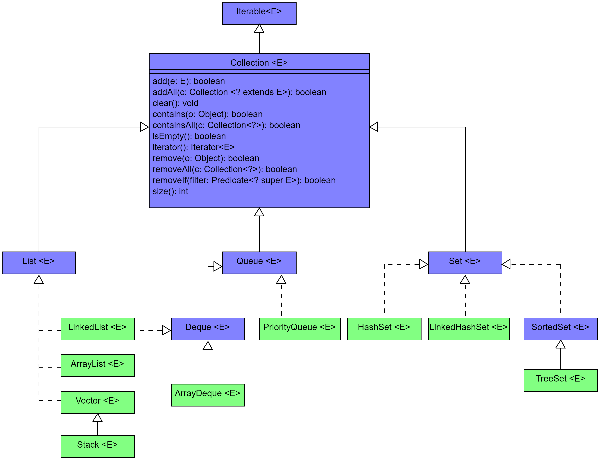
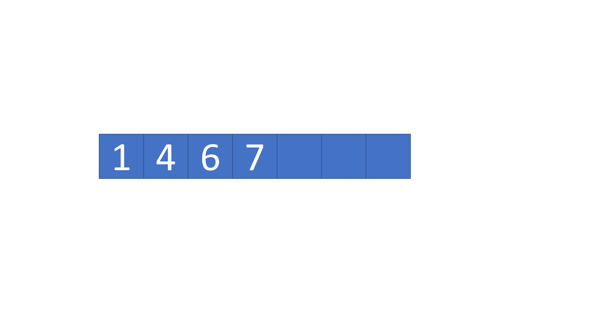
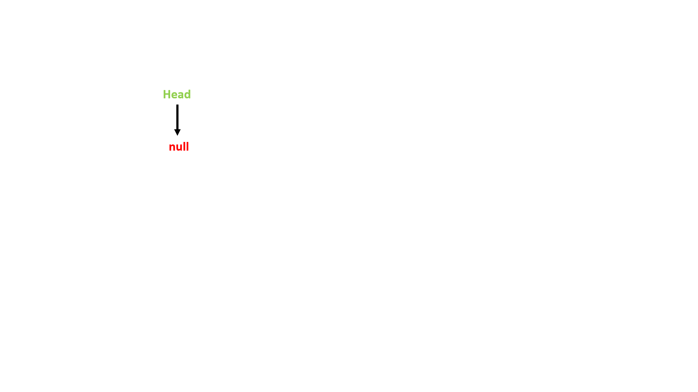
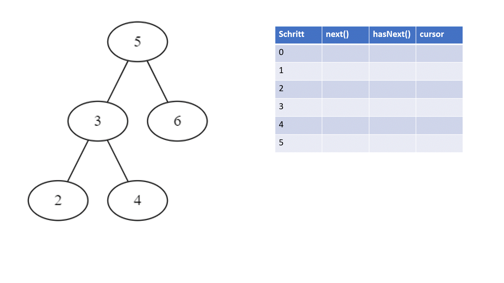
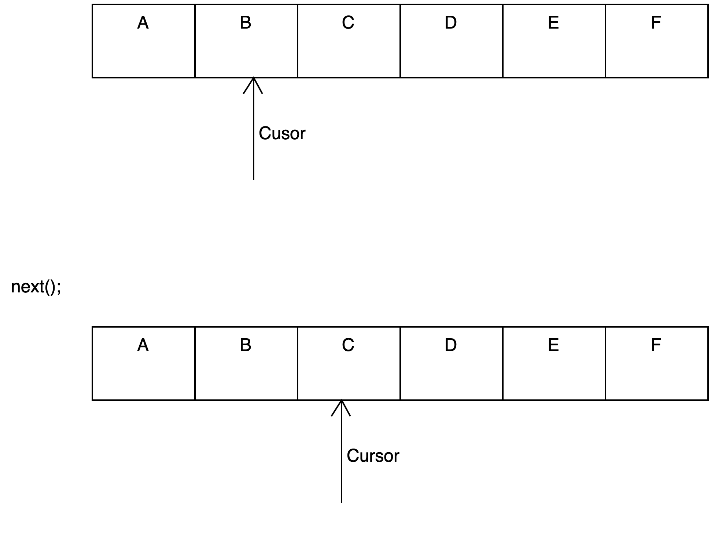
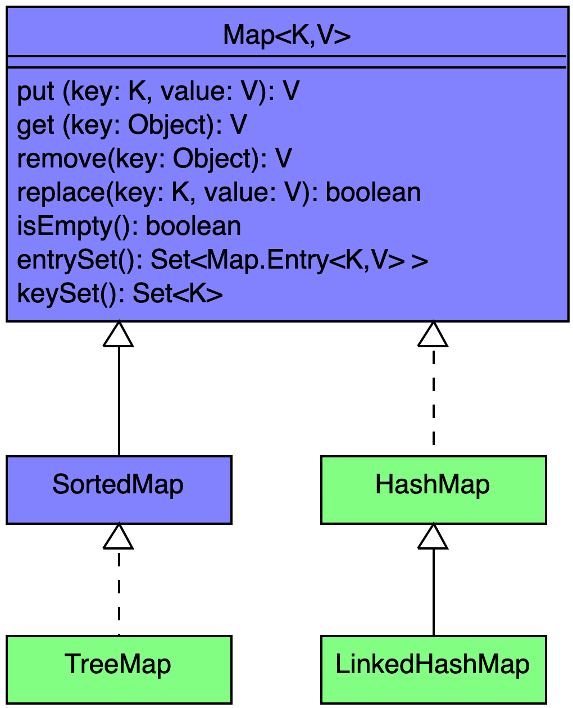

## Motivation

```java
private List <Entity> entities = new ArrayList<>();
  public void add(Entity e){
    if (!entities.contains(e))
      entities.add(e);
  }
```

::: notes
*   Reales Beispiel aus der Entwicklung des PM-Dungeon.
*   Eine Liste kann ein Objekt mehrfach enthalte, dieses Verhalten ist aber an dieser Stelle nicht gewünscht deswegen findet beim Einfügen eine Prüfung statt.
*   Eine Set hingegen, kann ein Objekt nur einmal enthalten.
*   Hier wird die falsche Datenstruktur genutzt, um Entitäten zu speichern.
:::


## Collection

{width="80%"}

[Abstrakte Klassen im UML nicht aufgeführt.]{.notes}

::: notes
*   `Collection` ist ein Interface des JDK.
*   Klassen die `Collection` implementieren speichern und verwalten eine Menge an Objekten.
*   Unter anderem gibt es die aus ADS bekannten Datentypen wie Listen, Sets, Queues etc.
*   Man unterscheidet zwischen 'sorted' (geordnete) Collections, welche eine bestimmte Reihenfolge der Elemente halten (Reihenfolge des Einfügens, Aufsteigende Werte etc.) und 'unsorted' (ungeordnete) Collections, welche keine bestimmte Reihenfolge halten.
*   Eine Übersicht, welche Collection welche Datenstruktur implementiert kann [hier](https://docs.oracle.com/en/java/javase/17/docs/api/java.base/java/util/doc-files/coll-overview.html#:~:text=Collection%20Implementations) eingesehen werden.
*   `List` Collections sind eine geordnete Liste an Objekten. Objekte können an jede Stell der Liste eingefügt, gelöscht oder geändert werden. Mithilfe des Index greift man auf ein spezifisches Objekt innerhalb der Liste zu.
*   `Queue` Collections sind eine geordnete Liste an Objekten. Objekte können nur an das Ende der Liste hinzugefügt werden und nur das Objekt am Anfang der Liste (der Head) kann verwendet oder gelöscht werden (First in first out).
*   `Set` Collections sind eine ungeordnete Menge an Objekten. Objekte können in einem Set nur einmal enthalten sein. Über das Set kann nicht direkt auf das Objekt zugegriffen werden. Es kann aber geprüft werden, ob ein spezifisches Objekt in einem Set gespeichert ist.
:::


## _ArrayList_

::: notes
{width="80%"}
:::

::: notes
*   Eine `ArrayList` ist ein sich dynamisch vergrößerndes Array.
*   Einer `ArrayList` liegt einen Array zu Grunde, wenn das Array voll ist, wird das Array um 50% vergrößert.
*   Daher kann auf ein Element per Index mit O(1) zugegriffen werden.
*   Wird ein Element aus der Liste gelöscht, rücken alle Nachfolgenden Einträge in der Liste einen Index auf.
*   Deshalb ist eine `ArrayList` effizient in der Abfrage und Manipulation von Einträgen aber weniger effizient beim Hinzufügen und löschen von Einträgen.
*   Per Default wird eine `ArrayList` mit einem Array der Länge 10 angelegt, sobald das erste Element eingefügt wird. Man kann die Startgröße auch im Konstruktoraufruf der `ArrayList` bestimmen. `new ArrayList<>(20)`
*   Die Methoden einer `ArrayList` sind nicht synchronized.
:::


## _LinkedList_

::: notes
{width="80%"}
:::

::: slides
{width="80%"}
:::

::: notes
*   Eine `LinkedList` ist die Implementierung einer doppelt verketteten Liste (diese kenne Sie bereits aus ADS) in Java.
*   Jeder Eintrag wird als Knoten repräsentiert, der den eigentlich Wert speichert und zusätzlich einen Verweis auf die Speicheradresse des Vorgänger und Nachfolger Knoten.
*   Der Head der `LinkedList` zeigt auf den Anfang der Liste, der Nachfolge des letzten Eintrag ist immer `null.
*   Der Zugriff auf ein Element in einer `LinkedList` beginnt immer am Anfang der Liste und ist daher O(n).
*   Neue Elemente werden an das Ende der Liste eingefügt, indem der letzte Eintrag einen Verweis auf den neuen Knoten bekommt. O(1)
*   Wenn ein Element aus der Liste gelöscht wird, muss die Liste neu verkettete werden. O(n)
*   Die Methoden einer `LinkedList` sind nicht synchronized.
:::


::: notes
## _Vector_ und _Stack_

*   Ein `Vector` ähnelt einer `ArrayList`
*   Das Array eines Vector wird jedoch verdoppelt, wenn es vergrößert wird.
*   Die Methoden von `Vector` sind synchronized.
*   Ein `Stack`ist ein veränderter Vector, damit dieser als Last in First out Stack genutzt werden kann.
:::


## Iterator

::: notes
{width="80%"}
:::

::: slides
{width="80%"}
:::

::: notes
*   Ein Objekt welches das `Iterator<E>`Interface implementiert ist ein Iterator und läuft eine spezifische Datenstruktur sequenziell durch.
*   Mithilfe eines Cursor merkt sich der Iterator, bei welchem Eintrag der Datenstruktur er aktuell ist.
*   Mit `forEachRemaining(Consumer<? super E> action)` kann eine Aktion auf alle verbleibenden Elemente in der Datenstruktur angewendet werden. Diese Methode ist im Interface per Default implementiert.
*   Mit `hasNext()`kann geprüft werden, ob noch ein weiteres Element in der Datenstruktur liegt.
*   Mit `next()`wird der Cursor einen Eintrag weiter geschoben und das Element zurückgegeben.
*   Mit `remove()`kann das letzte zurückgegebene Element aus der Datenstruktur entfernt werden. Diese Methode ist im Interface Default implementiert. Sie ist optional.
*   Viele Collection in Java haben einen implementierten Interator der verwendet werden kann. z.B `vector#iterator()`
:::


## Collections

{width="80%"}

::: notes
*    `Collections`ist eine Utility Klasse mit statischen Methoden, die auf `Collection`s ausgeführt werden.
:::


## _equqals()_ und _hashCode()_

Beispiel /hash_example

::: notes
*   `boolean equals(Object o)`ist eine Methode der Java `Object`-Class und wird genutzt um Objekte auf Gleichheit zu prüfen.
*   Die Default Implementierung von `equals` gibt nur dann `true` zurück, wenn die beiden zu vergleichenden Objekte identisch sind.
*   In der Praxis kann es sich anbieten diese Methode zu überschreieben und eigene Kriterien für Gleichheit aufzustellen.
*   Die `int hashCode()` Methode gibt den Hash-Wert eines Objektes zurück. Der Hash-Wert eins Objektes wird genutzt, um dieses in einen Hash-basierten Container abzulegen bzw. zu finden.
*   Wird die Methode `equals` überschrieben, sollte aich die Methode `hashCode` überschrieben werden.

### Der _hashCode_-Vertrag

*   Der Rückgabewert der `hashCode` Methode für ein Objekt bleibt über die Laufzeit einer Anwendung immer identisch, solange sich die Werte zur Prüfung der Gleichheit nicht ändern.
*   Wenn zwei Objekte nach der `equals` Methode identisch sind, so ist auch der Rückgabewert der `hashCode` Methode für beide Objekte identisch.
*   Sind zwei Objekte nach der `equals` Methode nicht identisch, kann der Rückgabewert der `hashCode` Methode dennoch identisch sein. Unterschiedliche Werte für unterschiedliche Objekte verbessern allerdings die Leistung von Hash-Berechnungen wie `HashMap`.

Auch wenn es meist sinvoll ist, ist es nicht nötig das `equals` und `compareTo` dasselbe Ergebnis liefern. `Comparable` ist für die Sortierung von Objekten gedacht, `equals` für einen Gleichheitscheck.
:::


## _Map_

{width="80%"}

[Abstrakte Klassen im UML nicht aufgeführt.]{.notes}

::: notes
*   Eine `Map` speichert Objekte als Paar von `Key` und `Value`.
*   Ein Paar von `Key` und `Value` ist ein Eintrag.
*   Der `Key`ist in einer Map einzigartig und wird verwendet, um auf `Value` zuzugreifen.
*   Ein `Value`kann mehrfach im einer Map enthalten sein.
*   `HashMap` hält keine Ordnung in den Einträgen. Verwenden den Hashwert, um Objekte zu speichern. Zugriff auf Einträge in einer `HashMap` ist O(1).
*   `LinkedHashMap` hält die Einträge in der Reihenfolge in der Sie eingefügt wurden.
*   `TreeMap` hält die Einträge in aufsteigender Reihenfolge.
:::


## _HashMap_

{width="80%"}

Beispiel /hash_example

::: notes
*   Eine `HashMap` speichert die Elemente in mehreren einfach verketteten Listen.
*   Dafür verwendet sie die inner-class `Node<K,V>`
*   Die Heads die auf den Anfang einer Liste zeigen, werden in Buckets gespeichert.
*   Initial besitzt eine HashMap 12 Buckets, diese werden bei Bedarf erweitert.
*   Um einen Eintrag hinzufügen, wird aus dem `hashCode` des Key-Objektes mithilfe der hash-funktion der Index des Buckets berechnet.
*   Ist der Bucket gefunden wird der `hashCode` des Key-Objektes genutzt, um zu prüfen ob bereits ein Eintrag mit denselben Hashcode in der Liste des Buckets liegt.
*   Wenn es bereits einen Eintrag gibt, wird mit `equals` geprüft, ob die Key-Objekte identisch sind, ist dies der Fall, wird der existierende Eintrag überschrieben. Wenn dies nicht der Fall ist, oder es keinen Eintrag mit demselben Hashcode gibt, dann wird der neue Eintrag an das Ende der Liste hinzugefügt.
*   Wenn eine Liste zu groß wird, (per Default mehr als 8 Einträge) wird diese durch einen self balancing binary search Tree ausgetauscht, um die Effizienz beim Suchen von Einträgen zu wahren.
*   `Hash-Map` Methoden sind nicht synchronized.
*   Unterstützt einen `null` Key. Es darf beliebig viele `null` Values geben.
*   Die Unterklasse `LinkedHashMap` kann Ordnung zwischen den Elementen halten. Dafür wird eine doppelt verkettete Liste verwendet.
:::


## _Hashtable_

*   Nicht zu verwechseln mit der Datenstruktur: Hash-Tabellen
*   Ist vergleichbar mit einer `HashMap`
*   `Hashtable` Methoden sind synchronized.
*   Kein Key oder Value darf `null` sein.


::: notes
## Überblick

{width="80%"}

Komplexitätswerte beziehen sich auf den Regelfall. Sonderfälle, wie das Vergrößern des Array einer ArrayList, können für erhöhte Komplexität sorgen.
:::


## Wrap-Up

*   Mit dem `Collection` Interface des Java Collection Frameworks können Datenstrukturen erstellt/verwendet werden, die eine Menge an Objekten speichern und verwalten.
*   Die `Collections`Klasse liefert statische Methoden die auf `Collection`s angewendet werden können.
*   Mithilfe eines `Iterator` kann über eine `Collection` iteriert werden.
*   Das `Map`Interface wird von Klassen implementiert die Paare (Key,Value) von Objekten speichert.
*   `Object.equals(Object o)` wird genutzt um Objekte auf inhaltliche Gleichheit zu prüfen.
*   `Object.hashCode()` wird genutzt, um einen Hash-Wert für ein Objekt zu berechnen und in Hash-Containern zu speichern/suchen.
*   Der `hashCode`-Vertrag definiert die Verhaltensweisen von `hashCode()`.


<!-- DO NOT REMOVE - THIS IS A LAST SLIDE TO INDICATE THE LICENSE AND POSSIBLE EXCEPTIONS (IMAGES, ...). -->
::: slides
## LICENSE


Unless otherwise noted, this work is licensed under CC BY-SA 4.0.
:::
