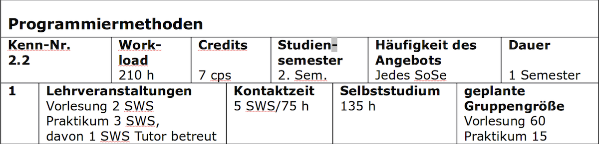

## Worum geht's hier?

*   Verständnis für die wichtigsten Konzepte im Compilerbau
*   Kenntnis relevanter aktueller Tools/Frameworks
*   Verständnis für wichtige Sprachparadigmen

=> Aufteilung: 40% Konzepte/Theorie, 60% Anwendung

## Überblick Modulinhalte

1.  Lexikalische Analyse: Scanner/Lexer
    *   Reguläre Ausdrücke
    *   Klassisches Vorgehen: RegExp nach NFA (Thompson's Construction),
        NFA nach DFA (Subset Construction), DFA nach Minimal DFA (Hopcroft's Algorithm)
    *   Manuelle Implementierung, Look-Ahead
    *   Generierung mit ANTLR und Flex
    *   Error Recovery

2.  Syntaxanalyse: Parser
    *   Kontextfreie Grammatiken (CFG), Chomsky
    *   LL-Parser (Top-Down-Parser)
        *   FIRST, FOLLOW
        *   Tabellenbasierte Verfahren
        *   Rekursiver Abstieg
        *   LL(1), LL(k), LL(*)
        *   Umgang mit linksrekursiven Grammatiken
        *   Umgang mit Vorrang-Regeln und Assoziativität
        *   Backtracking, Memoizing, Predicated Parsers; ANTLR4: ALL(*)
    *   LR-Parser (Bottom-Up-Parser)
        *   Shift-Reduce
        *   LR(0), SLR(1), LR(1), LALR(1)
    *   Generierung mit ANTLR und Bison
    *   Error Recovery
    *   Grenze Lexer und Parser (aus praktischen Gesichtspunkten)

3.  Symboltabellen
    *   Berücksichtigung unterschiedlicher Sprachparadigmen
    *   Typen, Klassen, Polymorphie
    *   Namen und Scopes

4.  Semantische Analyse und Optimierungen
    *   Attributierte Grammatiken: L-attributed vs. R-attributed grammars
    *   Typen, Typ-Inferenz, Type Checking
    *   Datenfluss-Analyse
    *   Optimierungen: Peephole u.a.

5.  Zwischencode: Intermediate Representation (IR), LLVM

6.  Interpreter
    *   AST-Traversierung
    *   Read-Eval-Schleife
    *   Resolver: Beschleunigung bei der Interpretation

7.  Compiler
    *   Speicherlayout
    *   Erzeugen von Byte-Code
    *   Ausführen in einer Virtuellen Maschine

## Erwartungen an Sie

*   90h Selbststudium => ca. 6h Arbeitszeit pro Woche!

Zeiten sind Richtwerte! -- Manche brauchen länger, manche sind schneller ...

Die Praktikumsaufgaben sollen Ihnen helfen, sich mit den Inhalten der
Vorlesung auseinander zu setzen. Die Abgabeform und die Bedingungen an das
Testat sind bewusst so gewählt, damit Sie im Praktikum untereinander in eine
Diskussion eintreten (können). Nutzen Sie diese Chance und verhalten Sie sich
aktiv -- so macht das Praktikum Spaß und bringt allen mehr.

Studieren Sie! Studieren bedeutet, sich **selbstständig** mit einem Thema
auseinander zu setzen, zu vertiefen, zu üben, Zusammenhänge herzustellen.
Die Lehrveranstaltung unterstützt Sie dabei, indem die wichtigsten Themen
ausgesucht, in eine zeitliche Reihenfolge gebracht und didaktisch aufbereitet
werden, so dass Sie sich die Inhalte leichter erschließen können. Es gibt
aber viele weitere Themen und Dinge, die nicht besprochen werden können (schon
aus rein zeitlichen Gründen), die aber (für Sie und/oder das Themengebiet)
interessant sein können!

Prüfungsrelevant sind selbstverständlich nur die besprochenen Inhalte. Der
Fokus liegt aber auf dem "Können", also dem **Beherrschen** der jeweiligen
Themen.

## Kognitive Stufen -- Einordnung Lernziele

Kennen (K1)
:   Abruf von Informationen (Begriffe, Fakten, Prinzipien)
:   (erkennen, nennen, bezeichnen, wiedergeben, kennen)

Verstehen (K2)
:   Begründen und Erläutern von Aussagen zum Thema
:   (beschreiben, zusammenfassen, vergleichen, klassifizieren, begründen, erklären)

Anwenden (K3)
:   Übertragung von erworbenem Wissen auf neue Situationen oder Anwendung zur Problemlösung
:   (ausführen, anwenden, beurteilen, entwerfen, nutzen)

Nach *Anderson, Krathwohl (eds)*: "A Taxonomy for Learning, Teaching, and
Assessing: A Revision of Bloom's Taxonomy of Educational Objectives",
Allyn & Bacon, 2001
