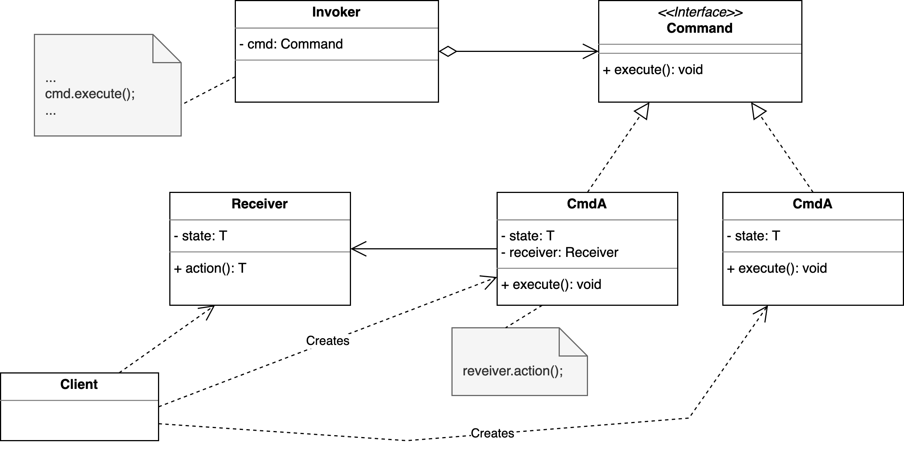

## Motivation

::: notes
Irgendwo im Dungeon wird es ein Objekt einer Klasse ähnlich wie `InputHandler`
geben mit einer Methode ähnlich zu `handleInput()`:
:::

```java
public class InputHandler {
    public void handleInput() {
        switch (keyPressed()) {
            case BUTTON_W -> hero.jump();
            case BUTTON_A -> hero.moveX();
            case ...
            default -> { ... }
        }
    }
}
```

::: notes
Diese Methode wird je Frame einmal aufgerufen, um auf eventuelle Benutzereingaben
reagieren zu können. Je nach gedrücktem Button wird auf dem Hero eine bestimmte
Aktion ausgeführt ...

Das funktioniert, ist aber recht unflexibel. Die Aktionen sind den Buttons fest
zugeordnet und erlauben keinerlei Konfiguration.
:::

[[Problem: Starre Zuordnung]{.bsp}]{.slides}


## Auflösen der starren Zuordnung über Zwischenobjekte

```{.java size="footnotesize"}
public interface Command { void execute(); }

public class Jump implements Command {
    private Entity e;
    public void execute() { e.jump(); }
}

public class InputHandler {
    private final Command wbutton = new Jump(hero);  // Über Ctor/Methoden setzen!
    private final Command abutton = new Move(hero);  // Über Ctor/Methoden setzen!

    public void handleInput() {
        switch (keyPressed()) {
            case BUTTON_W -> wbutton.execute();
            case BUTTON_A -> abutton.execute();
            case ...
            default -> { ... }
        }
    }
}
```

::: notes
Die starre Zuordnung "Button : Aktion" wird aufgelöst und über Zwischenobjekte konfigurierbar
gemacht.

Für die Zwischenobjekte wird ein Typ `Command` eingeführt, der nur eine `execute()`-Methode
hat. Für jede gewünschte Aktion wird eine Klasse davon abgeleitet, diese Klassen können auch
einen Zustand pflegen.

Den Buttons wird nun an geeigneter Stelle (Konstruktor, Methoden, ...) je ein Objekt der
jeweiligen Command-Unterklassen zugeordnet. Wenn ein Button betätigt wird, wird auf dem
Objekt die Methode `execute()` aufgerufen.

Damit die Kommandos nicht nur auf den Helden wirken können, kann man den Kommando-Objekten
beispielsweise noch eine Entität mitgeben, auf der das Kommando ausgeführt werden soll. Im
Beispiel oben wurde dafür der `hero` genutzt.
:::


## Command: Objektorientierte Antwort auf Callback-Funktionen

{web_width="80%"}

::: notes
Im Command-Pattern gibt es vier beteiligte Parteien: Client, Receiver, Command und Invoker.

Ein Command ist die objektorientierte Abstraktion eines Befehls. Es hat möglicherweise
einen Zustand, und und kennt "seinen" Receiver und kann beim Aufruf der `execute()`-Methode
eine vorher verabredete Methode auf diesem Receiver-Objekt ausführen.

Ein Receiver ist eine Klasse, die Aktionen durchführen kann. Sie kennt die anderen Akteure
nicht.

Der Invoker (manchmal auch "Caller" genannt) ist eine Klasse, die Commands aggregiert und die
die Commandos "ausführt", indem hier die `execute()`-Methode aufgerufen wird. Diese Klasse
kennt nur das `Command`-Interface und keine spezifischen Kommandos (also keine der Sub-Klassen).
Es kann zusätzlich eine gewisse Buchführung übernehmen, etwa um eine Undo-Funktionalität zu
realisieren.

Der Client ist ein Programmteil, der ein Command-Objekt aufbaut und dabei einen passenden
Receiver übergibt und der das Command-Objekt dann zum Aufruf an den Invoker weiterreicht.


In unserem Beispiel lassen sich die einzelnen Teile so sortieren:

*   Client: Klasse `InputHandler` (erzeugt neue `Command`-Objekte im obigen Code) bzw. `main()`,
    wenn man die `Command`-Objekte dort erstellt und an den Konstruktor von `InputHandler`
    weiterreicht
*   Receiver: Objekt `hero` der Klasse `Hero` (auf diesem wird eine Aktion ausgeführt)
*   Command: `Jump` und `Move`
*   Invoker: `InputHandler` (in der Methode `handleInput()`)
:::


## Undo

::: notes
Wir könnten das `Command`-Interface um ein paar Methoden erweitern:

```java
public interface Command {
    void execute();
    void undo();
    Command newCommand(Entity e);
}
```

Jetzt kann jedes Command-Objekt eine neue Instanz erzeugen mit der
Entity, die dann dieses Kommando empfangen soll:
:::

```{.java size="scriptsize"}
public class Move implements Command {
    private Entity e;
    private int x, y, oldX, oldY;

    public void execute() { oldX = e.getX();  oldY = e.getY();  x = oldX + 42;  y = oldY;  e.moveTo(x, y); }
    public void undo() { e.moveTo(oldX, oldY); }
    public Command newCommand(Entity e) { return new Move(e); }
}

public class InputHandler {
    private final Command wbutton;
    private final Command abutton;
    private final Stack<Command> s = new Stack<>();

    public void handleInput() {
        Entity e = getSelectedEntity();
        switch (keyPressed()) {
            case BUTTON_W -> { s.push(wbutton.newCommand(e)); s.peek().execute(); }
            case BUTTON_A -> { s.push(abutton.newCommand(e)); s.peek().execute(); }
            case BUTTON_U -> s.pop().undo();
            case ...
            default -> { ... }
        }
    }
}
```

::: notes
Über den Konstruktor von `InputHandler` (im Beispiel nicht gezeigt) würde man
wie vorher die `Command`-Objekte für die Buttons setzen. Es würde aber in jedem
Aufruf von `handleInput()` abgefragt, was gerade die selektierte Entität ist und
für diese eine neue Instanz des zur Tastatureingabe passenden `Command`-Objekts
erzeugt. Dieses wird nun in einem Stack gespeichert und danach ausgeführt.

Wenn der Button "U" gedrückt wird, wird das letzte `Command`-Objekt aus dem
Stack genommen (Achtung: Im echten Leben müsste man erst einmal schauen, ob hier
noch was drin ist!) und auf diesem die Methode `undo()` aufgerufen. Für das
Kommando `Move` ist hier skizziert, wie ein Undo aussehen könnte: Man muss einfach
bei jedem `execute()` die alte Position der Entität speichern, dann kann man
sie bei einem `undo()` wieder auf diese Position verschieben. Da für jeden Move
ein neues Objekt angelegt wird und dieses nur einmal benutzt wird, braucht man
keine weitere Buchhaltung ...
:::


## Wrap-Up

**Command-Pattern**: Kapsele Befehle in ein Objekt

\bigskip

*   `Command`-Objekte haben eine Methode `execute()` und führen darin Aktion auf Receiver aus
*   `Receiver` sind Objekte, auf denen Aktionen ausgeführt werden (Hero, Monster, ...)
*   `Invoker` hat `Command`-Objekte und ruft darauf `execute()` auf
*   `Client` kennt alle und baut alles zusammen

\vfill

**Objektorientierte Antwort auf Callback-Funktionen**


<!-- DO NOT REMOVE - THIS IS A LAST SLIDE TO INDICATE THE LICENSE AND POSSIBLE EXCEPTIONS (IMAGES, ...). -->
::: slides
## LICENSE


Unless otherwise noted, this work is licensed under CC BY-SA 4.0.
:::
