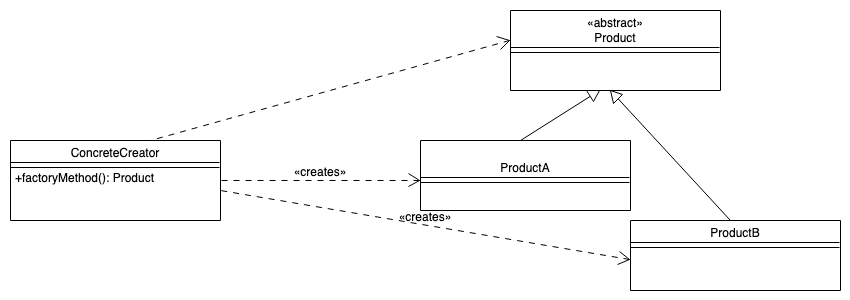

## Motivation: Ticket-App

*   Nutzer geben Fahrtziel an (und nicht die Ticketart!)

\bigskip

*   Ticket-App bucht passendes Ticket
    *   User muss nicht die konkreten Ticketarten kennen
    *   Ticketarten lassen sich leicht austauschen

\bigskip
\bigskip

=> **Factory-Method-Pattern**: Objekte sollen nicht direkt durch den Nutzer erzeugt werden

## Factory-Method-Pattern

{width="80%"}

## Hands-On: Ticket-App

Implementieren Sie eine Ticket-App, die verschiedene Tickets mit
Hilfe des Factory-Method Entwurfsmusters generiert.

[UML; Konsole: factory.FactoryBeispiel]{.bsp}

## Wrap-Up

*   Konkrete Objekte sollen nicht direkt über Konstruktor erzeugt werden
*   (Statische) Hilfsmethode, die aus Parameter das "richtige" Objekte erzeugt

\smallskip

*   Vorteil:
    *   Nutzer kennt nur das Interface
    *   Konkrete Klassen lassen sich leicht austauschen

<!-- DO NOT REMOVE - THIS IS A LAST SLIDE TO INDICATE THE LICENSE AND POSSIBLE EXCEPTIONS (IMAGES, ...). -->
::: slides
## LICENSE

Unless otherwise noted, this work is licensed under CC BY-SA 4.0.
:::
