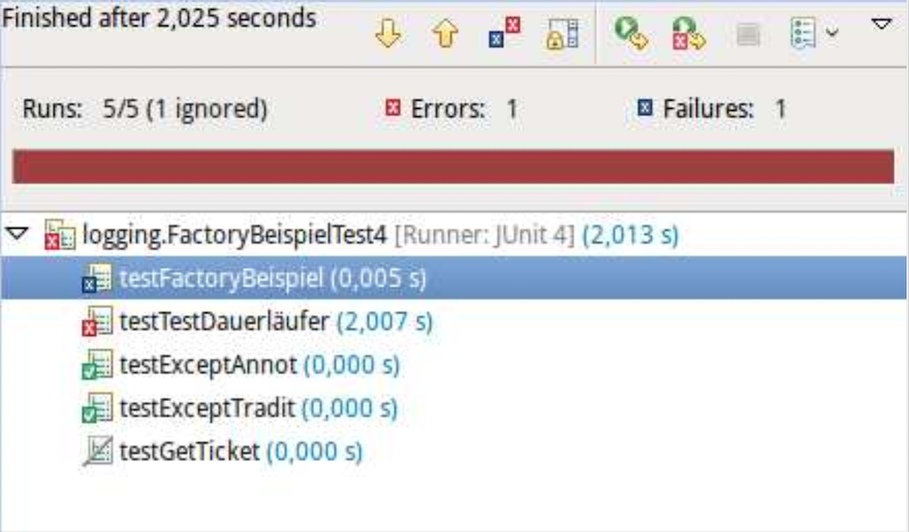

## Software-Fehler und ihre Folgen


[Ursachen für Fehler?]{.bsp}

::: notes
### (Einige) Ursachen für Fehler

*   Zeit- und Kostendruck
*   Mangelhafte Anforderungsanalyse
*   Hohe Komplexität
*   Mangelhafte Kommunikation
*   Keine/schlechte Teststrategie
*   Mangelhafte Beherrschung der Technologie
*   ...
:::


## Irgendjemand muss mit Deinen Bugs leben!

::: notes
Leider gibt es im Allgemeinen keinen Weg zu zeigen, dass eine Software korrekt ist.
Man kann (neben formalen Beweisansätzen) eine Software nur unter möglichst vielen
Bedingungen ausprobieren, um zu schauen, wie sie sich verhält, und um die dabei zu
Tage tretenden Bugs zu fixen.

Mal abgesehen von der verbesserten *User-Experience* führt weniger fehlerbehaftete
Software auch dazu, dass man seltener mitten in der Nacht geweckt wird, weil irgendwo
wieder ein Server gecrasht ist ... Weniger fehlerbehaftete Software ist auch leichter
zu ändern und zu pflegen! In realen Projekten macht Maintenance den größten Teil an der
Softwareentwicklung aus ... Während Ihre Praktikumsprojekte vermutlich nach der Abgabe
nie wieder angeschaut werden, können echte Projekte viele Jahre bis Jahrzehnte leben!
D.h. irgendwer muss sich dann mit Ihren Bugs herumärgern -- vermutlich sogar Sie selbst ;)
:::

> Always code as if the guy who ends up maintaining your code will be a
> violent psychopath who knows where you live. Code for readability.
>
> \hfill -- [John F. Woods](https://groups.google.com/g/comp.lang.c++/c/rYCO5yn4lXw/m/oITtSkZOtoUJ)

:::
Siehe auch [OSCON](https://twitter.com/andypiper/status/490952891058757632) ...
:::

::: notes
Da wir nur wenig Zeit haben und zudem vergesslich sind und obendrein die Komplexität
eines Projekts mit der Anzahl der Code-Zeilen i.d.R. nicht-linear ansteigt, müssen wir
das Testen automatisieren. Und hier kommt JUnit ins Spiel :)
:::


## Was wann testen? Wichtigste Teststufen

*   **Modultest**
    *   Testen einer Klasse und ihrer Methoden
    *   Test auf gewünschtes Verhalten (Parameter, Schleifen, ...)

\bigskip

*   **Integrationstest**
    *   Test des korrekten Zusammenspiels mehrerer Komponenten
    *   Konzentration auf Schnittstellentests

\bigskip

*   **Systemtest**
    *   Test des kompletten Systems unter produktiven Bedingungen
    *   Orientiert sich an den aufgestellten Use Cases
    *   Funktionale und nichtfunktionale Anforderungen testen

\vfill
=> Verweis auf Wahlfach "Softwarequalität"


## JUnit: Test-Framework für Java

::: notes
**JUnit** --- Open Source Java Test-Framework zur Erstellung und
Durchführung wiederholbarer Tests
:::

*   JUnit 3
    *   Tests müssen in eigenen Testklassen stehen
    *   Testklassen müssen von Klasse `TestCase` erben
    *   Testmethoden müssen mit dem Präfix "`test`" beginnen

\bigskip

*   **JUnit 4**
    *   Annotation `@Test` für Testmethoden
    *   Kein Zwang zu spezialisierten Testklassen  [(insbesondere kein Zwang mehr zur Ableitung von `TestCase`)]{.notes}
    *   Freie Namenswahl für Testmethoden  [(benötigen nicht mehr Präfix "`test`")]{.notes}

    ::: notes
    Damit können prinzipiell auch direkt im Source-Code Methoden als
    JUnit-Testmethoden ausgezeichnet werden ... (das empfiehlt sich in der
    Regel aber nicht)
    :::

\bigskip

*   *JUnit 5 = JUnit Platform + JUnit Jupiter + JUnit Vintage*
    *   Erweiterung um mächtigere Annotationen
    *   Aufteilung in spezialisierte Teilprojekte

    ::: notes
    Das Teilprojekt "JUnit Platform" ist die Grundlage für das JUnit-Framework. Es bietet
    u.a. einen Console-Launcher, um Testsuiten manuell in der Konsole zu starten oder über
    Builder wie Ant oder Gradle.

    Das Teilprojekt "JUnit Jupiter" ist das neue Programmiermodell zum Schreiben von Tests
    in JUnit 5. Es beinhaltet eine TestEngine zum Ausführen der in Jupiter geschriebenen
    Tests.

    Das Teilprojekt "JUnit Vintage" beinhaltet eine TestEngine zum Ausführen von Tests,
    die in JUnit 3 oder JUnit 4 geschrieben sind.
    :::

::: notes
*Anmerkung*: Wie der Name schon sagt, ist das Framework für Modultests
("Unit-Tests") gedacht. Man kann damit aber auch auf anderen Teststufen
arbeiten!

*Anmerkung*: Im Folgenden besprechen wir JUnit am Beispiel **JUnit 4**, da diese Version
des Frameworks besonders stark verbreitet ist und JUnit 5 (trotz offiziellem Release) immer
noch stellenweise unfertig wirkt. Auf Unterschiede zu JUnit 5 wird an geeigneter Stelle
hingewiesen (abgesehen von Import-Statements). Mit JUnit 3 sollte nicht mehr aktiv
gearbeitet werden, d.h. insbesondere keine neuen Tests mehr erstellt werden, da diese
Version nicht mehr weiterentwickelt wird.
:::


## Anlegen und Organisation der Tests mit JUnit

:::::: columns
::: {.column width="50%"}

\vspace{10mm}

*   Anlegen neuer Tests: Klasse auswählen, Kontextmenü `New > JUnit Test Case`

\bigskip

*   **Best Practice**: \newline\ [Spiegeln der Paket-Hierarchie]{.alert}
    *   Toplevel-Ordner `test` (statt `src`)
    *   Package-Strukturen spiegeln
    *   Testklassen mit Suffix "`Test`"

:::
::: {.column width="50%"}

\hspace*{2mm}


:::
::::::

::: notes
Vorteile dieses Vorgehens:

*   Die Testklassen sind aus Java-Sicht im selben Package wie die Source-Klassen,
    d.h. Zugriff auf Package-sichtbare Methoden etc. ist gewährleistet
*   Durch die Spiegelung der Packages in einem separaten Testordner erhält man
    eine gute getrennte Übersicht über jeweils die Tests und die Sourcen
*   Die Wiederverwendung des Klassennamens mit dem Anhang "Test" erlaubt die
    schnelle Erkennung, welche Tests hier vorliegen

In der Paketansicht liegen dann die Source- und die Testklassen immer direkt
hintereinander (da sie im selben Paket sind und mit dem selben Namen anfangen)
=> besserer Überblick!


### Anmerkung: Die (richtige) JUnit-Bibliothek muss im Classpath liegen!

Eclipse bringt für JUnit 4 und JUnit 5 die nötigen Jar-Dateien mit und fragt beim
erstmaligen Anlegen einer neuen Testklasse, ob die für die ausgewählte Version
**passenden JUnit-Jars zum Build-Path hinzugefügt** werden sollen.

IntelliJ bringt ebenfalls eine JUnit 4 Bibliothek mit, die zum Projekt als Abhängigkeit
hinzugefügt werden muss. Für JUnit 5 bietet IntelliJ an, die Jar-Dateien herunterzuladen
und in einem passenden Ordner abzulegen.

Alternativ lädt man die Bibliotheken entsprechend der Anleitung unter [junit.org](https://junit.org/)
herunter und bindet sie in das Projekt ein.
:::


## JUnit 4+5: Definition von Tests mit _@Test_

::: notes
Annotation `@Test` vor Testmethode schreiben
:::

```java
import org.junit.Test;
import static org.junit.Assert.*;

public class FactoryBeispielTest4 {
    @Test
    public void testGetTicket() {
        fail("not implemented");
    }
}
```

::: notes
Für JUnit 5 muss statt `org.junit.Test` entsprechend `org.junit.jupiter.api.Test` importiert werden.

Während in JUnit 4 die Testmethoden mit der Sichtbarkeit `public` versehen sein müssen und keine
Parameter haben (dürfen), spielt die Sichtbarkeit in JUnit 5 keine Rolle (und die Testmethoden dürfen Parameter
aufweisen => vgl. Abschnitt "Dependency Injection for Constructors and Methods" in der JUnit-Doku).
:::


## JUnit 4: Ergebnis prüfen

Klasse **`org.junit.Assert`** enthält diverse **statische** Methoden zum Prüfen:

\bigskip

```java
// Argument muss true bzw. false sein
void assertTrue(boolean);
void assertFalse(boolean);

// Gleichheit im Sinne von equals()
void assertEquals(Object, Object);

// Test sofort fehlschlagen lassen
void fail();

...
```

::: notes
Für JUnit 5 finden sich die Assert-Methoden im Package `org.junit.jupiter.api.Assertions`.
:::


## Anmerkung zum statischen Import

::: notes
Bei normalem Import der Klasse `Assert` muss man jeweils den voll qualifizierten Namen
einer statischen Methode nutzen: `Assert.fail()`.

Alternative statischer Import: `import static org.junit.Assert.fail;`
=> *Statische Member* der importierten Klasse (oder Interface)
werden über ihre *unqualifizierten Namen* zugreifbar.
[Achtung:]{.alert} Namenskollisionen möglich!

```java
// nur bestimmtes Member importieren
import static packageName.className.staticMemberName;
// alle statischen Member importieren
import static packageName.className.*;
```
:::

*   Beispiel normaler Import:

    ```java
    import org.junit.Assert;
    Assert.fail("message");
    ```

\bigskip

*   Beispiel statischer Import:

    ```java
    import static org.junit.Assert.fail;
    fail("message");
    ```


## Mögliche Testausgänge bei JUnit

:::::: columns
::: {.column width="55%"}



:::
::: {.column width="44%"}


1.  **Error**:  [Fehler im Programm (Test)]{.notes}
    *   Unbehandelte Exception
    *   Abbruch (Timeout)

\bigskip

2.  **Failure**: Testausgang negativ
    *   Assert fehlgeschlagen
    *   `Assert.fail()` aufgerufen

\bigskip

3. **OK**

:::
::::::

[[Anmerkung zu Asserts pro Testmethode]{.bsp}]{.slides}

::: notes
### Anmerkungen zu Assert

*   Pro Testmethode möglichst nur **ein** Assert verwenden!
*   Anderenfalls: Schlägt ein Assert fehl, wird der Rest nicht mehr überprüft ...
:::


## Setup und Teardown: Testübergreifende Konfiguration

```java
private Studi x;

@Before
public void setUp() { x = new Studi(); }

@Test
public void testToString() {
    // Studi x = new Studi();
    assertEquals(x.toString(), "Heinz (15cps)");
}
```

\bigskip
\bigskip

**`@Before`**
:   wird **vor jeder** Testmethode aufgerufen

**`@BeforeClass`**
:   wird **einmalig** vor allen Tests aufgerufen (`static`!)

**`@After`**
:   wird **nach jeder** Testmethode aufgerufen

**`@AfterClass`**
:   wird **einmalig** nach allen Tests aufgerufen (`static`!)


::: notes
In JUnit 5 wurden die Namen dieser Annotationen leicht geändert:

| JUnit 4        | JUnit 5       |
|:---------------|:--------------|
| `@Before`      | `@BeforeEach` |
| `@After`       | `@AfterEach`  |
| `@BeforeClass` | `@BeforeAll`  |
| `@AfterClass`  | `@AfterAll`   |
:::


::: notes
### Beispiel für den Einsatz von _@Before_

Annahme: **alle/viele** Testmethoden brauchen **neues** Objekt `x` vom Typ `Studi`

```java
private Studi x;

@Before
public void setUp() {
    x = new Studi("Heinz", 15);
}

@Test
public void testToString() {
    // Studi x = new Studi("Heinz", 15);
    assertEquals(x.toString(), "Name: Heinz, credits: 15");
}

@Test
public void testGetName() {
    // Studi x = new Studi("Heinz", 15);
    assertEquals(x.getName(), "Heinz");
}
```
:::


::: notes
## Ignorieren von Tests

*   Hinzufügen der Annotation `@Ignore`
*   Alternativ mit Kommentar: `@Ignore("Erst im nächsten Release")`

\bigskip

:::::: columns
::: {.column width="52%"}

```java
@Ignore("Warum ignoriert")
@Test
public void testBsp() {
    Bsp x = new Bsp();
    assertTrue(x.isTrue());
}
```

:::
::: {.column width="48%"}

\hspace*{2mm}


:::
::::::

In JUnit 5 wird statt der Annotation `@Ignore` die Annotation `@Disabled` mit
der selben Bedeutung verwendet. Auch hier lässt sich als Parameter ein String
mit dem Grund für das Ignorieren des Tests hinterlegen.
:::


## Vermeidung von Endlosschleifen: Timeout

::: notes
*   Testfälle werden nacheinander ausgeführt
*   Test mit Endlosschleife würde restliche Tests blockieren
*   Erweitern der `@Test`-Annotation mit Parameter "`timeout`": \newline
    => `@Test(timeout=2000)` (Zeitangabe in Millisekunden)
:::

:::::: columns
::: {.column width="52%"}

```java
@Test(timeout = 2000)
void testTestDauerlaeufer() {
    while (true) { ; }
}
```

:::
::: {.column width="44%"}

\hspace*{2mm}


:::
::::::

::: notes
In JUnit 5 hat die Annotation `@Test` keinen `timeout`-Parameter mehr.
Als Alternative bietet sich der Einsatz von `org.junit.jupiter.api.Assertions.assertTimeout`
an. Dabei benötigt man allerdings *Lambda-Ausdrücke* (Verweis auf spätere VL):

```java
@Test
void testTestDauerlaeufer() {
    assertTimeout(ofMillis(2000), () -> {
        while (true) { ; }
    });
}
```

(Beispiel von oben mit Hilfe von JUnit 5 formuliert)
:::


## Test von Exceptions: Expected

::: notes
Traditionelles Testen von Exceptions mit `try` und `catch`:
:::

```java
@Test
public void testExceptTradit() {
    try {
        int i = 0 / 0;
        fail("keine ArithmeticException ausgeloest");
    } catch (ArithmeticException aex) {
        assertNotNull(aex.getMessage());
    } catch (Exception e) {
        fail("falsche Exception geworfen");
    }
}
```

\pause
\bigskip

::: notes
Der `expected`-Parameter für die `@Test`-Annotation in JUnit 4 macht
dies deutlich einfacher: `@Test(expected = MyException.class)`
=> Test scheitert, wenn diese Exception **nicht** geworfen wird
:::

```java
@Test(expected = java.lang.ArithmeticException.class)
public void testExceptAnnot() {
    int i = 0 / 0;
}
```

::: notes
In JUnit 5 hat die Annotation `@Test` keinen `expected`-Parameter mehr.
Als Alternative bietet sich der Einsatz von `org.junit.jupiter.api.Assertions.assertThrows`
an. Dabei benötigt man allerdings *Lambda-Ausdrücke* (Verweis auf spätere VL):

```java
@Test
public void testExceptAnnot() {
    assertThrows(java.lang.ArithmeticException.class, () -> {
        int i = 0 / 0;
    });
}
```

(Beispiel von oben mit Hilfe von JUnit 5 formuliert)
:::


## Parametrisierte Tests

::: notes
Manchmal möchte man den selben Testfall mehrfach mit anderen Werten (Parametern)
durchführen.
:::

```java
class Sum {
    public int sum(int i, int j) {
        return i + j;
    }
}

class SumTest {
    @Test
    public void testSum() {
        Sum s = new Sum();
        assertEquals(s.sum(1, 1), 2);
    }
    // und mit (2,2, 4), (2,2, 5), ...????
}
```

::: notes
Prinzipiell könnte man dafür entweder in einem Testfall eine Schleife schreiben,
die über die verschiedenen Parameter iteriert. In der Schleife würde dann
jeweils der Aufruf der zu testenden Methode und das gewünschte Assert passieren.
Alternativ könnte man den Testfall entsprechend oft duplizieren mit jeweils den
gewünschten Werten.

Beide Vorgehensweisen haben Probleme: Im ersten Fall würde die Schleife bei
einem Fehler oder unerwarteten Ergebnis abbrechen, ohne dass die restlichen
Tests (Werte) noch durchgeführt würden. Im zweiten Fall bekommt man eine
unnötig große Anzahl an Testmethoden, die bis auf die jeweiligen Werte identisch
sind (Code-Duplizierung).
:::


::: notes
### Parametrisierte Tests mit JUnit 4

JUnit 4 bietet für dieses Problem sogenannte "parametrisierte Tests" an. Dafür
muss eine Testklasse in JUnit 4 folgende Bedingungen erfüllen:

1.  Die Testklasse wird mit der Annotation `@RunWith(Parameterized.class)`
    ausgezeichnet.
2.  Es muss eine öffentliche statische Methode geben mit der Annotation
    `@Parameters`. Diese Methode liefert eine Collection zurück, wobei jedes
    Element dieser Collection ein Array mit den Parametern für einen
    Durchlauf der Testmethoden ist.
3.  Die Parameter müssen gesetzt werden. Dafür gibt es zwei Varianten:
    a)  Für jeden Parameter gibt es ein öffentliches Attribut. Diese Attribute
        müssen mit der Annotation `@Parameter` markiert sein und können in den
        Testmethoden normal genutzt werden. JUnit sorgt dafür, dass für jeden
        Eintrag in der Collection aus der statischen `@Parameters`-Methode
        diese Felder gesetzt werden und die Testmethoden aufgerufen werden.
    b)  Alternativ gibt es einen Konstruktor, der diese Werte setzt. Die Anzahl
        der Parameter im Konstruktor muss dabei exakt der Anzahl (und
        Reihenfolge) der Werte in jedem Array in der von der statischen
        `@Parameters`-Methode gelieferten Collection entsprechen. Der
        Konstruktor wird für jeden Parametersatz einmal aufgerufen und die
        Testmethoden einmal durchgeführt.

Letztlich wird damit das Kreuzprodukt aus Testmethoden und Testdaten durchgeführt.
:::

[Beispiel: junit4.SumTestConstructor, junit4.SumTestParameters]{.bsp}


::: notes
### Parametrisierte Tests mit JUnit 5

In JUnit 5 werden parametrisierte Tests mit der Annotation `@ParameterizedTest`
gekennzeichnet (statt mit `@Test`).

Mit Hilfe von `@ValueSource` kann man ein einfaches Array von Werten (Strings
oder primitive Datentypen) angeben, mit denen der Test ausgeführt wird. Dazu
bekommt die Testmethode einen entsprechenden passenden Parameter:

```java
@ParameterizedTest
@ValueSource(strings = {"wuppie", "fluppie", "foo"})
void testWuppie(String candidate) {
    assertTrue(candidate.equals("wuppie"));
}
```

Alternativ lassen sich als Parameterquelle u.a. Aufzählungen (`@EnumSource`)
oder Methoden (`@MethodSource`) angeben.

*Hinweis*: Parametrisierte Tests werden in JUnit 5 derzeit noch als "*experimentell*"
angesehen!

[Beispiel: junit5.TestValueSource, junit5.TestMethodSource]{.bsp}
:::


## Testsuiten: Tests gemeinsam ausführen (JUnit 4)

::: notes
Eclipse: `New > Other > Java > JUnit > JUnit Test Suite`
:::

```java
import org.junit.runner.RunWith;
import org.junit.runners.Suite;
import org.junit.runners.Suite.SuiteClasses;

@RunWith(Suite.class)
@SuiteClasses({
    // Hier kommen alle Testklassen rein
    PersonTest.class,
    StudiTest.class
})

public class MyTestSuite {
    // bleibt leer!!!
}
```

::: notes
### Testsuiten mit JUnit 5

In JUnit 5 gibt es zwei Möglichkeiten, Testsuiten zu erstellen:

*   `@SelectPackages`: Angabe der Packages, die für die Testsuite zusammengefasst werden sollen
*   `@SelectClasses`: Angabe der Klassen, die für die Testsuite zusammengefasst werden sollen

```java
@RunWith(JUnitPlatform.class)
@SelectClasses({StudiTest5.class, WuppieTest5.class})
public class MyTestSuite5 {
    // bleibt leer!!!
}
```

Zusätzlich kann man beispielsweise mit `@IncludeTags` oder `@ExcludeTags` Testmethoden mit bestimmten Tags
einbinden oder ausschließen. Beispiel: Schließe alle Tests mit Tag "develop" aus: `@ExcludeTags("develop")`.
Dabei wird an den Testmethoden zusätzlich das Tag `@Tag` verwendet, etwas `@Tag("develop")`.

**Achtung**: Laut der offiziellen Dokumentation
[(Abschnitt "4.4.4. Test Suite")](https://junit.org/junit5/docs/current/user-guide/#running-tests-junit-platform-runner-test-suite)
gilt zumindest bei der Selection über `@SelectPackages` der Zwang zu einer Namenskonvention:
Es werden dabei nur Klassen gefunden, deren Name mit `Test` beginnt oder endet!
Weiterhin werden Testsuites mit der Annotation `@RunWith(JUnitPlatform.class)` **nicht**
auf der "JUnit 5"-Plattform ausgeführt, sondern mit der JUnit 4-Infrastuktur!
:::


## Wrap-Up

*   Testen ist genauso wichtig wie Coden
*   Richtiges Testen spart Geld, Zeit, ...
*   Tests auf verschiedenen Abstraktionsstufen

\smallskip

*   JUnit als Framework für (Unit-) Tests; hier JUnit 4 (mit Ausblick auf JUnit 5)
    *   Testmethoden mit Annotation `@Test`
    *   Aufbau der Testumgebung `@Before`
    *   Abbau der Testumgebung `@After`
    *   Steuern von Tests mit `@Ignore` oder `@Test(timout=XXX)`
    *   Exceptions einfordern mit `@Test(expected=package.Exception.class)`
    *   Tests zusammenfassen zu Testsuiten


<!-- DO NOT REMOVE - THIS IS A LAST SLIDE TO INDICATE THE LICENSE AND POSSIBLE EXCEPTIONS (IMAGES, ...). -->
::: slides
## LICENSE


Unless otherwise noted, this work is licensed under CC BY-SA 4.0.

\bigskip

### Exceptions
*   TODO (what, where, license)
:::
